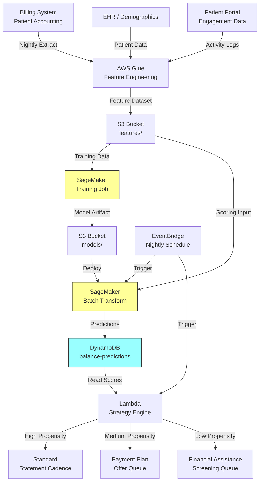

# Recipe 7.2: Propensity to Pay Scoring

**Complexity:** Simple · **Phase:** MVP · **Estimated Cost:** ~$0.001 per prediction

---

## The Problem

Revenue cycle teams in healthcare have a dirty secret: they treat every patient balance the same. A $47 copay from a retired teacher with a perfect payment history gets the same collection sequence as a $3,200 surgical balance from a 24-year-old who has already ignored three statements. Same letters. Same timing. Same phone calls. Same escalation path.

This is wildly inefficient. The average health system writes off 3-5% of net patient revenue as bad debt annually. For a mid-size hospital doing $500M in net patient revenue, that's $15-25M per year in balances that were theoretically collectible but never collected. Some of that is genuinely uncollectible. But a meaningful portion is money that could have been recovered with a different approach: an earlier payment plan offer, a financial counselor conversation at the right moment, or simply prioritizing outreach to the patients most likely to respond.

The problem isn't that revenue cycle teams are lazy. It's that they're overwhelmed. A typical health system has hundreds of thousands of open patient balances at any given time. The collection staff can make maybe 50-100 outreach calls per day. Without a way to prioritize, they work the list alphabetically, or by balance size, or by age of balance. None of these are optimal. The $8,000 balance that's 90 days old might belong to someone who always pays eventually (just slowly). The $200 balance that's 30 days old might belong to someone who will never pay regardless of how many letters you send.

What you actually want is a probability: for each open balance, what's the likelihood that this patient will pay this specific balance within a given timeframe? That probability lets you do three things that transform revenue cycle operations:

1. **Prioritize outreach.** Focus your limited staff time on balances where outreach will actually change the outcome. Don't waste calls on patients who will pay anyway or patients who won't pay regardless.

2. **Offer payment plans early.** For patients with moderate propensity but high balances, an early payment plan offer (before the balance goes to collections) dramatically improves recovery rates. But you can't offer payment plans to everyone; the administrative overhead is too high.

3. **Right-size collection intensity.** Patients with very low propensity to pay may qualify for financial assistance or charity care. Identifying them early saves everyone time and preserves the patient relationship.

This is essentially credit scoring for healthcare. The financial services industry solved this problem decades ago. Healthcare is catching up, and the data is actually richer than what a credit bureau has (you know the patient's clinical context, their insurance situation, their visit history). The challenge is doing it ethically and in compliance with healthcare-specific regulations.

---

## The Technology: Scoring Payment Likelihood from Behavioral Data

### The Credit Scoring Analogy (and Where It Breaks Down)

If you've ever applied for a credit card, you've been scored by a propensity model. FICO scores predict the likelihood that a borrower will default on a loan. They use payment history, credit utilization, length of credit history, types of credit, and recent inquiries. The output is a number (300-850) that lenders use to make decisions.

Propensity to pay in healthcare works on the same principle: use historical behavior to predict future behavior. But there are important differences that make the healthcare version both easier and harder than consumer credit scoring.

**Easier because:** You have richer data. You know the patient's visit history, their insurance coverage, their balance history with your specific organization, whether they've been on payment plans before, and whether they have a pattern of paying after the second statement vs. the fourth. Consumer credit bureaus don't have this level of relationship-specific data.

**Harder because:** The ethical and regulatory landscape is more complex. In consumer lending, it's broadly accepted that creditworthiness determines access to credit. In healthcare, ability to pay should never determine access to care. Your propensity model must be used to optimize collection strategy, not to deny services. This distinction matters for model design, feature selection, and how you communicate results to staff.

**Harder because:** Healthcare balances are heterogeneous in ways that credit card balances aren't. A $25 copay, a $500 deductible, and a $15,000 surgical balance are fundamentally different collection problems. The patient's propensity to pay a $25 copay tells you almost nothing about their propensity to pay a $15,000 balance. Your model needs to account for balance characteristics, not just patient characteristics.

### Binary Classification with Calibrated Probabilities

Like no-show prediction (Recipe 7.1), propensity to pay is a binary classification problem at its core. Given features about a patient and their balance, predict: will this balance be paid within N days? The output is a probability between 0 and 1.

The critical requirement here is **calibration**. A predicted probability of 0.7 must actually mean that 70% of balances with that score get paid. Why? Because downstream decisions depend on the probability being meaningful, not just the ranking being correct. If you're deciding whether to offer a payment plan (which has administrative cost), you need to know the actual expected recovery, not just that this balance is "more likely to pay than that one."

Logistic regression is a natural starting point because it produces well-calibrated probabilities by default. Gradient-boosted trees (XGBoost, LightGBM) typically have better discrimination (AUC) but worse calibration out of the box. You can fix this with post-hoc calibration (Platt scaling or isotonic regression), but it's an extra step that's easy to forget.

### Features That Drive Payment Behavior

The features that predict healthcare payment behavior fall into four categories:

**Patient payment history.** The strongest predictor, by far. How has this patient handled previous balances with your organization? Did they pay in full? Pay partially? Ignore statements entirely? Respond to the first statement or the fourth? Set up payment plans and complete them, or set up payment plans and default? A patient's track record with your specific organization is more predictive than any external credit data.

**Balance characteristics.** The amount matters enormously. Patients pay small balances at much higher rates than large ones (obvious, but the relationship isn't linear). The type of service matters: patients are more likely to pay for services they chose (elective procedures) than services that happened to them (emergency visits). Whether insurance has already processed the claim matters: a balance that's clearly the patient's responsibility after insurance adjudication gets paid at higher rates than a balance where the patient thinks "insurance should have covered this."

**Insurance and financial context.** Insurance type correlates with payment behavior, but be careful here (more in the ethics section). Self-pay patients have different patterns than patients with high-deductible health plans. Patients who have previously qualified for financial assistance may have changed circumstances. Patients with multiple open balances behave differently than those with a single balance.

**Engagement signals.** Has the patient logged into the patient portal recently? Have they opened the electronic statement? Have they called billing with questions? Have they made partial payments? These engagement signals are highly predictive of eventual payment and are often overlooked. A patient who calls to dispute a charge is actually more likely to eventually pay than one who silently ignores all communication.

### The Outcome Definition Problem

Here's a subtlety that trips up first-time builders: what does "paid" mean?

- Paid in full within 30 days?
- Paid in full within 90 days?
- Paid in full within 365 days?
- Made any payment (even partial) within 90 days?
- Completed a payment plan (even if it took 12 months)?

Each of these is a valid outcome definition, and each produces a different model with different operational implications. A model trained on "paid in full within 30 days" will be very conservative (most balances don't get paid that fast). A model trained on "any payment within 365 days" will be very optimistic.

The right choice depends on your operational question. If you're deciding who to send to external collections at 90 days, train on a 90-day outcome. If you're deciding who to offer a payment plan at 30 days, train on a 30-day outcome. You may need multiple models for different decision points in your collection workflow.

### The General Architecture Pattern

```
[Feature Store] → [Model Training] → [Scoring Service] → [Strategy Engine]
```

**Feature Store.** Pre-computed patient and balance features, updated daily. Pulls from your billing system, patient accounting, EHR demographics, and portal engagement data. Computes derived features: historical payment rate, average days to pay, balance-to-income ratio estimates, engagement recency.

**Model Training.** Periodic retraining on historical balances with known outcomes. The training dataset is balances that are old enough to have a definitive outcome (paid, partially paid, written off, sent to collections). Outputs a calibrated classification model and performance metrics.

**Scoring Service.** Scores new or open balances on a schedule (daily or when a balance status changes). Outputs a probability and the top contributing features. Can run as batch (score all open balances nightly) or real-time (score at the point of service when a new balance is created).

**Strategy Engine.** Maps probabilities to actions. High propensity (>0.8): standard statement cadence, no special intervention needed. Medium propensity (0.4-0.8): proactive payment plan offer, financial counselor outreach. Low propensity (<0.4): early financial assistance screening, charity care evaluation. The thresholds are business decisions, not model decisions.

---

## The AWS Implementation

### Why These Services

**Amazon SageMaker for model training and hosting.** SageMaker handles the full ML lifecycle for this tabular classification problem. The built-in XGBoost algorithm is ideal for the feature types involved (mix of categorical, numerical, and ratio features). SageMaker's batch transform mode lets you score all open balances nightly without maintaining a persistent endpoint. For organizations that want real-time scoring at the point of service, a SageMaker real-time endpoint works too, but batch is usually sufficient since collection strategy doesn't need sub-second latency.

**Amazon S3 for data and model storage.** Training datasets, feature files, model artifacts, and scoring outputs all live in S3. The data involved is PHI (patient names, account numbers, balance amounts), so SSE-KMS encryption is mandatory. S3 lifecycle policies can manage retention of historical scoring results for audit purposes.

**AWS Glue for feature engineering.** The ETL layer that pulls raw data from your billing system and patient accounting, computes derived features (rolling payment rates, days-to-pay averages, engagement scores), and writes model-ready datasets to S3. Glue handles the join logic across multiple source systems (billing, demographics, portal activity) that would be painful to maintain in custom code.

**Amazon DynamoDB for prediction storage and lookup.** Scored predictions need to be queryable by the collection workflow: "give me all balances with propensity < 0.4 that are over 60 days old" or "what's the propensity score for this specific patient's balance?" DynamoDB's flexible query patterns and low-latency reads make it the right fit. A GSI on propensity score range enables the batch queries the strategy engine needs.

**Amazon EventBridge for orchestration.** Triggers the nightly scoring pipeline and the strategy engine. Also triggers retraining on a monthly schedule or when model monitoring detects drift.

**AWS Lambda for the strategy engine.** Reads predictions from DynamoDB, applies business rules (threshold-based routing), and triggers downstream actions: flag accounts for payment plan offers, route to financial counselors, or update the collection queue priority. Lambda's event-driven model fits the "react to new scores" pattern cleanly.

### Architecture Diagram



### Prerequisites

| Requirement | Details |
|-------------|---------|
| **AWS Services** | Amazon SageMaker, Amazon S3, AWS Glue, Amazon DynamoDB, AWS Lambda, Amazon EventBridge |
| **IAM Permissions** | `sagemaker:CreateTrainingJob`, `sagemaker:CreateTransformJob`, `s3:GetObject`, `s3:PutObject`, `glue:StartJobRun`, `dynamodb:PutItem`, `dynamodb:Query`, `lambda:InvokeFunction` |
| **BAA** | AWS BAA signed (balance data contains PHI: patient names, account numbers, service dates) |
| **Encryption** | S3: SSE-KMS for all data and model artifacts; DynamoDB: encryption at rest (default); SageMaker: KMS-encrypted training volumes; all transit over TLS |
| **VPC** | Production: SageMaker training and inference in VPC with VPC endpoints for S3 and DynamoDB. Glue jobs in VPC with connectivity to source billing systems. |
| **CloudTrail** | Enabled: log all SageMaker, S3, and DynamoDB API calls. Critical for audit: you need to demonstrate that scores are used for collection strategy optimization, not care access decisions. |
| **Sample Data** | Synthetic patient balance records. Generate with realistic distributions: ~60% of balances paid within 90 days, ~20% partial payment, ~20% written off. Vary by balance amount and patient history. Never use real patient financial data in dev. |
| **Cost Estimate** | SageMaker training: ~$5-15 per training run (ml.m5.xlarge, 1 hour). Batch transform: ~$2-5 per nightly scoring run. Glue: ~$0.44/DPU-hour. Total: ~$150-400/month for a mid-size health system. |

### Ingredients

| AWS Service | Role |
|------------|------|
| **Amazon SageMaker** | Train XGBoost classifier on historical balance outcomes; batch-score open balances |
| **Amazon S3** | Store training datasets, feature files, model artifacts, and scoring outputs |
| **AWS Glue** | ETL: join billing, demographic, and engagement data; compute derived features |
| **Amazon DynamoDB** | Store predictions for fast lookup by account ID, patient ID, or score range |
| **Amazon EventBridge** | Orchestrate nightly scoring, monthly retraining, and strategy engine triggers |
| **AWS Lambda** | Strategy engine: apply business rules to scores, route to appropriate queues |
| **Amazon CloudWatch** | Monitor model performance, score distributions, and pipeline health |
| **AWS KMS** | Manage encryption keys for all data stores containing PHI |

### Code

#### Walkthrough

**Step 1: Feature engineering.** The Glue job runs nightly, pulling open balances from the billing system and enriching them with patient history and engagement data. For each open balance, it computes the features the model needs: the patient's historical payment rate with your organization, the balance amount and type, how long the balance has been open, insurance context, and recent engagement signals. The output is a clean dataset in S3, one row per open balance. Skip this step and you're asking the model to predict payment behavior without knowing anything about the patient's history or the balance characteristics.

```
FUNCTION compute_payment_features(open_balances, patient_history, engagement_data):
    // For each open balance, compute the feature vector that the model
    // needs to predict payment likelihood.
    features = empty list

    FOR each balance in open_balances:
        patient_id = balance.patient_id
        history    = patient_history[patient_id]
        engagement = engagement_data[patient_id]

        // --- Patient Payment History Features ---

        // The single strongest predictor: how has this patient handled
        // previous balances with us? Look at their last 20 balances.
        past_balances = history.last_n_balances(20)
        pay_rate_full = count(past_balances where status = "PAID_IN_FULL") / count(past_balances)
        pay_rate_any  = count(past_balances where any_payment_made = true) / count(past_balances)

        // Average days to first payment across historical balances.
        // A patient who typically pays within 15 days is very different
        // from one who typically pays at 85 days.
        avg_days_to_first_payment = mean(past_balances.days_to_first_payment)

        // Payment plan history: has this patient successfully completed
        // payment plans before? Started and defaulted? Never used one?
        payment_plans_completed = count(past_balances where payment_plan_completed = true)
        payment_plans_defaulted = count(past_balances where payment_plan_defaulted = true)

        // --- Balance Characteristics ---

        // Amount matters enormously. The relationship isn't linear:
        // $50 balances get paid at ~80%, $500 at ~60%, $5000 at ~30%.
        balance_amount = balance.amount
        balance_amount_log = log(balance.amount + 1)  // log transform for model stability

        // How old is this balance? Older balances are less likely to be paid.
        balance_age_days = days_between(balance.created_date, today)

        // Service type: elective vs. emergency vs. routine
        service_type = encode_category(balance.service_type)

        // Has insurance already adjudicated? Post-adjudication balances
        // (clearly the patient's responsibility) pay at higher rates.
        insurance_adjudicated = balance.insurance_processed  // boolean

        // Number of statements already sent
        statements_sent = balance.statement_count

        // --- Insurance and Financial Context ---

        insurance_type = encode_category(balance.insurance_type)
        has_other_open_balances = (count(open_balances where patient_id = patient_id) > 1)
        total_open_balance = sum(open_balances where patient_id = patient_id).amount

        // --- Engagement Signals ---

        // Portal activity: has the patient logged in recently?
        days_since_portal_login = days_between(engagement.last_portal_login, today)

        // Statement engagement: did they open the electronic statement?
        opened_last_statement = engagement.opened_last_e_statement  // boolean

        // Has the patient called billing? (Counterintuitively predictive of payment)
        called_billing_recently = engagement.billing_call_last_30_days  // boolean

        // Has the patient made any partial payment on this balance?
        partial_payment_made = (balance.amount_paid > 0)

        // Assemble the feature vector
        feature_row = {
            balance_id:                balance.id,
            patient_id:                patient_id,
            pay_rate_full:             pay_rate_full,
            pay_rate_any:              pay_rate_any,
            avg_days_to_first_payment: avg_days_to_first_payment,
            payment_plans_completed:   payment_plans_completed,
            payment_plans_defaulted:   payment_plans_defaulted,
            balance_amount:            balance_amount,
            balance_amount_log:        balance_amount_log,
            balance_age_days:          balance_age_days,
            service_type:              service_type,
            insurance_adjudicated:     insurance_adjudicated,
            statements_sent:           statements_sent,
            insurance_type:            insurance_type,
            has_other_open_balances:   has_other_open_balances,
            total_open_balance:        total_open_balance,
            days_since_portal_login:   days_since_portal_login,
            opened_last_statement:     opened_last_statement,
            called_billing_recently:   called_billing_recently,
            partial_payment_made:      partial_payment_made
        }

        append feature_row to features

    // Write to S3 for SageMaker consumption
    write features to S3 at "s3://ml-data/features/propensity-to-pay/{date}.parquet"
    RETURN features
```

**Step 2: Model training.** A SageMaker training job picks up historical balance data (balances old enough to have definitive outcomes) and trains a gradient-boosted tree classifier. The outcome label is binary: paid within 90 days (1) or not paid within 90 days (0). The critical addition here is post-hoc calibration: after training, we apply Platt scaling to ensure the output probabilities are meaningful, not just well-ranked. A predicted 0.7 must actually mean 70% of similar balances get paid. Without calibration, the strategy engine's thresholds become meaningless. Retrain monthly to capture seasonal patterns and shifts in patient payment behavior.

```
FUNCTION train_propensity_model(training_data_path):
    // Configure the SageMaker training job.
    // XGBoost for tabular binary classification with calibration.
    training_config = {
        algorithm:        "xgboost",
        objective:        "binary:logistic",    // output probabilities
        eval_metric:      "auc",                // primary: discrimination ability
        num_round:        300,                  // boosting rounds
        max_depth:        5,                    // slightly shallower than no-show model
                                                // (payment behavior is less non-linear)
        eta:              0.05,                 // conservative learning rate for stability
        subsample:        0.8,
        colsample_bytree: 0.7,
        scale_pos_weight: 0.67,                // adjust if ~60% pay (weight = 40/60)
        input_data:       training_data_path,
        output_path:      "s3://ml-data/models/propensity-to-pay/",
        instance_type:    "ml.m5.xlarge",
        instance_count:   1
    }

    job = SageMaker.create_training_job(training_config)
    wait_for_completion(job)

    // --- Post-hoc calibration ---
    // XGBoost probabilities are often poorly calibrated out of the box.
    // Apply Platt scaling (logistic regression on model outputs) using
    // a held-out calibration set to fix this.
    calibration_set = load_holdout_data("s3://ml-data/calibration/propensity-to-pay/")
    raw_predictions = score_with_model(job.model_artifact, calibration_set)
    calibration_model = fit_platt_scaling(raw_predictions, calibration_set.labels)

    // Save both the base model and the calibration model
    save_artifact(calibration_model, "s3://ml-data/models/propensity-to-pay/calibration/")

    RETURN job.model_artifact, calibration_model
```

**Step 3: Batch scoring.** Every night, the scoring pipeline runs all open balances through the trained model and calibration layer. Each balance gets a propensity score (0.0 to 1.0) and the top contributing features (for explainability to collection staff). The results are written to DynamoDB for fast lookup. Skip this step and your collection team is flying blind, treating every balance the same regardless of likelihood of recovery.

```
FUNCTION score_open_balances(feature_file_path, model_artifact, calibration_model):
    // Run SageMaker batch transform on all open balances.
    // This scores thousands of balances in a single job rather than
    // making individual API calls (much more cost-effective).
    transform_config = {
        model:           model_artifact,
        input_data:      feature_file_path,
        output_path:     "s3://ml-data/predictions/propensity-to-pay/{date}/",
        instance_type:   "ml.m5.xlarge",
        instance_count:  1,
        content_type:    "text/csv",
        split_type:      "Line"
    }

    transform_job = SageMaker.create_transform_job(transform_config)
    wait_for_completion(transform_job)

    // Apply calibration to raw model outputs
    raw_scores = load_predictions(transform_job.output_path)
    calibrated_scores = apply_platt_scaling(calibration_model, raw_scores)

    // Write calibrated predictions to DynamoDB for downstream consumption
    FOR each prediction in calibrated_scores:
        write to DynamoDB table "balance-predictions":
            balance_id       = prediction.balance_id
            patient_id       = prediction.patient_id
            propensity_score = prediction.calibrated_probability
            score_date       = today
            top_features     = prediction.feature_contributions  // SHAP values or similar
            model_version    = model_artifact.version

    RETURN calibrated_scores
```

**Step 4: Strategy engine.** The Lambda function reads predictions from DynamoDB and routes each balance to the appropriate collection strategy based on propensity score thresholds. High-propensity balances get standard treatment (they'll pay on their own). Medium-propensity balances get proactive intervention (payment plan offers, financial counselor outreach). Low-propensity balances get early financial assistance screening. The thresholds are configurable business parameters, not model parameters. Adjust them based on your staff capacity, payment plan administrative costs, and financial assistance policies.

```
// Thresholds are business decisions, stored as configuration.
// Adjust based on staff capacity and organizational policy.
HIGH_THRESHOLD    = 0.75   // above this: patient will likely pay without intervention
MEDIUM_THRESHOLD  = 0.40   // between medium and high: intervention may help
// below medium: likely needs financial assistance or will not pay

FUNCTION apply_collection_strategy(balance_predictions):
    // Read today's predictions and route each balance to the right queue.
    FOR each prediction in balance_predictions:
        score      = prediction.propensity_score
        balance_id = prediction.balance_id
        patient_id = prediction.patient_id
        amount     = prediction.balance_amount

        IF score >= HIGH_THRESHOLD:
            // High propensity: standard statement cadence.
            // These patients typically pay without special intervention.
            // Don't waste outreach resources here.
            route_to_queue("standard_statements", balance_id)

        ELSE IF score >= MEDIUM_THRESHOLD:
            // Medium propensity: proactive intervention likely to help.
            // Offer payment plan early (before frustration builds).
            // Financial counselor outreach for larger balances.
            IF amount > 500:
                route_to_queue("financial_counselor_outreach", balance_id)
            ELSE:
                route_to_queue("payment_plan_offer", balance_id)

        ELSE:
            // Low propensity: likely unable to pay.
            // Screen for financial assistance eligibility early.
            // This preserves the patient relationship and avoids
            // wasting collection resources on uncollectible balances.
            route_to_queue("financial_assistance_screening", balance_id)

        // Log the routing decision for audit and model monitoring.
        // This creates the feedback loop: did the strategy work?
        log_decision(balance_id, patient_id, score, assigned_queue)
```

> **Curious how this looks in Python?** The pseudocode above covers the concepts. If you'd like to see sample Python code that demonstrates these patterns using boto3, check out the [Python Example](chapter07.02-python-example). It walks through each step with inline comments and notes on what you'd need to change for a real deployment.

### Expected Results

**Sample output for a scored balance:**

```json
{
  "balance_id": "BAL-2026-0847291",
  "patient_id": "PAT-00482916",
  "propensity_score": 0.62,
  "score_date": "2026-03-15",
  "model_version": "v2.3-20260301",
  "top_features": [
    {"feature": "pay_rate_full", "value": 0.55, "contribution": 0.18},
    {"feature": "balance_amount_log", "value": 6.21, "contribution": -0.12},
    {"feature": "opened_last_statement", "value": true, "contribution": 0.09},
    {"feature": "balance_age_days", "value": 34, "contribution": -0.05},
    {"feature": "avg_days_to_first_payment", "value": 42, "contribution": -0.04}
  ],
  "assigned_strategy": "payment_plan_offer",
  "balance_amount": 497.00,
  "balance_age_days": 34
}
```

**Performance benchmarks:**

| Metric | Typical Value |
|--------|---------------|
| AUC-ROC | 0.78-0.85 |
| Calibration error (ECE) | < 0.03 |
| Precision at 0.75 threshold | 80-88% |
| Recall at 0.40 threshold | 85-92% |
| Scoring latency (batch) | ~15 min for 100K balances |
| Cost per prediction | ~$0.001 |
| Lift over random (top decile) | 2.5-3.5x |

**Where it struggles:**

- New patients with no payment history (cold start problem). The model falls back to balance characteristics and demographics, which are weaker predictors.
- Patients whose financial situation has recently changed (job loss, divorce, new insurance). Historical behavior stops being predictive.
- Very small balances ($10-25) where the signal-to-noise ratio is poor and the collection cost exceeds the balance.
- Balances in active dispute. A patient contesting a charge has different dynamics than one simply not paying.

---

## The Honest Take

This model is genuinely useful and genuinely straightforward to build. The data exists in every billing system. The outcome is objective. The intervention (changing collection strategy) is low-risk. If you're looking for a first ML project in revenue cycle, this is a strong candidate.

That said, here's what will surprise you:

**The model is less important than the strategy engine.** You can get 80% of the value from a simple heuristic (historical payment rate + balance amount) without any ML at all. The model adds maybe 10-15% lift over that heuristic. The real value comes from actually changing your collection workflow based on the scores. If your collection team ignores the scores and keeps working alphabetically, the model is worthless regardless of its AUC.

**Calibration is harder than discrimination.** Getting a high AUC is easy. Getting well-calibrated probabilities is hard. And calibration is what matters for the strategy engine. If your model says 0.6 but the true rate is 0.45, your payment plan offer threshold is wrong and you're either over-offering (wasting administrative resources) or under-offering (missing recoverable balances).

**The ethical dimension is real.** Your model will learn that certain demographics correlate with lower payment rates. Some of those correlations reflect systemic inequities (income disparities, insurance access gaps), not individual irresponsibility. Using those features to deprioritize outreach to vulnerable populations is ethically problematic and potentially legally risky. Build fairness monitoring from day one, not as an afterthought.

**Feedback loops are tricky.** If you stop contacting low-propensity patients, you'll never know if they would have paid with outreach. Your model's predictions become self-fulfilling. Maintain a small random holdout group that gets standard treatment regardless of score, so you can measure the true counterfactual.

**The 90-day outcome window is a design choice, not a fact.** Different outcome windows produce different models with different operational implications. Talk to your revenue cycle leadership about what decision they're actually trying to make before you pick an outcome definition.

---

## Variations and Extensions

**Point-of-service scoring.** Instead of scoring open balances nightly, score at the moment of service. When a patient checks in for a procedure with a known out-of-pocket cost, predict their payment likelihood in real-time and offer a payment plan or discount for same-day payment before they leave. This requires a real-time SageMaker endpoint instead of batch transform, but the architecture is otherwise identical.

**Multi-outcome modeling.** Instead of binary (paid/not paid), predict the expected recovery amount. A patient might have 0.3 probability of paying in full but 0.7 probability of paying at least 50% on a payment plan. This changes the strategy engine from threshold-based routing to expected-value optimization: which strategy maximizes expected recovery for each balance?

**Segmented models.** Train separate models for different balance types (copays vs. deductibles vs. large surgical balances) or different patient segments (established patients vs. new patients). The features that matter for a $25 copay are different from those that matter for a $10,000 surgical balance. Segmented models often outperform a single model trying to handle all cases.

---

## Related Recipes

- **Recipe 7.1 (Appointment No-Show Prediction):** Same architecture pattern (feature store, model training, batch scoring, action engine) applied to a different operational problem. Shares infrastructure and can share the feature engineering pipeline.
- **Recipe 7.3 (Patient Churn / Disenrollment Prediction):** Similar behavioral prediction methodology but focused on retention rather than collection. Overlapping feature sets (engagement signals, visit patterns).
- **Recipe 6.3 (Payer Mix Financial Risk Clustering):** Provides population-level financial risk segmentation that can inform the propensity model's features and the strategy engine's thresholds.
- **Recipe 12.6 (Revenue Cycle Cash Flow Forecasting):** Consumes propensity scores as inputs to forecast expected cash collections at the portfolio level.

---

## Additional Resources

**AWS Documentation:**
- [Amazon SageMaker XGBoost Algorithm](https://docs.aws.amazon.com/sagemaker/latest/dg/xgboost.html)
- [Amazon SageMaker Batch Transform](https://docs.aws.amazon.com/sagemaker/latest/dg/batch-transform.html)
- [Amazon SageMaker Model Monitor](https://docs.aws.amazon.com/sagemaker/latest/dg/model-monitor.html)
- [AWS Glue ETL Programming Guide](https://docs.aws.amazon.com/glue/latest/dg/aws-glue-programming.html)
- [AWS HIPAA Eligible Services](https://aws.amazon.com/compliance/hipaa-eligible-services-reference/)
- [Amazon SageMaker Clarify for Bias Detection](https://docs.aws.amazon.com/sagemaker/latest/dg/clarify-detect-data-bias.html)

**AWS Sample Repos:**
- [`amazon-sagemaker-examples`](https://github.com/aws/amazon-sagemaker-examples): Comprehensive SageMaker examples including XGBoost classification, batch transform, and model monitoring
- [`amazon-sagemaker-clarify`](https://github.com/aws/amazon-sagemaker-clarify): Bias detection and explainability examples relevant to fairness monitoring in propensity models

**AWS Solutions and Blogs:**
- [Machine Learning Best Practices in Healthcare and Life Sciences](https://aws.amazon.com/blogs/machine-learning/machine-learning-best-practices-in-healthcare-and-life-sciences/): Best practices for healthcare ML on AWS
- [Amazon SageMaker Pricing](https://aws.amazon.com/sagemaker/pricing/): Current pricing for training, inference, and batch transform

---

## Estimated Implementation Time

| Phase | Duration |
|-------|----------|
| **Basic** (single model, batch scoring, manual threshold tuning) | 3-4 weeks |
| **Production-ready** (calibration, monitoring, fairness checks, automated retraining) | 8-12 weeks |
| **With variations** (real-time scoring, multi-outcome, segmented models) | 14-20 weeks |

---

## Tags

`predictive-analytics` · `risk-scoring` · `revenue-cycle` · `propensity-to-pay` · `binary-classification` · `xgboost` · `sagemaker` · `batch-transform` · `calibration` · `fairness` · `hipaa` · `simple`

---

*← [Recipe 7.1: Appointment No-Show Prediction](chapter07.01-appointment-no-show-prediction) · [Chapter 7 Index](chapter07-index) · [Next: Recipe 7.3: Patient Churn / Disenrollment Prediction →](chapter07.03-patient-churn-disenrollment-prediction)*
