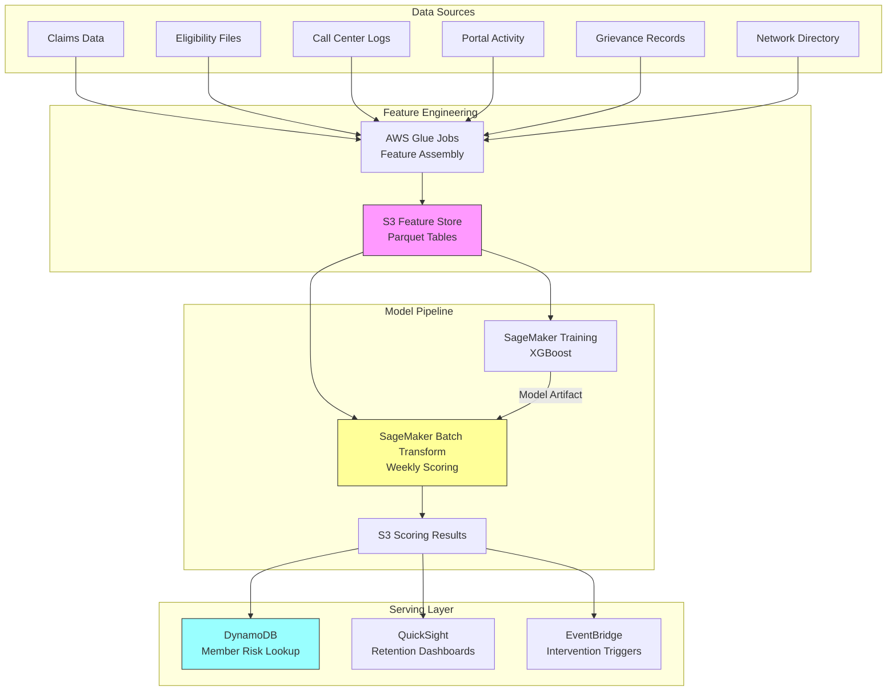

# Recipe 7.3 Architecture and Implementation: Patient Churn / Disenrollment Prediction

*Companion to [Recipe 7.3: Patient Churn / Disenrollment Prediction](chapter07.03-patient-churn-disenrollment-prediction). This page covers the AWS architecture, services, prerequisites, and pseudocode. For the problem framing and the conceptual approach, start with the main recipe.*

---

## Why These Services

**Amazon SageMaker for model training and hosting.** SageMaker provides the full ML lifecycle: notebook environments for exploration, managed training jobs for the actual model build, and real-time or batch endpoints for scoring. For churn prediction specifically, the built-in XGBoost algorithm is well-optimized and saves you from managing your own training infrastructure. SageMaker also handles model versioning and A/B testing, which matters when you're iterating on features.

**AWS Glue for feature engineering.** The feature assembly step pulls from multiple source systems and performs complex aggregations (rolling averages, trend calculations, gap detection). Glue's serverless Spark environment handles this at scale without you managing clusters. The Glue Data Catalog also serves as a metadata layer so your data science team can discover available features.

**Amazon S3 for the feature store and model artifacts.** S3 is the durable layer underneath everything: raw source data lands here, transformed features are stored here, trained model artifacts live here, and scoring results are written here. Parquet format for the feature tables gives you columnar efficiency for the wide, sparse feature matrices typical of churn models.

**Amazon EventBridge for orchestration.** The scoring pipeline runs on a schedule (weekly batch scoring of the full membership). EventBridge triggers the pipeline, and Step Functions coordinates the steps: feature refresh, model scoring, stratification, and output delivery. You get retry logic and failure alerting without building them yourself, which matters when a missed scoring run means your retention team is working with stale risk data for a week.

**Amazon DynamoDB for real-time risk lookup.** Once members are scored, downstream systems (call center applications, care management platforms, member portals) need to look up a member's churn risk in real time. DynamoDB provides single-digit-millisecond lookups by member ID. The weekly batch scoring job writes results here; operational systems read from here.

**Amazon QuickSight for retention dashboards.** Leadership wants to see churn risk distribution, intervention effectiveness, and trend lines. QuickSight connects directly to the scoring results in S3 (via Athena) and provides self-service dashboards without building a custom BI layer.

## Architecture Diagram



## Prerequisites

| Requirement | Details |
|-------------|---------|
| **AWS Services** | Amazon SageMaker, AWS Glue, Amazon S3, Amazon DynamoDB, Amazon EventBridge, AWS Step Functions, Amazon QuickSight, Amazon Athena |
| **IAM Permissions** | Distributed across service-specific execution roles: Glue role (S3 read/write scoped to feature buckets), SageMaker role (S3 read/write for model/feature buckets, KMS decrypt), Step Functions role (invoke Glue and SageMaker, write DynamoDB), EventBridge scheduler role (start Step Functions). Scope each role with resource ARNs. Do not combine into a single role. |
| **BAA** | AWS BAA signed (member behavioral data, claims data, and grievance records are PHI) |
| **Encryption** | S3: SSE-KMS for all feature and scoring data; DynamoDB: encryption at rest (default); SageMaker: KMS for training volumes and model artifacts; all transit over TLS |
| **VPC** | Production: SageMaker training and Glue jobs in VPC with VPC endpoints for S3, DynamoDB, and CloudWatch Logs. No public internet access for PHI processing. Glue jobs require network connectivity to each source system. For on-premises sources (common for claims warehouses and legacy CRM systems), this requires Direct Connect or site-to-site VPN. For sources in separate VPCs, use VPC peering or Transit Gateway. Plan for this connectivity early; it is often the longest lead-time item. |
| **CloudTrail** | Enabled: log all SageMaker, Glue, and S3 API calls for HIPAA audit trail |
| **Sample Data** | Synthetic membership data with behavioral features. CMS publishes [synthetic Medicare claims](https://data.cms.gov/collection/synthetic-medicare-enrollment-fee-for-service-claims-and-prescription-drug-event) for development. Never use real member data in dev/test. |
| **Cost Estimate** | Glue: ~$0.44/DPU-hour for feature jobs; SageMaker training: ~$0.05/instance-hour (ml.m5.xlarge); Batch Transform: ~$0.05/instance-hour; DynamoDB: on-demand ~$1.25/million writes. Total for 100K members scored weekly: ~$50-100/month. |

## Ingredients

| AWS Service | Role |
|------------|------|
| **Amazon SageMaker** | Train XGBoost churn model; batch score membership weekly |
| **AWS Glue** | Assemble features from multiple source systems into unified member table |
| **Amazon S3** | Store raw data, feature tables (Parquet), model artifacts, scoring results |
| **Amazon DynamoDB** | Serve real-time member risk scores to operational systems |
| **Amazon EventBridge** | Schedule weekly scoring pipeline; trigger intervention workflows |
| **AWS Step Functions** | Orchestrate multi-step scoring pipeline with error handling |
| **Amazon QuickSight** | Retention dashboards for leadership and operations teams |
| **Amazon Athena** | Ad-hoc queries against feature store and scoring results |
| **AWS KMS** | Encryption key management for all PHI data at rest |

## Pseudocode Walkthrough

> **Reference implementations:** The following AWS sample repos demonstrate patterns used in this recipe:
>
> - [`amazon-sagemaker-examples`](https://github.com/aws/amazon-sagemaker-examples): Comprehensive SageMaker examples including XGBoost for classification, batch transform, and model monitoring
> - [`aws-glue-samples`](https://github.com/aws-samples/aws-glue-samples): Glue ETL patterns for feature engineering and data transformation

**Step 1: Feature assembly.** This is where the real work happens. You're pulling data from half a dozen source systems and computing features that capture each member's relationship with your organization over time. The key insight: churn prediction is mostly a feature engineering problem. The model itself is almost commodity. Get the features right and even a simple model performs well. Get them wrong and no amount of model complexity will save you. Each feature should answer a question: "Is this member's behavior changing in a way that suggests disengagement?"

```pseudocode
FUNCTION assemble_member_features(member_id, as_of_date):
    // Pull raw data from each source system for this member.
    // "as_of_date" is the prediction point: we only use data available before this date.
    // This prevents data leakage (using future information to predict the future).
    
    claims       = get claims for member_id where service_date < as_of_date
    eligibility  = get eligibility records for member_id as of as_of_date
    calls        = get call center contacts for member_id where call_date < as_of_date
    portal       = get portal activity for member_id where activity_date < as_of_date
    grievances   = get grievance records for member_id where filed_date < as_of_date
    
    // Compute engagement features: how actively is this member using their benefits?
    features = {}
    
    // Utilization trend: compare recent 90 days to prior 90 days.
    // A declining ratio suggests disengagement.
    recent_claims_count  = count claims in last 90 days before as_of_date
    prior_claims_count   = count claims in 90-180 days before as_of_date
    features["utilization_trend_ratio"] = recent_claims_count / max(prior_claims_count, 1)
    
    // Prescription fill gaps: are they filling meds through your pharmacy benefit?
    // Gaps suggest they may be using a competitor's pharmacy network.
    features["rx_fill_gap_days"] = days since last prescription fill before as_of_date
    features["rx_fills_last_90d"] = count prescription claims in last 90 days
    
    // Preventive care engagement: did they complete expected annual visits?
    features["annual_wellness_completed"] = 1 if wellness visit in last 12 months, else 0
    features["months_since_last_pcp_visit"] = months since last PCP claim
    
    // Satisfaction signals: grievances and call patterns
    features["grievances_last_6m"] = count grievances filed in last 6 months
    features["unresolved_grievances"] = count grievances still open
    features["call_center_contacts_last_90d"] = count calls in last 90 days
    features["repeat_call_same_issue"] = 1 if multiple calls about same topic, else 0
    
    // Network adequacy: is their provider still in-network?
    features["pcp_in_network"] = 1 if member's assigned PCP is currently in-network, else 0
    features["pcp_changed_last_6m"] = 1 if PCP assignment changed in last 6 months, else 0
    features["out_of_network_pct_last_6m"] = fraction of claims that were out-of-network
    
    // Financial signals
    features["total_oop_last_6m"] = sum of member out-of-pocket costs in last 6 months
    features["denied_claims_last_6m"] = count of denied claims in last 6 months
    features["denied_claim_amount_last_6m"] = total dollar amount of denied claims
    
    // Tenure and demographics
    features["tenure_months"] = months since enrollment effective date
    features["age"] = member age as of as_of_date
    features["plan_type"] = categorical: HMO, PPO, HDHP, MA, etc.
    features["zip3_market_competition"] = number of competing plans in member's zip3
    
    // Portal engagement (digital engagement proxy)
    features["portal_logins_last_90d"] = count of portal logins in last 90 days
    features["portal_login_trend"] = logins last 90d / max(logins prior 90d, 1)
    
    RETURN features
```

**Step 2: Label historical data.** To train the model, you need labeled examples: members who churned and members who stayed. This step looks backward in time to create the training dataset. The label window and observation window must not overlap, or you'll leak future information into your features. This is the most common mistake in churn model development, and it produces models that look great in testing but fail in production.

```pseudocode
FUNCTION create_training_dataset(members, label_date, observation_cutoff):
    // "observation_cutoff" is the last date we can use for features.
    // "label_date" is when we check the outcome (did they churn?).
    // There must be a gap between these: features are computed as of observation_cutoff,
    // and the label reflects what happened by label_date.
    // Example: features as of Sept 30, label = "did they disenroll by Dec 31?"
    
    training_rows = []
    
    FOR each member in members:
        // Only include members who were active as of the observation cutoff.
        // Can't predict churn for someone who already left.
        IF member was enrolled as of observation_cutoff:
            
            // Compute features using only data available before the cutoff.
            features = assemble_member_features(member.id, observation_cutoff)
            
            // Determine the label: did this member disenroll by the label date?
            label = 1 if member disenrolled between observation_cutoff and label_date
            label = 0 otherwise
            
            training_rows.append({ features: features, label: label })
    
    RETURN training_rows
```

**Step 3: Train the model.** With features and labels assembled, train a gradient boosted tree classifier. The key decisions here are handling class imbalance (churn is typically 5-15% of the population, so the classes are imbalanced) and selecting the right evaluation metric. AUC-PR (area under the precision-recall curve) is more informative than AUC-ROC for imbalanced problems.

```pseudocode
FUNCTION train_churn_model(training_data):
    // Split into train and validation sets.
    // Use time-based splitting, not random: train on older data, validate on newer.
    // This simulates how the model will be used in production (predicting the future).
    train_set = training_data where observation_cutoff is in earlier period
    val_set   = training_data where observation_cutoff is in later period
    
    // Configure the XGBoost classifier.
    // scale_pos_weight handles class imbalance: if 10% churn, set to ~9.
    // This tells the model that missing a churner is more costly than a false alarm.
    model = XGBoost classifier with:
        objective        = "binary:logistic"    // output probabilities, not just 0/1
        scale_pos_weight = (count negatives) / (count positives)  // handle imbalance
        max_depth        = 6                    // prevent overfitting on small populations
        learning_rate    = 0.05                 // slower learning, better generalization
        n_estimators     = 500                  // enough trees for the ensemble
        eval_metric      = "aucpr"             // precision-recall AUC (better for imbalanced)
        early_stopping   = 50 rounds           // stop if validation metric plateaus
    
    // Train with early stopping on validation performance.
    model.fit(train_set.features, train_set.labels,
              eval_set = val_set)
    
    // Calibrate probabilities using isotonic regression on the validation set.
    // Raw XGBoost probabilities are often poorly calibrated.
    // After calibration, a predicted 0.7 means ~70% of those members actually churn.
    calibrator = IsotonicRegression()
    calibrator.fit(model.predict_proba(val_set.features), val_set.labels)
    
    RETURN model, calibrator
```

**Step 4: Score current membership.** Apply the trained model to all currently enrolled members to produce churn risk scores. This runs on a schedule (weekly is typical) and writes results to both the feature store (for analysis) and the operational database (for real-time lookup).

```pseudocode
FUNCTION score_membership(model, calibrator, active_members, scoring_date):
    // Score every active member as of today.
    results = []
    
    FOR each member in active_members:
        // Compute current features (same logic as training, but using today's data).
        features = assemble_member_features(member.id, scoring_date)
        
        // Get raw model probability.
        raw_probability = model.predict_proba(features)
        
        // Calibrate to get a meaningful probability.
        calibrated_probability = calibrator.transform(raw_probability)
        
        // Get feature importance for this specific prediction (SHAP values).
        // This tells us WHY this member is high-risk, enabling targeted intervention.
        top_drivers = get_shap_values(model, features, top_n=5)
        
        results.append({
            member_id:       member.id,
            score_date:      scoring_date,
            churn_probability: calibrated_probability,
            risk_tier:       assign_tier(calibrated_probability),  // "high", "medium", "low"
            top_risk_factors: top_drivers,  // e.g., ["pcp_left_network", "grievance_unresolved"]
            intervention_type: recommend_intervention(top_drivers)  // route to right team
        })
    
    RETURN results

FUNCTION assign_tier(probability):
    IF probability >= 0.60: RETURN "high"      // top ~10% typically
    IF probability >= 0.35: RETURN "medium"    // next ~20%
    RETURN "low"

// Note: these thresholds are illustrative. In production, set them based on
// your retention team's weekly capacity. If your team can handle 200 outreach
// calls per week and you score monthly, your "high" tier should contain roughly
// 800 members (200 calls/week x 4 weeks). Work backward from capacity to find
// the probability threshold that produces the right volume.

FUNCTION recommend_intervention(top_drivers):
    // Route to the appropriate team based on the dominant risk factor.
    // The top driver tells us WHY this member is at risk, which determines
    // who can actually fix the problem.
    top_feature = top_drivers[0].feature_name
    
    IF top_feature is "pcp_in_network" or "pcp_changed_last_6m":
        RETURN "network_adequacy_outreach"
    IF top_feature is "unresolved_grievances" or "grievances_last_6m":
        RETURN "member_services_escalation"
    IF top_feature is "denied_claims_last_6m" or "total_oop_last_6m":
        RETURN "benefits_counseling"
    IF top_feature is "utilization_trend_ratio" or "portal_login_trend":
        RETURN "engagement_outreach"
    RETURN "general_retention_call"
```

**Step 5: Store and serve results.** Write scoring results to both the analytical store (S3/Parquet for dashboards and analysis) and the operational store (DynamoDB for real-time lookup by member ID). Downstream systems query DynamoDB when a member calls in, logs into the portal, or is being reviewed by a care manager.

```pseudocode
FUNCTION store_and_serve(results, scoring_date):
    // Write full results to S3 for analytics and dashboarding.
    // Partitioned by date so historical scores are preserved for trend analysis.
    write results as Parquet to:
        s3://churn-scoring-results/scores/date={scoring_date}/members.parquet
    
    // Write current scores to DynamoDB for real-time operational lookup.
    // Overwrite previous scores (only current risk matters for intervention routing).
    // Note: not all downstream systems should see the full risk factor detail.
    // The call center app may need the full explanation for context. The member
    // portal should not display churn risk factors to the member. Consider storing
    // detailed explanations in a separate attribute requiring elevated permissions.
    FOR each result in results:
        write to DynamoDB table "member-churn-risk":
            partition_key    = result.member_id
            churn_probability = result.churn_probability
            risk_tier        = result.risk_tier
            top_risk_factors = result.top_risk_factors
            intervention_type = result.intervention_type
            scored_at        = scoring_date
            ttl              = scoring_date + 30 days  // auto-expire stale scores
    
    // Trigger intervention workflows for high-risk members.
    // Only publish member_id and risk_tier to EventBridge, not the full
    // risk factor detail. Downstream systems look up detail from DynamoDB.
    // This minimizes PHI in the event bus and reduces blast radius if a
    // rule is misconfigured to route to an unintended target.
    high_risk = filter results where risk_tier == "high"
    publish high_risk to EventBridge with detail_type = "MemberChurnRiskHigh"
        event detail = { member_id, risk_tier, intervention_type, scored_at }
    // Downstream rules route to appropriate intervention queues.
```

**Step 6: Model monitoring.** Models degrade. Population composition shifts around open enrollment. Benefit designs change annually. New competitors enter markets. If you don't monitor prediction quality against ground truth, you'll deploy a model that slowly becomes useless and not notice until retention numbers drop months later. This step runs monthly on a schedule offset from scoring (you need time for outcomes to materialize before you can evaluate predictions). It is especially important around open enrollment periods when the population composition shifts most dramatically.

```pseudocode
FUNCTION monitor_model_performance(scoring_date_to_evaluate):
    // Look back at predictions from 90 days ago and compare against actual outcomes.
    // Why 90 days? That's the prediction horizon: we predicted "will this member
    // churn within 90 days?" Now we know whether they actually did.
    
    evaluation_date = scoring_date_to_evaluate
    prediction_date = evaluation_date - 90 days
    
    // Load predictions we made 90 days ago.
    historical_predictions = load from S3:
        s3://churn-scoring-results/scores/date={prediction_date}/members.parquet
    
    // Load actual outcomes: who actually disenrolled between then and now?
    actual_outcomes = query eligibility system:
        for each member in historical_predictions:
            label = 1 if member disenrolled between prediction_date and evaluation_date
            label = 0 otherwise
    
    // Join predictions to actuals on member_id.
    evaluation_set = join historical_predictions with actual_outcomes on member_id
    
    // Compute rolling AUC-PR (precision-recall area under curve).
    // AUC-PR is the right metric for imbalanced problems: it tells you how well
    // the model distinguishes churners from non-churners in the minority class.
    auc_pr = compute AUC-PR(evaluation_set.churn_probability, evaluation_set.actual_label)
    
    // Compute Expected Calibration Error (ECE).
    // ECE measures how well calibrated the probabilities are: when the model says
    // "60% chance of churn," do roughly 60% of those members actually churn?
    // Bin predictions into 10 equal-width bins, compare predicted vs. actual rate.
    ece = compute ECE(evaluation_set.churn_probability, evaluation_set.actual_label, bins=10)
    
    // Publish metrics to CloudWatch for dashboarding and alarming.
    publish to CloudWatch namespace "ChurnModel/Performance":
        metric "AUC-PR" = auc_pr, dimensions = { model_version, evaluation_month }
        metric "ECE"    = ece,    dimensions = { model_version, evaluation_month }
        metric "ActualChurnRate" = mean(evaluation_set.actual_label)
        metric "PredictedChurnRate" = mean(evaluation_set.churn_probability)
    
    // Check retraining triggers.
    // AUC-PR below 0.40 means the model is barely better than random for the
    // minority class. ECE above 0.10 means calibration has drifted enough that
    // tier thresholds are producing the wrong volume of outreach.
    IF auc_pr < 0.40 OR ece > 0.10:
        trigger retraining pipeline via EventBridge:
            detail_type = "ChurnModelRetrainingRequired"
            detail = {
                reason: auc_pr < 0.40 ? "AUC-PR degraded" : "Calibration drift",
                auc_pr: auc_pr,
                ece: ece,
                evaluation_date: evaluation_date,
                prediction_date: prediction_date
            }
        // The retraining pipeline recomputes features with recent data,
        // trains a new model version, validates on a held-out set, and
        // promotes only if the new model outperforms the current one.
    
    // Log the evaluation for audit purposes.
    write evaluation summary to S3:
        s3://churn-scoring-results/monitoring/date={evaluation_date}/eval.json
    
    RETURN { auc_pr, ece, retrain_triggered: (auc_pr < 0.40 OR ece > 0.10) }
```

> **Curious how this looks in Python?** The pseudocode above covers the concepts. If you'd like to see sample Python code that demonstrates these patterns using boto3, check out the [Python Example](chapter07.03-python-example). It walks through each step with inline comments and notes on what you'd need to change for a real deployment.

## Expected Results

**Sample output for a scored member:**

```json
{
  "member_id": "MBR-2847103",
  "score_date": "2026-05-25",
  "churn_probability": 0.72,
  "risk_tier": "high",
  "top_risk_factors": [
    {"feature": "pcp_in_network", "value": 0, "impact": 0.18, "explanation": "PCP left network 45 days ago"},
    {"feature": "grievances_last_6m", "value": 2, "impact": 0.14, "explanation": "Two unresolved grievances"},
    {"feature": "utilization_trend_ratio", "value": 0.3, "impact": 0.11, "explanation": "70% drop in utilization"},
    {"feature": "portal_login_trend", "value": 0.2, "impact": 0.08, "explanation": "80% fewer portal logins"},
    {"feature": "denied_claims_last_6m", "value": 3, "impact": 0.07, "explanation": "Three denied claims"}
  ],
  "intervention_type": "network_adequacy_outreach",
  "scored_at": "2026-05-25T06:00:00Z"
}
```

**Performance benchmarks:**

| Metric | Typical Value |
|--------|---------------|
| AUC-ROC | 0.78-0.85 |
| AUC-PR | 0.45-0.60 (at 8-12% base rate) |
| Precision at top decile | 35-50% (3-5x lift over random) |
| Recall at top two deciles | 55-70% |
| Feature engineering runtime | 15-45 minutes (100K members, Glue) |
| Scoring runtime | 5-10 minutes (100K members, batch transform) |
| DynamoDB lookup latency | <5ms per member |
| Monthly cost (100K members) | $50-100 |

**Where it struggles:** New members with less than 6 months tenure (cold start). Members who churn due to employer decisions (group-level switches, not individual choice). Sudden life events (relocation, job loss) with no prior behavioral signal. Markets with aggressive competitor pricing where the decision is purely financial.

---

## Why This Isn't Production-Ready

The pseudocode and architecture above demonstrate the churn prediction pipeline end-to-end. Deploying this to a real health plan's retention program requires closing several gaps. These are the ones that will catch you:

**Model monitoring and retraining automation.** Step 6 defines the monitoring logic, but a production system needs the full operational wrapper: automated monthly ground-truth joins, CloudWatch dashboards with historical trend lines, PagerDuty alerts when metrics breach thresholds, and a retraining pipeline that validates the new model against the current one before promotion. Without this, your model degrades silently after every open enrollment period.

**Fairness audits across demographic groups.** Churn models can encode structural inequities. Members in underserved zip codes may have worse network adequacy, higher churn, and therefore higher risk scores. If your retention team then focuses outreach on members who are already well-served (because they're cheaper to retain), you've built a system that amplifies existing disparities. Monitor prediction distributions and intervention allocation rates across race, ethnicity, language, zip code, and plan type. Document findings in a model card. CMS and state regulators are increasingly scrutinizing algorithmic decision-making in health plans.

**Retraining pipeline with champion/challenger testing.** When monitoring triggers a retrain, you don't just swap models. You train a challenger model on recent data, validate it against the current champion on a holdout set, run both in parallel for a scoring cycle (scoring the same members with both models), compare outcomes, and promote the challenger only if it demonstrably outperforms. SageMaker Model Registry and deployment policies support this pattern, but the governance process (who approves promotion, what metrics constitute "better") requires human decisions.

**Integration testing with intervention systems.** The pipeline writes to DynamoDB and publishes to EventBridge. Downstream systems (care management platforms, call center applications, member portals) consume those outputs. Integration testing must verify the full path: a high-risk score produces a DynamoDB entry that the call center app can read, an EventBridge event that the routing rules match, and a work item in the retention team's queue. A broken integration means scores are computed but never acted on.

**Intervention feedback capture.** The architecture routes members to interventions, but it doesn't specify how intervention outcomes flow back into the system. Did the outreach call happen? Did the member answer? Did they express intent to stay? Did the network team actually fix the adequacy gap? This feedback is both the signal for model improvement and the evidence for ROI calculations. Build the feedback capture from day one; retrofitting it after launch is painful because the retention team has already established workflows without it.

**Cold-start handling for new members.** Members with less than six months of tenure have insufficient behavioral history for reliable scoring. A production system either excludes them from scoring entirely (and routes them through a separate onboarding-quality program) or uses a dedicated early-tenure model trained on features available at enrollment: plan selection patterns, demographics, initial engagement velocity in the first 30-60 days. Scoring new members with the general model produces unreliable probabilities that waste intervention capacity.

**Seasonality-aware threshold management.** The fixed probability thresholds (0.60 for high, 0.35 for medium) work during steady-state periods. Around open enrollment, the entire population's risk shifts upward (everyone is reconsidering their options), and fixed thresholds produce an unmanageable volume of "high-risk" members. Production systems either adjust thresholds seasonally (higher during enrollment periods) or switch to relative ranking (top N members regardless of absolute probability).

**Dead letter queues and poison-message handling.** The EventBridge events that trigger interventions, the DynamoDB writes, the Glue feature assembly jobs: each can fail for transient or permanent reasons. Configure DLQs on every async path, alarm on queue depth, and build runbooks for replaying failed messages. A silently lost high-risk event means a member who should have received outreach doesn't get it.

---

## Variations and Extensions

**Real-time event-triggered scoring.** Instead of weekly batch scoring, trigger a re-score when specific high-signal events occur: PCP leaves network, grievance filed, claim denied for a high-cost service. This catches rapid deterioration between batch runs. Implement with EventBridge rules that invoke a SageMaker real-time endpoint for the affected member.

**Reason-specific sub-models.** Train separate models for different churn reasons (network dissatisfaction, cost sensitivity, service quality). Each sub-model uses features tailored to its specific churn driver. The ensemble provides both an overall risk score and a breakdown by reason, enabling more targeted interventions.

**Group-level churn prediction.** For employer-sponsored plans, predict which employer groups are at risk of switching carriers at renewal. Features include group-level satisfaction scores, claims cost trends, broker relationship signals, and competitive pricing intelligence. The intervention is different (account management, not member outreach) but the modeling approach is similar.

---

## Additional Resources

**AWS Documentation:**
- [Amazon SageMaker XGBoost Algorithm](https://docs.aws.amazon.com/sagemaker/latest/dg/xgboost.html)
- [Amazon SageMaker Batch Transform](https://docs.aws.amazon.com/sagemaker/latest/dg/batch-transform.html)
- [AWS Glue Developer Guide](https://docs.aws.amazon.com/glue/latest/dg/what-is-glue.html)
- [Amazon SageMaker Model Monitor](https://docs.aws.amazon.com/sagemaker/latest/dg/model-monitor.html)
- [AWS HIPAA Eligible Services](https://aws.amazon.com/compliance/hipaa-eligible-services-reference/)
- [Amazon EventBridge Scheduler](https://docs.aws.amazon.com/eventbridge/latest/userguide/scheduler.html)

**AWS Sample Repos:**
- [`amazon-sagemaker-examples`](https://github.com/aws/amazon-sagemaker-examples): Comprehensive SageMaker examples including XGBoost classification, batch transform, and model monitoring
- [`aws-glue-samples`](https://github.com/aws-samples/aws-glue-samples): Glue ETL job patterns for data transformation and feature engineering
- [`amazon-sagemaker-mlops-workshop`](https://github.com/aws-samples/amazon-sagemaker-mlops-workshop): End-to-end MLOps pipeline patterns with SageMaker, including model retraining and deployment automation

**AWS Solutions and Blogs:**
- [Predicting Customer Churn with Amazon SageMaker](https://aws.amazon.com/blogs/machine-learning/predicting-customer-churn-with-amazon-machine-learning/): End-to-end walkthrough of churn prediction on AWS
- [Machine Learning Best Practices in Healthcare and Life Sciences](https://docs.aws.amazon.com/whitepapers/latest/ml-best-practices-healthcare-life-sciences/ml-best-practices-healthcare-life-sciences.html): AWS whitepaper covering healthcare ML governance, compliance, and deployment patterns

---

## Estimated Implementation Time

| Phase | Duration |
|-------|----------|
| **Basic** (single data source, simple features, batch scoring) | 3-4 weeks |
| **Production-ready** (multi-source features, calibration, monitoring, DynamoDB serving) | 8-12 weeks |
| **With variations** (real-time triggers, reason sub-models, group-level prediction) | 14-18 weeks |

---

---

*← [Main Recipe 7.3](chapter07.03-patient-churn-disenrollment-prediction) · [Python Example](chapter07.03-python-example) · [Chapter Preface](chapter07-preface)*
