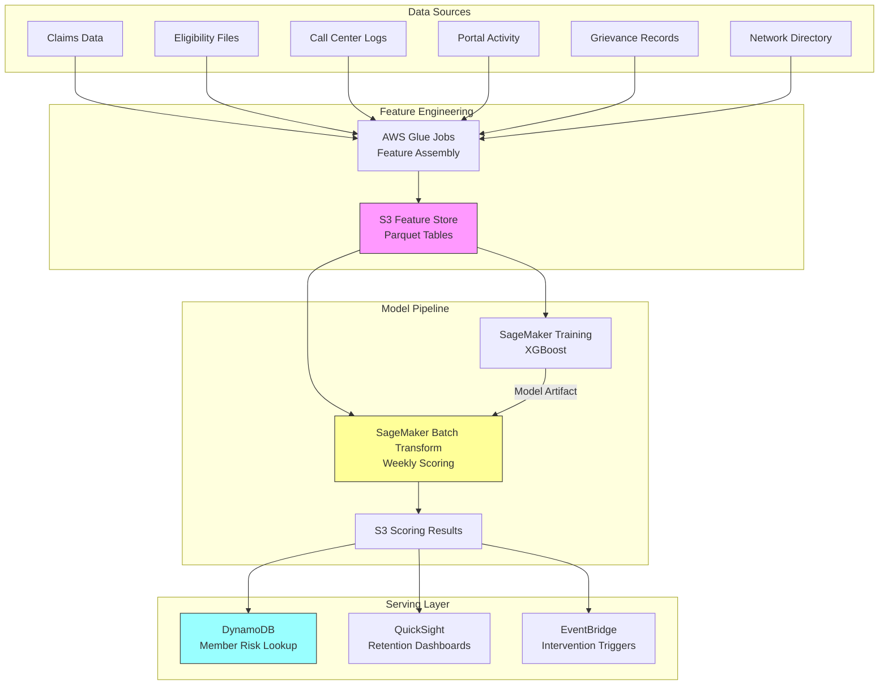

# Recipe 7.3: Patient Churn / Disenrollment Prediction

**Complexity:** Simple-Medium · **Phase:** Growth · **Estimated Cost:** ~$0.002 per member per month (scoring)

---

## The Problem

Here's a scenario that plays out every January at health plans across the country. Open enrollment closes. The dust settles. And then the membership reports come in: 8% of your commercial book walked. 12% of your Medicare Advantage members switched plans. The network team is scrambling because two high-volume PCPs just lost enough patients to drop below panel minimums. The finance team is re-forecasting revenue. Everyone is asking the same question: "Could we have seen this coming?"

The answer, frustratingly, is usually yes. The signals were there months ago. The member who stopped filling prescriptions through your pharmacy benefit. The one who called three times about a denied claim and never got a satisfying answer. The family that moved to a zip code where your network is thin. The member who didn't schedule their annual wellness visit for the first time in four years.

Patient churn (or disenrollment, depending on whether you're a health plan or a provider organization) is one of those problems where the business impact is enormous and the data signals are surprisingly readable. A single Medicare Advantage member represents $12,000-$15,000 in annual revenue. A commercial family of four might be $25,000-$40,000. When you lose them, you don't just lose this year's revenue; you lose the lifetime value of a relationship you've already invested in building.

The cruel part: retention interventions actually work. A well-timed outreach from a care coordinator, a resolved grievance, a proactive network adequacy fix, a personalized benefits reminder during open enrollment. These things move the needle. But they only work if you know who to target and when to act. By the time someone submits a disenrollment form, it's too late. The decision was made weeks or months earlier.

This is a prediction problem. And it's one where the ROI math is straightforward enough that even skeptical CFOs will fund it.

---

## The Technology: Predicting Who Will Leave

### Churn Prediction as a Classification Problem

At its core, churn prediction is binary classification: will this member leave (1) or stay (0) within a defined future window? You train a model on historical data where you know the outcome (who actually left last year), and then apply it to current members to estimate their probability of leaving.

This sounds simple. It's not. Let me explain why.

The first challenge is defining "churn" precisely. In a health plan context, disenrollment is a discrete event: the member submits a form, or they fail to re-enroll during open enrollment, or their employer switches carriers. You have a clear timestamp. For provider organizations, "churn" is fuzzier. Did the patient leave, or did they just not need care for six months? A patient who hasn't visited in 18 months might be perfectly healthy, or they might have switched to a competitor. You need a working definition, and that definition shapes everything downstream.

The second challenge is the time horizon. Are you predicting churn in the next 30 days? 90 days? Before next open enrollment? Shorter horizons give you more actionable predictions but less time to intervene. Longer horizons are noisier but give your retention team room to work. Most health plan implementations target a 60-90 day window before open enrollment, because that's when interventions have the highest impact.

### Feature Engineering: What Signals Matter

The features that predict churn fall into several categories, and the best models use all of them:

**Engagement signals.** How is the member interacting with your organization? Declining appointment frequency, fewer portal logins, reduced prescription fills through your pharmacy benefit, fewer preventive care visits. These behavioral shifts often precede a conscious decision to leave. The absence of expected activity is as informative as the presence of unusual activity.

**Satisfaction signals.** Grievances filed, appeals submitted, call center contacts (especially repeated contacts about the same issue), survey scores (if you have them), time-to-resolution on complaints. A member who filed two grievances in the last quarter is not a happy member.

**Network adequacy signals.** Did the member's PCP leave your network? Did they move to a zip code where your nearest in-network specialist is 45 minutes away? Are they consistently going out-of-network for a specific service category? Network gaps are one of the strongest churn predictors, and they're often fixable.

**Financial signals.** Out-of-pocket cost trajectory, denied claims (especially for services the member expected to be covered), premium increases relative to competitors, cost-sharing surprises. Money is a powerful motivator for switching.

**Demographic and life event signals.** Age (Medicare members aging into different plan eligibility), employment changes (for employer-sponsored plans), address changes, family composition changes. These are often available from claims data or eligibility files.

**Competitive signals.** This is the hardest category to capture, but it matters. Are competitors entering your market with lower premiums? Did a new plan launch with a popular provider group in-network? Market-level data won't tell you about individual members, but it helps calibrate your baseline churn rate.

### The Model: Gradient Boosting Dominates Here

For tabular data with mixed feature types (numeric, categorical, temporal), gradient boosted trees (XGBoost, LightGBM, CatBoost) consistently outperform other approaches for churn prediction. They handle missing values gracefully (common in healthcare data), capture non-linear relationships without explicit feature engineering, and produce feature importance scores that help explain predictions to business stakeholders.

Deep learning approaches (LSTMs, transformers on event sequences) can capture temporal patterns that tree models miss, but they require substantially more data, more engineering effort, and more compute. For most health plan populations (tens of thousands to low millions of members), gradient boosting is the right starting point.

The model outputs a probability: "This member has a 73% chance of disenrolling before next open enrollment." That probability drives everything downstream: who gets outreach, what kind of outreach, and how urgently.

### Calibration Matters More Than Accuracy

Here's something that trips up teams new to churn prediction: raw accuracy is a terrible metric for this problem. If your baseline churn rate is 8%, a model that predicts "no churn" for everyone achieves 92% accuracy. Useless.

What you actually need is good calibration. When your model says "70% churn probability," roughly 70% of those members should actually churn. Calibrated probabilities let you set meaningful thresholds: "Intervene on everyone above 60%" becomes a statement with predictable volume and expected yield.

Precision-recall tradeoffs matter here too. A false positive (predicting churn for a member who would have stayed) costs you an unnecessary outreach call. A false negative (missing a member who actually leaves) costs you $12,000+ in lost revenue. The asymmetry is extreme. Most implementations optimize for recall (catch as many churners as possible) and accept lower precision (some unnecessary outreach is fine).

### The Cold Start Problem

New members are the hardest to score. A member who joined three months ago has almost no behavioral history with your organization. You can't measure "declining engagement" when you don't have a baseline. Most models handle this by either excluding members below a tenure threshold (e.g., less than 6 months) or using a separate model trained specifically on early-tenure features (demographics, plan selection patterns, initial engagement velocity).

---

## General Architecture Pattern

The churn prediction pipeline has four logical stages:

```
[Feature Store Assembly] → [Model Training / Scoring] → [Risk Stratification] → [Intervention Routing]
```

**Feature Store Assembly.** Aggregate raw data from multiple source systems (claims, eligibility, call center, portal activity, grievances, network directories) into a unified member-level feature set. This runs on a schedule (daily or weekly) and produces a wide table: one row per member, hundreds of columns representing their behavioral, financial, and demographic signals. The feature engineering here is the bulk of the work. Expect 60-70% of your development time to be spent getting features right.

**Model Training / Scoring.** Train the classification model on historical labeled data (members who churned vs. stayed in prior periods). Then score the current population on a regular cadence (weekly or monthly, depending on your intervention timeline). The output is a probability per member. Retraining happens less frequently (quarterly or when performance degrades), but scoring is ongoing.

**Risk Stratification.** Convert raw probabilities into actionable tiers. "High risk" (top 10%), "medium risk" (next 20%), "low risk" (everyone else). The tier boundaries are calibrated against your retention team's capacity: there's no point flagging 5,000 members as high-risk if your team can only handle 200 outreach calls per week.

**Intervention Routing.** Route high-risk members to the appropriate intervention based on their predicted churn reason. Network adequacy issues go to the network team. Grievance-related churn goes to member services. Cost-related churn might trigger a benefits counseling call. The routing logic is often rule-based on top of the model's feature importance: "This member is high-risk, and their top contributing features are out-of-network utilization and PCP departure."

The feedback loop is critical. Track which interventions were attempted, which members were retained, and feed that outcome data back into the next training cycle. Without this loop, you can't measure whether your model (or your interventions) are actually working.

---

## The AWS Implementation

### Why These Services

**Amazon SageMaker for model training and hosting.** SageMaker provides the full ML lifecycle: notebook environments for exploration, managed training jobs for the actual model build, and real-time or batch endpoints for scoring. For churn prediction specifically, the built-in XGBoost algorithm is well-optimized and saves you from managing your own training infrastructure. SageMaker also handles model versioning and A/B testing, which matters when you're iterating on features.

**AWS Glue for feature engineering.** The feature assembly step pulls from multiple source systems and performs complex aggregations (rolling averages, trend calculations, gap detection). Glue's serverless Spark environment handles this at scale without you managing clusters. The Glue Data Catalog also serves as a metadata layer so your data science team can discover available features.

**Amazon S3 for the feature store and model artifacts.** S3 is the durable layer underneath everything: raw source data lands here, transformed features are stored here, trained model artifacts live here, and scoring results are written here. Parquet format for the feature tables gives you columnar efficiency for the wide, sparse feature matrices typical of churn models.

**Amazon EventBridge for orchestration.** The scoring pipeline runs on a schedule (weekly batch scoring of the full membership). EventBridge triggers the pipeline, and Step Functions coordinates the steps: feature refresh, model scoring, stratification, and output delivery. This is cleaner than cron jobs and gives you built-in retry logic and failure alerting.

**Amazon DynamoDB for real-time risk lookup.** Once members are scored, downstream systems (call center applications, care management platforms, member portals) need to look up a member's churn risk in real time. DynamoDB provides single-digit-millisecond lookups by member ID. The weekly batch scoring job writes results here; operational systems read from here.

**Amazon QuickSight for retention dashboards.** Leadership wants to see churn risk distribution, intervention effectiveness, and trend lines. QuickSight connects directly to the scoring results in S3 (via Athena) and provides self-service dashboards without building a custom BI layer.

### Architecture Diagram



### Prerequisites

| Requirement | Details |
|-------------|---------|
| **AWS Services** | Amazon SageMaker, AWS Glue, Amazon S3, Amazon DynamoDB, Amazon EventBridge, AWS Step Functions, Amazon QuickSight, Amazon Athena |
| **IAM Permissions** | `sagemaker:CreateTrainingJob`, `sagemaker:CreateTransformJob`, `glue:StartJobRun`, `s3:GetObject`, `s3:PutObject`, `dynamodb:PutItem`, `dynamodb:GetItem`, `events:PutRule` |
| **BAA** | AWS BAA signed (member behavioral data, claims data, and grievance records are PHI) |
| **Encryption** | S3: SSE-KMS for all feature and scoring data; DynamoDB: encryption at rest (default); SageMaker: KMS for training volumes and model artifacts; all transit over TLS |
| **VPC** | Production: SageMaker training and Glue jobs in VPC with VPC endpoints for S3, DynamoDB, and CloudWatch Logs. No public internet access for PHI processing. |
| **CloudTrail** | Enabled: log all SageMaker, Glue, and S3 API calls for HIPAA audit trail |
| **Sample Data** | Synthetic membership data with behavioral features. CMS publishes [synthetic Medicare claims](https://data.cms.gov/collection/synthetic-medicare-enrollment-fee-for-service-claims-and-prescription-drug-event) for development. Never use real member data in dev/test. |
| **Cost Estimate** | Glue: ~$0.44/DPU-hour for feature jobs; SageMaker training: ~$0.05/instance-hour (ml.m5.xlarge); Batch Transform: ~$0.05/instance-hour; DynamoDB: on-demand ~$1.25/million writes. Total for 100K members scored weekly: ~$50-100/month. |

### Ingredients

| AWS Service | Role |
|------------|------|
| **Amazon SageMaker** | Train XGBoost churn model; batch score membership weekly |
| **AWS Glue** | Assemble features from multiple source systems into unified member table |
| **Amazon S3** | Store raw data, feature tables (Parquet), model artifacts, scoring results |
| **Amazon DynamoDB** | Serve real-time member risk scores to operational systems |
| **Amazon EventBridge** | Schedule weekly scoring pipeline; trigger intervention workflows |
| **AWS Step Functions** | Orchestrate multi-step scoring pipeline with error handling |
| **Amazon QuickSight** | Retention dashboards for leadership and operations teams |
| **Amazon Athena** | Ad-hoc queries against feature store and scoring results |
| **AWS KMS** | Encryption key management for all PHI data at rest |

### Code

> **Reference implementations:** The following AWS sample repos demonstrate patterns used in this recipe:
>
> - [`amazon-sagemaker-examples`](https://github.com/aws/amazon-sagemaker-examples): Comprehensive SageMaker examples including XGBoost for classification, batch transform, and model monitoring
> - [`aws-glue-samples`](https://github.com/aws-samples/aws-glue-samples): Glue ETL patterns for feature engineering and data transformation

#### Walkthrough

**Step 1: Feature assembly.** This is where the real work happens. You're pulling data from half a dozen source systems and computing features that capture each member's relationship with your organization over time. The key insight: churn prediction is mostly a feature engineering problem. The model itself is almost commodity. Get the features right and even a simple model performs well. Get them wrong and no amount of model complexity will save you. Each feature should answer a question: "Is this member's behavior changing in a way that suggests disengagement?"

```
FUNCTION assemble_member_features(member_id, as_of_date):
    // Pull raw data from each source system for this member.
    // "as_of_date" is the prediction point: we only use data available before this date.
    // This prevents data leakage (using future information to predict the future).
    
    claims       = get claims for member_id where service_date < as_of_date
    eligibility  = get eligibility records for member_id as of as_of_date
    calls        = get call center contacts for member_id where call_date < as_of_date
    portal       = get portal activity for member_id where activity_date < as_of_date
    grievances   = get grievance records for member_id where filed_date < as_of_date
    
    // Compute engagement features: how actively is this member using their benefits?
    features = {}
    
    // Utilization trend: compare recent 90 days to prior 90 days.
    // A declining ratio suggests disengagement.
    recent_claims_count  = count claims in last 90 days before as_of_date
    prior_claims_count   = count claims in 90-180 days before as_of_date
    features["utilization_trend_ratio"] = recent_claims_count / max(prior_claims_count, 1)
    
    // Prescription fill gaps: are they filling meds through your pharmacy benefit?
    // Gaps suggest they may be using a competitor's pharmacy network.
    features["rx_fill_gap_days"] = days since last prescription fill before as_of_date
    features["rx_fills_last_90d"] = count prescription claims in last 90 days
    
    // Preventive care engagement: did they complete expected annual visits?
    features["annual_wellness_completed"] = 1 if wellness visit in last 12 months, else 0
    features["months_since_last_pcp_visit"] = months since last PCP claim
    
    // Satisfaction signals: grievances and call patterns
    features["grievances_last_6m"] = count grievances filed in last 6 months
    features["unresolved_grievances"] = count grievances still open
    features["call_center_contacts_last_90d"] = count calls in last 90 days
    features["repeat_call_same_issue"] = 1 if multiple calls about same topic, else 0
    
    // Network adequacy: is their provider still in-network?
    features["pcp_in_network"] = 1 if member's assigned PCP is currently in-network, else 0
    features["pcp_changed_last_6m"] = 1 if PCP assignment changed in last 6 months, else 0
    features["out_of_network_pct_last_6m"] = fraction of claims that were out-of-network
    
    // Financial signals
    features["total_oop_last_6m"] = sum of member out-of-pocket costs in last 6 months
    features["denied_claims_last_6m"] = count of denied claims in last 6 months
    features["denied_claim_amount_last_6m"] = total dollar amount of denied claims
    
    // Tenure and demographics
    features["tenure_months"] = months since enrollment effective date
    features["age"] = member age as of as_of_date
    features["plan_type"] = categorical: HMO, PPO, HDHP, MA, etc.
    features["zip3_market_competition"] = number of competing plans in member's zip3
    
    // Portal engagement (digital engagement proxy)
    features["portal_logins_last_90d"] = count of portal logins in last 90 days
    features["portal_login_trend"] = logins last 90d / max(logins prior 90d, 1)
    
    RETURN features
```

**Step 2: Label historical data.** To train the model, you need labeled examples: members who churned and members who stayed. This step looks backward in time to create the training dataset. The label window and observation window must not overlap, or you'll leak future information into your features. This is the most common mistake in churn model development, and it produces models that look great in testing but fail in production.

```
FUNCTION create_training_dataset(members, label_date, observation_cutoff):
    // "observation_cutoff" is the last date we can use for features.
    // "label_date" is when we check the outcome (did they churn?).
    // There must be a gap between these: features are computed as of observation_cutoff,
    // and the label reflects what happened by label_date.
    // Example: features as of Sept 30, label = "did they disenroll by Dec 31?"
    
    training_rows = []
    
    FOR each member in members:
        // Only include members who were active as of the observation cutoff.
        // Can't predict churn for someone who already left.
        IF member was enrolled as of observation_cutoff:
            
            // Compute features using only data available before the cutoff.
            features = assemble_member_features(member.id, observation_cutoff)
            
            // Determine the label: did this member disenroll by the label date?
            label = 1 if member disenrolled between observation_cutoff and label_date
            label = 0 otherwise
            
            training_rows.append({ features: features, label: label })
    
    RETURN training_rows
```

**Step 3: Train the model.** With features and labels assembled, train a gradient boosted tree classifier. The key decisions here are handling class imbalance (churn is typically 5-15% of the population, so the classes are imbalanced) and selecting the right evaluation metric. AUC-PR (area under the precision-recall curve) is more informative than AUC-ROC for imbalanced problems.

```
FUNCTION train_churn_model(training_data):
    // Split into train and validation sets.
    // Use time-based splitting, not random: train on older data, validate on newer.
    // This simulates how the model will be used in production (predicting the future).
    train_set = training_data where observation_cutoff is in earlier period
    val_set   = training_data where observation_cutoff is in later period
    
    // Configure the XGBoost classifier.
    // scale_pos_weight handles class imbalance: if 10% churn, set to ~9.
    // This tells the model that missing a churner is more costly than a false alarm.
    model = XGBoost classifier with:
        objective        = "binary:logistic"    // output probabilities, not just 0/1
        scale_pos_weight = (count negatives) / (count positives)  // handle imbalance
        max_depth        = 6                    // prevent overfitting on small populations
        learning_rate    = 0.05                 // slower learning, better generalization
        n_estimators     = 500                  // enough trees for the ensemble
        eval_metric      = "aucpr"             // precision-recall AUC (better for imbalanced)
        early_stopping   = 50 rounds           // stop if validation metric plateaus
    
    // Train with early stopping on validation performance.
    model.fit(train_set.features, train_set.labels,
              eval_set = val_set)
    
    // Calibrate probabilities using isotonic regression on the validation set.
    // Raw XGBoost probabilities are often poorly calibrated.
    // After calibration, a predicted 0.7 means ~70% of those members actually churn.
    calibrator = IsotonicRegression()
    calibrator.fit(model.predict_proba(val_set.features), val_set.labels)
    
    RETURN model, calibrator
```

**Step 4: Score current membership.** Apply the trained model to all currently enrolled members to produce churn risk scores. This runs on a schedule (weekly is typical) and writes results to both the feature store (for analysis) and the operational database (for real-time lookup).

```
FUNCTION score_membership(model, calibrator, active_members, scoring_date):
    // Score every active member as of today.
    results = []
    
    FOR each member in active_members:
        // Compute current features (same logic as training, but using today's data).
        features = assemble_member_features(member.id, scoring_date)
        
        // Get raw model probability.
        raw_probability = model.predict_proba(features)
        
        // Calibrate to get a meaningful probability.
        calibrated_probability = calibrator.transform(raw_probability)
        
        // Get feature importance for this specific prediction (SHAP values).
        // This tells us WHY this member is high-risk, enabling targeted intervention.
        top_drivers = get_shap_values(model, features, top_n=5)
        
        results.append({
            member_id:       member.id,
            score_date:      scoring_date,
            churn_probability: calibrated_probability,
            risk_tier:       assign_tier(calibrated_probability),  // "high", "medium", "low"
            top_risk_factors: top_drivers,  // e.g., ["pcp_left_network", "grievance_unresolved"]
            intervention_type: recommend_intervention(top_drivers)  // route to right team
        })
    
    RETURN results

FUNCTION assign_tier(probability):
    IF probability >= 0.60: RETURN "high"      // top ~10% typically
    IF probability >= 0.35: RETURN "medium"    // next ~20%
    RETURN "low"
```

**Step 5: Store and serve results.** Write scoring results to both the analytical store (S3/Parquet for dashboards and analysis) and the operational store (DynamoDB for real-time lookup by member ID). Downstream systems query DynamoDB when a member calls in, logs into the portal, or is being reviewed by a care manager.

```
FUNCTION store_and_serve(results, scoring_date):
    // Write full results to S3 for analytics and dashboarding.
    // Partitioned by date so historical scores are preserved for trend analysis.
    write results as Parquet to:
        s3://churn-scoring-results/scores/date={scoring_date}/members.parquet
    
    // Write current scores to DynamoDB for real-time operational lookup.
    // Overwrite previous scores (only current risk matters for intervention routing).
    FOR each result in results:
        write to DynamoDB table "member-churn-risk":
            partition_key    = result.member_id
            churn_probability = result.churn_probability
            risk_tier        = result.risk_tier
            top_risk_factors = result.top_risk_factors
            intervention_type = result.intervention_type
            scored_at        = scoring_date
            ttl              = scoring_date + 30 days  // auto-expire stale scores
    
    // Trigger intervention workflows for high-risk members.
    high_risk = filter results where risk_tier == "high"
    publish high_risk to EventBridge with detail_type = "MemberChurnRiskHigh"
    // Downstream rules route to appropriate intervention queues.
```

> **Curious how this looks in Python?** The pseudocode above covers the concepts. If you'd like to see sample Python code that demonstrates these patterns using boto3, check out the [Python Example](chapter07.03-python-example). It walks through each step with inline comments and notes on what you'd need to change for a real deployment.

### Expected Results

**Sample output for a scored member:**

```json
{
  "member_id": "MBR-2847103",
  "score_date": "2026-05-25",
  "churn_probability": 0.72,
  "risk_tier": "high",
  "top_risk_factors": [
    {"feature": "pcp_in_network", "value": 0, "impact": 0.18, "explanation": "PCP left network 45 days ago"},
    {"feature": "grievances_last_6m", "value": 2, "impact": 0.14, "explanation": "Two unresolved grievances"},
    {"feature": "utilization_trend_ratio", "value": 0.3, "impact": 0.11, "explanation": "70% drop in utilization"},
    {"feature": "portal_login_trend", "value": 0.2, "impact": 0.08, "explanation": "80% fewer portal logins"},
    {"feature": "denied_claims_last_6m", "value": 3, "impact": 0.07, "explanation": "Three denied claims"}
  ],
  "intervention_type": "network_adequacy_outreach",
  "scored_at": "2026-05-25T06:00:00Z"
}
```

**Performance benchmarks:**

| Metric | Typical Value |
|--------|---------------|
| AUC-ROC | 0.78-0.85 |
| AUC-PR | 0.45-0.60 (at 8-12% base rate) |
| Precision at top decile | 35-50% (3-5x lift over random) |
| Recall at top two deciles | 55-70% |
| Feature engineering runtime | 15-45 minutes (100K members, Glue) |
| Scoring runtime | 5-10 minutes (100K members, batch transform) |
| DynamoDB lookup latency | <5ms per member |
| Monthly cost (100K members) | $50-100 |

**Where it struggles:** New members with less than 6 months tenure (cold start). Members who churn due to employer decisions (group-level switches, not individual choice). Sudden life events (relocation, job loss) with no prior behavioral signal. Markets with aggressive competitor pricing where the decision is purely financial.

---

## The Honest Take

I'll be direct about what surprised me building these systems.

The model is the easy part. Seriously. You can get a decent XGBoost model trained in an afternoon. The feature engineering takes weeks. Getting clean, timely data from six different source systems, each with its own update cadence, data quality issues, and access controls? That's the real project. Plan accordingly.

Calibration is non-negotiable but often skipped. I've seen teams deploy models where a "0.8 probability" actually corresponds to 30% churn. The business makes decisions based on those numbers. If your probabilities aren't calibrated, your intervention thresholds are meaningless and your ROI calculations are fiction.

The intervention matters more than the model. A perfect churn prediction with no retention program is just an expensive way to watch members leave. Before you build the model, make sure you have answers to: "What will we do differently for high-risk members?" If the answer is "nothing," save your money.

Seasonality will fool you. Churn in healthcare is heavily seasonal (open enrollment periods, annual renewal cycles). A model trained on January-March data and deployed in October will underperform because the feature distributions shift. Train on full annual cycles and include time-of-year features.

The ethical dimension is real. Churn models can inadvertently encode discrimination. If members in underserved zip codes have worse network adequacy and higher churn, your model learns "zip code predicts churn." The intervention might then focus retention efforts on members who are already well-served while ignoring the root cause (network gaps) for those who aren't. Monitor your model's predictions across demographic groups and ensure interventions address root causes, not just symptoms.

---

## Variations and Extensions

**Real-time event-triggered scoring.** Instead of weekly batch scoring, trigger a re-score when specific high-signal events occur: PCP leaves network, grievance filed, claim denied for a high-cost service. This catches rapid deterioration between batch runs. Implement with EventBridge rules that invoke a SageMaker real-time endpoint for the affected member.

**Reason-specific sub-models.** Train separate models for different churn reasons (network dissatisfaction, cost sensitivity, service quality). Each sub-model uses features tailored to its specific churn driver. The ensemble provides both an overall risk score and a breakdown by reason, enabling more targeted interventions.

**Group-level churn prediction.** For employer-sponsored plans, predict which employer groups are at risk of switching carriers at renewal. Features include group-level satisfaction scores, claims cost trends, broker relationship signals, and competitive pricing intelligence. The intervention is different (account management, not member outreach) but the modeling approach is similar.

---

## Related Recipes

- **Recipe 7.1 (Appointment No-Show Prediction):** Simpler binary classification problem that shares the same modeling infrastructure and feature engineering patterns
- **Recipe 7.2 (Propensity to Pay Scoring):** Similar survival/classification approach applied to financial outcomes rather than membership retention
- **Recipe 7.6 (Rising Risk Identification):** Extends the temporal trend features used here into a full trajectory model for clinical risk
- **Recipe 6.2 (Utilization Pattern Segmentation):** The clustering approach from 6.2 can feed churn models as a feature (which utilization segment does this member belong to?)
- **Recipe 4.6 (Care Gap Prioritization):** Retention interventions often involve closing care gaps; this recipe provides the prioritization logic

---

## Additional Resources

**AWS Documentation:**
- [Amazon SageMaker XGBoost Algorithm](https://docs.aws.amazon.com/sagemaker/latest/dg/xgboost.html)
- [Amazon SageMaker Batch Transform](https://docs.aws.amazon.com/sagemaker/latest/dg/batch-transform.html)
- [AWS Glue Developer Guide](https://docs.aws.amazon.com/glue/latest/dg/what-is-glue.html)
- [Amazon SageMaker Model Monitor](https://docs.aws.amazon.com/sagemaker/latest/dg/model-monitor.html)
- [AWS HIPAA Eligible Services](https://aws.amazon.com/compliance/hipaa-eligible-services-reference/)
- [Amazon EventBridge Scheduler](https://docs.aws.amazon.com/eventbridge/latest/userguide/scheduler.html)

**AWS Sample Repos:**
- [`amazon-sagemaker-examples`](https://github.com/aws/amazon-sagemaker-examples): Comprehensive SageMaker examples including XGBoost classification, batch transform, and model monitoring
- [`aws-glue-samples`](https://github.com/aws-samples/aws-glue-samples): Glue ETL job patterns for data transformation and feature engineering
- [`amazon-sagemaker-mlops-workshop`](https://github.com/aws-samples/amazon-sagemaker-mlops-workshop): End-to-end MLOps pipeline patterns with SageMaker, including model retraining and deployment automation

**AWS Solutions and Blogs:**
- [Predicting Customer Churn with Amazon SageMaker](https://aws.amazon.com/blogs/machine-learning/predicting-customer-churn-with-amazon-machine-learning/): End-to-end walkthrough of churn prediction on AWS
- [Machine Learning Best Practices in Healthcare and Life Sciences](https://docs.aws.amazon.com/whitepapers/latest/ml-best-practices-healthcare-life-sciences/ml-best-practices-healthcare-life-sciences.html): AWS whitepaper covering healthcare ML governance, compliance, and deployment patterns

---

## Estimated Implementation Time

| Phase | Duration |
|-------|----------|
| **Basic** (single data source, simple features, batch scoring) | 3-4 weeks |
| **Production-ready** (multi-source features, calibration, monitoring, DynamoDB serving) | 8-12 weeks |
| **With variations** (real-time triggers, reason sub-models, group-level prediction) | 14-18 weeks |

---

## Tags

`predictive-analytics` · `churn` · `disenrollment` · `retention` · `xgboost` · `sagemaker` · `glue` · `classification` · `health-plan` · `member-engagement` · `hipaa` · `simple-medium`

---

*← [Recipe 7.2: Propensity to Pay Scoring](chapter07.02-propensity-to-pay-scoring) · [Chapter 7 Index](chapter07-index) · [Next: Recipe 7.4: ED Visit Prediction →](chapter07.04-ed-visit-prediction)*
