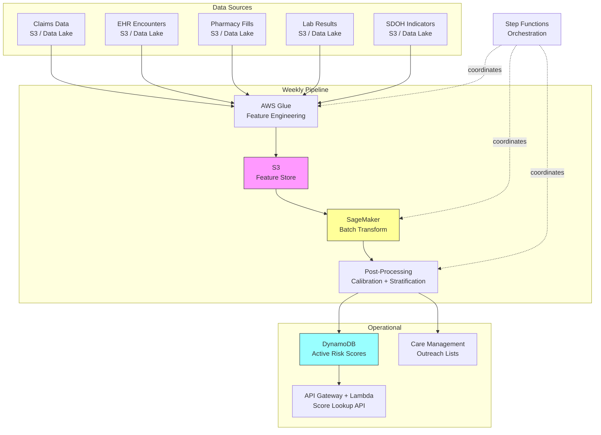

# Recipe 7.4 Architecture and Implementation: ED Visit Prediction

*Companion to [Recipe 7.4: ED Visit Prediction](chapter07.04-ed-visit-prediction). This page covers the AWS architecture, services, prerequisites, and pseudocode. For the problem framing and the conceptual approach, start with the main recipe.*

---

## The AWS Implementation

### Why These Services

**Amazon SageMaker for model training and hosting.** SageMaker provides the managed ML infrastructure for the entire model lifecycle: training gradient-boosted models at scale, running hyperparameter tuning jobs, hosting the trained model for batch inference, and managing model versions. For a batch-scoring workload like this, SageMaker Batch Transform is the right deployment pattern (score all patients at once, no need for a real-time endpoint sitting idle between scoring cycles).

**AWS Glue for data aggregation and feature engineering.** The ETL pipeline that consolidates claims, pharmacy, lab, and encounter data into patient-level features is a classic Glue workload: scheduled, Spark-based, handling joins across large datasets. Glue also maintains the Data Catalog, which makes the feature store discoverable and auditable. If source data resides in separate AWS accounts (common in large health systems), use cross-account IAM roles with external IDs for the Glue job to assume, or replicate source data into the analytics account using S3 Replication with KMS re-encryption.

**Amazon S3 for data lake storage.** Raw source data, engineered features, model artifacts, and scoring results all live in S3. The data lake architecture gives you full lineage: you can always trace a risk score back to the specific features that produced it, and those features back to the specific claims and encounters that generated them. Partition the feature store by scoring date (e.g., `s3://bucket/features/scoring_date=2026-06-01/`). Retain historical feature snapshots for at least 12 months to support audit queries, model retraining on historical features, and incident investigation. Each DynamoDB record includes `model_version`; pair this with the date-partitioned feature store for full score lineage.

**Amazon Athena for ad-hoc analysis and monitoring.** Clinicians and analysts need to query risk scores, drill into feature drivers, and validate model outputs. Athena's serverless SQL interface against the S3 data lake makes this accessible without provisioning infrastructure.

**Amazon DynamoDB for operational risk scores.** Once batch scoring completes, the active risk scores (current tier, primary risk drivers, recommended interventions) land in DynamoDB for low-latency lookup by the care management workflow tools. When a care manager opens a patient's record, the risk score needs to appear in milliseconds, not minutes.

**AWS Step Functions for pipeline orchestration.** The weekly scoring pipeline (aggregate data, engineer features, run batch transform, calibrate scores, write to DynamoDB, generate outreach lists) has dependencies between steps and needs error handling at each stage. Step Functions provides the workflow orchestration with built-in retry logic and failure notifications. Each step should validate output completeness before proceeding: the Glue job verifies output row counts match input patient counts, the Batch Transform step checks for scoring failures and routes failed patients to a dead-letter queue for manual review, and the DynamoDB write step retries unprocessed items. The pipeline should fail loudly (SNS alert to on-call) if any step produces fewer than 95% of expected outputs. In healthcare, silent partial failures are dangerous: a pipeline that scores 90% of patients and silently drops 10% is worse than one that fails loudly and delays the entire list.

**Amazon CloudWatch for monitoring and alerting.** Model drift detection (are the prediction distributions shifting?), pipeline health (did this week's scoring job complete successfully?), and operational SLAs (did the outreach list reach the care management system by Monday morning?).

### Architecture Diagram



### Prerequisites

| Requirement | Details |
|-------------|---------|
| **AWS Services** | Amazon SageMaker, AWS Glue, Amazon S3, Amazon DynamoDB, AWS Step Functions, Amazon Athena, AWS Lambda, Amazon API Gateway, Amazon CloudWatch |
| **IAM Permissions** | Distributed across service-specific roles. Glue execution role: S3 read on source/feature buckets, Glue Data Catalog access. SageMaker execution role: S3 read on feature store, S3 write on model artifacts and scoring output, KMS encrypt/decrypt. Step Functions role: invoke Glue, SageMaker Batch Transform, Lambda. Post-processing Lambda: DynamoDB PutItem on risk scores table, S3 read on scoring output. API Lambda: DynamoDB GetItem only on risk scores table. Each role scoped to minimum required actions and specific resource ARNs. |
| **BAA** | AWS BAA signed (required: patient claims and clinical data are PHI) |
| **Encryption** | S3: SSE-KMS for all buckets; DynamoDB: encryption at rest (default); SageMaker: KMS for training volumes, model artifacts, and batch transform output; Glue: security configuration with KMS; all traffic over TLS |
| **DynamoDB PITR** | Enable Point-in-Time Recovery for risk score tables; supports audit and incident response |
| **VPC** | Production: SageMaker and Glue in private subnets with VPC endpoints for S3 (gateway), DynamoDB (gateway), SageMaker API, SageMaker Runtime, Glue, STS, KMS, and CloudWatch Logs (interface endpoints). No internet egress for PHI-processing components. Enable VPC Flow Logs. Deploy API Gateway as a Private endpoint accessible only within the VPC; care management systems in peered VPCs access the score lookup API through an interface VPC endpoint for API Gateway. |
| **CloudTrail** | Enabled: log all SageMaker, Glue, S3, and DynamoDB API calls for HIPAA audit trail |
| **Sample Data** | CMS Synthetic Medicare Claims (SynPUF) dataset for development. Never use real patient data in non-production environments. |
| **Cost Estimate** | Glue ETL: ~$5-20/run depending on data volume. SageMaker Batch Transform: ~$2-10/run for 100K patients. DynamoDB: pennies at this write volume. Compute cost per scoring cycle: $10-40 for a 100K member population. Total operational cost including S3 storage (24-month lookback across 5 sources), DynamoDB provisioned capacity for API serving, CloudWatch monitoring, and Step Functions orchestration is typically $100-300/month at this scale. |

### Ingredients

| AWS Service | Role |
|------------|------|
| **Amazon SageMaker** | Trains gradient-boosted model; runs weekly batch inference via Batch Transform |
| **AWS Glue** | ETL pipeline: aggregates source data, engineers patient-level features on schedule |
| **Amazon S3** | Data lake: raw data, feature store, model artifacts, scoring output |
| **Amazon DynamoDB** | Operational store: current risk scores for low-latency API lookup |
| **AWS Step Functions** | Orchestrates weekly pipeline: ETL, scoring, post-processing, delivery |
| **Amazon Athena** | Ad-hoc SQL queries against feature store and scoring results |
| **AWS Lambda** | API handler for score lookups; post-processing logic (calibration, routing) |
| **Amazon API Gateway** | REST API for care management systems to retrieve patient risk scores |
| **Amazon CloudWatch** | Pipeline monitoring, drift detection alarms, SLA tracking |
| **AWS KMS** | Encryption key management for all PHI-containing storage and compute |

### Code

> **Reference implementations:** The following AWS sample repos demonstrate patterns used in this recipe:
>
> - [`amazon-sagemaker-examples`](https://github.com/aws/amazon-sagemaker-examples): Comprehensive SageMaker examples including batch transform, built-in algorithms (XGBoost), and model monitoring
> - [`aws-healthcare-lifescience-ai-ml`](https://github.com/aws-samples/aws-healthcare-lifescience-ai-ml): Healthcare-specific ML examples on AWS including predictive analytics patterns
> - [`amazon-sagemaker-mlops-workshop`](https://github.com/aws-samples/amazon-sagemaker-mlops-workshop): End-to-end MLOps pipeline patterns with SageMaker, Step Functions, and model registry

#### Walkthrough

**Step 1: Data aggregation.** The pipeline begins by consolidating patient data from multiple source systems into a unified view. Claims data provides ED visit history and diagnoses. Pharmacy data reveals medication adherence. EHR encounters show care engagement patterns. Lab results indicate disease control. And where available, social determinant indicators flag transportation, housing, or food security barriers. This consolidation runs on a schedule (weekly for most implementations) and produces a patient-level row for every active member. Skip this step and you're building predictions on incomplete information, which in practice means you'll identify the clinically complex patients (who have lots of claims data) while missing the socially complex patients (whose risk drivers live outside the clinical record).

```pseudocode
FUNCTION aggregate_patient_data(scoring_date):
    // Define the lookback period: how far back we look for historical patterns.
    // 24 months captures seasonal patterns and gives enough utilization history.
    lookback_start = scoring_date - 24 months
    
    // Pull claims-based utilization: ED visits, inpatient stays, office visits.
    // Group by patient, so each row summarizes one patient's entire history.
    claims_summary = QUERY claims_table:
        SELECT patient_id,
               COUNT(ed_visits in last 6 months) as ed_visits_6mo,
               COUNT(ed_visits in last 12 months) as ed_visits_12mo,
               COUNT(inpatient_stays in last 12 months) as ip_stays_12mo,
               COUNT(office_visits in last 6 months) as office_visits_6mo,
               DAYS_SINCE(most_recent_ed_visit) as days_since_last_ed,
               DAYS_SINCE(most_recent_pcp_visit) as days_since_last_pcp
        WHERE service_date BETWEEN lookback_start AND scoring_date
        GROUP BY patient_id

    // Pull pharmacy data: medication adherence and polypharmacy indicators.
    pharmacy_summary = QUERY pharmacy_table:
        SELECT patient_id,
               COUNT(DISTINCT active_medications) as active_med_count,
               AVG(proportion_days_covered) as avg_pdc,
               MIN(proportion_days_covered) as min_pdc,
               COUNT(gap_days > 7) as med_gap_events
        WHERE fill_date BETWEEN lookback_start AND scoring_date
        GROUP BY patient_id

    // Pull chronic condition indicators and severity scores.
    condition_summary = QUERY diagnosis_table:
        SELECT patient_id,
               COUNT(DISTINCT chronic_condition_categories) as chronic_count,
               MAX(hcc_risk_score) as hcc_score,
               HAS_CONDITION('diabetes') as has_diabetes,
               HAS_CONDITION('copd') as has_copd,
               HAS_CONDITION('chf') as has_chf,
               HAS_CONDITION('mental_health') as has_mental_health
        WHERE diagnosis_date BETWEEN lookback_start AND scoring_date
        GROUP BY patient_id

    // Join all summaries into a single patient-level feature table.
    // LEFT JOIN ensures we keep all patients even if they're missing
    // pharmacy or condition data (which is itself informative).
    patient_features = JOIN claims_summary, pharmacy_summary, condition_summary
                       ON patient_id
                       TYPE: LEFT JOIN (keep all patients)

    RETURN patient_features
```

**Step 2: Feature engineering.** Raw counts and dates aren't directly useful for prediction. This step transforms them into signals that capture the patterns most predictive of future ED use. The key insight: it's not just "how many ED visits" but "is the frequency accelerating?" and "what's the gap between routine care and acute care?" Ratio features, trend features, and interaction features often outperform the raw inputs. Skip this step and your model will be mediocre. Invest here and you'll outperform published benchmarks.

```pseudocode
FUNCTION engineer_features(patient_features, scoring_date):
    enhanced = patient_features  // start with the raw aggregated data

    FOR each patient in enhanced:
        // UTILIZATION TRAJECTORY: Is ED use accelerating?
        // Compare recent (6mo) to historical (12mo) rate.
        // A ratio > 1.0 means utilization is increasing.
        IF patient.ed_visits_12mo > 0:
            patient.ed_acceleration = (patient.ed_visits_6mo * 2) / patient.ed_visits_12mo
        ELSE:
            patient.ed_acceleration = 0

        // CARE ENGAGEMENT GAP: Ratio of acute to routine care.
        // Patients who use the ED frequently but see their PCP rarely
        // are a qualitatively different risk than frequent ED users who
        // also engage with primary care.
        total_visits = patient.ed_visits_6mo + patient.office_visits_6mo
        IF total_visits > 0:
            patient.ed_to_total_ratio = patient.ed_visits_6mo / total_visits
        ELSE:
            patient.ed_to_total_ratio = 0

        // MEDICATION RISK: Combine adherence and complexity.
        // High medication count + low adherence = strong risk signal.
        patient.med_risk_score = patient.active_med_count * (1 - patient.avg_pdc)

        // RECENCY SIGNAL: How recently did they use the ED?
        // Inverse of days since last visit. Recent visits are much more
        // predictive than visits 18 months ago.
        IF patient.days_since_last_ed is not NULL:
            patient.ed_recency = 1.0 / (patient.days_since_last_ed + 1)
        ELSE:
            patient.ed_recency = 0  // never visited ED in lookback window

        // PCP DISENGAGEMENT: Days since last PCP visit, normalized.
        // Patients who haven't seen their PCP in 6+ months are at higher risk.
        patient.pcp_disengaged = 1 IF patient.days_since_last_pcp > 180 ELSE 0

        // DISEASE COMPLEXITY INTERACTION: Multiple chronic conditions
        // combined with poor medication adherence is multiplicative risk.
        patient.complexity_adherence_interaction = patient.chronic_count * (1 - patient.min_pdc)

    RETURN enhanced
```

**Step 3: Model scoring.** The trained model receives the engineered feature set and produces a raw probability estimate for each patient. In production, this is a batch operation: all active patients are scored in a single pass. The model itself is a gradient-boosted tree (XGBoost) trained on historical data where the label was "had an ED visit within 60 days of the feature extraction date." The output is a probability between 0 and 1. These raw probabilities need calibration before they're operationally useful (next step). In production, validate the model artifact checksum against the model registry before scoring. SageMaker Model Registry provides versioning and approval workflows that prevent unapproved models from entering the scoring pipeline. Skip calibration and you'll have a model that ranks patients correctly but whose absolute probability estimates are systematically too high or too low.

```pseudocode
FUNCTION score_patients(feature_table, model_artifact):
    // Load the trained model artifact.
    // In production, this is versioned and tracked in a model registry.
    model = LOAD_MODEL(model_artifact)

    // Define which columns are model inputs.
    // These must match exactly what the model was trained on.
    feature_columns = [
        "ed_visits_6mo", "ed_visits_12mo", "ip_stays_12mo",
        "office_visits_6mo", "days_since_last_ed", "days_since_last_pcp",
        "active_med_count", "avg_pdc", "min_pdc", "med_gap_events",
        "chronic_count", "hcc_score",
        "has_diabetes", "has_copd", "has_chf", "has_mental_health",
        "ed_acceleration", "ed_to_total_ratio", "med_risk_score",
        "ed_recency", "pcp_disengaged", "complexity_adherence_interaction"
    ]

    // Score all patients in batch. Each gets a raw probability.
    FOR each patient in feature_table:
        input_vector = patient[feature_columns]
        patient.raw_score = model.predict_probability(input_vector)

        // Also extract feature importance for this specific prediction.
        // SHAP values tell us WHY this patient scored high or low.
        // Critical for care managers: "This patient is high-risk because
        // of medication non-adherence and accelerating ED visits."
        patient.shap_values = model.explain(input_vector)
        patient.top_risk_drivers = TOP_3_FEATURES_BY_SHAP(patient.shap_values)

    RETURN feature_table  // now includes raw_score and risk_drivers per patient
```

**Step 4: Calibration and stratification.** Raw model scores are recalibrated so that probabilities correspond to actual outcome rates, then patients are assigned to action tiers based on care management capacity. The thresholds are set pragmatically: if your team can manage outreach to 150 patients per week, the "high-risk" tier should capture approximately 150 patients. This is where prediction meets operational reality. Skip calibration and your care managers won't trust the scores. Set thresholds without considering capacity and you'll generate lists that nobody can actually act on.

```pseudocode
FUNCTION calibrate_and_stratify(scored_patients, calibration_model, capacity_config):
    // Apply Platt scaling (logistic calibration) to raw model outputs.
    // The calibration model was fit on a held-out validation set during training.
    FOR each patient in scored_patients:
        patient.calibrated_score = calibration_model.transform(patient.raw_score)

    // Sort patients by calibrated score, highest risk first.
    sorted_patients = SORT scored_patients BY calibrated_score DESCENDING

    // Assign tiers based on operational capacity.
    // These thresholds are tuned to match care management bandwidth.
    high_risk_count = capacity_config.weekly_outreach_capacity  // e.g., 150
    medium_risk_count = high_risk_count * 3  // next 450 for lighter-touch interventions

    FOR i, patient in ENUMERATE(sorted_patients):
        IF i < high_risk_count:
            patient.risk_tier = "HIGH"
            patient.recommended_action = "Care manager outreach within 48 hours"
        ELSE IF i < high_risk_count + medium_risk_count:
            patient.risk_tier = "MEDIUM"
            patient.recommended_action = "Automated engagement (portal message, text)"
        ELSE:
            patient.risk_tier = "LOW"
            patient.recommended_action = "Standard care, rescore next cycle"

    RETURN sorted_patients
```

**Step 5: Store results and generate outreach lists.** The final step writes calibrated scores to the operational database for real-time lookup and generates the prioritized outreach list that care managers will work from Monday morning. Each record includes not just the score but the top risk drivers (so the care manager knows what to address) and the recommended intervention type. The outreach list is the product of this entire pipeline. If it doesn't reach the right people in a format they can act on, everything upstream was wasted effort. The delivery mechanism (SQS, SNS, or direct API integration) must use encryption at rest (SSE-KMS for SQS) and enforce IAM policies restricting which principals can receive messages. The outreach list contains PHI and must be treated with the same security posture as the source data. Scope API Gateway access with IAM authorization or Cognito user pools: care managers need the complete risk driver explanation, while patient-facing systems should see only the risk tier and recommended action.

```pseudocode
FUNCTION store_and_route(stratified_patients, scoring_date):
    // Write each patient's current risk score to operational database.
    // This enables real-time lookups from care management tools.
    FOR each patient in stratified_patients:
        WRITE to risk_scores_table:
            patient_id       = patient.patient_id
            score_date       = scoring_date
            risk_score       = patient.calibrated_score
            risk_tier        = patient.risk_tier
            top_drivers      = patient.top_risk_drivers  // e.g., ["med_non_adherence", "ed_acceleration"]
            recommended_action = patient.recommended_action
            model_version    = CURRENT_MODEL_VERSION
            expires_at       = scoring_date + scoring_interval  // score is stale after next cycle

    // Generate the outreach list for care management.
    // Only HIGH and MEDIUM tier patients need active intervention.
    outreach_list = FILTER stratified_patients WHERE risk_tier IN ("HIGH", "MEDIUM")

    // Group by recommended intervention type for routing.
    care_manager_list = FILTER outreach_list WHERE risk_tier = "HIGH"
    automated_list    = FILTER outreach_list WHERE risk_tier = "MEDIUM"

    // Deliver lists to downstream systems.
    PUBLISH care_manager_list TO care_management_queue
    PUBLISH automated_list TO patient_engagement_system

    // Log pipeline completion for monitoring.
    LOG "Scoring complete: {COUNT(stratified_patients)} patients scored, " +
        "{COUNT(care_manager_list)} high-risk, {COUNT(automated_list)} medium-risk"

    RETURN scoring_date, COUNT(care_manager_list), COUNT(automated_list)
```

> **Curious how this looks in Python?** The pseudocode above covers the concepts. If you'd like to see sample Python code that demonstrates these patterns using boto3, check out the [Python Example](chapter07.04-python-example). It walks through each step with inline comments and notes on what you'd need to change for a real deployment.

### Expected Results

**Sample output for a high-risk patient:**

```json
{
  "patient_id": "PAT-2847291",
  "score_date": "2026-06-01",
  "risk_score": 0.73,
  "risk_tier": "HIGH",
  "top_drivers": [
    {"feature": "ed_acceleration", "direction": "increasing", "description": "ED visits accelerating: 4 in last 6mo vs. 5 in prior 12mo"},
    {"feature": "min_pdc", "direction": "decreasing", "description": "Medication adherence dropped to 42% for metformin"},
    {"feature": "pcp_disengaged", "direction": "flag", "description": "No PCP visit in 7 months"}
  ],
  "recommended_action": "Care manager outreach within 48 hours",
  "model_version": "ed-risk-v2.3",
  "expires_at": "2026-06-08"
}
```

**Performance benchmarks:**

| Metric | Typical Value |
|--------|---------------|
| AUROC (discrimination) | 0.72-0.80 |
| Calibration slope | 0.9-1.1 (well-calibrated) |
| Positive predictive value (top decile) | 30-45% |
| Sensitivity (at top 10% threshold) | 25-35% |
| Batch scoring latency (100K patients) | 8-15 minutes |
| End-to-end pipeline time | 30-60 minutes |
| Cost per scoring cycle | $10-40 |

**Where it struggles:** Patients new to the system (less than 6 months of history), which limits utilization-based features. Patients whose ED use is driven by factors completely outside the clinical record (domestic violence, acute psychosocial crises). Populations with very low ED base rates where the signal-to-noise ratio is poor. And patients who are genuinely complex and will use the ED regardless of outreach.

---

## Why This Isn't Production-Ready

The pseudocode and architecture above demonstrate the pattern. Deploying this to a care management program requires addressing several gaps:

**Model validation and fairness testing.** Before deployment, the model needs subgroup analysis: does it perform equally well across race, ethnicity, age, and gender? ED utilization patterns differ systematically across populations, and a model trained on aggregate data can encode those disparities. If your model disproportionately flags Black patients as high-risk (because historical utilization data reflects systemic barriers to primary care access), you need to understand whether that's an accurate signal or an encoded bias, and how your intervention design accounts for it.

**Feedback loop implementation.** The model needs to learn from outcomes. Did the high-risk patients who received outreach actually avoid ED visits? Did the patients scored low-risk end up in the ED anyway? Without this feedback loop, the model degrades over time as the population and care delivery environment change.

**Intervention capacity alignment.** The model produces as many high-risk patients as you tell it to (via threshold tuning). But care management staffing isn't infinitely elastic. If your team can reach 100 patients per week and the model wants to flag 300, someone needs to make a prioritization decision. Build that constraint into the system design, not as an afterthought.

**Consent and transparency.** Patients should know they're being proactively monitored. The outreach itself makes this visible ("We noticed you haven't filled your medication recently and wanted to check in"), but organizational policy on predictive analytics disclosure varies. Know your organization's stance before deploying.

---

## Variations and Extensions

**Real-time scoring at care transitions.** Instead of weekly batch scoring only, trigger an immediate rescore when certain high-signal events occur: hospital discharge, ED visit (to catch escalation), medication discontinuation, or missed follow-up appointment. This captures acute risk elevation between batch cycles and enables same-day outreach for patients whose risk just spiked.

**Multi-outcome modeling.** Extend beyond binary ED prediction to predict the type of ED visit (primary-care-sensitive vs. mental health crisis vs. injury), which informs different intervention pathways. A patient at risk for a diabetes-related ED visit needs pharmacy outreach. A patient at risk for a mental health crisis needs behavioral health follow-up. Same model infrastructure, different labels.

**Intervention effectiveness feedback.** Track which interventions actually reduce ED visits for which patient segments. Over time, this builds an evidence base for matching patients to interventions, not just identifying risk. Patients with medication adherence as the top driver respond differently to outreach than patients with transportation as the top driver. Use the feedback data to personalize the intervention, not just the risk score.

---

## Additional Resources

**AWS Documentation:**
- [Amazon SageMaker Batch Transform](https://docs.aws.amazon.com/sagemaker/latest/dg/batch-transform.html)
- [Amazon SageMaker XGBoost Algorithm](https://docs.aws.amazon.com/sagemaker/latest/dg/xgboost.html)
- [AWS Glue ETL Jobs](https://docs.aws.amazon.com/glue/latest/dg/aws-glue-programming-etl.html)
- [AWS Step Functions](https://docs.aws.amazon.com/step-functions/latest/dg/welcome.html)
- [AWS HIPAA Eligible Services](https://aws.amazon.com/compliance/hipaa-eligible-services-reference/)
- [Architecting for HIPAA on AWS (Whitepaper)](https://docs.aws.amazon.com/whitepapers/latest/architecting-hipaa-security-and-compliance-on-aws/welcome.html)

**AWS Sample Repos:**
- [`amazon-sagemaker-examples`](https://github.com/aws/amazon-sagemaker-examples): Comprehensive SageMaker examples including XGBoost, batch transform, and model monitoring
- [`aws-healthcare-lifescience-ai-ml`](https://github.com/aws-samples/aws-healthcare-lifescience-ai-ml): Healthcare and life science ML examples on AWS
- [`amazon-sagemaker-mlops-workshop`](https://github.com/aws-samples/amazon-sagemaker-mlops-workshop): End-to-end MLOps pipeline patterns with SageMaker and Step Functions

**AWS Solutions and Blogs:**
- [Predict Patient No-Shows Using ML (AWS Blog)](https://aws.amazon.com/blogs/machine-learning/predicting-patient-no-shows-using-amazon-sagemaker/): Related predictive analytics pattern in healthcare using SageMaker
- [Machine Learning Best Practices in Healthcare and Life Sciences (Whitepaper)](https://docs.aws.amazon.com/whitepapers/latest/ml-best-practices-healthcare-life-sciences/ml-best-practices-healthcare-life-sciences.html): Best practices for healthcare ML on AWS including data governance and model validation

---

## Estimated Implementation Time

| Phase | Duration |
|-------|----------|
| **Basic** (single-source features, simple model, manual list delivery) | 4-6 weeks |
| **Production-ready** (multi-source features, calibrated model, automated pipeline, care management integration) | 10-14 weeks |
| **With variations** (real-time triggers, multi-outcome, intervention feedback loop) | 16-22 weeks |

---


---

*← [Main Recipe 7.4](chapter07.04-ed-visit-prediction) · [Python Example](chapter07.04-python-example) · [Chapter Preface](chapter07-preface)*
