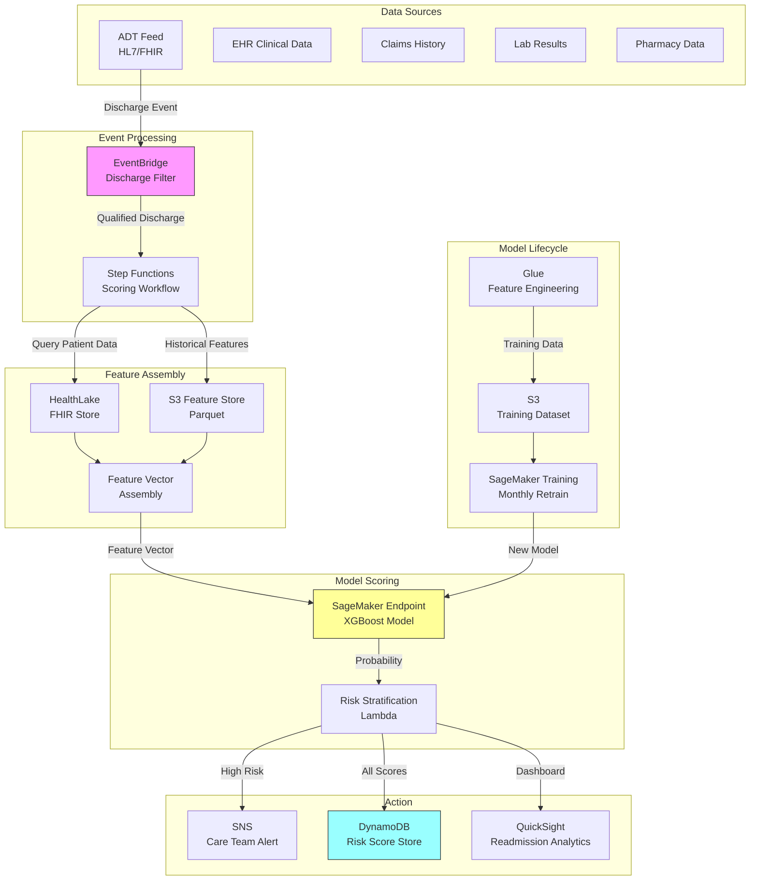

# Recipe 7.5: 30-Day Readmission Risk

**Complexity:** Medium · **Phase:** Growth · **Estimated Cost:** ~$0.003 per discharge scored

---

## The Problem

A patient gets discharged from the hospital on a Thursday afternoon. They're handed a stack of papers: medication instructions, follow-up appointment reminders, dietary guidelines, wound care protocols. They nod along, sign the discharge form, and go home. Two weeks later, they're back in the ED with the same condition, or a complication of it, or something that could have been caught with a single phone call from a nurse.

This is the 30-day readmission problem, and it is one of the most studied, most measured, and most financially punishing quality metrics in American healthcare.

CMS penalizes hospitals for excess readmissions through the Hospital Readmissions Reduction Program (HRRP). The penalties are real: up to 3% of total Medicare reimbursement, applied across all Medicare discharges, not just the readmitted ones. For a mid-size hospital doing $200M in Medicare revenue, that's up to $6M at stake annually. The program covers heart failure, AMI, pneumonia, COPD, hip/knee replacement, and CABG. And the penalty calculation compares your readmission rate against a risk-adjusted expected rate, so you can't game it by simply avoiding sick patients.

But the financial penalty is almost secondary to the human cost. A readmission usually means something went wrong in the transition of care. The patient didn't understand their medications. They couldn't get to their follow-up appointment. Their home environment wasn't safe for recovery. They developed a complication that nobody was monitoring for. These are preventable failures, and they happen at scale: roughly 15-20% of Medicare patients are readmitted within 30 days of discharge.

The good news: targeted post-discharge interventions work. Transition care programs, nurse follow-up calls, medication reconciliation, home health visits, remote patient monitoring. These programs reduce readmissions by 20-40% when applied to the right patients. The key phrase there is "the right patients." These interventions are expensive. You can't give every discharged patient a dedicated care transition nurse. You need to know who is most likely to bounce back, so you can focus your limited resources where they'll have the most impact.

That's the prediction problem. Score every patient at discharge. Identify the high-risk ones. Route them to the appropriate intervention. Measure whether it worked.

---

## The Technology: Predicting Who Comes Back

### Readmission Prediction as a Time-Bounded Classification Problem

At its core, 30-day readmission prediction is binary classification with a fixed time horizon: will this patient be readmitted to any acute care hospital within 30 days of discharge? Yes or no. You train on historical discharge records where you know the outcome, then apply the model to new discharges in real time (or near-real-time) to generate risk scores.

The 30-day window is not arbitrary. It's the CMS measurement window for HRRP penalties. Some organizations also track 7-day and 90-day readmissions, but 30-day is the regulatory standard and the most common prediction target.

This sounds like a straightforward supervised learning problem, and conceptually it is. But the details are where it gets interesting.

### What Makes This Harder Than It Looks

**The base rate problem.** Overall 30-day readmission rates hover around 15-20% for Medicare populations, lower for commercial. That means your positive class is the minority. A model that predicts "no readmission" for everyone achieves 80-85% accuracy. Useless, but it looks good on a slide. You need metrics that account for class imbalance: AUC-ROC, precision-recall curves, and calibration plots. The C-statistic (equivalent to AUC) for most published readmission models falls between 0.60 and 0.75. That's meaningfully better than chance, but it's not the 0.95+ AUC you see in image classification papers. This is a hard prediction problem with inherent irreducible uncertainty.

**The information availability problem.** The most useful time to generate a readmission risk score is at discharge, because that's when you can still intervene (schedule follow-up, arrange home health, activate a care transition program). But at discharge, you don't yet have post-discharge data: did the patient fill their prescriptions? Did they make it to their follow-up? Are they eating properly? The factors that most directly cause readmissions are often post-discharge behaviors that you can't observe at prediction time. You're predicting with incomplete information by design.

**The social determinant gap.** Clinical data (diagnoses, procedures, lab values, medications) is readily available in the EHR. Social determinants of health (housing stability, food security, transportation access, social isolation, health literacy) are powerful predictors of readmission but are rarely captured in structured form. A patient who lives alone, can't drive, and doesn't fully understand their discharge instructions is at dramatically higher risk than their clinical profile alone would suggest. Most models underperform on this axis because the data simply isn't there.

**The "planned" vs. "unplanned" distinction.** Not all readmissions are bad. A patient discharged after a staging procedure who returns for their planned surgery is technically a readmission, but it's not a quality failure. CMS excludes planned readmissions from penalty calculations using a complex algorithm. Your prediction model needs to target unplanned readmissions specifically, which means your training labels need to apply the same exclusion logic.

**Case mix variation.** A hospital that treats sicker patients will naturally have higher readmission rates. CMS accounts for this through risk adjustment (comparing your observed rate against an expected rate given your patient mix). Your internal prediction model needs to be useful for operational decisions (who gets the intervention), not just for reporting. That means raw probability matters more than relative ranking.

### Feature Categories That Drive Predictions

The features that predict 30-day readmission cluster into several domains:

**Index admission characteristics.** Length of stay, admission source (ED vs. elective vs. transfer), discharge disposition (home vs. SNF vs. home health), primary diagnosis, procedure codes, ICU days, number of consultants involved. Longer stays and ICU involvement signal complexity. Discharge to home without services for a complex patient is a red flag.

**Clinical severity indicators.** Lab values at discharge (albumin, BNP, creatinine, hemoglobin), vital sign trends, number of active diagnoses, Elixhauser or Charlson comorbidity indices, medication count at discharge. Patients discharged with abnormal labs or on 10+ medications are higher risk.

**Prior utilization history.** Number of hospitalizations in the past 6-12 months, ED visits, prior 30-day readmissions. Past behavior is the single strongest predictor of future behavior. A patient with three admissions in the last six months is almost certainly coming back.

**Medication complexity.** Number of discharge medications, number of medication changes during the stay, high-risk medications (anticoagulants, insulin, opioids), polypharmacy indicators. Medication errors and non-adherence are leading causes of preventable readmissions.

**Functional and social factors.** When available: living situation, mobility status, cognitive status, caregiver availability, insurance type (as a proxy for access), zip code-level deprivation indices. These are often the most predictive features but the hardest to capture systematically.

**Discharge process indicators.** Whether a follow-up appointment was scheduled before discharge, whether medication reconciliation was completed, whether discharge education was documented, time of day and day of week of discharge (Friday afternoon discharges have worse outcomes because follow-up resources are unavailable over the weekend).

### Model Approaches: What Works

**LACE and HOSPITAL scores.** These are simple, validated point-based scoring systems that use a handful of variables (Length of stay, Acuity of admission, Comorbidities, ED visits in prior 6 months for LACE). They're easy to implement, require no ML infrastructure, and provide a reasonable baseline. Their C-statistics typically fall in the 0.60-0.68 range. They're a good starting point but leave significant predictive power on the table.

**Gradient boosted trees (XGBoost, LightGBM).** The workhorse of tabular healthcare prediction. These models handle mixed feature types, missing values, and non-linear interactions naturally. With a well-engineered feature set, they typically achieve C-statistics of 0.68-0.75 for 30-day readmission. They also produce feature importance scores, which helps with clinical interpretability and intervention targeting.

**Deep learning on event sequences.** Recurrent neural networks or transformers trained on the full sequence of clinical events (diagnoses, procedures, medications, labs over time) can capture temporal patterns that point-in-time features miss. These approaches show promise in research settings but require substantially more data, engineering effort, and compute. For most hospital systems, gradient boosting on well-engineered features is the practical sweet spot.

**Ensemble approaches.** Combining a clinical rules-based score (like LACE) with a machine learning model often outperforms either alone. The rules capture known clinical risk factors; the ML model captures subtle patterns in the data that clinicians haven't codified. A simple weighted average or stacking approach works well.

### Calibration: The Most Underrated Requirement

For readmission prediction, calibration is arguably more important than discrimination. Here's why: your care transition team has finite capacity. If you tell them "these 50 patients are high-risk," they need to trust that those patients genuinely have elevated risk. If your model says "40% readmission probability" but the actual rate for that group is 20%, you're wasting half your intervention capacity on patients who would have been fine anyway.

Calibration means that predicted probabilities match observed frequencies. Platt scaling or isotonic regression applied after model training can fix calibration without sacrificing discrimination. Always check calibration plots stratified by key subgroups (diagnosis category, age, race) because a model can be well-calibrated overall but poorly calibrated for specific populations.

### Fairness and Bias Considerations

Readmission risk models trained on historical data will encode existing disparities. Patients from disadvantaged communities have higher readmission rates partly because of worse post-discharge support systems (fewer pharmacies, less transportation, fewer follow-up options). A model that accurately predicts this disparity might seem "fair" in a statistical sense, but using it to allocate interventions could either help (directing more resources to disadvantaged patients) or harm (if high-risk scores are used punitively or to avoid admitting certain patients).

The ethical framing matters: are you using the score to help high-risk patients get more support, or to penalize them? The same model can serve either purpose depending on how the score is operationalized. Be explicit about this in your implementation design.

---

## General Architecture Pattern

The readmission risk pipeline has five logical stages:

```
[Discharge Event Detection] → [Feature Assembly] → [Model Scoring] → [Risk Stratification] → [Intervention Routing]
```

**Discharge Event Detection.** The pipeline triggers when a patient is discharged from an inpatient stay. This requires integration with the hospital's ADT (Admit-Discharge-Transfer) system, typically via HL7 or FHIR event feeds. The trigger must distinguish inpatient discharges from observation stays, ED visits, and outpatient procedures. Timing matters: you want the score available within hours of discharge, not days.

**Feature Assembly.** Pull the relevant data for the discharged patient from available source systems: EHR (diagnoses, procedures, labs, medications, vitals), claims history (prior utilization), ADT history (prior admissions, ED visits), and any available social/demographic data. Assemble these into the feature vector the model expects. This step often involves real-time queries against multiple systems, which makes it the most architecturally complex piece.

**Model Scoring.** Pass the assembled feature vector through the trained model to produce a readmission probability. This should be a low-latency operation (sub-second for a single patient). The model itself is trained offline on historical data and deployed as a scoring endpoint. Retraining happens on a schedule (monthly or quarterly) as new outcome data accumulates.

**Risk Stratification.** Convert the raw probability into an actionable tier (high, medium, low) based on thresholds calibrated to your intervention capacity and cost-effectiveness analysis. A common approach: top 15% = high risk (intensive intervention), next 25% = medium risk (standard follow-up), remainder = low risk (routine discharge). The thresholds should be adjustable as your care transition team's capacity changes.

**Intervention Routing.** Based on the risk tier and the contributing risk factors, route the patient to the appropriate post-discharge program. High-risk heart failure patients might get a home health referral and daily telemonitoring. High-risk patients with medication complexity might get a pharmacist-led medication reconciliation call. The routing logic sits on top of the model and translates predictions into actions.

The feedback loop: track 30-day outcomes for all scored patients. Compare predicted vs. actual readmission rates by risk tier. Monitor for model drift (changing patient populations, new care patterns, coding changes). Retrain when performance degrades below acceptable thresholds.

---

## The AWS Implementation

### Why These Services

**Amazon SageMaker for model training and real-time inference.** Readmission scoring needs to happen within hours of discharge, which means you need a model endpoint that can score individual patients on demand. SageMaker gives you managed real-time endpoints that auto-scale, plus the training infrastructure for periodic retraining. The built-in XGBoost container is well-suited for the gradient boosted tree approach that dominates this problem space.

**Amazon HealthLake for clinical data aggregation.** HealthLake provides a FHIR-native data store that can ingest clinical data from EHR systems and normalize it into a queryable format. For readmission prediction, you need to pull together diagnoses, procedures, medications, labs, and encounter history for each patient at discharge time. HealthLake's FHIR search capabilities make this feature assembly step cleaner than querying raw EHR databases directly.

**AWS Glue for feature engineering pipelines.** The batch feature engineering (computing rolling utilization metrics, comorbidity indices, medication complexity scores) runs as scheduled ETL jobs. Glue handles the heavy transformations on historical data that feed model training, while real-time features are assembled at scoring time from HealthLake queries.

**Amazon EventBridge for discharge event processing.** ADT discharge events flow into EventBridge, which triggers the scoring pipeline. EventBridge's event filtering ensures only qualifying inpatient discharges (not observation stays or planned returns) trigger the model. This event-driven architecture means scores are generated automatically without manual intervention.

<!-- TODO (TechWriter): Expert review A3 (MEDIUM). Add dead letter queue guidance: SQS DLQ for failed scoring events, CloudWatch alarm on DLQ depth > 0, daily retry Lambda, and manual review fallback for patients not scored within 24 hours. -->

**AWS Step Functions for pipeline orchestration.** The scoring workflow (detect discharge, assemble features, invoke model, stratify risk, route intervention, store results) has multiple steps with error handling and retry logic. Step Functions coordinates this sequence and provides visibility into failures. If the feature assembly step fails (e.g., a source system is down), the workflow retries with backoff rather than silently dropping the patient.

**Amazon DynamoDB for risk score storage and lookup.** Scored patients need their risk tier accessible to downstream systems (care management platforms, EHR dashboards, nurse worklists) in real time. DynamoDB provides single-digit-millisecond lookups by patient ID. Scores are written at discharge and read by operational systems throughout the 30-day window.

**Amazon SNS for intervention notifications.** When a patient is scored as high-risk, the appropriate care team needs to be notified immediately. SNS delivers notifications to care transition nurses, case managers, or automated workflow systems based on the risk tier and contributing factors.

### Architecture Diagram



**Model versioning and rollback.** Before promoting a retrained model to the production endpoint, run shadow scoring for one to two weeks: score each discharge with both the current and candidate models, compare predictions, and validate that the candidate's calibration and discrimination meet minimum thresholds (AUC >= current model AUC - 0.02, calibration slope between 0.85 and 1.15). SageMaker Model Registry tracks model versions and approval status. Use SageMaker endpoint production variants for canary deployments. Always maintain the ability to roll back to the previous model version within minutes. A bad model deployment here has direct patient impact: under-prediction means high-risk patients miss interventions; over-prediction causes alert fatigue that erodes clinical trust.

### Prerequisites

| Requirement | Details |
|-------------|---------|
| **AWS Services** | Amazon SageMaker, Amazon HealthLake, AWS Glue, Amazon EventBridge, AWS Step Functions, Amazon DynamoDB, Amazon SNS, Amazon S3, Amazon QuickSight |
| **IAM Permissions** | `sagemaker:InvokeEndpoint`, `healthlake:SearchWithGet`, `healthlake:ReadResource`, `glue:StartJobRun`, `dynamodb:PutItem`, `dynamodb:GetItem`, `sns:Publish`, `s3:GetObject`, `s3:PutObject`, `states:StartExecution`. All permissions should be scoped to specific resource ARNs (e.g., `sagemaker:InvokeEndpoint` targeting `arn:aws:sagemaker:{region}:{account}:endpoint/readmission-risk-*`). Use separate IAM roles for the scoring Lambda, training pipeline, and monitoring functions with distinct permission boundaries. |
| **BAA** | Required. All services handling PHI must be covered under your AWS BAA. HealthLake, SageMaker, DynamoDB, S3, Glue, Step Functions, EventBridge, SNS, and QuickSight are all HIPAA-eligible. |
| **Encryption** | S3: SSE-KMS for feature stores and model artifacts. DynamoDB: encryption at rest (default). HealthLake: AWS-managed or customer-managed KMS keys. SageMaker: KMS encryption for training data, model artifacts, and endpoint traffic. All inter-service communication over TLS. |
| **VPC** | Production: SageMaker endpoints, Glue jobs, and Lambda functions in VPC with VPC endpoints for S3 (gateway), DynamoDB (gateway), SageMaker Runtime (interface), CloudWatch Logs (interface), Step Functions/states (interface), and SNS (interface). HealthLake accessed via interface endpoint (verify regional availability; HealthLake has more limited regional availability than other services in this architecture). |
| **CloudTrail** | Enabled for all API calls. Critical for HIPAA audit trail: who accessed which patient's risk score, when, and from where. Note: DynamoDB data events log table name and API action but not item keys. Implement application-level audit logging (patient_id, requesting identity, timestamp) for patient-level access auditing required by HIPAA. |
| **Sample Data** | MIMIC-III or MIMIC-IV (publicly available ICU dataset with readmission outcomes). CMS Synthetic Public Use Files for claims-based features. Never use real PHI in development. Model validation on real patient data requires a HIPAA-compliant environment with the same security controls as production. |
| **Cost Estimate** | SageMaker real-time endpoint (ml.m5.large): ~$0.115/hour (~$83/month). Scoring latency: <200ms per patient. At 100 discharges/day, the per-discharge cost is ~$0.003. HealthLake: $0.60/GB stored + $0.09 per 1000 read operations. Glue: $0.44/DPU-hour for batch feature engineering. Feature assembly involves 5-7 FHIR queries per patient; parallelize independent queries to keep assembly latency under 1 second. |

### Ingredients

| AWS Service | Role |
|------------|------|
| **Amazon SageMaker** | Model training (monthly), real-time scoring endpoint, model registry |
| **Amazon HealthLake** | FHIR-native clinical data store for real-time feature queries |
| **AWS Glue** | Batch feature engineering, historical feature computation, training data preparation |
| **Amazon EventBridge** | Discharge event ingestion and filtering |
| **AWS Step Functions** | Orchestrates the scoring workflow with error handling and retries |
| **Amazon DynamoDB** | Stores risk scores for real-time lookup by downstream systems |
| **Amazon SNS** | Delivers high-risk alerts to care transition teams |
| **Amazon S3** | Feature store (Parquet), model artifacts, training datasets, scoring audit logs |
| **Amazon QuickSight** | Readmission analytics dashboards for leadership and quality teams |
| **AWS KMS** | Encryption key management for all PHI-containing stores |
| **Amazon CloudWatch** | Monitoring, alerting on scoring failures, model performance metrics |

<!-- TODO (TechWriter): Expert review A2 (MEDIUM). Clarify feature store architecture: for >100 discharges/day, pre-compute historical utilization features nightly via Glue into DynamoDB keyed by patient_id. Scoring workflow queries HealthLake only for current-encounter features + DynamoDB for pre-computed historical features. This hybrid keeps latency under 500ms. -->

### Code

> **Reference implementations:** The following AWS sample repos demonstrate patterns used in this recipe:
>
> - [`amazon-healthlake-server-cdk`](https://github.com/aws-samples/amazon-healthlake-server-cdk): CDK constructs for deploying HealthLake with proper security configuration
> - [`amazon-sagemaker-examples`](https://github.com/aws/amazon-sagemaker-examples): SageMaker training and deployment patterns including XGBoost for healthcare use cases

#### Step 1: Discharge Event Detection and Filtering

**What this does:** Listens for ADT discharge events and filters to only qualified inpatient discharges that should be scored. Observation stays, planned readmissions, and transfers to other acute facilities are excluded.

**What goes wrong if you skip it:** You score patients who shouldn't be scored (observation stays aren't subject to readmission penalties), waste compute on irrelevant events, and pollute your outcome tracking with non-qualifying encounters.

```
FUNCTION handle_discharge_event(event):
    // Parse the ADT message (HL7 A03 or FHIR Encounter update)
    patient_id = event.patient_identifier
    encounter_type = event.encounter_class
    discharge_disposition = event.disposition
    length_of_stay = event.discharge_date - event.admit_date

    // Filter: only score qualifying inpatient discharges
    IF encounter_type NOT IN ["inpatient", "acute"]:
        LOG "Skipping non-inpatient encounter for patient {patient_id}"
        RETURN null

    // Exclude transfers to other acute facilities (not true discharges)
    IF discharge_disposition IN ["transfer_acute", "left_ama"]:
        LOG "Skipping transfer/AMA for patient {patient_id}"
        RETURN null

    // Exclude very short stays (likely observation misclassified)
    IF length_of_stay < 1 day:
        LOG "Skipping sub-24hr stay for patient {patient_id}"
        RETURN null

    // Qualified discharge: trigger scoring workflow
    RETURN {
        patient_id: patient_id,
        encounter_id: event.encounter_id,
        discharge_date: event.discharge_date,
        primary_diagnosis: event.primary_diagnosis,
        discharge_disposition: discharge_disposition
    }
```

#### Step 2: Feature Assembly from Clinical Data

**What this does:** Queries multiple data sources to assemble the complete feature vector for the discharged patient. Combines real-time clinical data from the current encounter with historical utilization patterns.

**What goes wrong if you skip it:** The model receives incomplete or stale data, producing unreliable risk scores. Missing features (especially prior utilization history) dramatically reduce predictive accuracy.

```
FUNCTION assemble_features(discharge_info):
    patient_id = discharge_info.patient_id
    encounter_id = discharge_info.encounter_id

    // --- Current Encounter Features ---
    // Query HealthLake for the index admission details
    encounter = FHIR_SEARCH("Encounter", id=encounter_id)
    conditions = FHIR_SEARCH("Condition", encounter=encounter_id)
    medications = FHIR_SEARCH("MedicationRequest", encounter=encounter_id)
    labs = FHIR_SEARCH("Observation", encounter=encounter_id, category="laboratory")
    procedures = FHIR_SEARCH("Procedure", encounter=encounter_id)

    current_features = {
        length_of_stay: encounter.length_of_stay_days,
        admission_source: encounter.admission_source,  // ED, elective, transfer
        discharge_disposition: encounter.discharge_disposition,
        primary_diagnosis_code: encounter.primary_diagnosis.icd10,
        diagnosis_count: COUNT(conditions),
        procedure_count: COUNT(procedures),
        icu_days: calculate_icu_days(encounter),
        discharge_medication_count: COUNT(medications WHERE status="active"),
        high_risk_medications: COUNT(medications WHERE code IN HIGH_RISK_MED_LIST),
        // Lab values at discharge (most recent)
        albumin_last: most_recent_value(labs, code="1751-7"),
        creatinine_last: most_recent_value(labs, code="2160-0"),
        hemoglobin_last: most_recent_value(labs, code="718-7"),
        sodium_last: most_recent_value(labs, code="2951-2"),
        bnp_last: most_recent_value(labs, code="42637-9")
    }

    // --- Historical Utilization Features ---
    // Look back 12 months for prior utilization patterns
    lookback_start = discharge_info.discharge_date - 365 days
    prior_encounters = FHIR_SEARCH("Encounter",
        patient=patient_id,
        date_range=[lookback_start, discharge_info.discharge_date],
        type="inpatient")
    prior_ed_visits = FHIR_SEARCH("Encounter",
        patient=patient_id,
        date_range=[lookback_start, discharge_info.discharge_date],
        type="emergency")

    history_features = {
        admissions_past_6mo: COUNT(prior_encounters WHERE date > now - 180 days),
        admissions_past_12mo: COUNT(prior_encounters),
        ed_visits_past_6mo: COUNT(prior_ed_visits WHERE date > now - 180 days),
        prior_30day_readmission: ANY(prior_encounters WHERE
            days_since_prior_discharge <= 30),
        days_since_last_admission: days_between(
            most_recent(prior_encounters).discharge_date,
            discharge_info.discharge_date)
    }

    // --- Comorbidity Features ---
    // Calculate Elixhauser comorbidity index from all active conditions
    all_conditions = FHIR_SEARCH("Condition", patient=patient_id, status="active")
    comorbidity_features = {
        elixhauser_score: calculate_elixhauser(all_conditions),
        has_chf: any_condition_in_group(all_conditions, "CHF"),
        has_diabetes: any_condition_in_group(all_conditions, "DIABETES"),
        has_copd: any_condition_in_group(all_conditions, "COPD"),
        has_ckd: any_condition_in_group(all_conditions, "CKD"),
        has_depression: any_condition_in_group(all_conditions, "DEPRESSION"),
        total_chronic_conditions: COUNT(all_conditions WHERE category="chronic")
    }

    // --- Demographic Features ---
    patient = FHIR_SEARCH("Patient", id=patient_id)
    demographic_features = {
        age: calculate_age(patient.birth_date),
        sex: patient.gender,
        insurance_type: patient.coverage_type,  // Medicare, Medicaid, Commercial
        zip_deprivation_index: lookup_adi(patient.address.postal_code)
    }

    // Combine all feature groups into single vector
    RETURN merge(current_features, history_features,
                 comorbidity_features, demographic_features)
```

#### Step 3: Model Scoring

**What this does:** Passes the assembled feature vector to the trained XGBoost model and returns a readmission probability between 0 and 1.

**What goes wrong if you skip it:** Obviously you don't get a risk score. But more subtly, if you skip the preprocessing and validation step, you'll send malformed features to the model and get garbage predictions without any error signal.

```
FUNCTION score_patient(feature_vector):
    // Validate feature completeness
    required_features = ["length_of_stay", "admissions_past_6mo",
                         "elixhauser_score", "age", "discharge_medication_count"]
    missing = [f FOR f IN required_features IF feature_vector[f] IS NULL]

    IF COUNT(missing) > 2:
        LOG_WARNING "Too many missing features for patient, using fallback score"
        RETURN {probability: null, method: "insufficient_data", missing: missing}

    // Handle missing values (model expects specific sentinel values)
    FOR each feature IN feature_vector:
        IF feature.value IS NULL:
            feature.value = -999  // XGBoost handles this as missing

    // Invoke the SageMaker endpoint
    response = SAGEMAKER_INVOKE(
        endpoint_name = "readmission-risk-v2",
        content_type = "text/csv",
        body = feature_vector_to_csv(feature_vector)
    )

    raw_probability = PARSE_FLOAT(response.body)

    // Apply calibration (Platt scaling learned during training)
    calibrated_probability = platt_scale(raw_probability,
        A = CALIBRATION_PARAMS.A,
        B = CALIBRATION_PARAMS.B)

    RETURN {
        probability: calibrated_probability,
        raw_score: raw_probability,
        method: "xgboost_v2",
        model_version: response.model_version,
        scored_at: NOW()
    }
```

#### Step 4: Risk Stratification and Intervention Routing

**What this does:** Converts the raw probability into an actionable risk tier and determines which intervention pathway the patient should receive based on their risk level and contributing factors.

**What goes wrong if you skip it:** A probability of 0.42 means nothing to a care transition nurse. They need "high risk, prioritize for home health referral." Without stratification and routing, the model output sits in a database and nobody acts on it.

```
FUNCTION stratify_and_route(score_result, feature_vector, discharge_info):
    probability = score_result.probability

    // Stratify into tiers based on calibrated thresholds
    // Thresholds are set based on intervention capacity and cost-effectiveness
    IF probability >= 0.35:
        risk_tier = "HIGH"
        intervention_level = "intensive"
    ELSE IF probability >= 0.20:
        risk_tier = "MEDIUM"
        intervention_level = "standard"
    ELSE:
        risk_tier = "LOW"
        intervention_level = "routine"

    // Determine primary risk drivers for intervention targeting
    // (from model feature importance for this specific patient)
    risk_drivers = get_top_contributing_features(feature_vector, top_n=5)

    // Route to appropriate intervention based on tier + drivers
    interventions = []

    IF risk_tier == "HIGH":
        // All high-risk patients get a nurse follow-up call within 48 hours
        interventions.ADD("nurse_callback_48hr")

        // Specific interventions based on risk drivers
        IF "discharge_medication_count" IN risk_drivers OR
           "high_risk_medications" IN risk_drivers:
            interventions.ADD("pharmacist_med_reconciliation")

        IF "admissions_past_6mo" IN risk_drivers:
            interventions.ADD("care_transition_program_enrollment")

        IF discharge_info.primary_diagnosis IN CHF_CODES:
            interventions.ADD("remote_weight_monitoring")

        IF feature_vector.zip_deprivation_index > 8:
            interventions.ADD("social_work_assessment")

    ELSE IF risk_tier == "MEDIUM":
        interventions.ADD("automated_check_in_call_day_7")
        interventions.ADD("ensure_followup_scheduled")

    // Store the complete risk assessment
    risk_assessment = {
        patient_id: discharge_info.patient_id,
        encounter_id: discharge_info.encounter_id,
        discharge_date: discharge_info.discharge_date,
        probability: probability,
        risk_tier: risk_tier,
        risk_drivers: risk_drivers,
        interventions: interventions,
        model_version: score_result.model_version,
        scored_at: score_result.scored_at,
        ttl: discharge_info.discharge_date + 45 days  // Keep 15 days past window
        // TODO (TechWriter): Expert review S4 (MEDIUM). Add note about compliance
        // retention requirements. 45-day TTL is operationally sound but scores that
        // influenced clinical decisions may need 6-10 year retention. Consider
        // archiving to S3 before TTL deletion.
    }

    // Write to DynamoDB for downstream system access
    DYNAMODB_PUT("readmission-risk-scores", risk_assessment)

    // Notify care team for high-risk patients
    // IMPORTANT: SNS messages with patient IDs + clinical indicators = PHI.
    // Restrict topic subscriptions to HIPAA-compliant endpoints only
    // (Lambda, SQS within VPC, or HTTPS endpoints under your BAA).
    // Never use email/SMS subscriptions for messages containing patient data.
    // If email alerts are needed, send minimal content ("1 new high-risk
    // discharge requires review") with a link to the secure dashboard.
    IF risk_tier == "HIGH":
        SNS_PUBLISH(
            topic = "high-risk-discharge-alerts",
            message = format_alert(risk_assessment),
            attributes = {
                "risk_tier": "HIGH",
                "primary_diagnosis": discharge_info.primary_diagnosis,
                "facility": discharge_info.facility_id
            }
        )

    RETURN risk_assessment
```

#### Step 5: Outcome Tracking and Model Monitoring

**What this does:** Monitors actual 30-day readmission outcomes against predictions, detects model drift, and triggers retraining when performance degrades.

**What goes wrong if you skip it:** Your model silently degrades over time as patient populations shift, coding practices change, or new care programs alter readmission patterns. Without monitoring, you won't know your predictions are wrong until someone manually audits them months later.

```
FUNCTION track_outcomes_and_monitor():
    // Run daily: check for readmissions among previously scored patients
    scored_patients = DYNAMODB_QUERY("readmission-risk-scores",
        discharge_date BETWEEN (today - 31 days) AND (today - 30 days))

    FOR each scored_patient IN scored_patients:
        // Check if patient was readmitted within 30 days
        readmissions = FHIR_SEARCH("Encounter",
            patient = scored_patient.patient_id,
            type = "inpatient",
            date_range = [scored_patient.discharge_date,
                         scored_patient.discharge_date + 30 days])

        // Exclude planned readmissions using CMS algorithm
        unplanned = FILTER(readmissions, is_unplanned_readmission)

        actual_outcome = 1 IF COUNT(unplanned) > 0 ELSE 0

        // Store outcome for model evaluation
        DYNAMODB_UPDATE("readmission-risk-scores",
            key = scored_patient.encounter_id,
            set actual_readmitted = actual_outcome,
            set outcome_date = NOW())

    // Weekly: calculate model performance metrics
    recent_scores = QUERY_LAST_30_DAYS_WITH_OUTCOMES()

    metrics = {
        auc_roc: calculate_auc(recent_scores.probability, recent_scores.actual),
        calibration_slope: calculate_calibration(recent_scores),
        brier_score: calculate_brier(recent_scores),
        observed_rate_high_tier: rate(recent_scores WHERE tier="HIGH"),
        observed_rate_low_tier: rate(recent_scores WHERE tier="LOW"),
        total_scored: COUNT(recent_scores),
        total_readmitted: SUM(recent_scores.actual)
    }

    // Publish metrics to CloudWatch
    CLOUDWATCH_PUT_METRICS("ReadmissionModel", metrics)

    // Alert if performance degrades
    IF metrics.auc_roc < 0.65 OR metrics.calibration_slope < 0.8:
        SNS_PUBLISH("model-performance-alerts",
            "Readmission model performance degraded. AUC: {metrics.auc_roc}. "
            "Consider retraining.")

    RETURN metrics
```

> **Curious how this looks in Python?** The pseudocode above covers the concepts. If you'd like to see sample Python code that demonstrates these patterns using boto3, check out the [Python Example](chapter07.05-python-example). It walks through each step with inline comments and notes on what you'd need to change for a real deployment.

---

## Expected Results

### Sample Output

```json
{
  "patient_id": "PAT-2847193",
  "encounter_id": "ENC-9928374",
  "discharge_date": "2026-03-15T14:30:00Z",
  "scored_at": "2026-03-15T15:02:33Z",
  "model_version": "readmission-xgb-v2.3",
  "probability": 0.41,
  "risk_tier": "HIGH",
  "risk_drivers": [
    {"feature": "admissions_past_6mo", "value": 3, "contribution": 0.12},
    {"feature": "discharge_medication_count", "value": 14, "contribution": 0.09},
    {"feature": "length_of_stay", "value": 8, "contribution": 0.07},
    {"feature": "has_chf", "value": true, "contribution": 0.06},
    {"feature": "albumin_last", "value": 2.8, "contribution": 0.05}
  ],
  "interventions": [
    "nurse_callback_48hr",
    "pharmacist_med_reconciliation",
    "care_transition_program_enrollment",
    "remote_weight_monitoring"
  ],
  "calibration_check": {
    "predicted_decile": 8,
    "historical_rate_for_decile": 0.38
  }
}
```

### Performance Benchmarks

| Metric | Expected Value | Notes |
|--------|---------------|-------|
| AUC-ROC (C-statistic) | 0.68-0.75 | Depends on feature richness; social determinants push toward upper range |
| Calibration slope | 0.90-1.10 | After Platt scaling; check quarterly |
| Brier score | 0.12-0.16 | Lower is better; baseline (prevalence) ~0.13 |
| Sensitivity at top 15% | 0.35-0.45 | Captures 35-45% of actual readmissions in top risk tier |
| PPV at top 15% | 0.28-0.38 | 28-38% of flagged patients actually readmit |
| Scoring latency | <500ms | End-to-end from feature assembly to score storage |
| Time from discharge to score | <2 hours | Includes ADT event propagation delay |
| Model retraining frequency | Monthly | Or when AUC drops below 0.65 |

### Where It Struggles

- **Patients with no prior history at your facility.** New patients or transfers from other systems have sparse feature vectors. The model defaults to population-level risk, which is less useful.
- **Social determinant-driven readmissions.** A patient readmitted because they couldn't afford their medications or had no transportation to follow-up won't be well-predicted by clinical features alone.
- **Planned readmissions misclassified as unplanned.** The CMS planned readmission algorithm isn't perfect. Some planned returns get labeled as failures, inflating your apparent readmission rate.
- **Weekend and holiday discharges.** Patients discharged when follow-up resources are unavailable have elevated risk that's driven by system factors, not patient factors. The model may not capture this well unless day-of-week features are included.
- **Rapidly changing care patterns.** If your hospital launches a new heart failure program that dramatically reduces CHF readmissions, the model trained on pre-program data will over-predict risk for CHF patients until retrained.

---

## The Honest Take

Here's what I've learned from watching organizations implement readmission prediction:

**The model is the easy part.** Getting a C-statistic of 0.70 with XGBoost on a decent feature set takes a few weeks of data science work. Getting the ADT integration working, the feature assembly pipeline reliable, the scores into the right hands at the right time, and the care transition team actually acting on the scores? That takes 6-12 months of operational work. The ML is maybe 20% of the effort.

**Calibration drift is real and sneaky.** Your model will be well-calibrated at launch. Six months later, it won't be. Patient populations shift. Coding practices change. New care programs alter the baseline readmission rate. If you're not monitoring calibration continuously, you'll discover the problem when your quality team notices that your "high-risk" patients aren't actually readmitting at the rate you predicted.

**Feature availability at scoring time is your biggest constraint.** The features that would be most predictive (post-discharge medication adherence, whether the patient actually made it to their follow-up, home environment safety) aren't available at the moment you need to score. You're always predicting with incomplete information. Accept this and design your intervention programs to gather the missing information early (the 48-hour nurse callback is partly a data collection mechanism, not just an intervention).

**The intervention matters more than the prediction.** A perfect risk score with no intervention pathway is worthless. A mediocre risk score paired with a well-designed care transition program will reduce readmissions. Invest at least as much in the "what do we do about it" question as in the "who is at risk" question.

**Clinician buy-in requires transparency.** If you show a hospitalist a black-box score of "0.42" with no explanation, they'll ignore it. If you show them "high risk: 3 admissions in 6 months, 14 discharge medications, low albumin, CHF," they'll nod and say "yeah, that tracks." Feature importance explanations aren't just nice-to-have; they're required for clinical adoption.

**The HRRP penalty structure creates perverse incentives.** The penalty is calculated at the hospital level, not the patient level. This means hospitals are incentivized to reduce readmissions for the penalty conditions (CHF, AMI, pneumonia, COPD, hip/knee, CABG) but may underinvest in readmission prevention for other conditions. Your model should serve patient care, not just penalty avoidance. Score all discharges, not just the penalty-eligible ones.

---

## Variations and Extensions

### Condition-Specific Models

Instead of one general readmission model, train separate models for high-volume conditions (CHF, COPD, pneumonia, surgical). Condition-specific models can use disease-specific features (ejection fraction for CHF, FEV1 for COPD, surgical site details for orthopedic) that a general model would dilute. The tradeoff: you need enough volume per condition to train reliable models, and you need to maintain multiple model endpoints. For large hospital systems with 500+ discharges per condition per year, this approach typically adds 2-5 points of AUC over a general model.

### Real-Time Risk Updating

Rather than scoring once at discharge, update the risk score as post-discharge information becomes available. Did the patient fill their prescriptions? (Pharmacy claims data, available within 24-48 hours.) Did they attend their follow-up? (Scheduling system data.) Did they call the nurse line with concerning symptoms? Each new data point can update the probability, allowing you to escalate or de-escalate interventions dynamically. This requires a streaming architecture (Kinesis or Kafka) rather than batch, but it catches the patients who were medium-risk at discharge but became high-risk three days later.

### Integration with Remote Patient Monitoring

For high-risk patients with connected devices (weight scales for CHF, pulse oximeters for COPD, blood pressure cuffs for hypertension), combine the discharge risk score with real-time physiological data. A patient who was scored as medium-risk at discharge but shows a 5-pound weight gain over 3 days should be escalated to high-risk immediately. This bridges the gap between the discharge-time prediction and the post-discharge reality.

---

## Related Recipes

- **Recipe 7.4: ED Visit Prediction** - Predicts emergency department utilization; shares many features and can be combined with readmission prediction for a unified acute utilization model.
- **Recipe 7.6: Rising Risk Identification** - Identifies patients whose risk trajectory is increasing over time; readmission risk is one input signal for rising risk detection.
- **Recipe 3.8: Readmission Risk Anomaly Detection** - Complementary approach using anomaly detection to identify unusual readmission patterns at the population level rather than individual patient scoring.
- **Recipe 4.7: Care Management Program Enrollment** - Uses risk scores (including readmission risk) to determine which patients should be enrolled in intensive care management programs.
- **Recipe 12.8: Disease Progression Trajectory Modeling** - Longer-term trajectory modeling that provides context for why a patient's readmission risk is elevated.

---

## Additional Resources

### AWS Documentation

- [Amazon SageMaker XGBoost Algorithm](https://docs.aws.amazon.com/sagemaker/latest/dg/xgboost.html) - Built-in XGBoost container configuration, hyperparameter tuning, and deployment patterns
- [Amazon HealthLake Developer Guide](https://docs.aws.amazon.com/healthlake/latest/devguide/what-is-amazon-health-lake.html) - FHIR data store setup, data ingestion, and search capabilities
- [AWS Step Functions Developer Guide](https://docs.aws.amazon.com/step-functions/latest/dg/welcome.html) - Workflow orchestration patterns, error handling, and retry configuration
- [Amazon EventBridge User Guide](https://docs.aws.amazon.com/eventbridge/latest/userguide/eb-what-is.html) - Event-driven architecture patterns and event filtering
- [Amazon SageMaker Model Monitor](https://docs.aws.amazon.com/sagemaker/latest/dg/model-monitor.html) - Automated model quality monitoring and drift detection
- [AWS HIPAA Eligible Services](https://aws.amazon.com/compliance/hipaa-eligible-services-reference/) - Current list of services covered under AWS BAA

### AWS Sample Repos

- [`amazon-sagemaker-examples`](https://github.com/aws/amazon-sagemaker-examples) - Comprehensive SageMaker examples including XGBoost training, deployment, and monitoring patterns
- [`amazon-healthlake-server-cdk`](https://github.com/aws-samples/amazon-healthlake-server-cdk) - CDK constructs for deploying HealthLake with security best practices
- [`aws-step-functions-data-science-sdk-python`](https://github.com/aws/aws-step-functions-data-science-sdk-python) - Python SDK for building ML workflows with Step Functions

### Industry References

- [CMS Hospital Readmissions Reduction Program](https://www.cms.gov/medicare/payment/prospective-payment-systems/acute-inpatient-pps/hospital-readmissions-reduction-program-hrrp) - Official program documentation, penalty methodology, and condition-specific measures
- [MIMIC-IV Clinical Database](https://physionet.org/content/mimiciv/) - Publicly available ICU dataset commonly used for readmission prediction research and model development
- [CMS Quality Measures - Hospital Inpatient Quality Reporting](https://qualitynet.cms.gov/) - Detailed risk-adjustment methodology for each HRRP condition, including the Yale/CORE readmission measures

---

## Estimated Implementation Time

| Phase | Duration | What You Get |
|-------|----------|--------------|
| **Basic** | 6-8 weeks | LACE-based scoring at discharge, manual worklist generation, retrospective validation |
| **Production-ready** | 4-6 months | ML model with real-time scoring, automated intervention routing, EHR integration, outcome tracking |
| **With variations** | 8-12 months | Condition-specific models, real-time risk updating, RPM integration, multi-site deployment |

---

**Tags:** `predictive-analytics`, `readmission`, `risk-scoring`, `care-transitions`, `quality-measures`, `HRRP`, `XGBoost`, `SageMaker`, `HealthLake`, `HIPAA`

---

[← Recipe 7.4: ED Visit Prediction](chapter07.04-ed-visit-prediction) | [Chapter 7 Index](chapter07-index) | [Recipe 7.6: Rising Risk Identification →](chapter07.06-rising-risk-identification)
