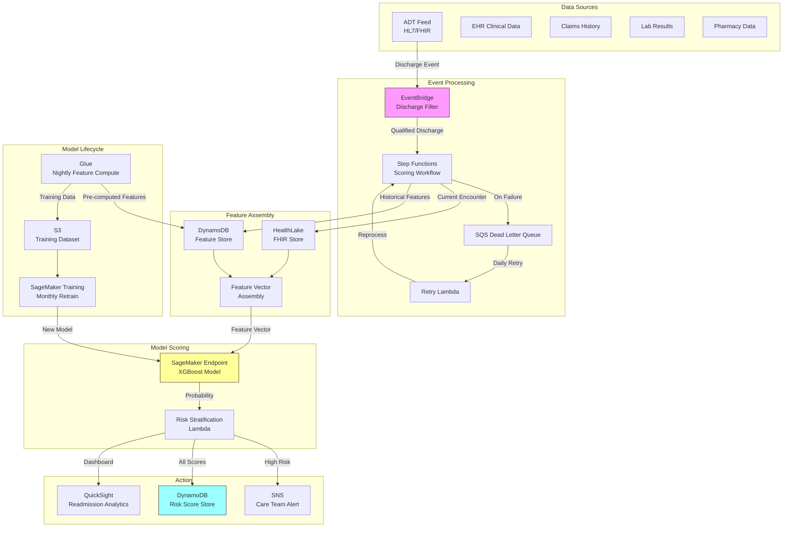

# Recipe 7.5 Architecture and Implementation: 30-Day Readmission Risk

*Companion to [Recipe 7.5: 30-Day Readmission Risk](chapter07.05-30-day-readmission-risk). This page covers the AWS architecture, services, prerequisites, and pseudocode. For the problem framing and the conceptual approach, start with the main recipe.*

---

## Why These Services

**Amazon SageMaker for model training and real-time inference.** Readmission scoring needs to happen within hours of discharge, which means you need a model endpoint that can score individual patients on demand. SageMaker gives you managed real-time endpoints that auto-scale, plus the training infrastructure for periodic retraining. The built-in XGBoost container is well-suited for the gradient boosted tree approach that dominates this problem space.

**Amazon HealthLake for clinical data aggregation.** HealthLake provides a FHIR-native data store that can ingest clinical data from EHR systems and normalize it into a queryable format. For readmission prediction, you need to pull together diagnoses, procedures, medications, labs, and encounter history for each patient at discharge time. HealthLake's FHIR search capabilities make this feature assembly step cleaner than querying raw EHR databases directly.

**AWS Glue for feature engineering pipelines.** The batch feature engineering (computing rolling utilization metrics, comorbidity indices, medication complexity scores) runs as scheduled ETL jobs. Glue handles the heavy transformations on historical data that feed model training, while real-time features are assembled at scoring time from HealthLake queries.

**Amazon EventBridge for discharge event processing.** ADT discharge events flow into EventBridge, which triggers the scoring pipeline. EventBridge's event filtering ensures only qualifying inpatient discharges (not observation stays or planned returns) trigger the model. This event-driven architecture means scores are generated automatically without manual intervention.

**AWS Step Functions for pipeline orchestration.** The scoring workflow (detect discharge, assemble features, invoke model, stratify risk, route intervention, store results) has multiple steps with error handling and retry logic. Step Functions coordinates this sequence and provides visibility into failures. If the feature assembly step fails (e.g., a source system is down), the workflow retries with backoff rather than silently dropping the patient.

**Amazon DynamoDB for risk score storage and lookup.** Scored patients need their risk tier accessible to downstream systems (care management platforms, EHR dashboards, nurse worklists) in real time. DynamoDB provides single-digit-millisecond lookups by patient ID. Scores are written at discharge and read by operational systems throughout the 30-day window.

**Amazon SNS for intervention notifications.** When a patient is scored as high-risk, the appropriate care team needs to be notified immediately. SNS delivers notifications to care transition nurses, case managers, or automated workflow systems based on the risk tier and contributing factors. Important: SNS messages containing patient identifiers and clinical indicators constitute PHI. Restrict topic subscriptions to HIPAA-compliant endpoints only (Lambda functions, SQS queues within your VPC, or HTTPS endpoints covered under your BAA). Do not use email or SMS subscriptions for messages containing patient-level data. If email notification is needed, send a minimal alert ("1 new high-risk discharge requires review") with a link to the secure care management dashboard.

**Amazon SQS Dead Letter Queue for failed scoring events.** Not every discharge will score cleanly on the first attempt. HealthLake might be temporarily unavailable, the SageMaker endpoint might be scaling up, or a patient's record might have malformed data that breaks feature assembly. Rather than silently dropping these patients (which means a high-risk patient never gets scored and never gets an intervention), route failures to an SQS dead letter queue. Set a CloudWatch alarm on DLQ depth > 0 so your operations team knows immediately when patients are falling through the cracks. A daily retry Lambda re-processes messages from the DLQ with exponential backoff. For patients still unscored after 24 hours, escalate to a manual review fallback: these patients should appear on the care transition team's worklist for human assessment regardless of model output. The 24-hour SLA matters because intervention effectiveness degrades rapidly after discharge.

**Amazon DynamoDB as a pre-computed feature store.** For sites processing more than 100 discharges per day, querying HealthLake for all historical utilization features at scoring time introduces unacceptable latency. The hybrid approach: run a nightly Glue job that pre-computes historical features (prior admissions in 6/12 months, ED visit counts, prior 30-day readmission flags, medication history summaries) and writes them to a DynamoDB table keyed by patient_id. At scoring time, the workflow queries HealthLake only for current-encounter features (this admission's diagnoses, labs, medications) and pulls pre-computed historical features from DynamoDB in a single GetItem call. This hybrid keeps end-to-end feature assembly latency under 500ms even for patients with complex histories spanning years of encounters.

## Architecture Diagram


**Model versioning and rollback.** Before promoting a retrained model to the production endpoint, run shadow scoring for one to two weeks: score each discharge with both the current and candidate models, compare predictions, and validate that the candidate's calibration and discrimination meet minimum thresholds (AUC >= current model AUC - 0.02, calibration slope between 0.85 and 1.15). SageMaker Model Registry tracks model versions and approval status. Use SageMaker endpoint production variants for canary deployments. Always maintain the ability to roll back to the previous model version within minutes. A bad model deployment here has direct patient impact: under-prediction means high-risk patients miss interventions; over-prediction causes alert fatigue that erodes clinical trust.

## Prerequisites

| Requirement | Details |
|-------------|---------|
| **AWS Services** | Amazon SageMaker, Amazon HealthLake, AWS Glue, Amazon EventBridge, AWS Step Functions, Amazon DynamoDB, Amazon SQS, Amazon SNS, Amazon S3, Amazon QuickSight |
| **IAM Permissions** | `sagemaker:InvokeEndpoint`, `healthlake:SearchWithGet`, `healthlake:ReadResource`, `glue:StartJobRun`, `dynamodb:PutItem`, `dynamodb:GetItem`, `sns:Publish`, `s3:GetObject`, `s3:PutObject`, `states:StartExecution`. All permissions should be scoped to specific resource ARNs (e.g., `sagemaker:InvokeEndpoint` targeting `arn:aws:sagemaker:{region}:{account}:endpoint/readmission-risk-*`). Use separate IAM roles for the scoring Lambda, training pipeline, and monitoring functions with distinct permission boundaries. |
| **BAA** | Required. All services handling PHI must be covered under your AWS BAA. HealthLake, SageMaker, DynamoDB, S3, Glue, Step Functions, EventBridge, SNS, and QuickSight are all HIPAA-eligible. |
| **Encryption** | S3: SSE-KMS for feature stores and model artifacts. DynamoDB: encryption at rest (default). HealthLake: AWS-managed or customer-managed KMS keys. SageMaker: KMS encryption for training data, model artifacts, and endpoint traffic. All inter-service communication over TLS. |
| **VPC** | Production: SageMaker endpoints, Glue jobs, and Lambda functions in VPC with VPC endpoints for S3 (gateway), DynamoDB (gateway), SageMaker Runtime (interface), CloudWatch Logs (interface), Step Functions/states (interface), and SNS (interface). HealthLake accessed via interface endpoint (verify regional availability; HealthLake has more limited regional availability than other services in this architecture). |
| **CloudTrail** | Enabled for all API calls. Critical for HIPAA audit trail: who accessed which patient's risk score, when, and from where. Note: DynamoDB data events log table name and API action but not item keys. Implement application-level audit logging (patient_id, requesting identity, timestamp) for patient-level access auditing required by HIPAA. |
| **Sample Data** | MIMIC-III or MIMIC-IV (publicly available ICU dataset with readmission outcomes). CMS Synthetic Public Use Files for claims-based features. Never use real PHI in development. Model validation on real patient data requires a HIPAA-compliant environment with the same security controls as production. |
| **Cost Estimate** | SageMaker real-time endpoint (ml.m5.large): ~$0.115/hour (~$83/month). Scoring latency: <200ms per patient. At 100 discharges/day, the per-discharge cost is ~$0.003. HealthLake: $0.60/GB stored + $0.09 per 1000 read operations. Glue: $0.44/DPU-hour for batch feature engineering. DynamoDB feature store: on-demand pricing at ~$1.25/million writes (nightly batch) + ~$0.25/million reads (at scoring time). SQS DLQ: effectively free at this volume ($0.40/million requests). Feature assembly involves 5-7 FHIR queries per patient for current-encounter features plus one DynamoDB GetItem for historical features; parallelize the FHIR queries to keep assembly latency under 500ms. |

## Ingredients

| AWS Service | Role |
|------------|------|
| **Amazon SageMaker** | Model training (monthly), real-time scoring endpoint, model registry |
| **Amazon HealthLake** | FHIR-native clinical data store for current-encounter feature queries |
| **AWS Glue** | Nightly historical feature computation, training data preparation |
| **Amazon EventBridge** | Discharge event ingestion and filtering |
| **AWS Step Functions** | Orchestrates the scoring workflow with error handling and retries |
| **Amazon DynamoDB** | Pre-computed feature store (keyed by patient_id) and risk score storage for real-time lookup |
| **Amazon SQS** | Dead letter queue for failed scoring events; enables retry and manual review fallback |
| **Amazon SNS** | Delivers high-risk alerts to care transition teams |
| **Amazon S3** | Model artifacts, training datasets, scoring audit logs, long-term score archive |
| **Amazon QuickSight** | Readmission analytics dashboards for leadership and quality teams |
| **AWS KMS** | Encryption key management for all PHI-containing stores |
| **Amazon CloudWatch** | Monitoring, alerting on scoring failures and DLQ depth, model performance metrics |

## Pseudocode Walkthrough

> **Reference implementations:** The following AWS sample repos demonstrate patterns used in this recipe:
>
> - [`amazon-healthlake-server-cdk`](https://github.com/aws-samples/amazon-healthlake-server-cdk): CDK constructs for deploying HealthLake with proper security configuration
> - [`amazon-sagemaker-examples`](https://github.com/aws/amazon-sagemaker-examples): SageMaker training and deployment patterns including XGBoost for healthcare use cases

### Step 1: Discharge Event Detection and Filtering

**What this does:** Listens for ADT discharge events and filters to only qualified inpatient discharges that should be scored. Observation stays, planned readmissions, and transfers to other acute facilities are excluded.

**What goes wrong if you skip it:** You score patients who shouldn't be scored (observation stays aren't subject to readmission penalties), waste compute on irrelevant events, and pollute your outcome tracking with non-qualifying encounters.

```pseudocode
FUNCTION handle_discharge_event(event):
    // Parse the ADT message (HL7 A03 or FHIR Encounter update)
    patient_id = event.patient_identifier
    encounter_type = event.encounter_class
    discharge_disposition = event.disposition
    length_of_stay = event.discharge_date - event.admit_date

    // Filter: only score qualifying inpatient discharges
    IF encounter_type NOT IN ["inpatient", "acute"]:
        LOG "Skipping non-inpatient encounter for patient {patient_id}"
        RETURN null

    // Exclude transfers to other acute facilities (not true discharges)
    IF discharge_disposition IN ["transfer_acute", "left_ama"]:
        LOG "Skipping transfer/AMA for patient {patient_id}"
        RETURN null

    // Exclude very short stays (likely observation misclassified)
    IF length_of_stay < 1 day:
        LOG "Skipping sub-24hr stay for patient {patient_id}"
        RETURN null

    // Qualified discharge: trigger scoring workflow
    RETURN {
        patient_id: patient_id,
        encounter_id: event.encounter_id,
        discharge_date: event.discharge_date,
        primary_diagnosis: event.primary_diagnosis,
        discharge_disposition: discharge_disposition
    }
```
### Step 2: Feature Assembly from Clinical Data

**What this does:** Queries multiple data sources to assemble the complete feature vector for the discharged patient. Current-encounter features come from HealthLake in real time. Historical utilization features come from the pre-computed DynamoDB feature store (populated nightly by Glue). This hybrid approach keeps assembly latency under 500ms even for patients with complex multi-year histories.

**What goes wrong if you skip it:** The model receives incomplete or stale data, producing unreliable risk scores. Missing features (especially prior utilization history) dramatically reduce predictive accuracy. If you query HealthLake for all historical features at scoring time, latency spikes to 3-5 seconds for patients with long encounter histories, which breaks your SLA at high discharge volumes.

```pseudocode
FUNCTION assemble_features(discharge_info):
    patient_id = discharge_info.patient_id
    encounter_id = discharge_info.encounter_id

    // --- Current Encounter Features (from HealthLake, real-time) ---
    // These are specific to the just-ended admission and can only be queried live.
    encounter = FHIR_SEARCH("Encounter", id=encounter_id)
    conditions = FHIR_SEARCH("Condition", encounter=encounter_id)
    medications = FHIR_SEARCH("MedicationRequest", encounter=encounter_id)
    labs = FHIR_SEARCH("Observation", encounter=encounter_id, category="laboratory")
    procedures = FHIR_SEARCH("Procedure", encounter=encounter_id)

    current_features = {
        length_of_stay: encounter.length_of_stay_days,
        admission_source: encounter.admission_source,  // ED, elective, transfer
        discharge_disposition: encounter.discharge_disposition,
        primary_diagnosis_code: encounter.primary_diagnosis.icd10,
        diagnosis_count: COUNT(conditions),
        procedure_count: COUNT(procedures),
        icu_days: calculate_icu_days(encounter),
        discharge_medication_count: COUNT(medications WHERE status="active"),
        high_risk_medications: COUNT(medications WHERE code IN HIGH_RISK_MED_LIST),
        // Lab values at discharge (most recent)
        albumin_last: most_recent_value(labs, code="1751-7"),
        creatinine_last: most_recent_value(labs, code="2160-0"),
        hemoglobin_last: most_recent_value(labs, code="718-7"),
        sodium_last: most_recent_value(labs, code="2951-2"),
        bnp_last: most_recent_value(labs, code="42637-9")
    }

    // --- Historical Utilization Features (from DynamoDB feature store) ---
    // Pre-computed nightly by Glue. Single GetItem call by patient_id.
    // For sites with >100 discharges/day, this avoids expensive historical
    // FHIR queries at scoring time and keeps latency under 500ms.
    precomputed = DYNAMODB_GET("patient-feature-store", key=patient_id)

    IF precomputed IS NOT NULL:
        history_features = {
            admissions_past_6mo: precomputed.admissions_past_6mo,
            admissions_past_12mo: precomputed.admissions_past_12mo,
            ed_visits_past_6mo: precomputed.ed_visits_past_6mo,
            prior_30day_readmission: precomputed.prior_30day_readmission,
            days_since_last_admission: precomputed.days_since_last_admission
        }
    ELSE:
        // Fallback for new patients not yet in feature store:
        // query HealthLake directly (slower but correct)
        lookback_start = discharge_info.discharge_date - 365 days
        prior_encounters = FHIR_SEARCH("Encounter",
            patient=patient_id,
            date_range=[lookback_start, discharge_info.discharge_date],
            type="inpatient")
        prior_ed_visits = FHIR_SEARCH("Encounter",
            patient=patient_id,
            date_range=[lookback_start, discharge_info.discharge_date],
            type="emergency")

        history_features = {
            admissions_past_6mo: COUNT(prior_encounters WHERE date > now - 180 days),
            admissions_past_12mo: COUNT(prior_encounters),
            ed_visits_past_6mo: COUNT(prior_ed_visits WHERE date > now - 180 days),
            prior_30day_readmission: ANY(prior_encounters WHERE
                days_since_prior_discharge <= 30),
            days_since_last_admission: days_between(
                most_recent(prior_encounters).discharge_date,
                discharge_info.discharge_date)
        }
    END IF

    // --- Comorbidity Features ---
    // Calculate Elixhauser comorbidity index from all active conditions
    all_conditions = FHIR_SEARCH("Condition", patient=patient_id, status="active")
    comorbidity_features = {
        elixhauser_score: calculate_elixhauser(all_conditions),
        has_chf: any_condition_in_group(all_conditions, "CHF"),
        has_diabetes: any_condition_in_group(all_conditions, "DIABETES"),
        has_copd: any_condition_in_group(all_conditions, "COPD"),
        has_ckd: any_condition_in_group(all_conditions, "CKD"),
        has_depression: any_condition_in_group(all_conditions, "DEPRESSION"),
        total_chronic_conditions: COUNT(all_conditions WHERE category="chronic")
    }

    // --- Demographic Features ---
    patient = FHIR_SEARCH("Patient", id=patient_id)
    demographic_features = {
        age: calculate_age(patient.birth_date),
        sex: patient.gender,
        insurance_type: patient.coverage_type,  // Medicare, Medicaid, Commercial
        zip_deprivation_index: lookup_adi(patient.address.postal_code)
    }

    // Combine all feature groups into single vector
    RETURN merge(current_features, history_features,
                 comorbidity_features, demographic_features)
```
### Step 3: Model Scoring

**What this does:** Passes the assembled feature vector to the trained XGBoost model and returns a readmission probability between 0 and 1.

**What goes wrong if you skip it:** Obviously you don't get a risk score. But more subtly, if you skip the preprocessing and validation step, you'll send malformed features to the model and get garbage predictions without any error signal.

```pseudocode
FUNCTION score_patient(feature_vector):
    // Validate feature completeness
    required_features = ["length_of_stay", "admissions_past_6mo",
                         "elixhauser_score", "age", "discharge_medication_count"]
    missing = [f FOR f IN required_features IF feature_vector[f] IS NULL]

    IF COUNT(missing) > 2:
        LOG_WARNING "Too many missing features for patient, using fallback score"
        RETURN {probability: null, method: "insufficient_data", missing: missing}

    // Handle missing values (model expects specific sentinel values)
    FOR each feature IN feature_vector:
        IF feature.value IS NULL:
            feature.value = -999  // XGBoost handles this as missing

    // Invoke the SageMaker endpoint
    response = SAGEMAKER_INVOKE(
        endpoint_name = "readmission-risk-v2",
        content_type = "text/csv",
        body = feature_vector_to_csv(feature_vector)
    )

    raw_probability = PARSE_FLOAT(response.body)

    // Apply calibration (Platt scaling learned during training)
    calibrated_probability = platt_scale(raw_probability,
        A = CALIBRATION_PARAMS.A,
        B = CALIBRATION_PARAMS.B)

    RETURN {
        probability: calibrated_probability,
        raw_score: raw_probability,
        method: "xgboost_v2",
        model_version: response.model_version,
        scored_at: NOW()
    }
```
### Step 4: Risk Stratification and Intervention Routing

**What this does:** Converts the raw probability into an actionable risk tier and determines which intervention pathway the patient should receive based on their risk level and contributing factors.

**What goes wrong if you skip it:** A probability of 0.42 means nothing to a care transition nurse. They need "high risk, prioritize for home health referral." Without stratification and routing, the model output sits in a database and nobody acts on it.

```pseudocode
FUNCTION stratify_and_route(score_result, feature_vector, discharge_info):
    probability = score_result.probability

    // Stratify into tiers based on calibrated thresholds
    // Thresholds are set based on intervention capacity and cost-effectiveness
    IF probability >= 0.35:
        risk_tier = "HIGH"
        intervention_level = "intensive"
    ELSE IF probability >= 0.20:
        risk_tier = "MEDIUM"
        intervention_level = "standard"
    ELSE:
        risk_tier = "LOW"
        intervention_level = "routine"

    // Determine primary risk drivers for intervention targeting
    // (from model feature importance for this specific patient)
    risk_drivers = get_top_contributing_features(feature_vector, top_n=5)

    // Route to appropriate intervention based on tier + drivers
    interventions = []

    IF risk_tier == "HIGH":
        // All high-risk patients get a nurse follow-up call within 48 hours
        interventions.ADD("nurse_callback_48hr")

        // Specific interventions based on risk drivers
        IF "discharge_medication_count" IN risk_drivers OR
           "high_risk_medications" IN risk_drivers:
            interventions.ADD("pharmacist_med_reconciliation")

        IF "admissions_past_6mo" IN risk_drivers:
            interventions.ADD("care_transition_program_enrollment")

        IF discharge_info.primary_diagnosis IN CHF_CODES:
            interventions.ADD("remote_weight_monitoring")

        IF feature_vector.zip_deprivation_index > 8:
            interventions.ADD("social_work_assessment")

    ELSE IF risk_tier == "MEDIUM":
        interventions.ADD("automated_check_in_call_day_7")
        interventions.ADD("ensure_followup_scheduled")

    // Store the complete risk assessment
    risk_assessment = {
        patient_id: discharge_info.patient_id,
        encounter_id: discharge_info.encounter_id,
        discharge_date: discharge_info.discharge_date,
        probability: probability,
        risk_tier: risk_tier,
        risk_drivers: risk_drivers,
        interventions: interventions,
        model_version: score_result.model_version,
        scored_at: score_result.scored_at,
        ttl: discharge_info.discharge_date + 45 days  // Keep 15 days past window
        // Note on retention: the 45-day DynamoDB TTL is for operational access.
        // Scores that influenced clinical decisions (intervention routing, care
        // team notifications) may require 6-10 year retention depending on state
        // medical records retention laws and your organization's compliance policy.
        // Archive scored records to S3 (Glacier after 90 days) before TTL deletion.
        // The archive should include the score, risk tier, model version, feature
        // vector, and which interventions were triggered.
    }

    // Write to DynamoDB for downstream system access
    DYNAMODB_PUT("readmission-risk-scores", risk_assessment)

    // Notify care team for high-risk patients
    // IMPORTANT: SNS messages with patient IDs + clinical indicators = PHI.
    // Restrict topic subscriptions to HIPAA-compliant endpoints only
    // (Lambda, SQS within VPC, or HTTPS endpoints under your BAA).
    // Never use email/SMS subscriptions for messages containing patient data.
    // If email alerts are needed, send minimal content ("1 new high-risk
    // discharge requires review") with a link to the secure dashboard.
    IF risk_tier == "HIGH":
        SNS_PUBLISH(
            topic = "high-risk-discharge-alerts",
            message = format_alert(risk_assessment),
            attributes = {
                "risk_tier": "HIGH",
                "primary_diagnosis": discharge_info.primary_diagnosis,
                "facility": discharge_info.facility_id
            }
        )

    RETURN risk_assessment
```
### Step 5: Outcome Tracking and Model Monitoring

**What this does:** Monitors actual 30-day readmission outcomes against predictions, detects model drift, and triggers retraining when performance degrades.

**What goes wrong if you skip it:** Your model silently degrades over time as patient populations shift, coding practices change, or new care programs alter readmission patterns. Without monitoring, you won't know your predictions are wrong until someone manually audits them months later.

```pseudocode
FUNCTION track_outcomes_and_monitor():
    // Run daily: check for readmissions among previously scored patients
    scored_patients = DYNAMODB_QUERY("readmission-risk-scores",
        discharge_date BETWEEN (today - 31 days) AND (today - 30 days))

    FOR each scored_patient IN scored_patients:
        // Check if patient was readmitted within 30 days
        readmissions = FHIR_SEARCH("Encounter",
            patient = scored_patient.patient_id,
            type = "inpatient",
            date_range = [scored_patient.discharge_date,
                         scored_patient.discharge_date + 30 days])

        // Exclude planned readmissions using CMS algorithm
        unplanned = FILTER(readmissions, is_unplanned_readmission)

        actual_outcome = 1 IF COUNT(unplanned) > 0 ELSE 0

        // Store outcome for model evaluation
        DYNAMODB_UPDATE("readmission-risk-scores",
            key = scored_patient.encounter_id,
            set actual_readmitted = actual_outcome,
            set outcome_date = NOW())

    // Weekly: calculate model performance metrics
    recent_scores = QUERY_LAST_30_DAYS_WITH_OUTCOMES()

    metrics = {
        auc_roc: calculate_auc(recent_scores.probability, recent_scores.actual),
        calibration_slope: calculate_calibration(recent_scores),
        brier_score: calculate_brier(recent_scores),
        observed_rate_high_tier: rate(recent_scores WHERE tier="HIGH"),
        observed_rate_low_tier: rate(recent_scores WHERE tier="LOW"),
        total_scored: COUNT(recent_scores),
        total_readmitted: SUM(recent_scores.actual)
    }

    // Publish metrics to CloudWatch
    CLOUDWATCH_PUT_METRICS("ReadmissionModel", metrics)

    // Alert if performance degrades
    IF metrics.auc_roc < 0.65 OR metrics.calibration_slope < 0.8:
        SNS_PUBLISH("model-performance-alerts",
            "Readmission model performance degraded. AUC: {metrics.auc_roc}. "
            "Consider retraining.")

    RETURN metrics
```
> **Curious how this looks in Python?** The pseudocode above covers the concepts. If you'd like to see sample Python code that demonstrates these patterns using boto3, check out the [Python Example](chapter07.05-python-example). It walks through each step with inline comments and notes on what you'd need to change for a real deployment.

---

## Expected Results

### Sample Output

```json
{
  "patient_id": "PAT-2847193",
  "encounter_id": "ENC-9928374",
  "discharge_date": "2026-03-15T14:30:00Z",
  "scored_at": "2026-03-15T15:02:33Z",
  "model_version": "readmission-xgb-v2.3",
  "probability": 0.41,
  "risk_tier": "HIGH",
  "risk_drivers": [
    {"feature": "admissions_past_6mo", "value": 3, "contribution": 0.12},
    {"feature": "discharge_medication_count", "value": 14, "contribution": 0.09},
    {"feature": "length_of_stay", "value": 8, "contribution": 0.07},
    {"feature": "has_chf", "value": true, "contribution": 0.06},
    {"feature": "albumin_last", "value": 2.8, "contribution": 0.05}
  ],
  "interventions": [
    "nurse_callback_48hr",
    "pharmacist_med_reconciliation",
    "care_transition_program_enrollment",
    "remote_weight_monitoring"
  ],
  "calibration_check": {
    "predicted_decile": 8,
    "historical_rate_for_decile": 0.38
  }
}
```

### Performance Benchmarks

| Metric | Expected Value | Notes |
|--------|---------------|-------|
| AUC-ROC (C-statistic) | 0.68-0.75 | Depends on feature richness; social determinants push toward upper range |
| Calibration slope | 0.90-1.10 | After Platt scaling; check quarterly |
| Brier score | 0.12-0.16 | Lower is better; baseline (prevalence) ~0.13 |
| Sensitivity at top 15% | 0.35-0.45 | Captures 35-45% of actual readmissions in top risk tier |
| PPV at top 15% | 0.28-0.38 | 28-38% of flagged patients actually readmit |
| Scoring latency | <500ms | End-to-end from feature assembly to score storage |
| Time from discharge to score | <2 hours | Includes ADT event propagation delay |
| Model retraining frequency | Monthly | Or when AUC drops below 0.65 |

### Where It Struggles

- **Patients with no prior history at your facility.** New patients or transfers from other systems have sparse feature vectors. The model defaults to population-level risk, which is less useful.
- **Social determinant-driven readmissions.** A patient readmitted because they couldn't afford their medications or had no transportation to follow-up won't be well-predicted by clinical features alone.
- **Planned readmissions misclassified as unplanned.** The CMS planned readmission algorithm isn't perfect. Some planned returns get labeled as failures, inflating your apparent readmission rate.
- **Weekend and holiday discharges.** Patients discharged when follow-up resources are unavailable have elevated risk that's driven by system factors, not patient factors. The model may not capture this well unless day-of-week features are included.
- **Rapidly changing care patterns.** If your hospital launches a new heart failure program that dramatically reduces CHF readmissions, the model trained on pre-program data will over-predict risk for CHF patients until retrained.

---

## Why This Isn't Production-Ready

The pseudocode above demonstrates the scoring logic, but a production deployment needs substantially more:

**Dead letter queue and retry.** The DLQ pattern described in "Why These Services" is critical. Every failed scoring event must be captured, retried, and escalated if unresolved within 24 hours. Patients who fall through the cracks are exactly the ones who tend to need intervention most (complex patients with messy data).

**Feature freshness guarantees.** The nightly Glue job means historical features could be up to 24 hours stale. For a patient admitted and discharged on the same day they had a prior admission, the feature store won't reflect today's admission in the historical count. Accept this as a known limitation or add a real-time update path for the feature store triggered by ADT events.

**Multi-site consistency.** If your health system has multiple hospitals, a patient discharged from Hospital A might have relevant history at Hospital B. The feature store needs to aggregate across all sites, which requires a unified patient identifier (MPI) or probabilistic matching.

**Fairness validation.** Before going live, validate that model performance (AUC and calibration) is acceptable across racial, ethnic, age, and insurance subgroups. A model well-calibrated overall but poorly calibrated for Black patients or Medicaid patients is not acceptable for clinical use.

**Clinical governance sign-off.** The CMO or a designated clinical committee must approve the model for use, the intervention protocols, and the escalation pathways. Document the validation study, known limitations, and the plan for ongoing monitoring.

---

## Variations and Extensions

### Condition-Specific Models

Instead of one general readmission model, train separate models for high-volume conditions (CHF, COPD, pneumonia, surgical). Condition-specific models can use disease-specific features (ejection fraction for CHF, FEV1 for COPD, surgical site details for orthopedic) that a general model would dilute. The tradeoff: you need enough volume per condition to train reliable models, and you need to maintain multiple model endpoints. For large hospital systems with 500+ discharges per condition per year, this approach typically adds 2-5 points of AUC over a general model.

### Real-Time Risk Updating

Rather than scoring once at discharge, update the risk score as post-discharge information becomes available. Did the patient fill their prescriptions? (Pharmacy claims data, available within 24-48 hours.) Did they attend their follow-up? (Scheduling system data.) Did they call the nurse line with concerning symptoms? Each new data point can update the probability, allowing you to escalate or de-escalate interventions dynamically. This requires a streaming architecture (Kinesis or Kafka) rather than batch, but it catches the patients who were medium-risk at discharge but became high-risk three days later.

### Integration with Remote Patient Monitoring

For high-risk patients with connected devices (weight scales for CHF, pulse oximeters for COPD, blood pressure cuffs for hypertension), combine the discharge risk score with real-time physiological data. A patient who was scored as medium-risk at discharge but shows a 5-pound weight gain over 3 days should be escalated to high-risk immediately. This bridges the gap between the discharge-time prediction and the post-discharge reality.

---

## Additional Resources

### AWS Documentation

- [Amazon SageMaker XGBoost Algorithm](https://docs.aws.amazon.com/sagemaker/latest/dg/xgboost.html) - Built-in XGBoost container configuration, hyperparameter tuning, and deployment patterns
- [Amazon HealthLake Developer Guide](https://docs.aws.amazon.com/healthlake/latest/devguide/what-is-amazon-health-lake.html) - FHIR data store setup, data ingestion, and search capabilities
- [AWS Step Functions Developer Guide](https://docs.aws.amazon.com/step-functions/latest/dg/welcome.html) - Workflow orchestration patterns, error handling, and retry configuration
- [Amazon EventBridge User Guide](https://docs.aws.amazon.com/eventbridge/latest/userguide/eb-what-is.html) - Event-driven architecture patterns and event filtering
- [Amazon SageMaker Model Monitor](https://docs.aws.amazon.com/sagemaker/latest/dg/model-monitor.html) - Automated model quality monitoring and drift detection
- [AWS HIPAA Eligible Services](https://aws.amazon.com/compliance/hipaa-eligible-services-reference/) - Current list of services covered under AWS BAA

### AWS Sample Repos

- [`amazon-sagemaker-examples`](https://github.com/aws/amazon-sagemaker-examples) - Comprehensive SageMaker examples including XGBoost training, deployment, and monitoring patterns
- [`amazon-healthlake-server-cdk`](https://github.com/aws-samples/amazon-healthlake-server-cdk) - CDK constructs for deploying HealthLake with security best practices
- [`aws-step-functions-data-science-sdk-python`](https://github.com/aws/aws-step-functions-data-science-sdk-python) - Python SDK for building ML workflows with Step Functions

### Industry References

- [CMS Hospital Readmissions Reduction Program](https://www.cms.gov/medicare/payment/prospective-payment-systems/acute-inpatient-pps/hospital-readmissions-reduction-program-hrrp) - Official program documentation, penalty methodology, and condition-specific measures
- [MIMIC-IV Clinical Database](https://physionet.org/content/mimiciv/) - Publicly available ICU dataset commonly used for readmission prediction research and model development
- [CMS Quality Measures - Hospital Inpatient Quality Reporting](https://qualitynet.cms.gov/) - Detailed risk-adjustment methodology for each HRRP condition, including the Yale/CORE readmission measures

---

## Estimated Implementation Time

| Phase | Duration | What You Get |
|-------|----------|--------------|
| **Basic** | 6-8 weeks | LACE-based scoring at discharge, manual worklist generation, retrospective validation |
| **Production-ready** | 4-6 months | ML model with real-time scoring, automated intervention routing, EHR integration, outcome tracking |
| **With variations** | 8-12 months | Condition-specific models, real-time risk updating, RPM integration, multi-site deployment |

---

**Tags:** `predictive-analytics`, `readmission`, `risk-scoring`, `care-transitions`, `quality-measures`, `HRRP`, `XGBoost`, `SageMaker`, `HealthLake`, `HIPAA`

---

[← Recipe 7.4: ED Visit Prediction](chapter07.04-ed-visit-prediction) | [Chapter 7 Index](chapter07-preface) | [Recipe 7.6: Rising Risk Identification →](chapter07.06-rising-risk-identification)

---

*← [Main Recipe 7.5](chapter07.05-30-day-readmission-risk) · [Python Example](chapter07.05-python-example) · [Chapter Preface](chapter07-preface)*
