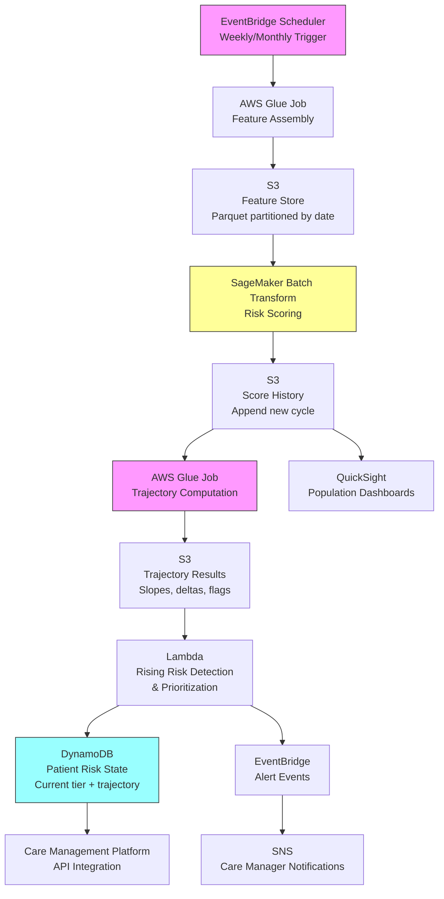

# Recipe 7.6 Architecture and Implementation: Rising Risk Identification

*Companion to [Recipe 7.6: Rising Risk Identification](chapter07.06-rising-risk-identification). This page covers the AWS architecture, services, prerequisites, and pseudocode. For the problem framing and the conceptual approach, start with the main recipe.*

---

## The AWS Implementation

### Why These Services

**Amazon SageMaker for model training and batch inference.** Rising risk scoring is a batch workload: you're scoring an entire population on a schedule, not responding to real-time events. SageMaker's batch transform jobs are purpose-built for this. You upload your feature matrix, point it at your trained model, and get back scored results for millions of patients without managing any infrastructure. For model training, SageMaker's managed training jobs handle the compute scaling and experiment tracking.

**Amazon S3 for score history and feature storage.** The longitudinal score history is a growing dataset (new scores every cycle, retained indefinitely). S3 with a partitioned structure (by scoring date) gives you cheap, durable storage with efficient access patterns for both "get one patient's history" and "get all patients from one cycle." Parquet format keeps storage costs low and query performance high.

**AWS Glue for feature engineering and trajectory computation.** The trajectory computation step (computing slopes, deltas, and acceleration for millions of patients) is a distributed data processing job. Glue's Spark-based engine handles the scale, and the serverless model means you're not paying for idle compute between scoring cycles. Glue also handles the ETL from source systems (EHR extracts, claims feeds) into the feature store.

**Amazon DynamoDB for operational risk state.** The current risk tier, trajectory status, and intervention routing for each patient needs to be available in real-time for care management workflows. DynamoDB provides single-digit-millisecond lookups by patient ID, which is what the care management platform needs when a nurse opens a patient's record.

**Amazon EventBridge for orchestration.** The scoring pipeline runs on a schedule (weekly or monthly). EventBridge Scheduler triggers the pipeline, and EventBridge rules route completion events to downstream consumers (notifications to care managers, updates to the care management platform, alerts for rapid deterioration).

**Pipeline failure monitoring.** Use AWS Step Functions (or an equivalent orchestrator) to coordinate the pipeline steps rather than loose EventBridge chaining. Step Functions gives you built-in error handling, retries with backoff, and a visual execution history. Each step should emit success/failure metrics to CloudWatch. Configure CloudWatch Alarms for three conditions: (1) the pipeline has not completed within its expected execution window (e.g., 3 hours for a monthly cycle), (2) any individual step fails, and (3) the output deviates anomalously from prior cycles (flagged count more than 50% above or below the previous cycle's count, which usually indicates a data issue rather than a real population shift). Alert the ops team immediately on pipeline failure. A missed cycle means rising-risk patients go unidentified for an additional month, and care managers lose visibility into deteriorating patients during that gap.

**Amazon QuickSight for population-level dashboards.** Leadership needs to see the rising risk population in aggregate: how many patients are flagged, what's the distribution of trajectory severity, which programs are at capacity. QuickSight can query the S3 score history directly, so you don't need to stand up a separate data warehouse just for leadership dashboards.

**Access control: panel-level authorization.** DynamoDB holds PHI (risk scores, trajectory data, patient identifiers). HIPAA's minimum-necessary standard means care managers should only access patients attributed to their panel, not the entire population. Put an API layer (API Gateway or AppSync) in front of DynamoDB that enforces panel-level authorization. A Lambda authorizer validates that the requesting user is assigned to the patient's care panel before returning any data. Restrict direct DynamoDB access to the pipeline's IAM roles only. No human user or care management application should hit the table directly. This also gives you a single enforcement point for audit logging (who accessed which patient's trajectory data and when).

### Architecture Diagram



### Prerequisites

| Requirement | Details |
|-------------|---------|
| **AWS Services** | Amazon SageMaker, Amazon S3, AWS Glue, Amazon DynamoDB, AWS Lambda, Amazon EventBridge, Amazon SNS, Amazon QuickSight |
| **IAM Permissions** | `sagemaker:CreateTransformJob`, `s3:GetObject`, `s3:PutObject`, `glue:StartJobRun`, `dynamodb:PutItem`, `dynamodb:GetItem`, `events:PutEvents`, `sns:Publish` |

| **BAA** | AWS BAA signed (risk scores derived from PHI) |
| **Encryption** | S3: SSE-KMS for all buckets; DynamoDB: encryption at rest (default); all API calls over TLS; Glue jobs: security configuration with S3 and CloudWatch encryption |
| **VPC** | Production: Glue jobs and SageMaker in VPC with VPC endpoints for S3, DynamoDB, CloudWatch Logs, EventBridge, SNS, and SageMaker API. If Lambda detection function runs in VPC, ensure all AWS service calls have corresponding VPC endpoints to avoid NAT Gateway dependency. |
| **CloudTrail** | Enabled: log all SageMaker, Glue, and DynamoDB API calls for HIPAA audit trail. Enable data events for the DynamoDB risk state table and S3 score history bucket (management events alone do not capture item-level access). |
| **Data Sources** | EHR extract (diagnoses, labs, medications, encounters), claims feed (utilization history), ADT feed (admissions, discharges). Minimum 18-24 months of history for meaningful trajectory analysis. |
| **Cost Estimate** | Glue: ~$0.44/DPU-hour (feature assembly + trajectory computation ~2-4 DPU-hours per run for 500K patients). SageMaker batch transform: ~$0.05/hour for ml.m5.xlarge (scoring 500K patients takes ~30 min). S3 storage: ~$0.023/GB/month. DynamoDB: on-demand pricing, ~$1.25 per million writes. Total: ~$50-150 per monthly scoring cycle for a 500K-member population. |

**IAM role isolation per pipeline phase.** Do not use a single IAM role with broad permissions across the entire pipeline. Each phase should use a dedicated role scoped to the specific resource ARNs it needs:

- **Glue feature assembly role:** `s3:GetObject` on source data buckets + `s3:PutObject` on the feature store prefix only. No DynamoDB, no EventBridge, no SageMaker access.
- **SageMaker batch transform role:** `s3:GetObject` on the feature store prefix + `s3:PutObject` on the score history prefix only. No DynamoDB, no SNS access.
- **Glue trajectory computation role:** `s3:GetObject` on the score history prefix + `s3:PutObject` on the trajectory results prefix only.
- **Lambda detection/routing role:** `dynamodb:PutItem` and `dynamodb:UpdateItem` on the risk state table + `events:PutEvents` on the specific event bus ARN. No S3 write access, no SageMaker access.

This limits the blast radius if any single component is compromised. A vulnerability in the Lambda detection function cannot be used to read raw clinical data from the source buckets, because that role simply doesn't have those permissions.

### Ingredients

| AWS Service | Role |
|------------|------|
| **Amazon SageMaker** | Trains risk models; runs batch scoring on full population each cycle |
| **Amazon S3** | Stores feature matrices, score history (longitudinal), and trajectory results |
| **AWS Glue** | Assembles features from source systems; computes trajectory metrics across scoring cycles |
| **Amazon DynamoDB** | Stores current patient risk state for real-time care management lookups |
| **AWS Lambda** | Applies rising risk detection rules; prioritizes and routes flagged patients |
| **Amazon EventBridge** | Schedules pipeline execution; routes alert events to downstream systems |
| **Amazon SNS** | Delivers notifications to care management teams for newly flagged patients |
| **Amazon QuickSight** | Population-level dashboards for leadership visibility into rising risk trends |
| **AWS KMS** | Manages encryption keys for all data stores |

**SNS and PHI handling.** SNS notifications containing patient IDs, risk scores, or trajectory data constitute PHI. Restrict SNS topic subscriptions to HIPAA-compliant endpoints only: SQS queues, Lambda functions, or HTTPS endpoints with TLS. Do not subscribe email or SMS endpoints that would embed clinical details in unencrypted channels. The recommended pattern: send minimal alert notifications (e.g., "3 new rising-risk patients require review") with a link to the care management dashboard. Keep the trajectory detail in DynamoDB behind the authenticated API layer, not in the notification body itself.

### Code

#### Walkthrough

**Step 1: Feature assembly from source systems.** On each scoring cycle, pull the relevant clinical and utilization data for the entire managed population. This includes current diagnoses, recent lab results, medication lists, encounter history, and prior utilization. The feature set should match what the risk model was trained on, plus additional temporal features (days since last visit, number of encounters in trailing windows). This step is the most time-consuming because it involves joining data from multiple source systems, handling missing values, and applying the same transformations used during model training. Skip this step or get the transformations wrong, and your scores will be meaningless or worse, systematically biased.

```pseudocode
FUNCTION assemble_features(population_list, scoring_date):
    // Pull data for all patients in the managed population as of the scoring date.
    // Each source system provides a different slice of the patient's clinical picture.
    
    features = empty table with one row per patient

    FOR each patient_id in population_list:
        // Clinical data: active diagnoses, recent labs, current medications
        clinical = query EHR extract for patient_id:
            - active_diagnoses (ICD-10 codes with onset dates)
            - lab_results (last 12 months, most recent value per test)
            - medications (active prescriptions with start dates)
            - vitals (most recent set)

        // Utilization history: encounters, admissions, ED visits in trailing windows
        utilization = query claims/encounter data for patient_id:
            - inpatient_admissions_3mo, _6mo, _12mo (counts)
            - ed_visits_3mo, _6mo, _12mo (counts)
            - specialist_visits_3mo, _6mo, _12mo (counts)
            - total_cost_3mo, _6mo, _12mo (allowed amounts)

        // Engagement indicators: gaps in care, missed appointments
        engagement = query scheduling/ADT data for patient_id:
            - days_since_last_pcp_visit
            - missed_appointments_6mo (count)
            - medication_refill_gap_days (average across active meds)
            - days_since_last_lab_draw

        // Combine into a single feature vector for this patient
        features[patient_id] = merge(clinical, utilization, engagement)

    // Apply standard transformations: encode categoricals, impute missing values,
    // normalize continuous features. Use the SAME transformer fitted during training.
    features = apply_trained_transformations(features)

    RETURN features
```

**Step 2: Batch risk scoring.** Pass the assembled feature matrix through the trained risk model to produce a risk score for every patient in the population. This is a batch operation: you're scoring hundreds of thousands of patients in a single job, not one at a time. The output is a score (typically a probability or a relative risk index) for each patient, timestamped with the current scoring cycle. These scores will be appended to the longitudinal history, not overwritten. Every historical score is retained because trajectory computation needs the full time series.

```pseudocode
FUNCTION score_population(feature_matrix, model_endpoint, scoring_date):
    // Submit the full feature matrix to the model for batch scoring.
    // The model returns one risk score per patient.
    // For a 500K-patient population, this typically takes 15-30 minutes on a single instance.
    
    scores = call batch_transform(
        model       = model_endpoint,       // the trained risk model (e.g., XGBoost)
        input_data  = feature_matrix,       // all patients' feature vectors
        output_path = "s3://scores/{scoring_date}/"  // where to write results
    )

    // Structure the output: patient_id, score, scoring_date
    // This format enables easy appending to the longitudinal score history.
    scored_records = empty list
    FOR each patient_id, score in scores:
        append to scored_records: {
            patient_id:   patient_id,
            risk_score:   score,              // 0.0 to 1.0 probability or relative index
            scoring_date: scoring_date,       // when this score was computed
            model_version: model_endpoint.version  // track which model produced this score
        }

    // Append (not overwrite) to the longitudinal score history in S3.
    // Partition by scoring_date for efficient time-range queries.
    append scored_records to "s3://score-history/date={scoring_date}/"

    RETURN scored_records
```

**Step 3: Trajectory computation.** This is the core of rising risk detection. For each patient, retrieve their full score history and compute trajectory metrics: slope over multiple time windows, absolute and relative deltas, acceleration (change in slope), and percentile position. The multi-window approach is important because it captures both rapid deterioration (3-month spike) and slow drift (12-month gradual increase). A patient might have a flat 3-month trajectory but a clearly rising 12-month trajectory, or vice versa. Both patterns are clinically meaningful but suggest different intervention urgencies.

```pseudocode
FUNCTION compute_trajectories(current_scores, score_history):
    // For each patient, compute trajectory metrics using their full score history.
    // This is embarrassingly parallel: each patient's computation is independent.
    
    trajectories = empty list

    FOR each patient in current_scores:
        // Retrieve this patient's historical scores, ordered by date
        history = query score_history WHERE patient_id = patient.patient_id
                  ORDER BY scoring_date ASC

        // IMPORTANT: Only compute slopes using scores from the same model version.
        // If model_version changed during the history window, either:
        // (a) re-score historical periods with the current model, or
        // (b) compute slope only from scores produced by the current model version,
        //     accepting a shorter effective history window after each model update.
        history = filter history WHERE model_version = current_model_version

        // Need at least 3 data points for meaningful trajectory analysis.
        // Patients with fewer points get flagged as "insufficient history."
        IF length(history) < 3:
            append to trajectories: {
                patient_id: patient.patient_id,
                status: "INSUFFICIENT_HISTORY",
                current_score: patient.risk_score
            }
            CONTINUE

        // Compute slope over multiple windows using linear regression.
        // Slope = rate of change in risk score per month.
        slope_3mo  = linear_regression_slope(history, window = last 3 months)
        slope_6mo  = linear_regression_slope(history, window = last 6 months)
        slope_12mo = linear_regression_slope(history, window = last 12 months)

        // Compute absolute and relative deltas
        score_3mo_ago  = get_score_at(history, months_ago = 3)
        score_6mo_ago  = get_score_at(history, months_ago = 6)
        score_12mo_ago = get_score_at(history, months_ago = 12)

        delta_3mo  = patient.risk_score - score_3mo_ago   // absolute change
        delta_6mo  = patient.risk_score - score_6mo_ago
        delta_12mo = patient.risk_score - score_12mo_ago

        relative_delta_6mo = delta_6mo / score_6mo_ago IF score_6mo_ago > 0 ELSE 0

        // Compute acceleration: is the rate of change itself increasing?
        // Positive acceleration means deterioration is speeding up.
        acceleration = slope_3mo - slope_6mo  // if 3mo slope > 6mo slope, accelerating

        // Compute percentile position in current population
        percentile = rank of patient.risk_score within current_scores (0-100)

        append to trajectories: {
            patient_id:       patient.patient_id,
            current_score:    patient.risk_score,
            percentile:       percentile,
            slope_3mo:        slope_3mo,
            slope_6mo:        slope_6mo,
            slope_12mo:       slope_12mo,
            delta_3mo:        delta_3mo,
            delta_6mo:        delta_6mo,
            delta_12mo:       delta_12mo,
            relative_delta_6mo: relative_delta_6mo,
            acceleration:     acceleration,
            data_points:      length(history),
            status:           "COMPUTED"
        }

    RETURN trajectories
```

**Step 4: Rising risk detection and classification.** Apply detection rules to the trajectory metrics to identify patients whose risk is meaningfully increasing. The rules combine multiple signals to reduce false positives: a single elevated metric might be noise, but multiple converging indicators suggest genuine deterioration. The output is a classified list: patients flagged as "rising risk" with a severity tier and the specific signals that triggered the flag. This transparency is critical for care managers, who need to understand why a patient was flagged before they can design an appropriate intervention.

```pseudocode
// Detection thresholds. These should be calibrated to your population and intervention capacity.
// Start conservative (fewer flags, higher confidence) and loosen as you validate.
THRESHOLDS = {
    slope_6mo_high:       0.05,    // risk score increasing by 0.05+ per month over 6 months
    slope_6mo_moderate:   0.02,    // moderate increase
    delta_6mo_high:       0.20,    // absolute score increase of 0.20+ over 6 months
    delta_6mo_moderate:   0.10,    // moderate absolute increase
    relative_delta_high:  0.50,    // 50%+ relative increase over 6 months
    acceleration_high:    0.02,    // slope itself is increasing by 0.02+ per month
    min_current_score:    0.15,    // don't flag patients with very low absolute risk
    max_current_score:    0.75     // patients above this are already "high risk," not "rising"
}

FUNCTION detect_rising_risk(trajectories):
    flagged = empty list

    FOR each patient in trajectories:
        IF patient.status != "COMPUTED":
            CONTINUE

        // Guard: only flag patients in the "rising" zone.
        // Below min_current_score: too low to warrant intervention even if rising.
        // Above max_current_score: already high-risk, should be in existing programs.
        IF patient.current_score < THRESHOLDS.min_current_score:
            CONTINUE
        IF patient.current_score > THRESHOLDS.max_current_score:
            CONTINUE

        // Collect triggered signals
        signals = empty list

        IF patient.slope_6mo >= THRESHOLDS.slope_6mo_high:
            append "HIGH_SLOPE_6MO" to signals
        ELSE IF patient.slope_6mo >= THRESHOLDS.slope_6mo_moderate:
            append "MODERATE_SLOPE_6MO" to signals

        IF patient.delta_6mo >= THRESHOLDS.delta_6mo_high:
            append "HIGH_DELTA_6MO" to signals
        ELSE IF patient.delta_6mo >= THRESHOLDS.delta_6mo_moderate:
            append "MODERATE_DELTA_6MO" to signals

        IF patient.relative_delta_6mo >= THRESHOLDS.relative_delta_high:
            append "HIGH_RELATIVE_CHANGE" to signals

        IF patient.acceleration >= THRESHOLDS.acceleration_high:
            append "ACCELERATING" to signals

        // Require at least 2 converging signals to flag.
        // Single-signal flags have too many false positives.
        IF length(signals) >= 2:
            // Assign severity tier based on signal strength
            severity = "HIGH" IF any signal contains "HIGH" ELSE "MODERATE"

            append to flagged: {
                patient_id:     patient.patient_id,
                current_score:  patient.current_score,
                percentile:     patient.percentile,
                severity:       severity,
                signals:        signals,
                slope_6mo:      patient.slope_6mo,
                delta_6mo:      patient.delta_6mo,
                acceleration:   patient.acceleration,
                flagged_date:   current_date()
            }

    // Sort by severity (HIGH first), then by slope (steepest first)
    sort flagged by severity DESC, slope_6mo DESC

    RETURN flagged
```

**Scaling note for large populations.** For populations exceeding 500K members, the Lambda-based detection step hits memory and timeout constraints. Lambda works well for the routing and notification logic (which handles only the flagged subset, typically less than 1% of the population), but applying thresholds and collecting signals across the full population is a bulk data transformation. For large populations, split this step: use a Glue job for the threshold application and signal collection (it's a map operation over the trajectory results, which Glue's Spark engine parallelizes naturally), then pass only the flagged subset to Lambda for prioritization, routing, and event emission. This keeps Lambda focused on the lightweight, latency-sensitive work it's good at, and lets Glue handle the heavy filtering that doesn't need sub-second response times.

**Step 5: Store results and route to care management.** Write the rising risk flags to the operational database so care management platforms can access them in real-time. Also emit events for newly flagged patients so care managers receive notifications. The routing logic determines which care management program is most appropriate based on the nature of the risk increase (e.g., behavioral health escalation vs. chronic disease management vs. social needs). Include the trajectory summary in the notification so the care manager has context without needing to look it up separately.

```pseudocode
FUNCTION store_and_route(flagged_patients, previous_flags):
    // Identify newly flagged patients (not flagged in the previous cycle).
    // Only send notifications for new flags to avoid alert fatigue.
    previously_flagged_ids = set of patient_ids from previous_flags
    newly_flagged = filter flagged_patients WHERE patient_id NOT IN previously_flagged_ids

    FOR each patient in flagged_patients:
        // Write/update the patient's risk state in the operational database.
        // Care management platforms query this for real-time risk context.
        write to database table "patient-risk-state":
            patient_id      = patient.patient_id
            risk_tier       = "RISING"
            severity        = patient.severity
            current_score   = patient.current_score
            trajectory_slope = patient.slope_6mo
            signals         = patient.signals
            flagged_date    = patient.flagged_date
            last_updated    = current_timestamp()

    // Emit events for newly flagged patients only
    FOR each patient in newly_flagged:
        // Determine routing based on primary signal pattern
        program = determine_program(patient.signals, patient.current_score)

        emit event:
            type:        "RISING_RISK_IDENTIFIED"
            patient_id:  patient.patient_id
            severity:    patient.severity
            program:     program          // e.g., "CHRONIC_DISEASE_MGMT", "BH_ESCALATION"
            signals:     patient.signals
            slope_6mo:   patient.slope_6mo
            message:     "Patient risk score has increased by {delta_6mo} over 6 months. "
                         "Current score: {current_score} (percentile: {percentile}). "
                         "Trajectory: {severity} rising risk with signals: {signals}."

    RETURN {
        total_flagged:  length(flagged_patients),
        newly_flagged:  length(newly_flagged),
        high_severity:  count WHERE severity == "HIGH",
        moderate_severity: count WHERE severity == "MODERATE"
    }
```

> **Curious how this looks in Python?** The pseudocode above covers the concepts. If you'd like to see sample Python code that demonstrates these patterns using boto3, check out the [Python Example](chapter07.06-python-example). It walks through each step with inline comments and notes on what you'd need to change for a real deployment.

### Expected Results

**Sample output for a rising risk detection cycle (500K managed population):**

```json
{
  "scoring_cycle": "2026-05-01",
  "population_scored": 487293,
  "trajectories_computed": 461847,
  "insufficient_history": 25446,
  "rising_risk_flagged": 3891,
  "newly_flagged": 847,
  "severity_distribution": {
    "HIGH": 312,
    "MODERATE": 535
  },
  "sample_flagged_patient": {
    "patient_id": "PAT-2847193",
    "current_score": 0.42,
    "percentile": 68,
    "severity": "HIGH",
    "signals": ["HIGH_SLOPE_6MO", "HIGH_DELTA_6MO", "ACCELERATING"],
    "slope_6mo": 0.07,
    "delta_6mo": 0.24,
    "acceleration": 0.03,
    "score_history": [0.18, 0.21, 0.25, 0.31, 0.38, 0.42],
    "routing": "CHRONIC_DISEASE_MGMT"
  }
}
```

**Performance benchmarks:**

| Metric | Typical Value |
|--------|---------------|
| Full pipeline runtime (500K patients) | 45-90 minutes |
| Feature assembly (Glue) | 20-40 minutes |
| Batch scoring (SageMaker) | 15-30 minutes |
| Trajectory computation (Glue) | 10-20 minutes |
| Detection + routing (Lambda) | 2-5 minutes |
| Rising risk flag rate | 0.5-1.5% of population per cycle |

| False positive rate (estimated) | 30-50% (patients flagged who would have stabilized without intervention) |
| Cost per scoring cycle | $50-150 for 500K patients |

**Where it struggles:**

- Patients with sparse visit history (fewer than 3 scoring cycles) cannot be evaluated for trajectory
- New enrollees have no baseline, creating a 6-12 month blind spot
- Model version changes invalidate historical score comparisons (requires re-scoring history or maintaining version-specific baselines)
- Regression to the mean inflates apparent intervention effectiveness
- Social determinant deterioration (job loss, housing instability) often precedes clinical deterioration but is rarely captured in structured data

---

## Why This Isn't Production-Ready

**Score versioning and comparability.** If you retrain your risk model (which you should, periodically), the new model's scores are not directly comparable to the old model's scores. A patient whose score went from 0.3 to 0.5 might have genuinely deteriorated, or the new model might just score everyone higher. Production systems need either: (a) re-score the full history with the new model whenever you retrain, or (b) maintain version-specific percentile baselines and compare within-version only. Both approaches have tradeoffs. For most organizations, option (b) is more practical: after a model retrain, accept a reduced trajectory window until enough new-version scores accumulate. Design your minimum data point threshold (currently 3) to account for this reset.

**Intervention attribution.** Once you start intervening on rising-risk patients, you can no longer cleanly measure whether the model is working. Did the patient stabilize because of your intervention, or because of regression to the mean, or because they would have stabilized anyway? Proper causal inference requires either a randomized holdout (ethically complex) or sophisticated observational methods (propensity score matching, difference-in-differences). Without this, you're flying blind on ROI.

**Alert fatigue management.** If your thresholds are too loose, care managers get overwhelmed with flags and start ignoring them. If too tight, you miss patients who would have benefited. The thresholds need ongoing calibration based on intervention capacity and observed outcomes. Build a feedback loop where care managers can mark flags as "appropriate" or "not actionable" and use that signal to tune thresholds.

**Stale data detection.** A patient who hasn't had a visit in 12 months will have a flat trajectory (no new data to change the score). But their actual risk might be increasing silently. You need a separate process to flag patients with stale data for outreach, independent of the trajectory model.

---

## Variations and Extensions

**Multi-dimensional trajectory analysis.** Instead of tracking a single composite risk score, track trajectories across multiple dimensions independently: clinical complexity, utilization intensity, medication burden, engagement level. A patient might be stable on clinical complexity but rapidly disengaging from care. Flagging on dimension-specific trajectories enables more targeted interventions (re-engagement outreach vs. clinical escalation).

**Predictive trajectory modeling.** Rather than detecting rising risk after it's happened (retrospective slope), train a model to predict which currently-stable patients will begin rising in the next 6-12 months. This pushes the intervention window even earlier. Features might include early warning signals like subtle lab trends, appointment spacing changes, or medication adherence patterns that precede overt score increases.

**Peer cohort comparison.** Instead of comparing a patient to their own history, compare them to similar patients (same age, diagnosis mix, baseline risk). If a patient's trajectory is diverging from their peer cohort's expected trajectory, that's a signal even if their absolute slope is modest. This approach is particularly useful for new enrollees who lack sufficient personal history for trajectory analysis.

---

## Additional Resources

**AWS Documentation:**
- [Amazon SageMaker Batch Transform](https://docs.aws.amazon.com/sagemaker/latest/dg/batch-transform.html)
- [AWS Glue Developer Guide](https://docs.aws.amazon.com/glue/latest/dg/what-is-glue.html)
- [Amazon DynamoDB Developer Guide](https://docs.aws.amazon.com/amazondynamodb/latest/developerguide/Introduction.html)
- [Amazon EventBridge Scheduler](https://docs.aws.amazon.com/scheduler/latest/UserGuide/what-is-scheduler.html)
- [AWS HIPAA Eligible Services](https://aws.amazon.com/compliance/hipaa-eligible-services-reference/)
- [Amazon SageMaker Pricing](https://aws.amazon.com/sagemaker/pricing/)

**AWS Sample Repos:**
- [`amazon-sagemaker-examples`](https://github.com/aws/amazon-sagemaker-examples): Comprehensive SageMaker examples including batch transform, feature engineering, and time series modeling
- [`aws-glue-samples`](https://github.com/aws-samples/aws-glue-samples): Glue ETL job examples for large-scale data processing patterns

**AWS Solutions and Blogs:**
- [Machine Learning Best Practices in Healthcare and Life Sciences](https://aws.amazon.com/blogs/machine-learning/machine-learning-best-practices-in-healthcare-and-life-sciences/): Best practices for ML in healthcare including model validation and deployment patterns
- [Architecting for HIPAA on AWS (Whitepaper)](https://docs.aws.amazon.com/whitepapers/latest/architecting-hipaa-security-and-compliance-on-aws/welcome.html): Comprehensive guide to HIPAA-compliant architectures on AWS

---

## Estimated Implementation Time

| Phase | Duration |
|-------|----------|
| **Basic** (single risk score, simple delta detection, manual threshold tuning) | 4-6 weeks |
| **Production-ready** (multi-window trajectories, calibrated thresholds, care management integration, monitoring) | 10-14 weeks |
| **With variations** (multi-dimensional trajectories, predictive modeling, peer cohort comparison, outcome tracking) | 16-22 weeks |

---

---

*← [Main Recipe 7.6](chapter07.06-rising-risk-identification) · [Python Example](chapter07.06-python-example) · [Chapter Preface](chapter07-preface)*
