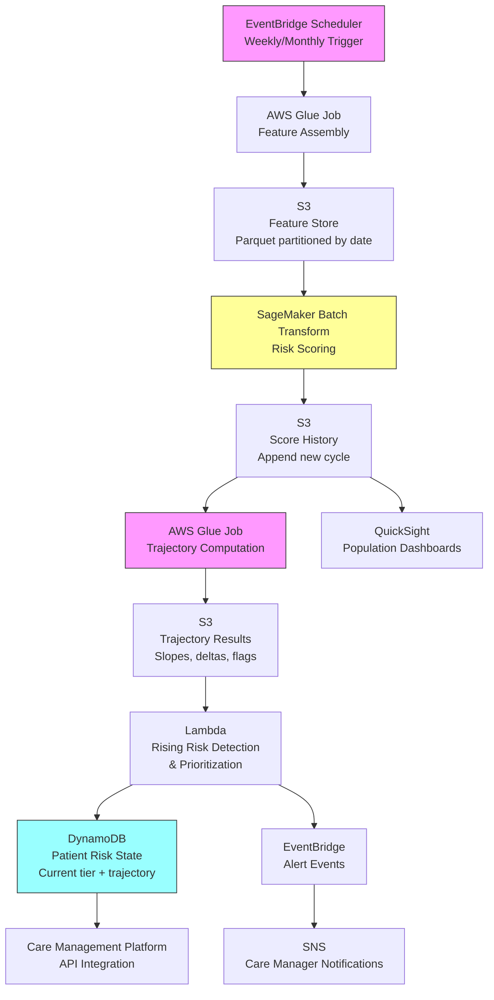

# Recipe 7.6: Rising Risk Identification

**Complexity:** Medium-Complex · **Phase:** Growth · **Estimated Cost:** ~$0.01 per patient per scoring cycle

---

## The Problem

Every health system has a list of high-risk patients. The sickest 5% of the population drives 50% of the cost. Care management teams know who these people are. They have names, diagnoses, care plans, and dedicated nurses assigned to them.

The problem is not identifying who is already high-risk. The problem is identifying who is *becoming* high-risk.

By the time a patient shows up on the high-cost list, the window for cost-effective intervention has usually closed. They've already had the hospitalization, the ED visit, the crisis event that pushed them over the threshold. The care management team inherits them after the damage is done, and the interventions available at that point are expensive, reactive, and often too late to change the trajectory.

Rising risk identification flips the timing. Instead of asking "who is sick right now?" you ask "who is getting sicker?" Instead of a point-in-time snapshot, you're looking at the slope of the line. A patient with well-controlled diabetes whose A1c has crept from 7.2 to 8.1 to 9.4 over three visits is not yet "high-risk" by most static scoring systems. But the trajectory is unmistakable. In six months, without intervention, they'll be in the ED with diabetic ketoacidosis.

This is the fundamental insight: the rate of change in risk is more actionable than the absolute level of risk. A patient at 60th percentile risk who was at 30th percentile six months ago is a better intervention target than a patient who has been stable at 80th percentile for three years. The first patient is deteriorating and might respond to intervention. The second patient is chronically complex but stable, and their care plan is probably already optimized.

Health plans and ACOs care about this intensely because of the economics. Intervening on a rising-risk patient before they cross into high-cost territory costs maybe $2,000-5,000 in care management resources. Letting them cross that threshold costs $50,000-100,000 in acute care. The ROI math is compelling, but only if you can identify the right patients early enough for the intervention to matter.

The challenge: this is a fundamentally harder prediction problem than static risk scoring. You're not just predicting an outcome. You're predicting a change in trajectory. That requires longitudinal data, temporal modeling, and a clear definition of what "rising" actually means in quantitative terms.

---

## The Technology: Detecting Trajectory Changes

### Why Static Risk Scores Miss This

Traditional risk scoring (HCC-based risk adjustment, LACE scores, Charlson comorbidity indices) produces a point-in-time estimate. It answers: "Given everything we know about this patient right now, what is their expected cost or utilization?" These scores are useful for population stratification, but they have a structural blind spot: they don't model change over time.

Consider two patients, both with a current HCC risk score of 1.8 (meaning expected cost is 1.8x the average). Patient A has been at 1.8 for three years. Patient B was at 0.9 twelve months ago and has climbed steadily to 1.8. Static scoring treats them identically. But operationally, they're completely different situations. Patient A is stable and probably already in a care management program. Patient B is deteriorating rapidly and may not be on anyone's radar yet.

Rising risk identification requires temporal awareness. You need to track risk over time and detect meaningful acceleration.

### Defining "Rising Risk" Mathematically

This is where it gets interesting, because "rising risk" is not a single well-defined concept. There are several reasonable definitions, and the right one depends on your intervention model:

**Absolute change.** The simplest: risk score increased by more than X points over Y months. Easy to compute, easy to explain. But it treats a change from 0.5 to 0.8 the same as a change from 2.0 to 2.3, even though the clinical implications are very different.

**Relative change.** Risk score increased by more than X% over Y months. Better at capturing proportional deterioration. A 50% increase from 0.6 to 0.9 is arguably more alarming than a 15% increase from 2.0 to 2.3. But relative change can be noisy for patients with very low baseline scores (a change from 0.1 to 0.2 is a 100% increase but clinically meaningless).

**Percentile migration.** The patient moved from one risk tier to a higher one (e.g., from the 40th to the 70th percentile of the population). This is intuitive for care managers because it maps directly to their stratification tiers. But it depends on the population distribution, which shifts over time.

**Slope of the trajectory.** Fit a line (or curve) to the patient's risk scores over multiple time points and use the slope as the "rising" indicator. This is the most statistically rigorous approach because it uses all available history, not just two endpoints. It's also more robust to noise: a single anomalous score won't trigger a false alarm if the overall trend is flat.

**Predicted future state.** Train a model to predict what the patient's risk score will be in 6-12 months, then flag patients whose predicted future score crosses a threshold. This is the most sophisticated approach but also the most complex to build and validate.

In practice, most production systems use a combination: slope-based detection for the primary signal, with absolute thresholds as guardrails (don't flag someone whose risk is rising but still very low in absolute terms).

### The Longitudinal Modeling Challenge

Rising risk detection requires multiple observations per patient over time. This creates several technical challenges that don't exist in point-in-time prediction:

**Irregular observation intervals.** Patients don't visit on a fixed schedule. One patient might have monthly lab draws; another might go a year between visits. You can't simply compare "this month's score" to "last month's score" because the time gaps vary wildly. Your model needs to handle irregular time series gracefully, either by interpolating to fixed intervals or by using methods that natively handle irregular spacing.

**Informative missingness.** A patient who stops showing up for appointments is not "missing data" in the traditional sense. The absence itself is informative. Patients who disengage from care often do so because they're getting sicker (too sick to come in, lost transportation, gave up). If your model only scores patients when new data arrives, you'll systematically miss the ones who are deteriorating silently. You need a mechanism to flag patients whose data has gone stale.

**Confounding events.** A patient's risk score might jump because they received a new diagnosis that was actually present for years but only recently documented. That's not true clinical deterioration; it's documentation catch-up. Similarly, a patient transitioning from one insurance plan to another might have their claims history reset, creating an artificial trajectory change. Your model needs to distinguish genuine clinical deterioration from data artifacts.

**Regression to the mean.** Patients identified as "rising risk" based on recent score increases will, on average, partially revert even without intervention. This is a statistical phenomenon, not a clinical one. It makes it genuinely hard to measure whether your interventions are working, because some of the "improvement" you observe would have happened anyway. Proper evaluation requires a control group or at minimum a regression-adjusted comparison.

### Feature Engineering for Trajectory Detection

The features that predict rising risk are different from those that predict current risk. You need both levels and changes:

**Score deltas.** Change in risk score over 3, 6, and 12-month windows. Both absolute and relative. The multi-window approach captures both rapid deterioration (3-month spike) and slow drift (12-month gradual increase).

**Utilization acceleration.** Not just "how many ED visits" but "are ED visits increasing?" A patient who went from 0 ED visits in Q1 to 1 in Q2 to 3 in Q3 is on a concerning trajectory even if their total count isn't alarming yet.

**Clinical marker trends.** Lab values trending in the wrong direction: rising A1c, declining eGFR, increasing BNP. These are leading indicators that often precede acute events by months. The slope of the lab trend is more predictive than the current value for rising risk detection.

**Care engagement changes.** Missed appointments increasing, medication refill gaps widening, time since last PCP visit growing. Disengagement from care is both a risk factor and a detectable signal.

**New diagnosis velocity.** The rate at which new chronic conditions are being added. A patient who picks up three new diagnoses in six months is on a different trajectory than one who has been stable for years.

**Social determinant shifts.** When available: address changes (especially to higher-deprivation areas), insurance coverage gaps, loss of caregiver support. These are powerful predictors but rarely captured in structured data.

### Model Architecture Options

**Sequential risk scoring with delta analysis.** The simplest approach: run your existing point-in-time risk model on a regular schedule (monthly or quarterly), store the scores, and compute deltas. Flag patients whose delta exceeds a threshold. This requires no new model training; it just adds a temporal layer on top of your existing risk stratification. The downside: it only captures what your existing model measures, and it's sensitive to model version changes (if you retrain the underlying model, all deltas become meaningless until the new scores stabilize).

**Dedicated trajectory model.** Train a separate model specifically to predict risk acceleration. The target variable is not "will this patient be high-cost?" but "will this patient's cost increase by more than X% in the next 12 months?" This model can use trajectory features (slopes, deltas, acceleration) as first-class inputs rather than bolting them on after the fact. It typically outperforms the delta approach but requires more engineering and a separate training pipeline.

**Recurrent or sequence models.** Use the full sequence of a patient's clinical events (encounters, diagnoses, labs, medications) as input to a recurrent neural network or transformer. These models can learn complex temporal patterns without explicit feature engineering. They're powerful but require large datasets, significant compute, and are harder to interpret. For most health systems, gradient boosting on engineered trajectory features is the practical choice.

**Survival analysis with time-varying covariates.** Model the time until a patient transitions from low/medium risk to high risk, with covariates that update over time. Cox proportional hazards with time-varying covariates or discrete-time survival models can capture the dynamics naturally. This framing is particularly useful when you care about *when* the transition will happen, not just *whether* it will.

### Intervention Timing: The Optimization Problem

Identifying rising-risk patients is only half the problem. The other half is deciding when to intervene. Too early, and you're spending resources on patients who might have stabilized on their own. Too late, and the intervention can't change the trajectory. The optimal intervention point depends on:

**Intervention lead time.** How long does it take for the intervention to have an effect? A care management enrollment might take 2-4 weeks to produce measurable behavior change. If you wait until the patient is 30 days from a hospitalization, you've missed the window.

**Trajectory confidence.** How many data points do you need before you're confident the trend is real and not noise? Two consecutive score increases might be random variation. Four consecutive increases over 12 months is a pattern. There's a tension between acting early (when you have less certainty) and acting late (when you have more certainty but less time).

**Intervention capacity.** Your care management team can handle N new enrollments per month. If your model flags 500 patients but you can only serve 50, you need to prioritize. The prioritization should consider both the severity of the trajectory and the likelihood that intervention will change it.

---

## General Architecture Pattern

The rising risk pipeline operates on a different cadence than real-time scoring. It's a batch process that runs periodically (weekly or monthly), compares current state to historical state, and produces a ranked list of patients whose trajectories warrant attention.

```
[Periodic Risk Scoring] → [Score History Storage] → [Trajectory Computation] → [Rising Risk Detection] → [Prioritization & Routing]
```

**Periodic Risk Scoring.** On a regular schedule, compute risk scores for the entire managed population. This might use an existing risk model (HCC, proprietary, or custom ML) or a purpose-built trajectory model. The key requirement is consistency: the same model version must be used across scoring cycles, or score comparisons become meaningless.

**Score History Storage.** Every scoring cycle's results are stored with timestamps, creating a longitudinal record of each patient's risk trajectory. This is a time-series storage problem: millions of patients, each with a score at each cycle, potentially going back years. The storage must support efficient queries like "give me all scores for patient X over the last 24 months" and "give me all patients whose most recent score exceeds their score from 6 months ago by more than 0.5."

**Trajectory Computation.** For each patient, compute trajectory metrics: slope over multiple windows, acceleration (change in slope), percentile migration, and time since last significant change. This is computationally intensive at population scale but embarrassingly parallel (each patient's trajectory is independent).

**Rising Risk Detection.** Apply detection rules or a trained model to the trajectory metrics to identify patients whose risk is meaningfully increasing. This produces a candidate list with associated confidence scores and trajectory summaries.

**Prioritization and Routing.** Rank the candidates by intervention urgency and likelihood of benefit. Route to the appropriate care management program based on the nature of the risk increase (behavioral health escalation goes to BH care managers; chronic disease acceleration goes to disease management; social determinant deterioration goes to community health workers).

---

## The AWS Implementation

### Why These Services

**Amazon SageMaker for model training and batch inference.** Rising risk scoring is a batch workload: you're scoring an entire population on a schedule, not responding to real-time events. SageMaker's batch transform jobs are purpose-built for this. You upload your feature matrix, point it at your trained model, and get back scored results for millions of patients without managing any infrastructure. For model training, SageMaker's managed training jobs handle the compute scaling and experiment tracking.

**Amazon S3 for score history and feature storage.** The longitudinal score history is a growing dataset (new scores every cycle, retained indefinitely). S3 with a partitioned structure (by scoring date) gives you cheap, durable storage with efficient access patterns for both "get one patient's history" and "get all patients from one cycle." Parquet format keeps storage costs low and query performance high.

**AWS Glue for feature engineering and trajectory computation.** The trajectory computation step (computing slopes, deltas, and acceleration for millions of patients) is a distributed data processing job. Glue's Spark-based engine handles the scale, and the serverless model means you're not paying for idle compute between scoring cycles. Glue also handles the ETL from source systems (EHR extracts, claims feeds) into the feature store.

**Amazon DynamoDB for operational risk state.** The current risk tier, trajectory status, and intervention routing for each patient needs to be available in real-time for care management workflows. DynamoDB provides single-digit-millisecond lookups by patient ID, which is what the care management platform needs when a nurse opens a patient's record.

**Amazon EventBridge for orchestration.** The scoring pipeline runs on a schedule (weekly or monthly). EventBridge Scheduler triggers the pipeline, and EventBridge rules route completion events to downstream consumers (notifications to care managers, updates to the care management platform, alerts for rapid deterioration).

**Amazon QuickSight for population-level dashboards.** Leadership needs to see the rising risk population in aggregate: how many patients are flagged, what's the distribution of trajectory severity, which programs are at capacity. QuickSight connects directly to the S3-based score history for population analytics without requiring a separate data warehouse.

### Architecture Diagram



### Prerequisites

| Requirement | Details |
|-------------|---------|
| **AWS Services** | Amazon SageMaker, Amazon S3, AWS Glue, Amazon DynamoDB, AWS Lambda, Amazon EventBridge, Amazon SNS, Amazon QuickSight |
| **IAM Permissions** | `sagemaker:CreateTransformJob`, `s3:GetObject`, `s3:PutObject`, `glue:StartJobRun`, `dynamodb:PutItem`, `dynamodb:GetItem`, `events:PutEvents`, `sns:Publish` |
| **BAA** | AWS BAA signed (risk scores derived from PHI) |
| **Encryption** | S3: SSE-KMS for all buckets; DynamoDB: encryption at rest (default); all API calls over TLS; Glue jobs: security configuration with S3 and CloudWatch encryption |
| **VPC** | Production: Glue jobs and SageMaker in VPC with VPC endpoints for S3, DynamoDB, and CloudWatch Logs |
| **CloudTrail** | Enabled: log all SageMaker, Glue, and DynamoDB API calls for HIPAA audit trail |
| **Data Sources** | EHR extract (diagnoses, labs, medications, encounters), claims feed (utilization history), ADT feed (admissions, discharges). Minimum 18-24 months of history for meaningful trajectory analysis. |
| **Cost Estimate** | Glue: ~$0.44/DPU-hour (feature assembly + trajectory computation ~2-4 DPU-hours per run for 500K patients). SageMaker batch transform: ~$0.05/hour for ml.m5.xlarge (scoring 500K patients takes ~30 min). S3 storage: ~$0.023/GB/month. DynamoDB: on-demand pricing, ~$1.25 per million writes. Total: ~$50-150 per monthly scoring cycle for a 500K-member population. |

### Ingredients

| AWS Service | Role |
|------------|------|
| **Amazon SageMaker** | Trains risk models; runs batch scoring on full population each cycle |
| **Amazon S3** | Stores feature matrices, score history (longitudinal), and trajectory results |
| **AWS Glue** | Assembles features from source systems; computes trajectory metrics across scoring cycles |
| **Amazon DynamoDB** | Stores current patient risk state for real-time care management lookups |
| **AWS Lambda** | Applies rising risk detection rules; prioritizes and routes flagged patients |
| **Amazon EventBridge** | Schedules pipeline execution; routes alert events to downstream systems |
| **Amazon SNS** | Delivers notifications to care management teams for newly flagged patients |
| **Amazon QuickSight** | Population-level dashboards for leadership visibility into rising risk trends |
| **AWS KMS** | Manages encryption keys for all data stores |

### Code

#### Walkthrough

**Step 1: Feature assembly from source systems.** On each scoring cycle, pull the relevant clinical and utilization data for the entire managed population. This includes current diagnoses, recent lab results, medication lists, encounter history, and prior utilization. The feature set should match what the risk model was trained on, plus additional temporal features (days since last visit, number of encounters in trailing windows). This step is the most time-consuming because it involves joining data from multiple source systems, handling missing values, and applying the same transformations used during model training. Skip this step or get the transformations wrong, and your scores will be meaningless or worse, systematically biased.

```
FUNCTION assemble_features(population_list, scoring_date):
    // Pull data for all patients in the managed population as of the scoring date.
    // Each source system provides a different slice of the patient's clinical picture.
    
    features = empty table with one row per patient

    FOR each patient_id in population_list:
        // Clinical data: active diagnoses, recent labs, current medications
        clinical = query EHR extract for patient_id:
            - active_diagnoses (ICD-10 codes with onset dates)
            - lab_results (last 12 months, most recent value per test)
            - medications (active prescriptions with start dates)
            - vitals (most recent set)

        // Utilization history: encounters, admissions, ED visits in trailing windows
        utilization = query claims/encounter data for patient_id:
            - inpatient_admissions_3mo, _6mo, _12mo (counts)
            - ed_visits_3mo, _6mo, _12mo (counts)
            - specialist_visits_3mo, _6mo, _12mo (counts)
            - total_cost_3mo, _6mo, _12mo (allowed amounts)

        // Engagement indicators: gaps in care, missed appointments
        engagement = query scheduling/ADT data for patient_id:
            - days_since_last_pcp_visit
            - missed_appointments_6mo (count)
            - medication_refill_gap_days (average across active meds)
            - days_since_last_lab_draw

        // Combine into a single feature vector for this patient
        features[patient_id] = merge(clinical, utilization, engagement)

    // Apply standard transformations: encode categoricals, impute missing values,
    // normalize continuous features. Use the SAME transformer fitted during training.
    features = apply_trained_transformations(features)

    RETURN features
```

**Step 2: Batch risk scoring.** Pass the assembled feature matrix through the trained risk model to produce a risk score for every patient in the population. This is a batch operation: you're scoring hundreds of thousands of patients in a single job, not one at a time. The output is a score (typically a probability or a relative risk index) for each patient, timestamped with the current scoring cycle. These scores will be appended to the longitudinal history, not overwritten. Every historical score is retained because trajectory computation needs the full time series.

```
FUNCTION score_population(feature_matrix, model_endpoint, scoring_date):
    // Submit the full feature matrix to the model for batch scoring.
    // The model returns one risk score per patient.
    // For a 500K-patient population, this typically takes 15-30 minutes on a single instance.
    
    scores = call batch_transform(
        model       = model_endpoint,       // the trained risk model (e.g., XGBoost)
        input_data  = feature_matrix,       // all patients' feature vectors
        output_path = "s3://scores/{scoring_date}/"  // where to write results
    )

    // Structure the output: patient_id, score, scoring_date
    // This format enables easy appending to the longitudinal score history.
    scored_records = empty list
    FOR each patient_id, score in scores:
        append to scored_records: {
            patient_id:   patient_id,
            risk_score:   score,              // 0.0 to 1.0 probability or relative index
            scoring_date: scoring_date,       // when this score was computed
            model_version: model_endpoint.version  // track which model produced this score
        }

    // Append (not overwrite) to the longitudinal score history in S3.
    // Partition by scoring_date for efficient time-range queries.
    append scored_records to "s3://score-history/date={scoring_date}/"

    RETURN scored_records
```

**Step 3: Trajectory computation.** This is the core of rising risk detection. For each patient, retrieve their full score history and compute trajectory metrics: slope over multiple time windows, absolute and relative deltas, acceleration (change in slope), and percentile position. The multi-window approach is important because it captures both rapid deterioration (3-month spike) and slow drift (12-month gradual increase). A patient might have a flat 3-month trajectory but a clearly rising 12-month trajectory, or vice versa. Both patterns are clinically meaningful but suggest different intervention urgencies.

```
FUNCTION compute_trajectories(current_scores, score_history):
    // For each patient, compute trajectory metrics using their full score history.
    // This is embarrassingly parallel: each patient's computation is independent.
    
    trajectories = empty list

    FOR each patient in current_scores:
        // Retrieve this patient's historical scores, ordered by date
        history = query score_history WHERE patient_id = patient.patient_id
                  ORDER BY scoring_date ASC

        // Need at least 3 data points for meaningful trajectory analysis.
        // Patients with fewer points get flagged as "insufficient history."
        IF length(history) < 3:
            append to trajectories: {
                patient_id: patient.patient_id,
                status: "INSUFFICIENT_HISTORY",
                current_score: patient.risk_score
            }
            CONTINUE

        // Compute slope over multiple windows using linear regression.
        // Slope = rate of change in risk score per month.
        slope_3mo  = linear_regression_slope(history, window = last 3 months)
        slope_6mo  = linear_regression_slope(history, window = last 6 months)
        slope_12mo = linear_regression_slope(history, window = last 12 months)

        // Compute absolute and relative deltas
        score_3mo_ago  = get_score_at(history, months_ago = 3)
        score_6mo_ago  = get_score_at(history, months_ago = 6)
        score_12mo_ago = get_score_at(history, months_ago = 12)

        delta_3mo  = patient.risk_score - score_3mo_ago   // absolute change
        delta_6mo  = patient.risk_score - score_6mo_ago
        delta_12mo = patient.risk_score - score_12mo_ago

        relative_delta_6mo = delta_6mo / score_6mo_ago IF score_6mo_ago > 0 ELSE 0

        // Compute acceleration: is the rate of change itself increasing?
        // Positive acceleration means deterioration is speeding up.
        acceleration = slope_3mo - slope_6mo  // if 3mo slope > 6mo slope, accelerating

        // Compute percentile position in current population
        percentile = rank of patient.risk_score within current_scores (0-100)

        append to trajectories: {
            patient_id:       patient.patient_id,
            current_score:    patient.risk_score,
            percentile:       percentile,
            slope_3mo:        slope_3mo,
            slope_6mo:        slope_6mo,
            slope_12mo:       slope_12mo,
            delta_3mo:        delta_3mo,
            delta_6mo:        delta_6mo,
            delta_12mo:       delta_12mo,
            relative_delta_6mo: relative_delta_6mo,
            acceleration:     acceleration,
            data_points:      length(history),
            status:           "COMPUTED"
        }

    RETURN trajectories
```

**Step 4: Rising risk detection and classification.** Apply detection rules to the trajectory metrics to identify patients whose risk is meaningfully increasing. The rules combine multiple signals to reduce false positives: a single elevated metric might be noise, but multiple converging indicators suggest genuine deterioration. The output is a classified list: patients flagged as "rising risk" with a severity tier and the specific signals that triggered the flag. This transparency is critical for care managers, who need to understand why a patient was flagged before they can design an appropriate intervention.

```
// Detection thresholds. These should be calibrated to your population and intervention capacity.
// Start conservative (fewer flags, higher confidence) and loosen as you validate.
THRESHOLDS = {
    slope_6mo_high:       0.05,    // risk score increasing by 0.05+ per month over 6 months
    slope_6mo_moderate:   0.02,    // moderate increase
    delta_6mo_high:       0.20,    // absolute score increase of 0.20+ over 6 months
    delta_6mo_moderate:   0.10,    // moderate absolute increase
    relative_delta_high:  0.50,    // 50%+ relative increase over 6 months
    acceleration_high:    0.02,    // slope itself is increasing by 0.02+ per month
    min_current_score:    0.15,    // don't flag patients with very low absolute risk
    max_current_score:    0.75     // patients above this are already "high risk," not "rising"
}

FUNCTION detect_rising_risk(trajectories):
    flagged = empty list

    FOR each patient in trajectories:
        IF patient.status != "COMPUTED":
            CONTINUE

        // Guard: only flag patients in the "rising" zone.
        // Below min_current_score: too low to warrant intervention even if rising.
        // Above max_current_score: already high-risk, should be in existing programs.
        IF patient.current_score < THRESHOLDS.min_current_score:
            CONTINUE
        IF patient.current_score > THRESHOLDS.max_current_score:
            CONTINUE

        // Collect triggered signals
        signals = empty list

        IF patient.slope_6mo >= THRESHOLDS.slope_6mo_high:
            append "HIGH_SLOPE_6MO" to signals
        ELSE IF patient.slope_6mo >= THRESHOLDS.slope_6mo_moderate:
            append "MODERATE_SLOPE_6MO" to signals

        IF patient.delta_6mo >= THRESHOLDS.delta_6mo_high:
            append "HIGH_DELTA_6MO" to signals
        ELSE IF patient.delta_6mo >= THRESHOLDS.delta_6mo_moderate:
            append "MODERATE_DELTA_6MO" to signals

        IF patient.relative_delta_6mo >= THRESHOLDS.relative_delta_high:
            append "HIGH_RELATIVE_CHANGE" to signals

        IF patient.acceleration >= THRESHOLDS.acceleration_high:
            append "ACCELERATING" to signals

        // Require at least 2 converging signals to flag.
        // Single-signal flags have too many false positives.
        IF length(signals) >= 2:
            // Assign severity tier based on signal strength
            severity = "HIGH" IF any signal contains "HIGH" ELSE "MODERATE"

            append to flagged: {
                patient_id:     patient.patient_id,
                current_score:  patient.current_score,
                percentile:     patient.percentile,
                severity:       severity,
                signals:        signals,
                slope_6mo:      patient.slope_6mo,
                delta_6mo:      patient.delta_6mo,
                acceleration:   patient.acceleration,
                flagged_date:   current_date()
            }

    // Sort by severity (HIGH first), then by slope (steepest first)
    sort flagged by severity DESC, slope_6mo DESC

    RETURN flagged
```

**Step 5: Store results and route to care management.** Write the rising risk flags to the operational database so care management platforms can access them in real-time. Also emit events for newly flagged patients so care managers receive notifications. The routing logic determines which care management program is most appropriate based on the nature of the risk increase (e.g., behavioral health escalation vs. chronic disease management vs. social needs). Include the trajectory summary in the notification so the care manager has context without needing to look it up separately.

```
FUNCTION store_and_route(flagged_patients, previous_flags):
    // Identify newly flagged patients (not flagged in the previous cycle).
    // Only send notifications for new flags to avoid alert fatigue.
    previously_flagged_ids = set of patient_ids from previous_flags
    newly_flagged = filter flagged_patients WHERE patient_id NOT IN previously_flagged_ids

    FOR each patient in flagged_patients:
        // Write/update the patient's risk state in the operational database.
        // Care management platforms query this for real-time risk context.
        write to database table "patient-risk-state":
            patient_id      = patient.patient_id
            risk_tier       = "RISING"
            severity        = patient.severity
            current_score   = patient.current_score
            trajectory_slope = patient.slope_6mo
            signals         = patient.signals
            flagged_date    = patient.flagged_date
            last_updated    = current_timestamp()

    // Emit events for newly flagged patients only
    FOR each patient in newly_flagged:
        // Determine routing based on primary signal pattern
        program = determine_program(patient.signals, patient.current_score)

        emit event:
            type:        "RISING_RISK_IDENTIFIED"
            patient_id:  patient.patient_id
            severity:    patient.severity
            program:     program          // e.g., "CHRONIC_DISEASE_MGMT", "BH_ESCALATION"
            signals:     patient.signals
            slope_6mo:   patient.slope_6mo
            message:     "Patient risk score has increased by {delta_6mo} over 6 months. "
                         "Current score: {current_score} (percentile: {percentile}). "
                         "Trajectory: {severity} rising risk with signals: {signals}."

    RETURN {
        total_flagged:  length(flagged_patients),
        newly_flagged:  length(newly_flagged),
        high_severity:  count WHERE severity == "HIGH",
        moderate_severity: count WHERE severity == "MODERATE"
    }
```

> **Curious how this looks in Python?** The pseudocode above covers the concepts. If you'd like to see sample Python code that demonstrates these patterns using boto3, check out the [Python Example](chapter07.06-python-example). It walks through each step with inline comments and notes on what you'd need to change for a real deployment.

### Expected Results

**Sample output for a rising risk detection cycle (500K managed population):**

```json
{
  "scoring_cycle": "2026-05-01",
  "population_scored": 487293,
  "trajectories_computed": 461847,
  "insufficient_history": 25446,
  "rising_risk_flagged": 3891,
  "newly_flagged": 847,
  "severity_distribution": {
    "HIGH": 312,
    "MODERATE": 535
  },
  "sample_flagged_patient": {
    "patient_id": "PAT-2847193",
    "current_score": 0.42,
    "percentile": 68,
    "severity": "HIGH",
    "signals": ["HIGH_SLOPE_6MO", "HIGH_DELTA_6MO", "ACCELERATING"],
    "slope_6mo": 0.07,
    "delta_6mo": 0.24,
    "acceleration": 0.03,
    "score_history": [0.18, 0.21, 0.25, 0.31, 0.38, 0.42],
    "routing": "CHRONIC_DISEASE_MGMT"
  }
}
```

**Performance benchmarks:**

| Metric | Typical Value |
|--------|---------------|
| Full pipeline runtime (500K patients) | 45-90 minutes |
| Feature assembly (Glue) | 20-40 minutes |
| Batch scoring (SageMaker) | 15-30 minutes |
| Trajectory computation (Glue) | 10-20 minutes |
| Detection + routing (Lambda) | 2-5 minutes |
| Rising risk flag rate | 0.5-1.5% of population per cycle |
| False positive rate (estimated) | 30-50% (patients flagged who would have stabilized without intervention) |
| Cost per scoring cycle | $50-150 for 500K patients |

**Where it struggles:**

- Patients with sparse visit history (fewer than 3 scoring cycles) cannot be evaluated for trajectory
- New enrollees have no baseline, creating a 6-12 month blind spot
- Model version changes invalidate historical score comparisons (requires re-scoring history or maintaining version-specific baselines)
- Regression to the mean inflates apparent intervention effectiveness
- Social determinant deterioration (job loss, housing instability) often precedes clinical deterioration but is rarely captured in structured data

---

## Why This Isn't Production-Ready

**Score versioning and comparability.** If you retrain your risk model (which you should, periodically), the new model's scores are not directly comparable to the old model's scores. A patient whose score went from 0.3 to 0.5 might have genuinely deteriorated, or the new model might just score everyone higher. Production systems need either: (a) re-score the full history with the new model whenever you retrain, or (b) maintain version-specific percentile baselines and compare within-version only. Both approaches have tradeoffs.

**Intervention attribution.** Once you start intervening on rising-risk patients, you can no longer cleanly measure whether the model is working. Did the patient stabilize because of your intervention, or because of regression to the mean, or because they would have stabilized anyway? Proper causal inference requires either a randomized holdout (ethically complex) or sophisticated observational methods (propensity score matching, difference-in-differences). Without this, you're flying blind on ROI.

**Alert fatigue management.** If your thresholds are too loose, care managers get overwhelmed with flags and start ignoring them. If too tight, you miss patients who would have benefited. The thresholds need ongoing calibration based on intervention capacity and observed outcomes. Build a feedback loop where care managers can mark flags as "appropriate" or "not actionable" and use that signal to tune thresholds.

**Stale data detection.** A patient who hasn't had a visit in 12 months will have a flat trajectory (no new data to change the score). But their actual risk might be increasing silently. You need a separate process to flag patients with stale data for outreach, independent of the trajectory model.

---

## The Honest Take

Rising risk identification is one of those problems that sounds straightforward until you try to measure whether it's working. The detection part is genuinely tractable: compute slopes, set thresholds, flag patients. You can build a working prototype in a few weeks. The hard part is everything that comes after.

The biggest surprise: regression to the mean is a much larger confounder than most teams realize. If you flag the top 5% of "risers" and intervene, roughly half of them would have reverted toward their baseline even without your intervention. That means your apparent 40% success rate might actually be a 20% success rate with 20% regression to the mean. Separating the two requires either a control group (which means deliberately not helping some patients, which is ethically fraught) or statistical methods that most care management teams don't have access to.

The second surprise: the definition of "rising risk" is a policy decision, not a technical one. Different thresholds produce wildly different patient lists. A slope threshold of 0.02/month flags 8% of your population. A threshold of 0.05/month flags 1.5%. Both are "correct" in a technical sense. The right answer depends on your intervention capacity, your cost-effectiveness threshold, and your organizational risk tolerance. Expect to spend more time calibrating thresholds with clinical and operational leadership than building the model.

The thing I'd do differently: start with the intervention capacity constraint and work backward. If your care management team can absorb 50 new patients per month, your model needs to produce approximately 50 high-confidence flags per month. Design the thresholds to match the operational reality, not the other way around.

---

## Variations and Extensions

**Multi-dimensional trajectory analysis.** Instead of tracking a single composite risk score, track trajectories across multiple dimensions independently: clinical complexity, utilization intensity, medication burden, engagement level. A patient might be stable on clinical complexity but rapidly disengaging from care. Flagging on dimension-specific trajectories enables more targeted interventions (re-engagement outreach vs. clinical escalation).

**Predictive trajectory modeling.** Rather than detecting rising risk after it's happened (retrospective slope), train a model to predict which currently-stable patients will begin rising in the next 6-12 months. This pushes the intervention window even earlier. Features might include early warning signals like subtle lab trends, appointment spacing changes, or medication adherence patterns that precede overt score increases.

**Peer cohort comparison.** Instead of comparing a patient to their own history, compare them to similar patients (same age, diagnosis mix, baseline risk). If a patient's trajectory is diverging from their peer cohort's expected trajectory, that's a signal even if their absolute slope is modest. This approach is particularly useful for new enrollees who lack sufficient personal history for trajectory analysis.

---

## Related Recipes

- **Recipe 7.4 (ED Visit Prediction):** Rising risk patients often present with increased ED utilization as an early signal; the ED prediction model's features overlap significantly with rising risk trajectory features
- **Recipe 7.5 (30-Day Readmission Risk):** Readmission scoring is a point-in-time complement to trajectory analysis; patients flagged as rising risk who are then hospitalized should receive both scores at discharge
- **Recipe 7.8 (Disease Progression Modeling):** Disease-specific progression models provide more granular trajectory information for patients with identified chronic conditions
- **Recipe 12.4 (Lab Result Trend Analysis):** Lab trends are leading indicators for rising risk; the time series methods in 12.4 can feed directly into the trajectory features used here
- **Recipe 4.7 (Care Management Program Enrollment):** The downstream consumer of rising risk flags; defines how flagged patients are matched to appropriate intervention programs

---

## Additional Resources

**AWS Documentation:**
- [Amazon SageMaker Batch Transform](https://docs.aws.amazon.com/sagemaker/latest/dg/batch-transform.html)
- [AWS Glue Developer Guide](https://docs.aws.amazon.com/glue/latest/dg/what-is-glue.html)
- [Amazon DynamoDB Developer Guide](https://docs.aws.amazon.com/amazondynamodb/latest/developerguide/Introduction.html)
- [Amazon EventBridge Scheduler](https://docs.aws.amazon.com/scheduler/latest/UserGuide/what-is-scheduler.html)
- [AWS HIPAA Eligible Services](https://aws.amazon.com/compliance/hipaa-eligible-services-reference/)
- [Amazon SageMaker Pricing](https://aws.amazon.com/sagemaker/pricing/)

**AWS Sample Repos:**
- [`amazon-sagemaker-examples`](https://github.com/aws/amazon-sagemaker-examples): Comprehensive SageMaker examples including batch transform, feature engineering, and time series modeling
- [`aws-glue-samples`](https://github.com/aws-samples/aws-glue-samples): Glue ETL job examples for large-scale data processing patterns

**AWS Solutions and Blogs:**
- [Machine Learning Best Practices in Healthcare and Life Sciences](https://aws.amazon.com/blogs/machine-learning/machine-learning-best-practices-in-healthcare-and-life-sciences/): Best practices for ML in healthcare including model validation and deployment patterns
- [Architecting for HIPAA on AWS (Whitepaper)](https://docs.aws.amazon.com/whitepapers/latest/architecting-hipaa-security-and-compliance-on-aws/welcome.html): Comprehensive guide to HIPAA-compliant architectures on AWS

---

## Estimated Implementation Time

| Phase | Duration |
|-------|----------|
| **Basic** (single risk score, simple delta detection, manual threshold tuning) | 4-6 weeks |
| **Production-ready** (multi-window trajectories, calibrated thresholds, care management integration, monitoring) | 10-14 weeks |
| **With variations** (multi-dimensional trajectories, predictive modeling, peer cohort comparison, outcome tracking) | 16-22 weeks |

---

## Tags

`predictive-analytics` · `risk-scoring` · `rising-risk` · `trajectory` · `longitudinal` · `care-management` · `population-health` · `sagemaker` · `glue` · `batch-processing` · `time-series` · `hipaa`

---

*← [Recipe 7.5: 30-Day Readmission Risk](chapter07.05-30-day-readmission-risk) · [Chapter 7 Index](chapter07-index) · [Next: Recipe 7.7 →](chapter07.07-length-of-stay-prediction)*
