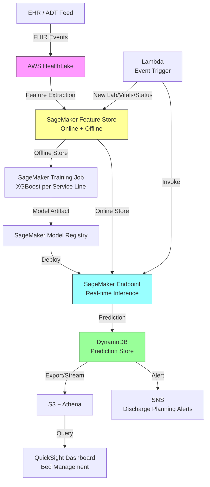

# Recipe 7.7 Architecture and Implementation: Length of Stay Prediction

*Companion to [Recipe 7.7: Length of Stay Prediction](chapter07.07-length-of-stay-prediction). This page covers the AWS architecture, services, prerequisites, and pseudocode. For the problem framing and the conceptual approach, start with the main recipe.*

---

## The AWS Implementation

### Why These Services

**Amazon SageMaker for model training and hosting.** SageMaker provides the full ML lifecycle: notebook environments for exploration, managed training jobs for scale, model registry for versioning, and real-time endpoints for inference. For LOS prediction specifically, SageMaker's built-in XGBoost algorithm handles the structured tabular data well, and the batch transform feature handles the daily re-scoring of all current inpatients efficiently.

<!-- TODO (TechWriter): Expert review S3 (MEDIUM). Add brief note on model artifact security: KMS encryption for model artifacts in S3, access control on Model Registry (restrict CreateModel/CreateEndpoint to deployment pipeline role), and model approval gate (PendingManualApproval status) before serving live predictions. -->

**Amazon SageMaker Feature Store for feature management.** The feature store is how you avoid training-serving skew. Define your feature groups (admission features, daily clinical features, social features), compute them once, and both training and inference see the same values. The offline store feeds training; the online store feeds real-time inference.

**AWS HealthLake for FHIR-based clinical data.** HealthLake provides a FHIR-compliant data store that can ingest ADT (admit/discharge/transfer) events, lab results, medications, and other clinical data in a standardized format. This gives you a clean, queryable source for feature engineering without building custom EHR integrations from scratch.

**AWS Lambda for event-driven prediction triggers.** When a new lab result arrives or a patient's status changes, Lambda can trigger a re-prediction. This keeps predictions fresh without running a continuous polling loop. Configure an ADT event trigger so that when a new admission event arrives from HealthLake, a Lambda function extracts admission features and writes them to the Feature Store online store immediately. This enables a real-time admission-time prediction within minutes of admission, rather than waiting for the next daily batch cycle.

**Amazon DynamoDB for prediction storage.** Current predictions for all inpatients need to be queryable by bed, unit, service line, and predicted discharge date. DynamoDB's flexible key structure and single-digit-millisecond reads make it ideal for the operational dashboard queries. Access to the prediction store should be mediated through row-level security on the dashboard layer (restricting users to their assigned units) and an API layer for programmatic access. SNS alert messages should contain minimal PHI (encounter ID and unit, with a link to the secure dashboard for details) rather than embedding clinical trajectory information in notification bodies.

**Amazon QuickSight for operational dashboards.** Bed management and discharge planning teams need visual tools, not APIs. QuickSight connects to the prediction data (via Athena queries over DynamoDB exports to S3, or via a Lambda-backed custom connector) and renders unit-level views of predicted discharges, capacity forecasts, and patients at risk of extended stays. For real-time bed management views, Amazon Managed Grafana (which supports DynamoDB via CloudWatch) is an alternative worth evaluating.

### Architecture Diagram



### Prerequisites

<!-- TODO (TechWriter): Expert review S1 (HIGH). Replace wildcard IAM permissions with role-specific, action-specific permissions per pipeline component (training role, inference role, feature engineering role, Lambda trigger role). Current sagemaker:* and healthlake:* violate least privilege. -->

| Requirement | Details |
|-------------|---------|
| **AWS Services** | Amazon SageMaker, SageMaker Feature Store, AWS HealthLake, AWS Lambda, Amazon DynamoDB, Amazon QuickSight, Amazon SNS, Amazon S3 |
| **IAM Permissions** | `sagemaker:*` (scoped to project resources), `healthlake:*`, `dynamodb:PutItem/GetItem/Query`, `s3:GetObject/PutObject`, `lambda:InvokeFunction`, `sns:Publish` |
| **BAA** | Required. All services handle PHI (patient demographics, diagnoses, clinical data). |
| **Encryption** | S3: SSE-KMS for training data and model artifacts. DynamoDB: encryption at rest (default). HealthLake: KMS encryption. SageMaker: KMS for training volumes and endpoints. All transit over TLS. |
| **VPC** | SageMaker training and endpoints in VPC. Lambda event triggers in VPC. VPC endpoints for S3 (gateway), DynamoDB (gateway), SageMaker Runtime (interface), SageMaker API (interface), CloudWatch Logs (interface), SNS (interface), and HealthLake (interface). This eliminates NAT Gateway dependency for AWS service calls. |
| **CloudTrail** | Enabled for all service API calls. Enable data events for S3 (training data and model artifact buckets) and DynamoDB (prediction store). SageMaker model lineage tracked via Model Registry. Enable SageMaker endpoint invocation logging via CloudWatch for patient-level audit trails. |
| **Sample Data** | MIMIC-IV (publicly available ICU dataset; requires PhysioNet credentialing and data use agreement) for development. Synthea for synthetic general hospital encounters. Never use real patient data in dev/test environments. If using institutional data for development, apply HIPAA Safe Harbor de-identification before moving data to non-production environments. |
| **Cost Estimate** | Training: ~$5-20 per training run (ml.m5.xlarge, 1-4 hours). Inference endpoint: ~$100/month (ml.m5.large, always-on; multiply for separate per-service-line endpoints, or use Multi-Model Endpoints to reduce cost by 60-80%). Batch transform for daily refresh: ~$2/day. HealthLake: $0.60/10K FHIR operations. Feature Store: ~$50/month for online store. Real-time cost of ~$0.08/prediction assumes ~1,200 predictions/month amortized over the always-on endpoint. |

### Ingredients

| AWS Service | Role |
|------------|------|
| **Amazon SageMaker** | Model training, hosting, batch inference, model registry |
| **SageMaker Feature Store** | Consistent feature serving for training and inference |
| **AWS HealthLake** | FHIR-compliant clinical data store; source for feature engineering |
| **AWS Lambda** | Event-driven triggers for re-prediction on clinical state changes |
| **Amazon DynamoDB** | Low-latency prediction store for operational queries |
| **Amazon S3** | Training data, model artifacts, batch prediction outputs |
| **Amazon QuickSight** | Operational dashboards for bed management and discharge planning |
| **Amazon SNS** | Alerts for extended-stay predictions and discharge readiness |
| **AWS KMS** | Encryption key management for all PHI-containing stores |
| **Amazon CloudWatch** | Model performance monitoring, prediction latency, drift detection |

### Code

#### Walkthrough

**Step 1: Feature extraction from clinical data.** The foundation of any LOS model is the feature set. At admission time, you extract static features (demographics, diagnosis, comorbidities, admission source). As the stay progresses, you extract dynamic features (latest labs, vital sign trends, medication changes, procedures). The feature extraction logic must handle missing data gracefully because not every patient has every lab drawn on every day. The key design decision: compute features at a consistent cadence (every 24 hours at midnight, for example) so that training data and inference data are aligned temporally. Skip this step or compute features inconsistently, and your model will learn patterns that don't exist in production.

```text
FUNCTION extract_admission_features(encounter):
    // Static features available at the moment of admission.
    // These form the baseline prediction before any clinical trajectory is observed.
    
    features = {
        "age":                  encounter.patient.age_at_admission,
        "sex":                  encode_categorical(encounter.patient.sex),
        "admission_source":     encode_categorical(encounter.admission_source),  // ED, direct, transfer
        "admission_type":       encode_categorical(encounter.admission_type),    // emergent, elective, urgent
        "primary_dx_category":  map_icd10_to_category(encounter.primary_diagnosis),
        "drg_code":             encounter.drg_assignment,
        "drg_geometric_mean":   lookup_drg_mean_los(encounter.drg_assignment),   // CMS benchmark
        "charlson_score":       compute_charlson_index(encounter.diagnosis_list),
        "elixhauser_count":     count_elixhauser_categories(encounter.diagnosis_list),
        "prior_admits_12mo":    count_admissions_last_12_months(encounter.patient_id),
        "prior_ed_visits_12mo": count_ed_visits_last_12_months(encounter.patient_id),
        "insurance_category":   encode_categorical(encounter.insurance_type),    // Medicare, Medicaid, commercial
        "day_of_week_admit":    encounter.admission_datetime.day_of_week,
        "hour_of_admit":        encounter.admission_datetime.hour
    }
    
    RETURN features


FUNCTION extract_daily_features(encounter, as_of_date):
    // Dynamic features computed at a specific point during the stay.
    // These capture the clinical trajectory and enable prediction updates.
    
    current_day = days_between(encounter.admission_date, as_of_date)
    
    // Lab features: most recent values and trends
    labs = get_latest_labs(encounter.patient_id, as_of_date)
    lab_features = {
        "wbc_latest":           labs.get("WBC", NULL),
        "wbc_trend_48h":        compute_trend(labs, "WBC", hours=48),  // rising, falling, stable
        "creatinine_latest":    labs.get("CREATININE", NULL),
        "albumin_latest":       labs.get("ALBUMIN", NULL),
        "lactate_latest":       labs.get("LACTATE", NULL),
        "abnormal_lab_count":   count_abnormal_flags(labs)
    }
    
    // Vital sign stability
    vitals = get_vitals_last_24h(encounter.patient_id, as_of_date)
    vital_features = {
        "temp_max_24h":         max(vitals.temperature),
        "hr_variability_24h":   std_deviation(vitals.heart_rate),
        "o2_requirement":       latest_o2_flow_rate(vitals),
        "bp_stable":            is_bp_stable_24h(vitals)  // boolean
    }
    
    // Treatment intensity signals
    treatment_features = {
        "iv_antibiotics_active":    has_active_iv_antibiotics(encounter, as_of_date),
        "vasopressors_active":      has_active_vasopressors(encounter, as_of_date),
        "new_consults_today":       count_consults_ordered(encounter, as_of_date),
        "procedures_pending":       count_pending_procedures(encounter, as_of_date),
        "diet_status":              get_diet_order_status(encounter, as_of_date)  // NPO, clear, regular
    }
    
    // Combine all feature sets with the current day of stay
    all_features = merge(lab_features, vital_features, treatment_features)
    all_features["current_day_of_stay"] = current_day
    
    RETURN all_features
```

**Step 2: Training data preparation.** For training, you need historical encounters with known outcomes (actual LOS). The trick is creating training examples at multiple time points during each stay. A patient who stayed 7 days generates training examples at day 0 (target: 7), day 1 (target: 6), day 2 (target: 5), and so on. This teaches the model to predict remaining LOS from any point during the stay, not just admission. Filter out encounters that ended in death or transfer (different outcome distributions) unless you're building separate models for those populations. Also exclude encounters shorter than 24 hours (observation stays) unless your use case specifically includes them.

```text
FUNCTION prepare_training_data(historical_encounters, min_los=1, max_los=60):
    // Build training examples from completed encounters.
    // Each encounter generates multiple examples: one per day of stay.
    
    training_examples = empty list
    
    FOR each encounter in historical_encounters:
        actual_los = encounter.actual_length_of_stay_days
        
        // Filter: exclude very short stays (observation) and extreme outliers
        IF actual_los < min_los OR actual_los > max_los:
            CONTINUE
        
        // Filter: exclude deaths and transfers (build separate models for these)
        IF encounter.discharge_disposition IN ["expired", "transfer_acute"]:
            CONTINUE
        
        // Generate admission-time example
        admission_features = extract_admission_features(encounter)
        admission_features["remaining_los"] = actual_los  // target variable
        admission_features["prediction_day"] = 0
        append admission_features to training_examples
        
        // Generate daily examples for each day of the stay
        FOR day = 1 TO actual_los - 1:
            as_of_date = encounter.admission_date + day days
            
            daily_features = extract_daily_features(encounter, as_of_date)
            combined = merge(admission_features, daily_features)
            combined["remaining_los"] = actual_los - day  // remaining days from this point
            combined["prediction_day"] = day
            
            append combined to training_examples
    
    RETURN training_examples
```

**Step 3: Model training with service-line stratification.** One model does not fit all. Cardiac surgery patients have fundamentally different LOS drivers than general medicine patients. Train separate models per service line (or DRG family) to capture these differences. Use gradient boosted trees as the baseline because they handle the mixed feature types, missing values, and non-linear relationships well. Evaluate using mean absolute error (MAE) and the percentage of predictions within 1 day of actual. Also evaluate calibration: does the model's predicted distribution match the actual distribution?

```text
FUNCTION train_los_model(training_data, service_line):
    // Train a gradient boosted tree model for a specific service line.
    // Separate models per service line capture different LOS dynamics.
    
    // Filter training data to this service line
    service_data = filter training_data WHERE service_line matches
    
    // Split: 80% train, 10% validation, 10% test (time-based split, not random)
    // Time-based split prevents data leakage from future patterns
    train, validation, test = temporal_split(service_data, ratios=[0.8, 0.1, 0.1])
    
    // Define features (exclude the target and metadata columns)
    feature_columns = all columns EXCEPT ["remaining_los", "encounter_id", "patient_id"]
    target_column = "remaining_los"
    
    // Train XGBoost regressor
    model = XGBoost.train(
        objective       = "reg:squarederror",
        train_data      = train[feature_columns],
        train_labels    = train[target_column],
        validation_data = validation[feature_columns],
        validation_labels = validation[target_column],
        hyperparameters = {
            "max_depth":        6,
            "learning_rate":    0.05,
            "n_estimators":     500,
            "subsample":        0.8,
            "colsample_bytree": 0.8,
            "early_stopping":   20,       // stop if validation doesn't improve for 20 rounds
            "min_child_weight": 10        // prevent overfitting to rare cases
        }
    )
    
    // Evaluate on held-out test set
    predictions = model.predict(test[feature_columns])
    metrics = {
        "mae":              mean_absolute_error(test[target_column], predictions),
        "within_1_day":     percentage_within_threshold(test[target_column], predictions, threshold=1),
        "within_2_days":    percentage_within_threshold(test[target_column], predictions, threshold=2),
        "median_error":     median(absolute(test[target_column] - predictions)),
        "r_squared":        r2_score(test[target_column], predictions)
    }
    
    // Log metrics and register model
    log_metrics(metrics, service_line=service_line)
    register_model(model, service_line=service_line, metrics=metrics)
    
    RETURN model, metrics
```

**Step 4: Real-time inference for current inpatients.** For operational use, the system needs to produce updated predictions for all current inpatients at least daily, and ideally whenever significant clinical events occur (new lab results, procedure completion, status change). The inference pipeline pulls the latest features from the feature store, selects the appropriate service-line model, runs prediction, and writes the result to the prediction store. Include a confidence interval (not just a point estimate) so that operations teams can distinguish between "we're fairly sure this patient leaves tomorrow" and "this could be anywhere from 2 to 10 more days."

<!-- TODO (TechWriter): Expert review A2 (MEDIUM). Clarify multi-model endpoint pattern: separate endpoints per service line vs. SageMaker Multi-Model Endpoints (lower cost, ~50ms model-loading overhead). Update cost estimate to reflect multiple service lines. -->

```text
FUNCTION predict_remaining_los(encounter_id):
    // Generate an updated LOS prediction for a current inpatient.
    // Called on a schedule (daily) and on clinical event triggers.
    
    // Get encounter metadata to select the right model
    encounter = get_active_encounter(encounter_id)
    service_line = encounter.service_line
    
    // Pull latest features from the feature store (ensures consistency with training)
    admission_features = feature_store.get_online(
        feature_group = "admission_features",
        record_id     = encounter_id
    )
    daily_features = feature_store.get_online(
        feature_group = "daily_features",
        record_id     = encounter_id
    )
    
    // Combine feature sets
    features = merge(admission_features, daily_features)
    
    // Select the model for this service line
    model_endpoint = get_model_endpoint(service_line)
    
    // Run inference
    prediction = invoke_endpoint(model_endpoint, features)
    
    // Compute confidence interval using quantile predictions
    // (requires training quantile regression models or using prediction intervals)
    lower_bound = max(0, prediction.point_estimate - prediction.uncertainty)
    upper_bound = prediction.point_estimate + prediction.uncertainty
    
    // Calculate predicted discharge date
    current_day = days_since_admission(encounter)
    predicted_discharge = encounter.admission_date + current_day + prediction.point_estimate
    
    // Store prediction
    result = {
        "encounter_id":         encounter_id,
        "patient_id":           encounter.patient_id,
        "unit":                 encounter.current_unit,
        "bed":                  encounter.current_bed,
        "service_line":         service_line,
        "current_day_of_stay":  current_day,
        "predicted_remaining":  round(prediction.point_estimate, 1),
        "confidence_lower":     round(lower_bound, 1),
        "confidence_upper":     round(upper_bound, 1),
        "predicted_discharge":  predicted_discharge,
        "drg_expected_los":     lookup_drg_mean_los(encounter.drg_assignment),
        "exceeds_expected":     (current_day + prediction.point_estimate) > lookup_drg_mean_los(encounter.drg_assignment),
        "prediction_timestamp": current_utc_timestamp(),
        "model_version":        model_endpoint.version
    }
    
    write_to_prediction_store(result)
    
    // Alert if predicted to significantly exceed DRG expected LOS
    IF result.exceeds_expected AND current_day <= 2:
        send_alert("extended_stay_early_warning", result)
    
    RETURN result
```

**Step 5: Daily batch refresh and monitoring.** Once a day, re-score all current inpatients and compare yesterday's predictions against today's reality. Patients who were discharged yesterday provide ground truth for model monitoring. Track prediction accuracy over time and trigger retraining when performance degrades. Also monitor for distribution drift: if the patient population is changing (new service lines, seasonal patterns, pandemic surges), the model may need updating even if recent accuracy looks acceptable. Orchestrate this batch with a workflow engine (such as Step Functions): check HealthLake data freshness before scoring, checkpoint progress so the pipeline can resume on partial failure, and alert the operations team if the batch doesn't complete within its expected window.

```text
FUNCTION daily_batch_refresh():
    // Run every morning: update all predictions and monitor model performance.
    
    // 1. Score all current inpatients
    active_encounters = get_all_active_inpatient_encounters()
    
    FOR each encounter in active_encounters:
        // Update features in the feature store
        daily_features = extract_daily_features(encounter, today)
        feature_store.put_online("daily_features", encounter.encounter_id, daily_features)
        
        // Generate fresh prediction
        predict_remaining_los(encounter.encounter_id)
    
    // 2. Evaluate yesterday's predictions against actual outcomes
    discharged_yesterday = get_encounters_discharged(yesterday)
    
    errors = empty list
    FOR each encounter in discharged_yesterday:
        // Get the prediction that was active at the start of yesterday
        yesterday_prediction = get_prediction_as_of(encounter.encounter_id, yesterday)
        actual_remaining = days_between(yesterday, encounter.discharge_datetime)
        
        error = yesterday_prediction.predicted_remaining - actual_remaining
        append error to errors
    
    // 3. Compute and log monitoring metrics
    monitoring_metrics = {
        "date":                 today,
        "patients_scored":      length(active_encounters),
        "patients_discharged":  length(discharged_yesterday),
        "mae_yesterday":        mean(absolute(errors)),
        "bias_yesterday":       mean(errors),  // positive = overpredicting LOS
        "within_1_day_pct":     percentage_within(errors, threshold=1),
        "active_census":        length(active_encounters)
    }
    
    log_monitoring_metrics(monitoring_metrics)
    
    // 4. Alert if model performance is degrading
    IF monitoring_metrics.mae_yesterday > PERFORMANCE_THRESHOLD:
        send_alert("model_performance_degradation", monitoring_metrics)
    
    RETURN monitoring_metrics
```

> **Curious how this looks in Python?** The pseudocode above covers the concepts. If you'd like to see sample Python code that demonstrates these patterns using boto3, check out the [Python Example](chapter07.07-python-example). It walks through each step with inline comments and notes on what you'd need to change for a real deployment.

### Expected Results

**Sample prediction output for a current inpatient:**

```json
{
  "encounter_id": "ENC-2026-048291",
  "patient_id": "PAT-00839271",
  "unit": "4-North Medical",
  "bed": "4N-12",
  "service_line": "General Medicine",
  "current_day_of_stay": 3,
  "predicted_remaining": 2.4,
  "confidence_lower": 1.1,
  "confidence_upper": 4.8,
  "predicted_discharge": "2026-06-03",
  "drg_expected_los": 4.2,
  "exceeds_expected": true,
  "prediction_timestamp": "2026-05-31T06:00:00Z",
  "model_version": "gen-med-v2.3"
}
```

**Performance benchmarks:**

| Metric | Typical Value |
|--------|---------------|
| MAE (admission-time prediction) | 1.8-2.5 days |
| MAE (day 2+ prediction) | 1.2-1.8 days |
| Within 1 day accuracy | 45-55% |
| Within 2 days accuracy | 70-80% |
| Inference latency (real-time) | 50-150ms |
| Batch scoring (500 patients) | 2-5 minutes |
| Model retraining | 1-4 hours |
| Cost per prediction | ~$0.02 (batch), ~$0.08 (real-time) |

**Where it struggles:**
- Patients with social barriers to discharge (medically ready but no placement available)
- Rare diagnoses with fewer than 50 historical examples in training data
- Patients who develop unexpected complications mid-stay (prediction accuracy drops until the complication is reflected in features)
- Psychiatric holds and behavioral health patients (LOS driven by legal/capacity factors, not clinical trajectory)
- Patients awaiting specific procedures with unpredictable scheduling (e.g., OR availability)

---

## Variations and Extensions

**Discharge readiness scoring.** Instead of predicting remaining days, predict the probability that a patient is ready for discharge today. This flips the framing from "how long will they stay?" to "should we be actively planning discharge right now?" Combine clinical readiness signals (stable vitals, oral medications, independent mobility) with disposition readiness (placement confirmed, family educated, DME ordered). This is often more actionable for discharge planners than a day-count prediction.

**Capacity forecasting integration.** Aggregate individual LOS predictions across all current inpatients to forecast unit-level and hospital-level bed availability for the next 72 hours. Combine with scheduled admissions (surgical schedule, planned transfers) to produce a net capacity forecast. This enables proactive surgical scheduling and ED boarding mitigation. See Recipe 12.5 (Hospital Census Forecasting) for the time-series forecasting complement to this approach.

**Service-line-specific complication models.** For high-volume service lines (joint replacement, cardiac surgery, general medicine), build sub-models that specifically predict the probability of LOS-extending complications (surgical site infection, pneumonia, delirium). Feed these complication probabilities as features into the main LOS model. This gives the model a mechanism to anticipate LOS extensions before they happen, rather than reacting after the complication is documented.

---

## Additional Resources

**AWS Documentation:**
- [Amazon SageMaker Developer Guide](https://docs.aws.amazon.com/sagemaker/latest/dg/whatis.html)
- [SageMaker Feature Store Documentation](https://docs.aws.amazon.com/sagemaker/latest/dg/feature-store.html)
- [SageMaker XGBoost Algorithm](https://docs.aws.amazon.com/sagemaker/latest/dg/xgboost.html)
- [AWS HealthLake Developer Guide](https://docs.aws.amazon.com/healthlake/latest/devguide/what-is-amazon-health-lake.html)
- [SageMaker Model Monitor](https://docs.aws.amazon.com/sagemaker/latest/dg/model-monitor.html)
- [AWS HIPAA Eligible Services](https://aws.amazon.com/compliance/hipaa-eligible-services-reference/)

**AWS Sample Repos:**
- [`amazon-sagemaker-examples`](https://github.com/aws/amazon-sagemaker-examples): Comprehensive SageMaker examples including XGBoost regression, feature store integration, and model monitoring
- [`amazon-sagemaker-feature-store-end-to-end-workshop`](https://github.com/aws-samples/amazon-sagemaker-feature-store-end-to-end-workshop): End-to-end feature store patterns for training and real-time inference

**Industry References:**
- [MIMIC-IV Clinical Database](https://physionet.org/content/mimiciv/): Publicly available ICU dataset commonly used for LOS prediction research
- [CMS DRG Definitions Manual](https://www.cms.gov/Medicare/Medicare-Fee-for-Service-Payment/AcuteInpatientPPS): Official DRG geometric mean LOS values used as baseline features
- [Synthea Patient Generator](https://synthetichealth.github.io/synthea/): Synthetic patient data generator for development and testing

---

## Estimated Implementation Time

| Phase | Duration | What You Get |
|-------|----------|--------------|
| **Basic** | 4-6 weeks | Admission-time prediction for one service line. Batch daily scoring. Static dashboard. |
| **Production-ready** | 10-14 weeks | Multi-service-line models. Real-time updates on clinical events. Alerting. Model monitoring. Feature store. |
| **With variations** | 16-22 weeks | Discharge readiness scoring. Capacity forecasting integration. Complication sub-models. Full operational workflow integration. |

---

**Tags:** `predictive-analytics`, `length-of-stay`, `hospital-operations`, `bed-management`, `discharge-planning`, `xgboost`, `feature-store`, `sagemaker`, `healthlake`, `regression`, `time-series`

---

| [← 7.6: Rising Risk Identification](chapter07.06-rising-risk-identification) | [Chapter 7 Index](chapter07-preface) | [7.8: Disease Progression Modeling →](chapter07.08-disease-progression-modeling) |
|:---|:---:|---:|


---

*← [Main Recipe 7.7](chapter07.07-length-of-stay-prediction) · [Python Example](chapter07.07-python-example) · [Chapter Preface](chapter07-preface)*
