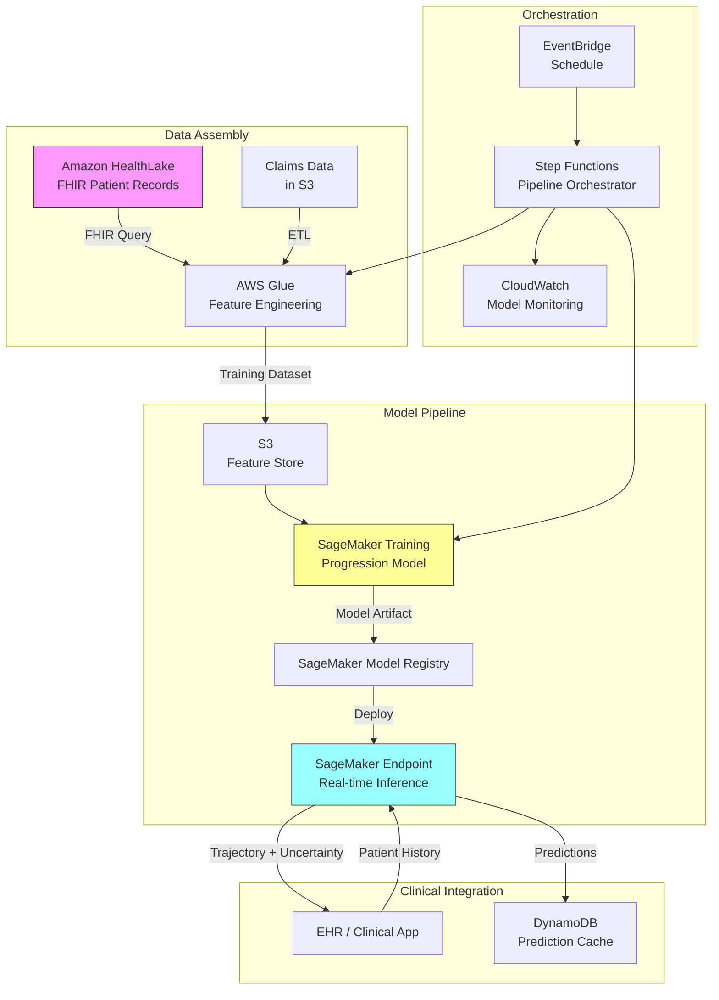

# Recipe 7.8: Disease Progression Modeling

**Complexity:** Complex · **Phase:** Research/Production · **Estimated Cost:** ~$2,500–$8,000/month (model training + inference at scale)

---

## The Problem

A nephrologist is looking at a patient with Stage 3a chronic kidney disease. The eGFR is 52. It was 58 a year ago, 63 two years before that. The question that matters most to this patient, to their family, and to the care team is: how fast is this going to get worse? Will they need dialysis in two years? Five? Ten? Should we escalate treatment now, or is this a slow decline that can be managed conservatively for another decade?

Right now, the answer is mostly clinical intuition. The nephrologist has seen hundreds of CKD patients. They know the general trajectory. But "general trajectory" is not the same as "this patient's trajectory." Two patients with identical eGFR values today can have wildly different outcomes depending on their diabetes control, blood pressure management, medication adherence, genetic factors, and a dozen other variables that interact in ways no human can reliably compute across a multi-year horizon.

This isn't unique to kidney disease. Diabetes progresses from controlled to uncontrolled to complications. Heart failure moves through stages. COPD declines. Multiple sclerosis relapses and remits. Parkinson's advances. In every case, the clinical question is the same: given everything we know about this patient right now, what does their future look like?

The stakes are enormous. Intervene too early and you subject patients to aggressive treatments they didn't need yet (with side effects, costs, and quality-of-life impacts). Intervene too late and you've missed the window where treatment could have slowed progression. The sweet spot is knowing, with reasonable confidence, where a patient is headed so you can time interventions appropriately.

Disease progression modeling is the ML approach to this problem. It takes longitudinal patient data (labs, vitals, medications, diagnoses, procedures over time) and learns the patterns that predict how a disease will evolve for a specific individual. Not population averages. Individual trajectories.

It's also one of the hardest problems in healthcare ML, and the reasons why are worth understanding before you build anything.

---

## The Technology: Modeling How Diseases Evolve

### Why This Is Fundamentally Hard

Disease progression modeling sits at the intersection of several difficult ML problems, and the combination is what makes it genuinely complex.

**Long time horizons.** You're predicting months to years into the future, not hours or days. Every additional month of prediction horizon compounds uncertainty. A model that's well-calibrated at 6 months might be useless at 36 months. The further out you predict, the more external factors (new medications, lifestyle changes, comorbidities) can alter the trajectory.

**Treatment effects confound observation.** Here's the fundamental paradox: you're trying to predict what will happen to a patient, but the treatments they receive change what happens. A patient whose CKD was progressing rapidly might have been put on an ACE inhibitor that slowed the decline. If you train naively on observational data, you'll learn that "patients who got ACE inhibitors progressed slowly," which conflates the treatment effect with the natural disease course. Separating what the disease would have done from what treatment made it do is a causal inference problem, and it's genuinely hard.

**Irregular observation intervals.** Patients don't show up for labs on a regular schedule. A stable patient might have labs every 6 months. A deteriorating patient might have labs every 2 weeks. The observation frequency itself is informative (more frequent visits often signal clinical concern), and your model needs to handle irregular time series gracefully. Standard time series models that expect evenly-spaced observations don't work here without significant adaptation.

**Competing risks and multi-state transitions.** A CKD patient doesn't just progress linearly from Stage 3 to Stage 5. They might stabilize. They might improve temporarily. They might develop a cardiovascular event that changes everything. They might die from something unrelated. Disease progression is really a multi-state model with transitions between states, and some transitions are absorbing (you don't come back from dialysis initiation). Modeling this correctly requires thinking about competing risks, not just a single outcome.

**Censoring.** Many patients in your training data haven't reached the endpoint yet. A patient with 3 years of CKD data who hasn't progressed to Stage 4 isn't a "non-progressor." They might progress next year. This is right-censoring, and it's the same problem that survival analysis was invented to handle. Ignoring it (treating censored patients as non-events) biases your model toward optimism.

### The Modeling Approaches

There are several families of models used for disease progression, each with different strengths:

**Joint longitudinal-survival models.** These simultaneously model the trajectory of a biomarker (like eGFR over time) and the time to an event (like dialysis initiation). The biomarker trajectory informs the event risk, and the event risk accounts for the fact that some trajectories are cut short. This is the classical statistical approach, well-understood and interpretable, but it struggles with high-dimensional feature spaces and complex nonlinear relationships.

**Hidden Markov models (HMMs) and multi-state models.** These represent disease as a sequence of discrete states with probabilistic transitions. A patient is "in" a state (e.g., CKD Stage 3a) and has some probability of transitioning to adjacent states (Stage 3b, or back to Stage 2, or to death) at each time step. The "hidden" part means the true disease state might not be directly observable; you infer it from noisy measurements. These are elegant for diseases with clear staging but struggle when progression is continuous rather than discrete.

**Recurrent neural networks and temporal models.** LSTMs, GRUs, and transformer-based architectures can learn complex temporal patterns from sequential patient data. They handle irregular time intervals (with appropriate encoding), capture nonlinear relationships, and can incorporate high-dimensional feature sets. The tradeoff: they're less interpretable, require more data, and can overfit on small cohorts. They also don't naturally handle censoring without custom loss functions.

**Gaussian process models.** These provide a probabilistic framework for modeling continuous trajectories with uncertainty quantification built in. They handle irregular observations naturally and produce confidence intervals that widen as you predict further into the future (which is honest). They're computationally expensive for large datasets but excellent for individual patient trajectory modeling.

**Survival analysis extensions.** Cox proportional hazards models, accelerated failure time models, and their modern deep learning extensions (DeepSurv, Deep Recurrent Survival Analysis) handle censoring natively and can model time-to-event outcomes. They're the right foundation when your primary question is "when will this patient reach a specific milestone?"

In practice, production systems often combine approaches: a temporal model for trajectory prediction paired with a survival model for milestone timing, with uncertainty quantification layered on top.

### Handling Treatment Effects

This deserves its own section because it's where most naive implementations fail.

If you train a model on observational data without accounting for treatment, you'll learn correlations that don't reflect causal disease progression. Patients who received aggressive treatment will appear to have better outcomes, but that's the treatment working, not the disease being milder.

There are several approaches to this:

**Marginal structural models** use inverse probability of treatment weighting to create a pseudo-population where treatment assignment is independent of confounders. This lets you estimate what would have happened without treatment.

**G-computation** models the outcome under different treatment scenarios explicitly, allowing you to predict progression under the patient's current treatment plan versus alternatives.

**Causal forests and heterogeneous treatment effect estimation** learn how treatment effects vary across patient subgroups, which is useful for identifying who benefits most from escalation.

**Simpler approaches** include conditioning on treatment as a feature (acknowledging that your predictions are "given current treatment continues") or building separate models for treated and untreated populations. These are less rigorous but more practical for a first implementation.

The honest answer: perfectly separating disease progression from treatment effects requires randomized trial data or very careful causal inference methodology. Most production systems take the pragmatic approach of conditioning on current treatment and being transparent about that assumption.

<!-- TODO (TechWriter): Expert review A-5 (MEDIUM). Add a paragraph addressing the eGFR race coefficient issue (2021 CKD-EPI race-free equation) and recommend stratified model evaluation by race, sex, and age group. Reference the NKF/ASN Task Force recommendation. This is both a fairness concern and a data quality concern. -->

### Uncertainty Quantification

This is non-negotiable for clinical use. A point prediction of "eGFR will be 38 in two years" is less useful (and potentially dangerous) than "eGFR will likely be between 32 and 44 in two years, with 80% confidence." Clinicians need to understand the range of possible futures, not just the most likely one.

Approaches include:
- Prediction intervals from Gaussian processes or Bayesian models
- Monte Carlo dropout in neural networks (approximate Bayesian inference)
- Quantile regression (predicting the 10th, 50th, and 90th percentile outcomes)
- Ensemble disagreement (training multiple models and measuring how much they disagree)

The uncertainty should grow with prediction horizon. If your model is equally confident about next month and next year, something is wrong.

---

## General Architecture Pattern

```
[Longitudinal Data Assembly] → [Feature Engineering] → [Model Training] → [Individual Prediction] → [Clinical Integration]
```

**Longitudinal Data Assembly.** Gather the patient's full temporal record: labs over time, vitals over time, medications (start/stop dates, dosages), diagnoses (onset dates), procedures, and relevant social/demographic factors. This is not a single snapshot; it's a time-indexed sequence. The assembly step must handle data from multiple source systems (EHR, claims, labs, pharmacy) and align them on a common timeline.

**Feature Engineering.** Transform raw temporal data into model-ready features. This includes: rate of change (is eGFR declining, and how fast?), variability (is blood pressure stable or swinging?), treatment history encoding (what medications, for how long, at what doses?), comorbidity burden (how many other conditions are active?), and time-since-last-observation (how stale is our information?). For deep learning approaches, you might feed raw sequences directly, but even then, engineered features often improve performance.

**Model Training.** Train on a retrospective cohort with sufficient follow-up. The training data must include patients who progressed and patients who didn't (or who were censored). Handle class imbalance (most patients progress slowly), censoring (many patients haven't reached the endpoint), and treatment confounding (patients who progressed may have received different treatments). Validate on a held-out temporal cohort (train on patients from 2015-2020, validate on 2021-2023) to avoid data leakage.

**Individual Prediction.** Given a new patient's history up to today, generate a predicted trajectory with uncertainty bounds. This should include: predicted biomarker values at future time points, probability of reaching specific milestones (e.g., Stage 4, dialysis) within specific time windows, and confidence intervals that honestly reflect uncertainty.

**Clinical Integration.** Surface predictions where clinicians make decisions. This means integration with the EHR workflow, not a standalone dashboard that nobody checks. Include explanations of what's driving the prediction (which factors are accelerating or decelerating progression) and clear communication of uncertainty. Provide actionable thresholds: "if progression continues at this rate, the patient will reach Stage 4 within 18 months, suggesting nephrology referral now."

---

## The AWS Implementation

### Why These Services

**Amazon SageMaker for model training and hosting.** Disease progression models require iterative experimentation (trying different architectures, feature sets, time horizons) and then reliable hosting for real-time inference. SageMaker provides managed training infrastructure (so you're not babysitting GPU instances), experiment tracking, model registry for versioning, and real-time endpoints for serving predictions. The training jobs can scale to large cohorts without you managing cluster infrastructure.

**Amazon HealthLake for longitudinal data assembly.** HealthLake stores clinical data in FHIR format and provides query capabilities across patient timelines. For disease progression modeling, you need to efficiently retrieve a patient's full history (all labs, medications, conditions over years). HealthLake's FHIR-native storage makes this query natural rather than requiring complex joins across dozens of tables. It also handles the HIPAA compliance layer (encryption, access logging, BAA coverage).

**AWS Glue for feature engineering pipelines.** Transforming raw longitudinal records into model-ready features requires batch processing at scale. Glue handles the ETL: computing rates of change, encoding medication histories, calculating comorbidity indices, and assembling training datasets. Spark-based processing handles the volume (millions of patient-years of data) without custom infrastructure.

**Amazon S3 for training data and model artifacts.** Training datasets (assembled feature matrices), trained model artifacts, and prediction outputs all live in S3. Versioned buckets let you trace which training data produced which model version, which is essential for model governance and reproducibility.

**Amazon EventBridge and AWS Step Functions for orchestration.** The progression modeling pipeline has multiple stages (data refresh, feature computation, model retraining, validation, deployment) that need to run on schedule and handle failures gracefully. Step Functions orchestrate the workflow; EventBridge triggers it on schedule or in response to events (new lab results arriving).

**Amazon CloudWatch for monitoring.** Model performance degrades over time as patient populations shift and treatment patterns change. CloudWatch tracks prediction accuracy metrics, data drift indicators, and inference latency. Alarms trigger when performance drops below acceptable thresholds, signaling that retraining is needed.

### Architecture Diagram



### Prerequisites

| Requirement | Details |
|-------------|---------|
| **AWS Services** | Amazon SageMaker, Amazon HealthLake, AWS Glue, Amazon S3, Amazon DynamoDB, AWS Step Functions, Amazon EventBridge, Amazon CloudWatch |
| **IAM Permissions** | `sagemaker:CreateTrainingJob`, `sagemaker:CreateEndpoint`, `sagemaker:InvokeEndpoint`, `healthlake:SearchWithPost`, `glue:StartJobRun`, `s3:GetObject`, `s3:PutObject`, `dynamodb:PutItem`, `dynamodb:GetItem`, `states:StartExecution` |
| **BAA** | Required. Longitudinal patient data is PHI. All services must be covered under your AWS BAA. |
| **Encryption** | S3: SSE-KMS for training data and model artifacts. DynamoDB: encryption at rest. HealthLake: encrypted by default. SageMaker: KMS encryption for training volumes and endpoint storage. All transit over TLS. Model artifacts should be treated as PHI-adjacent (they encode patterns learned from patient data) and stored in PHI-designated buckets with access logging via CloudTrail. |
| **VPC** | Production: SageMaker training and endpoints in VPC. VPC endpoints for S3 (Gateway), DynamoDB (Gateway), HealthLake (Interface), SageMaker API (Interface), SageMaker Runtime (Interface), CloudWatch Logs (Interface), KMS (Interface), STS (Interface). Glue jobs must use VPC connections to access HealthLake via VPC endpoint rather than the public internet. All services should be deployed in the same AWS region to avoid cross-region data transfer charges on training data. |
| **CloudTrail** | Enabled for all service API calls. Note: CloudTrail captures API call metadata (who, when, which endpoint) but not the patient identifier in inference request bodies. Implement application-level audit logging that records (patient_id, requesting_user, timestamp, prediction_version) to a separate CloudWatch Logs stream before invoking the SageMaker endpoint. |
| **Sample Data** | Synthetic longitudinal patient data. MIMIC-IV provides realistic ICU temporal data. CMS Synthetic Public Use Files provide claims-based longitudinal records. Never use real patient data in development. |
| **Cost Estimate** | SageMaker training: ~$50-200 per training run (ml.m5.xlarge, 2-8 hours). Endpoint: ~$150/month (ml.m5.large, always-on). HealthLake: ~$500/month (storage + queries). Glue: ~$50-100/month (scheduled ETL). Total: ~$2,500-8,000/month depending on scale and retraining frequency. |

### Ingredients

| AWS Service | Role |
|------------|------|
| **Amazon SageMaker** | Model training, experiment tracking, model registry, real-time inference endpoint |
| **Amazon HealthLake** | FHIR-native longitudinal patient data store; source for temporal clinical records |
| **AWS Glue** | Batch feature engineering: rate-of-change computation, medication encoding, comorbidity indexing |
| **Amazon S3** | Training datasets, model artifacts, prediction logs (versioned, KMS-encrypted) |
| **Amazon DynamoDB** | Prediction cache for low-latency clinical lookups |
| **AWS Step Functions** | Pipeline orchestration: data refresh, training, validation, deployment workflow |
| **Amazon EventBridge** | Schedule-based triggers for retraining and batch prediction updates |
| **Amazon CloudWatch** | Model performance monitoring, data drift detection, operational alarms |
| **AWS KMS** | Encryption key management for all data at rest |

### Code

> **Reference implementations:** The following AWS resources demonstrate patterns used in this recipe:
>
> - [`amazon-sagemaker-examples`](https://github.com/aws/amazon-sagemaker-examples): SageMaker training, deployment, and monitoring patterns including time series and survival analysis examples
> - [`amazon-healthlake-toolkit`](https://github.com/aws-samples/amazon-healthlake-toolkit): HealthLake data ingestion and FHIR query patterns for clinical data

#### Walkthrough

**Step 1: Assemble longitudinal patient history.** The foundation of disease progression modeling is a complete temporal record for each patient. This step queries HealthLake (or your clinical data store) to retrieve all relevant observations, medications, conditions, and procedures for a patient cohort, organized by time. The key insight: you need not just the current values but the full history of how values changed over time. A single eGFR of 52 tells you almost nothing about trajectory. A sequence of [63, 58, 55, 52] over four years tells you the rate of decline. Skip this step or use only point-in-time snapshots, and your model has no temporal signal to learn from.

<!-- TODO (TechWriter): Expert review S-1 (HIGH). FHIR queries below should be scoped to clinically relevant data categories only (specific LOINC codes for eGFR, creatinine, HbA1c, albumin, hemoglobin, potassium; relevant condition categories like renal, cardiovascular, endocrine, metabolic). Querying all patient data violates the Minimum Necessary standard (45 CFR 164.502(b)) and may violate 42 CFR Part 2 if substance abuse records are returned. Add LOINC code filters and a note about consulting your privacy officer regarding consent requirements before assembling longitudinal datasets. -->

```
FUNCTION assemble_patient_timeline(patient_id, lookback_years):
    // Query the clinical data store for this patient's history.
    // We need labs, vitals, medications, and diagnoses over the lookback period.
    // Each record includes a timestamp so we can reconstruct the timeline.
    //
    // IMPORTANT: Scope queries to clinically relevant data categories only.
    // For CKD progression, retrieve specific LOINC codes (eGFR, creatinine,
    // HbA1c, albumin, hemoglobin, potassium) and relevant condition categories
    // (renal, cardiovascular, endocrine, metabolic). Do NOT query all patient
    // data. The Minimum Necessary standard requires limiting access to what
    // the model actually uses.

    start_date = today minus lookback_years

    // Retrieve lab results (eGFR, HbA1c, creatinine, albumin, etc.)
    labs = query FHIR Observation resources where:
        patient = patient_id
        date >= start_date
        category = "laboratory"
    // Sort chronologically. Each lab has: code, value, unit, date.

    // Retrieve medication history (what was prescribed, when, dosage)
    medications = query FHIR MedicationRequest resources where:
        patient = patient_id
        authoredOn >= start_date
    // Each medication has: drug code, dose, start date, end date (if stopped).

    // Retrieve active conditions and their onset dates
    conditions = query FHIR Condition resources where:
        patient = patient_id
        onset >= start_date OR clinicalStatus = "active"

    // Retrieve procedures (surgeries, dialysis sessions, etc.)
    procedures = query FHIR Procedure resources where:
        patient = patient_id
        performedDateTime >= start_date

    // Assemble into a unified timeline structure
    timeline = {
        patient_id:   patient_id,
        labs:         labs sorted by date,
        medications:  medications sorted by start date,
        conditions:   conditions sorted by onset,
        procedures:   procedures sorted by date,
        demographics: get patient demographics (age, sex, race, zip code)
    }

    RETURN timeline
```

**Step 2: Engineer temporal features.** Raw timeline data isn't directly usable by most models. This step transforms the longitudinal record into features that capture the dynamics of disease progression. The most important features aren't the current values; they're the rates of change, the variability, and the treatment context. A patient with eGFR declining at 5 points per year is in a very different situation than one declining at 1 point per year, even if their current eGFR is identical. This step computes those dynamics. Skip it and your model sees only snapshots, missing the trajectory information that makes progression modeling valuable.

```
FUNCTION engineer_progression_features(timeline, cutoff_date):
    // cutoff_date: the point in time from which we predict forward.
    // CRITICAL: Only use data available at cutoff_date. Using future labs
    // in feature computation is the #1 source of inflated metrics in
    // progression modeling. Every value and date below must be <= cutoff_date.

    features = empty map

    // --- Biomarker trajectory features ---
    // For each key lab (eGFR, HbA1c, blood pressure, etc.),
    // compute rate of change, variability, and trend.

    FOR each biomarker in [eGFR, HbA1c, systolic_bp, creatinine, albumin]:
        values = extract values for biomarker from timeline.labs
                 where date <= cutoff_date, sorted by date
        dates  = extract corresponding dates

        IF length(values) >= 2:
            // Linear slope: average rate of change per year.
            // Positive slope for eGFR = improving. Negative = declining.
            features[biomarker + "_slope_per_year"] = linear_regression_slope(dates, values)

            // Recent slope (last 12 months before cutoff) vs. overall slope.
            // Acceleration or deceleration of decline matters clinically.
            recent_values = values from last 12 months before cutoff_date
            IF length(recent_values) >= 2:
                features[biomarker + "_recent_slope"] = linear_regression_slope(
                    recent_dates, recent_values
                )

            // Variability: standard deviation of values.
            // High variability in eGFR suggests unstable kidney function.
            features[biomarker + "_variability"] = standard_deviation(values)

            // Most recent value (the current state)
            features[biomarker + "_current"] = last element of values

            // Time since last measurement (data freshness)
            features[biomarker + "_days_since_last"] = days between last date and cutoff_date

    // --- Medication features ---
    // Encode current and historical medication exposure.
    // Which drug classes is the patient on? For how long?

    features["ace_arb_duration_months"] = total months on ACE inhibitors or ARBs as of cutoff_date
    features["diabetes_med_count"] = number of distinct diabetes medications active at cutoff_date
    features["medication_changes_12mo"] = count of medication starts/stops in 12 months before cutoff_date
    // Frequent medication changes often signal instability or treatment failure.

    // --- Comorbidity burden ---
    // Count and weight active conditions using a standard index.
    features["charlson_comorbidity_index"] = compute Charlson index from timeline.conditions
    features["diabetes_present"] = 1 if diabetes in active conditions, else 0
    features["hypertension_present"] = 1 if hypertension in active conditions, else 0
    features["heart_failure_present"] = 1 if heart failure in active conditions, else 0

    // --- Utilization features ---
    // Healthcare utilization patterns signal disease burden.
    features["ed_visits_12mo"] = count ED visits in 12 months before cutoff_date
    features["hospitalizations_12mo"] = count inpatient stays in 12 months before cutoff_date
    features["nephrology_visits_12mo"] = count nephrology encounters in 12 months before cutoff_date

    // --- Demographics ---
    features["age"] = timeline.demographics.age
    features["sex"] = timeline.demographics.sex

    RETURN features
```

**Step 3: Train the progression model.** This is where the ML happens. The model learns, from thousands of historical patient trajectories, the patterns that predict future disease states. The training data consists of patients with sufficient follow-up: you know their feature values at time T, and you know what happened to them by time T+horizon. The model learns to map features-at-time-T to outcomes-at-time-T+horizon. Critical choices here: the loss function must handle censoring (patients who haven't reached the endpoint yet), the validation must be temporal (train on earlier patients, validate on later ones to avoid leakage), and the output must include uncertainty (not just a point prediction). Skip proper censoring handling and your model will be systematically optimistic. Skip temporal validation and your reported accuracy will be inflated.

**Important:** The implementation below uses the pragmatic approach: conditioning on current treatment as a feature. This means predictions are implicitly "given current treatment continues." The model does not answer counterfactual questions ("what if we stop the ACE inhibitor?"). For causal progression modeling, see the Counterfactual Treatment Simulation variation at the end of this recipe.

```
FUNCTION train_progression_model(training_cohort, prediction_horizons):
    // training_cohort: list of patients with features and known outcomes
    // prediction_horizons: [6, 12, 24, 36] months into the future

    // Split temporally: patients enrolled before cutoff for training,
    // patients enrolled after cutoff for validation.
    // NEVER split randomly. Random splits leak future information.
    train_set = patients with index date before temporal_cutoff
    valid_set = patients with index date after temporal_cutoff

    // For each prediction horizon, define the outcome:
    // - Did the patient reach the milestone (e.g., Stage 4 CKD) within that horizon?
    // - If not, were they censored (lost to follow-up) before the horizon?
    // - What was their biomarker value at the horizon (if observed)?

    FOR each horizon in prediction_horizons:
        labels = []
        FOR each patient in train_set:
            // Compute features using only data available at the patient's index date.
            // The index date is the cutoff_date for feature engineering.
            features = engineer_progression_features(patient.timeline, patient.index_date)

            IF patient reached milestone within horizon months:
                label = { event: 1, time_to_event: actual time }
            ELSE IF patient has follow-up >= horizon months:
                label = { event: 0, time_to_event: horizon }  // survived the window
            ELSE:
                label = { event: 0, time_to_event: follow_up_time, censored: true }
            append label to labels

    // Train a survival-aware model.
    // Options: DeepSurv, Random Survival Forest, Cox with time-varying covariates.
    // The loss function must handle censored observations correctly.
    // Use concordance index (C-index) as the primary evaluation metric:
    // it measures whether patients predicted to progress faster actually do.
    //
    // NOTE: This is observational prediction, not causal. Treatment features
    // (ace_arb_duration_months, diabetes_med_count) are confounded with disease
    // severity. The model predicts "what will happen given current treatment
    // continues," not "what would happen if treatment changed."

    model = train survival model with:
        features    = feature matrix from train_set
        labels      = time-to-event labels with censoring indicators
        loss        = negative partial log-likelihood (Cox) or ranking loss (DeepSurv)
        epochs      = until validation C-index stops improving
        calibration = isotonic regression on validation set predictions

    // Evaluate on validation set
    validation_c_index = concordance_index(model.predict(valid_set), valid_set.labels)
    calibration_curve  = compare predicted probabilities to observed event rates

    // A C-index above 0.70 is reasonable for multi-year disease progression.
    // Above 0.75 is good. Above 0.80 is excellent (and you should double-check for leakage).
    LOG "Validation C-index: " + validation_c_index

    RETURN model, validation_metrics
```

<!-- TODO (TechWriter): Expert review A-4 (MEDIUM). Add a note referencing published CKD progression models (e.g., the Kidney Failure Risk Equation by Tangri et al., which achieves C-statistics of 0.84-0.90 for 2-year and 5-year kidney failure prediction). Clarify that the recipe's benchmarks assume a general-purpose model predicting stage progression (a broader outcome than kidney failure specifically), which is inherently harder to discriminate than a binary endpoint. -->

**Step 4: Generate individual patient predictions.** Given a trained model and a specific patient's current history, generate a predicted trajectory with uncertainty bounds. This is the inference step that runs in production. The output should communicate not just the most likely future but the range of plausible futures. A clinician needs to know: "Is this patient almost certainly going to progress, or is there meaningful uncertainty?" The prediction should also identify which factors are driving the trajectory (explainability), so the clinician can assess whether the model's reasoning aligns with their clinical judgment.

```
FUNCTION predict_progression(model, patient_features, horizons):
    // Generate predictions for each time horizon.
    predictions = empty map

    FOR each horizon in horizons:
        // Get the model's predicted risk and survival probability.
        risk_score = model.predict_risk(patient_features, horizon)

        // Generate uncertainty bounds using the model's uncertainty mechanism.
        // For ensemble models: use prediction variance across ensemble members.
        // For Bayesian models: use posterior predictive distribution.
        // For neural networks: use Monte Carlo dropout (run inference N times
        // with dropout active, measure spread of predictions).
        uncertainty = model.predict_uncertainty(patient_features, horizon, n_samples=100)

        predictions[horizon] = {
            probability_of_progression: risk_score,
            confidence_interval_lower:  uncertainty.percentile_10,
            confidence_interval_upper:  uncertainty.percentile_90,
            median_prediction:          uncertainty.percentile_50
        }

    // Compute feature importance for this specific prediction.
    // SHAP values or similar: which features are pushing this patient
    // toward faster or slower progression?
    explanations = compute_shap_values(model, patient_features)

    // Identify top risk accelerators and decelerators.
    top_accelerators = top 3 features with positive SHAP values
        // e.g., "eGFR declining at 6 pts/year", "uncontrolled diabetes (HbA1c 9.2)"
    top_decelerators = top 3 features with negative SHAP values
        // e.g., "on ACE inhibitor for 2+ years", "blood pressure well-controlled"

    RETURN {
        patient_id:        patient_features.patient_id,
        prediction_date:   today,
        horizons:          predictions,
        risk_factors:      top_accelerators,
        protective_factors: top_decelerators,
        model_version:     model.version,
        data_freshness:    most recent observation date in patient_features
    }
```

**Step 5: Clinical integration and monitoring.** Predictions are useless if they don't reach clinicians at the right moment. This step stores predictions for low-latency retrieval, surfaces them in clinical workflows, and monitors model performance over time. The monitoring piece is critical: disease progression models degrade as treatment patterns change (new drugs become available), population demographics shift, and coding practices evolve. Without active monitoring, a model that was well-calibrated at deployment will silently become unreliable. Skip monitoring and you won't know your model is wrong until a clinician notices predictions that don't match reality.

Note: The DynamoDB prediction cache must have access controls matching or exceeding the source clinical system, since SHAP explanations may contain specific lab values and medication names. Restrict table access to the clinical application's IAM role.

```
FUNCTION integrate_and_monitor(prediction, patient_id):
    // Store the prediction for clinical retrieval.
    // Clinicians need sub-second access during patient encounters.
    write to prediction cache (DynamoDB):
        patient_id       = patient_id
        prediction       = prediction
        ttl              = 30 days  // cleanup mechanism for stale records
        generated_at     = now

    // Event-driven refresh: when new lab results arrive (via EventBridge),
    // trigger a re-prediction for this patient. The 30-day TTL is a safety
    // net, not the primary freshness control. The clinical interface should
    // display a warning when data_freshness is more than 14 days old.

    // Check if this prediction crosses an actionable threshold.
    // Example: >60% probability of progression within 12 months triggers an alert.
    IF prediction.horizons[12].probability_of_progression > 0.60:
        generate clinical alert:
            type     = "progression_risk_high"
            patient  = patient_id
            message  = "High probability of disease progression within 12 months"
            action   = "Consider nephrology referral and treatment escalation review"
            evidence = prediction.risk_factors

    // --- Model monitoring (batch, runs daily) ---
    // Compare predictions made N months ago against actual outcomes.
    // Did patients we predicted would progress actually progress?

    FUNCTION monitor_model_performance():
        // Retrieve predictions made 12 months ago
        old_predictions = query predictions where generated_at = 12 months ago

        FOR each old_prediction in old_predictions:
            actual_outcome = check if patient progressed in the 12 months since prediction
            record (predicted_probability, actual_outcome) for calibration analysis

        // Compute calibration: are predicted probabilities accurate?
        // If we say "60% chance of progression," do ~60% of those patients progress?
        calibration_error = compute expected calibration error across deciles

        // Compute discrimination: can the model distinguish progressors from non-progressors?
        current_c_index = concordance_index(predicted_risks, actual_outcomes)

        IF calibration_error > 0.10 OR current_c_index < 0.65:
            trigger alarm: "Model performance degraded. Retraining recommended."
            // This CloudWatch alarm can trigger a Step Functions execution for
            // automated retraining, but include a manual approval step before
            // deploying a retrained model. Automated retraining without
            // validation review is risky for clinical models.
            LOG "Calibration error: " + calibration_error + ", C-index: " + current_c_index
```

> **Curious how this looks in Python?** The pseudocode above covers the concepts. If you'd like to see sample Python code that demonstrates these patterns using boto3, check out the [Python Example](chapter07.08-python-example). It walks through each step with inline comments and notes on what you'd need to change for a real deployment.

### Expected Results

**Sample output for a CKD patient:**

```json
{
  "patient_id": "pat-7829-ckd",
  "prediction_date": "2026-05-31",
  "current_stage": "3a",
  "current_eGFR": 52,
  "horizons": {
    "6_months": {
      "probability_of_stage_progression": 0.12,
      "predicted_eGFR_median": 50,
      "confidence_interval": [46, 54]
    },
    "12_months": {
      "probability_of_stage_progression": 0.28,
      "predicted_eGFR_median": 47,
      "confidence_interval": [41, 53]
    },
    "24_months": {
      "probability_of_stage_progression": 0.54,
      "predicted_eGFR_median": 42,
      "confidence_interval": [34, 51]
    },
    "36_months": {
      "probability_of_stage_progression": 0.71,
      "predicted_eGFR_median": 38,
      "confidence_interval": [28, 49]
    }
  },
  "risk_factors": [
    "eGFR declining at 5.2 points/year (above population average of 2.1)",
    "HbA1c poorly controlled (8.9%, target <7.0%)",
    "Proteinuria increasing over last 6 months"
  ],
  "protective_factors": [
    "On ACE inhibitor (lisinopril) for 18 months",
    "Blood pressure at target (128/78 average)",
    "No cardiovascular events in history"
  ],
  "model_version": "ckd-progression-v2.3",
  "data_freshness": "2026-05-15"
}
```

**Performance benchmarks:**

| Metric | Typical Value |
|--------|---------------|
| C-index (12-month horizon) | 0.72-0.78 |
| C-index (36-month horizon) | 0.65-0.72 |
| Calibration error (Brier score) | 0.08-0.15 |
| Inference latency | 200-500ms per patient |
| Training time (50K patient cohort) | 2-6 hours |
| Retraining frequency | Quarterly (or when drift detected) |

**Where it struggles:**
- Patients with very short observation histories (less than 12 months of data). The model needs trajectory information, and a single snapshot isn't enough.
- Patients on novel therapies not represented in training data. New drugs change progression rates in ways the model hasn't seen.
- Rapid, unexpected changes (acute kidney injury superimposed on chronic disease). The model predicts gradual progression, not sudden events.
- Subgroups underrepresented in training data (rare diseases, pediatric populations, specific ethnic groups with different progression patterns).
- Very long horizons (5+ years). Uncertainty compounds and predictions become too wide to be clinically actionable.

---

## The Honest Take

Disease progression modeling is one of those problems where the concept is intuitive, the clinical value is obvious, and the implementation is humbling. Here's what I've learned:

**The data problem is bigger than the model problem.** You'll spend 70% of your time assembling clean longitudinal data and 30% on the actual modeling. Patient records are fragmented across systems, labs are coded inconsistently, medication histories have gaps, and "lost to follow-up" might mean the patient moved, died, or switched providers. Getting a clean training cohort with reliable outcomes is the hard part.

**Treatment confounding will haunt you.** Your first model will look great on validation metrics and then a nephrologist will point out that it's basically predicting "patients who got aggressive treatment did better," which is obvious and not useful. Accounting for treatment effects properly requires either causal inference expertise or very careful framing of what your model actually predicts ("progression given current treatment continues").

**Clinicians will ask questions your model can't answer.** "What if we add this medication?" "What if the patient loses 20 pounds?" These are counterfactual questions, and a standard predictive model doesn't answer them. You need causal models or simulation-based approaches for "what if" scenarios, and those are a significant step up in complexity.

**Calibration matters more than discrimination.** A model with a C-index of 0.75 that's well-calibrated (when it says 60% risk, 60% of patients actually progress) is more clinically useful than a model with a C-index of 0.80 that's poorly calibrated. Clinicians make decisions based on the probability values, not the ranking.

**The uncertainty bounds are the product, not the point estimate.** I cannot stress this enough. A clinician who sees "42% probability of progression" will treat it as a fact. A clinician who sees "somewhere between 25% and 60% probability" will appropriately factor in their own clinical judgment. Wide uncertainty bounds are honest, not a failure.

**Model drift is real and faster than you'd expect.** Treatment guidelines change. New medications become available. Coding practices shift. A model trained on 2018-2022 data will start degrading by 2024 as the population and treatment landscape evolve. Plan for quarterly retraining from day one.

---

## Variations and Extensions

**Multi-disease joint modeling.** Many patients have multiple chronic conditions that interact. CKD progression is influenced by diabetes control, which is influenced by cardiovascular health. A joint model that captures these interactions can provide more accurate predictions than disease-specific models in isolation. The architecture extends to multiple biomarker trajectories modeled simultaneously with shared latent factors.

**Counterfactual treatment simulation.** Instead of predicting "what will happen," predict "what would happen under different treatment scenarios." This requires causal modeling (G-computation, structural causal models) but provides the "what if" capability clinicians actually want. "If we add SGLT2 inhibitor now, the predicted eGFR at 24 months improves from 42 to 47." This is significantly harder to validate but enormously valuable for shared decision-making.

**Patient-facing progression communication.** Translate model outputs into patient-understandable visualizations. A trajectory chart showing "where you are, where you're likely headed, and what we can do about it" supports shared decision-making and patient engagement. The challenge is communicating uncertainty without causing anxiety. This requires careful UX design and clinician involvement in how predictions are framed.

---

## Related Recipes

- **Recipe 7.5 (30-Day Readmission Risk):** Shorter-horizon prediction using similar longitudinal features but different outcome definition and clinical integration pattern
- **Recipe 7.6 (Rising Risk Identification):** Complementary approach focused on rate-of-change detection rather than absolute trajectory prediction
- **Recipe 12.8 (Disease Progression Trajectory Modeling):** Time series perspective on the same problem, focusing on temporal modeling techniques
- **Recipe 6.4 (Disease Severity Stratification):** Provides the staging framework that progression models predict transitions between
- **Recipe 4.8 (Treatment Response Prediction):** Related problem of predicting how a patient will respond to a specific intervention

---

## Additional Resources

**AWS Documentation:**
- [Amazon SageMaker Developer Guide](https://docs.aws.amazon.com/sagemaker/latest/dg/whatis.html)
- [Amazon SageMaker Model Registry](https://docs.aws.amazon.com/sagemaker/latest/dg/model-registry.html)
- [Amazon HealthLake Developer Guide](https://docs.aws.amazon.com/healthlake/latest/devguide/what-is-amazon-health-lake.html)
- [AWS Glue Developer Guide](https://docs.aws.amazon.com/glue/latest/dg/what-is-glue.html)
- [Amazon SageMaker Model Monitor](https://docs.aws.amazon.com/sagemaker/latest/dg/model-monitor.html)
- [AWS HIPAA Eligible Services](https://aws.amazon.com/compliance/hipaa-eligible-services-reference/)
- [Architecting for HIPAA on AWS](https://docs.aws.amazon.com/whitepapers/latest/architecting-hipaa-security-and-compliance-on-aws/welcome.html)

**AWS Sample Repos:**
- [`amazon-sagemaker-examples`](https://github.com/aws/amazon-sagemaker-examples): Comprehensive SageMaker examples including survival analysis, time series, and healthcare ML patterns
- [`amazon-healthlake-toolkit`](https://github.com/aws-samples/amazon-healthlake-toolkit): HealthLake data ingestion, FHIR queries, and clinical data pipeline patterns

**Clinical and Technical References:**
- TODO: Verify link for MIMIC-IV dataset documentation (PhysioNet)
- TODO: Verify link for CMS Synthetic Public Use Files
- TODO: Verify link for lifelines Python survival analysis library documentation

---

## Estimated Implementation Time

| Phase | Duration |
|-------|----------|
| **Basic** (single disease, single biomarker, point predictions) | 8-12 weeks |
| **Production-ready** (multi-biomarker, uncertainty quantification, EHR integration, monitoring) | 16-24 weeks |
| **With variations** (multi-disease joint modeling, counterfactual simulation, patient-facing) | 30-40 weeks |

---

## Tags

`predictive-analytics` `disease-progression` `survival-analysis` `longitudinal-modeling` `chronic-disease` `CKD` `time-to-event` `uncertainty-quantification` `sagemaker` `healthlake` `complex`

---

| [← 7.7: Length of Stay Prediction](chapter07.07-length-of-stay-prediction) | [Chapter 7 Index](chapter07-index) | [7.9: Mortality Risk Scoring →](chapter07.09-mortality-risk-scoring) |
|:---|:---:|---:|
