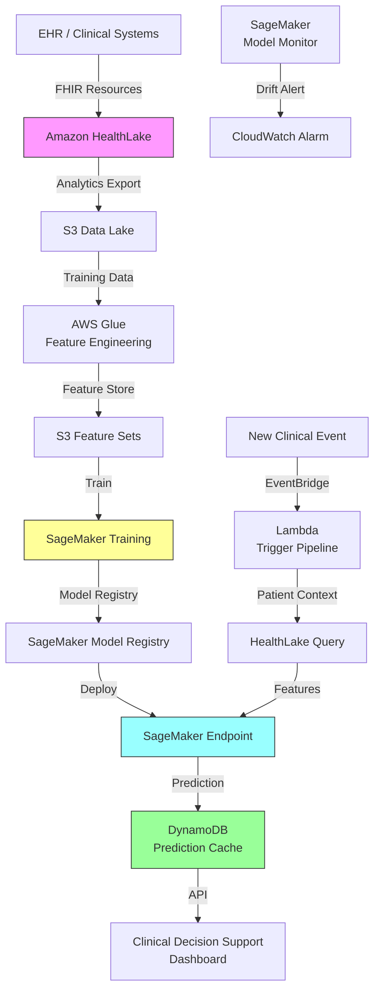

# Recipe 7.8: Disease Progression Modeling

**Complexity:** Complex · **Phase:** Mature · **Estimated Cost:** ~$0.02 per patient trajectory scored

---

## The Problem

A 54-year-old patient with Type 2 diabetes has an A1C of 7.8%, stage 2 chronic kidney disease, and mild peripheral neuropathy. Their nephrologist wants to know: how fast is this kidney disease likely to progress? Will this patient need dialysis in three years? Five years? Ten? Should we escalate treatment now, or is the current regimen holding the line?

Today, the answer is mostly clinical intuition informed by population-level statistics. "Patients with your profile typically progress at about X rate." But "typically" hides enormous variance. Some patients with identical lab values and diagnoses progress rapidly to end-stage disease. Others plateau for decades. The difference often comes down to factors that are measurable but not synthesized: medication adherence patterns, subtle lab trends, comorbidity interactions, genetic predispositions, lifestyle factors that never make it into a structured field.

Disease progression modeling is the attempt to move from population averages to individualized trajectories. Instead of telling a patient "people like you usually..." you tell them "based on your specific history and trends, here's what we expect for you, and here's how confident we are in that prediction."

This matters operationally at every level. For the patient, it informs treatment decisions and life planning. For the care team, it determines treatment intensity and monitoring frequency. For the health system, it drives resource planning: how many dialysis chairs will we need in 2028? How many joint replacements? How many patients will transition from manageable chronic disease to high-acuity, high-cost care?

The diseases where this is most impactful share a common pattern: they progress through defined stages, the progression rate varies dramatically between individuals, and earlier intervention at the right moment can meaningfully alter the trajectory. Chronic kidney disease (CKD stages 1-5), diabetic complications (retinopathy, nephropathy, neuropathy), heart failure (NYHA classes I-IV), COPD (GOLD stages 1-4), multiple sclerosis, Parkinson's disease, Alzheimer's disease. These are the conditions where knowing the trajectory changes what you do about it.

The challenge is that disease progression unfolds over years, not days. You're predicting a curve, not a point. And the curve bends in response to treatment, which means your model needs to account for interventions that haven't happened yet. This is genuinely one of the harder prediction problems in healthcare ML.

---

## The Technology: Modeling Trajectories Over Time

### What Makes This Different From Point-in-Time Prediction

Most healthcare prediction models answer a binary question at a single moment: "Will this patient be readmitted in 30 days?" "Will this patient no-show for their appointment?" Disease progression modeling is fundamentally different. You're predicting a continuous trajectory over an extended time horizon. The output isn't a single probability; it's a curve showing expected disease state over time, ideally with uncertainty bounds.

Think of it this way. A readmission model takes a snapshot of the patient at discharge and makes a yes/no prediction. A progression model takes the patient's entire longitudinal history (every lab value, every medication change, every clinical event over months or years) and projects that trajectory forward. The input is a time series. The output is a time series. The prediction horizon might be 1 year, 5 years, or 10 years.

This changes everything about how you build, validate, and deploy the model.

### The Core Modeling Approaches

**Joint longitudinal-survival models.** This is the classical statistical approach, and it remains the gold standard for clinical credibility. The idea: model the longitudinal biomarker trajectory (e.g., eGFR over time) and the time-to-event outcome (e.g., time to dialysis) simultaneously, allowing the biomarker trajectory to inform the event prediction. These models have strong theoretical foundations, produce interpretable parameters, and handle irregular observation times naturally. The downside: they make parametric assumptions about trajectory shapes (linear, quadratic) that may not hold for all patients, and they scale poorly to high-dimensional feature spaces.

**Hidden Markov models (HMMs) and multi-state models.** These treat disease progression as transitions between discrete states (CKD stage 1 to stage 2 to stage 3, etc.). The model estimates transition probabilities between states, conditioned on patient characteristics. This is intuitive for diseases with clinically defined stages. The limitation: forcing continuous progression into discrete buckets loses information, and the Markov assumption (future state depends only on current state, not history) is often violated in practice. A patient who progressed rapidly from stage 2 to stage 3 is probably at higher risk of continued rapid progression than one who's been stable at stage 3 for five years.

**Recurrent neural networks and temporal models.** LSTMs, GRUs, and transformer-based architectures can learn complex temporal patterns from sequential clinical data without making parametric assumptions about trajectory shapes. Feed them the sequence of labs, vitals, medications, and diagnoses over time, and they learn to predict future values. They handle irregular time intervals (a common challenge in clinical data, where patients aren't observed on a fixed schedule) and can capture non-linear interactions between features. The tradeoff: they require substantially more data, they're harder to interpret, and they can overfit to training data patterns that don't generalize.

**Gaussian process models.** These provide a principled way to model uncertainty in trajectory predictions. A Gaussian process defines a distribution over possible trajectory curves, giving you not just a point prediction but a full uncertainty envelope that widens as you project further into the future. This is particularly valuable for disease progression because the uncertainty is clinically meaningful: "we're fairly confident about the next 6 months, but the 5-year projection has wide bounds" is honest and actionable information. The limitation: computational cost scales cubically with the number of observations, making them impractical for very large datasets without approximation methods.

**Causal inference approaches.** Here's the fundamental challenge that separates disease progression from simpler prediction problems: treatment effects. A patient's trajectory is not just a function of their disease biology; it's a function of the treatments they receive. If you train a model on historical data where patients received treatment, the model learns the trajectory under treatment, not the natural disease course. To predict "what happens if we change the treatment plan," you need causal reasoning, not just pattern matching. Marginal structural models, g-computation, and targeted learning approaches attempt to estimate counterfactual trajectories: what would have happened under different treatment decisions. This is the frontier of the field and the hardest part to get right.

### The Feature Engineering Challenge

Disease progression models are hungry for longitudinal data. Not just the most recent lab value, but the trend. Not just the current medication list, but the history of medication changes and why they happened. The features that matter most:

**Biomarker trajectories.** The slope of eGFR over the last 12 months is more predictive than the current eGFR value alone. A patient with eGFR of 45 that's been stable for three years is in a very different situation than one with eGFR of 45 that was 60 six months ago. You need to compute trajectory features: slopes, acceleration (change in slope), variability, and time since last significant change.

**Treatment history.** Which medications has the patient been on, for how long, at what doses, and what happened to their biomarkers after each change? Treatment response patterns are highly informative. A patient who responded well to ACE inhibitors (slowed their eGFR decline) has a different prognosis than one who didn't respond.

**Comorbidity interactions.** Diseases don't progress in isolation. Diabetes accelerates CKD progression. Hypertension accelerates both. Heart failure and CKD create a vicious cycle. Your model needs to capture these interactions, either through explicit interaction features or through model architectures that learn them implicitly.

**Event sequences.** Hospitalizations, ED visits, specialist referrals, procedure codes. The pattern of healthcare utilization over time tells a story about disease trajectory that lab values alone miss. A patient who's been hospitalized twice in the last year for heart failure exacerbations is on a different trajectory than one with the same ejection fraction who's been stable.

**Missing data patterns.** This is subtle but important. In clinical data, missingness is informative. A patient who hasn't had a lab drawn in 18 months might be doing well (no clinical concern) or might be disengaged from care (which is itself a risk factor for progression). The pattern of observation frequency carries signal.

### Time Horizons and Uncertainty

One of the most important design decisions is the prediction horizon. Short-term predictions (6-12 months) are more accurate but less actionable for long-term planning. Long-term predictions (5-10 years) are more useful for resource planning and patient counseling but carry much wider uncertainty.

The honest answer is that you need both, and you need to communicate uncertainty clearly. A progression model should output:

1. **Expected trajectory:** The most likely path of the key biomarker(s) over time
2. **Confidence intervals:** How wide is the uncertainty at each time point? (It should widen as you project further out)
3. **Key inflection points:** When is the patient likely to cross clinically meaningful thresholds (e.g., eGFR < 30, A1C > 9)?
4. **Scenario projections:** What does the trajectory look like under different treatment assumptions?

Communicating this to clinicians is its own challenge. A probability distribution over future disease states is not something most clinicians are trained to interpret. You need to translate model output into clinically actionable language: "At current trajectory, 70% probability of reaching stage 4 CKD within 3 years. With intensified treatment, that drops to 35%."

### Validation: The Multi-Year Problem

Validating a disease progression model is fundamentally harder than validating a point-in-time prediction model. You can't just hold out 20% of your data and check accuracy. You need:

**Temporal validation.** Train on data from years 1-5, predict trajectories for year 6-8, and compare against what actually happened. This requires years of follow-up data, which means your validation is always looking backward.

**Calibration at multiple time horizons.** Is the model well-calibrated at 1 year? At 3 years? At 5 years? Calibration often degrades at longer horizons.

**Subgroup performance.** Does the model work equally well for patients at different disease stages? For different demographic groups? For patients on different treatment regimens?

**Dynamic updating.** As new data arrives for a patient, does the model appropriately update its predictions? A model that doesn't incorporate new information is useless in practice.

### The General Architecture Pattern

```
[Longitudinal Data Assembly] → [Feature Engineering] → [Model Training/Selection]
         ↓
[New Patient Data] → [Trajectory Prediction] → [Uncertainty Quantification]
         ↓
[Clinical Decision Support] → [Monitoring & Recalibration]
```

**Longitudinal data assembly.** Pull together the full clinical history for each patient: labs, vitals, medications, diagnoses, procedures, encounters. Align everything on a common timeline. Handle irregular observation intervals. This is the hardest engineering step and often takes longer than the modeling itself.

**Feature engineering.** Compute trajectory features (slopes, variability, acceleration), treatment response features, comorbidity interaction features, and utilization pattern features. Handle missing data explicitly (imputation or missingness indicators).

**Model training.** Train on historical cohorts with known outcomes. Use temporal cross-validation (train on earlier data, validate on later data). Compare multiple model families. Optimize for calibration, not just discrimination.

**Trajectory prediction.** For a new patient, assemble their longitudinal history, compute features, and generate a predicted trajectory with uncertainty bounds. Update predictions as new data arrives.

**Clinical decision support.** Translate model output into actionable clinical information: risk of reaching specific disease milestones, recommended monitoring frequency, treatment intensification triggers.

**Monitoring and recalibration.** Track model performance over time. Recalibrate as treatment patterns change (new drugs, new guidelines). Detect concept drift (the relationship between features and outcomes shifting over time).

---

## The AWS Implementation

### Why These Services

**Amazon SageMaker for model training and hosting.** Disease progression models require iterative experimentation across multiple model families (survival models, gradient boosting, neural networks). SageMaker provides managed training infrastructure with built-in hyperparameter tuning, experiment tracking, and model registry. For serving, SageMaker endpoints handle the inference workload with auto-scaling. The key advantage here is SageMaker's support for custom containers, which you'll need because disease progression models often use specialized libraries (lifelines, pymc, deepsurvival) that aren't in the built-in algorithm set.

**Amazon HealthLake for longitudinal clinical data.** HealthLake is a FHIR-native data store designed for exactly this use case: assembling longitudinal patient records from multiple sources into a queryable, analytics-ready format. It handles the FHIR resource relationships (Patient, Observation, Condition, MedicationRequest, Encounter) that map directly to the features you need. The integrated analytics export to S3 gives you a clean path from clinical data to training datasets.

**AWS Glue for feature engineering pipelines.** The longitudinal feature engineering (computing slopes, variability, treatment response metrics) is a batch ETL workload that runs on large patient cohorts. Glue's Spark-based processing handles the joins and window functions needed to compute temporal features across millions of patient-time-point combinations.

**Amazon S3 for data lake and model artifacts.** Training datasets, model artifacts, prediction outputs, and audit logs all live in S3. The lifecycle policies handle the retention requirements (clinical data often has 7-10 year retention mandates), and the versioning supports model reproducibility.

**Amazon DynamoDB for real-time prediction cache.** When a clinician pulls up a patient's chart, you need the current progression prediction available in milliseconds, not minutes. DynamoDB stores the most recent prediction for each patient, updated on a schedule or triggered by new clinical data.

**Amazon EventBridge for orchestration.** New lab results, medication changes, and clinical events trigger prediction updates. EventBridge routes these events to the appropriate processing pipeline without tight coupling between the data sources and the prediction system.

### Architecture Diagram



### Prerequisites

| Requirement | Details |
|-------------|---------|
| **AWS Services** | Amazon SageMaker, Amazon HealthLake, AWS Glue, Amazon S3, Amazon DynamoDB, Amazon EventBridge, AWS Lambda |
| **IAM Permissions** | `sagemaker:*` (scoped to project), `healthlake:*`, `glue:*`, `s3:GetObject/PutObject`, `dynamodb:PutItem/GetItem`, `events:PutEvents` |
| **BAA** | Required. All services processing PHI must be covered under AWS BAA. |
| **Encryption** | S3: SSE-KMS; DynamoDB: encryption at rest; HealthLake: KMS encryption; SageMaker: KMS for training volumes and endpoints; all transit over TLS |
| **VPC** | Production: SageMaker training and endpoints in VPC with VPC endpoints for S3, DynamoDB, HealthLake. No public internet access for PHI processing. |
| **CloudTrail** | Enabled for all API calls. HealthLake access logging for HIPAA audit trail. |
| **Data Requirements** | Minimum 3-5 years of longitudinal clinical data per patient. Cohort of 10,000+ patients with the target condition and known outcomes. |
| **Sample Data** | Synthea synthetic patient generator for development. MIMIC-IV for validation benchmarking. Never use real PHI in dev/test. |
| **Cost Estimate** | SageMaker training: ~$50-200 per training run (depends on instance type and duration). Endpoint: ~$0.10/hour for ml.m5.large. HealthLake: $0.60/10K FHIR operations. Glue: ~$0.44/DPU-hour. |

### Ingredients

| AWS Service | Role |
|------------|------|
| **Amazon HealthLake** | FHIR-native longitudinal clinical data store; source of truth for patient histories |
| **AWS Glue** | Batch feature engineering: computes trajectory slopes, treatment response metrics, comorbidity interactions |
| **Amazon SageMaker** | Model training, hyperparameter tuning, model registry, real-time inference endpoint, model monitoring |
| **Amazon S3** | Data lake for training datasets, feature sets, model artifacts, prediction audit logs |
| **Amazon DynamoDB** | Low-latency cache for current patient predictions; serves clinical decision support UI |
| **Amazon EventBridge** | Event-driven orchestration: triggers prediction updates on new clinical data |
| **AWS Lambda** | Lightweight orchestration: assembles patient context, invokes prediction endpoint |
| **Amazon CloudWatch** | Metrics, alarms, dashboards for model performance and pipeline health |
| **AWS KMS** | Encryption key management for all PHI-containing services |

### Code

#### Walkthrough

**Step 1: Longitudinal data assembly.** The foundation of disease progression modeling is a complete, time-ordered clinical history for each patient. This step queries the FHIR data store to assemble every relevant observation (lab results, vitals), condition (diagnoses), medication request, and encounter into a unified patient timeline. The key challenge is aligning data from different sources onto a common time axis and handling the irregular intervals between observations (patients aren't measured on a fixed schedule). Without this step, you have scattered clinical fragments; with it, you have a coherent longitudinal record that reveals trajectory patterns. Skip this and your model has no temporal context to learn from.

```
FUNCTION assemble_patient_timeline(patient_id, condition_code, lookback_years):
    // Query the FHIR data store for all relevant clinical data for this patient.
    // We need labs, vitals, medications, diagnoses, and encounters over the full history.

    // Get all observations (labs, vitals) for this patient, ordered by date.
    // These are the biomarkers whose trajectories we're modeling.
    observations = query FHIR store:
        resource_type = "Observation"
        patient       = patient_id
        date          >= (today - lookback_years)
        sort          = date ascending

    // Get the medication history: what was prescribed, when, at what dose.
    // Treatment changes are critical features for progression modeling.
    medications = query FHIR store:
        resource_type = "MedicationRequest"
        patient       = patient_id
        date          >= (today - lookback_years)
        sort          = date ascending

    // Get all active and historical conditions (diagnoses).
    // Comorbidities influence progression rates.
    conditions = query FHIR store:
        resource_type = "Condition"
        patient       = patient_id

    // Get encounter history: hospitalizations, ED visits, specialist visits.
    // Utilization patterns carry signal about disease trajectory.
    encounters = query FHIR store:
        resource_type = "Encounter"
        patient       = patient_id
        date          >= (today - lookback_years)
        sort          = date ascending

    // Assemble into a unified timeline: one record per observation date,
    // with all concurrent data points aligned.
    timeline = merge_on_timeline(observations, medications, conditions, encounters)

    RETURN timeline
```

**Step 2: Trajectory feature engineering.** Raw clinical values are necessary but not sufficient. The slope of a biomarker over time is often more predictive than its current value. This step computes temporal features that capture the dynamics of disease progression: how fast is eGFR declining? Is the decline accelerating? How variable are the readings? How did the biomarker respond to the last medication change? These derived features transform a sequence of point measurements into a rich description of the patient's trajectory. Without this step, the model sees only snapshots and misses the motion between them.

```
FUNCTION compute_trajectory_features(timeline, biomarker_code):
    // Extract the time series for the target biomarker (e.g., eGFR, A1C).
    // Each entry is a (date, value) pair.
    series = extract_biomarker_series(timeline, biomarker_code)

    // Compute the slope (rate of change) over different windows.
    // Short-term slope captures recent acceleration or deceleration.
    // Long-term slope captures the overall disease trajectory.
    slope_6mo  = linear_regression_slope(series, window = 6 months)
    slope_12mo = linear_regression_slope(series, window = 12 months)
    slope_all  = linear_regression_slope(series, window = all available)

    // Compute acceleration: is the decline speeding up or slowing down?
    // Positive acceleration on a declining biomarker means things are getting worse faster.
    acceleration = slope_6mo - slope_12mo

    // Compute variability: how much does the biomarker bounce around?
    // High variability often indicates unstable disease or measurement noise.
    variability = coefficient_of_variation(series, window = 12 months)

    // Compute treatment response: how did the biomarker change after
    // the most recent medication change?
    last_med_change = find_most_recent_medication_change(timeline, relevant_drug_classes)
    IF last_med_change exists:
        pre_slope  = slope before last_med_change (3 months prior)
        post_slope = slope after last_med_change (3 months after)
        treatment_response = post_slope - pre_slope
    ELSE:
        treatment_response = null  // no medication change to evaluate

    // Time since last observation: longer gaps may indicate disengagement from care.
    days_since_last_obs = days between most recent observation and today

    RETURN {
        current_value:      most recent value in series,
        slope_6mo:          slope_6mo,
        slope_12mo:         slope_12mo,
        slope_all:          slope_all,
        acceleration:       acceleration,
        variability:        variability,
        treatment_response: treatment_response,
        days_since_last:    days_since_last_obs,
        observation_count:  number of observations in series,
        time_span_years:    years between first and last observation
    }
```

**Step 3: Multi-state transition modeling.** This is the core prediction step. Given the patient's current state and trajectory features, estimate the probability of transitioning to each possible future state over multiple time horizons. For CKD, the states might be stages 1-5 plus dialysis and transplant. For heart failure, NYHA classes I-IV plus hospitalization and death. The model learns transition probabilities from historical cohorts and adjusts them based on individual patient features. The output is not a single prediction but a probability distribution over future states at each time point. Skip this step and you have features without predictions.

```
FUNCTION predict_progression(patient_features, current_stage, model):
    // Generate predictions at multiple time horizons.
    // Each prediction is a probability distribution over possible future states.
    horizons = [6 months, 12 months, 24 months, 36 months, 60 months]

    predictions = empty map

    FOR each horizon in horizons:
        // The model takes patient features and current stage as input,
        // and outputs probability of being in each possible state at the given horizon.
        state_probabilities = model.predict(
            features      = patient_features,
            current_state = current_stage,
            time_horizon  = horizon
        )

        // Also compute the probability of crossing key clinical thresholds.
        // These are the actionable inflection points clinicians care about.
        threshold_probs = compute_threshold_probabilities(
            state_probabilities,
            thresholds = disease-specific thresholds  // e.g., eGFR < 30, eGFR < 15
        )

        predictions[horizon] = {
            state_distribution: state_probabilities,
            threshold_risks:    threshold_probs,
            confidence_width:   compute_prediction_interval_width(state_probabilities)
        }

    // Compute the expected trajectory: the most likely path through states over time.
    expected_trajectory = interpolate_most_likely_path(predictions)

    // Compute scenario projections: what happens under different treatment assumptions?
    scenarios = {
        "current_treatment": expected_trajectory,
        "intensified":       model.predict_scenario(patient_features, treatment = "intensified"),
        "no_change":         model.predict_scenario(patient_features, treatment = "maintain")
    }

    RETURN {
        predictions:          predictions,
        expected_trajectory:  expected_trajectory,
        scenarios:            scenarios,
        model_version:        model.version,
        prediction_timestamp: current UTC timestamp
    }
```

**Step 4: Uncertainty quantification.** A progression prediction without uncertainty bounds is dangerous. Clinicians need to know how confident the model is, and confidence should decrease as the prediction horizon extends. This step computes calibrated confidence intervals using the model's internal uncertainty estimates (for Bayesian models) or bootstrap resampling (for frequentist models). It also identifies factors that increase uncertainty for this specific patient: sparse observation history, unusual feature combinations, or being in a region of feature space with few training examples. Without this step, predictions look more certain than they are, which can lead to overconfident clinical decisions.

```
FUNCTION quantify_uncertainty(patient_features, predictions, model, training_data_stats):
    // Compute prediction intervals at each time horizon.
    // These should widen as the horizon extends (we're less certain about the distant future).
    intervals = empty map

    FOR each horizon, prediction in predictions:
        // Method depends on model type:
        // - Bayesian models: use posterior predictive distribution directly
        // - Ensemble models: use prediction variance across ensemble members
        // - Single models: use bootstrap or conformal prediction intervals
        interval = model.prediction_interval(
            features  = patient_features,
            horizon   = horizon,
            level     = 0.80  // 80% prediction interval (not 95%; too wide to be useful clinically)
        )

        intervals[horizon] = {
            lower_bound: interval.lower,
            upper_bound: interval.upper,
            width:       interval.upper - interval.lower
        }

    // Identify sources of elevated uncertainty for this patient.
    uncertainty_flags = []

    // Sparse data: fewer observations means less reliable trajectory estimation.
    IF patient_features.observation_count < 5:
        append "Limited observation history (< 5 data points)" to uncertainty_flags

    // Novelty detection: is this patient unlike the training population?
    novelty_score = compute_distance_to_training_distribution(patient_features, training_data_stats)
    IF novelty_score > threshold:
        append "Patient profile is unusual relative to training population" to uncertainty_flags

    // Recent trajectory instability: high variability means less predictable future.
    IF patient_features.variability > high_variability_threshold:
        append "High recent biomarker variability" to uncertainty_flags

    RETURN {
        prediction_intervals: intervals,
        uncertainty_flags:    uncertainty_flags,
        overall_confidence:   "high" if no flags, "moderate" if 1 flag, "low" if 2+ flags
    }
```

**Step 5: Store and serve predictions.** The final step persists the prediction results for clinical consumption and audit purposes. Each prediction is stored with full provenance: which model version generated it, what data was available at prediction time, and what the uncertainty bounds were. This enables both real-time clinical decision support (a clinician viewing the patient's chart sees the current progression forecast) and retrospective analysis (did our predictions match reality? where did we miss?). The prediction cache is updated whenever significant new clinical data arrives, ensuring clinicians always see the most current forecast.

```
FUNCTION store_prediction(patient_id, prediction_result, uncertainty):
    // Write the full prediction to the cache for real-time clinical access.
    write to prediction cache:
        patient_id          = patient_id
        prediction_date     = current UTC timestamp
        current_stage       = prediction_result.current_stage
        expected_trajectory = prediction_result.expected_trajectory
        scenarios           = prediction_result.scenarios
        uncertainty         = uncertainty
        model_version       = prediction_result.model_version
        // TTL: predictions expire after 90 days if not refreshed.
        // Stale predictions are worse than no prediction.
        ttl                 = 90 days from now

    // Also write to the audit log (S3) for compliance and model evaluation.
    write to audit log (S3):
        patient_id          = patient_id
        prediction_date     = current UTC timestamp
        full_prediction     = prediction_result
        features_used       = summary of input features (not raw PHI values)
        model_version       = prediction_result.model_version

    // If the prediction crosses a clinical alert threshold, emit an event.
    IF any threshold_risk > alert_threshold:
        emit event:
            type       = "progression_alert"
            patient_id = patient_id
            detail     = which thresholds were crossed and at what probability
```

> **Curious how this looks in Python?** The pseudocode above covers the concepts. If you'd like to see sample Python code that demonstrates these patterns using boto3, check out the [Python Example](chapter07.08-python-example). It walks through each step with inline comments and notes on what you'd need to change for a real deployment.

### Expected Results

**Sample output for a CKD progression prediction:**

```json
{
  "patient_id": "patient-00482",
  "prediction_date": "2026-05-31T10:15:22Z",
  "current_stage": "CKD Stage 3a",
  "current_egfr": 52.3,
  "expected_trajectory": {
    "6_months": { "expected_egfr": 50.1, "stage": "3a", "confidence": "high" },
    "12_months": { "expected_egfr": 47.8, "stage": "3a", "confidence": "high" },
    "24_months": { "expected_egfr": 43.2, "stage": "3b", "confidence": "moderate" },
    "36_months": { "expected_egfr": 38.9, "stage": "3b", "confidence": "moderate" },
    "60_months": { "expected_egfr": 31.4, "stage": "3b", "confidence": "low" }
  },
  "threshold_risks": {
    "egfr_below_30_within_3yr": 0.22,
    "egfr_below_15_within_5yr": 0.08,
    "dialysis_within_5yr": 0.05
  },
  "scenarios": {
    "current_treatment": { "egfr_at_3yr": 38.9 },
    "intensified_treatment": { "egfr_at_3yr": 42.1 },
    "no_treatment_change": { "egfr_at_3yr": 36.2 }
  },
  "uncertainty": {
    "prediction_intervals": {
      "12_months": { "lower": 44.2, "upper": 51.4 },
      "36_months": { "lower": 32.1, "upper": 45.7 },
      "60_months": { "lower": 22.8, "upper": 40.0 }
    },
    "flags": [],
    "overall_confidence": "high"
  },
  "model_version": "ckd-progression-v2.3.1"
}
```

**Performance benchmarks:**

| Metric | Typical Value |
|--------|---------------|
| C-statistic (1-year stage transition) | 0.72-0.80 |
| C-statistic (3-year stage transition) | 0.65-0.74 |
| Calibration error (1-year) | < 5% absolute |
| Calibration error (3-year) | < 10% absolute |
| Inference latency | 200-500ms per patient |
| Feature engineering (batch) | ~2 hours for 100K patients |
| Model training | 4-8 hours on ml.m5.4xlarge |
| Cost per prediction | ~$0.02 (endpoint + DynamoDB + Lambda) |

**Where it struggles:**

- Patients with very sparse observation histories (fewer than 5 data points over 2+ years)
- Rapid, unexpected disease acceleration triggered by new comorbidities not in the training data
- Patients on novel therapies not represented in historical training data (the model can't predict response to drugs it hasn't seen)
- Very long prediction horizons (5+ years) where uncertainty dominates the signal
- Patients at the boundaries between disease stages where small measurement variations cause stage oscillation

---

## The Honest Take

Disease progression modeling is one of those problems where the concept is elegant and the reality is humbling. The idea of giving every patient a personalized trajectory forecast sounds transformative. And it can be. But the gap between a research paper and a deployed clinical tool is wider here than in almost any other healthcare ML application.

The first thing that will surprise you: data assembly takes 60-70% of the project timeline. Not modeling. Not deployment. Just getting the longitudinal data into a usable format. Clinical data is scattered across systems, coded inconsistently, and full of gaps. A patient who transferred from another health system has a trajectory that starts mid-stream. A patient who was lost to follow-up for two years has a gap you can't fill. These aren't edge cases; they're the majority of your cohort.

The second surprise: treatment effects are the elephant in the room. Your model learns trajectories from patients who were treated. If you deploy it to guide treatment decisions, you're using observational data to make causal claims. "Intensified treatment would slow progression by X" is a causal statement that requires causal methodology, not just a predictive model trained on historical data. Most deployed systems punt on this and just predict "trajectory under current treatment patterns," which is useful but less powerful than true counterfactual prediction.

The third surprise: clinician adoption is harder than model building. A nephrologist who has been managing CKD patients for 20 years has strong priors about disease trajectories. If your model disagrees with their clinical intuition, they'll ignore it. If it agrees, they'll say "I already knew that." The value proposition has to be in the cases where the model sees something the clinician doesn't: the patient whose trajectory is subtly accelerating in a way that's hard to spot from individual lab values, or the patient who looks high-risk on paper but whose trajectory is actually stable.

The calibration problem is real and ongoing. Disease management changes over time. New drugs enter the market (SGLT2 inhibitors dramatically changed CKD progression rates). Guidelines change. Patient populations shift. A model trained on 2018-2022 data may not be well-calibrated for 2026 patients on newer therapies. You need continuous monitoring and periodic retraining, not a one-time model deployment.

One thing I'd do differently: start with a simpler model (LACE-style point scoring or basic survival analysis) and prove the clinical workflow before investing in complex ML. The hardest part isn't the model; it's integrating predictions into clinical decision-making in a way that actually changes behavior. Get that right with a simple model first, then upgrade the model later.

---

## Variations and Extensions

**Multi-disease joint progression.** Many patients have multiple progressing conditions simultaneously (diabetes + CKD + heart failure). Model the joint progression of multiple diseases, capturing the interactions between them. A patient whose diabetes is poorly controlled will progress faster on CKD; modeling this jointly gives more accurate predictions than modeling each disease independently. This requires multi-task learning architectures or coupled differential equation models.

**Digital twin approach.** Create a computational "twin" of each patient that simulates their physiology and can be used to test treatment scenarios in silico. Feed the twin the patient's actual data to calibrate it, then run forward simulations under different treatment assumptions. This is the most ambitious version of progression modeling and requires deep domain expertise in disease physiology, but it produces the most interpretable and actionable predictions.

**Population-level resource forecasting.** Aggregate individual progression predictions to forecast future demand for expensive resources: dialysis capacity, transplant waitlist growth, specialist appointment volume, medication costs. This transforms a clinical tool into a strategic planning tool. The key insight is that individual predictions have wide uncertainty, but population-level aggregates are much more stable (individual errors cancel out).

---

## Related Recipes

- **Recipe 7.5 (30-Day Readmission Risk):** Shares feature engineering patterns for longitudinal clinical data, but operates on a much shorter time horizon
- **Recipe 7.6 (Rising Risk Identification):** Complementary approach that identifies patients whose risk trajectory is accelerating, which is one signal that feeds into progression modeling
- **Recipe 12.8 (Disease Progression Trajectory Modeling):** Time-series focused approach to the same problem domain; this recipe emphasizes the predictive analytics and clinical decision support angle while 12.8 focuses on temporal modeling techniques
- **Recipe 6.4 (Disease Severity Stratification):** Provides the baseline severity classification that progression models build upon
- **Recipe 4.8 (Treatment Response Prediction):** Addresses the treatment effect estimation challenge that is central to scenario-based progression forecasting

---

## Additional Resources

**AWS Documentation:**
- [Amazon SageMaker Developer Guide](https://docs.aws.amazon.com/sagemaker/latest/dg/whatis.html)
- [Amazon HealthLake Developer Guide](https://docs.aws.amazon.com/healthlake/latest/devguide/what-is-amazon-health-lake.html)
- [Amazon HealthLake Analytics](https://docs.aws.amazon.com/healthlake/latest/devguide/analytics.html)
- [SageMaker Model Monitor](https://docs.aws.amazon.com/sagemaker/latest/dg/model-monitor.html)
- [AWS Glue Developer Guide](https://docs.aws.amazon.com/glue/latest/dg/what-is-glue.html)
- [AWS HIPAA Eligible Services](https://aws.amazon.com/compliance/hipaa-eligible-services-reference/)
- [Architecting for HIPAA on AWS](https://docs.aws.amazon.com/whitepapers/latest/architecting-hipaa-security-and-compliance-on-aws/welcome.html)

**AWS Sample Repos:**
- [`amazon-healthlake-dicom-extension`](https://github.com/aws-samples/amazon-healthlake-dicom-extension): Demonstrates HealthLake integration patterns for clinical data workflows
- [`amazon-sagemaker-examples`](https://github.com/aws/amazon-sagemaker-examples): Comprehensive SageMaker examples including time series and survival analysis patterns

**Clinical References:**
- TODO: Verify and add link to KDIGO CKD progression guidelines
- TODO: Verify and add link to published CKD progression model validation studies (e.g., Tangri et al. kidney failure risk equation)

---

## Estimated Implementation Time

| Phase | Duration |
|-------|----------|
| **Basic** (single disease, simple survival model, batch predictions) | 12-16 weeks |
| **Production-ready** (multi-feature model, real-time predictions, clinical integration, monitoring) | 6-9 months |
| **With variations** (multi-disease, scenario modeling, population forecasting) | 12-18 months |

---

**Tags:** `predictive-analytics` `disease-progression` `longitudinal-modeling` `chronic-disease` `ckd` `survival-analysis` `sagemaker` `healthlake` `clinical-decision-support` `time-series`

---

*[← Previous: 7.7 Length of Stay Prediction](chapter07.07-length-of-stay-prediction) · [Chapter 7 Index](chapter07-index) · [Next: 7.9 Mortality Risk Scoring (ICU) →](chapter07.09-mortality-risk-scoring-icu)*
