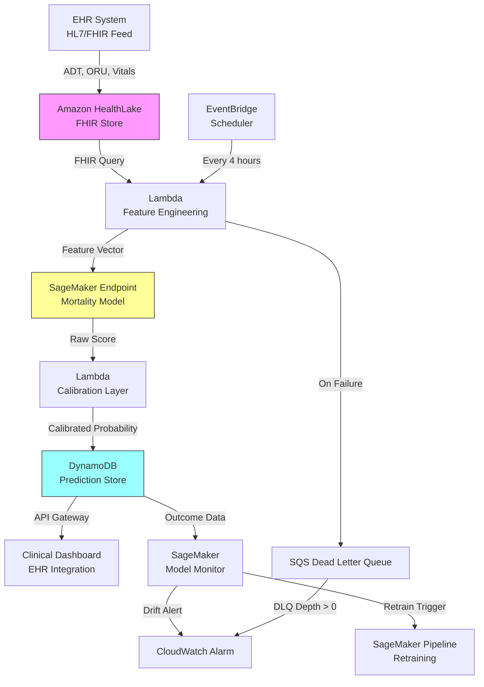

# Recipe 7.9 Architecture and Implementation: Mortality Risk Scoring (ICU)

*Companion to [Recipe 7.9: Mortality Risk Scoring (ICU)](chapter07.09-mortality-risk-scoring-icu). This page covers the AWS architecture, services, prerequisites, and pseudocode. For the problem framing and the conceptual approach, start with the main recipe.*

---

## The AWS Implementation

### Why These Services

**Amazon SageMaker for model training and hosting.** SageMaker provides the full ML lifecycle: training on historical ICU data, hyperparameter tuning, model registry for versioning, and real-time inference endpoints. For a model that needs to serve predictions in under a second and be retrained monthly, SageMaker's managed infrastructure eliminates the operational burden of maintaining GPU instances and model serving code. The built-in model monitoring detects data drift and prediction drift automatically.

**Amazon HealthLake for FHIR-based clinical data.** HealthLake is a HIPAA-eligible, FHIR-native data store that can ingest clinical data from EHR systems. It handles the messy reality of healthcare data: different coding systems, varying data formats, and the need for a longitudinal patient view. For mortality prediction, you need a patient's full ICU trajectory in one queryable place.

**AWS Lambda for feature engineering orchestration.** The feature engineering pipeline (temporal aggregations, derived features, missing value imputation) runs on each prediction request or on a schedule. Lambda handles the stateless, event-driven nature of this work: a new lab result arrives, trigger a feature refresh, score the patient. For patients with ICU stays exceeding 7-10 days, the volume of vital sign data may approach Lambda's 15-minute timeout. In those cases, pre-aggregate vital signs into hourly summaries in a separate pipeline (AWS Glue or SageMaker Processing), or allocate maximum Lambda memory (10 GB) to maximize compute throughput. Include a timeout fallback that serves the most recent successful prediction rather than failing silently.

<!-- TODO (TechWriter): Expert review A-1 (HIGH). Consider adding a dedicated paragraph or callout box about the Lambda timeout edge case for long-stay patients, with concrete guidance on the pre-aggregation pipeline pattern. -->

**Amazon DynamoDB for prediction storage and serving.** Predictions need to be stored durably (for audit and outcome tracking) and served with low latency to clinical displays. DynamoDB's single-digit-millisecond reads and write-once-read-many access pattern fit perfectly.

**Amazon EventBridge for orchestration.** The pipeline has multiple triggers: new data arrives, scheduled rescoring, model retraining events, drift alerts. EventBridge provides the event routing without custom integration code. In production, supplement the 4-hour schedule with event-triggered rescoring for high-acuity changes (new vasopressor started, intubation, cardiac arrest code). EventBridge rules can match specific HL7 ADT event types to trigger immediate rescoring. See Variations for implementation details.

**Amazon CloudWatch for model monitoring.** Custom metrics for prediction distribution, calibration drift, and feature drift. Alarms when the model's behavior changes in ways that suggest degradation.

**Note on the calibration step:** The architecture diagram shows calibration as a separate Lambda for conceptual clarity. In production, combine feature engineering, SageMaker invocation, and calibration into a single Lambda function to reduce latency and eliminate partial-failure states. The calibration parameters (loaded from DynamoDB) can be cached in Lambda memory across invocations since they change only monthly.

### Architecture Diagram



### Prerequisites

| Requirement | Details |
|-------------|---------|
| **AWS Services** | Amazon SageMaker, Amazon HealthLake, AWS Lambda, Amazon DynamoDB, Amazon EventBridge, Amazon API Gateway, Amazon CloudWatch, AWS KMS, Amazon SQS (DLQ) |
| **IAM Permissions** | `sagemaker:InvokeEndpoint` (scoped to `arn:aws:sagemaker:*:*:endpoint/icu-mortality-*`), `healthlake:SearchWithGet` and `healthlake:ReadResource` (scoped to specific data store ARN), `dynamodb:PutItem` and `dynamodb:GetItem` (scoped to `arn:aws:dynamodb:*:*:table/icu-mortality-*`), `lambda:InvokeFunction`, `events:PutEvents`, `cloudwatch:PutMetricData`. Scope all permissions to specific resource ARNs in production. |
| **BAA** | AWS BAA signed (required: ICU clinical data is PHI). Verify all services against the [AWS HIPAA Eligible Services list](https://aws.amazon.com/compliance/hipaa-eligible-services-reference/) before processing PHI. |
| **Encryption** | HealthLake: encrypted at rest (default); DynamoDB: SSE-KMS; SageMaker: KMS for model artifacts and endpoint data; S3 training data: SSE-KMS; all API calls over TLS |
| **VPC** | Production: SageMaker endpoint in VPC, Lambda in VPC with VPC endpoints for: SageMaker Runtime (Interface), HealthLake (Interface), DynamoDB (Gateway), CloudWatch Logs (Interface), STS (Interface), KMS (Interface). Add S3 (Gateway) if calibration parameters are loaded from S3. STS endpoint is required for Lambda execution role assumption. Security groups: Lambda SG allows outbound 443 to SageMaker endpoint SG and VPC endpoint SGs only. SageMaker endpoint SG allows inbound 443 from Lambda SG only. No internet egress from the inference path. |
| **API Gateway** | Configure as a Private API (accessible only within the VPC) or as a Regional API with mutual TLS and IAM authorization. The clinical dashboard connects via the hospital's VPN or AWS Direct Connect. Do not expose mortality predictions via a public API endpoint. The API layer must verify that the requesting clinician has an active care relationship with the patient before returning prediction data. |
| **CloudTrail** | Enabled: log all SageMaker inference calls, HealthLake queries, and DynamoDB writes for HIPAA audit trail |
| **Error Handling** | Configure an SQS dead letter queue on the Lambda function. Failed prediction attempts route to the DLQ for retry and alerting. Add a CloudWatch alarm on DLQ message count > 0. The clinical dashboard should display the prediction timestamp prominently so clinicians can identify stale predictions. Consider a "prediction freshness" indicator that turns yellow after 6 hours and red after 8 hours without a successful update. |
| **Training Data** | Historical ICU admissions with outcomes. Minimum 5,000-10,000 admissions for reasonable model performance. MIMIC-IV (publicly available, de-identified) for development; local EHR data for production calibration. |
| **Cost Estimate** | SageMaker real-time endpoint (ml.m5.large): ~$0.134/hour (~$97/month). Per-prediction cost negligible. HealthLake: $0.60/10K FHIR reads. DynamoDB: on-demand pricing, negligible at ICU volumes. |

### Ingredients

| AWS Service | Role |
|------------|------|
| **Amazon SageMaker** | Model training, hosting, monitoring, and retraining pipeline |
| **Amazon HealthLake** | FHIR-native clinical data store for longitudinal patient data |
| **AWS Lambda** | Feature engineering, model invocation, and calibration (combined in production) |
| **Amazon DynamoDB** | Prediction storage, outcome tracking, audit trail |
| **Amazon SQS** | Dead letter queue for failed prediction attempts |
| **Amazon EventBridge** | Scheduled rescoring and event-driven orchestration |
| **Amazon API Gateway** | Private REST API for clinical dashboard integration |
| **Amazon CloudWatch** | Model performance metrics, drift detection alarms |
| **AWS KMS** | Encryption key management for all data at rest |

### Code

> **Reference implementations:** The following resources demonstrate patterns used in this recipe:
>
> - [MIMIC-IV Clinical Database](https://physionet.org/content/mimiciv/): De-identified ICU data for model development and benchmarking
> - [Amazon SageMaker Examples](https://github.com/aws/amazon-sagemaker-examples): General SageMaker training and deployment patterns
> - [Amazon HealthLake Documentation](https://docs.aws.amazon.com/healthlake/): FHIR data store integration patterns

#### Walkthrough

**Step 1: Extract clinical features from FHIR store.** When a prediction is triggered (either by new data arriving or by the scheduled 4-hour refresh), the system queries HealthLake for the patient's current ICU data. This includes vital signs, laboratory results, medications, and clinical assessments from the current admission. The query window matters: we want the full ICU trajectory, not just the most recent values, because temporal patterns (is the patient getting better or worse?) are among the strongest predictors. Skip this step or use stale data, and the prediction reflects yesterday's patient, not today's.

```
FUNCTION extract_icu_features(patient_id, admission_id):
    // Query the FHIR store for all relevant observations during this ICU stay.
    // We need vital signs, labs, medications, and assessments.
    // The time window is from ICU admission to now.
    
    admission = query HealthLake for Encounter where:
        patient = patient_id
        id = admission_id
    
    icu_start = admission.period.start
    now = current UTC timestamp
    
    // Vital signs: heart rate, blood pressure, respiratory rate, SpO2, temperature
    vitals = query HealthLake for Observation where:
        patient = patient_id
        category = "vital-signs"
        date >= icu_start
        date <= now
    
    // Laboratory results: metabolic panel, CBC, ABG, lactate, coagulation
    labs = query HealthLake for Observation where:
        patient = patient_id
        category = "laboratory"
        date >= icu_start
        date <= now
    
    // Active medications: vasopressors, sedatives, antibiotics
    medications = query HealthLake for MedicationAdministration where:
        patient = patient_id
        effective-time >= icu_start
    
    // Patient demographics and comorbidities
    patient_info = query HealthLake for Patient where id = patient_id
    conditions = query HealthLake for Condition where:
        patient = patient_id
        clinical-status = "active"
    
    RETURN {
        vitals: vitals,
        labs: labs,
        medications: medications,
        patient_info: patient_info,
        conditions: conditions,
        icu_start: icu_start,
        hours_since_admission: (now - icu_start) in hours
    }
```

**Step 2: Engineer temporal features.** Raw clinical data isn't model-ready. A heart rate of 110 means something different if it's been 110 for three days (chronic tachycardia, possibly compensated) versus if it jumped from 70 to 110 in the last hour (acute decompensation). This step transforms raw time-series data into features that capture both current state and trajectory. The feature set includes: worst/best values in multiple time windows, trends (slope over last 6/12/24 hours), variability (coefficient of variation), and derived physiological indices. Missing values are handled explicitly: a missing lactate is informative (either the clinician didn't think it was needed, or the result isn't back yet), not just a gap to fill.

```
FUNCTION engineer_features(raw_data):
    features = empty map
    
    // Time windows for aggregation: last 6 hours, 12 hours, 24 hours, full stay
    windows = [6, 12, 24, "full_stay"]
    
    // For each vital sign, compute summary statistics per window
    FOR each vital_type in ["heart_rate", "sbp", "dbp", "map", "resp_rate", "spo2", "temp"]:
        values = filter raw_data.vitals where code matches vital_type
        
        FOR each window in windows:
            windowed = filter values to last {window} hours
            
            features["{vital_type}_min_{window}h"] = minimum of windowed values
            features["{vital_type}_max_{window}h"] = maximum of windowed values
            features["{vital_type}_mean_{window}h"] = mean of windowed values
            features["{vital_type}_std_{window}h"] = standard deviation of windowed values
            features["{vital_type}_trend_{window}h"] = linear slope of windowed values
            features["{vital_type}_count_{window}h"] = count of observations
                // count matters: more frequent monitoring = sicker patient
    
    // Laboratory features: most recent value, worst in stay, trend
    FOR each lab_type in ["lactate", "creatinine", "bilirubin", "platelets", 
                          "wbc", "hemoglobin", "pao2", "paco2", "ph", "bicarbonate",
                          "sodium", "potassium", "glucose", "inr", "bun"]:
        values = filter raw_data.labs where code matches lab_type
        
        features["{lab_type}_latest"] = most recent value (or NULL if never measured)
        features["{lab_type}_worst"] = worst value during stay
        features["{lab_type}_trend"] = slope of values over stay
        features["{lab_type}_missing"] = 1 if never measured, 0 otherwise
            // explicit missing indicator: absence of a test is informative
    
    // Derived physiological indices
    IF features["pao2_latest"] is not NULL AND fio2 is available:
        features["pf_ratio"] = features["pao2_latest"] / fio2
            // P/F ratio: key indicator of respiratory failure severity
    
    features["shock_index"] = features["heart_rate_mean_6h"] / features["sbp_mean_6h"]
        // Shock index > 1.0 suggests hemodynamic instability
    
    // Vasopressor burden: are they on pressors? How many? What dose?
    active_pressors = filter raw_data.medications where:
        category = "vasopressor" AND status = "active"
    features["vasopressor_count"] = count of active_pressors
    features["norepinephrine_dose"] = max dose of norepinephrine (or 0)
    features["on_vasopressors"] = 1 if vasopressor_count > 0, else 0
    
    // Ventilation status
    features["on_mechanical_ventilation"] = 1 if ventilator observations exist in last 6h, else 0
    features["fio2_latest"] = most recent FiO2 value (or 0.21 if not ventilated)
    
    // Demographics and admission context
    features["age"] = patient age in years
    features["sex_male"] = 1 if male, 0 otherwise
    features["hours_in_icu"] = raw_data.hours_since_admission
    features["surgical_admission"] = 1 if admission type is surgical, else 0
    
    // Comorbidity burden (Charlson-style)
    features["comorbidity_count"] = count of active conditions
    features["has_cancer"] = 1 if any oncology condition, else 0
    features["has_ckd"] = 1 if chronic kidney disease, else 0
    features["has_chf"] = 1 if congestive heart failure, else 0
    features["has_copd"] = 1 if COPD, else 0
    features["has_diabetes"] = 1 if diabetes, else 0
    features["has_liver_disease"] = 1 if cirrhosis or liver failure, else 0
    
    // SOFA component scores (computed from raw data, not from EHR-calculated SOFA)
    features["sofa_respiratory"] = compute_sofa_respiratory(features["pf_ratio"])
    features["sofa_coagulation"] = compute_sofa_coagulation(features["platelets_latest"])
    features["sofa_liver"] = compute_sofa_liver(features["bilirubin_latest"])
    features["sofa_cardiovascular"] = compute_sofa_cardiovascular(
        features["map_mean_6h"], features["norepinephrine_dose"])
    features["sofa_cns"] = compute_sofa_cns(gcs_score)
    features["sofa_renal"] = compute_sofa_renal(
        features["creatinine_latest"], urine_output_24h)
    features["sofa_total"] = sum of all SOFA components
    features["sofa_trend_24h"] = sofa_total now minus sofa_total 24 hours ago
        // Rising SOFA = deteriorating. This trend is more predictive than the absolute value.
    
    RETURN features
```

**Step 3: Score with the mortality model.** The engineered feature vector is sent to the SageMaker endpoint hosting the trained model. The model returns a raw probability score along with SHAP explanations for the prediction. For gradient boosted trees, the raw score is the output of the sigmoid function applied to the sum of tree predictions. The raw score reflects the training population's mortality rate, which may not match your hospital's population. That's why we don't use this score directly. It goes through calibration in the next step. Use the raw score without calibration and you have a prediction that's relatively correct (ranks patients properly) but absolutely wrong (the probabilities don't mean what they say).

```
FUNCTION score_patient(features):
    // Format the feature vector for the SageMaker endpoint.
    // The model expects features in a specific order matching the training schema.
    feature_vector = order features according to MODEL_FEATURE_SCHEMA
    
    // Handle any remaining missing values with the model's expected sentinel.
    // XGBoost handles NaN natively; other frameworks may need explicit imputation.
    FOR each value in feature_vector:
        IF value is NULL:
            replace with NaN  // XGBoost's native missing value handling
    
    // Call the SageMaker real-time inference endpoint.
    // Production: use a single endpoint call that returns score + explanations
    // to reduce latency and attack surface. Most XGBoost serving containers
    // support returning both predictions and SHAP values in one response.
    response = call SageMaker.InvokeEndpoint with:
        endpoint_name = "icu-mortality-model-v2"
        content_type = "text/csv"
        body = feature_vector as CSV row
        custom_attributes = "explain=true"
    
    raw_score = parse float from response.Body
    
    // Extract feature importance for this specific prediction (SHAP values).
    // These explain WHY this patient scored high or low.
    // Critical for clinician trust: "the model says 65% because of rising lactate,
    // worsening P/F ratio, and increasing vasopressor requirements."
    shap_values = parse SHAP values from response
    top_contributors = select top 5 features by absolute SHAP value
    
    RETURN {
        raw_score: raw_score,
        top_contributors: top_contributors
    }
```

**Step 4: Apply local calibration.** The raw model score is transformed through a calibration function trained on your hospital's recent outcomes. This is where the model becomes honest for your population. The calibration function is typically isotonic regression or Platt scaling, fitted on the last 6-12 months of local predictions and outcomes. It's retrained monthly as new outcome data accumulates. Without this step, a model trained on academic medical center data will systematically overestimate mortality at a community hospital (or vice versa). The calibrated score is what gets shown to clinicians.

```
FUNCTION calibrate_score(raw_score, hospital_id):
    // Load the hospital-specific calibration function.
    // This was fitted on recent local outcomes and is refreshed monthly.
    calibration_params = load from DynamoDB table "calibration-parameters"
        where hospital = hospital_id AND model_version = current model version
    
    // Apply isotonic regression calibration.
    // This maps the raw model output to a probability that's accurate
    // for THIS hospital's patient population.
    calibrated_score = apply_isotonic_regression(raw_score, calibration_params)
    
    // Compute confidence interval using the calibration uncertainty.
    // A score based on 10,000 local outcomes has tighter bounds than one based on 500.
    n_calibration_samples = calibration_params.sample_size
    // Wilson score interval for binomial proportion.
    // This approximates calibration uncertainty. For more rigorous uncertainty
    // quantification, consider Bayesian calibration (beta-binomial posterior)
    // or conformal prediction intervals.
    ci_lower, ci_upper = wilson_confidence_interval(
        calibrated_score, n_calibration_samples, confidence=0.95)
    
    RETURN {
        mortality_probability: calibrated_score,
        confidence_interval: [ci_lower, ci_upper],
        calibration_date: calibration_params.last_updated,
        calibration_sample_size: n_calibration_samples
    }
```

**Step 5: Store prediction and serve to clinical display.** The calibrated prediction, along with its contributing factors and metadata, is written to DynamoDB for durability and audit. It's simultaneously made available via API Gateway for the clinical dashboard or EHR integration. The stored record includes everything needed for outcome tracking: the prediction, when it was made, what model version produced it, and what the top contributing features were. This enables retrospective analysis of model performance and supports the retraining pipeline. The clinical display shows the probability, the confidence interval, the top contributing factors in plain language, and a clear disclaimer that this is a statistical estimate to inform (not replace) clinical judgment.

```
FUNCTION store_and_serve(patient_id, admission_id, calibration_result, model_output):
    prediction_id = generate unique ID
    timestamp = current UTC timestamp (ISO 8601)
    
    // Build the complete prediction record for storage and display.
    prediction_record = {
        prediction_id: prediction_id,
        patient_id: patient_id,
        admission_id: admission_id,
        timestamp: timestamp,
        model_version: "icu-mortality-v2.3",
        
        // The prediction itself
        mortality_probability: calibration_result.mortality_probability,
        confidence_interval: calibration_result.confidence_interval,
        raw_model_score: model_output.raw_score,
        
        // Explainability: why this score?
        top_contributors: model_output.top_contributors,
        // Example: [{"feature": "sofa_trend_24h", "direction": "increasing", 
        //            "contribution": 0.12, "plain_text": "Organ failure worsening over 24h"},
        //           {"feature": "lactate_latest", "direction": "high",
        //            "contribution": 0.09, "plain_text": "Elevated lactate (4.2 mmol/L)"}]
        
        // Metadata for audit and monitoring
        calibration_date: calibration_result.calibration_date,
        hours_since_admission: features.hours_in_icu,
        
        // Outcome tracking (filled in later)
        actual_outcome: NULL,  // populated when patient is discharged or dies
        goals_of_care_changed: NULL  // tracked for self-fulfilling prophecy monitoring
    }
    
    // Write to DynamoDB with the prediction_id as partition key
    // and patient_id + timestamp as a GSI for patient-level queries.
    write prediction_record to DynamoDB table "icu-mortality-predictions"
    
    // Publish a custom CloudWatch metric for monitoring prediction distribution.
    // If the average predicted mortality suddenly shifts, something changed
    // (patient population, data pipeline, or model drift).
    publish CloudWatch metric:
        namespace = "ICU/MortalityModel"
        metric_name = "PredictedMortality"
        value = calibration_result.mortality_probability
        dimensions = { hospital_id, model_version }
    
    RETURN prediction_record
```

> **Curious how this looks in Python?** The pseudocode above covers the concepts. If you'd like to see sample Python code that demonstrates these patterns using boto3, check out the [Python Example](chapter07.09-python-example). It walks through each step with inline comments and notes on what you'd need to change for a real deployment.

### Expected Results

**Sample output for a critically ill patient on day 3 of ICU stay:**

```json
{
  "prediction_id": "pred-20260315-icu-00847",
  "patient_id": "patient-72849",
  "admission_id": "enc-2026-03-12-4821",
  "timestamp": "2026-03-15T14:30:00Z",
  "model_version": "icu-mortality-v2.3",
  "mortality_probability": 0.68,
  "confidence_interval": [0.59, 0.76],
  "raw_model_score": 0.72,
  "top_contributors": [
    {
      "feature": "sofa_trend_24h",
      "direction": "increasing",
      "value": "+3 points",
      "contribution": 0.15,
      "plain_text": "Organ failure score worsening over last 24 hours"
    },
    {
      "feature": "vasopressor_count",
      "direction": "high",
      "value": "2 agents",
      "contribution": 0.11,
      "plain_text": "Requiring multiple vasopressors for blood pressure support"
    },
    {
      "feature": "pf_ratio",
      "direction": "low",
      "value": "112",
      "contribution": 0.09,
      "plain_text": "Severe respiratory failure (P/F ratio < 150)"
    },
    {
      "feature": "lactate_trend",
      "direction": "increasing",
      "value": "2.1 → 4.2 mmol/L",
      "contribution": 0.08,
      "plain_text": "Rising lactate suggesting worsening tissue perfusion"
    },
    {
      "feature": "age",
      "direction": "high",
      "value": "72 years",
      "contribution": 0.06,
      "plain_text": "Advanced age reduces physiological reserve"
    }
  ],
  "hours_since_admission": 72,
  "calibration_date": "2026-03-01",
  "actual_outcome": null,
  "goals_of_care_changed": null
}
```

**Performance benchmarks:**

| Metric | Typical Value |
|--------|---------------|
| AUC (discrimination) | 0.87-0.92 |
| Calibration slope | 0.95-1.05 (after local calibration) |
| Brier score | 0.12-0.18 |
| Prediction latency | 200-500ms end-to-end |
| Feature extraction time | 1-3 seconds (HealthLake query) |
| Rescoring frequency | Every 4 hours or on significant clinical change |
| Subgroup AUC range | 0.82-0.94 (varies by diagnosis category) |
| Cost per prediction | ~$0.02-0.08 (SageMaker inference + HealthLake queries) |

**Where it struggles:**

- Patients with rare diagnoses underrepresented in training data (e.g., rare toxicologic exposures)
- Very early predictions (first 6 hours) before enough temporal data accumulates
- Patients transferred from other ICUs (missing early trajectory data)
- Populations with significant demographic shift from training data
- Cases where withdrawal of life-sustaining treatment is the proximate cause of death (self-fulfilling prophecy)
- Rapidly changing clinical status where 4-hour rescoring misses the inflection point (mitigated by event-triggered rescoring)

---

## Variations and Extensions

**Multi-horizon prediction.** Instead of a single mortality probability, produce a survival curve: probability of being alive at 24 hours, 48 hours, 7 days, 14 days, 30 days. This gives clinicians a richer picture and supports different decision timeframes. Requires a survival model (Cox or deep survival) rather than binary classification.

**Dynamic rescoring on clinical events.** Rather than fixed 4-hour intervals, trigger rescoring when significant clinical events occur: new vasopressor started, intubation, cardiac arrest, significant lab change. EventBridge rules can match specific HL7 message patterns to trigger immediate rescoring. This catches rapid deterioration that scheduled scoring would miss.

**Palliative care consultation trigger.** When mortality probability exceeds a threshold (e.g., 50%) for two consecutive scoring periods, automatically generate a palliative care consultation recommendation. This doesn't replace clinical judgment but ensures that high-risk patients aren't overlooked for goals-of-care discussions. Requires careful threshold selection and institutional buy-in.

---

## Additional Resources

**AWS Documentation:**
- [Amazon SageMaker Real-Time Inference](https://docs.aws.amazon.com/sagemaker/latest/dg/realtime-endpoints.html)
- [Amazon SageMaker Model Monitor](https://docs.aws.amazon.com/sagemaker/latest/dg/model-monitor.html)
- [Amazon HealthLake Developer Guide](https://docs.aws.amazon.com/healthlake/latest/devguide/what-is-amazon-health-lake.html)
- [Amazon HealthLake Pricing](https://aws.amazon.com/healthlake/pricing/)
- [AWS HIPAA Eligible Services](https://aws.amazon.com/compliance/hipaa-eligible-services-reference/)
- [Architecting for HIPAA on AWS (Whitepaper)](https://docs.aws.amazon.com/whitepapers/latest/architecting-hipaa-security-and-compliance-on-aws/welcome.html)

**Clinical References:**
- [MIMIC-IV Clinical Database (PhysioNet)](https://physionet.org/content/mimiciv/): De-identified ICU data for model development; the standard benchmark dataset for ICU prediction research
- [APACHE IV Methodology](https://pubmed.ncbi.nlm.nih.gov/17095947/): The traditional severity scoring system this recipe aims to improve upon
- [SOFA Score (Vincent et al.)](https://pubmed.ncbi.nlm.nih.gov/8844239/): Sequential Organ Failure Assessment, used as both a feature and a benchmark

**AWS Sample Repos:**
- [`amazon-sagemaker-examples`](https://github.com/aws/amazon-sagemaker-examples): SageMaker training, deployment, and monitoring patterns including XGBoost and real-time inference
- [`amazon-healthlake-toolkit`](https://github.com/aws-samples/amazon-healthlake-toolkit): HealthLake integration patterns for FHIR data ingestion and querying

**AWS Solutions and Blogs:**
- [Machine Learning Best Practices in Healthcare and Life Sciences](https://aws.amazon.com/blogs/machine-learning/machine-learning-best-practices-in-healthcare-and-life-sciences/): Best practices for ML model development in regulated healthcare environments
- [Guidance for Multi-Modal Data Analysis with Healthcare and Life Sciences on AWS](https://aws.amazon.com/solutions/guidance/multi-modal-data-analysis-with-healthcare-and-life-sciences-on-aws/): Reference architecture for multi-modal clinical data analysis

---

## Estimated Implementation Time

| Phase | Duration |
|-------|----------|
| **Basic** (model trained on MIMIC-IV, batch scoring, quality reporting) | 8-12 weeks |
| **Production-ready** (local calibration, real-time scoring, EHR integration, monitoring) | 16-24 weeks |
| **With variations** (multi-horizon, event-triggered, palliative care integration) | 24-36 weeks |

---


---

*← [Main Recipe 7.9](chapter07.09-mortality-risk-scoring-icu) · [Python Example](chapter07.09-python-example) · [Chapter Preface](chapter07-preface)*
