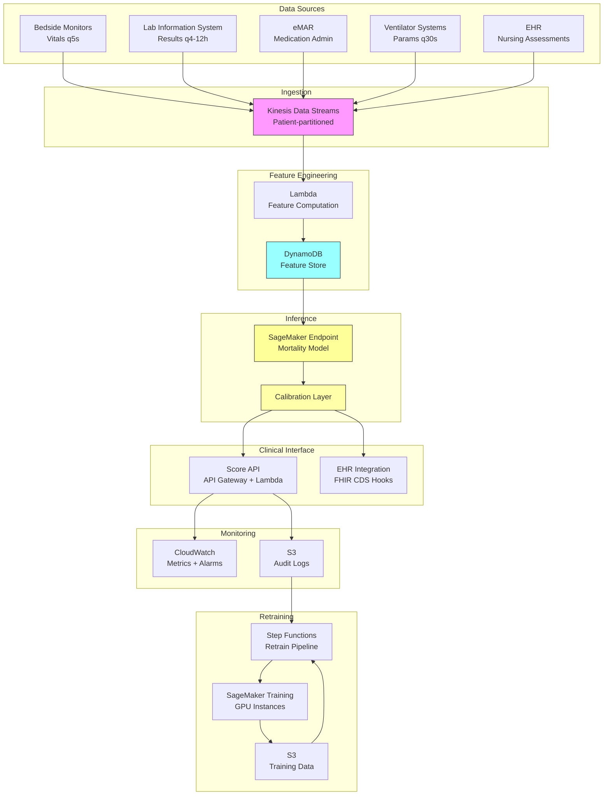

# Recipe 7.9: Mortality Risk Scoring (ICU)

**Complexity:** Complex · **Phase:** Research/Production · **Estimated Cost:** ~$3,000–$12,000/month (real-time inference + model retraining)

---

## The Problem

It's 2 AM in a 30-bed medical ICU. The attending intensivist is covering all 30 patients. Three are actively deteriorating. One family is asking whether to continue aggressive treatment for their 82-year-old father who's been on a ventilator for 11 days. The nurse at bed 14 is concerned about a patient whose vitals look "off" but nothing has crossed a threshold yet. And a new admission is coming up from the ED in 20 minutes.

The question that hangs over every ICU, every shift, every day: which of these patients is most likely to die in the next 24 to 72 hours?

This isn't morbid curiosity. It's the foundation of rational resource allocation, goals-of-care conversations, and clinical decision-making in the highest-acuity setting in medicine. When an intensivist has 30 patients and limited attention, knowing which patients are on the steepest decline determines where that attention goes. When a family is agonizing over whether to continue life-sustaining treatment, a calibrated probability helps frame the conversation honestly. When a hospital is deciding whether to activate surge capacity, aggregate mortality risk across the unit tells them whether they're approaching a crisis.

Today, this assessment happens through clinical gestalt. Experienced intensivists develop an intuition for which patients are "circling the drain" (their words, not mine). They integrate vital sign trends, lab trajectories, ventilator settings, vasopressor doses, and subtle clinical signs into an overall sense of trajectory. This intuition is remarkably good in experienced hands. It's also inconsistent across providers, unavailable at 2 AM when the covering physician doesn't know the patient well, and impossible to scale or audit.

Traditional severity scores exist. APACHE II, APACHE IV, SOFA, SAPS III. They've been the standard for decades. They work. But they have significant limitations: most are calculated once at admission (missing the dynamic nature of ICU illness), they use a fixed set of variables (ignoring the rich data streams available from modern monitoring), and they were calibrated on populations from specific eras and geographies (performance degrades when applied to different settings).

The ML opportunity here is to build a continuously updating mortality risk score that integrates all available data streams (vitals, labs, medications, ventilator parameters, nursing assessments) and produces a calibrated probability that updates in real time as the patient's condition evolves. Not a one-time admission score. A living estimate that reflects the patient's current state.

This is also, without question, the highest-stakes prediction problem in this entire book. Getting it wrong in either direction has profound consequences. Overestimate mortality risk and you might influence a family toward withdrawing care for a patient who could have recovered. Underestimate it and you might delay a goals-of-care conversation until the patient is actively dying, robbing the family of time to prepare. The ethical weight of this problem is not something you can engineer away. It's something you must design around.

---

## The Technology: Predicting Death in the ICU

### Why This Is One of the Hardest Problems in Clinical ML

ICU mortality prediction sits at the intersection of several genuinely difficult technical challenges, and the combination is what makes it both fascinating and treacherous.

**High-frequency, multivariate time series.** An ICU patient generates data continuously. Heart rate, blood pressure, respiratory rate, and SpO2 arrive every few seconds from bedside monitors. Ventilator parameters update with every breath. Labs come back every 4-12 hours. Medications are titrated hourly. Nursing assessments happen every 1-4 hours. You're dealing with dozens of variables at different sampling frequencies, all of which interact in complex ways. A heart rate of 110 means something very different depending on whether the patient is on 3 vasopressors or just woke up from sedation.

**Non-stationarity.** ICU patients are not in steady state. They're actively being treated, and their physiology is changing rapidly. A model trained on the first 6 hours of data may not generalize to hour 48, because the patient's underlying state has fundamentally changed. The features that predict mortality at admission are different from the features that predict mortality after a week of mechanical ventilation.

**Informative missingness.** When a lab value is missing, that's not random. A lactate that wasn't ordered might mean the clinician isn't worried about sepsis. A lactate that was ordered and came back at 8.2 means something very different. The pattern of what was measured, when, and how frequently is itself a powerful predictor. Models that simply impute missing values with population means are throwing away information.

**Treatment confounding (again).** A patient with a blood pressure of 60/40 who receives norepinephrine and whose pressure rises to 90/60 looks "better" on the vital signs. But the fact that they needed a vasopressor at all is a strong mortality signal. Naive models that only look at current values without understanding the treatment context will be systematically miscalibrated. The patient on three pressors with a MAP of 65 is sicker than the patient with a MAP of 65 on room air, even though the number is the same.

**Self-fulfilling prophecy risk.** This is the ethical landmine unique to mortality prediction. If a model predicts high mortality and that prediction influences a decision to withdraw life-sustaining treatment, the patient dies, and the model appears to have been correct. But was it? Would the patient have survived with continued aggressive care? You can never know. This creates a feedback loop where the model's predictions can become self-confirming, and it's extremely difficult to detect or correct. Any deployment must include safeguards against this.

**Calibration across subgroups.** A model that's well-calibrated on average (when it says 30% mortality, 30% of patients die) might be terribly calibrated for specific subgroups. If it systematically overestimates mortality for Black patients or underestimates it for elderly patients, the clinical decisions it informs will be biased. Subgroup calibration is harder to achieve than overall calibration, and the subgroups that matter (race, age, diagnosis, comorbidity burden) are numerous.

### Traditional Severity Scores: The Baseline

Before diving into ML approaches, it's worth understanding what already exists, because any new model must demonstrably outperform these established tools.

**APACHE (Acute Physiology and Chronic Health Evaluation).** The most widely used ICU severity score. APACHE II uses 12 physiologic variables, age, and chronic health status, measured in the first 24 hours of ICU admission, to produce a score that maps to predicted hospital mortality. APACHE IV updated the model with a larger dataset and more variables. Strengths: well-validated, widely understood, regulatory acceptance. Weaknesses: single time point (admission), fixed variable set, calibration drift over time as ICU care improves.

**SOFA (Sequential Organ Failure Assessment).** Scores six organ systems (respiratory, coagulation, liver, cardiovascular, CNS, renal) on a 0-4 scale. Originally designed to describe organ dysfunction over time, not predict mortality, but the total SOFA score and its trajectory (delta-SOFA) correlate strongly with outcomes. Strengths: can be calculated daily, captures organ-level dysfunction, simple to compute. Weaknesses: not designed as a mortality predictor, doesn't capture all relevant physiology.

**SAPS III (Simplified Acute Physiology Score).** Uses variables from the hour before and first hour after ICU admission. Designed for international use with regional calibration. Strengths: early prediction, geographic customization. Weaknesses: very early time window misses evolving illness.

The key insight: all of these scores use a small, fixed set of variables at one or a few time points. Modern ICUs generate orders of magnitude more data. The ML opportunity is to use all of it, continuously.

### ML Approaches for ICU Mortality Prediction

**Recurrent neural networks (RNNs/LSTMs/GRUs).** The natural first choice for sequential clinical data. An LSTM processes the patient's time series of observations in order, maintaining a hidden state that captures the patient's evolving condition. At any point, you can query the hidden state for a mortality probability. Strengths: handles variable-length sequences, captures temporal dependencies, can process irregular time intervals with appropriate encoding. Weaknesses: training instability with very long sequences, limited interpretability, can struggle with very high-frequency data.

**Temporal convolutional networks (TCNs).** Use 1D convolutions over the time dimension with dilated kernels to capture patterns at multiple time scales. Often faster to train than RNNs and can capture long-range dependencies through dilation. Increasingly competitive with RNNs for clinical time series.

**Transformer-based models.** Self-attention mechanisms can capture relationships between any two time points regardless of distance. Particularly powerful when the relevant signal might be a pattern from 3 days ago interacting with today's values. The computational cost scales quadratically with sequence length, which matters for high-frequency ICU data, but various efficient attention mechanisms address this.

**Gradient-boosted trees with temporal features.** A pragmatic approach: engineer temporal features (trends, rates of change, min/max over windows, time since last abnormal value) and feed them to XGBoost or LightGBM. Less elegant than deep learning but often surprisingly competitive, much faster to train, and far more interpretable. Many production systems use this approach because the interpretability matters for clinical adoption.

**Survival analysis models.** Rather than predicting a binary outcome (alive/dead), model the time-to-event distribution. Deep survival models (DeepSurv, Deep Recurrent Survival Analysis) combine the flexibility of neural networks with proper handling of censoring. This is the right framing when you want to answer "what's the probability of death within 24 hours? 48 hours? 7 days?" rather than just "will this patient die?"

**Ensemble approaches.** Production systems often combine multiple model types. A gradient-boosted model for interpretable feature importance, a recurrent model for temporal pattern capture, and a calibration layer that ensures the final probabilities are well-calibrated. The ensemble provides robustness against any single model's failure modes.

### Feature Engineering for ICU Data

The raw data from an ICU is not directly usable by most models. Feature engineering is where domain expertise meets ML engineering, and it's often where the real performance gains come from.

**Temporal aggregations.** For each vital sign and lab value, compute statistics over multiple time windows: last value, mean/median over 6h/12h/24h, min/max over those windows, standard deviation (variability), slope (trend direction and magnitude), time since last measurement.

**Derived physiologic indices.** Shock index (HR/SBP), PaO2/FiO2 ratio, oxygenation index, anion gap, corrected calcium. These are clinically meaningful combinations that capture physiology better than raw values alone.

**Treatment intensity features.** Number of vasopressors, total vasopressor dose (norepinephrine equivalents), ventilator mode and settings (FiO2, PEEP, driving pressure), number of antibiotics, blood product transfusions in last 24h. These capture how aggressively the patient is being treated, which is itself a signal about severity.

**Trajectory features.** Is the patient getting better or worse? Delta-SOFA over 24h, trend in vasopressor requirements, trend in FiO2 requirements, trend in creatinine. The direction of change is often more predictive than the absolute value.

**Missingness features.** How many labs were ordered in the last 12 hours? How frequently are vitals being recorded? Is the patient on continuous monitoring or spot checks? These meta-features capture clinical concern level.

### Calibration: The Non-Negotiable Requirement

For mortality prediction, calibration is more important than discrimination. Let me explain why.

Discrimination (measured by AUC/c-statistic) tells you whether the model ranks patients correctly: do patients who die get higher scores than patients who survive? This matters, but it's not sufficient.

Calibration tells you whether the probabilities are accurate: when the model says "30% mortality risk," do approximately 30% of those patients actually die? This is what matters for clinical decision-making. A goals-of-care conversation informed by "your father has a 70% chance of dying in the next week" requires that 70% to be honest. If the model systematically overestimates (says 70% but the true rate is 40%), you're pushing families toward withdrawal based on false pessimism.

Calibration techniques include:
- **Platt scaling:** Fit a logistic regression on the model's raw outputs using a held-out calibration set
- **Isotonic regression:** Non-parametric calibration that maps raw scores to calibrated probabilities
- **Temperature scaling:** A single parameter that adjusts the sharpness of the probability distribution
- **Subgroup-specific calibration:** Fit separate calibration curves for key subgroups (age brackets, primary diagnosis categories, race/ethnicity)

You must evaluate calibration with calibration plots (predicted vs. observed mortality in deciles), the Hosmer-Lemeshow statistic, and expected calibration error (ECE). Do this for the overall population AND for every clinically relevant subgroup.

### The Self-Fulfilling Prophecy Problem

This deserves dedicated attention because it's the most dangerous failure mode of ICU mortality prediction.

The mechanism: Model predicts high mortality. Clinician uses this in a goals-of-care conversation. Family decides to transition to comfort care. Patient dies. Model's prediction is "confirmed." But the death was caused (or hastened) by the decision to withdraw treatment, which was influenced by the model's prediction.

Over time, this creates a dataset where high-risk predictions are disproportionately followed by death (because treatment was withdrawn), which reinforces the model's tendency to predict high mortality for similar patients. The model becomes increasingly confident and increasingly wrong about what would happen with continued aggressive care.

Mitigations:
- **Never present the score as deterministic.** Always frame as probability with uncertainty bounds.
- **Track treatment withdrawal decisions.** Flag cases where life-sustaining treatment was withdrawn and exclude or weight them differently in retraining.
- **Counterfactual analysis.** Periodically analyze outcomes for patients with high predicted mortality who received continued aggressive care (because the family chose to continue). Compare actual outcomes to predictions.
- **Clinical override logging.** When clinicians disagree with the model, log their reasoning. These disagreements are gold for identifying model failures.
- **Sunset and retrain.** Don't let the model run indefinitely without recalibration. ICU care improves over time; a model trained on 2020 data will overestimate mortality in 2026 because treatments have gotten better.

### The General Architecture Pattern

At a conceptual level, an ICU mortality prediction system looks like this:

```
[Data Ingestion] → [Feature Store] → [Model Inference] → [Calibration] → [Clinical Display]
       ↑                                                                         ↓
[EHR / Monitors / Labs]                                              [Audit + Override Log]
       ↑                                                                         ↓
[Retraining Pipeline] ← ← ← ← ← ← ← ← ← ← ← ← ← ← ← ← ← ← [Outcome Tracking]
```

**Data ingestion.** Continuous streaming of vitals from bedside monitors, lab results from the LIS, medication administration records from the eMAR, ventilator parameters from the respiratory therapy system, and nursing assessments from the EHR. This data arrives at different frequencies (seconds for vitals, hours for labs) and must be aligned to a common timeline.

**Feature store.** Pre-computed temporal features updated on a schedule (every 15 minutes to every hour, depending on clinical needs). Raw time series are transformed into the engineered features the model expects: aggregations, trends, derived indices, treatment intensity metrics.

**Model inference.** The trained model consumes the current feature vector and produces a mortality probability (or a distribution of probabilities across time horizons). This must be fast enough for the update frequency you've chosen.

**Calibration layer.** Post-hoc calibration ensures the raw model output maps to honest probabilities. This layer is retrained more frequently than the base model because calibration can drift even when discrimination remains stable.

**Clinical display.** The score is presented to clinicians in context: current probability, trend over the last 24-48 hours, key contributing factors, and explicit uncertainty bounds. Never just a number. Always a number with context.

**Audit and override logging.** Every score presentation, every clinical decision made in proximity to a score, and every clinician override or disagreement is logged. This is both a compliance requirement and a model improvement data source.

**Outcome tracking and retraining.** Actual outcomes (survival to discharge, in-hospital death, transition to comfort care) are tracked and linked back to predictions. The model is periodically retrained on updated data, with special attention to cases where predictions diverged from outcomes.

---

## The AWS Implementation

### Why These Services

**Amazon SageMaker for model training and hosting.** ICU mortality models require significant compute for training (processing millions of patient-hours of time series data) and low-latency inference (scores must update within seconds of new data arriving). SageMaker provides managed training infrastructure with GPU instances for deep learning models, real-time inference endpoints with auto-scaling, and model registry for versioning. The A/B testing capability is critical here: you need to safely roll out model updates without disrupting clinical workflows.

**Amazon Kinesis Data Streams for real-time data ingestion.** ICU data arrives continuously from multiple sources (monitors, labs, medications). Kinesis handles the high-throughput, low-latency ingestion of these streams and provides ordering guarantees within a shard. The retention period (up to 365 days) gives you a replay buffer for reprocessing when features change.

**AWS Lambda for feature computation.** Triggered by Kinesis, Lambda functions compute temporal features on each new data point: update rolling aggregations, recalculate trends, derive physiologic indices. The stateless, event-driven model fits the "compute features on arrival" pattern. For high-frequency vitals, you might batch into micro-windows (every 30 seconds) rather than processing every heartbeat.

**Amazon DynamoDB for the feature store.** The current feature vector for each patient needs to be readable with single-digit millisecond latency (the inference endpoint reads it on every scoring cycle). DynamoDB's key-value access pattern is ideal: patient ID as partition key, feature vector as the item. TTL handles automatic cleanup when patients are discharged.

**Amazon S3 for training data and model artifacts.** Historical patient data for model training, trained model artifacts, calibration datasets, and audit logs all live in S3. Lifecycle policies manage the retention of training data (which may need to be kept for years for regulatory purposes).

**Amazon CloudWatch for monitoring and alerting.** Model performance metrics (prediction latency, feature freshness, score distribution drift), infrastructure metrics, and clinical alert thresholds all flow through CloudWatch. Alarms trigger when the model's score distribution shifts unexpectedly (potential data pipeline issue) or when prediction latency exceeds clinical requirements.

**AWS Step Functions for the retraining pipeline.** Model retraining is a multi-step workflow: extract training data, validate data quality, train candidate model, evaluate on holdout set, compare to production model, run calibration, deploy if improved. Step Functions orchestrates this with built-in error handling and human approval gates before production deployment.

### Architecture Diagram



### Prerequisites

| Requirement | Details |
|-------------|---------|
| **AWS Services** | Amazon SageMaker, Amazon Kinesis Data Streams, AWS Lambda, Amazon DynamoDB, Amazon S3, Amazon API Gateway, AWS Step Functions, Amazon CloudWatch |
| **IAM Permissions** | `sagemaker:InvokeEndpoint`, `sagemaker:CreateTrainingJob`, `kinesis:GetRecords`, `kinesis:PutRecord`, `dynamodb:GetItem`, `dynamodb:PutItem`, `s3:GetObject`, `s3:PutObject`, `states:StartExecution`, `logs:CreateLogGroup` |
| **BAA** | AWS BAA signed (required: ICU data is PHI) |
| **Encryption** | S3: SSE-KMS; DynamoDB: encryption at rest; Kinesis: server-side encryption with KMS; SageMaker: KMS for model artifacts and endpoint data; all transit over TLS |
| **VPC** | Production: all components in VPC with private subnets. VPC endpoints for S3, DynamoDB, SageMaker, Kinesis, CloudWatch Logs. No internet egress for inference path. |
| **CloudTrail** | Enabled for all API calls. Critical for audit trail of who accessed scores and when. |
| **Data Requirements** | Minimum 2-3 years of historical ICU data with outcomes. At least 5,000-10,000 ICU admissions for initial training. Must include patients who survived AND patients who died (class balance matters). |
| **Cost Estimate** | Kinesis: ~$500/month (2 shards, 30-bed ICU). SageMaker endpoint: ~$2,000-$5,000/month (ml.m5.xlarge with auto-scaling). DynamoDB: ~$200/month (on-demand). Lambda: ~$100/month. Training jobs: ~$500-$2,000 per retrain cycle (monthly). |

### Ingredients

| AWS Service | Role |
|------------|------|
| **Amazon Kinesis Data Streams** | Real-time ingestion of vitals, labs, medications, and assessments |
| **AWS Lambda** | Compute temporal features on each new data arrival |
| **Amazon DynamoDB** | Low-latency feature store for current patient state vectors |
| **Amazon SageMaker** | Model training (GPU), real-time inference endpoint, model registry |
| **Amazon S3** | Training data, model artifacts, calibration sets, audit logs |
| **Amazon API Gateway** | REST API for clinical applications to query scores |
| **AWS Step Functions** | Orchestrate retraining pipeline with approval gates |
| **Amazon CloudWatch** | Performance monitoring, drift detection, clinical alerting |
| **AWS KMS** | Encryption key management for all data at rest and in transit |

### Code

> **Reference implementations:** The following AWS sample repos demonstrate patterns used in this recipe:
>
> - [`amazon-sagemaker-examples`](https://github.com/aws/amazon-sagemaker-examples): Comprehensive SageMaker examples including real-time inference endpoints and model monitoring
> - [`amazon-sagemaker-immersion-day`](https://github.com/aws-samples/amazon-sagemaker-immersion-day): Hands-on workshops covering training, deployment, and monitoring patterns
> - [`real-time-analytics-spark-streaming`](https://github.com/aws-samples/real-time-analytics-spark-streaming): Real-time streaming analytics patterns applicable to clinical data pipelines

#### Walkthrough

**Step 1: Ingest clinical data streams.** ICU data arrives from multiple source systems at different frequencies. Bedside monitors push vitals every few seconds. Lab results arrive every few hours. Medication administrations are logged as they happen. All of these streams must be captured, ordered, and made available for feature computation. The key design choice is partitioning by patient ID so that all data for a single patient flows through the same processing path in order. Without this ordering guarantee, you might compute features using a lab result that arrived before the vital signs that preceded it chronologically. Skip this step and you have no data to score.

```
FUNCTION ingest_clinical_event(event):
    // Each clinical event arrives with a patient identifier, timestamp,
    // event type (vital, lab, medication, assessment), and the actual values.
    // We route it to a stream partitioned by patient ID to maintain ordering.

    record = {
        patient_id:   event.patient_id,          // ICU patient identifier
        timestamp:    event.timestamp,            // when this measurement was taken
        event_type:   event.type,                 // "vital", "lab", "medication", "assessment"
        source:       event.source_system,        // which system sent this (monitor, LIS, eMAR)
        values:       event.measurements          // the actual data (HR=110, SBP=85, etc.)
    }

    // Send to the streaming ingestion layer, partitioned by patient.
    // Partition key = patient_id ensures all data for one patient
    // is processed in order by downstream consumers.
    send record to stream with partition_key = event.patient_id

    RETURN success
```

**Step 2: Compute temporal features.** Raw clinical values are not what the model consumes. The model needs engineered features that capture temporal patterns: trends, variability, extremes, and rates of change over multiple time windows. Each time a new data point arrives, the feature computation updates the relevant aggregations. This is where domain expertise lives. A heart rate of 110 is mildly concerning. A heart rate that went from 70 to 110 over 2 hours while blood pressure dropped from 120 to 85 is an emergency. The features must capture these relationships. Skip this step and the model sees only snapshots, not trajectories.

```
FUNCTION compute_features(patient_id, new_event):
    // Retrieve the patient's current feature state from the feature store.
    // This contains all previously computed aggregations and raw recent values.
    current_state = get feature_state from feature_store for patient_id

    // Update the relevant time series with the new data point.
    // Different event types update different feature groups.
    IF new_event.type == "vital":
        update_vital_features(current_state, new_event)
    ELSE IF new_event.type == "lab":
        update_lab_features(current_state, new_event)
    ELSE IF new_event.type == "medication":
        update_medication_features(current_state, new_event)
    ELSE IF new_event.type == "assessment":
        update_assessment_features(current_state, new_event)

    // Recompute derived features that depend on multiple data types.
    // Example: shock index = HR / SBP (needs both vital signs).
    // Example: vasopressor-adjusted MAP (needs vitals + medications).
    recompute_derived_features(current_state)

    // Compute trajectory features: slopes, deltas, variability over windows.
    compute_temporal_aggregations(current_state, windows=[6h, 12h, 24h, 48h])

    // Write the updated feature vector back to the feature store.
    write current_state to feature_store for patient_id

    RETURN current_state

FUNCTION compute_temporal_aggregations(state, windows):
    // For each clinical variable, compute statistics over each time window.
    // These capture "what's been happening" not just "what's happening now."

    FOR each variable in [heart_rate, sbp, dbp, map, spo2, resp_rate, temperature,
                          lactate, creatinine, bilirubin, platelets, wbc, pao2_fio2]:
        FOR each window in windows:
            recent_values = get values for variable within window from state.history

            state.features[variable + "_mean_" + window]   = mean(recent_values)
            state.features[variable + "_min_" + window]    = min(recent_values)
            state.features[variable + "_max_" + window]    = max(recent_values)
            state.features[variable + "_std_" + window]    = std_deviation(recent_values)
            state.features[variable + "_slope_" + window]  = linear_slope(recent_values)
            state.features[variable + "_last"]             = most_recent(recent_values)
            state.features[variable + "_hours_since"]      = hours_since_last(recent_values)

    // Treatment intensity features
    state.features["vasopressor_count"]       = count active vasopressors
    state.features["norepinephrine_equiv"]    = total vasopressor dose in NE equivalents
    state.features["fio2_current"]            = current FiO2 setting
    state.features["peep_current"]            = current PEEP setting
    state.features["ventilator_mode"]         = encoded ventilator mode
    state.features["rrt_active"]              = is renal replacement therapy running (0/1)

    // Missingness features (how much clinical attention is this patient getting?)
    state.features["labs_ordered_24h"]        = count of lab orders in last 24 hours
    state.features["vital_frequency_1h"]      = count of vital measurements in last hour
    state.features["nursing_assessments_12h"] = count of nursing notes in last 12 hours
```

**Step 3: Score the patient.** With the feature vector current, invoke the mortality prediction model. The model produces a raw score (logit or probability) that represents the patient's mortality risk. This happens on a schedule (every 15-60 minutes) or can be triggered by significant clinical events (new critical lab result, vasopressor initiation). The raw score is not yet ready for clinical use; it needs calibration. But this step is where the core prediction happens. Skip it and you have features with no prediction.

```
FUNCTION score_patient(patient_id):
    // Retrieve the current feature vector for this patient.
    feature_vector = get features from feature_store for patient_id

    // Validate that the feature vector is fresh enough to score.
    // If the most recent data is more than 2 hours old, the score is stale.
    // This can happen if a data pipeline is down or the patient was just admitted.
    IF feature_vector.last_updated > 2 hours ago:
        RETURN { status: "stale", reason: "Feature data older than 2 hours" }

    // Check minimum data requirements.
    // The model needs at least some vital signs and basic labs to produce
    // a meaningful prediction. Without them, the uncertainty is too high.
    IF feature_vector.hours_since_admission < 4:
        RETURN { status: "insufficient_data", reason: "Less than 4 hours of ICU data" }

    // Invoke the model endpoint with the feature vector.
    // The model returns a raw mortality probability and feature importances.
    raw_prediction = call model_endpoint with:
        features = feature_vector.to_array()

    // The raw output includes:
    //   - mortality_probability: raw model output (before calibration)
    //   - feature_importances: which features drove this prediction
    //   - prediction_horizon: what time window this covers (24h, 48h, 7d)
    RETURN raw_prediction
```

**Step 4: Calibrate the prediction.** The raw model output is not a well-calibrated probability. Neural networks and gradient-boosted models are notoriously overconfident or underconfident depending on the training regime. The calibration layer maps raw scores to honest probabilities using a function learned on a held-out calibration dataset. This layer is retrained more frequently than the base model (monthly vs. quarterly) because calibration can drift as the patient population or treatment patterns change. Skip this step and clinicians will make decisions based on probabilities that don't mean what they claim to mean.

```
FUNCTION calibrate_prediction(raw_prediction, patient_demographics):
    // Apply post-hoc calibration to convert raw model output
    // into a well-calibrated probability.

    // Select the appropriate calibration function based on patient subgroup.
    // We maintain separate calibration curves for key subgroups because
    // a single calibration function may not be accurate across all populations.
    subgroup = determine_calibration_subgroup(patient_demographics)
    // Subgroups might be: age brackets, primary diagnosis category,
    // surgical vs. medical ICU, etc.

    calibration_function = load calibration_model for subgroup

    // Apply calibration. This is typically isotonic regression or Platt scaling
    // fitted on a recent holdout dataset.
    calibrated_probability = calibration_function.transform(raw_prediction.mortality_probability)

    // Compute confidence interval using the calibration model's uncertainty.
    // Wider intervals = less certain. This is critical for clinical communication.
    confidence_interval = compute_confidence_bounds(
        calibrated_probability,
        calibration_function.uncertainty,
        confidence_level = 0.80   // 80% CI: "we're 80% sure the true risk is in this range"
    )

    RETURN {
        mortality_24h:     calibrated_probability,
        confidence_lower:  confidence_interval.lower,
        confidence_upper:  confidence_interval.upper,
        calibration_group: subgroup,
        model_version:     current_model_version,
        scored_at:         current_timestamp
    }
```

**Step 5: Present to clinicians with context.** A bare probability is not clinically useful. Clinicians need context: what's driving the score, how has it changed, and how does this patient compare to similar patients. This step assembles the clinical display package that integrates into the EHR or a dedicated dashboard. The presentation must include uncertainty bounds, trend information, and explicit caveats about what the score does and does not mean. Skip this step and you have a number that no one trusts or uses.

```
FUNCTION build_clinical_display(patient_id, calibrated_score, raw_prediction):
    // Assemble the full clinical context for score presentation.

    // Get score history for trend display.
    score_history = get last 48 hours of scores for patient_id from audit_log

    // Identify the top contributing features (what's driving this score).
    // Clinicians need to understand WHY the score is what it is.
    top_factors = extract top 5 features from raw_prediction.feature_importances
    // Translate feature names to clinical language:
    // "norepinephrine_equiv" -> "Vasopressor dose (norepinephrine equivalents)"
    // "lactate_slope_6h" -> "Lactate trend over last 6 hours"
    clinical_factors = translate_to_clinical_language(top_factors)

    // Compute trend: is the patient getting better or worse?
    IF length(score_history) >= 2:
        trend = compute_trend(score_history)
        // trend = "improving", "stable", "worsening", or "rapidly_worsening"
    ELSE:
        trend = "insufficient_history"

    // Build the display object.
    display = {
        patient_id:          patient_id,
        current_score:       calibrated_score.mortality_24h,
        confidence_interval: [calibrated_score.confidence_lower,
                              calibrated_score.confidence_upper],
        trend:               trend,
        trend_description:   describe_trend(trend, score_history),
        top_factors:         clinical_factors,
        score_history:       score_history,
        model_version:       calibrated_score.model_version,
        last_updated:        calibrated_score.scored_at,
        caveats: [
            "This score reflects statistical patterns and does not account for all clinical context.",
            "Treatment decisions should never be based solely on this score.",
            "Score assumes current treatment continues unchanged.",
            "Discuss with the care team before using in goals-of-care conversations."
        ]
    }

    // Log this score presentation for audit purposes.
    log_score_presentation(patient_id, display, requesting_user)

    RETURN display
```

**Step 6: Log outcomes and detect drift.** The system must track what actually happens to patients and compare it to what was predicted. This serves two purposes: monitoring model performance in real time (detecting when the model starts getting worse) and accumulating data for the next retraining cycle. Outcome tracking must handle the complexity of ICU dispositions: discharge alive, in-hospital death, transition to comfort care (which is different from "natural" death), transfer to another facility (outcome unknown). Skip this step and you'll never know if your model is degrading until a clinician complains.

```
FUNCTION track_outcome(patient_id, disposition):
    // Called when a patient leaves the ICU (discharge, death, transfer).

    // Retrieve all predictions made for this patient during their stay.
    all_predictions = get predictions for patient_id from audit_log

    // Determine the actual outcome for comparison.
    actual_outcome = {
        survived_to_discharge: disposition.type == "discharge_alive",
        died_in_hospital:      disposition.type == "death",
        comfort_care:          disposition.type == "comfort_care_transition",
        transferred:           disposition.type == "transfer_out",
        icu_los_hours:         disposition.icu_length_of_stay,
        hospital_los_hours:    disposition.hospital_length_of_stay
    }

    // For each prediction, compute the prediction error.
    FOR each prediction in all_predictions:
        error = {
            predicted_mortality: prediction.mortality_24h,
            actual_died_within_24h: did_patient_die_within(24h, prediction.scored_at),
            prediction_age_hours: hours_between(prediction.scored_at, disposition.time),
            comfort_care_flag: actual_outcome.comfort_care
            // Flag comfort care cases: these are ambiguous for model evaluation
            // because death was influenced by treatment withdrawal decision
        }
        store error in model_performance_log

    // Check for calibration drift.
    // Compare recent prediction accuracy to expected calibration.
    recent_errors = get last 100 outcomes from model_performance_log
    calibration_drift = compute_calibration_drift(recent_errors)

    IF calibration_drift > DRIFT_THRESHOLD:
        trigger alert: "Model calibration has drifted. Review and consider recalibration."

    RETURN actual_outcome
```

> **Curious how this looks in Python?** The pseudocode above covers the concepts. If you'd like to see sample Python code that demonstrates these patterns using boto3, check out the [Python Example](chapter07.09-python-example). It walks through each step with inline comments and notes on what you'd need to change for a real deployment.

### Expected Results

**Sample output for a single patient scoring cycle:**

```json
{
  "patient_id": "ICU-2026-04821",
  "current_score": 0.34,
  "confidence_interval": [0.22, 0.47],
  "trend": "worsening",
  "trend_description": "Mortality risk has increased from 0.18 to 0.34 over the last 12 hours",
  "top_factors": [
    {"factor": "Vasopressor dose increasing", "direction": "risk_increasing", "magnitude": "high"},
    {"factor": "Lactate rising (2.1 → 4.8 over 6h)", "direction": "risk_increasing", "magnitude": "high"},
    {"factor": "PaO2/FiO2 ratio declining", "direction": "risk_increasing", "magnitude": "moderate"},
    {"factor": "Urine output decreasing", "direction": "risk_increasing", "magnitude": "moderate"},
    {"factor": "GCS stable at 8", "direction": "neutral", "magnitude": "low"}
  ],
  "model_version": "v3.2.1",
  "last_updated": "2026-04-15T02:15:33Z",
  "caveats": [
    "This score reflects statistical patterns and does not account for all clinical context.",
    "Treatment decisions should never be based solely on this score.",
    "Score assumes current treatment continues unchanged.",
    "Discuss with the care team before using in goals-of-care conversations."
  ]
}
```

**Performance benchmarks:**

| Metric | Typical Value |
|--------|---------------|
| AUC (discrimination) | 0.85-0.92 for 24h mortality |
| Calibration (ECE) | < 0.05 (well-calibrated) |
| Scoring latency | < 500ms per patient |
| Feature freshness | Updated within 5 minutes of new data |
| Retraining frequency | Monthly recalibration, quarterly full retrain |
| Subgroup calibration gap | < 0.08 ECE across age/race/diagnosis groups |

**Where it struggles:**

- Patients with rare conditions not well-represented in training data
- Very early in admission (< 4 hours) when insufficient data has accumulated
- Patients whose trajectory changes rapidly (septic shock onset, cardiac arrest)
- Distinguishing "dying from disease" vs. "dying from treatment withdrawal"
- Patients transferred from other facilities (missing historical context)
- Novel disease presentations (e.g., early COVID-19 before models were retrained)

---

## The Honest Take

Here's what I've learned about ICU mortality prediction that the papers don't emphasize enough:

**The model is the easy part.** Getting an AUC of 0.88 on a retrospective dataset is straightforward with modern ML. The hard parts are: getting real-time data flowing reliably from 6 different source systems, keeping the feature pipeline running 24/7 without gaps, maintaining calibration as your patient population shifts, and (hardest of all) getting clinicians to actually look at and trust the scores.

**Clinician adoption is the real challenge.** Intensivists have been making these judgments for their entire careers. Many are skeptical of a model telling them something they feel they already know. The path to adoption is not "replace clinical judgment" but "augment it." The model catches the patient whose deterioration is subtle enough that a busy overnight attending might miss it. Frame it as a safety net, not a replacement.

**The self-fulfilling prophecy problem is real and unsolved.** Every team I've seen deploy this eventually confronts the question: "Are our high-risk predictions accurate, or are they accurate because we withdrew care?" There's no clean answer. The best mitigation is transparency: track which high-risk patients had treatment withdrawn, analyze outcomes separately for those who continued aggressive care, and be honest about the limitations in every clinical communication.

**Calibration drifts faster than you expect.** ICU care improves continuously. New ventilator strategies, new sepsis protocols, new medications. A model trained on 2023 data will overestimate mortality in 2026 because patients who would have died in 2023 now survive. Monthly recalibration is not overkill; it's necessary.

**The ethical framework matters more than the technical framework.** Before you build this, you need institutional agreement on: Who sees the scores? Are they used in goals-of-care conversations? Can they influence triage decisions? What happens when the model disagrees with the clinician? These are not engineering questions. They're ethics committee questions. Get them answered first.

---

## Variations and Extensions

**Multi-horizon prediction.** Instead of a single 24-hour mortality probability, produce a survival curve: probability of death within 24h, 48h, 7 days, 30 days. This gives clinicians a richer picture of trajectory and supports different decision timeframes. Families asking "will he make it?" need a different time horizon than a bed manager planning for tomorrow.

**Organ-specific failure prediction.** Rather than predicting overall mortality, predict the trajectory of individual organ systems: will this patient need dialysis in the next 48 hours? Will they fail extubation? Will they develop liver failure? These organ-specific predictions are more actionable because they map to specific interventions (prepare for dialysis, delay extubation, consult hepatology).

**Explainable scoring for family communication.** Build a natural-language explanation layer that translates the model's feature importances into plain language suitable for family conversations: "Your father's kidneys are showing signs of worsening, and his blood pressure is requiring increasing medication support. These patterns are associated with higher risk." This requires careful clinical review of generated explanations to ensure accuracy and appropriate tone.

---

## Related Recipes

- **Recipe 3.7 (Patient Deterioration Early Warning):** Complementary system focused on detecting acute deterioration events rather than predicting mortality probability
- **Recipe 7.5 (30-Day Readmission Risk):** Similar predictive architecture but for a lower-acuity, longer-horizon outcome
- **Recipe 7.7 (Length of Stay Prediction):** Shares the ICU data pipeline and feature engineering patterns
- **Recipe 7.8 (Disease Progression Modeling):** Covers the longitudinal modeling techniques applicable to longer-term ICU trajectories
- **Recipe 12.10 (Physiological Waveform Analysis):** Extends the vital sign processing to high-frequency waveform data from bedside monitors

---

## Additional Resources

**AWS Documentation:**
- [Amazon SageMaker Real-Time Inference](https://docs.aws.amazon.com/sagemaker/latest/dg/realtime-endpoints.html)
- [Amazon SageMaker Model Monitor](https://docs.aws.amazon.com/sagemaker/latest/dg/model-monitor.html)
- [Amazon Kinesis Data Streams Developer Guide](https://docs.aws.amazon.com/streams/latest/dev/introduction.html)
- [AWS HIPAA Eligible Services](https://aws.amazon.com/compliance/hipaa-eligible-services-reference/)
- [Amazon SageMaker Pricing](https://aws.amazon.com/sagemaker/pricing/)
- [Architecting for HIPAA on AWS](https://docs.aws.amazon.com/whitepapers/latest/architecting-hipaa-security-and-compliance-on-aws/welcome.html)

**AWS Sample Repos:**
- [`amazon-sagemaker-examples`](https://github.com/aws/amazon-sagemaker-examples): Comprehensive SageMaker examples including real-time inference, model monitoring, and A/B testing
- [`amazon-sagemaker-immersion-day`](https://github.com/aws-samples/amazon-sagemaker-immersion-day): Hands-on workshops for SageMaker training and deployment patterns
- [`aws-healthcare-lifescience-ai-ml`](https://github.com/aws-samples/aws-healthcare-lifescience-ai-ml): Healthcare and life sciences ML examples on AWS

**AWS Solutions and Blogs:**
- [Machine Learning for Healthcare on AWS](https://aws.amazon.com/health/machine-learning/): Overview of AWS ML services for healthcare use cases
- [Real-Time ML Inference on Streaming Data](https://aws.amazon.com/blogs/machine-learning/): Patterns for real-time scoring on streaming clinical data

**Clinical References:**
- TODO: Verify and add link to MIMIC-III/MIMIC-IV dataset documentation (MIT Lab for Computational Physiology) for ICU ML research
- TODO: Verify and add link to eICU Collaborative Research Database documentation
- APACHE IV methodology: Zimmerman JE, et al. "Acute Physiology and Chronic Health Evaluation (APACHE) IV." Critical Care Medicine, 2006.
- SOFA score: Vincent JL, et al. "The SOFA (Sepsis-related Organ Failure Assessment) score." Intensive Care Medicine, 1996.

---

## Estimated Implementation Time

| Phase | Duration |
|-------|----------|
| **Basic** (retrospective model on historical data, batch scoring) | 3-4 months |
| **Production-ready** (real-time pipeline, calibration, monitoring, EHR integration) | 8-12 months |
| **With variations** (multi-horizon, organ-specific, explainability layer) | 14-18 months |

---

## Tags

`predictive-analytics` · `mortality` · `icu` · `critical-care` · `real-time` · `time-series` · `sagemaker` · `kinesis` · `complex` · `high-stakes` · `calibration` · `ethics` · `hipaa`

---

*← [Recipe 7.8: Disease Progression Modeling](chapter07.08-disease-progression-modeling) · [Chapter 7 Index](chapter07-index) · [Next: Recipe 7.10 - Optimal Intervention Timing Prediction →](chapter07.10-optimal-intervention-timing-prediction)*
