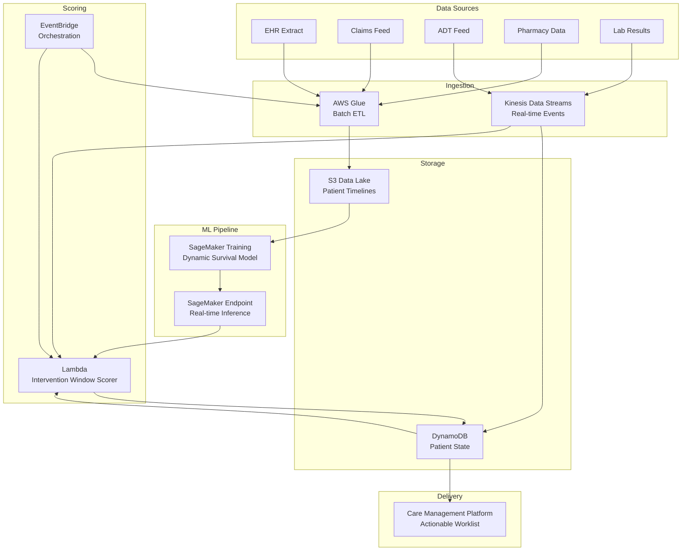

# Recipe 7.10: Optimal Intervention Timing Prediction

**Complexity:** Complex · **Phase:** Research/Pilot · **Estimated Cost:** ~$2,500–8,000/month (model training + inference)

---

## The Problem

Here's the scenario that plays out thousands of times a day across every health system in the country: a care manager has a panel of 200 patients with diabetes. She knows 30 of them are "high risk." She has capacity to make maybe 8 meaningful outreach calls this week. The question isn't who to call. She already knows who's struggling. The question is *when* to call.

Call too early, and the patient isn't ready to engage. They feel fine. They haven't missed a refill yet. Your intervention lands on deaf ears and you've burned a slot. Call too late, and the patient is already in the ED with DKA. Your intervention would have mattered three weeks ago. The window closed.

This is the timing problem, and it's one of the hardest unsolved challenges in population health. Most predictive models in healthcare answer "who is at risk?" That's table stakes at this point. The genuinely hard question is "when is the right moment to act?" And the answer changes for every patient, every condition, and every type of intervention.

The stakes are real. A well-timed phone call from a care manager can prevent a hospitalization that costs $15,000. A poorly timed one wastes $50 of staff time and, worse, trains the patient to ignore future outreach. The difference between those outcomes often comes down to days or weeks of timing.

Traditional risk scoring gives you a static snapshot: this patient is high risk right now. But risk isn't static. It fluctuates. A patient's risk might be elevated for months without anything bad happening, then spike sharply in the 72 hours before a crisis. If you could detect that inflection point, that transition from "chronically elevated" to "acutely deteriorating," you'd know exactly when to intervene.

This is where we're headed. Not just predicting risk, but predicting the optimal intervention window.

---

## The Technology: Predicting When to Act

### Beyond Point-in-Time Risk Scores

Most healthcare risk models produce a single number: "this patient has a 23% probability of readmission in the next 30 days." That's useful for prioritization, but it tells you nothing about timing. Is that 23% evenly distributed across the 30 days? Or is there a 2% daily risk for the first 25 days that spikes to 15% daily risk in the final 5? Those two scenarios demand completely different intervention strategies.

Optimal intervention timing requires modeling risk as a trajectory, not a point. You need to understand how risk evolves over time for each individual patient, and you need to identify the moments where that trajectory is most amenable to change.

### Survival Analysis and Hazard Functions

The mathematical foundation here is survival analysis, specifically time-to-event modeling. Instead of asking "will this patient have an event?" you ask "when will this patient have an event, and how does that timing change based on what we observe?"

The hazard function is the key concept. It represents the instantaneous rate of event occurrence at any given time, conditional on the patient having survived to that point. A rising hazard means the patient is entering a danger zone. A stable hazard means they're in a steady state. The derivative of the hazard (is it accelerating?) tells you whether the window for intervention is opening or closing.

Classical survival models (Cox proportional hazards) assume the effect of covariates is constant over time. That's a terrible assumption for healthcare. The impact of a missed medication refill on readmission risk isn't constant; it grows over time as the patient's condition destabilizes. Modern approaches use time-varying covariates and non-proportional hazard models to capture these dynamics.

### Dynamic Survival Models

The state of the art for this problem uses recurrent neural networks or transformer architectures applied to longitudinal patient data. The idea is straightforward: feed the model a sequence of clinical events (lab results, medication fills, vital signs, encounters) ordered by time, and have it predict the hazard function at each time step.

These models learn temporal patterns that static models miss entirely. They can detect that a patient whose A1C has been rising for three consecutive quarters, who just had a medication change, and who missed their last endocrinology appointment is entering a critical window. Not because any single factor is alarming, but because the combination and sequence signal an inflection point.

The key architectures:

**Recurrent Neural Survival Models.** LSTM or GRU networks that process event sequences and output a hazard estimate at each time step. They naturally handle irregular time intervals (common in healthcare data) and can incorporate both continuous features (lab values) and discrete events (encounters, prescriptions).

**Transformer-based Event Models.** Self-attention mechanisms that can look across the entire patient history to identify relevant patterns. Better at capturing long-range dependencies (that hospitalization 18 months ago is relevant to today's risk) but more computationally expensive.

**Counterfactual Timing Models.** This is where it gets genuinely interesting. These models don't just predict when an event will happen; they estimate what would happen if you intervened at different time points. "If we call this patient today, their 30-day event probability drops by X%. If we wait a week, it drops by Y%." This requires causal inference techniques layered on top of the survival model.

### The Causal Inference Challenge

Here's the fundamental difficulty: you want to know the optimal time to intervene, but you can only observe what actually happened. If you intervened on day 5 and the patient did fine, you don't know whether they would have done fine anyway, or whether your intervention prevented a crisis. If you didn't intervene and the patient had an event on day 12, you don't know whether intervening on day 5 would have prevented it.

This is the counterfactual problem, and it's why optimal timing prediction pushes toward causal reasoning rather than pure prediction.

Approaches to handle this:

**Inverse probability of treatment weighting (IPTW).** Reweight historical observations to simulate what would have happened under different intervention timing strategies. Requires strong assumptions about what drove historical intervention decisions.

**G-computation and structural marginal models.** Estimate the causal effect of intervention at each time point by modeling the full data-generating process. More flexible than IPTW but computationally intensive.

**Reinforcement learning framing.** Treat the intervention timing decision as a sequential decision problem where the "agent" (care manager) takes actions (intervene or wait) at each time step and receives rewards (patient outcomes). This is the most natural framing but requires the most data and the most careful validation. (See Chapter 15 for full RL treatment.)

For most healthcare organizations starting this work, the practical approach is a hybrid: use a dynamic survival model to predict risk trajectories, then apply simple decision rules about when the trajectory crosses actionable thresholds. Save the full causal/RL approach for when you have the data volume and the organizational maturity to validate it properly.

### What Makes Timing Prediction Uniquely Hard

**Sparse positive events.** The events you're trying to time (hospitalizations, ED visits, crises) are relatively rare for any individual patient. You might have years of longitudinal data with only one or two events per patient. Training models on sparse events with precise timing requirements is significantly harder than training binary classifiers.

**Irregular observation intervals.** Patients don't generate data on a regular schedule. A healthy patient might have one encounter per year. A complex patient might have weekly labs, monthly visits, and daily medication fills. Your model needs to handle both, and it needs to reason about the absence of data (no lab results for 6 months might itself be a signal).

**Intervention effects are heterogeneous.** A phone call works differently for different patients at different times. Some patients respond to early outreach. Others only engage when they're already feeling the consequences of non-adherence. The optimal timing depends on the patient's engagement style, which you may not observe directly.

**The self-fulfilling prophecy problem.** If your model successfully identifies patients at the right time and you intervene, those patients won't have events. Your training data then shows "model flagged patient, patient was fine" which looks like a false positive. Over time, successful intervention erodes the signal your model was trained on. This is a well-known problem in healthcare ML and requires careful study design to avoid.

---

## General Architecture Pattern

```
[Longitudinal Data Assembly] → [Feature Engineering (Temporal)] → [Dynamic Survival Model] → [Intervention Window Scoring] → [Decision Engine] → [Care Team Delivery]
```

**Longitudinal Data Assembly.** Collect and align all patient events on a unified timeline: encounters, labs, medications, vitals, claims, social determinants. This is the hardest engineering step. Healthcare data lives in dozens of systems with different identifiers, different time granularities, and different latencies. You need a patient-level event stream that's reasonably complete and reasonably current.

**Feature Engineering (Temporal).** Transform raw events into features that capture temporal dynamics: rate of change in lab values, days since last medication fill, gap between scheduled and actual appointments, acceleration of utilization. These temporal features are what distinguish timing models from static risk scores.

**Dynamic Survival Model.** Train a model that takes the temporal feature sequence as input and outputs a hazard estimate at each time step. The model should produce both a point estimate (current hazard) and a trajectory forecast (predicted hazard over the next N days). The trajectory is what enables timing decisions.

**Intervention Window Scoring.** Apply decision logic to the model output: when is the hazard rising fast enough to warrant intervention, but not so high that the window has already closed? This is where clinical judgment meets model output. The scoring function encodes beliefs about intervention effectiveness at different risk levels.

**Decision Engine.** Combine the intervention window score with operational constraints: care manager capacity, patient preferences, channel availability (phone, text, in-person), time of day. The output is a prioritized, actionable worklist with recommended timing.

**Care Team Delivery.** Surface the recommendation to the care team through their existing workflow tools (EHR task lists, care management platforms, mobile apps). Include the "why now" explanation: what changed in this patient's trajectory that makes today the right day to act.

---

## The AWS Implementation

### Why These Services

**Amazon SageMaker for model training and hosting.** Dynamic survival models require custom architectures (RNNs, transformers) trained on longitudinal patient data. SageMaker provides the managed training infrastructure (GPU instances for sequence models), experiment tracking, and real-time inference endpoints. The model registry handles versioning as you retrain on new outcome data.

**AWS Glue and Amazon S3 for longitudinal data assembly.** Building patient timelines from disparate source systems (EHR extracts, claims feeds, pharmacy data, ADT feeds) is an ETL-heavy workload. Glue handles the transformation logic; S3 provides the durable data lake layer. Glue's support for incremental processing matters here because patient timelines need daily updates, not full rebuilds.

**Amazon Kinesis Data Streams for real-time event ingestion.** Intervention timing is time-sensitive. If a patient's lab result comes back critically abnormal at 2 PM, you don't want to wait for tomorrow's batch run to flag them. Kinesis ingests real-time clinical events (ADT messages, lab results, medication fills) and feeds them to the scoring pipeline with sub-minute latency.

**AWS Lambda for intervention window scoring.** The scoring logic (apply decision rules to model output, check operational constraints, generate recommendations) is stateless and event-driven. Lambda processes each patient's updated trajectory and determines whether to surface an intervention recommendation.

**Amazon DynamoDB for patient state and recommendation storage.** Each patient has a current state (latest risk trajectory, last intervention date, engagement history) that needs fast point lookups and frequent updates. DynamoDB's key-value model with TTL support handles this cleanly. Recommendations are written here for the care team interface to consume.

**Amazon EventBridge for orchestration.** The pipeline has multiple triggers: batch model retraining (weekly), incremental feature updates (daily), real-time event scoring (continuous). EventBridge coordinates these schedules and routes events between components without tight coupling.

### Architecture Diagram



### Prerequisites

| Requirement | Details |
|-------------|---------|
| **AWS Services** | Amazon SageMaker, Amazon S3, AWS Glue, Amazon Kinesis Data Streams, AWS Lambda, Amazon DynamoDB, Amazon EventBridge, Amazon CloudWatch |
| **IAM Permissions** | `sagemaker:CreateTrainingJob`, `sagemaker:InvokeEndpoint`, `s3:GetObject`, `s3:PutObject`, `glue:StartJobRun`, `kinesis:GetRecords`, `kinesis:PutRecord`, `dynamodb:GetItem`, `dynamodb:PutItem`, `dynamodb:UpdateItem`, `events:PutRule`, `events:PutTargets` |
| **BAA** | AWS BAA signed (required: all patient clinical data is PHI) |
| **Encryption** | S3: SSE-KMS; DynamoDB: encryption at rest (default); Kinesis: server-side encryption with KMS; SageMaker: KMS for training volumes and model artifacts; all API calls over TLS |
| **VPC** | Production: SageMaker training and endpoints in VPC; Lambda in VPC with endpoints for S3, DynamoDB, SageMaker Runtime, Kinesis, and CloudWatch Logs; VPC Flow Logs enabled |
| **CloudTrail** | Enabled: log all SageMaker, S3, DynamoDB, and Kinesis API calls for HIPAA audit trail |
| **Sample Data** | Synthetic longitudinal patient data with timestamped events. MIMIC-IV provides realistic ICU timelines. CMS Synthetic Public Use Files provide claims-level longitudinal data. Never use real PHI in development. |
| **Cost Estimate** | SageMaker training: ~$500–2,000/run (GPU instances, depends on data volume). SageMaker endpoint: ~$800–3,000/month (ml.m5.xlarge or larger). Kinesis: ~$50–200/month. Glue: ~$100–500/month. DynamoDB: ~$50–200/month. Lambda: negligible. |

### Ingredients

| AWS Service | Role |
|------------|------|
| **Amazon SageMaker** | Trains dynamic survival model on longitudinal patient data; hosts real-time inference endpoint |
| **Amazon S3** | Stores patient timeline datasets, model artifacts, and training outputs |
| **AWS Glue** | Assembles patient timelines from disparate source systems; runs incremental daily updates |
| **Amazon Kinesis Data Streams** | Ingests real-time clinical events (ADT, labs, medication fills) for immediate scoring |
| **AWS Lambda** | Applies intervention window decision logic to model predictions; generates recommendations |
| **Amazon DynamoDB** | Stores current patient state, risk trajectories, and intervention recommendations |
| **Amazon EventBridge** | Orchestrates batch retraining, daily feature updates, and real-time scoring triggers |
| **Amazon CloudWatch** | Monitors model latency, prediction drift, scoring throughput, and alerting |
| **AWS KMS** | Manages encryption keys for all data stores and model artifacts |

### Code

#### Walkthrough

**Step 1: Assemble patient timelines.** The foundation of any timing model is a complete, time-ordered sequence of clinical events for each patient. This step pulls data from multiple source systems (EHR, claims, pharmacy, labs) and aligns everything on a unified timeline. Each event gets a timestamp, an event type, and relevant attributes. The output is one record per patient containing their full event history, sorted chronologically. This is the hardest engineering step in the entire pipeline. Healthcare data is fragmented across systems with different identifiers, different time zones, and different update frequencies. Getting this right is 60% of the work. Skip this step or do it poorly, and your model trains on incomplete or misaligned data, producing timing predictions that are systematically wrong.

```
FUNCTION assemble_patient_timeline(patient_id, lookback_days=730):
    // Pull events from each source system for this patient.
    // lookback_days controls how far back we look (2 years is typical for chronic conditions).
    // Each source returns events in its own format; we normalize to a common schema.

    encounters   = query EHR for encounters where patient = patient_id
                   AND date >= (today - lookback_days)

    claims       = query claims warehouse for claims where member_id = patient_id
                   AND service_date >= (today - lookback_days)

    medications  = query pharmacy system for fills where patient = patient_id
                   AND fill_date >= (today - lookback_days)

    labs         = query lab system for results where patient = patient_id
                   AND result_date >= (today - lookback_days)

    vitals       = query EHR for vital signs where patient = patient_id
                   AND measurement_date >= (today - lookback_days)

    // Normalize each event to a common schema:
    // { timestamp, event_type, event_subtype, attributes: {} }
    all_events = []

    FOR each encounter in encounters:
        append to all_events: {
            timestamp:    encounter.date,
            event_type:   "encounter",
            event_subtype: encounter.type,       // "inpatient", "outpatient", "ED", "telehealth"
            attributes: {
                diagnosis_codes: encounter.diagnoses,
                provider_type:   encounter.provider_specialty,
                length_of_stay:  encounter.los_days    // null for outpatient
            }
        }

    FOR each claim in claims:
        append to all_events: {
            timestamp:    claim.service_date,
            event_type:   "claim",
            event_subtype: claim.claim_type,     // "professional", "facility", "pharmacy"
            attributes: {
                procedure_codes: claim.procedures,
                total_charge:    claim.billed_amount
            }
        }

    FOR each med in medications:
        append to all_events: {
            timestamp:    med.fill_date,
            event_type:   "medication",
            event_subtype: "fill",
            attributes: {
                drug_name:    med.drug_name,
                days_supply:  med.days_supply,
                refill_number: med.refill_num
            }
        }

    FOR each lab in labs:
        append to all_events: {
            timestamp:    lab.result_date,
            event_type:   "lab",
            event_subtype: lab.test_code,
            attributes: {
                value:          lab.result_value,
                reference_low:  lab.ref_range_low,
                reference_high: lab.ref_range_high,
                abnormal_flag:  lab.abnormal_flag
            }
        }

    // Sort all events chronologically. This ordering is critical:
    // the model learns from the sequence, not just the values.
    sort all_events by timestamp ascending

    RETURN {
        patient_id: patient_id,
        timeline:   all_events,
        event_count: length of all_events,
        span_days:   (latest timestamp - earliest timestamp) in days
    }
```

**Step 2: Engineer temporal features.** Raw events aren't directly useful for a timing model. You need features that capture temporal dynamics: how fast things are changing, how long since key events occurred, whether patterns are accelerating or decelerating. This step transforms the raw timeline into a feature vector at each time step, creating the input the survival model needs. The features here are specifically designed to capture inflection points, not just current state. A patient whose A1C has been 8.5 for two years is different from a patient whose A1C just jumped from 7.0 to 8.5 in one quarter, even though their current value is similar. Skip this step and feed raw events directly to the model, and it will struggle to learn timing patterns because the signal is buried in noise.

```
FUNCTION engineer_temporal_features(timeline, observation_date):
    // Compute features that capture the temporal dynamics at a specific observation point.
    // These features are computed for each "time step" during training,
    // and for the current date during inference.

    features = {}

    // --- Recency features: how long since key events ---
    features["days_since_last_encounter"]    = days between observation_date
                                               and most recent encounter in timeline
    features["days_since_last_ed_visit"]     = days between observation_date
                                               and most recent ED encounter (null if none)
    features["days_since_last_inpatient"]    = days between observation_date
                                               and most recent inpatient stay (null if none)
    features["days_since_last_med_fill"]     = days between observation_date
                                               and most recent medication fill
    features["days_since_last_lab"]          = days between observation_date
                                               and most recent lab result

    // --- Velocity features: rate of change ---
    // For key lab values, compute the slope over the last 90 days.
    // A rising A1C slope signals deteriorating glycemic control.
    a1c_values = extract lab values where test_code = "A1C"
                 AND timestamp within (observation_date - 365, observation_date)
    IF length of a1c_values >= 2:
        features["a1c_slope_90d"] = linear regression slope of a1c_values
                                    over last 90 days
        features["a1c_current"]   = most recent a1c value
    ELSE:
        features["a1c_slope_90d"] = null
        features["a1c_current"]   = null

    // --- Acceleration features: is the rate of change itself changing? ---
    // Compare recent utilization rate to historical baseline.
    encounters_last_30d  = count encounters in (observation_date - 30, observation_date)
    encounters_prior_30d = count encounters in (observation_date - 60, observation_date - 30)
    features["encounter_acceleration"] = encounters_last_30d - encounters_prior_30d

    // --- Gap features: missed expected events ---
    // If a patient has a 90-day medication supply and hasn't refilled in 100 days,
    // that gap is a strong timing signal.
    FOR each active medication:
        expected_refill_date = last_fill_date + days_supply
        IF observation_date > expected_refill_date:
            features["med_gap_days_" + drug_class] = observation_date - expected_refill_date
        ELSE:
            features["med_gap_days_" + drug_class] = 0

    // --- Pattern features: behavioral signals ---
    features["missed_appointments_90d"]  = count of no-shows in last 90 days
    features["cancelled_appointments_90d"] = count of cancellations in last 90 days
    features["total_encounters_180d"]    = count of all encounters in last 180 days
    features["ed_visits_365d"]           = count of ED visits in last 365 days

    // --- Intervention history: when was the patient last contacted? ---
    features["days_since_last_intervention"] = days since last care management outreach
    features["interventions_90d"]            = count of interventions in last 90 days
    features["last_intervention_outcome"]    = outcome of most recent intervention
                                               // "engaged", "no_answer", "declined"

    RETURN features
```

**Step 3: Train the dynamic survival model.** This is where the temporal features become a timing prediction. The model learns, from historical patient trajectories and their outcomes, to estimate the hazard function at each time step. During training, it sees thousands of patient timelines with known event times and learns which feature patterns precede events, and crucially, how far in advance those patterns appear. The output is a model that can take any patient's current feature vector and predict their hazard trajectory over the next N days. This trajectory is what enables timing decisions: a flat trajectory means "no urgency," a rising trajectory means "window is opening," and a peaked trajectory means "window may be closing."

```
FUNCTION train_survival_model(training_data):
    // training_data contains:
    //   - patient timelines (feature sequences)
    //   - event indicators (did the patient have the target event?)
    //   - event times (when did it happen, relative to each observation point?)
    //   - censoring indicators (did we lose track of the patient before observing an event?)

    // Define model architecture: LSTM-based survival network.
    // The LSTM processes the feature sequence and outputs a hazard estimate at each step.
    model = create LSTM survival network with:
        input_dim    = number of temporal features
        hidden_dim   = 128                    // capacity to learn complex temporal patterns
        num_layers   = 2                      // depth for capturing hierarchical patterns
        output_dim   = forecast_horizon_days  // predict hazard for each of the next N days
        dropout      = 0.3                    // regularization to prevent overfitting

    // Loss function: negative log-likelihood of the observed survival times.
    // This is the standard survival analysis loss that handles censored observations
    // (patients who didn't have an event during the observation window).
    loss_function = negative_log_partial_likelihood

    // Training loop
    FOR each epoch in 1..100:
        FOR each batch of patient sequences:
            // Forward pass: model predicts hazard at each time step
            predicted_hazards = model(batch.feature_sequences)

            // Compute loss against actual event times
            loss = loss_function(predicted_hazards, batch.event_times,
                                 batch.event_indicators, batch.censoring_indicators)

            // Backward pass: update model weights
            update model weights using loss gradient

        // Evaluate on validation set: concordance index (C-index)
        // C-index measures whether patients with higher predicted hazard
        // actually have events sooner. 0.5 = random, 1.0 = perfect.
        c_index = evaluate concordance on validation_set
        log("Epoch {epoch}: C-index = {c_index}")

        // Early stopping if validation performance plateaus
        IF c_index has not improved for 10 epochs:
            BREAK

    // Save trained model for deployment
    save model to model_registry with:
        version    = current timestamp
        c_index    = best validation c_index
        features   = list of input feature names
        horizon    = forecast_horizon_days

    RETURN model
```

**Step 4: Score intervention windows.** This is the decision layer. Given a patient's predicted hazard trajectory, determine whether now is the right time to intervene. The logic encodes clinical beliefs about intervention effectiveness: interventions work best when risk is rising but hasn't peaked (the patient is deteriorating but hasn't yet reached crisis). Too early and the intervention is premature; too late and it's reactive rather than preventive. The scoring function produces an "intervention urgency" score and a recommended action window (e.g., "intervene within the next 3-5 days"). Skip this step and you're back to static risk scoring: you know who's at risk but not when to act.

```
FUNCTION score_intervention_window(patient_id, hazard_trajectory):
    // hazard_trajectory is an array of predicted daily hazard values
    // for the next N days (e.g., 30 days).
    // Each value represents the probability of the target event on that specific day,
    // given survival to that day.

    // Compute trajectory characteristics
    current_hazard     = hazard_trajectory[0]           // today's hazard
    peak_hazard        = maximum value in hazard_trajectory
    peak_day           = index of peak_hazard           // which day the peak occurs
    hazard_slope       = slope of hazard_trajectory over first 7 days
    hazard_acceleration = second derivative of trajectory over first 14 days

    // Retrieve patient's intervention history
    patient_state = lookup patient_id in patient state store
    days_since_last_intervention = today - patient_state.last_intervention_date
    recent_intervention_outcome  = patient_state.last_intervention_outcome

    // --- Decision logic ---
    // The intervention window is optimal when:
    // 1. Risk is rising (positive slope) - the patient is deteriorating
    // 2. Peak is still ahead (not behind us) - we haven't missed the window
    // 3. Enough time since last intervention - avoid outreach fatigue
    // 4. Previous intervention wasn't recently declined - respect patient preferences

    intervention_score = 0.0
    recommended_action = "monitor"
    action_window_days = null

    // Rising risk with peak ahead: prime intervention window
    IF hazard_slope > 0.01 AND peak_day > 2 AND peak_day < 14:
        intervention_score = hazard_slope * 100 * (peak_hazard / current_hazard)
        // Scale by how much worse it's going to get (peak/current ratio)

    // Already at or past peak: window may be closing
    ELSE IF peak_day <= 2 AND current_hazard > HIGH_RISK_THRESHOLD:
        intervention_score = current_hazard * 50  // urgent but possibly too late
        recommended_action = "urgent_outreach"
        action_window_days = 1

    // Flat high risk: chronic elevation, timing is less critical
    ELSE IF current_hazard > MODERATE_RISK_THRESHOLD AND hazard_slope < 0.005:
        intervention_score = current_hazard * 20  // important but not time-sensitive
        recommended_action = "scheduled_outreach"
        action_window_days = 7

    // Apply intervention fatigue dampening
    IF days_since_last_intervention < 14:
        intervention_score = intervention_score * 0.3  // reduce urgency if recently contacted
    IF recent_intervention_outcome == "declined":
        intervention_score = intervention_score * 0.1  // strongly reduce if patient declined

    // Determine recommended action based on final score
    IF intervention_score > URGENT_THRESHOLD:
        recommended_action = "immediate_outreach"
        action_window_days = 2
    ELSE IF intervention_score > ACTION_THRESHOLD:
        recommended_action = "outreach_this_week"
        action_window_days = peak_day - 1  // intervene before the predicted peak

    RETURN {
        patient_id:          patient_id,
        intervention_score:  intervention_score,
        recommended_action:  recommended_action,
        action_window_days:  action_window_days,
        current_hazard:      current_hazard,
        predicted_peak_day:  peak_day,
        peak_hazard:         peak_hazard,
        trajectory_slope:    hazard_slope,
        scored_at:           current UTC timestamp
    }
```

**Step 5: Generate and deliver recommendations.** The final step assembles the scored patients into an actionable worklist for the care team. It applies operational constraints (care manager capacity, patient contact preferences, time of day), ranks patients by intervention urgency, and writes the recommendations to the delivery layer. The "why now" explanation is critical: care managers won't act on a score without understanding what changed. This step generates a human-readable explanation of why this patient, why today. Skip this step and you have a model that produces numbers but doesn't change behavior.

```
FUNCTION generate_recommendations(scored_patients, care_team_capacity):
    // scored_patients: list of intervention window scores from Step 4
    // care_team_capacity: how many outreach slots are available today

    // Filter to actionable recommendations only
    actionable = filter scored_patients where recommended_action != "monitor"

    // Sort by intervention score descending (most urgent first)
    sort actionable by intervention_score descending

    // Apply capacity constraint: only recommend what the team can handle
    recommendations = take first care_team_capacity items from actionable

    FOR each rec in recommendations:
        // Generate "why now" explanation for the care manager
        explanation = generate_explanation(rec)

        // Write recommendation to patient state store
        write to patient state store:
            patient_id:         rec.patient_id,
            recommendation:     rec.recommended_action,
            urgency_score:      rec.intervention_score,
            action_window:      rec.action_window_days,
            explanation:        explanation,
            generated_at:       current UTC timestamp,
            expires_at:         current timestamp + (rec.action_window_days * 24 hours),
            status:             "pending"    // care manager hasn't acted yet

    RETURN recommendations


FUNCTION generate_explanation(scored_result):
    // Build a human-readable explanation of why this patient needs outreach now.
    // Care managers need to understand the "why" to trust and act on the recommendation.

    parts = []

    IF scored_result.trajectory_slope > 0.02:
        append to parts: "Risk trajectory is rising sharply"

    IF scored_result.predicted_peak_day < 7:
        append to parts: "Predicted risk peak within {peak_day} days"

    IF scored_result.current_hazard > HIGH_RISK_THRESHOLD:
        append to parts: "Current risk level is elevated"

    // Add the specific clinical drivers (from the feature importance)
    // These come from the model's attention weights or SHAP values
    top_drivers = get top 3 feature contributors for this patient
    FOR each driver in top_drivers:
        append to parts: driver.description
        // e.g., "A1C increased from 7.8 to 9.1 over last 90 days"
        // e.g., "Missed medication refill (12 days overdue)"
        // e.g., "No PCP visit in 180 days"

    RETURN join parts with ". "
```

> **Curious how this looks in Python?** The pseudocode above covers the concepts. If you'd like to see sample Python code that demonstrates these patterns using boto3, check out the [Python Example](chapter07.10-python-example). It walks through each step with inline comments and notes on what you'd need to change for a real deployment.

### Expected Results

**Sample output for a diabetes care management panel:**

```json
{
  "patient_id": "PAT-2847193",
  "recommendation": "outreach_this_week",
  "urgency_score": 72.4,
  "action_window_days": 4,
  "explanation": "Risk trajectory is rising sharply. A1C increased from 7.8 to 9.1 over last 90 days. Missed medication refill (metformin, 12 days overdue). Predicted risk peak within 6 days.",
  "current_hazard": 0.034,
  "predicted_peak_day": 6,
  "peak_hazard": 0.089,
  "generated_at": "2026-05-31T08:00:00Z",
  "expires_at": "2026-06-04T08:00:00Z",
  "status": "pending"
}
```

**Performance benchmarks:**

| Metric | Typical Value |
|--------|---------------|
| Model C-index (discrimination) | 0.72–0.78 |
| Timing accuracy (event within predicted window) | 45–60% |
| End-to-end scoring latency (real-time path) | 2–5 seconds |
| Batch scoring throughput | ~5,000 patients/minute |
| Intervention effectiveness lift vs. static risk | 15–30% improvement in event prevention |
| False urgency rate (flagged but no event within 30 days) | 30–45% |
| Cost per patient scored | ~$0.02 (inference + compute) |

**Where it struggles:**

- Patients with very sparse data (new enrollees, infrequent utilizers) produce unreliable trajectories
- Sudden-onset events (trauma, stroke) that don't have a gradual risk buildup are inherently unpredictable
- Patients whose behavior changes abruptly (new stressor, job loss, family crisis) without corresponding clinical data
- Conditions where the intervention itself changes the trajectory in ways the model hasn't seen (novel treatments)
- Populations underrepresented in training data produce poorly calibrated timing estimates

---

## The Honest Take

This is one of the hardest problems in healthcare ML, and I want to be upfront about that. Most organizations that attempt optimal timing prediction end up building a really good risk score and calling it a timing model. That's not nothing. A good risk score with a velocity component (is risk rising?) gets you 70% of the value of true timing optimization. But it's not the same thing.

The causal inference piece is where everyone gets stuck. You want to know "if I intervene on day 5, what happens?" but your historical data only shows you what happened when someone did or didn't intervene based on whatever ad hoc criteria they were using at the time. Disentangling the causal effect of intervention timing from the selection bias in who got intervened on and when is genuinely hard. Most teams punt on this and use the simpler "rising risk" heuristic. That's a reasonable choice.

The part that surprised me most: intervention fatigue is a bigger deal than most models account for. If you call a patient every week because your model keeps flagging them, they stop answering. The optimal timing model needs to account for its own previous recommendations, which creates a feedback loop that's tricky to handle correctly.

The self-fulfilling prophecy problem is real and insidious. Your model gets better at identifying the right patients at the right time. You intervene. They don't have events. Your next training cycle sees "model flagged, no event" and learns to flag less aggressively. Over 2-3 retraining cycles, the model can degrade significantly. You need a holdout strategy (randomly withhold intervention for a small percentage of flagged patients) to maintain the training signal, and that raises ethical questions about withholding care from patients you believe are at risk.

Start with the hybrid approach: dynamic survival model for trajectory prediction, simple decision rules for timing. Get that working, measure whether it improves outcomes compared to static risk scoring, and only then invest in the full causal/RL approach. The infrastructure you build for the simple version is the same infrastructure the complex version needs.

---

## Variations and Extensions

**Multi-intervention timing.** Instead of a single "intervene or wait" decision, model the optimal timing for different intervention types: phone call, text message, home visit, medication adjustment, specialist referral. Each intervention type has different effectiveness curves at different risk levels. A text reminder might work at moderate risk; a home visit might be needed at high risk. The model outputs a recommended intervention type alongside the timing.

**Channel-aware scheduling.** Integrate patient communication preferences and historical response patterns. Some patients answer calls in the morning. Some respond to texts but ignore calls. Some only engage after the second attempt. Layer these behavioral patterns onto the timing model to optimize not just when to intervene but how to reach the patient when you do.

**Outcome-driven retraining with causal correction.** Implement a continuous learning loop where intervention outcomes (did the patient engage? did the event occur anyway?) feed back into model retraining. Use inverse probability weighting to correct for the selection bias introduced by the model's own recommendations. This is the path toward true causal timing optimization, but requires careful statistical methodology and sufficient data volume.

---

## Related Recipes

- **Recipe 7.6 (Rising Risk Identification):** Identifies patients whose risk trajectory is increasing; this recipe extends that concept to determine the optimal moment to act on that rising risk
- **Recipe 7.5 (30-Day Readmission Risk):** Provides the foundational risk scoring that timing prediction builds upon; timing adds the "when" to readmission's "who"
- **Recipe 7.8 (Disease Progression Modeling):** Models long-term disease trajectories; timing prediction uses similar longitudinal modeling but focuses on short-term intervention windows
- **Recipe 12.8 (Disease Progression Trajectory Modeling):** Time series approach to trajectory modeling that complements the survival analysis approach used here
- **Recipe 15.1 (Adaptive Treatment Policies):** Full reinforcement learning treatment of the sequential intervention decision problem that this recipe's simpler heuristics approximate

---

## Additional Resources

**AWS Documentation:**
- [Amazon SageMaker Developer Guide](https://docs.aws.amazon.com/sagemaker/latest/dg/whatis.html)
- [Amazon SageMaker Real-time Inference](https://docs.aws.amazon.com/sagemaker/latest/dg/realtime-endpoints.html)
- [Amazon Kinesis Data Streams Developer Guide](https://docs.aws.amazon.com/streams/latest/dev/introduction.html)
- [AWS Glue Developer Guide](https://docs.aws.amazon.com/glue/latest/dg/what-is-glue.html)
- [Amazon DynamoDB Developer Guide](https://docs.aws.amazon.com/amazondynamodb/latest/developerguide/Introduction.html)
- [AWS HIPAA Eligible Services](https://aws.amazon.com/compliance/hipaa-eligible-services-reference/)
- [Architecting for HIPAA on AWS (Whitepaper)](https://docs.aws.amazon.com/whitepapers/latest/architecting-hipaa-security-and-compliance-on-aws/welcome.html)
- [Amazon SageMaker Pricing](https://aws.amazon.com/sagemaker/pricing/)

**AWS Sample Repos:**
- [`amazon-sagemaker-examples`](https://github.com/aws/amazon-sagemaker-examples): Comprehensive SageMaker examples including custom training scripts, real-time inference, and model monitoring
- [`aws-healthcare-lifescience-ai-ml`](https://github.com/aws-samples/aws-healthcare-lifescience-ai-ml): Healthcare and life science ML examples on AWS including patient outcome prediction patterns

**AWS Solutions and Blogs:**
- [Machine Learning Best Practices in Healthcare and Life Sciences](https://aws.amazon.com/blogs/machine-learning/category/artificial-intelligence/): AWS ML blog posts covering healthcare-specific ML architectures and deployment patterns
- [AWS Solutions Library (Healthcare)](https://aws.amazon.com/solutions/?solutions-all.sort-by=item.additionalFields.sortDate&solutions-all.sort-order=desc&awsf.content-type=*all&awsf.methodology=*all&awsf.tech-category=tech-category%23ai-ml&awsf.industries=industry%23healthcare): Deployable healthcare AI/ML solutions and reference architectures

---

## Estimated Implementation Time

| Phase | Duration |
|-------|----------|
| **Basic** (static risk + velocity heuristic) | 8–12 weeks |
| **Production-ready** (dynamic survival model, real-time scoring, care team integration) | 16–24 weeks |
| **With variations** (multi-intervention, causal correction, continuous learning) | 30–40+ weeks |

---

## Tags

`predictive-analytics` · `risk-scoring` · `survival-analysis` · `intervention-timing` · `causal-inference` · `sagemaker` · `kinesis` · `glue` · `dynamodb` · `complex` · `research` · `longitudinal` · `care-management` · `population-health` · `hipaa`

---

*← [Recipe 7.9: Mortality Risk Scoring (ICU)](chapter07.09-mortality-risk-scoring-icu) · [Chapter 7 Index](chapter07-index) · [Next: Chapter 8 →](chapter08-index)*
