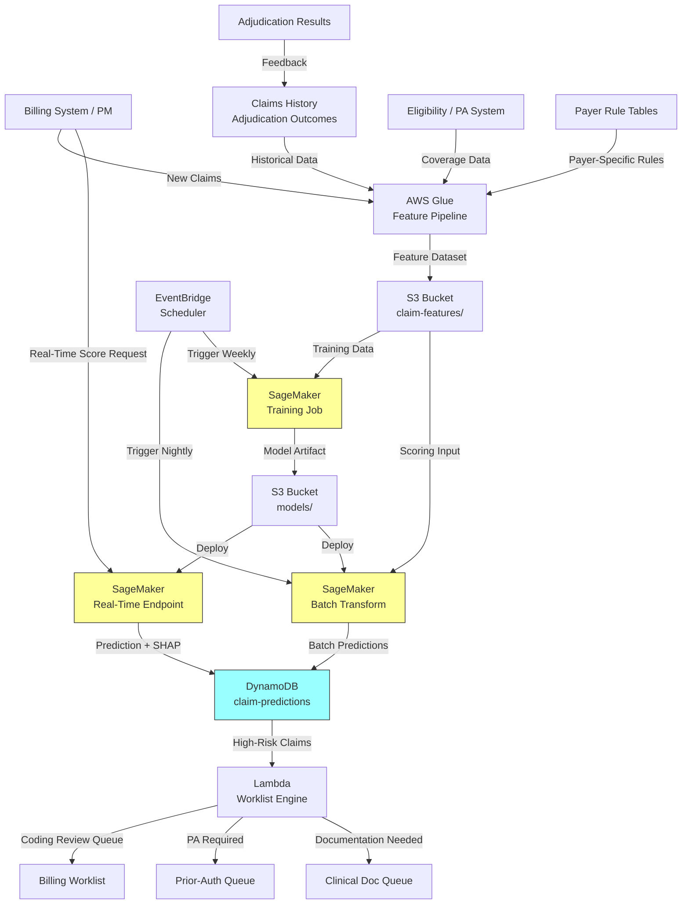

# Recipe 7.11 Architecture and Implementation: Claim Denial and Prior-Auth Determination Prediction

*Companion to [Recipe 7.11: Claim Denial and Prior-Auth Determination Prediction](chapter07.11-claim-denial-prediction). This page covers the AWS architecture, services, prerequisites, and pseudocode. For the problem framing and the conceptual approach, start with the main recipe.*

---

## The AWS Implementation

### Why These Services

**Amazon SageMaker for model training and real-time inference.** SageMaker handles the full ML lifecycle: training XGBoost/LightGBM models on historical claims data, hosting real-time endpoints for pre-billing scoring, and running batch transform for nightly portfolio-level scoring. The built-in XGBoost container supports the exact model type needed. SageMaker Clarify provides SHAP-based explainability out of the box, which is critical for generating the per-claim explanations that make this operationally useful. The billing system integration must be fail-open: if the endpoint is unavailable or times out (>500ms), submit the claim without a prediction and queue it for batch scoring in the next cycle. Use an SQS dead-letter queue to capture failed scoring requests so the nightly batch transform catches anything that missed real-time scoring.

**Amazon S3 for the claims data lake.** All historical claims, adjudication outcomes, feature datasets, and model artifacts live in S3. Claims data is PHI (it contains patient identifiers, diagnosis codes, and service dates), so SSE-KMS encryption is mandatory. Partitioning by date and payer enables efficient feature computation queries.

**AWS Glue for feature engineering.** The heavy ETL that joins claims history, eligibility data, payer rules, and provider statistics into model-ready feature sets. Glue handles the complex aggregations: computing rolling denial rates per payer-procedure combination, provider-specific denial patterns, and temporal features. Runs on a schedule and on-demand when new claim batches arrive.

**Amazon DynamoDB for prediction storage and real-time lookup.** Stores scored predictions with their explanations for fast lookup by claim ID. The billing system queries DynamoDB in real-time during claim creation to surface denial risk before submission. A GSI on `risk_score` enables the worklist engine to query all high-risk claims efficiently. Set TTL on prediction records based on your organization's retention policy: retain for the claim's appeal window (typically 60-180 days post-adjudication) plus an audit buffer. Archive to S3 Glacier for long-term compliance retention if needed.

**Amazon EventBridge for orchestration.** Triggers the feature pipeline when new adjudication data arrives, schedules nightly batch scoring, and triggers model retraining on a weekly cadence (or when monitoring detects drift).

**AWS Lambda for the worklist engine.** Reads predictions from DynamoDB, applies business rules (risk threshold, dollar amount filters), and routes flagged claims to the appropriate review queue. Generates human-readable explanations from SHAP values by mapping feature names to business descriptions.

**Amazon CloudWatch for model monitoring.** Tracks prediction distributions, accuracy metrics (comparing predictions to actual outcomes as they arrive), and operational metrics (how many claims are flagged, how many are reviewed, how many were actually denied).

### Architecture Diagram



### Prerequisites

| Requirement | Details |
|-------------|---------|
| **AWS Services** | Amazon SageMaker, Amazon S3, AWS Glue, Amazon DynamoDB, AWS Lambda, Amazon EventBridge, Amazon CloudWatch |
| **IAM Permissions** | Service-specific execution roles: (1) Glue role: `s3:GetObject`/`s3:PutObject` on feature and claims buckets, connectivity to billing/PM system; (2) SageMaker role: `s3:GetObject`/`s3:PutObject` on model and feature buckets, `kms:Decrypt`, `sagemaker:CreateEndpoint`; (3) Lambda worklist role: `dynamodb:Query`/`dynamodb:GetItem` on `arn:aws:dynamodb:*:*:table/claim-predictions` and its indexes, write to downstream queues; (4) EventBridge role: `lambda:InvokeFunction`, `sagemaker:CreateTransformJob`, `sagemaker:CreateTrainingJob`. All scoped to specific resource ARNs. |
| **BAA** | AWS BAA signed. Claims data is PHI: contains patient IDs, diagnosis codes, procedure codes, dates of service, and financial information. |
| **Encryption** | S3: SSE-KMS for all buckets (claims data, features, models). DynamoDB: encryption at rest enabled. SageMaker: KMS-encrypted training volumes and endpoint storage. All transit over TLS. |
| **VPC** | Production: SageMaker training and endpoints in VPC with interface endpoints for S3, DynamoDB, SageMaker API, CloudWatch Logs, and KMS. Glue jobs in VPC with connectivity to billing system (Direct Connect or VPN). Security groups restrict access to minimum required ports. Glue job security groups should restrict egress to the billing system's specific IP address and port only. |
| **CloudTrail** | Enabled for all API calls. Critical for audit: log who accessed predictions, when claims were flagged, and what actions were taken. Supports compliance review of model-influenced decisions. |
| **Sample Data** | Synthetic claims data with realistic denial patterns. Model denial rates of 10-15% overall with payer-specific and procedure-specific variation. Include common denial reasons (no PA, medical necessity, bundling, timely filing). Never use real claims in dev environments. |
| **Cost Estimate** | SageMaker training: ~$10-25 per weekly training run (ml.m5.2xlarge, 2-4 hours for large claim volumes). Real-time endpoint: ~$150-300/month (ml.m5.xlarge). Batch transform: ~$5-10 per nightly run. Glue: ~$1-3/DPU-hour. DynamoDB: ~$50-100/month. Total: ~$400-800/month for a mid-size health system. SHAP computation is the main cost variable for real-time scoring; at >2,000 daily flagged claims, consider auto-scaling the endpoint or pre-computing SHAP in the batch transform job. |

### Ingredients

| AWS Service | Role |
|------------|------|
| **Amazon SageMaker** | Train gradient-boosted tree classifiers on historical claims; host real-time and batch scoring endpoints; generate SHAP explanations via Clarify |
| **Amazon S3** | Store claims history, feature datasets, model artifacts, and batch prediction outputs |
| **AWS Glue** | ETL: join claims, eligibility, payer rules, and provider data; compute rolling denial rates and derived features |
| **Amazon DynamoDB** | Store predictions with SHAP explanations for real-time lookup by claim ID and risk-based querying |
| **Amazon EventBridge** | Orchestrate nightly batch scoring, weekly retraining, and drift-triggered retraining |
| **AWS Lambda** | Worklist engine: apply business rules to predictions, route flagged claims to review queues, generate human-readable explanations |
| **Amazon CloudWatch** | Monitor prediction distributions, model accuracy vs. actual outcomes, and pipeline health metrics |
| **AWS KMS** | Manage encryption keys for all data stores containing PHI |

### Code

#### Walkthrough

**Step 1: Feature engineering from claims history.** The Glue job pulls historical claims with known outcomes and computes the feature set the model needs. For each claim, it assembles procedure codes, diagnosis codes, payer-specific denial rates, provider-specific patterns, and structural claim features. The critical derived features are the payer-procedure denial rates (computed as rolling averages over the last 6-12 months) because they encode payer-specific rules that aren't documented anywhere accessible. Skip this step and your model has no knowledge of how individual payers actually behave.

```pseudocode
FUNCTION compute_claim_features(claims, outcomes, payer_history, provider_history):
    // For each claim, compute the feature vector for denial prediction.
    // The most important features are the interaction terms:
    // payer-specific denial rates for this procedure, this provider's
    // historical pattern with this payer, and diagnosis-procedure compatibility.

    features = empty list

    FOR each claim in claims:
        // --- Procedure and Diagnosis Features ---

        primary_cpt = claim.procedure_code           // e.g., "27447"
        primary_icd = claim.primary_diagnosis        // e.g., "M17.11"
        secondary_icds = claim.secondary_diagnoses   // list of ICD-10 codes
        modifier_list = claim.modifiers              // e.g., ["LT", "59"]

        // Encode the diagnosis-procedure pair as an interaction feature.
        // This is where most denial signal lives: specific dx-proc
        // combinations that violate medical necessity for a given payer.
        dx_proc_pair = hash(primary_cpt + "_" + primary_icd)

        // Count of diagnosis codes (more diagnoses can indicate complexity
        // that supports medical necessity, or sloppy coding)
        num_diagnoses = count(secondary_icds) + 1

        // --- Payer-Specific Features ---

        payer_id = claim.payer_id
        plan_id = claim.plan_id

        // The killer feature: what is this payer's denial rate for
        // this specific procedure code over the last 6 months?
        // This encodes payer rules that aren't in any public documentation.
        payer_proc_denial_rate = payer_history.denial_rate(
            payer_id, primary_cpt, lookback_months=6
        )

        // Same, but for the diagnosis-procedure pair
        payer_dx_proc_denial_rate = payer_history.denial_rate(
            payer_id, dx_proc_pair, lookback_months=6
        )

        // Does this payer require PA for this procedure?
        pa_required = payer_history.pa_required(payer_id, primary_cpt)
        pa_on_file = claim.prior_auth_number IS NOT NULL
        pa_active = claim.prior_auth_expiry > claim.date_of_service

        // --- Provider Features ---

        provider_id = claim.rendering_provider
        provider_type = claim.provider_type          // MD, DO, NP, PA, facility
        provider_specialty = claim.provider_specialty

        // This provider's overall denial rate with this payer
        provider_payer_denial_rate = provider_history.denial_rate(
            provider_id, payer_id, lookback_months=6
        )

        // This provider's denial rate for this specific procedure
        provider_proc_denial_rate = provider_history.denial_rate(
            provider_id, primary_cpt, lookback_months=6
        )

        // --- Claim Structural Features ---

        place_of_service = claim.place_of_service    // 11=office, 21=inpatient, 22=outpatient, 23=ED
        claim_amount = claim.total_charge
        claim_amount_log = log(claim.total_charge + 1)
        num_line_items = count(claim.line_items)
        days_since_service = days_between(claim.date_of_service, claim.submission_date)

        // Modifier analysis: are required modifiers present?
        has_modifier_25 = "25" IN modifier_list      // significant E/M
        has_modifier_59 = "59" IN modifier_list      // distinct procedural service
        has_modifier_26 = "26" IN modifier_list      // professional component

        // Is this a resubmission?
        is_resubmission = claim.frequency_code IN ["7", "8"]

        // --- Patient Context ---

        patient_age = claim.patient_age
        coverage_type = claim.coverage_type           // commercial, medicare, medicaid
        has_secondary_insurance = claim.secondary_payer IS NOT NULL

        // --- Temporal Features ---

        day_of_week_submitted = day_of_week(claim.submission_date)
        month_of_service = month(claim.date_of_service)
        end_of_year = month_of_service IN [11, 12]   // deductible met, different behavior

        // --- Bundling / Edit Risk ---

        // Check if this procedure has known NCCI edit conflicts
        // with other procedures on the same claim
        has_ncci_conflict = check_ncci_edits(claim.line_items)

        // Assemble feature vector
        feature_row = {
            claim_id: claim.id,
            primary_cpt: primary_cpt,
            primary_icd: primary_icd,
            dx_proc_pair: dx_proc_pair,
            num_diagnoses: num_diagnoses,
            payer_id: payer_id,
            payer_proc_denial_rate: payer_proc_denial_rate,
            payer_dx_proc_denial_rate: payer_dx_proc_denial_rate,
            pa_required: pa_required,
            pa_on_file: pa_on_file,
            pa_active: pa_active,
            provider_type: provider_type,
            provider_specialty: provider_specialty,
            provider_payer_denial_rate: provider_payer_denial_rate,
            provider_proc_denial_rate: provider_proc_denial_rate,
            place_of_service: place_of_service,
            claim_amount: claim_amount,
            claim_amount_log: claim_amount_log,
            num_line_items: num_line_items,
            days_since_service: days_since_service,
            has_modifier_25: has_modifier_25,
            has_modifier_59: has_modifier_59,
            has_modifier_26: has_modifier_26,
            is_resubmission: is_resubmission,
            patient_age: patient_age,
            coverage_type: coverage_type,
            has_secondary_insurance: has_secondary_insurance,
            day_of_week_submitted: day_of_week_submitted,
            end_of_year: end_of_year,
            has_ncci_conflict: has_ncci_conflict
        }

        append feature_row to features

    // Write to S3 partitioned by date for efficient training queries
    write features to S3 at "s3://claim-ml/features/denial-prediction/{date}/"
    RETURN features
```

**Step 2: Model training with class imbalance handling.** A SageMaker training job picks up historical claims with known outcomes (paid vs. denied) and trains a gradient-boosted tree classifier. The critical challenge here is class imbalance: if 12% of claims are denied, the model could achieve 88% accuracy by predicting "paid" for everything. That's useless. We need the model to identify the 12% correctly. Handle this with `scale_pos_weight` (ratio of negatives to positives) and evaluation on precision-recall curves rather than accuracy. Retrain weekly because payer rules change frequently (new PA requirements, coverage policy updates, contract renegotiations).

```pseudocode
FUNCTION train_denial_model(training_data_path):
    // Configure SageMaker training for binary classification
    // with heavy emphasis on identifying the minority class (denials).

    // Calculate class weight from the training data
    // If 12% denial rate: scale_pos_weight = 0.88 / 0.12 = 7.3
    denial_rate = count_denials / total_claims
    pos_weight = (1 - denial_rate) / denial_rate

    training_config = {
        algorithm: "xgboost",
        objective: "binary:logistic",
        eval_metric: ["aucpr", "auc"],     // area under precision-recall curve
                                                 // is more informative than AUC-ROC
                                                 // for imbalanced data
        num_round: 500,
        max_depth: 6,
        eta: 0.03,                  // low learning rate for stability
        subsample: 0.8,
        colsample_bytree: 0.7,
        scale_pos_weight: pos_weight,            // critical for class imbalance
        min_child_weight: 10,                    // regularization: require at
                                                 // least 10 samples per leaf
        gamma: 0.1,                   // minimum loss reduction for split
        input_data: training_data_path,
        output_path: "s3://claim-ml/models/denial-prediction/",
        instance_type: "ml.m5.2xlarge",
        validation_split: 0.2,
        early_stopping: 20                     // stop if no improvement for 20 rounds
    }

    // Launch training job
    model_artifact = sagemaker.train(training_config)

    // Post-training: compute SHAP values on validation set
    // This pre-computes the baseline expected value and validates
    // that explanations are sensible before deployment.
    shap_baseline = sagemaker_clarify.compute_shap_baseline(
        model=model_artifact,
        data=validation_set,
        num_samples=1000
    )

    // Evaluate on holdout set with business-relevant metrics
    evaluation = {
        auc_roc: compute_auc(holdout_predictions, holdout_labels),
        auc_pr: compute_aucpr(holdout_predictions, holdout_labels),
        precision_at_80_recall: compute_precision_at_recall(0.80),
        recall_at_80_precision: compute_recall_at_precision(0.80),
        // At what threshold do we catch 80% of denials?
        // What's the false alarm rate at that threshold?
        threshold_for_80_recall: find_threshold(recall=0.80),
        false_positive_rate_at_80_recall: compute_fpr_at_recall(0.80)
    }

    RETURN model_artifact, evaluation, shap_baseline
```

**Step 3: Real-time scoring at claim creation.** When a coder finalizes a claim in the billing system, the system calls the SageMaker real-time endpoint to get a denial probability and explanation before submission. If the probability exceeds the threshold, the system surfaces a warning with specific reasons. The coder can then fix the issue, override the warning with a reason, or route to a supervisor. Every override must be logged: capture the coder's identity, a reason code (e.g., "documentation confirms medical necessity," "PA obtained through alternate channel"), and timestamp. Store overrides in the prediction table with `status: OVERRIDDEN`. Track override rates per coder and per risk tier; high override rates at the HIGH tier may indicate model drift or training gaps. This is the highest-value prediction point because the intervention (fixing the claim) costs nearly nothing compared to reworking a denial later.

```pseudocode
FUNCTION score_claim_realtime(claim):
    // Called by the billing system when a claim is ready for submission.
    // Returns a risk assessment with actionable explanations.

    // Compute features for this single claim (same logic as batch)
    features = compute_single_claim_features(claim)

    // Call SageMaker real-time endpoint
    response = sagemaker_endpoint.invoke(
        endpoint_name="denial-prediction-prod",
        content_type="text/csv",
        body=serialize_features(features)
    )

    denial_probability = response.prediction

    // Generate explanation using SHAP
    // Only compute SHAP for claims above the alert threshold
    // (SHAP computation adds ~50ms latency)
    IF denial_probability > ALERT_THRESHOLD: // e.g., 0.50
        shap_values = sagemaker_clarify.explain(
            endpoint="denial-prediction-prod",
            instance=features,
            num_features=5              // top 5 contributing factors
        )

        // Map SHAP features to human-readable explanations
        explanations = []
        FOR each (feature_name, shap_value) in top_shap_values:
            explanation = map_feature_to_explanation(
                feature_name, shap_value, features
            )
            append explanation to explanations

        // Example explanation output:
        // "Payer BlueCross denies 67% of CPT 27447 claims without active PA"
        // "Provider Dr. Smith has a 34% denial rate with this payer (org avg: 11%)"
        // "No modifier 59 present for bundled procedure pair"
        //
        // Consider tiering explanation visibility. Claim-level explanations
        // (missing PA, modifier issue) are safe for all coders.
        // Provider-level performance explanations should be restricted to
        // supervisors or quality improvement staff, depending on your
        // state's peer review privilege laws.

    // Store prediction in DynamoDB for audit and worklist
    dynamodb.put_item(
        table="claim-predictions",
        item={
            claim_id: claim.id,
            score_date: today(),
            denial_probability: denial_probability,
            risk_tier: classify_risk(denial_probability),
            top_risk_factors: explanations,
            model_version: current_model_version,
            claim_amount: claim.total_charge,
            expected_loss: denial_probability * claim.total_charge,
            prediction_point: "PRE_BILLING",
            status: "PENDING_REVIEW" if denial_probability > ALERT_THRESHOLD
                                else "AUTO_CLEARED"
        }
    )

    RETURN {
        denial_probability: denial_probability,
        risk_tier: classify_risk(denial_probability),
        explanations: explanations,
        recommended_action: determine_action(denial_probability, explanations)
    }

FUNCTION classify_risk(probability):
    IF probability > 0.70: RETURN "HIGH"
    IF probability > 0.40: RETURN "MEDIUM"
    RETURN "LOW"

FUNCTION determine_action(probability, explanations):
    // Map risk factors to specific corrective actions
    IF any explanation mentions "prior auth required" AND NOT pa_on_file:
        RETURN "Obtain prior authorization before submission"
    IF any explanation mentions "modifier missing":
        RETURN "Review modifier requirements for this procedure combination"
    IF any explanation mentions "medical necessity":
        RETURN "Attach supporting clinical documentation"
    IF probability > 0.70:
        RETURN "Route to coding supervisor for review before submission"
    RETURN "Review flagged risk factors; submit if confident"
```

**Step 4: Batch scoring and worklist generation.** Nightly, the batch transform job scores all pending claims (submitted but not yet adjudicated) and all upcoming scheduled procedures (pre-visit prediction). The Lambda worklist engine reads the scored predictions and generates prioritized work queues: claims to review before submission, PAs to initiate, and expected denials to prepare appeals for in advance. The prioritization is by expected loss (denial probability times claim amount), which focuses staff time on the highest-value interventions.

```pseudocode
FUNCTION generate_worklists(predictions_table):
    // Lambda function triggered after batch scoring completes.
    // Reads all high-risk predictions and routes to appropriate queues.

    // Query DynamoDB for all predictions above threshold, scored today
    high_risk_claims = dynamodb.query(
        table="claim-predictions",
        index="risk-score-index",
        key_condition="score_date = today() AND denial_probability > 0.40",
        sort_by="expected_loss DESC"
    )

    // Route to appropriate queues based on risk factors
    coding_review_queue = []
    pa_initiation_queue = []
    documentation_queue = []
    appeal_prep_queue = []

    FOR each prediction in high_risk_claims:
        risk_factors = prediction.top_risk_factors

        IF prediction.prediction_point == "PRE_VISIT":
            IF "prior auth required" in risk_factors:
                append to pa_initiation_queue: {
                    claim_id: prediction.claim_id,
                    patient: prediction.patient_id,
                    procedure: prediction.primary_cpt,
                    payer: prediction.payer_id,
                    denial_prob: prediction.denial_probability,
                    reason: "PA required but not on file",
                    expected_loss: prediction.expected_loss
                }

        ELSE IF prediction.prediction_point == "PRE_BILLING":
            IF "modifier" in any risk_factor OR "coding" in any risk_factor:
                append to coding_review_queue
            ELSE IF "documentation" in any risk_factor OR "medical necessity" in any risk_factor:
                append to documentation_queue
            ELSE:
                append to coding_review_queue   // default: human review

        ELSE IF prediction.prediction_point == "POST_SUBMISSION":
            IF prediction.denial_probability > 0.70:
                append to appeal_prep_queue: {
                    claim_id: prediction.claim_id,
                    denial_prob: prediction.denial_probability,
                    likely_reason: top_risk_factor,
                    prep_action: "Gather documentation for appeal"
                }

    // Write worklists to downstream systems
    publish_to_queue("coding-review", coding_review_queue)
    publish_to_queue("pa-initiation", pa_initiation_queue)
    publish_to_queue("documentation-request", documentation_queue)
    publish_to_queue("appeal-preparation", appeal_prep_queue)

    // Emit metrics
    cloudwatch.put_metrics({
        "HighRiskClaimsToday": count(high_risk_claims),
        "CodingReviewQueued": count(coding_review_queue),
        "PAInitiationQueued": count(pa_initiation_queue),
        "DocumentationQueued": count(documentation_queue),
        "TotalExpectedLossAtRisk": sum(high_risk_claims.expected_loss)
    })
```

> **Curious how this looks in Python?** The pseudocode above covers the concepts. If you'd like to see sample Python code that demonstrates these patterns using boto3, check out the [Python Example](chapter07.11-python-example). It walks through each step with inline comments and notes on what you'd need to change for a real deployment.

### Expected Results

**Sample prediction output:**

```json
{
  "claim_id": "CLM-2024-0847291",
  "denial_probability": 0.78,
  "risk_tier": "HIGH",
  "model_version": "v2.3.1-weekly-20240615",
  "prediction_point": "PRE_BILLING",
  "top_risk_factors": [
    {
      "feature": "payer_proc_denial_rate",
      "shap_contribution": 0.23,
      "explanation": "UnitedHealthcare denies 71% of CPT 29881 (knee arthroscopy) claims from outpatient settings without prior authorization"
    },
    {
      "feature": "pa_required_but_missing",
      "shap_contribution": 0.19,
      "explanation": "Prior authorization is required for this procedure by this payer but no active PA is on file"
    },
    {
      "feature": "provider_payer_denial_rate",
      "shap_contribution": 0.08,
      "explanation": "This provider has a 28% denial rate with UnitedHealthcare (organization average: 11%)"
    }
  ],
  "recommended_action": "Obtain prior authorization before submission",
  "expected_loss": 5460.00,
  "claim_amount": 7000.00
}
```

**Performance benchmarks:**

| Metric | Value | Notes |
|--------|-------|-------|
| AUC-ROC | 0.82-0.88 | Varies by payer mix and data quality |
| AUC-PR | 0.55-0.65 | More meaningful for imbalanced data |
| Precision at 80% recall | 0.45-0.55 | At the threshold catching 80% of denials, about half the flags are true denials |
| Recall at 70% precision | 0.50-0.60 | If you only want to flag when you're 70% confident, you'll catch about half of actual denials |
| Real-time latency | 50-150ms | Including SHAP explanation |
| Batch scoring throughput | ~50,000 claims/hour | ml.m5.2xlarge batch transform |
| Feature pipeline runtime | 30-90 minutes | Depends on claims volume and lookback window |
| Weekly retraining time | 2-4 hours | Full retrain on 12 months of claims history |

**Where it struggles:**

- New payers with limited history (cold start problem for the payer-specific features)
- Rare procedure codes with fewer than 50 historical submissions
- Policy changes that haven't yet generated enough denied claims for the model to learn from
- Claims with novel diagnosis-procedure combinations never seen in training
- Multi-line claims where denial is driven by interactions between line items

---

## Variations and Extensions

**Payer-specific model ensemble.** Instead of one model for all payers, train separate models for each major payer (your top 5-10 payers by volume). Each payer has different denial patterns, different rules, and different features that matter. A UnitedHealthcare model might weight PA status heavily while a Medicare model might weight diagnosis specificity. Ensemble the payer-specific models with a generic model for low-volume payers. This typically adds 3-5 points of AUC over a single global model.

**Denial reason prediction (multi-class).** Instead of binary (deny/pay), predict the specific denial reason code (CO-4, CO-16, CO-29, CO-197, etc.). This makes the explanation more actionable: "likely denial for medical necessity (CO-50)" tells the coder exactly what documentation to attach. Implementation uses multi-class classification (one-vs-rest or softmax output). Requires sufficient training examples for each denial reason code (aggregate rare codes into categories).

**Appeal success prediction.** Once a claim is denied, predict the likelihood of a successful appeal. Features include the denial reason, the claim characteristics, historical appeal success rates for similar claims, and whether supporting documentation is available. This helps prioritize which denials to appeal (high-value claims with high appeal success probability) versus which to write off (low-value claims with low appeal probability).

---

## Additional Resources

**AWS Documentation:**
- [Amazon SageMaker XGBoost Algorithm](https://docs.aws.amazon.com/sagemaker/latest/dg/xgboost.html)
- [Amazon SageMaker Real-time Inference](https://docs.aws.amazon.com/sagemaker/latest/dg/realtime-endpoints.html)
- [Amazon SageMaker Batch Transform](https://docs.aws.amazon.com/sagemaker/latest/dg/batch-transform.html)
- [Amazon SageMaker Clarify for Explainability](https://docs.aws.amazon.com/sagemaker/latest/dg/clarify-model-explainability.html)
- [Amazon SageMaker Model Monitor](https://docs.aws.amazon.com/sagemaker/latest/dg/model-monitor.html)
- [AWS Glue Developer Guide](https://docs.aws.amazon.com/glue/latest/dg/what-is-glue.html)
- [Amazon DynamoDB Developer Guide](https://docs.aws.amazon.com/amazondynamodb/latest/developerguide/Introduction.html)
- [AWS HIPAA Eligible Services](https://aws.amazon.com/compliance/hipaa-eligible-services-reference/)
- [Architecting for HIPAA on AWS](https://docs.aws.amazon.com/whitepapers/latest/architecting-hipaa-security-and-compliance-on-aws/welcome.html)

**AWS Sample Repos:**
- [`amazon-sagemaker-examples`](https://github.com/aws/amazon-sagemaker-examples): Comprehensive SageMaker examples including XGBoost classification, batch transform, real-time inference, and model monitoring
- [`amazon-sagemaker-clarify`](https://github.com/aws/amazon-sagemaker-clarify): Bias detection and SHAP-based explainability examples directly applicable to the fairness monitoring needed for denial prediction
- [`aws-healthcare-lifescience-ai-ml`](https://github.com/aws-samples/aws-healthcare-lifescience-ai-ml): Healthcare and life science ML examples on AWS including patient outcome prediction patterns

**AWS Solutions and Blogs:**
- [Machine Learning Best Practices in Healthcare and Life Sciences](https://aws.amazon.com/blogs/machine-learning/machine-learning-best-practices-in-healthcare-and-life-sciences/): Best practices for healthcare ML including model governance and explainability
- [Amazon SageMaker Pricing](https://aws.amazon.com/sagemaker/pricing/): Current pricing for training, inference, batch transform, and Clarify

---

## Estimated Implementation Time

| Phase | Duration |
|-------|----------|
| **Basic** (single model, pre-billing scoring, manual threshold tuning) | 6-8 weeks |
| **Production-ready** (real-time endpoint, SHAP explanations, payer-specific tuning, fairness monitoring, weekly retraining) | 14-20 weeks |
| **With variations** (payer-specific ensemble, multi-class denial reason, appeal success prediction) | 24-32 weeks |

---


---

*← [Main Recipe 7.11](chapter07.11-claim-denial-prediction) · [Python Example](chapter07.11-python-example) · [Chapter Preface](chapter07-preface)*
