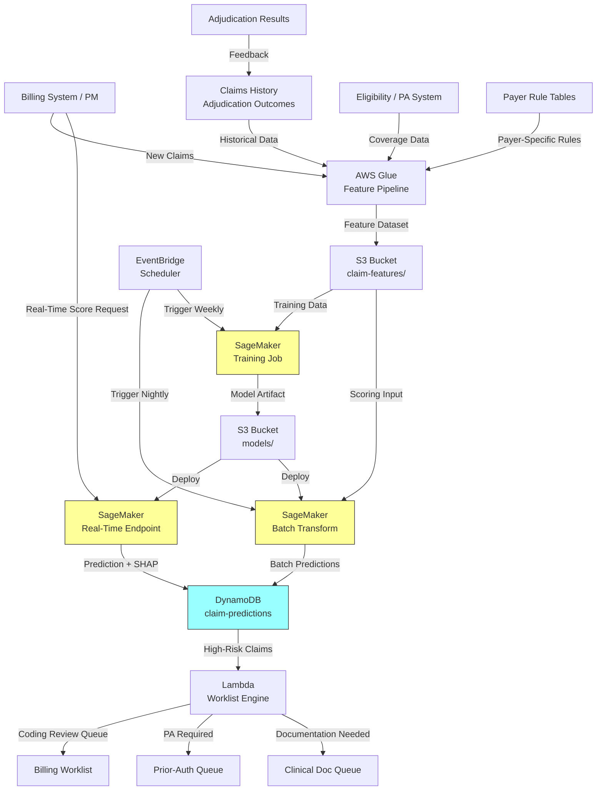

# Recipe 7.11: Claim Denial and Prior-Auth Determination Prediction

**Complexity:** Medium-Complex · **Phase:** MVP · **Estimated Cost:** ~$0.002 per prediction

---

## The Problem

Here's a number that should make every revenue cycle leader lose sleep: the average health system's initial claim denial rate sits between 10% and 15%. That sounds manageable until you do the math. A mid-size hospital submitting 500,000 claims per year at a 12% denial rate means 60,000 claims bouncing back. Each denied claim costs $25 to $118 to rework (depending on complexity and how many times it ping-pongs), and about 60% of denied claims are never resubmitted at all. That's revenue evaporating because the rework process is too expensive or too slow to justify the effort.

The industry collectively writes off billions annually to denials that were preventable. Not "theoretically preventable in a perfect world" preventable. Preventable in the sense that a human reviewer with enough time and context would have caught the issue before submission. The problem isn't knowledge; it's volume. A coder reviewing 80 claims per day cannot cross-reference every diagnosis-procedure pair against every payer's specific coverage rules against every modifier requirement against the patient's specific benefit plan.

What if you could predict, before a claim leaves your building, whether a payer is likely to deny it? Not as a vague "this claim seems risky" flag, but as a specific probability with an explanation: "This claim has a 73% chance of denial because Payer X denies CPT 27447 without prior authorization when the patient is under 60, and this patient is 54 with no PA on file."

That prediction lets you do two distinct things. First, you can fix the claim before submission (add the missing documentation, correct the modifier, obtain the PA). Second, you can prioritize your denial management team's workload: when denials do come back, work the ones with the highest dollar value and the highest likelihood of successful appeal first.

There's an important framing distinction here. This recipe covers the provider-side problem: predicting how a payer will adjudicate your claim. A provider organization building this model is essentially reverse-engineering the payer's decision logic from historical outcomes. That's different from a payer building its own adjudication support model (which would have access to internal coverage rules, medical policies, and utilization management criteria directly). Both are valid ML applications, but the data landscape, feature availability, and ethical considerations differ significantly. We'll focus on the provider perspective because that's where the pain is loudest and the data access constraints are most interesting.

For prior-authorization predictions specifically, the value proposition is even clearer. If you can predict that a PA request is likely to be denied before you submit it, you can strengthen the clinical documentation, escalate to peer-to-peer review proactively, or route the patient to an alternative covered pathway. The typical PA determination timeline is 3-5 business days for standard requests (longer for complex cases), and every day of delay is a day the patient waits for care.

---

## The Technology: Supervised Classification on Tabular Claims Data

### Why This Is a Classification Problem (Not Clustering)

Let's be precise about what we're building. This is a supervised classification problem. The outcome variable is a known categorical label: paid, denied, or (for prior-auth) approved, denied, or pended. You have abundant labeled historical data because every claim your organization has ever submitted has a final adjudication status. Every PA request has a determination.

That's the ideal setup for supervised learning. You have input features (everything you know about the claim at submission time), a target variable (what actually happened), and hundreds of thousands of labeled examples to learn from.

Unsupervised methods like clustering are complementary but not the core predictor. You might cluster denial reasons to discover patterns ("these 12 denial codes all map to the same underlying documentation issue"), or use clustering for feature discovery ("claims from providers in this behavioral cluster get denied at higher rates"). Those are useful upstream steps for feature engineering. But the prediction itself is a supervised classification task with a clear ground truth label.

### Gradient-Boosted Trees: The Workhorse

For tabular data with mixed feature types (categorical codes, numerical amounts, binary flags, interaction features), gradient-boosted tree ensembles (XGBoost, LightGBM, CatBoost) are the default choice for good reason. They handle the feature landscape of claims data naturally:

**High-cardinality categoricals.** There are roughly 10,000 CPT codes, 70,000 ICD-10 codes, and hundreds of payer-plan combinations. Boosted trees handle categorical splits natively (LightGBM, CatBoost) or work well with target encoding (XGBoost). Deep learning approaches would need embedding layers and significantly more training data to match performance on this feature type.

**Non-linear interactions.** The denial probability for CPT 27447 (knee replacement) isn't just about the procedure code; it's about the procedure code crossed with the payer, crossed with whether prior auth was obtained, crossed with the patient's age. Boosted trees discover these interactions automatically through their recursive splitting. You don't need to hand-engineer every two-way and three-way feature combination.

**Missing data tolerance.** Real claims data is messy. Not every claim has every field populated. Tree models handle missing values natively (they learn which direction to send missing values at each split). This is a practical advantage over logistic regression, which requires imputation decisions for every missing feature.

**Baseline models for comparison.** Always start with logistic regression as a baseline. It's fast, interpretable, and gives you a floor to beat. If logistic regression with a few well-chosen features gets you to 0.78 AUC, you know the signal is there. Random forests are a natural second baseline: they give you feature importance for free and are harder to overfit than a single gradient-boosted model.

Why not deep learning? For structured tabular data with under a million rows, gradient-boosted trees consistently match or beat neural networks in benchmarks. The claims data landscape (high-cardinality categoricals, sparse interaction effects, moderate dataset sizes) is exactly where tree models shine. You'd consider deep learning if you were incorporating unstructured data (clinical notes, faxed documents) into the prediction, but for the structured claim fields alone, stick with trees.

### Explainability Is Not Optional

Here's where claim denial prediction differs from, say, ad click prediction. Every flagged claim needs a defensible reason. When your model says "this claim has a 78% denial probability," the coder or biller reviewing it needs to know why. "The model says so" is not actionable. "The model flagged this because Payer X denies 67% of claims with this diagnosis-procedure combination when the place of service is outpatient, and your historical denial rate with this payer for similar claims is 71%" is actionable.

SHAP (SHapley Additive exPlanations) values give you exactly this. For each prediction, SHAP decomposes the output into per-feature contributions. You can say: "These three features pushed the denial probability up by 0.35, and these two features pushed it down by 0.12." The biller can then look at the top risk factors and decide which ones are fixable before submission.

This isn't just nice-to-have. It's operationally essential. A model without explanations is a model nobody trusts, and a model nobody trusts is a model nobody uses.

### The Feature Space

The features that predict claim determinations fall into several categories:

**Procedure and diagnosis codes.** The CPT/HCPCS procedure code, ICD-10 diagnosis codes (primary and secondary), and critically, the diagnosis-procedure pairs. A diagnosis code alone might be perfectly fine. A procedure code alone might be perfectly fine. But the combination might violate medical necessity criteria for a specific payer. These pairs (and triples) are where most of the predictive signal lives.

**Payer-specific context.** Payer ID, specific plan/product, the payer's historical denial rate for this procedure code, and whether payer-specific rules require prior authorization, specific modifiers, or documentation. Different payers have wildly different denial patterns for the same procedure.

**Provider context.** Provider type (physician, NP, facility), provider specialty, the specific provider's historical denial rate (some providers consistently code in ways that trigger denials), and the rendering vs. billing provider relationship.

**Claim structural features.** Place of service, modifiers (26, TC, 59, etc.), units billed, claim amount, number of line items, whether this is an initial submission or resubmission, and the time elapsed since date of service.

**Prior-authorization status.** Whether PA was required, whether it was obtained, whether it's still active (PAs expire), and the PA determination for the specific service.

**Patient context.** Patient age, coverage type (commercial, Medicare, Medicaid), whether the patient has a deductible remaining, coordination of benefits status, and whether the patient has had similar claims denied previously.

**Modifier and bundling signals.** Whether the procedure has common unbundling issues, whether required modifiers are present, whether the claim contains procedure combinations known to trigger NCCI edits.

### Three Prediction Points in the Claim Lifecycle

You can deploy denial prediction at three distinct points, each with different feature availability and different intervention options:

**Pre-visit (eligibility and PA risk).** Before the patient arrives, predict whether the planned service will need prior authorization and whether that PA is likely to be approved. Features available: planned procedure, diagnosis, payer, patient coverage, provider. Intervention: obtain PA proactively, gather supporting documentation, consider alternative covered pathways.

**Pre-billing (coding and submission risk).** After the service is rendered but before the claim is submitted, predict whether the coded claim will be denied. Features available: everything from pre-visit plus actual codes assigned, modifiers, place of service, units. Intervention: fix coding errors, add missing modifiers, attach required documentation, correct diagnosis-procedure mismatches.

**Post-submission (payer behavior prediction).** After the claim is submitted, predict the payer's determination based on the full claim plus payer-specific behavioral patterns. Features available: the complete claim plus payer response history. Intervention: prioritize follow-up, prepare appeal documentation in advance, allocate denial management resources.

Each prediction point is essentially a different model (different features available, different outcome windows, different interventions). Most organizations start with pre-billing because it has the highest ROI: you have the most features available and the intervention (fixing the claim before submission) is the cheapest.

### General Architecture Pattern

```text
[Claims Data Lake] → [Feature Pipeline] → [Model Training (periodic)]
                                        → [Scoring Service (batch + real-time)]
                                        → [Explanation Service]
                                        → [Worklist / Alert Engine]
                                        → [Feedback Loop (actual outcomes)]
```

The pipeline has these logical stages:

1. **Feature pipeline.** Pulls historical claims with outcomes, computes derived features (payer-procedure denial rates, provider denial rates, diagnosis-procedure compatibility scores), and maintains a feature store that's refreshed as new outcomes arrive.

2. **Model training.** Periodic retraining (weekly or monthly) on claims with known outcomes. Trains multiple models: one per prediction point, potentially one per major payer. Evaluates against holdout data with emphasis on precision at the high-risk threshold (you don't want too many false alarms annoying your coders).

3. **Scoring service.** Batch scoring (nightly for all pending claims) and real-time scoring (at the point of claim creation in the billing system). Outputs a denial probability plus top contributing features.

4. **Explanation service.** For each high-risk prediction, generates human-readable explanations: "This claim is flagged because [reason 1], [reason 2], [reason 3]." Maps SHAP values to business-language descriptions.

5. **Worklist engine.** Routes flagged claims to appropriate queues: coding review, documentation requests, PA initiation. Prioritizes by dollar amount multiplied by denial probability (expected loss).

6. **Feedback loop.** When claims are adjudicated (paid or denied), the outcome feeds back into the training data. This is your ground truth. Track model accuracy over time and trigger retraining when performance degrades (payer rule changes are the most common drift source).

---

## The AWS Implementation

### Why These Services

**Amazon SageMaker for model training and real-time inference.** SageMaker handles the full ML lifecycle: training XGBoost/LightGBM models on historical claims data, hosting real-time endpoints for pre-billing scoring, and running batch transform for nightly portfolio-level scoring. The built-in XGBoost container supports the exact model type needed. SageMaker Clarify provides SHAP-based explainability out of the box, which is critical for generating the per-claim explanations that make this operationally useful.

**Amazon S3 for the claims data lake.** All historical claims, adjudication outcomes, feature datasets, and model artifacts live in S3. Claims data is PHI (it contains patient identifiers, diagnosis codes, and service dates), so SSE-KMS encryption is mandatory. Partitioning by date and payer enables efficient feature computation queries.

**AWS Glue for feature engineering.** The heavy ETL that joins claims history, eligibility data, payer rules, and provider statistics into model-ready feature sets. Glue handles the complex aggregations: computing rolling denial rates per payer-procedure combination, provider-specific denial patterns, and temporal features. Runs on a schedule and on-demand when new claim batches arrive.

**Amazon DynamoDB for prediction storage and real-time lookup.** Stores scored predictions with their explanations for fast lookup by claim ID. The billing system queries DynamoDB in real-time during claim creation to surface denial risk before submission. A GSI on `risk_score` enables the worklist engine to query all high-risk claims efficiently.

**Amazon EventBridge for orchestration.** Triggers the feature pipeline when new adjudication data arrives, schedules nightly batch scoring, and triggers model retraining on a weekly cadence (or when monitoring detects drift).

**AWS Lambda for the worklist engine.** Reads predictions from DynamoDB, applies business rules (risk threshold, dollar amount filters), and routes flagged claims to the appropriate review queue. Generates human-readable explanations from SHAP values by mapping feature names to business descriptions.

**Amazon CloudWatch for model monitoring.** Tracks prediction distributions, accuracy metrics (comparing predictions to actual outcomes as they arrive), and operational metrics (how many claims are flagged, how many are reviewed, how many were actually denied).

### Architecture Diagram



### Prerequisites

| Requirement | Details |
|-------------|---------|
| **AWS Services** | Amazon SageMaker, Amazon S3, AWS Glue, Amazon DynamoDB, AWS Lambda, Amazon EventBridge, Amazon CloudWatch |
| **IAM Permissions** | Service-specific execution roles: (1) Glue role: `s3:GetObject`/`s3:PutObject` on feature and claims buckets, connectivity to billing/PM system; (2) SageMaker role: `s3:GetObject`/`s3:PutObject` on model and feature buckets, `kms:Decrypt`, `sagemaker:CreateEndpoint`; (3) Lambda worklist role: `dynamodb:Query`/`dynamodb:GetItem`, write to downstream queues; (4) EventBridge role: `lambda:InvokeFunction`, `sagemaker:CreateTransformJob`, `sagemaker:CreateTrainingJob`. All scoped to specific resource ARNs. |
| **BAA** | AWS BAA signed. Claims data is PHI: contains patient IDs, diagnosis codes, procedure codes, dates of service, and financial information. |
| **Encryption** | S3: SSE-KMS for all buckets (claims data, features, models). DynamoDB: encryption at rest enabled. SageMaker: KMS-encrypted training volumes and endpoint storage. All transit over TLS. |
| **VPC** | Production: SageMaker training and endpoints in VPC with interface endpoints for S3, DynamoDB, SageMaker API, CloudWatch Logs, and KMS. Glue jobs in VPC with connectivity to billing system (Direct Connect or VPN). Security groups restrict access to minimum required ports. |
| **CloudTrail** | Enabled for all API calls. Critical for audit: log who accessed predictions, when claims were flagged, and what actions were taken. Supports compliance review of model-influenced decisions. |
| **Sample Data** | Synthetic claims data with realistic denial patterns. Model denial rates of 10-15% overall with payer-specific and procedure-specific variation. Include common denial reasons (no PA, medical necessity, bundling, timely filing). Never use real claims in dev environments. |
| **Cost Estimate** | SageMaker training: ~$10-25 per weekly training run (ml.m5.2xlarge, 2-4 hours for large claim volumes). Real-time endpoint: ~$150-300/month (ml.m5.xlarge). Batch transform: ~$5-10 per nightly run. Glue: ~$1-3/DPU-hour. DynamoDB: ~$50-100/month. Total: ~$400-800/month for a mid-size health system. |

### Ingredients

| AWS Service | Role |
|------------|------|
| **Amazon SageMaker** | Train gradient-boosted tree classifiers on historical claims; host real-time and batch scoring endpoints; generate SHAP explanations via Clarify |
| **Amazon S3** | Store claims history, feature datasets, model artifacts, and batch prediction outputs |
| **AWS Glue** | ETL: join claims, eligibility, payer rules, and provider data; compute rolling denial rates and derived features |
| **Amazon DynamoDB** | Store predictions with SHAP explanations for real-time lookup by claim ID and risk-based querying |
| **Amazon EventBridge** | Orchestrate nightly batch scoring, weekly retraining, and drift-triggered retraining |
| **AWS Lambda** | Worklist engine: apply business rules to predictions, route flagged claims to review queues, generate human-readable explanations |
| **Amazon CloudWatch** | Monitor prediction distributions, model accuracy vs. actual outcomes, and pipeline health metrics |
| **AWS KMS** | Manage encryption keys for all data stores containing PHI |

### Code

#### Walkthrough

**Step 1: Feature engineering from claims history.** The Glue job pulls historical claims with known outcomes and computes the feature set the model needs. For each claim, it assembles procedure codes, diagnosis codes, payer-specific denial rates, provider-specific patterns, and structural claim features. The critical derived features are the payer-procedure denial rates (computed as rolling averages over the last 6-12 months) because they encode payer-specific rules that aren't documented anywhere accessible. Skip this step and your model has no knowledge of how individual payers actually behave.

```pseudocode
FUNCTION compute_claim_features(claims, outcomes, payer_history, provider_history):
    // For each claim, compute the feature vector for denial prediction.
    // The most important features are the interaction terms:
    // payer-specific denial rates for this procedure, this provider's
    // historical pattern with this payer, and diagnosis-procedure compatibility.

    features = empty list

    FOR each claim in claims:
        // --- Procedure and Diagnosis Features ---

        primary_cpt = claim.procedure_code           // e.g., "27447"
        primary_icd = claim.primary_diagnosis        // e.g., "M17.11"
        secondary_icds = claim.secondary_diagnoses   // list of ICD-10 codes
        modifier_list = claim.modifiers              // e.g., ["LT", "59"]

        // Encode the diagnosis-procedure pair as an interaction feature.
        // This is where most denial signal lives: specific dx-proc
        // combinations that violate medical necessity for a given payer.
        dx_proc_pair = hash(primary_cpt + "_" + primary_icd)

        // Count of diagnosis codes (more diagnoses can indicate complexity
        // that supports medical necessity, or sloppy coding)
        num_diagnoses = count(secondary_icds) + 1

        // --- Payer-Specific Features ---

        payer_id = claim.payer_id
        plan_id = claim.plan_id

        // The killer feature: what is this payer's denial rate for
        // this specific procedure code over the last 6 months?
        // This encodes payer rules that aren't in any public documentation.
        payer_proc_denial_rate = payer_history.denial_rate(
            payer_id, primary_cpt, lookback_months=6
        )

        // Same, but for the diagnosis-procedure pair
        payer_dx_proc_denial_rate = payer_history.denial_rate(
            payer_id, dx_proc_pair, lookback_months=6
        )

        // Does this payer require PA for this procedure?
        pa_required = payer_history.pa_required(payer_id, primary_cpt)
        pa_on_file = claim.prior_auth_number IS NOT NULL
        pa_active = claim.prior_auth_expiry > claim.date_of_service

        // --- Provider Features ---

        provider_id = claim.rendering_provider
        provider_type = claim.provider_type          // MD, DO, NP, PA, facility
        provider_specialty = claim.provider_specialty

        // This provider's overall denial rate with this payer
        provider_payer_denial_rate = provider_history.denial_rate(
            provider_id, payer_id, lookback_months=6
        )

        // This provider's denial rate for this specific procedure
        provider_proc_denial_rate = provider_history.denial_rate(
            provider_id, primary_cpt, lookback_months=6
        )

        // --- Claim Structural Features ---

        place_of_service = claim.place_of_service    // 11=office, 21=inpatient, 22=outpatient, 23=ED
        claim_amount = claim.total_charge
        claim_amount_log = log(claim.total_charge + 1)
        num_line_items = count(claim.line_items)
        days_since_service = days_between(claim.date_of_service, claim.submission_date)

        // Modifier analysis: are required modifiers present?
        has_modifier_25 = "25" IN modifier_list      // significant E/M
        has_modifier_59 = "59" IN modifier_list      // distinct procedural service
        has_modifier_26 = "26" IN modifier_list      // professional component

        // Is this a resubmission?
        is_resubmission = claim.frequency_code IN ["7", "8"]

        // --- Patient Context ---

        patient_age = claim.patient_age
        coverage_type = claim.coverage_type           // commercial, medicare, medicaid
        has_secondary_insurance = claim.secondary_payer IS NOT NULL

        // --- Temporal Features ---

        day_of_week_submitted = day_of_week(claim.submission_date)
        month_of_service = month(claim.date_of_service)
        end_of_year = month_of_service IN [11, 12]   // deductible met, different behavior

        // --- Bundling / Edit Risk ---

        // Check if this procedure has known NCCI edit conflicts
        // with other procedures on the same claim
        has_ncci_conflict = check_ncci_edits(claim.line_items)

        // Assemble feature vector
        feature_row = {
            claim_id: claim.id,
            primary_cpt: primary_cpt,
            primary_icd: primary_icd,
            dx_proc_pair: dx_proc_pair,
            num_diagnoses: num_diagnoses,
            payer_id: payer_id,
            payer_proc_denial_rate: payer_proc_denial_rate,
            payer_dx_proc_denial_rate: payer_dx_proc_denial_rate,
            pa_required: pa_required,
            pa_on_file: pa_on_file,
            pa_active: pa_active,
            provider_type: provider_type,
            provider_specialty: provider_specialty,
            provider_payer_denial_rate: provider_payer_denial_rate,
            provider_proc_denial_rate: provider_proc_denial_rate,
            place_of_service: place_of_service,
            claim_amount: claim_amount,
            claim_amount_log: claim_amount_log,
            num_line_items: num_line_items,
            days_since_service: days_since_service,
            has_modifier_25: has_modifier_25,
            has_modifier_59: has_modifier_59,
            has_modifier_26: has_modifier_26,
            is_resubmission: is_resubmission,
            patient_age: patient_age,
            coverage_type: coverage_type,
            has_secondary_insurance: has_secondary_insurance,
            day_of_week_submitted: day_of_week_submitted,
            end_of_year: end_of_year,
            has_ncci_conflict: has_ncci_conflict
        }

        append feature_row to features

    // Write to S3 partitioned by date for efficient training queries
    write features to S3 at "s3://claim-ml/features/denial-prediction/{date}/"
    RETURN features
```

**Step 2: Model training with class imbalance handling.** A SageMaker training job picks up historical claims with known outcomes (paid vs. denied) and trains a gradient-boosted tree classifier. The critical challenge here is class imbalance: if 12% of claims are denied, the model could achieve 88% accuracy by predicting "paid" for everything. That's useless. We need the model to identify the 12% correctly. Handle this with `scale_pos_weight` (ratio of negatives to positives) and evaluation on precision-recall curves rather than accuracy. Retrain weekly because payer rules change frequently (new PA requirements, coverage policy updates, contract renegotiations).

```pseudocode
FUNCTION train_denial_model(training_data_path):
    // Configure SageMaker training for binary classification
    // with heavy emphasis on identifying the minority class (denials).

    // Calculate class weight from the training data
    // If 12% denial rate: scale_pos_weight = 0.88 / 0.12 = 7.3
    denial_rate = count_denials / total_claims
    pos_weight = (1 - denial_rate) / denial_rate

    training_config = {
        algorithm: "xgboost",
        objective: "binary:logistic",
        eval_metric: ["aucpr", "auc"],     // area under precision-recall curve
                                                 // is more informative than AUC-ROC
                                                 // for imbalanced data
        num_round: 500,
        max_depth: 6,
        eta: 0.03,                  // low learning rate for stability
        subsample: 0.8,
        colsample_bytree: 0.7,
        scale_pos_weight: pos_weight,            // critical for class imbalance
        min_child_weight: 10,                    // regularization: require at
                                                 // least 10 samples per leaf
        gamma: 0.1,                   // minimum loss reduction for split
        input_data: training_data_path,
        output_path: "s3://claim-ml/models/denial-prediction/",
        instance_type: "ml.m5.2xlarge",
        validation_split: 0.2,
        early_stopping: 20                     // stop if no improvement for 20 rounds
    }

    // Launch training job
    model_artifact = sagemaker.train(training_config)

    // Post-training: compute SHAP values on validation set
    // This pre-computes the baseline expected value and validates
    // that explanations are sensible before deployment.
    shap_baseline = sagemaker_clarify.compute_shap_baseline(
        model=model_artifact,
        data=validation_set,
        num_samples=1000
    )

    // Evaluate on holdout set with business-relevant metrics
    evaluation = {
        auc_roc: compute_auc(holdout_predictions, holdout_labels),
        auc_pr: compute_aucpr(holdout_predictions, holdout_labels),
        precision_at_80_recall: compute_precision_at_recall(0.80),
        recall_at_80_precision: compute_recall_at_precision(0.80),
        // At what threshold do we catch 80% of denials?
        // What's the false alarm rate at that threshold?
        threshold_for_80_recall: find_threshold(recall=0.80),
        false_positive_rate_at_80_recall: compute_fpr_at_recall(0.80)
    }

    RETURN model_artifact, evaluation, shap_baseline
```

**Step 3: Real-time scoring at claim creation.** When a coder finalizes a claim in the billing system, the system calls the SageMaker real-time endpoint to get a denial probability and explanation before submission. If the probability exceeds the threshold, the system surfaces a warning with specific reasons. The coder can then fix the issue, override the warning with a reason, or route to a supervisor. This is the highest-value prediction point because the intervention (fixing the claim) costs nearly nothing compared to reworking a denial later.

```pseudocode
FUNCTION score_claim_realtime(claim):
    // Called by the billing system when a claim is ready for submission.
    // Returns a risk assessment with actionable explanations.

    // Compute features for this single claim (same logic as batch)
    features = compute_single_claim_features(claim)

    // Call SageMaker real-time endpoint
    response = sagemaker_endpoint.invoke(
        endpoint_name="denial-prediction-prod",
        content_type="text/csv",
        body=serialize_features(features)
    )

    denial_probability = response.prediction

    // Generate explanation using SHAP
    // Only compute SHAP for claims above the alert threshold
    // (SHAP computation adds ~50ms latency)
    IF denial_probability > ALERT_THRESHOLD: // e.g., 0.50
        shap_values = sagemaker_clarify.explain(
            endpoint="denial-prediction-prod",
            instance=features,
            num_features=5              // top 5 contributing factors
        )

        // Map SHAP features to human-readable explanations
        explanations = []
        FOR each (feature_name, shap_value) in top_shap_values:
            explanation = map_feature_to_explanation(
                feature_name, shap_value, features
            )
            append explanation to explanations

        // Example explanation output:
        // "Payer BlueCross denies 67% of CPT 27447 claims without active PA"
        // "Provider Dr. Smith has a 34% denial rate with this payer (org avg: 11%)"
        // "No modifier 59 present for bundled procedure pair"

    // Store prediction in DynamoDB for audit and worklist
    dynamodb.put_item(
        table="claim-predictions",
        item={
            claim_id: claim.id,
            score_date: today(),
            denial_probability: denial_probability,
            risk_tier: classify_risk(denial_probability),
            top_risk_factors: explanations,
            model_version: current_model_version,
            claim_amount: claim.total_charge,
            expected_loss: denial_probability * claim.total_charge,
            prediction_point: "PRE_BILLING",
            status: "PENDING_REVIEW" if denial_probability > ALERT_THRESHOLD
                                else "AUTO_CLEARED"
        }
    )

    RETURN {
        denial_probability: denial_probability,
        risk_tier: classify_risk(denial_probability),
        explanations: explanations,
        recommended_action: determine_action(denial_probability, explanations)
    }

FUNCTION classify_risk(probability):
    IF probability > 0.70: RETURN "HIGH"
    IF probability > 0.40: RETURN "MEDIUM"
    RETURN "LOW"

FUNCTION determine_action(probability, explanations):
    // Map risk factors to specific corrective actions
    IF any explanation mentions "prior auth required" AND NOT pa_on_file:
        RETURN "Obtain prior authorization before submission"
    IF any explanation mentions "modifier missing":
        RETURN "Review modifier requirements for this procedure combination"
    IF any explanation mentions "medical necessity":
        RETURN "Attach supporting clinical documentation"
    IF probability > 0.70:
        RETURN "Route to coding supervisor for review before submission"
    RETURN "Review flagged risk factors; submit if confident"
```

**Step 4: Batch scoring and worklist generation.** Nightly, the batch transform job scores all pending claims (submitted but not yet adjudicated) and all upcoming scheduled procedures (pre-visit prediction). The Lambda worklist engine reads the scored predictions and generates prioritized work queues: claims to review before submission, PAs to initiate, and expected denials to prepare appeals for in advance. The prioritization is by expected loss (denial probability times claim amount), which focuses staff time on the highest-value interventions.

```pseudocode
FUNCTION generate_worklists(predictions_table):
    // Lambda function triggered after batch scoring completes.
    // Reads all high-risk predictions and routes to appropriate queues.

    // Query DynamoDB for all predictions above threshold, scored today
    high_risk_claims = dynamodb.query(
        table="claim-predictions",
        index="risk-score-index",
        key_condition="score_date = today() AND denial_probability > 0.40",
        sort_by="expected_loss DESC"
    )

    // Route to appropriate queues based on risk factors
    coding_review_queue = []
    pa_initiation_queue = []
    documentation_queue = []
    appeal_prep_queue = []

    FOR each prediction in high_risk_claims:
        risk_factors = prediction.top_risk_factors

        IF prediction.prediction_point == "PRE_VISIT":
            IF "prior auth required" in risk_factors:
                append to pa_initiation_queue: {
                    claim_id: prediction.claim_id,
                    patient: prediction.patient_id,
                    procedure: prediction.primary_cpt,
                    payer: prediction.payer_id,
                    denial_prob: prediction.denial_probability,
                    reason: "PA required but not on file",
                    expected_loss: prediction.expected_loss
                }

        ELSE IF prediction.prediction_point == "PRE_BILLING":
            IF "modifier" in any risk_factor OR "coding" in any risk_factor:
                append to coding_review_queue
            ELSE IF "documentation" in any risk_factor OR "medical necessity" in any risk_factor:
                append to documentation_queue
            ELSE:
                append to coding_review_queue   // default: human review

        ELSE IF prediction.prediction_point == "POST_SUBMISSION":
            IF prediction.denial_probability > 0.70:
                append to appeal_prep_queue: {
                    claim_id: prediction.claim_id,
                    denial_prob: prediction.denial_probability,
                    likely_reason: top_risk_factor,
                    prep_action: "Gather documentation for appeal"
                }

    // Write worklists to downstream systems
    publish_to_queue("coding-review", coding_review_queue)
    publish_to_queue("pa-initiation", pa_initiation_queue)
    publish_to_queue("documentation-request", documentation_queue)
    publish_to_queue("appeal-preparation", appeal_prep_queue)

    // Emit metrics
    cloudwatch.put_metrics({
        "HighRiskClaimsToday": count(high_risk_claims),
        "CodingReviewQueued": count(coding_review_queue),
        "PAInitiationQueued": count(pa_initiation_queue),
        "DocumentationQueued": count(documentation_queue),
        "TotalExpectedLossAtRisk": sum(high_risk_claims.expected_loss)
    })
```

> **Curious how this looks in Python?** The pseudocode above covers the concepts. If you'd like to see sample Python code that demonstrates these patterns using boto3, check out the [Python Example](chapter07.11-python-example). It walks through each step with inline comments and notes on what you'd need to change for a real deployment.

### Expected Results

**Sample prediction output:**

```json
{
  "claim_id": "CLM-2024-0847291",
  "denial_probability": 0.78,
  "risk_tier": "HIGH",
  "model_version": "v2.3.1-weekly-20240615",
  "prediction_point": "PRE_BILLING",
  "top_risk_factors": [
    {
      "feature": "payer_proc_denial_rate",
      "shap_contribution": 0.23,
      "explanation": "UnitedHealthcare denies 71% of CPT 29881 (knee arthroscopy) claims from outpatient settings without prior authorization"
    },
    {
      "feature": "pa_required_but_missing",
      "shap_contribution": 0.19,
      "explanation": "Prior authorization is required for this procedure by this payer but no active PA is on file"
    },
    {
      "feature": "provider_payer_denial_rate",
      "shap_contribution": 0.08,
      "explanation": "This provider has a 28% denial rate with UnitedHealthcare (organization average: 11%)"
    }
  ],
  "recommended_action": "Obtain prior authorization before submission",
  "expected_loss": 5460.00,
  "claim_amount": 7000.00
}
```

**Performance benchmarks:**

| Metric | Value | Notes |
|--------|-------|-------|
| AUC-ROC | 0.82-0.88 | Varies by payer mix and data quality |
| AUC-PR | 0.55-0.65 | More meaningful for imbalanced data |
| Precision at 80% recall | 0.45-0.55 | At the threshold catching 80% of denials, about half the flags are true denials |
| Recall at 70% precision | 0.50-0.60 | If you only want to flag when you're 70% confident, you'll catch about half of actual denials |
| Real-time latency | 50-150ms | Including SHAP explanation |
| Batch scoring throughput | ~50,000 claims/hour | ml.m5.2xlarge batch transform |
| Feature pipeline runtime | 30-90 minutes | Depends on claims volume and lookback window |
| Weekly retraining time | 2-4 hours | Full retrain on 12 months of claims history |

**Where it struggles:**

- New payers with limited history (cold start problem for the payer-specific features)
- Rare procedure codes with fewer than 50 historical submissions
- Policy changes that haven't yet generated enough denied claims for the model to learn from
- Claims with novel diagnosis-procedure combinations never seen in training
- Multi-line claims where denial is driven by interactions between line items

---

## The Honest Take

Let's talk about what makes this harder than it looks on paper.

**Class imbalance is severe and non-uniform.** Your overall denial rate might be 12%, but it varies wildly by payer (Payer A: 8%, Payer B: 22%), by procedure category (E/M visits: 5%, surgical: 18%, DME: 30%), and by time (Q4 denial rates spike as payers tighten year-end budgets). A single global model struggles with this heterogeneity. You'll likely need payer-specific models or at minimum payer-specific features heavily weighted.

**The bias problem is real and subtle.** Your model learns to predict how payers actually behave, including inappropriate denials. If a payer systematically denies claims for a specific demographic or diagnosis category in ways that violate regulations, your model will learn to predict (and implicitly validate) that pattern. A model that says "this claim has 80% denial probability" could be flagging a legitimate coding issue or flagging a claim that the payer will incorrectly deny. You need humans reviewing the flagged claims, not auto-correcting them. The model should surface risk, not make the decision.

**Payer rules change without notice.** A payer adds a new PA requirement or changes their medical necessity criteria, and suddenly your model's predictions for that procedure are stale. The model will catch up after enough claims are denied under the new rules, but there's a lag period where it's underestimating risk. Monitor for sudden accuracy drops per payer-procedure combination and have a process for manual rule updates when you learn about policy changes through other channels (provider bulletins, contract amendments).

**The "fix it before submission" intervention works too well.** Here's the irony. If your model is good and your coders act on the flags, your denial rate drops. Which means your training data shifts: the claims you submit are cleaner, so the model sees fewer denials for the patterns it's catching. This is a success, but it complicates retraining. You need to track which claims were flagged and corrected (counterfactual data) to avoid the model learning that those patterns are safe because they no longer get denied (they no longer get denied because the model flagged them).

**Precision vs. recall is a real tradeoff with operational consequences.** If you flag too many claims (high recall, low precision), your coders develop "alert fatigue" and start ignoring the system. If you flag too few (high precision, low recall), you miss preventable denials. The right threshold depends on your coding staff capacity and the cost of a false alarm (wasted reviewer time) versus the cost of a missed denial (rework cost). This is a business decision, not a model decision. Expect to tune it for months after launch.

**Regulatory and fairness considerations are not afterthoughts.** If your model's denial predictions correlate with patient demographics in ways that result in differential treatment (e.g., claims for certain patient populations get extra scrutiny), you have a fairness problem even if the model is "just predicting what the payer will do." Monitor model performance across demographic groups. Use SageMaker Clarify to detect disparate impact. Ensure that the model's predictions don't result in differential access to care or services.

---

## Variations and Extensions

**Payer-specific model ensemble.** Instead of one model for all payers, train separate models for each major payer (your top 5-10 payers by volume). Each payer has different denial patterns, different rules, and different features that matter. A UnitedHealthcare model might weight PA status heavily while a Medicare model might weight diagnosis specificity. Ensemble the payer-specific models with a generic model for low-volume payers. This typically adds 3-5 points of AUC over a single global model.

**Denial reason prediction (multi-class).** Instead of binary (deny/pay), predict the specific denial reason code (CO-4, CO-16, CO-29, CO-197, etc.). This makes the explanation more actionable: "likely denial for medical necessity (CO-50)" tells the coder exactly what documentation to attach. Implementation uses multi-class classification (one-vs-rest or softmax output). Requires sufficient training examples for each denial reason code (aggregate rare codes into categories).

**Appeal success prediction.** Once a claim is denied, predict the likelihood of a successful appeal. Features include the denial reason, the claim characteristics, historical appeal success rates for similar claims, and whether supporting documentation is available. This helps prioritize which denials to appeal (high-value claims with high appeal success probability) versus which to write off (low-value claims with low appeal probability).

---

## Related Recipes

- **Recipe 7.1 (Appointment No-Show Prediction):** Same supervised classification architecture pattern (feature store, model training, scoring, action engine) applied to a different operational problem. Shares infrastructure and architectural patterns.
- **Recipe 7.2 (Propensity to Pay Scoring):** Complementary revenue cycle prediction. Propensity-to-pay scores patient payment likelihood after a claim is adjudicated; denial prediction scores whether the claim will be adjudicated favorably in the first place. Together they cover both failure modes in the revenue cycle.
- **Recipe 1.4 (Prior-Auth Document Processing):** The Document Intelligence recipe for extracting and processing PA submissions. If your denial prediction model flags "PA required," Recipe 1.4 covers how to automate the PA document preparation.
- **Recipe 1.5 (Claims Attachment Processing):** When the model flags "documentation needed," Recipe 1.5 covers the document intelligence patterns for automatically extracting and attaching clinical documentation to claims.
- **Recipe 3.3 (Billing Code Anomalies):** Anomaly detection for billing patterns complements denial prediction. Anomaly detection finds outliers (unusual coding patterns); denial prediction scores the risk of specific claims.

---

## Additional Resources

**AWS Documentation:**
- [Amazon SageMaker XGBoost Algorithm](https://docs.aws.amazon.com/sagemaker/latest/dg/xgboost.html)
- [Amazon SageMaker Real-time Inference](https://docs.aws.amazon.com/sagemaker/latest/dg/realtime-endpoints.html)
- [Amazon SageMaker Batch Transform](https://docs.aws.amazon.com/sagemaker/latest/dg/batch-transform.html)
- [Amazon SageMaker Clarify for Explainability](https://docs.aws.amazon.com/sagemaker/latest/dg/clarify-model-explainability.html)
- [Amazon SageMaker Model Monitor](https://docs.aws.amazon.com/sagemaker/latest/dg/model-monitor.html)
- [AWS Glue Developer Guide](https://docs.aws.amazon.com/glue/latest/dg/what-is-glue.html)
- [Amazon DynamoDB Developer Guide](https://docs.aws.amazon.com/amazondynamodb/latest/developerguide/Introduction.html)
- [AWS HIPAA Eligible Services](https://aws.amazon.com/compliance/hipaa-eligible-services-reference/)
- [Architecting for HIPAA on AWS](https://docs.aws.amazon.com/whitepapers/latest/architecting-hipaa-security-and-compliance-on-aws/welcome.html)

**AWS Sample Repos:**
- [`amazon-sagemaker-examples`](https://github.com/aws/amazon-sagemaker-examples): Comprehensive SageMaker examples including XGBoost classification, batch transform, real-time inference, and model monitoring
- [`amazon-sagemaker-clarify`](https://github.com/aws/amazon-sagemaker-clarify): Bias detection and SHAP-based explainability examples directly applicable to the fairness monitoring needed for denial prediction
- [`aws-healthcare-lifescience-ai-ml`](https://github.com/aws-samples/aws-healthcare-lifescience-ai-ml): Healthcare and life science ML examples on AWS including patient outcome prediction patterns

**AWS Solutions and Blogs:**
- [Machine Learning Best Practices in Healthcare and Life Sciences](https://aws.amazon.com/blogs/machine-learning/machine-learning-best-practices-in-healthcare-and-life-sciences/): Best practices for healthcare ML including model governance and explainability
- [Amazon SageMaker Pricing](https://aws.amazon.com/sagemaker/pricing/): Current pricing for training, inference, batch transform, and Clarify

---

## Estimated Implementation Time

| Phase | Duration |
|-------|----------|
| **Basic** (single model, pre-billing scoring, manual threshold tuning) | 6-8 weeks |
| **Production-ready** (real-time endpoint, SHAP explanations, payer-specific tuning, fairness monitoring, weekly retraining) | 14-20 weeks |
| **With variations** (payer-specific ensemble, multi-class denial reason, appeal success prediction) | 24-32 weeks |

---

## Tags

`predictive-analytics` · `risk-scoring` · `revenue-cycle` · `claim-denial` · `prior-authorization` · `binary-classification` · `xgboost` · `shap` · `explainability` · `sagemaker` · `batch-transform` · `real-time-inference` · `class-imbalance` · `fairness` · `hipaa` · `medium-complex`

---

*← [Recipe 7.10: Optimal Intervention Timing Prediction](chapter07.10-optimal-intervention-timing-prediction) · [Chapter 7 Index](chapter07-preface) · [Next: Chapter 8 →](chapter08-preface)*
