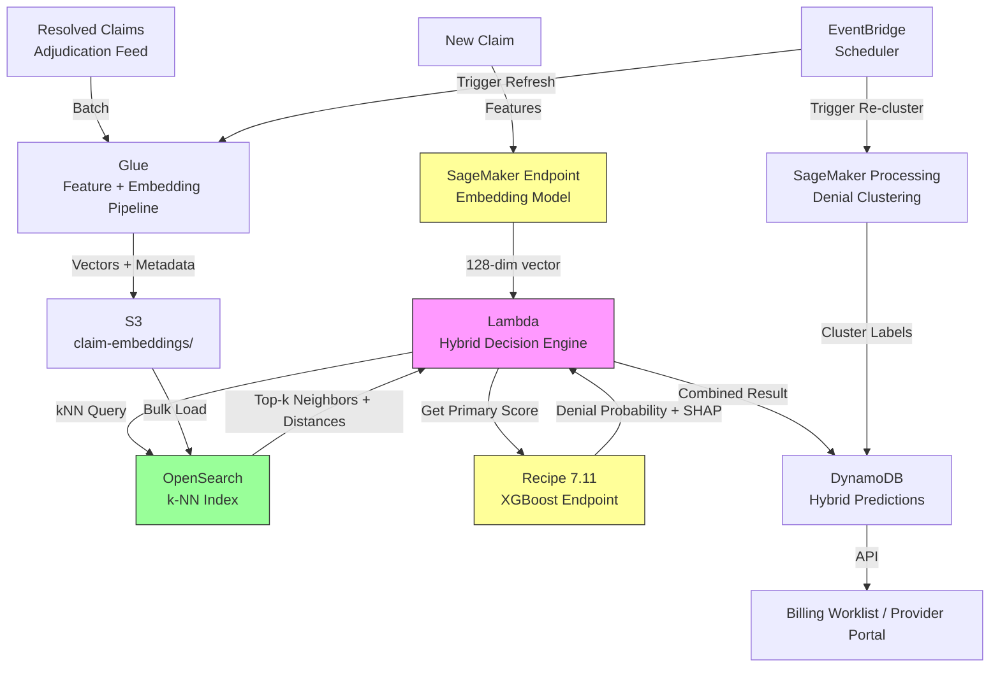

# Recipe 7.12 Architecture and Implementation: Cohort Matching and Case-Based Reasoning for Novel Claims

*Companion to [Recipe 7.12: Cohort Matching and Case-Based Reasoning for Novel Claims](chapter07.12-claim-cohort-matching). This page covers the AWS architecture, services, prerequisites, and pseudocode. For the problem framing and the conceptual approach, start with the main recipe.*

---

## The AWS Implementation

### Why These Services

**Amazon OpenSearch Service (with k-NN plugin) for the vector index.** OpenSearch's k-NN plugin supports approximate nearest-neighbor search using HNSW (Hierarchical Navigable Small World) graphs or IVF (Inverted File) indexes. It handles the core requirement: given a 128-256 dimensional claim embedding, find the top-k nearest vectors in sub-100ms latency. OpenSearch also stores the claim metadata alongside the vector, so you get the full resolved case details in a single query without a join.

**Amazon SageMaker for embedding model training and inference.** Train the embedding network (or dimensionality reduction model) that maps raw claim features into dense vectors. Host as a real-time endpoint for scoring new claims. Optionally, use SageMaker's built-in k-NN algorithm for smaller-scale deployments where OpenSearch feels like overkill.

**Amazon S3 for embedding storage and batch processing.** Historical claim embeddings are computed in batch (Glue or SageMaker Processing) and stored in S3 before bulk-loading into OpenSearch. Model artifacts, training data, and cluster assignments live here.

**AWS Glue for feature engineering and embedding batch computation.** Joins claim data with outcomes, computes the raw feature vectors, and runs the embedding model in batch mode for historical backfill. Shares much of the feature pipeline with Recipe 7.11.

**Amazon DynamoDB for prediction results and case metadata.** Stores the hybrid decision output (primary score + novelty flag + nearest-case references) for real-time lookup. The billing system queries this by claim ID to surface recommendations.

**AWS Lambda for the hybrid decision engine.** Orchestrates the flow: compute embedding, query OpenSearch for neighbors, compute novelty score, combine with the 7.11 primary score, and produce the final recommendation. Lightweight stateless logic.

**Amazon EventBridge for pipeline orchestration.** Triggers embedding recomputation when new adjudication results arrive. Schedules periodic re-clustering of the denied claims population. Triggers OpenSearch index refresh.

### Architecture Diagram



### Prerequisites

| Requirement | Details |
|-------------|---------|
| **AWS Services** | Amazon OpenSearch Service, Amazon SageMaker, Amazon S3, AWS Glue, Amazon DynamoDB, AWS Lambda, Amazon EventBridge |
| **IAM Permissions** | (1) Glue role: `s3:GetObject`/`s3:PutObject` on claims and embedding buckets, `es:ESHttpPost`/`es:ESHttpPut` on OpenSearch domain; (2) SageMaker role: `s3:GetObject`/`s3:PutObject` on model and training buckets, `kms:Decrypt`; (3) Lambda hybrid engine: `es:ESHttpPost` on OpenSearch, `sagemaker:InvokeEndpoint` on embedding and XGBoost endpoints, `dynamodb:PutItem`/`dynamodb:GetItem` on predictions table; (4) EventBridge: `lambda:InvokeFunction`, `glue:StartJobRun`, `sagemaker:CreateProcessingJob`. All scoped to specific resource ARNs. For OpenSearch, resource-level ARN scoping restricts access to the domain but not to individual indexes. Enable fine-grained access control (FGAC) on the OpenSearch domain and map the Lambda execution role to a backend role with read-only access to the `claim-vectors` index. The Glue role's backend role should have write access to `claim-vectors` but no access to other indexes. |
| **BAA** | AWS BAA signed. Claim embeddings are derived from PHI (they encode diagnosis codes, procedure codes, patient demographics). Treat embedding vectors as PHI. |
| **Encryption** | S3: SSE-KMS for all buckets. OpenSearch: encryption at rest and node-to-node encryption enabled. DynamoDB: encryption at rest. SageMaker: KMS-encrypted volumes. All transit over TLS. |
| **VPC** | OpenSearch domain deployed in VPC (no public endpoint). Lambda functions in same VPC with access to OpenSearch and SageMaker VPC endpoints. Interface endpoints for S3, DynamoDB, SageMaker Runtime, and KMS. AWS Glue connection configured for the same VPC and subnets as the OpenSearch domain, with security group rules allowing port 443 from the Glue connection's ENIs to the OpenSearch domain's security group. Security groups: OpenSearch domain SG allows inbound 443 from Lambda SG and Glue connection SG only. Lambda SG allows outbound 443 to OpenSearch SG and VPC endpoint SGs. No inbound rules needed on Lambda SG. |
| **CloudTrail** | Enabled. CloudTrail captures OpenSearch management-plane operations. For data-plane query auditing (who searched for which claim embeddings), enable OpenSearch audit logging via fine-grained access control, or implement application-level logging in the Lambda hybrid decision engine that records claim_id, requesting_user, timestamp, and number of results returned for each similarity query. |
| **Sample Data** | Synthetic claims with embeddings. Generate 50,000+ resolved claims with realistic feature distributions. Include deliberate cold-start scenarios (payers with <50 claims) and novelty cases. Never use real PHI in dev. |
| **Cost Estimate** | OpenSearch (3x r6g.large.search, 500GB EBS): ~$600-900/month. SageMaker embedding endpoint (ml.m5.large): ~$100/month. Glue jobs: ~$50-100/month. DynamoDB: ~$50-100/month. Lambda: ~$20-50/month. Total: ~$850-1,200/month. Primary cost driver is OpenSearch cluster sizing (scales with number of stored embeddings). |

### Ingredients

| AWS Service | Role |
|-------------|------|
| **Amazon OpenSearch Service** | k-NN vector index storing claim embeddings with metadata; supports approximate nearest-neighbor queries at sub-100ms latency |
| **Amazon SageMaker** | Train embedding model (autoencoder or contrastive learning); host real-time embedding endpoint; run batch clustering jobs |
| **Amazon S3** | Store historical embeddings, model artifacts, cluster definitions, and batch processing outputs |
| **AWS Glue** | Feature engineering pipeline (shared with 7.11); batch computation of embeddings for historical claims |
| **Amazon DynamoDB** | Store hybrid prediction results (primary score + novelty flag + case references) for real-time lookup |
| **AWS Lambda** | Hybrid decision engine: orchestrate embedding, similarity query, novelty scoring, and decision combination |
| **Amazon EventBridge** | Orchestrate index refresh, re-clustering, and embedding pipeline triggers |
| **AWS KMS** | Encryption key management for all data stores containing PHI-derived embeddings |

### Code

#### Walkthrough

**Step 1: Compute claim embeddings from features.** Each claim needs a dense vector representation. Start with the same features from Recipe 7.11 (procedure codes, diagnosis codes, payer, provider, modifiers, amounts), encode categoricals using target encoding or pre-trained embeddings, normalize numerics, and either concatenate into a fixed-length vector directly or pass through a trained dimensionality-reduction model (autoencoder). Skip this step and you have nothing to search over.

```pseudocode
// Build a dense vector representing a single claim
// Input: raw claim record with codes, amounts, payer info
// Output: 128-dimensional float vector

FUNCTION compute_claim_embedding(claim):
    // Encode categorical features
    payer_vec = payer_embedding_lookup[claim.payer_id]          // 16-dim learned embedding
    proc_vec = procedure_embedding_lookup[claim.cpt_code]      // 32-dim learned embedding
    diag_vecs = [diagnosis_embedding_lookup[d] for d in claim.icd10_codes]
    diag_vec = average(diag_vecs)                              // 32-dim averaged

    // Normalize numeric features to 0-1 range
    amount_norm = (claim.billed_amount - AMOUNT_MIN) / (AMOUNT_MAX - AMOUNT_MIN)
    units_norm = (claim.units - UNITS_MIN) / (UNITS_MAX - UNITS_MIN)
    age_norm = (claim.patient_age - AGE_MIN) / (AGE_MAX - AGE_MIN)

    // Binary / one-hot structural features
    pos_vec = one_hot(claim.place_of_service, num_categories=15)
    has_pa = 1 if claim.prior_auth_obtained else 0
    modifier_flags = [1 if m in claim.modifiers else 0 for m in COMMON_MODIFIERS]

    // Concatenate all feature groups
    raw_vector = concatenate(payer_vec, proc_vec, diag_vec,
                             [amount_norm, units_norm, age_norm],
                             pos_vec, [has_pa], modifier_flags)
    // raw_vector is ~120-150 dimensions depending on encoding choices

    // Pass through trained autoencoder to get compact 128-dim embedding
    embedding = autoencoder_encoder.predict(raw_vector)

    RETURN embedding  // 128-dim dense float vector
```

**Step 2: Index embeddings in vector store.** Once you have embeddings for all resolved claims, load them into a vector index that supports fast approximate nearest-neighbor search. Each document in the index contains the embedding vector plus claim metadata (outcome, denial reason, payer, procedure, dates) so that a single query returns everything you need for case-based reasoning. Skip this and you're doing brute-force linear scans over millions of vectors (not practical at query time).

```pseudocode
// Bulk-index resolved claim embeddings into OpenSearch k-NN index
// Run after each batch of claims adjudicates

FUNCTION index_resolved_claims(resolved_claims):
    // Create or update the k-NN index with HNSW algorithm
    index_settings = {
        "settings": {
            "index.knn": true,
            "index.knn.algo_param.ef_construction": 256,
            "index.knn.algo_param.m": 16
        },
        "mappings": {
            "properties": {
                "claim_embedding": {
                    "type": "knn_vector",
                    "dimension": 128,
                    "method": {
                        "name": "hnsw",
                        "space_type": "cosinesimil",
                        "engine": "nmslib"
                    }
                },
                "claim_id": {"type": "keyword"},
                "payer_id": {"type": "keyword"},
                "cpt_code": {"type": "keyword"},
                "outcome": {"type": "keyword"},       // "paid" or "denied"
                "denial_reason": {"type": "keyword"},
                "adjudication_date": {"type": "date"},
                "billed_amount": {"type": "float"}
            }
        }
    }

    // Bulk insert resolved claims
    FOR EACH claim IN resolved_claims:
        embedding = compute_claim_embedding(claim)
        document = {
            "claim_embedding": embedding,
            "claim_id": claim.id,
            "payer_id": claim.payer_id,
            "cpt_code": claim.cpt_code,
            "outcome": claim.adjudication_outcome,
            "denial_reason": claim.denial_reason_code,
            "adjudication_date": claim.adjudication_date,
            "billed_amount": claim.billed_amount
        }
        opensearch.bulk_index("claim-vectors", document)

    // For initial historical backfill (one-time bulk load of 500K+ claims),
    // run force_merge after the load completes and before serving queries.
    // For incremental indexing (daily/weekly new adjudications), skip this step
    // and rely on OpenSearch's automatic background merge. Running force_merge
    // on every incremental batch degrades query performance during the merge.
    IF is_initial_backfill:
        opensearch.force_merge("claim-vectors", max_num_segments=1)
```

**Step 3: Query for nearest neighbors at scoring time.** When a new claim arrives for prediction, compute its embedding and query the vector index for the k most similar resolved claims. The returned neighbors, along with their distances, give you the raw material for case-based reasoning, novelty detection, and outcome estimation. Skip this and you lose the entire confidence and explanation layer.

```pseudocode
// Find the k most similar resolved claims to a new incoming claim
// Returns neighbors with distances and full metadata

FUNCTION find_similar_claims(new_claim, k=20):
    embedding = compute_claim_embedding(new_claim)

    // k-NN query against OpenSearch
    query = {
        "size": k,
        "query": {
            "knn": {
                "claim_embedding": {
                    "vector": embedding,
                    "k": k
                }
            }
        }
    }

    results = opensearch.search("claim-vectors", query)

    neighbors = []
    FOR EACH hit IN results.hits:
        neighbors.append({
            "claim_id": hit.claim_id,
            "distance": hit.score,       // cosine similarity (higher = more similar)
            "outcome": hit.outcome,
            "denial_reason": hit.denial_reason,
            "payer_id": hit.payer_id,
            "cpt_code": hit.cpt_code,
            "billed_amount": hit.billed_amount
        })

    RETURN neighbors
```

**Step 4: Compute novelty score and kNN-based prediction.** From the retrieved neighbors, compute two things: (1) a novelty score indicating whether this claim is well-represented in history, and (2) a kNN-based denial probability from the neighbors' outcomes. A high novelty score (low similarity to nearest neighbor) means the claim is out of distribution and predictions should be flagged for human review. Skip this and your system can't distinguish "confident prediction" from "wild guess."

```pseudocode
// Derive novelty signal and neighbor-based prediction from retrieved cases

FUNCTION compute_novelty_and_knn_prediction(neighbors, k_vote=10):
    // Novelty score: inverse of average distance to top-5 neighbors
    // Higher score = more novel (less similar to anything in history)
    top_5_distances = [1 - n.distance for n in neighbors[:5]]  // convert similarity to distance
    novelty_score = mean(top_5_distances)

    // kNN prediction: weighted vote of top-k neighbors' outcomes
    // Weight by similarity (closer neighbors get more vote weight)
    denied_weight = 0
    total_weight = 0
    FOR EACH neighbor IN neighbors[:k_vote]:
        weight = neighbor.distance  // cosine similarity as weight
        IF neighbor.outcome == "denied":
            denied_weight += weight
        total_weight += weight

    knn_denial_probability = denied_weight / total_weight IF total_weight > 0 ELSE 0.5

    // Denial reason distribution from neighbors
    reason_counts = count_by(neighbors[:k_vote], key="denial_reason")
    top_denial_reasons = sort_descending(reason_counts)[:3]

    RETURN {
        "novelty_score": novelty_score,
        "knn_denial_probability": knn_denial_probability,
        "top_denial_reasons": top_denial_reasons,
        "nearest_distance": top_5_distances[0],     // distance to single nearest neighbor
        "supporting_cases": neighbors[:5]           // top 5 cases for explanation
    }
```

**Step 5: Hybrid decision combining primary model with similarity layer.** The final decision engine combines the XGBoost primary score from Recipe 7.11 with the novelty signal and kNN prediction from this recipe. The logic is: trust the primary model when the claim is well-represented in history; flag for review when it's novel or when the two signals disagree; use kNN as fallback for cold-start payers. Skip this and your system either over-relies on the primary model (missing novel cases) or over-relies on kNN (less accurate for well-known patterns).

```pseudocode
// Combine primary XGBoost score with similarity-based signals

FUNCTION hybrid_decision(claim, primary_score, novelty_result):
    novelty_score = novelty_result.novelty_score
    knn_prob = novelty_result.knn_denial_probability
    supporting_cases = novelty_result.supporting_cases

    // Decision thresholds (calibrate empirically)
    NOVELTY_THRESHOLD = 0.4          // above this = novel claim
    DISAGREEMENT_THRESHOLD = 0.25    // |primary - knn| above this = conflicting signals
    COLD_START_MIN_CLAIMS = 50       // minimum payer history for primary model trust

    payer_claim_count = get_payer_history_count(claim.payer_id)

    // Determine confidence and routing
    IF novelty_score > NOVELTY_THRESHOLD:
        // Novel claim: primary model is unreliable
        confidence = "low"
        recommendation = "human_review"
        explanation = "This claim is unlike anything in our history. " +
                      "Nearest resolved cases shown below for reference."
        final_score = knn_prob  // fall back to kNN

    ELSE IF payer_claim_count < COLD_START_MIN_CLAIMS:
        // Cold start payer: use cross-payer similarity
        confidence = "medium"
        recommendation = "review_suggested"
        explanation = "Limited history for this payer. Prediction based on " +
                      "similar claims from comparable payers."
        final_score = knn_prob

    ELSE IF abs(primary_score - knn_prob) > DISAGREEMENT_THRESHOLD:
        // Primary model and neighbors disagree
        confidence = "medium"
        recommendation = "review_suggested"
        explanation = "Model prediction and historical precedent diverge. " +
                      "Primary model says " + format_pct(primary_score) +
                      " denial risk; similar cases suggest " + format_pct(knn_prob) + "."
        final_score = (primary_score + knn_prob) / 2  // average as compromise

    ELSE:
        // Concordant, well-supported prediction
        confidence = "high"
        recommendation = "auto_route" IF primary_score > 0.6 ELSE "pass"
        explanation = "Prediction well-supported by " + str(len(supporting_cases)) +
                      " similar resolved cases."
        final_score = primary_score  // trust the primary model

    RETURN {
        "final_denial_probability": final_score,
        "confidence": confidence,
        "recommendation": recommendation,
        "explanation": explanation,
        "primary_model_score": primary_score,
        "knn_score": knn_prob,
        "novelty_score": novelty_score,
        "supporting_cases": supporting_cases,
        "top_denial_reasons": novelty_result.top_denial_reasons
    }
```

> **Curious how this looks in Python?** The pseudocode above covers the concepts. If you'd like to see sample Python code that demonstrates these patterns using boto3, check out the [Python Example](chapter07.12-python-example). It walks through each step with inline comments and notes on what you'd need to change for a real deployment.

**Error Handling for the Hybrid Decision Engine.** The Lambda orchestrator calls two external services (OpenSearch for kNN, SageMaker for embeddings) and either can fail transiently. The pattern:

```pseudocode
// Error handling wrapper for the hybrid decision engine
// Principle: graceful degradation over hard failure

FUNCTION score_claim_with_resilience(claim):
    // Step A: Compute embedding (SageMaker endpoint)
    TRY with retry(max_attempts=3, backoff=exponential, base=200ms):
        embedding = sagemaker.invoke_endpoint(claim_features)
    ON FAILURE:
        // If embedding fails, we cannot run kNN at all.
        // Fall back to primary model only; flag the gap.
        primary_score = invoke_xgboost(claim_features)
        RETURN {
            "final_denial_probability": primary_score,
            "confidence": "degraded",
            "recommendation": "review_suggested",
            "explanation": "Similarity layer unavailable. Using primary model only.",
            "similarity_available": false
        }

    // Step B: Query OpenSearch for neighbors
    TRY with retry(max_attempts=3, backoff=exponential, base=200ms):
        neighbors = opensearch.knn_query(embedding, k=20)
    ON FAILURE:
        // OpenSearch is down or circuit-breaker tripped.
        // Fall back to primary model only.
        primary_score = invoke_xgboost(claim_features)
        RETURN {
            "final_denial_probability": primary_score,
            "confidence": "degraded",
            "recommendation": "review_suggested",
            "explanation": "Vector search unavailable. Using primary model only.",
            "similarity_available": false
        }

    // Step C: Normal hybrid logic (both services responded)
    TRY:
        result = hybrid_decision(claim, embedding, neighbors)
        RETURN result
    ON FAILURE:
        // Logic error or unexpected data shape. Send to DLQ for investigation.
        sqs.send_message(DLQ_URL, {
            "claim_id": claim.id,
            "error": exception.message,
            "timestamp": now(),
            "embedding_available": true,
            "neighbors_returned": len(neighbors)
        })
        RETURN {
            "final_denial_probability": null,
            "confidence": "failed",
            "recommendation": "human_review",
            "explanation": "Scoring pipeline error. Routed to manual review."
        }

// CloudWatch alarm: trigger when DLQ depth exceeds 100 messages in 5 minutes.
// This catches sustained failures (not one-off transient errors) and pages
// the on-call engineer before the backlog becomes unmanageable.
```

The key principle: never let a transient infrastructure failure block claim processing. The primary XGBoost model (Recipe 7.11) can always produce a score independently. The similarity layer adds confidence and explanation; when it's unavailable, you lose those signals but claims still flow. The SQS dead-letter queue captures claims that fail all retries so nothing is silently dropped.

### Expected Results

Sample hybrid decision output:

```json
{
  "claim_id": "CLM-2024-887432",
  "final_denial_probability": 0.71,
  "confidence": "medium",
  "recommendation": "review_suggested",
  "explanation": "Limited history for this payer. Prediction based on similar claims from comparable payers.",
  "primary_model_score": 0.68,
  "knn_score": 0.74,
  "novelty_score": 0.32,
  "supporting_cases": [
    {"claim_id": "CLM-2024-442190", "outcome": "denied", "denial_reason": "no_prior_auth", "similarity": 0.92},
    {"claim_id": "CLM-2024-391027", "outcome": "denied", "denial_reason": "no_prior_auth", "similarity": 0.89},
    {"claim_id": "CLM-2024-510384", "outcome": "paid", "denial_reason": null, "similarity": 0.87},
    {"claim_id": "CLM-2024-278451", "outcome": "denied", "denial_reason": "medical_necessity", "similarity": 0.85},
    {"claim_id": "CLM-2024-629108", "outcome": "denied", "denial_reason": "no_prior_auth", "similarity": 0.83}
  ],
  "top_denial_reasons": [
    {"reason": "no_prior_auth", "count": 3},
    {"reason": "medical_necessity", "count": 1}
  ]
}
```

**Performance benchmarks:**

| Metric | Value | Notes |
|--------|-------|-------|
| kNN query latency (p50) | 15ms | OpenSearch HNSW, k=20, 500K vectors |
| kNN query latency (p99) | 45ms | Under load with concurrent queries |
| End-to-end hybrid decision | 80-120ms | Embedding (20ms) + kNN query (15ms) + primary model (30ms) + logic (5ms) |
| Novelty detection recall | ~85% | Catches 85% of truly novel claims (calibrated on holdout) |
| Novelty detection precision | ~70% | 30% of flagged "novel" claims had usable history upon manual review |
| Cold-start kNN accuracy (AUC) | 0.68-0.72 | Cross-payer similarity, <50 claims for target payer. The 10-15 point gap vs. the mature primary model is expected: kNN is a bridge signal, not a replacement. |
| Mature kNN accuracy (AUC) | 0.74-0.78 | Within-payer similarity, >500 claims for target payer |
| Primary model accuracy (AUC) | 0.82-0.88 | XGBoost with full payer-specific training (from 7.11) |

**Where it struggles:**

- Claims where the nearest neighbors had mixed outcomes (50/50 paid/denied split among top-10 neighbors). The kNN signal is ambiguous.
- Payers that change rules mid-year. Historical neighbors reflect old rules; the current claim faces new rules. Stale precedent.
- Very high cardinality interactions (specific procedure + specific payer + specific modifier combination) where even with 500K claims, the neighborhood is sparse.
- Embedding drift: as your claim population shifts (new procedure codes, new patient demographics), old embeddings become less representative. Requires periodic re-embedding and re-indexing.

---

## Why This Isn't Production-Ready

This architecture handles the happy path and basic error recovery, but a production deployment needs several additional layers:

- **No automated embedding-drift detection.** The system has no mechanism to notice when the claim population shifts enough that old embeddings become unreliable. You'd need a monitoring job that tracks the distribution of nearest-neighbor distances over time and alerts when average distances creep upward (indicating the embedding space is losing discriminative power).

- **No circuit-breaker for OpenSearch outages.** The error-handling pseudocode retries and degrades gracefully, but there's no circuit-breaker pattern that stops sending queries after repeated failures. Without one, a degraded OpenSearch cluster gets hammered with retries from every Lambda invocation, deepening the problem. Implement a circuit-breaker (e.g., via a DynamoDB flag or Lambda environment variable toggled by a CloudWatch alarm) that short-circuits to primary-model-only mode during extended outages.

- **No A/B framework for kNN-vs-primary model allocation.** The hybrid decision logic uses fixed thresholds to decide when to trust the primary model vs. kNN. You can't currently measure whether the similarity layer is actually improving outcomes without a controlled experiment. An A/B framework (randomly assign a percentage of claims to "primary only" vs. "hybrid") lets you measure the lift from the similarity layer and justify the infrastructure cost.

- **No automated threshold recalibration.** The novelty threshold (0.4) and disagreement threshold (0.25) are calibrated once at deployment. As your claim population and payer mix evolve, these thresholds drift out of calibration. You'd need a periodic job that re-evaluates threshold performance against recent outcomes and adjusts (or at minimum alerts when accuracy at the current threshold drops below a floor).

---

## Variations and Extensions

### Variation 1: Payer-Filtered Similarity Search

Instead of searching the entire claim population, filter the kNN search to claims from the same payer (or same payer category). This dramatically improves relevance: a neighbor from the same payer is far more informative than a neighbor from a different payer with the same procedure code. Implement using OpenSearch's filtered kNN query (pre-filter on `payer_id`, then run kNN within that subset). Fall back to cross-payer search when the within-payer subset has fewer than k results.

### Variation 2: Temporal Decay Weighting

Weight neighbors by recency: a similar claim that adjudicated last month is more relevant than one from two years ago (payer rules evolve). Apply an exponential decay to similarity scores based on time since adjudication. This helps the system adapt to policy changes without requiring full re-indexing.

### Variation 3: Multi-Stage Retrieval with Re-Ranking

Use a fast approximate search (HNSW) to retrieve 100 candidates, then re-rank them with a more expensive but more accurate similarity model (a cross-encoder or learned metric). The first stage handles speed; the second stage handles precision. Useful when your initial embedding captures broad similarity but misses domain-specific nuance (like modifier requirements that only matter for certain payer-procedure combinations).

---

## Additional Resources

### AWS Documentation

- Amazon OpenSearch Service k-NN plugin: https://docs.aws.amazon.com/opensearch-service/latest/developerguide/knn.html
- Amazon SageMaker Built-in k-NN Algorithm: https://docs.aws.amazon.com/sagemaker/latest/dg/k-nearest-neighbors.html
- Amazon OpenSearch Service Best Practices: https://docs.aws.amazon.com/opensearch-service/latest/developerguide/bp.html
- AWS Glue Developer Guide: https://docs.aws.amazon.com/glue/latest/dg/what-is-glue.html
- Amazon SageMaker Processing: https://docs.aws.amazon.com/sagemaker/latest/dg/processing-job.html

### Compliance and Security

- HIPAA on AWS: https://aws.amazon.com/compliance/hipaa-compliance/
- Amazon OpenSearch Service Security: https://docs.aws.amazon.com/opensearch-service/latest/developerguide/security.html
- AWS KMS Developer Guide: https://docs.aws.amazon.com/kms/latest/developerguide/overview.html

---

## Estimated Implementation Time

| Phase | Duration | Notes |
|-------|----------|-------|
| **Basic (single similarity query)** | 3-4 weeks | Feature vector pipeline, OpenSearch k-NN index, basic query endpoint |
| **Production-ready (hybrid system)** | 8-12 weeks | Integration with 7.11, novelty scoring calibration, case retrieval API, monitoring |
| **With variations** | 14-18 weeks | Payer-filtered search, temporal decay, re-ranking, denial clustering pipeline, provider portal integration |

---

---

*← [Main Recipe 7.12](chapter07.12-claim-cohort-matching) · [Python Example](chapter07.12-python-example) · [Chapter Preface](chapter07-preface)*
