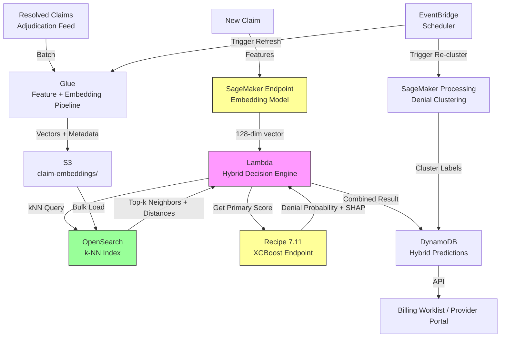

# Recipe 7.12: Cohort Matching and Case-Based Reasoning for Novel Claims

**Complexity:** Medium-Complex · **Phase:** Complement to 7.11 · **Estimated Cost:** ~$0.003 per query (vector search + retrieval)

---

## The Problem

Recipe 7.11 gave you a gradient-boosted tree model that predicts claim denials. It works great. Really great, actually, when you have dense, representative training history for the payer and procedure combination in question. But let me paint you a scenario that makes that model sweat.

You're a clearinghouse or revenue cycle middleware company. You process claims for hundreds of provider organizations across dozens of payers. Every week, new payers show up in your stream. Every month, new procedure codes appear (CMS updates codes quarterly; payers add custom codes constantly). Your system sees a claim for a payer it has 47 historical examples from. Your XGBoost model, trained on 500,000 claims, has exactly 47 datapoints for this payer. Its prediction for this claim will be... something. It will output a number between 0 and 1 with perfect confidence because that's what tree models do. They always produce a score. They never say "I have no idea."

That's the danger. Gradient-boosted trees are incapable of expressing uncertainty about inputs they've never seen. A claim with a novel payer-procedure combination gets the same confident-looking probability output as a claim with 10,000 historical precedents. The model doesn't distinguish "I've seen 5,000 claims like this and 73% were denied" from "I've never seen anything like this, but the leaf node it landed in had a 73% denial rate for completely different reasons."

Now imagine you're the middleman and a provider calls asking why you flagged their claim. "The model said 73% denial risk" isn't going to cut it. They want to know: "What comparable claims have you seen? What happened to them? Show me the evidence." Case-based reasoning: the ability to point to specific similar resolved claims and say "these five claims are the closest matches we have, and four of them were denied for reason X."

This is the problem space where k-nearest-neighbors and similarity retrieval shine:

1. **Cold start.** A new payer appears with zero training history. A supervised model can't be payer-specific yet. But you can find claims submitted to similar payers (same region, same plan type, similar formularies) and look at their outcomes.

2. **Novelty detection.** When a claim is far from anything in your history, you can measure that distance and flag it: "this claim is out of distribution; human review recommended." XGBoost has no built-in mechanism for this.

3. **Case-based explanation.** "Here are the 5 most similar claims we've processed. 4 were denied, 1 was paid. The denied ones all lacked prior authorization." That's an explanation that makes intuitive sense to anyone, regardless of their statistical background.

4. **Heterogeneous streams.** When you process claims across wildly different payers with different rules, a single global model smooths over payer-specific quirks. Similarity search lets you find relevant precedents within the same payer cohort, even with limited data.

Let me be direct about the relationship between this recipe and 7.11. The gradient-boosted model from 7.11 is your primary predictor. It's more accurate, faster to score, and better calibrated when you have representative training data. This recipe is the safety net, the confidence layer, and the explanation engine that wraps around it. You're not replacing the tree model. You're giving it self-awareness about what it doesn't know.

---

## The Technology: Instance-Based Learning, Similarity Retrieval, and Clustering

### Two Distinct Techniques (Don't Confuse Them)

People often blur two related but fundamentally different approaches. Let's separate them cleanly:

**k-Nearest Neighbors / Similarity Retrieval:** Given a new claim, find the k most similar resolved claims in your history and look at their outcomes. This is retrieval. You're asking: "What happened when we saw claims like this before?" The answer is a set of specific historical cases with known outcomes, distances, and attributes. This is the core of case-based reasoning: reasoning by analogy to past cases.

**Clustering (k-means, DBSCAN, etc.):** Partition your entire claim population into groups that share structural similarity. This is segmentation. You're asking: "What are the natural groupings in my denial landscape?" The answer is a set of cluster labels: "denial archetype A (missing PA), archetype B (bundling errors), archetype C (timely filing)." Clustering is useful for operational routing and for discovering denial patterns, but it's not a predictor in the same sense.

Both are useful. This recipe focuses primarily on the similarity retrieval / kNN approach because that's what gives you novelty detection and case-based explanation. Clustering enters as an operational layer for routing and segmentation.

### How Similarity Search Actually Works

The fundamental idea is dead simple. You represent each claim as a vector (a list of numbers). You compute distances between vectors. Claims with small distances are "similar." Claims with large distances are "different."

The devil is in the details of that vector representation and that distance computation.

**Feature-based similarity (traditional).** Take the same features you'd feed to XGBoost (procedure code, diagnosis codes, payer, provider type, claim amount, modifiers) and encode them into a fixed-length numeric vector. Categorical features get one-hot encoded or target-encoded. Numeric features get normalized. Then you compute Euclidean distance, cosine similarity, or some other metric between vectors.

The problem: high-cardinality categoricals (10,000 CPT codes, 70,000 ICD-10 codes) create enormous sparse vectors. With one-hot encoding, two claims that differ by a single diagnosis code might look maximally different because they share zero non-zero positions in those dimensions. This is the curse of dimensionality: in very high-dimensional spaces, all points become roughly equidistant, and the concept of "nearest neighbor" becomes meaningless.

**Learned embeddings (modern).** Train a neural network to map claims into a lower-dimensional dense vector space (say, 128 or 256 dimensions) where similar claims are close together. "Similar" here means "had similar adjudication outcomes" or "share clinical and administrative characteristics." The embedding network learns which features matter for similarity and which are noise. Two claims with different-but-related diagnosis codes (say, E11.9 Type 2 diabetes unspecified vs. E11.65 Type 2 diabetes with hyperglycemia) will have similar embeddings even though their one-hot encodings share nothing.

In practice, you often use a hybrid: encode categorical features using pre-trained embeddings (from the XGBoost feature pipeline or a dedicated embedding model), concatenate with normalized numeric features, and optionally pass through a dimensionality reduction step (PCA, autoencoders) to get a compact vector.

### Distance Metrics Matter

The choice of distance metric determines what "similar" means:

**Euclidean distance** works well when features are normalized to similar scales. It treats all dimensions equally. A claim that's 0.3 away in the "payer" dimension and 0.3 away in the "procedure" dimension is equidistant from one that's 0.42 away in only the "procedure" dimension.

**Cosine similarity** measures the angle between vectors, ignoring magnitude. Good when you care about the pattern of features rather than their absolute values. Often better for sparse, high-dimensional spaces.

**Weighted distance** applies different importance weights to different feature dimensions. The payer dimension might matter more than the place-of-service dimension for denial prediction. You can learn these weights from data (metric learning).

**Mahalanobis distance** accounts for correlations between features. If procedure code and claim amount are correlated (complex procedures cost more), Mahalanobis distance won't double-count that signal.

For claims data specifically, a common practical approach is cosine similarity on learned embeddings. The embedding network implicitly handles feature weighting and correlation, so you can use a simple metric on the output vectors.

### Distance as a Confidence Signal

Here's the key insight that makes this whole recipe worth building: the distance to the nearest neighbors gives you a free out-of-distribution detector.

If a claim's nearest neighbor is distance 0.05 away in your embedding space, you have a close match. The historical outcomes of that neighbor (and its other close neighbors) are likely relevant. Your prediction for this claim is well-supported by precedent.

If a claim's nearest neighbor is distance 0.95 away, you're in uncharted territory. Nothing in your history looks like this. Any prediction (from kNN or from XGBoost) should be treated with skepticism. This is the novelty signal.

You can threshold on this: if `min_distance > threshold`, route to human review. If `min_distance <= threshold`, trust the model. The threshold is calibrated empirically: look at historical predictions where the nearest-neighbor distance was high and see if accuracy degrades (it will).

XGBoost has no equivalent signal. It always outputs a probability, and that probability has no built-in measure of "how confident are we that this probability is well-calibrated for this input?" Prediction intervals from conformal prediction are one approach, but nearest-neighbor distance is simpler and more interpretable.

### Cold Start: When You Have No History for a Payer

New payer shows up. Zero historical claims. Your supervised model has never seen this payer ID in training. What do you do?

Option 1: Use the global model (ignoring payer-specific features). This loses the most important signal, since payer identity is typically the strongest predictor of denial patterns.

Option 2: Similarity search across all payers. Find claims from other payers with similar characteristics: same plan type (commercial HMO vs. PPO), same region, same procedure code, similar patient demographics. The outcomes of those similar claims from other payers give you a rough prior for how this new payer might behave.

This is case-based reasoning at its most powerful. On day one with a new payer, you can say: "We've never seen claims from Payer X before, but based on 200 similar claims from other regional commercial HMOs, the denial rate for this procedure code is approximately 18%, driven primarily by missing documentation rather than medical necessity."

As claims for the new payer accumulate and adjudicate, you gradually transition from cross-payer similarity (low confidence, broad precedent) to within-payer similarity (higher confidence, direct precedent) to a trained payer-specific model (highest confidence). The similarity system provides a graceful on-ramp.

### Clustering for Denial Archetype Segmentation

While kNN handles individual claim prediction and explanation, clustering serves a different operational purpose: discovering denial archetypes.

Run k-means or DBSCAN on your denied claims' feature vectors. The resulting clusters often correspond to distinct denial patterns:

- Cluster A: Missing prior authorization (mostly surgical, specific payers)
- Cluster B: Bundling/unbundling issues (multi-procedure claims, incorrect modifiers)
- Cluster C: Timely filing (claims submitted >30 days post-service)
- Cluster D: Medical necessity challenges (specific diagnosis-procedure mismatches)

These archetypes let you route denied claims to specialized rework teams (your PA team handles Cluster A, your coding team handles Cluster B) and let you build targeted interventions (if most of your denials fall in Cluster A, your biggest ROI is fixing the PA workflow, not improving coding accuracy).

### The Hybrid Pattern

The production architecture combines all three approaches:

1. **Primary score:** XGBoost/LightGBM from Recipe 7.11 outputs a denial probability.
2. **Confidence layer:** kNN distance check determines whether the primary score is trustworthy for this input.
3. **Explanation layer:** Retrieve k-nearest resolved claims and present them as case-based evidence supporting or contradicting the primary score.
4. **Cold start fallback:** When the primary model has insufficient payer-specific data, use cross-payer similarity as the predictor.
5. **Operational segmentation:** Clustering assigns denied claims to archetype groups for routing and pattern discovery.

The decision logic:
- If nearest-neighbor distance is low (claim is well-represented in history) AND primary model has confident score: use the primary model's prediction.
- If nearest-neighbor distance is high (novel claim) OR primary model lacks payer-specific data: flag for human review and provide the k-nearest cases as evidence.
- If the kNN outcome disagrees with the primary model (neighbors say "likely denied" but XGBoost says "likely paid" or vice versa): flag the disagreement and present both signals to the reviewer.

---

## General Architecture Pattern

```text
[Claims Stream] → [Embedding Pipeline] → [Vector Store / Index]
                                        → [Similarity Query Service]
                                        → [Novelty Scoring Service]
                                        → [Case Retrieval API]
                                        → [Cluster Assignment Service]
                                        → [Hybrid Decision Engine (combines with 7.11 model)]
```

Logical stages:

1. **Embedding pipeline.** For each resolved claim, compute a feature vector (or learned embedding). Store this vector alongside the claim's metadata and outcome (paid/denied, denial reason, appeal outcome). Run batch for historical backfill; run incrementally as new claims adjudicate.

2. **Vector index.** An approximate nearest-neighbor index over the claim embeddings. Supports fast similarity queries: "give me the 20 nearest claims to this input, with their distances." Refreshed as new resolved claims enter the system.

3. **Similarity query service.** Given a new (unresolved) claim, compute its embedding, query the index, and return the k nearest resolved claims with distances. Used at scoring time and at explanation time.

4. **Novelty scoring.** Compute the distance to the k-th nearest neighbor. If above threshold, flag the claim as out-of-distribution. This signal feeds into the hybrid decision engine.

5. **Case retrieval API.** Downstream consumers (billing worklists, provider portals) can request "show me similar resolved claims" for any given claim. Returns enriched records with outcome, denial reason, and similarity score.

6. **Cluster assignment.** Periodically re-cluster the denied claims population. Assign incoming denied claims to their nearest archetype cluster for routing.

7. **Hybrid decision engine.** Combines the primary XGBoost score from 7.11 with the novelty score and kNN outcome distribution to produce a final recommendation: {prediction, confidence, supporting_cases, novelty_flag, recommended_action}.

---

## The AWS Implementation

### Why These Services

**Amazon OpenSearch Service (with k-NN plugin) for the vector index.** OpenSearch's k-NN plugin supports approximate nearest-neighbor search using HNSW (Hierarchical Navigable Small World) graphs or IVF (Inverted File) indexes. It handles the core requirement: given a 128-256 dimensional claim embedding, find the top-k nearest vectors in sub-100ms latency. OpenSearch also stores the claim metadata alongside the vector, so you get the full resolved case details in a single query without a join.

**Amazon SageMaker for embedding model training and inference.** Train the embedding network (or dimensionality reduction model) that maps raw claim features into dense vectors. Host as a real-time endpoint for scoring new claims. Optionally, use SageMaker's built-in k-NN algorithm for smaller-scale deployments where OpenSearch feels like overkill.

**Amazon S3 for embedding storage and batch processing.** Historical claim embeddings are computed in batch (Glue or SageMaker Processing) and stored in S3 before bulk-loading into OpenSearch. Model artifacts, training data, and cluster assignments live here.

**AWS Glue for feature engineering and embedding batch computation.** Joins claim data with outcomes, computes the raw feature vectors, and runs the embedding model in batch mode for historical backfill. Shares much of the feature pipeline with Recipe 7.11.

**Amazon DynamoDB for prediction results and case metadata.** Stores the hybrid decision output (primary score + novelty flag + nearest-case references) for real-time lookup. The billing system queries this by claim ID to surface recommendations.

**AWS Lambda for the hybrid decision engine.** Orchestrates the flow: compute embedding, query OpenSearch for neighbors, compute novelty score, combine with the 7.11 primary score, and produce the final recommendation. Lightweight stateless logic.

**Amazon EventBridge for pipeline orchestration.** Triggers embedding recomputation when new adjudication results arrive. Schedules periodic re-clustering of the denied claims population. Triggers OpenSearch index refresh.

### Architecture Diagram



### Prerequisites

| Requirement | Details |
|-------------|---------|
| **AWS Services** | Amazon OpenSearch Service, Amazon SageMaker, Amazon S3, AWS Glue, Amazon DynamoDB, AWS Lambda, Amazon EventBridge |
| **IAM Permissions** | (1) Glue role: `s3:GetObject`/`s3:PutObject` on claims and embedding buckets, `es:ESHttpPost`/`es:ESHttpPut` on OpenSearch domain; (2) SageMaker role: `s3:GetObject`/`s3:PutObject` on model and training buckets, `kms:Decrypt`; (3) Lambda hybrid engine: `es:ESHttpPost` on OpenSearch, `sagemaker:InvokeEndpoint` on embedding and XGBoost endpoints, `dynamodb:PutItem`/`dynamodb:GetItem` on predictions table; (4) EventBridge: `lambda:InvokeFunction`, `glue:StartJobRun`, `sagemaker:CreateProcessingJob`. All scoped to specific resource ARNs. |
| **BAA** | AWS BAA signed. Claim embeddings are derived from PHI (they encode diagnosis codes, procedure codes, patient demographics). Treat embedding vectors as PHI. |
| **Encryption** | S3: SSE-KMS for all buckets. OpenSearch: encryption at rest and node-to-node encryption enabled. DynamoDB: encryption at rest. SageMaker: KMS-encrypted volumes. All transit over TLS. |
| **VPC** | OpenSearch domain deployed in VPC (no public endpoint). Lambda functions in same VPC with access to OpenSearch and SageMaker VPC endpoints. Interface endpoints for S3, DynamoDB, SageMaker Runtime, and KMS. |
| **CloudTrail** | Enabled. Log all OpenSearch queries (they involve PHI-derived vectors). Track who retrieved which case comparisons and when. |
| **Sample Data** | Synthetic claims with embeddings. Generate 50,000+ resolved claims with realistic feature distributions. Include deliberate cold-start scenarios (payers with <50 claims) and novelty cases. Never use real PHI in dev. |
| **Cost Estimate** | OpenSearch (3x r6g.large.search, 500GB EBS): ~$600-900/month. SageMaker embedding endpoint (ml.m5.large): ~$100/month. Glue jobs: ~$50-100/month. DynamoDB: ~$50-100/month. Lambda: ~$20-50/month. Total: ~$850-1,200/month. Primary cost driver is OpenSearch cluster sizing (scales with number of stored embeddings). |

### Ingredients

| AWS Service | Role |
|-------------|------|
| **Amazon OpenSearch Service** | k-NN vector index storing claim embeddings with metadata; supports approximate nearest-neighbor queries at sub-100ms latency |
| **Amazon SageMaker** | Train embedding model (autoencoder or contrastive learning); host real-time embedding endpoint; run batch clustering jobs |
| **Amazon S3** | Store historical embeddings, model artifacts, cluster definitions, and batch processing outputs |
| **AWS Glue** | Feature engineering pipeline (shared with 7.11); batch computation of embeddings for historical claims |
| **Amazon DynamoDB** | Store hybrid prediction results (primary score + novelty flag + case references) for real-time lookup |
| **AWS Lambda** | Hybrid decision engine: orchestrate embedding, similarity query, novelty scoring, and decision combination |
| **Amazon EventBridge** | Orchestrate index refresh, re-clustering, and embedding pipeline triggers |
| **AWS KMS** | Encryption key management for all data stores containing PHI-derived embeddings |

### Code

#### Walkthrough

**Step 1: Compute claim embeddings from features.** Each claim needs a dense vector representation. Start with the same features from Recipe 7.11 (procedure codes, diagnosis codes, payer, provider, modifiers, amounts), encode categoricals using target encoding or pre-trained embeddings, normalize numerics, and either concatenate into a fixed-length vector directly or pass through a trained dimensionality-reduction model (autoencoder). Skip this step and you have nothing to search over.

```pseudocode
// Build a dense vector representing a single claim
// Input: raw claim record with codes, amounts, payer info
// Output: 128-dimensional float vector

FUNCTION compute_claim_embedding(claim):
    // Encode categorical features
    payer_vec = payer_embedding_lookup[claim.payer_id]          // 16-dim learned embedding
    proc_vec = procedure_embedding_lookup[claim.cpt_code]      // 32-dim learned embedding
    diag_vecs = [diagnosis_embedding_lookup[d] for d in claim.icd10_codes]
    diag_vec = average(diag_vecs)                              // 32-dim averaged

    // Normalize numeric features to 0-1 range
    amount_norm = (claim.billed_amount - AMOUNT_MIN) / (AMOUNT_MAX - AMOUNT_MIN)
    units_norm = (claim.units - UNITS_MIN) / (UNITS_MAX - UNITS_MIN)
    age_norm = (claim.patient_age - AGE_MIN) / (AGE_MAX - AGE_MIN)

    // Binary / one-hot structural features
    pos_vec = one_hot(claim.place_of_service, num_categories=15)
    has_pa = 1 if claim.prior_auth_obtained else 0
    modifier_flags = [1 if m in claim.modifiers else 0 for m in COMMON_MODIFIERS]

    // Concatenate all feature groups
    raw_vector = concatenate(payer_vec, proc_vec, diag_vec,
                             [amount_norm, units_norm, age_norm],
                             pos_vec, [has_pa], modifier_flags)
    // raw_vector is ~120-150 dimensions depending on encoding choices

    // Pass through trained autoencoder to get compact 128-dim embedding
    embedding = autoencoder_encoder.predict(raw_vector)

    RETURN embedding  // 128-dim dense float vector
```

**Step 2: Index embeddings in vector store.** Once you have embeddings for all resolved claims, load them into a vector index that supports fast approximate nearest-neighbor search. Each document in the index contains the embedding vector plus claim metadata (outcome, denial reason, payer, procedure, dates) so that a single query returns everything you need for case-based reasoning. Skip this and you're doing brute-force linear scans over millions of vectors (not practical at query time).

```pseudocode
// Bulk-index resolved claim embeddings into OpenSearch k-NN index
// Run after each batch of claims adjudicates

FUNCTION index_resolved_claims(resolved_claims):
    // Create or update the k-NN index with HNSW algorithm
    index_settings = {
        "settings": {
            "index.knn": true,
            "index.knn.algo_param.ef_construction": 256,
            "index.knn.algo_param.m": 16
        },
        "mappings": {
            "properties": {
                "claim_embedding": {
                    "type": "knn_vector",
                    "dimension": 128,
                    "method": {
                        "name": "hnsw",
                        "space_type": "cosinesimil",
                        "engine": "nmslib"
                    }
                },
                "claim_id": {"type": "keyword"},
                "payer_id": {"type": "keyword"},
                "cpt_code": {"type": "keyword"},
                "outcome": {"type": "keyword"},       // "paid" or "denied"
                "denial_reason": {"type": "keyword"},
                "adjudication_date": {"type": "date"},
                "billed_amount": {"type": "float"}
            }
        }
    }

    // Bulk insert resolved claims
    FOR EACH claim IN resolved_claims:
        embedding = compute_claim_embedding(claim)
        document = {
            "claim_embedding": embedding,
            "claim_id": claim.id,
            "payer_id": claim.payer_id,
            "cpt_code": claim.cpt_code,
            "outcome": claim.adjudication_outcome,
            "denial_reason": claim.denial_reason_code,
            "adjudication_date": claim.adjudication_date,
            "billed_amount": claim.billed_amount
        }
        opensearch.bulk_index("claim-vectors", document)

    // Force merge for query performance
    opensearch.force_merge("claim-vectors", max_num_segments=1)
```

**Step 3: Query for nearest neighbors at scoring time.** When a new claim arrives for prediction, compute its embedding and query the vector index for the k most similar resolved claims. The returned neighbors, along with their distances, give you the raw material for case-based reasoning, novelty detection, and outcome estimation. Skip this and you lose the entire confidence and explanation layer.

```pseudocode
// Find the k most similar resolved claims to a new incoming claim
// Returns neighbors with distances and full metadata

FUNCTION find_similar_claims(new_claim, k=20):
    embedding = compute_claim_embedding(new_claim)

    // k-NN query against OpenSearch
    query = {
        "size": k,
        "query": {
            "knn": {
                "claim_embedding": {
                    "vector": embedding,
                    "k": k
                }
            }
        }
    }

    results = opensearch.search("claim-vectors", query)

    neighbors = []
    FOR EACH hit IN results.hits:
        neighbors.append({
            "claim_id": hit.claim_id,
            "distance": hit.score,       // cosine similarity (higher = more similar)
            "outcome": hit.outcome,
            "denial_reason": hit.denial_reason,
            "payer_id": hit.payer_id,
            "cpt_code": hit.cpt_code,
            "billed_amount": hit.billed_amount
        })

    RETURN neighbors
```

**Step 4: Compute novelty score and kNN-based prediction.** From the retrieved neighbors, compute two things: (1) a novelty score indicating whether this claim is well-represented in history, and (2) a kNN-based denial probability from the neighbors' outcomes. A high novelty score (low similarity to nearest neighbor) means the claim is out of distribution and predictions should be flagged for human review. Skip this and your system can't distinguish "confident prediction" from "wild guess."

```pseudocode
// Derive novelty signal and neighbor-based prediction from retrieved cases

FUNCTION compute_novelty_and_knn_prediction(neighbors, k_vote=10):
    // Novelty score: inverse of average distance to top-5 neighbors
    // Higher score = more novel (less similar to anything in history)
    top_5_distances = [1 - n.distance for n in neighbors[:5]]  // convert similarity to distance
    novelty_score = mean(top_5_distances)

    // kNN prediction: weighted vote of top-k neighbors' outcomes
    // Weight by similarity (closer neighbors get more vote weight)
    denied_weight = 0
    total_weight = 0
    FOR EACH neighbor IN neighbors[:k_vote]:
        weight = neighbor.distance  // cosine similarity as weight
        IF neighbor.outcome == "denied":
            denied_weight += weight
        total_weight += weight

    knn_denial_probability = denied_weight / total_weight IF total_weight > 0 ELSE 0.5

    // Denial reason distribution from neighbors
    reason_counts = count_by(neighbors[:k_vote], key="denial_reason")
    top_denial_reasons = sort_descending(reason_counts)[:3]

    RETURN {
        "novelty_score": novelty_score,
        "knn_denial_probability": knn_denial_probability,
        "top_denial_reasons": top_denial_reasons,
        "nearest_distance": top_5_distances[0],     // distance to single nearest neighbor
        "supporting_cases": neighbors[:5]           // top 5 cases for explanation
    }
```

**Step 5: Hybrid decision combining primary model with similarity layer.** The final decision engine combines the XGBoost primary score from Recipe 7.11 with the novelty signal and kNN prediction from this recipe. The logic is: trust the primary model when the claim is well-represented in history; flag for review when it's novel or when the two signals disagree; use kNN as fallback for cold-start payers. Skip this and your system either over-relies on the primary model (missing novel cases) or over-relies on kNN (less accurate for well-known patterns).

```pseudocode
// Combine primary XGBoost score with similarity-based signals

FUNCTION hybrid_decision(claim, primary_score, novelty_result):
    novelty_score = novelty_result.novelty_score
    knn_prob = novelty_result.knn_denial_probability
    supporting_cases = novelty_result.supporting_cases

    // Decision thresholds (calibrate empirically)
    NOVELTY_THRESHOLD = 0.4          // above this = novel claim
    DISAGREEMENT_THRESHOLD = 0.25    // |primary - knn| above this = conflicting signals
    COLD_START_MIN_CLAIMS = 50       // minimum payer history for primary model trust

    payer_claim_count = get_payer_history_count(claim.payer_id)

    // Determine confidence and routing
    IF novelty_score > NOVELTY_THRESHOLD:
        // Novel claim: primary model is unreliable
        confidence = "low"
        recommendation = "human_review"
        explanation = "This claim is unlike anything in our history. " +
                      "Nearest resolved cases shown below for reference."
        final_score = knn_prob  // fall back to kNN

    ELSE IF payer_claim_count < COLD_START_MIN_CLAIMS:
        // Cold start payer: use cross-payer similarity
        confidence = "medium"
        recommendation = "review_suggested"
        explanation = "Limited history for this payer. Prediction based on " +
                      "similar claims from comparable payers."
        final_score = knn_prob

    ELSE IF abs(primary_score - knn_prob) > DISAGREEMENT_THRESHOLD:
        // Primary model and neighbors disagree
        confidence = "medium"
        recommendation = "review_suggested"
        explanation = "Model prediction and historical precedent diverge. " +
                      "Primary model says " + format_pct(primary_score) +
                      " denial risk; similar cases suggest " + format_pct(knn_prob) + "."
        final_score = (primary_score + knn_prob) / 2  // average as compromise

    ELSE:
        // Concordant, well-supported prediction
        confidence = "high"
        recommendation = "auto_route" IF primary_score > 0.6 ELSE "pass"
        explanation = "Prediction well-supported by " + str(len(supporting_cases)) +
                      " similar resolved cases."
        final_score = primary_score  // trust the primary model

    RETURN {
        "final_denial_probability": final_score,
        "confidence": confidence,
        "recommendation": recommendation,
        "explanation": explanation,
        "primary_model_score": primary_score,
        "knn_score": knn_prob,
        "novelty_score": novelty_score,
        "supporting_cases": supporting_cases,
        "top_denial_reasons": novelty_result.top_denial_reasons
    }
```

> **Curious how this looks in Python?** The pseudocode above covers the concepts. If you'd like to see sample Python code that demonstrates these patterns using boto3, check out the [Python Example](chapter07.12-python-example). It walks through each step with inline comments and notes on what you'd need to change for a real deployment.

### Expected Results

Sample hybrid decision output:

```json
{
  "claim_id": "CLM-2024-887432",
  "final_denial_probability": 0.71,
  "confidence": "medium",
  "recommendation": "review_suggested",
  "explanation": "Limited history for this payer. Prediction based on similar claims from comparable payers.",
  "primary_model_score": 0.68,
  "knn_score": 0.74,
  "novelty_score": 0.32,
  "supporting_cases": [
    {"claim_id": "CLM-2024-442190", "outcome": "denied", "denial_reason": "no_prior_auth", "similarity": 0.92},
    {"claim_id": "CLM-2024-391027", "outcome": "denied", "denial_reason": "no_prior_auth", "similarity": 0.89},
    {"claim_id": "CLM-2024-510384", "outcome": "paid", "denial_reason": null, "similarity": 0.87},
    {"claim_id": "CLM-2024-278451", "outcome": "denied", "denial_reason": "medical_necessity", "similarity": 0.85},
    {"claim_id": "CLM-2024-629108", "outcome": "denied", "denial_reason": "no_prior_auth", "similarity": 0.83}
  ],
  "top_denial_reasons": [
    {"reason": "no_prior_auth", "count": 3},
    {"reason": "medical_necessity", "count": 1}
  ]
}
```

**Performance benchmarks:**

| Metric | Value | Notes |
|--------|-------|-------|
| kNN query latency (p50) | 15ms | OpenSearch HNSW, k=20, 500K vectors |
| kNN query latency (p99) | 45ms | Under load with concurrent queries |
| End-to-end hybrid decision | 80-120ms | Embedding (20ms) + kNN query (15ms) + primary model (30ms) + logic (5ms) |
| Novelty detection recall | ~85% | Catches 85% of truly novel claims (calibrated on holdout) |
| Novelty detection precision | ~70% | 30% of flagged "novel" claims had usable history upon manual review |
| Cold-start kNN accuracy (AUC) | 0.68-0.72 | Cross-payer similarity, <50 claims for target payer |
| Mature kNN accuracy (AUC) | 0.74-0.78 | Within-payer similarity, >500 claims for target payer |
| Primary model accuracy (AUC) | 0.82-0.88 | XGBoost with full payer-specific training (from 7.11) |

**Where it struggles:**

- Claims where the nearest neighbors had mixed outcomes (50/50 paid/denied split among top-10 neighbors). The kNN signal is ambiguous.
- Payers that change rules mid-year. Historical neighbors reflect old rules; the current claim faces new rules. Stale precedent.
- Very high cardinality interactions (specific procedure + specific payer + specific modifier combination) where even with 500K claims, the neighborhood is sparse.
- Embedding drift: as your claim population shifts (new procedure codes, new patient demographics), old embeddings become less representative. Requires periodic re-embedding and re-indexing.

---

## The Honest Take

Let's be real about what this approach can and can't do.

**The curse of dimensionality is real.** If your embedding is 256 dimensions but you only have 100,000 claims, every point is roughly equidistant from every other point in that space. Your "nearest neighbor" might not be meaningfully near at all. Keep embedding dimensions conservative (64-128 for claim volumes under a million) and validate that nearest-neighbor distances are actually discriminative (plot the distribution and confirm there's a meaningful gap between "truly similar" and "just the closest thing we have").

**"Similar inputs" does not guarantee "same payer decision."** Two claims with identical procedure codes, similar diagnosis codes, and the same payer can have different outcomes because of details not captured in your feature set: clinical notes content, specific policy version in effect, reviewer discretion, time-of-year budget pressure. The kNN prediction is a population-level signal, not a guarantee. A 75% denial rate among neighbors means "claims like this usually get denied," not "this specific claim will be denied."

**Index freshness is critical.** Your vector index contains resolved claims. A claim takes 2-6 weeks to adjudicate. That means your index is always at least 2 weeks stale relative to the newest payer policy changes. If a payer changes coverage rules on January 1st, claims submitted in January won't have outcomes until February or March. Your index won't reflect the new rules until then. Monitor for sudden accuracy drops (which often signal payer rule changes) and add manual override capability for known policy changes.

**Feature scaling makes or breaks it.** If your billed amount ranges from $10 to $500,000 and you don't normalize it, the distance metric will be dominated by dollar differences. Two $500,000 knee replacements with different payers will look more similar than a $500,000 knee replacement and a $5,000 knee replacement from the same payer. Normalize everything. Or use learned embeddings that handle scaling implicitly.

**Fairness and bias carry forward.** If your historical data encodes biased payer decisions (certain demographic groups denied at higher rates for non-clinical reasons), your similarity system will reproduce those patterns. A claim from a demographically similar patient will retrieve biased historical outcomes as "similar precedent." The same fairness monitoring and bias mitigation from Recipe 7.11 applies here. Monitor outcomes by demographic subgroup and flag disparities in the kNN predictions.

**This complements the supervised model. It does not replace it.** For well-represented payer-procedure combinations (where you have thousands of training examples), XGBoost will outperform kNN every time. The gradient-boosted model can learn complex non-linear decision boundaries that kNN with Euclidean/cosine distance cannot represent. Use kNN where the tree model is weak: novelty, explanation, cold start. Not everywhere.

**Approximate nearest-neighbor is approximate.** HNSW and IVF indexes trade recall for speed. Your "nearest 20" might not actually be the 20 nearest in exact distance. For large indexes, expect 95-98% recall at typical query parameters. This is fine for this use case (you don't need the exact nearest; you need a representative neighborhood), but be aware that edge cases exist where the true nearest neighbor is missed.

---

## Variations and Extensions

### Variation 1: Payer-Filtered Similarity Search

Instead of searching the entire claim population, filter the kNN search to claims from the same payer (or same payer category). This dramatically improves relevance: a neighbor from the same payer is far more informative than a neighbor from a different payer with the same procedure code. Implement using OpenSearch's filtered kNN query (pre-filter on `payer_id`, then run kNN within that subset). Fall back to cross-payer search when the within-payer subset has fewer than k results.

### Variation 2: Temporal Decay Weighting

Weight neighbors by recency: a similar claim that adjudicated last month is more relevant than one from two years ago (payer rules evolve). Apply an exponential decay to similarity scores based on time since adjudication. This helps the system adapt to policy changes without requiring full re-indexing.

### Variation 3: Multi-Stage Retrieval with Re-Ranking

Use a fast approximate search (HNSW) to retrieve 100 candidates, then re-rank them with a more expensive but more accurate similarity model (a cross-encoder or learned metric). The first stage handles speed; the second stage handles precision. Useful when your initial embedding captures broad similarity but misses domain-specific nuance (like modifier requirements that only matter for certain payer-procedure combinations).

---

## Related Recipes

- **Recipe 7.11 (Claim Denial / Prior-Auth Determination Prediction):** The primary supervised classifier this recipe complements. Use 7.11 as the workhorse predictor; use 7.12 for confidence estimation, novelty detection, and case-based explanation.
- **Recipe 6.x (Cohort Analysis / Clustering):** The clustering techniques for denial archetype segmentation draw from the same algorithmic foundations as the patient clustering recipes in Chapter 6. If you're building denial archetype clusters, the infrastructure patterns from Chapter 6 apply directly.
- **Recipe 5.x (Entity Resolution / Record Linkage):** The similarity search and distance-metric concepts here are cousins of the record-matching techniques in Chapter 5. Both involve computing feature vectors for healthcare records and finding the closest matches. The difference is intent: Chapter 5 asks "is this the same entity?"; this recipe asks "did similar entities have similar outcomes?"

---

## Additional Resources

### AWS Documentation

- Amazon OpenSearch Service k-NN plugin: https://docs.aws.amazon.com/opensearch-service/latest/developerguide/knn.html
- Amazon SageMaker Built-in k-NN Algorithm: https://docs.aws.amazon.com/sagemaker/latest/dg/k-nearest-neighbors.html
- Amazon OpenSearch Service Best Practices: https://docs.aws.amazon.com/opensearch-service/latest/developerguide/bp.html
- AWS Glue Developer Guide: https://docs.aws.amazon.com/glue/latest/dg/what-is-glue.html
- Amazon SageMaker Processing: https://docs.aws.amazon.com/sagemaker/latest/dg/processing-job.html

### Compliance and Security

- HIPAA on AWS: https://aws.amazon.com/compliance/hipaa-compliance/
- Amazon OpenSearch Service Security: https://docs.aws.amazon.com/opensearch-service/latest/developerguide/security.html
- AWS KMS Developer Guide: https://docs.aws.amazon.com/kms/latest/developerguide/overview.html

<!-- TODO: Verify AWS sample repos for OpenSearch k-NN healthcare patterns -->

---

## Estimated Implementation Time

| Phase | Duration | Notes |
|-------|----------|-------|
| **Basic (single similarity query)** | 3-4 weeks | Feature vector pipeline, OpenSearch k-NN index, basic query endpoint |
| **Production-ready (hybrid system)** | 8-12 weeks | Integration with 7.11, novelty scoring calibration, case retrieval API, monitoring |
| **With variations** | 14-18 weeks | Payer-filtered search, temporal decay, re-ranking, denial clustering pipeline, provider portal integration |

---

## Tags

`predictive-analytics` `claims` `denial-prediction` `k-nearest-neighbors` `similarity-search` `case-based-reasoning` `novelty-detection` `cold-start` `vector-search` `opensearch` `embeddings` `revenue-cycle` `prior-authorization`

---

[← Recipe 7.11: Claim Denial / Prior-Auth Determination Prediction](chapter07.11-claim-denial-prediction) | [Chapter 7 Index](chapter07-index) | [Chapter 8: NLP →](chapter08-preface)
