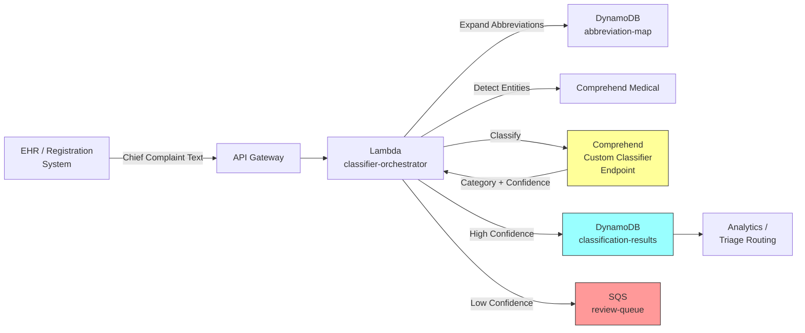

# Recipe 8.1 Architecture and Implementation: Chief Complaint Classification

*Companion to [Recipe 8.1: Chief Complaint Classification](chapter08.01-chief-complaint-classification). This page covers the AWS architecture, services, prerequisites, and pseudocode. For the problem framing and the conceptual approach, start with the main recipe.*

---

## The AWS Implementation

Now let's build this. The chief complaint classifier is a lightweight, high-throughput workload: short text in, category label out, sub-second latency required because it sits in the patient registration workflow. Here's how I'd wire it on AWS.

### Why These Services

**Amazon Comprehend (Custom Classification)** for the core classification task. Comprehend's custom classifier lets you train a multi-class text classification model on your labeled data without managing ML infrastructure. You upload your training CSV (text, label pairs), Comprehend trains a model, deploys it to a real-time endpoint, and handles scaling. For chief complaint classification, this is the right abstraction because the problem is straightforward supervised classification on short text. You don't need SageMaker's flexibility here; you need a managed classifier that works out of the box.

**Amazon Comprehend Medical** for preprocessing augmentation. Before classification, Comprehend Medical's entity detection can identify medical terms and normalize abbreviations, improving the classifier's input quality. It recognizes clinical entities (symptoms, conditions, medications) in raw text, which helps disambiguate entries like "HA" (headache vs. unrelated).

**Amazon S3** for training data storage and model artifacts. Your labeled training dataset lives here, and Comprehend reads from S3 when training.

**AWS Lambda** for the classification orchestration. The workflow is: receive text, preprocess, call the Comprehend endpoint, apply confidence gating, write results. Stateless, fast, and scales with request volume.

**Amazon DynamoDB** for the abbreviation lookup table and classification results. The abbreviation expansion dictionary is a key-value lookup that DynamoDB handles perfectly. Results storage enables analytics, model retraining, and audit.

**Amazon SQS** for the low-confidence review queue. Predictions below the confidence threshold get dropped into a queue for human review, decoupling the classification pipeline from the review workflow.

### Architecture Diagram



### Prerequisites

| Requirement | Details |
|-------------|---------|
| **AWS Services** | Amazon Comprehend, Amazon Comprehend Medical, Amazon S3, AWS Lambda, Amazon DynamoDB, Amazon SQS, Amazon API Gateway |
| **IAM Permissions** | `comprehend:ClassifyDocument`, `comprehend:DetectEntities` (medical), `s3:GetObject`, `s3:PutObject`, `dynamodb:GetItem`, `dynamodb:PutItem`, `sqs:SendMessage` |
| **BAA** | AWS BAA signed (chief complaints are PHI; they describe why a patient is seeking care) |
| **Encryption** | S3: SSE-KMS; DynamoDB: encryption at rest (default); SQS: SSE-KMS; all API calls over TLS |
| **VPC** | Production: Lambda in VPC with VPC endpoints for Comprehend, Comprehend Medical (separate endpoint: `com.amazonaws.{region}.comprehendmedical`), S3, DynamoDB, SQS, and CloudWatch Logs |
| **CloudTrail** | Enabled: log all Comprehend and DynamoDB API calls for HIPAA audit trail |
| **Training Data** | Minimum 1,000 labeled examples per category (ideally 5,000+). Historical chief complaints with routing decisions from your institution's EHR. De-identify before use in development. |
| **Cost Estimate** | Comprehend Custom Classification: $0.0005 per request (real-time endpoint). Comprehend Medical: $0.01 per 100 characters. Lambda and DynamoDB negligible at this scale. Endpoint hosting: ~$0.50/hour per inference unit (minimum 1 unit, ~$360/month always-on). This hosting fee dominates cost at moderate volumes. Consider scheduling endpoint scale-down during off-peak hours or using async/batch inference for non-real-time use cases. |

### Ingredients

| AWS Service | Role |
|------------|------|
| **Amazon Comprehend (Custom)** | Trained multi-class text classifier for chief complaint categories |
| **Amazon Comprehend Medical** | Entity detection for preprocessing enrichment and abbreviation disambiguation |
| **Amazon S3** | Stores training data and model artifacts |
| **AWS Lambda** | Orchestrates preprocessing, classification, and routing logic |
| **Amazon DynamoDB** | Abbreviation expansion table and classification result storage |
| **Amazon SQS** | Dead letter queue for low-confidence classifications needing human review |

<!-- TODO (TechWriter): Expert review S1 (MEDIUM). Add SQS queue access control guidance: queue policy restricting sqs:ReceiveMessage to the review application's IAM role only, message retention period set to match review SLA (e.g., 24 hours not the default 4 days), and a dead-letter queue for messages exceeding max receive count. PHI in an unscoped queue is a compliance gap. -->
<!-- TODO (TechWriter): Expert review S2 (MEDIUM). Specify resource-scoped IAM statements: dynamodb:GetItem on abbreviation-map table ARN only, dynamodb:GetItem+PutItem on classification-results table ARN only. Separate sensitivity levels (config vs. PHI). -->
| **Amazon API Gateway** | RESTful endpoint for synchronous classification requests |
| **AWS KMS** | Manages encryption keys for all data stores |
| **Amazon CloudWatch** | Metrics on classification latency, confidence distribution, and error rates |

### Code

> **Reference implementations:** The following AWS resources demonstrate patterns used in this recipe:
>
> - [`amazon-comprehend-examples`](https://github.com/aws-samples/amazon-comprehend-examples): Comprehend custom classification training and real-time inference examples
> - [`amazon-comprehend-medical-fhir-integration`](https://github.com/aws-samples/amazon-comprehend-medical-fhir-integration): Healthcare-specific: integrating Comprehend Medical entity extraction with FHIR data models

#### Walkthrough

**Step 1: Preprocess the chief complaint text.** Raw chief complaint text arrives from the EHR or registration system in whatever form the clerk or kiosk produced it. Before classification, we need to normalize it: lowercase everything, expand known abbreviations, strip extraneous characters. This step is critical because "CP" and "chest pain" are the same clinical concept but look completely different to a classifier. Without preprocessing, you're effectively asking the model to learn every abbreviation variant independently, which wastes training capacity and hurts accuracy on rare abbreviations. The abbreviation map is a living configuration that grows as you encounter new shorthand.

```json
{
  "cp": "chest pain",
  "sob": "shortness of breath",
  "ha": "headache",
  "n/v": "nausea and vomiting",
  "n/v/d": "nausea vomiting and diarrhea",
  "abd": "abdominal",
  "htn": "hypertension",
  "loc": "loss of consciousness",
  "uti": "urinary tract infection",
  "uri": "upper respiratory infection",
  "lbp": "low back pain",
  "r/o": "rule out",
  "s/p": "status post",
  "fx": "fracture",
  "lac": "laceration",
  "mva": "motor vehicle accident",
  "doi": "date of injury",
  "ams": "altered mental status",
  "etoh": "alcohol",
  "oi": "orthopedic injury"
}
```

```pseudocode
FUNCTION preprocess_complaint(raw_text, abbreviation_map):
    // Start by lowercasing everything. Chief complaints come in every case style
    // imaginable: "CHEST PAIN", "Chest Pain", "chest pain", "cHeSt PaIn" (ok, rare).
    text = lowercase(raw_text)

    // Remove characters that add no clinical meaning but confuse tokenization.
    // Keep letters, numbers, spaces, and forward slashes (used in abbreviations like "n/v").
    text = remove characters not in [a-z, 0-9, spaces, /]

    // Expand abbreviations using the institutional lookup table.
    // Split into tokens, check each against the map, replace if found.
    tokens = split text by whitespace
    expanded_tokens = empty list

    FOR each token in tokens:
        IF token exists in abbreviation_map:
            // Replace the abbreviation with its full form.
            // "cp" becomes "chest pain" (two words, which is fine).
            append abbreviation_map[token] to expanded_tokens
        ELSE:
            // Not a known abbreviation. Keep as-is.
            append token to expanded_tokens

    // Rejoin into a single clean string ready for classification.
    RETURN join expanded_tokens with spaces
```

**Step 2: Enrich with medical entity detection (optional).** For ambiguous inputs, Comprehend Medical can identify clinical entities in the text and provide normalized forms. This step is optional for high-volume, straightforward complaints but valuable for edge cases. If the preprocessed text is still ambiguous (short, unusual phrasing), entity detection adds signal by confirming which words are symptoms, conditions, or body parts. Skip this step for clear inputs to save cost and latency; use it selectively for short or ambiguous entries. The entity types Comprehend Medical returns (SYMPTOM, DIAGNOSIS, ANATOMY) can be appended as features to improve classifier accuracy.

```pseudocode
FUNCTION enrich_with_entities(preprocessed_text):
    // Call Comprehend Medical to identify clinical entities in the text.
    // This is optional enrichment: it helps the classifier by making implicit
    // medical concepts explicit.
    response = call ComprehendMedical.DetectEntities with:
        text = preprocessed_text

    // Extract detected entities and their types.
    // Example: "chest pain" might return [{ text: "chest pain", type: "SYMPTOM", score: 0.97 }]
    entities = empty list
    FOR each entity in response.Entities:
        append to entities: {
            text: entity.Text,       // the span of text identified
            type: entity.Type,       // SYMPTOM, DIAGNOSIS, ANATOMY, etc.
            category: entity.Category,   // MEDICAL_CONDITION, ANATOMY, etc.
            score: entity.Score       // confidence in this detection
        }

    // Return entities for optional downstream use (can be appended to classifier input
    // or used for logging and analytics).
    RETURN entities
```

**Step 3: Classify the complaint.** This is the core step. The preprocessed (and optionally enriched) text goes to the Comprehend custom classifier endpoint, which returns a ranked list of categories with confidence scores. The classifier was trained on your institution's historical data: tens of thousands of chief complaint entries paired with the category they were ultimately assigned. Comprehend handles the ML details (tokenization, model architecture, hyperparameter tuning) during training. At inference time, you send text and get back categories. The top prediction is what we'll use for routing, but we keep the full ranked list for analytics and for cases where the top two predictions are close (which signals ambiguity).

```pseudocode
FUNCTION classify_complaint(preprocessed_text, endpoint_arn):
    // Send the cleaned text to the Comprehend custom classifier endpoint.
    // The endpoint runs a model trained on your institution's labeled chief complaints.
    response = call Comprehend.ClassifyDocument with:
        text         = preprocessed_text
        endpoint_arn = endpoint_arn    // ARN of your deployed custom classifier

    // The response contains a ranked list of classes (categories) with scores.
    // Extract the top prediction and its confidence.
    classes = response.Classes    // sorted by confidence, highest first

    top_prediction = {
        category: classes[0].Name,     // e.g., "Chest Pain, Cardiac"
        confidence: classes[0].Score,    // e.g., 0.94 (94%)
        runner_up: {
            category: classes[1].Name,   // second most likely category
            confidence: classes[1].Score   // useful for ambiguity detection
        },
        all_predictions: classes          // full ranked list for analytics
    }

    RETURN top_prediction
```

**Step 4: Apply confidence gating.** Not every classification is reliable enough for automated routing. A 94% confidence prediction of "Chest Pain, Cardiac" is fine to route automatically. A 62% confidence prediction where the top two categories are "Abdominal Pain" and "Pelvic Pain" should go to a human. This step applies that judgment. The threshold is a tunable parameter: lower it and more predictions route automatically (faster, cheaper, but more errors); raise it and more go to human review (slower, more expensive, but safer). In healthcare, start conservative (85-90% threshold) and lower it as you gain confidence in the model's performance on your specific population.

```pseudocode
CONFIDENCE_THRESHOLD = 0.85    // 85%. Predictions below this go to human review.
AMBIGUITY_GAP = 0.15           // If top two predictions are within 15 points, flag as ambiguous.

FUNCTION apply_confidence_gate(prediction):
    // Check 1: Is the top prediction confident enough?
    IF prediction.confidence < CONFIDENCE_THRESHOLD:
        RETURN {
            action: "REVIEW",           // route to human review queue
            reason: "low_confidence",
            category: prediction.category,
            confidence: prediction.confidence
        }

    // Check 2: Even if top prediction is confident, is it too close to the runner-up?
    // A 87% prediction with a 84% runner-up means the model is essentially undecided.
    gap = prediction.confidence - prediction.runner_up.confidence
    IF gap < AMBIGUITY_GAP:
        RETURN {
            action: "REVIEW",
            reason: "ambiguous_top_two",
            category: prediction.category,
            confidence: prediction.confidence,
            runner_up: prediction.runner_up.category
        }

    // Both checks passed. This prediction is confident and unambiguous.
    RETURN {
        action: "ROUTE",               // safe to route automatically
        category: prediction.category,
        confidence: prediction.confidence
    }
```

**Step 5: Store results and route.** The final step writes the classification result to the database (for analytics, retraining, and audit) and routes it to the appropriate destination. High-confidence, unambiguous predictions go directly to the downstream system (triage protocol engine, analytics dashboard, capacity planner). Low-confidence or ambiguous predictions go to the SQS review queue for human classification. Every result is stored regardless of routing decision, creating the audit trail healthcare compliance requires and the training dataset that improves the model over time.

```pseudocode
FUNCTION store_and_route(original_text, preprocessed_text, prediction, gate_result):
    // Build the complete classification record.
    record = {
        complaint_id: generate unique ID,
        timestamp: current UTC time (ISO 8601),
        original_text: original_text,        // what the user actually typed
        preprocessed: preprocessed_text,    // after abbreviation expansion
        predicted_category: prediction.category,
        confidence: prediction.confidence,
        runner_up: prediction.runner_up.category,
        gate_action: gate_result.action,   // "ROUTE" or "REVIEW"
        gate_reason: gate_result.reason,   // null if routed, reason string if reviewed
        final_category: null                  // populated after human review, if applicable
    }

    // Write to DynamoDB for persistence and analytics.
    write record to DynamoDB table "complaint-classifications"

    // Route based on the gate decision.
    IF gate_result.action == "ROUTE":
        // High confidence. Send directly to downstream systems.
        publish classification event to downstream consumers
        // (triage routing, analytics pipeline, capacity dashboard)

    ELSE:
        // Low confidence or ambiguous. Queue for human review.
        send message to SQS queue "complaint-review-queue" with:
            complaint_id: record.complaint_id,
            original_text: original_text,
            top_category: prediction.category,
            confidence: prediction.confidence,
            runner_up: prediction.runner_up.category

    RETURN record
```

> **Curious how this looks in Python?** The pseudocode above covers the concepts. If you'd like to see sample Python code that demonstrates these patterns using boto3, check out the [Python Example](chapter08.01-python-example). It walks through each step with inline comments and notes on what you'd need to change for a real deployment.

### Expected Results

**Sample output for a typical classification:**

```json
{
  "complaint_id": "cc-2026-03-15-00847",
  "timestamp": "2026-03-15T09:14:22Z",
  "original_text": "CP x 2 days, worse w/ exertion",
  "preprocessed": "chest pain x 2 days worse with exertion",
  "predicted_category": "Chest Pain, Cardiac",
  "confidence": 0.93,
  "runner_up": "Chest Pain, Non-Cardiac",
  "gate_action": "ROUTE",
  "gate_reason": null,
  "final_category": null
}
```

**Performance benchmarks:**

| Metric | Typical Value |
|--------|---------------|
| End-to-end latency | 150-400 ms (warm invocation); 800-1500 ms (cold start). Mitigate cold starts with provisioned concurrency if sub-500ms latency is consistently required. |
| Top-1 accuracy | 88-95% (depends on training data quality and category count) |
| Top-3 accuracy | 96-99% |
| Auto-route rate | 75-85% of complaints (with 85% confidence threshold) |
| Cost per classification | ~$0.001 (Comprehend + Lambda + DynamoDB) |
| Throughput | 100+ classifications/second (Lambda concurrency) |

**Where it struggles:**

- Multi-complaint entries ("chest pain and shortness of breath") may classify to only one category. When a secondary complaint is missed, it may not trigger the appropriate clinical protocol; for EDs where multi-complaint entries exceed 15% of volume, prioritize the multi-label variation before going to production.
- Very short inputs ("pain") with insufficient context for confident classification
- Novel abbreviations not in the expansion table
- Rare categories with few training examples (class imbalance)
- Entries in languages other than the training language
- Negated complaints in telephone triage contexts ("denies chest pain, presenting for medication refill")

---

## Variations and Extensions

<!-- TODO (TechWriter): Expert review A3 (MEDIUM). Add a "Retraining Pipeline" variation showing: SQS review queue corrections written back to training S3 bucket, scheduled (weekly/monthly) Step Functions workflow triggering Comprehend training, A/B accuracy comparison of new model vs. current, and endpoint update strategy. This is the recipe's key differentiator (feedback loop) but currently has no architectural detail for closing it. -->

**Multi-label classification.** Instead of assigning a single category, allow multiple labels for multi-complaint entries. "Chest pain and shortness of breath" gets both "Chest Pain, Cardiac" and "Respiratory, Dyspnea." This requires changing from multi-class to multi-label classification (Comprehend supports both modes). The routing logic downstream needs to handle multiple categories per encounter.

**Acuity prediction stacking.** After classifying the complaint category, run a second model that predicts acuity level (ESI 1-5) based on the complaint text combined with the predicted category. This creates a two-stage pipeline: first classify what it is, then predict how urgent it is. The category prediction becomes a feature for the acuity model, which improves acuity accuracy compared to predicting directly from raw text alone.

**Real-time model monitoring and drift detection.** Publish classification confidence distributions to CloudWatch as custom metrics. Set alarms when the mean confidence drops below a threshold (indicating the model is seeing inputs it wasn't trained on). Track the review queue volume over time: a rising review rate signals model degradation or vocabulary drift. Automate retraining triggers based on these signals.

---

## Additional Resources

**AWS Documentation:**
- [Amazon Comprehend Custom Classification](https://docs.aws.amazon.com/comprehend/latest/dg/how-document-classification.html)
- [Amazon Comprehend Real-Time Endpoints](https://docs.aws.amazon.com/comprehend/latest/dg/manage-endpoints.html)
- [Amazon Comprehend Medical DetectEntitiesV2](https://docs.aws.amazon.com/comprehend-medical/latest/api/API_DetectEntitiesV2.html)
- [Amazon Comprehend Pricing](https://aws.amazon.com/comprehend/pricing/)
- [AWS HIPAA Eligible Services](https://aws.amazon.com/compliance/hipaa-eligible-services-reference/)

**AWS Sample Repos:**
- [`amazon-comprehend-examples`](https://github.com/aws-samples/amazon-comprehend-examples): Custom classification training, endpoint management, and inference patterns
- [`amazon-comprehend-medical-fhir-integration`](https://github.com/aws-samples/amazon-comprehend-medical-fhir-integration): Integrating Comprehend Medical entity detection with FHIR healthcare data models

**AWS Solutions and Blogs:**
- [Deriving Conversational Insights from Invoices with Amazon Textract, Amazon Comprehend, and Amazon Lex](https://aws.amazon.com/blogs/machine-learning/deriving-conversational-insights-from-invoices-with-amazon-textract-amazon-comprehend-and-amazon-lex/): Demonstrates Comprehend custom classification in a document processing pipeline
- [Building a Medical Language Processing Pipeline with Amazon Comprehend Medical](https://aws.amazon.com/blogs/machine-learning/building-a-medical-language-processing-pipeline-using-amazon-comprehend-medical/): End-to-end architecture for clinical NLP using Comprehend Medical

---

## Estimated Implementation Time

| Tier | Timeline |
|------|----------|
| **Basic** (single-category classifier with manual abbreviation map) | 2-3 weeks |
| **Production-ready** (confidence gating, review queue, monitoring, automated retraining) | 6-8 weeks |
| **With variations** (multi-label, acuity stacking, drift detection) | 10-12 weeks |

---


---

*← [Main Recipe 8.1](chapter08.01-chief-complaint-classification) · [Python Example](chapter08.01-python-example) · [Chapter Preface](chapter08-preface)*
