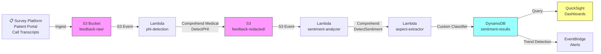

# Recipe 8.2: Patient Sentiment Analysis

**Complexity:** Simple · **Phase:** MVP · **Estimated Cost:** ~$0.01 per feedback item

---

## The Problem

Every healthcare organization collects patient feedback. HCAHPS surveys, Press Ganey scores, post-visit satisfaction questionnaires, patient portal messages, online reviews, complaint hotline transcripts, social media mentions. The volume is enormous and growing. A mid-sized health system might receive 50,000 pieces of written feedback per month across all channels.

Here's the problem: almost nobody reads it all.

Most organizations track the quantitative scores (your "4.2 out of 5" star rating) and call it done. Maybe someone in Patient Experience reads a sample of the verbatim comments. But the text, the actual words patients use to describe their experience, contains information that a number never can. A patient who writes "the nurse was kind but I waited two hours and nobody told me why" is telling you three distinct things: a positive staff interaction, a process failure, and a communication gap. A "3 out of 5" rating flattens all of that into noise.

Sentiment analysis turns that unstructured text into structured signal. Not just "positive or negative" (though that's a start), but which aspects of the experience are driving dissatisfaction, which departments are generating complaints, what themes emerge over time, and where the bright spots are hiding. Done well, it's an early warning system for operational issues and a map of what your patients actually care about.

The stakes are real. CMS ties a portion of hospital reimbursement to patient experience scores through the Hospital Value-Based Purchasing Program. Press Ganey and HCAHPS scores directly affect revenue. And beyond the financial incentive: patients who feel unheard leave. They switch providers, they post negative reviews, they tell their friends. Understanding sentiment at scale is understanding your retention risk.

Let's talk about how the technology works.

---

## The Technology: How Machines Understand Feelings (Sort Of)

### Sentiment Analysis: The Basics

Sentiment analysis is the task of automatically determining the emotional tone of a piece of text. At its simplest, it classifies text as positive, negative, or neutral. At its more useful, it identifies the intensity of sentiment, the specific aspects being discussed, and the emotions expressed.

The field has been around since the early 2000s. Early approaches used hand-crafted word lists: "good" is positive, "terrible" is negative, add up the scores. These lexicon-based methods are fast, interpretable, and surprisingly stubborn in their continued usefulness. But they miss context entirely. "Not bad" has a negative word but positive meaning. "The procedure was painless" has "painless" (negative root) but is expressing relief.

Modern approaches use machine learning. A model trained on thousands of labeled examples learns the relationship between word patterns and sentiment. The dominant architecture for the past few years has been transformer-based models (BERT and its variants), fine-tuned on domain-specific data. These models understand context, handle negation, and capture subtle sentiment signals that word lists miss entirely.

(A quick note: LLMs like GPT-4 can absolutely do sentiment analysis, and often quite well. This recipe focuses on traditional NLP approaches because they're faster, cheaper, more predictable, and perfectly adequate for this use case. You don't need a rocket to deliver a pizza. Recipe 2.1 covers when LLMs make sense for text analysis.)

### Aspect-Based Sentiment: The Real Value

Raw sentiment classification ("this review is negative") tells you almost nothing actionable. You already knew some patients are unhappy. What you need is aspect-based sentiment analysis (ABSA): identifying which specific aspect of the experience the patient is commenting on, and what their sentiment is toward that specific aspect.

Consider: "Dr. Martinez was wonderful but the billing department never answers the phone." That's positive sentiment toward `provider_quality` and negative sentiment toward `billing_communication`. Two distinct signals from one sentence. Aggregate those across 10,000 reviews and you can tell the CFO exactly which operational area is driving dissatisfaction, with evidence.

The aspects you care about in healthcare are fairly consistent:

- Wait time and scheduling
- Provider communication and bedside manner
- Staff friendliness and competence
- Facility cleanliness and environment
- Billing and insurance processes
- Care coordination and follow-up
- Pain management
- Discharge process

ABSA typically works in two stages: first, identify which aspect(s) are mentioned in the text; second, determine the sentiment directed at each one. Some systems do both jointly with a single model. Either way, you need training data that's labeled at the aspect level, which is more expensive to create than simple positive/negative labels.

### Theme Extraction: Discovering What You Didn't Know to Ask About

Beyond predefined aspects, you want the system to surface emergent themes: patterns you didn't anticipate. Maybe there's a cluster of complaints about parking in February (construction project you forgot about). Maybe patients keep mentioning "the lady at the front desk with the red glasses" positively (a staff member creating exceptional experiences that nobody in leadership knows about).

Theme extraction uses topic modeling or clustering techniques to group semantically similar feedback without predefined categories. The classic approach is Latent Dirichlet Allocation (LDA), but newer methods using sentence embeddings and clustering (HDBSCAN, k-means on embeddings) produce more coherent topics and handle short text better.

The output is a set of discovered themes with representative examples. These need human review to name and validate, but they surface blind spots that a predefined aspect taxonomy will miss.

### What Makes Healthcare Sentiment Different

Standard sentiment analysis tooling was built for product reviews and social media. Healthcare feedback has several properties that make it harder:

**Mixed sentiment is the norm, not the exception.** Product reviews tend to be uniformly positive or negative. Patient feedback is almost always a mix: "the surgery went well but recovery was awful." You need aspect-level analysis or you lose the signal entirely.

**Clinical language intersects with emotional language.** "The pain was excruciating" is describing a symptom, not necessarily expressing dissatisfaction with care. "Negative" in "the test came back negative" is good news. Domain-specific context matters enormously.

**Indirectness and understatement.** Patients expressing serious dissatisfaction often hedge: "I'm sure the staff was doing their best, but..." or "I don't want to complain, however..." Lexicon-based systems will score these as positive or neutral because of the hedging language. A healthcare-tuned model needs to recognize that politeness patterns often mask the strongest negative sentiment.

**Cultural and demographic variation.** Sentiment expression varies significantly across age groups, cultural backgrounds, and education levels. Older patients tend to rate everything higher (acquiescence bias). Patients from cultures where direct criticism is impolite will express dissatisfaction through absence of praise rather than explicit negativity. Your model needs to handle this gracefully or you'll systematically undercount dissatisfaction in certain populations.

**PHI contamination.** Patient feedback frequently contains protected health information: names of providers, specific diagnoses, dates of service, medication names. Any system processing this text must handle PHI appropriately. The sentiment analysis itself doesn't need the PHI (you're extracting themes, not re-identifying patients), but the pipeline must protect it.

### The General Architecture Pattern

Conceptually, the pipeline looks like this:

```text
[Collect] → [Preprocess] → [Analyze Sentiment] → [Extract Aspects/Themes] → [Aggregate] → [Visualize/Alert]
```

**Collect.** Feedback arrives from multiple channels: survey platforms, patient portals, call transcripts, social media, email. Each has a different format, different metadata, and different response characteristics. You need a unified ingestion layer that normalizes these into a common schema.

**Preprocess.** Clean the text: handle encoding issues, strip HTML, normalize whitespace. For healthcare, add a PHI detection pass: identify and redact or tag any protected information before it flows to downstream analytics. Also detect the language (multilingual patient populations are real) and decide whether to translate or route to a language-specific model.

**Analyze Sentiment.** Run the cleaned text through your sentiment model. For production use, you want both document-level sentiment (overall tone) and sentence-level sentiment (where in the text does sentiment shift?). Capture confidence scores. Low-confidence predictions should be flagged for review rather than treated as truth.

**Extract Aspects/Themes.** Identify which aspects of the experience are mentioned and attach sentiment to each. Separately, run topic modeling or clustering to discover emergent themes that your predefined aspects don't cover.

**Aggregate.** Roll up results by time period, department, provider, facility, service line, and demographic segment. Calculate trend lines. Detect statistically significant shifts (a department's sentiment dropping 15% in two weeks is signal; a 2% fluctuation is noise).

**Visualize/Alert.** Surface insights through dashboards for patient experience teams. Configure alerts for significant negative trends. Generate periodic reports for department leaders. The output should be actionable, not just informational.

---

## The AWS Implementation

### Why These Services

**Amazon Comprehend for sentiment and entity detection.** Comprehend is AWS's managed NLP service. Its sentiment analysis API classifies text as positive, negative, neutral, or mixed, with confidence scores for each. Crucially for healthcare, it also has a medical variant (Comprehend Medical) that detects PHI entities, which you need for the preprocessing step. You don't need to train, host, or scale any models. The tradeoff: Comprehend's built-in sentiment is document-level and uses generic categories. For aspect-level analysis, you'll need the custom classification feature or a separate model.

**Amazon Comprehend Custom Classification for aspect detection.** Comprehend lets you train custom classifiers on your labeled data. Train one model on your aspect taxonomy (wait_time, provider_communication, billing, etc.) and a second for fine-grained sentiment if the built-in model doesn't capture healthcare-specific nuance well enough. Custom models run on the same managed infrastructure, so you still don't manage servers.

**Amazon S3 for feedback storage.** All incoming feedback lands in S3 as the durable data lake. Organized by source, date, and processing stage. S3 event notifications trigger the analysis pipeline automatically as new feedback arrives.

**AWS Lambda for orchestration.** Each step in the pipeline (PHI detection, sentiment analysis, aspect extraction, result storage) is a short-lived, stateless function. Lambda handles the glue logic: calling Comprehend APIs, parsing responses, routing results. For batch processing of historical feedback, Step Functions coordinates the workflow.

**Amazon DynamoDB for results.** Analyzed results (sentiment scores, aspects, themes, metadata) are stored in DynamoDB for fast lookup by survey ID, date range, or department. The table design supports the access patterns dashboards need: "show me all negative-sentiment feedback for cardiology in the last 30 days."

**Amazon QuickSight for visualization.** QuickSight connects to DynamoDB (via Athena or direct) to power patient experience dashboards. Trend charts, department comparisons, theme word clouds, and drill-down to individual comments. The patient experience team lives in these dashboards.

**Amazon EventBridge for alerting.** When aggregation detects a significant negative trend (configurable thresholds), EventBridge routes an alert to the appropriate team via SNS, Slack, or PagerDuty. Early warning, not just retrospective reporting.

### Architecture Diagram



### Prerequisites

| Requirement | Details |
|-------------|---------|
| **AWS Services** | Amazon Comprehend, Comprehend Medical, S3, Lambda, DynamoDB, QuickSight, EventBridge, SNS |
| **IAM Permissions** | `comprehend:DetectSentiment`, `comprehend:ClassifyDocument`, `comprehend:DetectPiiEntities`, `comprehendmedical:DetectPHI`, `s3:GetObject`, `s3:PutObject`, `dynamodb:PutItem`, `dynamodb:Query` |
| **BAA** | Required: patient feedback often contains PHI (names, dates, diagnoses mentioned in free text) |
| **Encryption** | S3: SSE-KMS; DynamoDB: encryption at rest (default); Lambda logs: KMS-encrypted CloudWatch log groups; all API calls over TLS |
| **VPC** | Production: Lambda in VPC with VPC endpoints for S3, Comprehend, DynamoDB, and CloudWatch Logs |
| **CloudTrail** | Enabled: log all Comprehend and S3 API calls for audit trail |
| **Sample Data** | Synthetic patient feedback. CMS publishes [HCAHPS survey results](https://data.cms.gov/provider-data/topics/hospitals/overall-hospital-quality-star-rating) (aggregate only). Generate synthetic verbatim comments for development. Never use real patient feedback in non-production environments without proper de-identification. |
| **Cost Estimate** | Comprehend DetectSentiment: $0.0001 per unit (100 chars). For average 500-char feedback: ~$0.0005/item. PHI detection adds ~$0.01/item. Custom classification: $0.0005/item. At 50,000 items/month: ~$550/month total. |

### Ingredients

| AWS Service | Role |
|------------|------|
| **Amazon Comprehend** | Sentiment detection (built-in) and custom aspect classification |
| **Amazon Comprehend Medical** | PHI entity detection for preprocessing/redaction |
| **Amazon S3** | Raw and redacted feedback storage; organized by source and date |
| **AWS Lambda** | Orchestration: PHI detection, sentiment analysis, aspect extraction, result assembly |
| **Amazon DynamoDB** | Stores analyzed results for dashboard queries and trend detection |
| **Amazon QuickSight** | Patient experience dashboards and visualizations |
| **Amazon EventBridge** | Routes trend alerts to appropriate teams |
| **AWS KMS** | Encryption key management for all PHI-containing resources |
| **Amazon CloudWatch** | Metrics, logs, and alarms for pipeline health |

### Code

> **Reference implementations:** The following AWS sample repos demonstrate patterns used in this recipe:
>
> - [`amazon-comprehend-examples`](https://github.com/aws-samples/amazon-comprehend-examples): General Comprehend examples including sentiment analysis, custom classification, and entity detection
> - [`amazon-comprehend-medical-fhir-integration`](https://github.com/aws-samples/amazon-comprehend-medical-fhir-integration): Healthcare-specific: integrating Comprehend Medical with FHIR for clinical NLP pipelines

#### Walkthrough

**Step 1: PHI detection and redaction.** Before any analysis, the system scans incoming feedback for protected health information. Patient comments routinely mention provider names, specific diagnoses, medication names, and dates of service. The PHI detection pass identifies these entities and either redacts them (replaces with placeholder tokens like `[PROVIDER_NAME]`) or tags them for downstream handling. This step is non-negotiable for any pipeline processing patient-generated text. The redacted version is what flows to sentiment analysis, so your sentiment models never need access to identifiable information. Skip this step and you're running PHI through analytics services without proper safeguards.

```pseudocode
FUNCTION detect_and_redact_phi(feedback_text):
    // Call the medical NLP service to identify any PHI in the text.
    // PHI includes: names, dates, phone numbers, medical record numbers,
    // and any other individually identifiable health information.
    phi_entities = call ComprehendMedical.DetectPHI with:
        text = feedback_text

    // Build the redacted version by replacing each detected entity with a placeholder.
    // We preserve the entity type so downstream analysis knows a provider was mentioned
    // even though we've removed the actual name.
    redacted_text = feedback_text
    FOR each entity in phi_entities (sorted by offset, descending):
        // Replace from back to front so character offsets remain valid.
        // Example: "Dr. Smith was kind" becomes "[PROVIDER_NAME] was kind"
        redacted_text = replace characters at entity.BeginOffset..entity.EndOffset
                        with "[" + entity.Type + "]"

    RETURN {
        redacted_text: redacted_text,      // safe for downstream analytics
        phi_detected: length(phi_entities) > 0,  // flag for audit
        entity_count: length(phi_entities)
    }
```

**Step 2: Sentiment analysis.** The redacted text goes to the sentiment analysis service. This returns an overall sentiment label (POSITIVE, NEGATIVE, NEUTRAL, MIXED) along with confidence scores for each category. The confidence distribution is often more informative than the top label. A comment scored 60% negative and 35% positive is qualitatively different from one scored 95% negative. The MIXED category is especially important in healthcare feedback, where patients commonly express both gratitude and frustration in the same response. Store the full score distribution, not just the winning label.

```pseudocode
FUNCTION analyze_sentiment(redacted_text):
    // Call the sentiment detection service.
    // Input must be under 5,000 bytes (UTF-8). Patient feedback typically fits easily.
    // For longer texts (call transcripts), split into paragraphs and analyze each.
    response = call Comprehend.DetectSentiment with:
        text          = redacted_text
        language_code = "en"    // detect language first for multilingual populations

    // Extract the full score distribution, not just the top label.
    // A 55% negative / 40% positive split tells a different story than 95% negative.
    RETURN {
        sentiment: response.Sentiment,           // "POSITIVE", "NEGATIVE", "NEUTRAL", "MIXED"
        scores: {
            positive: response.SentimentScore.Positive,
            negative: response.SentimentScore.Negative,
            neutral: response.SentimentScore.Neutral,
            mixed: response.SentimentScore.Mixed
        },
        confidence: maximum of all four scores    // how decisive the classification is
    }
```

**Step 3: Aspect extraction.** This is where generic sentiment becomes actionable intelligence. The system classifies which aspect(s) of the healthcare experience are mentioned in each piece of feedback. A custom classifier trained on your labeled data maps text segments to your aspect taxonomy. For each detected aspect, the system also captures the sentiment directed specifically at that aspect. One comment might yield: `{wait_time: NEGATIVE, provider_quality: POSITIVE, facility: NEUTRAL}`. That's three distinct operational signals from one piece of text.

```pseudocode
// The aspect taxonomy reflects what patient experience teams actually care about.
// This should be configured, not hardcoded. Add/remove aspects as your organization evolves.
ASPECT_TAXONOMY = [
    "wait_time",              // scheduling delays, in-office wait
    "provider_communication", // bedside manner, explanations, listening
    "staff_interaction",      // nursing, front desk, technicians
    "facility_environment",   // cleanliness, comfort, noise, parking
    "billing_insurance",      // charges, statements, coverage confusion
    "care_coordination",      // referrals, follow-up, transitions
    "pain_management",        // pain control, medication responsiveness
    "discharge_process",      // instructions, timing, readiness
    "access_convenience",     // hours, location, telehealth availability
    "overall_experience"      // general impressions not tied to specific aspect
]

FUNCTION extract_aspects(redacted_text, document_sentiment):
    // Split text into sentences for finer-grained analysis.
    // A single feedback item often covers multiple aspects across sentences.
    sentences = split_into_sentences(redacted_text)

    aspect_results = empty list

    FOR each sentence in sentences:
        // Classify which aspect this sentence is about.
        // Uses a custom classifier trained on labeled healthcare feedback.
        aspect_response = call Comprehend.ClassifyDocument with:
            text             = sentence
            endpoint_arn     = ASPECT_CLASSIFIER_ENDPOINT

        // Get the top aspect prediction with confidence.
        top_aspect     = aspect_response.Classes[0].Name
        aspect_conf    = aspect_response.Classes[0].Score

        // Only accept aspect classification if confidence is above threshold.
        // Low-confidence aspect assignments add noise to dashboards.
        IF aspect_conf >= 0.6:
            // Get sentence-level sentiment for this specific aspect mention.
            sentence_sentiment = call Comprehend.DetectSentiment with:
                text          = sentence
                language_code = "en"

            append to aspect_results: {
                aspect: top_aspect,
                sentiment: sentence_sentiment.Sentiment,
                confidence: aspect_conf,
                text: sentence   // keep the source text for drill-down
            }

    RETURN aspect_results
```

**Step 4: Result assembly and storage.** The final step combines all analysis outputs into a single record and writes it to the database. Each record links back to the source feedback item and includes the full analysis: document-level sentiment, aspect-level sentiments, metadata about the source channel and department, and processing timestamps. The table design supports the queries that dashboards need: filter by date range, department, sentiment, or aspect. The `needs_attention` flag routes significantly negative items to immediate human review rather than waiting for monthly reports.

```pseudocode
FUNCTION store_analysis_result(source_metadata, sentiment, aspects):
    // Determine if this item needs immediate human attention.
    // Threshold: overall negative sentiment with high confidence,
    // or any critical aspect (safety, pain) with negative sentiment.
    needs_attention = (
        sentiment.sentiment == "NEGATIVE" AND sentiment.confidence >= 0.85
    ) OR any aspect in aspects where (
        aspect.aspect in ["pain_management", "care_coordination"]
        AND aspect.sentiment == "NEGATIVE"
    )

    // Write the complete analysis record.
    write record to database table "sentiment-results":
        feedback_id       = source_metadata.id                    // links to original feedback
        source_channel    = source_metadata.channel               // "survey", "portal", "review", "call"
        department        = source_metadata.department            // for departmental filtering
        facility          = source_metadata.facility              // for multi-site systems
        analysis_date     = current UTC timestamp (ISO 8601)
        document_sentiment = sentiment                            // full score distribution
        aspects           = aspects                               // list of aspect-sentiment pairs
        needs_attention   = needs_attention                       // routes to review queue
        feedback_date     = source_metadata.submitted_date        // when patient submitted

    // If needs_attention, also emit an event for real-time alerting.
    IF needs_attention:
        emit event to EventBridge:
            source     = "patient-sentiment-pipeline"
            detail_type = "NegativeSentimentAlert"
            detail     = { feedback_id, department, facility, top_negative_aspect }
```

> **Curious how this looks in Python?** The pseudocode above covers the concepts. If you'd like to see sample Python code that demonstrates these patterns using boto3, check out the [Python Example](chapter08.02-python-example). It walks through each step with inline comments and notes on what you'd need to change for a real deployment.

### Expected Results

**Sample output for a typical patient survey comment:**

Input: "The doctor was very thorough and explained everything clearly. But I waited 45 minutes past my appointment time and the waiting room was freezing. Billing sent me a surprise charge three weeks later."

```json
{
  "feedback_id": "survey-2026-03-15-00847",
  "source_channel": "post_visit_survey",
  "department": "internal_medicine",
  "facility": "main_campus",
  "analysis_date": "2026-03-16T02:15:33Z",
  "document_sentiment": {
    "sentiment": "MIXED",
    "scores": {
      "positive": 0.32,
      "negative": 0.41,
      "neutral": 0.08,
      "mixed": 0.19
    },
    "confidence": 0.41
  },
  "aspects": [
    {
      "aspect": "provider_communication",
      "sentiment": "POSITIVE",
      "confidence": 0.91,
      "text": "The doctor was very thorough and explained everything clearly."
    },
    {
      "aspect": "wait_time",
      "sentiment": "NEGATIVE",
      "confidence": 0.88,
      "text": "But I waited 45 minutes past my appointment time."
    },
    {
      "aspect": "facility_environment",
      "sentiment": "NEGATIVE",
      "confidence": 0.72,
      "text": "The waiting room was freezing."
    },
    {
      "aspect": "billing_insurance",
      "sentiment": "NEGATIVE",
      "confidence": 0.85,
      "text": "Billing sent me a surprise charge three weeks later."
    }
  ],
  "needs_attention": false,
  "feedback_date": "2026-03-15T14:30:00Z"
}
```

**Performance benchmarks:**

| Metric | Typical Value |
|--------|---------------|
| End-to-end latency | 2-4 seconds per feedback item |
| Document sentiment accuracy | 85-92% (against human labels) |
| Aspect classification accuracy | 78-88% (depends on training data quality) |
| PHI detection recall | 95-99% (high recall critical here) |
| Cost per feedback item | ~$0.01 (PHI detection + sentiment + aspect classification) |
| Throughput (batch) | ~200 items/minute per Lambda instance |

**Where it struggles:** Very short feedback ("fine", "ok", "terrible") provides too little context for aspect extraction. Sarcasm is reliably misclassified ("Oh sure, waiting two hours was GREAT"). Feedback in languages other than English requires separate model endpoints or translation, adding latency and cost. Mixed-sentiment comments where the positive/negative balance is close to 50/50 produce low-confidence labels that aren't actionable without human review.

---

## The Honest Take

Sentiment analysis is one of those problems where the demo looks amazing and production looks humbling. You'll get the system running in a week, watch it correctly classify 85% of feedback, and feel great. Then you'll look at the 15% it gets wrong and realize those are disproportionately the comments you cared about most.

The hardest cases are the most important cases. A patient who writes a polite, measured paragraph about how they're never coming back (no explicit negative words, no profanity, just quiet disappointment) will probably be classified as neutral. A patient who writes "WORST EXPERIENCE EVER!!!!" is easy for the machine but usually less operationally interesting. The signal-to-noise tradeoff is real.

Aspect extraction requires real investment in labeled data. You need at minimum a few hundred labeled examples per aspect category, reviewed by people who understand both NLP and your patient experience goals. Plan for a 2-4 week labeling sprint before your custom classifier is useful. And plan to refresh that data every 6-12 months as language patterns evolve.

The thing that surprised me most: the aggregate trends are far more valuable than individual predictions. Any single feedback item might be misclassified. But when you aggregate 5,000 items and see that `wait_time` sentiment dropped 20% in the last month for your orthopedics department, that's real signal that survives individual classification errors. Design your system for aggregate intelligence, not individual-comment accuracy.

One more thing: be careful about who sees the raw comments. Patient experience teams need access. But department leaders who see their own negative feedback without context ("why did this patient say I was dismissive?") can react defensively rather than constructively. Present aggregated themes and trends to leadership. Keep individual comment access to the patient experience professionals who are trained to handle it.

---

## Variations and Extensions

**Trend alerting with statistical significance.** Instead of alerting on any negative feedback, implement a rolling baseline per department/aspect and alert only when current sentiment deviates more than 2 standard deviations from the 90-day average. This filters noise and surfaces genuine shifts. Use a simple CUSUM (cumulative sum) control chart, which is well-suited to detecting small, sustained changes that point-based thresholds miss.

**Competitive sentiment benchmarking.** Scrape publicly available reviews from Google, Healthgrades, and Vitals for your organization and competitors. Run the same sentiment/aspect pipeline on public reviews to benchmark your performance. Requires careful attention to terms of service and a clear internal-only use policy. The aspect-level comparison ("our wait_time sentiment is 15 points below Regional Medical Center") gives strategic planning teams concrete targets.

**Multilingual feedback processing.** For health systems serving diverse populations, add a language detection step before sentiment analysis. Route non-English feedback to Amazon Translate first, then to sentiment analysis. Better yet, train language-specific sentiment models if you have sufficient labeled data. Translation introduces nuance loss, especially for culturally specific expressions of dissatisfaction. A native-language model will always outperform translate-then-analyze.

---

## Related Recipes

- **Recipe 8.1 (Chief Complaint Classification):** Uses the same text classification foundation but for clinical routing rather than experience analysis
- **Recipe 2.1 (Patient Message Response Drafting):** LLM-based approach to understanding and responding to patient communications
- **Recipe 4.2 (Patient Education Content Matching):** Uses sentiment signals to personalize content delivery to frustrated or confused patients
- **Recipe 10.2 (Voicemail Transcription and Classification):** Converts voice feedback to text that feeds into this sentiment pipeline

---

## Additional Resources

**AWS Documentation:**
- [Amazon Comprehend Sentiment Analysis](https://docs.aws.amazon.com/comprehend/latest/dg/how-sentiment.html)
- [Amazon Comprehend Custom Classification](https://docs.aws.amazon.com/comprehend/latest/dg/how-document-classification.html)
- [Amazon Comprehend Medical DetectPHI](https://docs.aws.amazon.com/comprehend-medical/latest/dev/textract-phi.html)
- [Amazon Comprehend Pricing](https://aws.amazon.com/comprehend/pricing/)
- [AWS HIPAA Eligible Services](https://aws.amazon.com/compliance/hipaa-eligible-services-reference/)

**AWS Sample Repos:**
- [`amazon-comprehend-examples`](https://github.com/aws-samples/amazon-comprehend-examples): Sentiment analysis, custom classification, and entity detection examples
- [`amazon-comprehend-medical-fhir-integration`](https://github.com/aws-samples/amazon-comprehend-medical-fhir-integration): Healthcare NLP pipeline integrating Comprehend Medical with FHIR
- [`amazon-comprehend-custom-entity`](https://github.com/aws-samples/amazon-comprehend-custom-entity): Training custom entity recognizers (applicable to aspect detection)

**AWS Solutions and Blogs:**
- [Analyzing Customer Feedback with Amazon Comprehend](https://aws.amazon.com/blogs/machine-learning/how-to-scale-sentiment-analysis-using-amazon-comprehend-aws-glue-and-amazon-athena/): End-to-end architecture for scaling sentiment analysis with Glue and Athena
- [Building a Medical Language Processing Pipeline](https://aws.amazon.com/blogs/machine-learning/building-a-medical-language-processing-pipeline-using-amazon-comprehend-medical/): Healthcare-specific NLP pipeline patterns

---

## Estimated Implementation Time

| Tier | Timeline | What You Get |
|------|----------|--------------|
| **Basic** | 1-2 weeks | Document-level sentiment on survey text, simple dashboard, no aspect extraction |
| **Production-ready** | 4-6 weeks | PHI redaction, aspect-level analysis with custom classifier, trend dashboards, alerting |
| **With variations** | 8-12 weeks | Multilingual support, competitive benchmarking, statistical trend detection, executive reporting |

---

## Tags

`nlp` · `sentiment-analysis` · `comprehend` · `patient-experience` · `hcahps` · `aspect-extraction` · `simple` · `mvp` · `lambda` · `s3` · `dynamodb` · `quicksight` · `hipaa`

---

*← [Recipe 8.1: Chief Complaint Classification](chapter08.01-chief-complaint-classification) · [Chapter 8 Index](chapter08-index) · [Next: Recipe 8.3: ICD-10 Code Suggestion →](chapter08.03-icd10-code-suggestion)*
