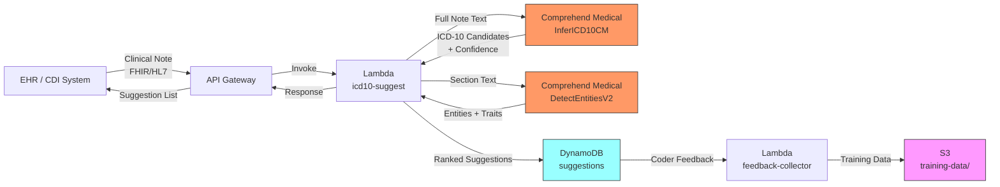

# Recipe 8.3 Architecture and Implementation: ICD-10 Code Suggestion

*Companion to [Recipe 8.3: ICD-10 Code Suggestion](chapter08.03-icd-10-code-suggestion). This page covers the AWS architecture, services, prerequisites, and pseudocode. For the problem framing and the conceptual approach, start with the main recipe.*

---

## The AWS Implementation

### Why These Services

**Amazon Comprehend Medical (InferICD10CM)** is the core service for this recipe. It takes clinical text as input and returns a ranked list of ICD-10-CM code candidates with confidence scores. It handles the full pipeline internally: concept extraction, assertion detection, and code mapping in a single API call. The model is trained on clinical text corpora and understands medical abbreviations, negation, and clinical phrasing. It's a HIPAA-eligible managed service, which means no infrastructure to manage and no model training required.

**Amazon Comprehend Medical (DetectEntitiesV2)** provides a complementary view. While InferICD10CM focuses specifically on ICD-10 code generation, DetectEntitiesV2 extracts all clinical entities with their assertion traits (negation, historical, family history). Using both together gives you both the code suggestions and the entity-level metadata that helps coders understand why a code was suggested.

**Amazon SageMaker** (optional) enters the picture when you want to augment the managed API with a custom model. If your organization has specialty-specific coding patterns that Comprehend Medical handles poorly (dermatology sub-codes, ophthalmology laterality, behavioral health nuances), you can train a supplementary model on your own coded data and ensemble its predictions with Comprehend Medical's output.

**AWS Lambda** for processing orchestration. Notes come in from the EHR (via HL7 FHIR, a file drop, or an API integration), get processed through Comprehend Medical, and the resulting suggestions are returned to the coding workflow.

**Amazon DynamoDB** stores the suggestion results, coder decisions (accepted, modified, rejected), and feedback data that drives model improvement over time.

**Amazon S3** holds the clinical notes in transit and provides durable storage for audit trails and training data assembly.

### Architecture Diagram



### Prerequisites

| Requirement | Details |
|-------------|---------|
| **AWS Services** | Amazon Comprehend Medical, AWS Lambda, Amazon API Gateway, Amazon DynamoDB, Amazon S3, AWS KMS, Amazon CloudWatch |
| **IAM Permissions** | `comprehendmedical:InferICD10CM`, `comprehendmedical:DetectEntitiesV2`, `dynamodb:PutItem`, `dynamodb:GetItem`, `s3:PutObject`, `s3:GetObject`, `kms:Decrypt`, `kms:GenerateDataKey`. Scope all permissions to specific resource ARNs: S3 actions restricted to the clinical-notes and audit-records bucket prefixes, DynamoDB actions restricted to the `icd10-suggestions` and coding-rules table ARNs. Add `aws:RequestedRegion` condition to prevent cross-region access. |
| **BAA** | AWS BAA signed. Comprehend Medical, Lambda, DynamoDB, S3, API Gateway, and CloudWatch are all HIPAA-eligible services. |
| **Encryption** | S3: SSE-KMS with customer-managed key. DynamoDB: encryption at rest (default). API Gateway: TLS 1.2 in transit. Lambda environment variables encrypted with KMS. CloudWatch log groups: configure KMS encryption (logs may contain clinical text fragments). |
| **VPC** | Production: Lambda in VPC with VPC endpoints for Comprehend Medical, DynamoDB, S3, KMS, and CloudWatch Logs. Enable Private DNS on all VPC endpoints. For EHR systems connected via Direct Connect or VPN, use a Private REST API in API Gateway with an interface VPC endpoint (`execute-api`) so clinical notes never traverse the public internet. For external EHR systems, use mutual TLS (mTLS) on the API Gateway custom domain. |
| **CloudTrail** | Enabled for all Comprehend Medical, S3, and DynamoDB API calls. Clinical notes are PHI; full audit trail is required. |
| **Sample Data** | MIMIC-IV (freely available after PhysioNet credentialing) contains discharge summaries with ICD codes. CMS publishes ICD-10-CM code descriptions and guidelines. Use synthetic notes for development; never use real PHI in non-production environments. |
| **Cost Estimate** | Comprehend Medical InferICD10CM: $0.01 per 100 characters (UTF-8). A typical progress note of 2,000-5,000 characters costs $0.20-$0.50 per InferICD10CM call. DetectEntitiesV2: same pricing. Combined: $0.40-$1.00 per note if you call both APIs on the full text. Section-targeted approach (calling only on Assessment/Plan, typically 500-1,500 chars): $0.05-$0.15 per note. |

### Ingredients

| AWS Service | Role |
|------------|------|
| **Amazon Comprehend Medical (InferICD10CM)** | Core ICD-10 suggestion engine. Accepts clinical text, returns ranked ICD-10-CM candidates with confidence scores and evidence text spans. |
| **Amazon Comprehend Medical (DetectEntitiesV2)** | Supplementary entity extraction with assertion traits. Provides negation, family history, and temporal context that enriches the suggestion display for coders. |
| **AWS Lambda** | Processing orchestration: receives notes, calls Comprehend Medical APIs, assembles ranked suggestion lists, stores results. |
| **Amazon API Gateway** | REST endpoint for EHR integration. Provides authentication, throttling, and request/response transformation. |
| **Amazon DynamoDB** | Stores suggestion records and coder feedback (accepted, modified, rejected decisions). Enables feedback loop for quality monitoring. |
| **Amazon S3** | Stores clinical note text in transit, audit records, and assembled training datasets for future model improvement. |
| **AWS KMS** | Customer-managed encryption for all PHI at rest. |
| **Amazon CloudWatch** | Operational metrics: suggestion latency, confidence distributions, API error rates, coder acceptance rates. |

### Pseudocode Walkthrough

**Step 0: Validate input before processing.** Before spending API credits on Comprehend Medical calls, validate the incoming request. Bad input (truncated payloads, binary garbage, empty strings) should fail fast with a clear error rather than producing garbage suggestions that erode coder trust.

```pseudocode
FUNCTION validate_request(request):
    // Verify required fields are present.
    IF request.encounter_id is missing OR request.encounter_id is empty:
        RETURN error("Missing encounter_id")

    IF request.clinical_note is missing OR request.clinical_note is empty:
        RETURN error("Missing clinical_note text")

    // Verify encounter_id format. Prevents injection and simplifies downstream lookups.
    // Adjust pattern to match your EHR's identifier format.
    IF NOT matches_pattern(request.encounter_id, "^[A-Za-z0-9\\-]{5,64}$"):
        RETURN error("Invalid encounter_id format")

    // Verify UTF-8 encoding and reject binary/null bytes.
    // Clinical notes are text. Binary payloads indicate a malformed request
    // (or someone sending a PDF instead of extracted text).
    IF contains_null_bytes(request.clinical_note):
        RETURN error("Note contains null bytes; expected UTF-8 text")

    IF NOT is_valid_utf8(request.clinical_note):
        RETURN error("Note is not valid UTF-8")

    // Enforce minimum length. A 20-character "note" can't contain
    // enough clinical context for meaningful code suggestion.
    IF length(request.clinical_note) < 50:
        RETURN error("Note too short for code suggestion (minimum 50 characters)")

    // Extract requester identity from request headers.
    // HIPAA minimum necessary: log who requested suggestions for this encounter.
    requester_id = request.headers["X-Requester-Id"]
    IF requester_id is missing OR requester_id is empty:
        RETURN error("Missing X-Requester-Id header (coder identity required)")

    RETURN valid(requester_id)
```

At the API Gateway level, configure request validation, rate limiting (per API key, scoped to your EHR integration clients), and mutual TLS or IAM authorization. This prevents cost-based denial-of-service: without rate limits, a misconfigured EHR integration could blast thousands of requests per second and run up a significant Comprehend Medical bill before anyone notices. Start with a conservative throttle (50 requests per second per client) and increase based on observed traffic patterns.

**Step 1: Receive and preprocess the clinical note.** Notes arrive from the EHR via API call (synchronous workflow for real-time suggestions in the coding UI) or via a batch file drop (async workflow for overnight processing). The preprocessing step segments the note into clinically relevant sections and identifies the highest-value text for code suggestion. The Assessment and Plan section contains the most explicitly codable content. The Problem List is often a bulleted list of active diagnoses. Sending the entire 5,000-word note to Comprehend Medical works, but it's expensive and introduces noise from review-of-systems negations and template boilerplate.

```pseudocode
// Section headers commonly found in clinical notes.
// The Assessment/Plan section is the richest source of codable diagnoses.
// We prioritize these sections but fall back to full text if sections aren't detected.
PRIORITY_SECTIONS = [
    "assessment and plan",
    "assessment/plan",
    "assessment",
    "plan",
    "diagnoses",
    "problem list",
    "impression",
    "discharge diagnoses"
]

SECONDARY_SECTIONS = [
    "history of present illness",
    "hpi",
    "hospital course"
]

FUNCTION preprocess_note(raw_note_text):
    // Attempt to segment the note by section headers.
    // Clinical notes typically use headers like "ASSESSMENT AND PLAN:" or "HPI:"
    // followed by a colon or newline.
    sections = segment_by_headers(raw_note_text)

    // If we found recognizable sections, extract priority content.
    IF sections is not empty:
        priority_text = ""
        secondary_text = ""

        FOR each section_name, section_content in sections:
            normalized_name = lowercase(trim(section_name))
            IF normalized_name matches any in PRIORITY_SECTIONS:
                priority_text = priority_text + " " + section_content
            ELSE IF normalized_name matches any in SECONDARY_SECTIONS:
                secondary_text = secondary_text + " " + section_content

        // Use priority text if available; fall back to secondary; last resort is full text.
        IF length(priority_text) > 50:
            coding_text = trim(priority_text)
        ELSE IF length(secondary_text) > 50:
            coding_text = trim(secondary_text)
        ELSE:
            coding_text = trim(raw_note_text)
    ELSE:
        // No section headers detected. Use the full note.
        coding_text = trim(raw_note_text)

    // Comprehend Medical InferICD10CM accepts up to 10,000 UTF-8 characters.
    // Truncate at sentence boundary if we exceed the limit.
    IF length(coding_text) > 9500:
        coding_text = truncate_at_sentence_boundary(coding_text, 9500)

    RETURN coding_text
```

**Step 2: Call InferICD10CM for code candidates.** This is the core inference step. We send the preprocessed clinical text to Comprehend Medical's ICD-10 inference API and receive back a structured response containing entities (spans of text that map to diagnostic concepts) and their associated ICD-10-CM code candidates ranked by confidence.

```pseudocode
// Confidence thresholds for different suggestion tiers.
// High-confidence suggestions are presented as "recommended" to the coder.
// Medium-confidence suggestions are presented as "possible" alternatives.
// Below the minimum threshold, we don't surface the suggestion at all.
HIGH_CONFIDENCE_THRESHOLD = 0.80
MEDIUM_CONFIDENCE_THRESHOLD = 0.50
MINIMUM_CONFIDENCE_THRESHOLD = 0.30

// Maximum number of candidate codes to return per entity.
MAX_CANDIDATES_PER_ENTITY = 5

FUNCTION infer_icd10_codes(coding_text):
    // Call the Comprehend Medical InferICD10CM API with retry logic.
    // Comprehend Medical can throttle under load or experience transient errors.
    // Retry with exponential backoff: 1s, then 2s. After 2 retries, fail gracefully.
    MAX_RETRIES = 2
    RETRY_DELAYS = [1 second, 2 seconds]

    response = null
    FOR attempt = 0 TO MAX_RETRIES:
        TRY:
            response = call ComprehendMedical.InferICD10CM with:
                Text = coding_text
            BREAK  // success, exit retry loop
        CATCH ThrottlingException, ServiceUnavailableException:
            IF attempt < MAX_RETRIES:
                wait(RETRY_DELAYS[attempt])
                CONTINUE
            ELSE:
                // All retries exhausted. Return a valid empty response
                // rather than HTTP 500. The coder can still work without suggestions.
                log_warning("InferICD10CM unavailable after retries", encounter_id)
                RETURN {
                    suggestions: empty list,
                    suggestion_count: 0,
                    status: "service_unavailable"
                }
        CATCH InvalidRequestException:
            // Input text issue (too long, invalid encoding). Don't retry.
            log_error("Invalid request to InferICD10CM", encounter_id)
            RETURN {
                suggestions: empty list,
                suggestion_count: 0,
                status: "invalid_input"
            }

    suggestions = empty list

    FOR each entity in response.Entities:
        // entity.Text = the span of clinical text that triggered this entity
        // entity.Category = always "MEDICAL_CONDITION" for InferICD10CM
        // entity.Traits = assertion modifiers (NEGATION, SIGN, SYMPTOM, DIAGNOSIS)
        // entity.ICD10CMConcepts = ranked list of code candidates

        // Check assertion traits: skip negated concepts.
        is_negated = any trait in entity.Traits where trait.Name == "NEGATION" and trait.Score >= 0.75
        IF is_negated:
            CONTINUE    // "No diabetes" should not suggest diabetes codes.

        // Check for SIGN vs DIAGNOSIS trait.
        // Signs/symptoms get coded differently than confirmed diagnoses.
        is_sign_or_symptom = any trait in entity.Traits where trait.Name in ["SIGN", "SYMPTOM"] and trait.Score >= 0.75
        is_diagnosis = any trait in entity.Traits where trait.Name == "DIAGNOSIS" and trait.Score >= 0.75

        // Process code candidates.
        candidates = empty list
        FOR each concept in entity.ICD10CMConcepts (up to MAX_CANDIDATES_PER_ENTITY):
            IF concept.Score < MINIMUM_CONFIDENCE_THRESHOLD:
                BREAK   // candidates are sorted by score; once below minimum, stop

            tier = "low"
            IF concept.Score >= HIGH_CONFIDENCE_THRESHOLD:
                tier = "high"
            ELSE IF concept.Score >= MEDIUM_CONFIDENCE_THRESHOLD:
                tier = "medium"

            candidates.append({
                code: concept.Code,
                description: concept.Description,
                confidence: round(concept.Score, 3),
                tier: tier
            })

        IF candidates is not empty:
            suggestions.append({
                evidence_text: entity.Text,
                begin_offset: entity.BeginOffset,
                end_offset: entity.EndOffset,
                is_sign_or_symptom: is_sign_or_symptom,
                is_diagnosis: is_diagnosis,
                candidates: candidates
            })

    RETURN suggestions
```

**Step 3: Enrich with entity context from DetectEntitiesV2.** The InferICD10CM API is focused narrowly on code generation. DetectEntitiesV2 provides broader clinical context: medications that contextualize a diagnosis, anatomical locations that inform laterality coding, and temporal expressions that distinguish acute from chronic conditions. This enrichment helps coders make better decisions, especially when choosing between codes at the same hierarchy level.

```pseudocode
FUNCTION enrich_with_entity_context(coding_text):
    // Call DetectEntitiesV2 for broader clinical entity extraction.
    response = call ComprehendMedical.DetectEntitiesV2 with:
        Text = coding_text

    context_entities = {
        medications: empty list,
        conditions: empty list,
        anatomy: empty list,
        time_expressions: empty list
    }

    FOR each entity in response.Entities:
        // Build context record with assertion traits.
        traits = []
        FOR each trait in entity.Traits:
            IF trait.Score >= 0.70:
                traits.append(trait.Name)

        record = {
            text: entity.Text,
            category: entity.Category,
            type: entity.Type,
            confidence: round(entity.Score, 3),
            traits: traits
        }

        // Categorize for coder display.
        IF entity.Category == "MEDICATION":
            context_entities.medications.append(record)
        ELSE IF entity.Category == "MEDICAL_CONDITION":
            context_entities.conditions.append(record)
        ELSE IF entity.Category == "ANATOMY":
            context_entities.anatomy.append(record)
        ELSE IF entity.Category == "TIME_EXPRESSION":
            context_entities.time_expressions.append(record)

    RETURN context_entities
```

**Step 4: Deduplicate and rank the final suggestion list.** A single note often mentions the same condition multiple times ("diabetes" in the Problem List, "DM2" in the Assessment, "diabetic neuropathy" in the Plan). Each mention produces its own entity and code candidates. The coder doesn't want to see E11.40 suggested three times. This step deduplicates by code, takes the highest confidence across mentions, and produces a clean ranked list.

```pseudocode
FUNCTION deduplicate_and_rank(suggestions):
    // Group by ICD-10 code across all entities.
    code_map = empty map   // code -> best suggestion record

    FOR each suggestion in suggestions:
        FOR each candidate in suggestion.candidates:
            code = candidate.code

            IF code not in code_map OR candidate.confidence > code_map[code].confidence:
                code_map[code] = {
                    code: candidate.code,
                    description: candidate.description,
                    confidence: candidate.confidence,
                    tier: candidate.tier,
                    evidence_texts: []   // collect all text spans that triggered this code
                }

            // Append the evidence text (avoid duplicates).
            IF suggestion.evidence_text not in code_map[code].evidence_texts:
                code_map[code].evidence_texts.append(suggestion.evidence_text)

    // Sort by confidence descending.
    ranked_list = sort values of code_map by confidence descending

    // Group by hierarchy for cleaner display.
    // E11.40 and E11.42 should appear together, not scattered.
    grouped = group_by_category_prefix(ranked_list)

    RETURN grouped

FUNCTION group_by_category_prefix(ranked_list):
    // Group codes by their 3-character category prefix (e.g., E11, I10, N18).
    groups = ordered map

    FOR each item in ranked_list:
        prefix = first 3 characters of item.code
        IF prefix not in groups:
            groups[prefix] = {
                category_code: prefix,
                suggestions: empty list
            }
        groups[prefix].suggestions.append(item)

    // Return as flat list of groups, ordered by the top confidence in each group.
    RETURN sort groups by max confidence of their suggestions descending
```

**Step 5: Store suggestions and return to coder.** The final step persists the suggestion record for audit and feedback tracking, then returns the ranked suggestion list to the coding interface. The response format is designed for easy integration with coding UIs: grouped by diagnostic category, with evidence text highlighting so the coder can see exactly which text triggered each suggestion. The `requester_id` (extracted from the EHR session context in Step 0) is stored alongside the suggestion for HIPAA minimum necessary compliance: you need to know who triggered each suggestion request.

```pseudocode
FUNCTION store_and_respond(encounter_id, note_id, requester_id, grouped_suggestions, context_entities):
    // Build the suggestion record for storage and response.
    suggestion_record = {
        encounter_id: encounter_id,
        note_id: note_id,
        requester_id: requester_id,         // HIPAA minimum necessary: who triggered this request
        suggested_at: current UTC timestamp (ISO 8601),
        suggestion_groups: grouped_suggestions,
        context: context_entities,
        status: "pending_review",   // will be updated when coder acts
        coder_decisions: empty list          // populated by feedback step
    }

    // Store in DynamoDB for audit and feedback tracking.
    write suggestion_record to DynamoDB table "icd10-suggestions"
        with partition key = encounter_id
        and sort key = note_id

    // Build the API response for the coding UI.
    response = {
        encounter_id: encounter_id,
        requester_id: requester_id,
        suggestions: grouped_suggestions,
        context: context_entities,
        metadata: {
            processed_text_length: length of coding_text,
            total_suggestions: count of all codes across groups,
            high_confidence_count: count where tier == "high"
        }
    }

    RETURN response
```

> **Curious how this looks in Python?** The pseudocode above covers the concepts. If you'd like to see sample Python code that demonstrates these patterns using boto3, check out the [Python Example](chapter08.03-python-example). It walks through each step with inline comments and notes on what you'd need to change for a real deployment.

### Expected Results

**Sample output for a primary care progress note:**

```json
{
  "encounter_id": "ENC-2026-0847291",
  "requester_id": "coder-mwilliams-03",
  "suggestions": [
    {
      "category_code": "E11",
      "suggestions": [
        {
          "code": "E11.42",
          "description": "Type 2 diabetes mellitus with diabetic polyneuropathy",
          "confidence": 0.912,
          "tier": "high",
          "evidence_texts": ["Type 2 diabetes with peripheral neuropathy", "diabetic neuropathy"]
        },
        {
          "code": "E11.65",
          "description": "Type 2 diabetes mellitus with hyperglycemia",
          "confidence": 0.847,
          "tier": "high",
          "evidence_texts": ["A1c came back at 8.2"]
        },
        {
          "code": "E11.40",
          "description": "Type 2 diabetes mellitus with diabetic neuropathy, unspecified",
          "confidence": 0.788,
          "tier": "medium",
          "evidence_texts": ["diabetic neuropathy"]
        }
      ]
    },
    {
      "category_code": "I10",
      "suggestions": [
        {
          "code": "I10",
          "description": "Essential (primary) hypertension",
          "confidence": 0.967,
          "tier": "high",
          "evidence_texts": ["essential hypertension"]
        }
      ]
    },
    {
      "category_code": "N18",
      "suggestions": [
        {
          "code": "N18.3",
          "description": "Chronic kidney disease, stage 3 (moderate)",
          "confidence": 0.934,
          "tier": "high",
          "evidence_texts": ["chronic kidney disease stage 3", "CKD stage 3"]
        }
      ]
    }
  ],
  "context": {
    "medications": [
      {"text": "metformin", "type": "GENERIC_NAME", "confidence": 0.991, "traits": []},
      {"text": "lisinopril", "type": "GENERIC_NAME", "confidence": 0.987, "traits": []}
    ]
  },
  "metadata": {
    "processed_text_length": 1247,
    "total_suggestions": 5,
    "high_confidence_count": 4
  }
}
```

**Performance benchmarks:**

| Metric | Typical Value |
|--------|---------------|
| End-to-end latency (API call) | 1-3 seconds per note (steady-state). Cold starts add 1-3 seconds in VPC; use Provisioned Concurrency for real-time coding assistance. |
| Top-1 accuracy (common diagnoses) | 85-92% |
| Top-3 accuracy (correct code in top 3 suggestions) | 93-97% |
| Negation detection accuracy | 90-95% |
| Specificity (correct at full code level vs. category) | 70-80% |
| Cost per note (section-targeted) | $0.05-$0.15 |
| Cost per note (full text) | $0.40-$1.00 |
| Coder time reduction (reported) | 30-50% per encounter |
| Throughput | Default ~10 TPS (InferICD10CM service limit). Request a limit increase for production volumes; sustained 50-100 TPS achievable with approval. |

**Where it struggles:**

- **Rare codes:** Codes with fewer than 100 examples in training data get suggested inconsistently
- **Specificity vs. sensitivity tradeoff:** The model often defaults to the unspecified code (x.9) when the text supports a more specific one
- **Multi-condition sentences:** "Diabetes with neuropathy and nephropathy" sometimes maps to a combined code, sometimes to separate codes
- **Laterality:** Left vs. right distinctions are frequently missed when documentation is ambiguous
- **Comorbidity interactions:** Some code combinations have specific rules (e.g., manifestation codes that require an etiology code first)
- **Annual code updates:** New codes added in October each year aren't in the model until AWS retrains

---

## Why This Isn't Production-Ready

This architecture gets you working suggestions. It does not get you production-grade clinical tooling. The gaps:

- **No human-in-the-loop enforcement.** Nothing in this architecture prevents a downstream system from auto-applying suggestions without coder review. Production needs an explicit "coder accepted" step before any code flows to a claim. Without that gate, you have auto-coding, not code suggestion, and the liability profile is completely different.
- **No ICD-10 code version drift handling.** ICD-10-CM updates every October 1st. Codes get added, retired, and revised. This architecture has no mechanism to detect when Comprehend Medical suggests a code that's been retired in the current fiscal year, or when your coding rules table references deprecated codes. You need a version-aware validation layer.
- **No A/B framework for threshold tuning.** The confidence thresholds (0.30 minimum, 0.50 medium, 0.80 high) are guesses. Production needs an experimentation framework: show different thresholds to different coder pools, measure acceptance rates, and converge on thresholds that maximize coder efficiency without flooding them with noise.
- **No feedback loop closed.** The architecture stores coder decisions but does nothing with them. A production system feeds accepted/rejected decisions back into a model improvement pipeline (retraining a custom SageMaker model, refining coding rules, adjusting thresholds per code family).
- **No batch failure recovery.** For the async S3-triggered batch path, there is no dead-letter queue (DLQ) for failed Lambda invocations. If a note fails processing (malformed text, API timeout after retries), it silently disappears. Production needs an SQS DLQ that captures failed events for reprocessing or manual review.

---

## Variations and Extensions

**Hierarchical code selection UI.** Instead of presenting a flat ranked list, build the coding interface around the ICD-10 tree. When the model suggests E11.4x (diabetes with neurological complications), show the coder the entire E11.4 sub-tree with the model's confidence at each level. The coder can accept the category with one click and refine the specificity with a second click. This matches how experienced coders think: they identify the category first, then drill into specifics.

**Coding quality audit automation.** Use the suggestion system in reverse: after a coder assigns codes, re-run the model on the same note and compare the coder's selections to the model's suggestions. Discrepancies (especially where the model suggests a more specific code with high confidence) flag potential undercoding for clinical documentation improvement (CDI) review. This is a non-threatening way to surface coding quality issues: "the model noticed documentation that might support a more specific code" rather than "you coded this wrong."

**Specialty-specific model augmentation.** Comprehend Medical is a general-purpose clinical NLP model. For high-volume specialties with unique coding patterns (ophthalmology laterality codes, dermatology morphology codes, behavioral health V-codes), train a supplementary model on your specialty-specific coded data using SageMaker. Ensemble the specialty model's predictions with Comprehend Medical's output, preferring the specialty model when it's confident and the specialty is identified. This addresses the long-tail accuracy problem without replacing the general model.

---

## Additional Resources

**AWS Documentation:**
- [Amazon Comprehend Medical Developer Guide](https://docs.aws.amazon.com/comprehend-medical/latest/dev/comprehendmedical-welcome.html)
- [Amazon Comprehend Medical: InferICD10CM API Reference](https://docs.aws.amazon.com/comprehend-medical/latest/dev/ontology-icd10.html)
- [Amazon Comprehend Medical: DetectEntitiesV2 API Reference](https://docs.aws.amazon.com/comprehend-medical/latest/dev/textanalysis-entitiesv2.html)
- [Amazon Comprehend Medical Pricing](https://aws.amazon.com/comprehend/medical/pricing/)
- [Amazon Comprehend Medical HIPAA Eligibility](https://aws.amazon.com/compliance/hipaa-eligible-services-reference/)
- [Amazon SageMaker Developer Guide](https://docs.aws.amazon.com/sagemaker/latest/dg/whatis.html)

**AWS Sample Repos:**
- [`amazon-comprehend-medical-fhir-integration`](https://github.com/aws-samples/amazon-comprehend-medical-fhir-integration): Demonstrates integrating Comprehend Medical with FHIR resources, relevant for EHR integration patterns (archived, but code and CloudFormation templates remain accessible)
- [`amazon-textract-and-amazon-comprehend-medical-claims-example`](https://github.com/aws-samples/amazon-textract-and-amazon-comprehend-medical-claims-example): Healthcare claims processing with Comprehend Medical, includes ICD-10 inference patterns and CloudFormation templates (archived, but code remains accessible)

**AWS Solutions and Blogs:**
- [Map Clinical Notes to the OMOP Common Data Model and Healthcare Ontologies Using Amazon Comprehend Medical](https://aws.amazon.com/blogs/machine-learning/map-clinical-notes-to-the-omop-common-data-model-and-healthcare-ontologies-using-amazon-comprehend-medical/): Architecture patterns for mapping clinical text to standardized ontologies, including ICD-10 inference
- [Clinical Text Mining Using the Amazon Comprehend Medical SNOMED CT API](https://aws.amazon.com/blogs/machine-learning/clinical-text-mining-using-the-amazon-comprehend-medical-new-snomed-ct-api): Deep dive on clinical entity extraction and medical ontology mapping at scale

**External References:**
- [CMS ICD-10-CM Official Guidelines](https://www.cms.gov/medicare/coding-billing/icd-10-codes): Official coding guidelines and annual code updates
- [ICD10Data.com](https://www.icd10data.com/): ICD-10-CM code lookup and hierarchy browser
- [MIMIC-IV Clinical Database](https://physionet.org/content/mimiciv/): De-identified clinical notes and structured EHR data for model development and testing (requires PhysioNet credentialing). Current version is 3.1.

---

## Estimated Implementation Time

| Tier | Timeline | Scope |
|------|----------|-------|
| **Basic** | 2-3 weeks | Lambda + Comprehend Medical integration, basic suggestion list returned via API, DynamoDB storage |
| **Production-ready** | 6-8 weeks | Section segmentation, confidence tiering, coder feedback loop, UI integration, monitoring dashboards, error handling, TPS management |
| **With variations** | 10-14 weeks | Hierarchical UI, quality audit automation, specialty model training, A/B testing framework for confidence thresholds |

---

---

*← [Main Recipe 8.3](chapter08.03-icd-10-code-suggestion) · [Python Example](chapter08.03-python-example) · [Chapter Preface](chapter08-preface)*
