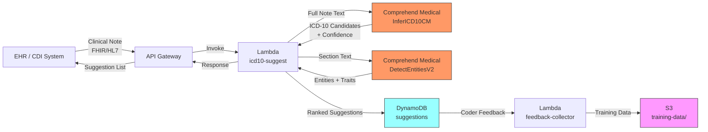

# Recipe 8.3: ICD-10 Code Suggestion

**Complexity:** Simple-Medium · **Phase:** Phase 1-2 · **Estimated Cost:** ~$0.05-$0.15 per note (section-targeted)

<!-- TODO (TechWriter): Confirm cost estimate. Body text says $0.05-$0.15 section-targeted, $0.40-$1.00 full text. Original header had $0.01-$0.05 which understates. -->

---

## The Problem

A medical coder opens her queue at 7 AM. There are 147 encounters from yesterday waiting for diagnosis coding. She opens the first one: a progress note from a primary care visit. The patient has Type 2 diabetes with peripheral neuropathy, essential hypertension, chronic kidney disease stage 3, and was seen today for a medication adjustment after their A1c came back at 8.2. The coder reads the entire note. She identifies the relevant diagnoses. She navigates the ICD-10-CM code tree. She considers whether E11.40 (Type 2 diabetes with diabetic neuropathy, unspecified) or E11.42 (Type 2 diabetes with diabetic polyneuropathy) is more appropriate given the documentation. She checks whether the CKD stage is explicitly documented (it is: N18.3). She picks I10 for the hypertension. She submits and moves to the next encounter.

Average time per encounter: 8-12 minutes for a moderately complex visit. She'll code maybe 50-60 encounters today if nothing gets complicated. The queue will grow faster than she can clear it.

Medical coding is one of the largest labor bottlenecks in the revenue cycle. The U.S. healthcare system processes billions of encounters annually, and every single one needs ICD-10 codes assigned before a claim can be submitted. The coding workforce is aging, the training pipeline takes years, and the demand outstrips supply at most organizations. Coders are expensive, they're burned out, and they're coding the same common diagnoses hundreds of times per week while spending their real expertise on the genuinely difficult cases.

Here's the thing: for 60-70% of encounters, the relevant ICD-10 codes are fairly obvious from the clinical text. When the note says "Type 2 diabetes mellitus with peripheral neuropathy," a trained model can suggest E11.40 or E11.42 with reasonable confidence. It can't replace the coder's judgment on which is more appropriate. But it can present a ranked list of candidates so the coder is selecting from a pre-screened set rather than navigating the entire 70,000-code taxonomy from scratch.

This is the ICD-10 code suggestion problem: given clinical text, suggest a ranked list of diagnosis codes that a human coder can review, accept, modify, or reject. It's not auto-coding. It's not replacing the coder. It's presenting an intelligent starting point that turns an 8-minute recall-and-search task into a 3-minute verify-and-confirm task.

The distinction between "suggestion" and "auto-coding" is not semantic. It's regulatory, it's legal, and it's practical. Auto-coding implies the system assigns codes without human review. That creates liability, audit risk, and compliance concerns that most organizations are nowhere near ready to accept. Suggestion means a human is always in the loop. The system accelerates their work. It doesn't replace their judgment.

---

## The Technology: Clinical Text Classification Meets Medical Ontology

### How ICD-10 Inference Works

ICD-10 code suggestion is fundamentally a multi-label classification problem with an extraordinarily large label space. You have input text (a clinical note, a progress note, a discharge summary) and you need to output one or more codes from a vocabulary of roughly 70,000 ICD-10-CM codes. But it's not a typical classification problem, because the labels have hierarchical structure, the input can map to multiple labels simultaneously, and the specificity of the correct label depends on the detail in the source text.

The approaches fall into three broad categories:

**Rule-based systems** use dictionaries, pattern matching, and hand-crafted logic to map clinical phrases to codes. "Hypertension" maps to I10. "Type 2 diabetes" maps to E11.9 (unspecified) unless additional qualifiers push it to a more specific code. These systems are transparent and auditable, but they're brittle. They can't handle the infinite variation in how clinicians describe the same condition, and they require continuous manual maintenance as the code set evolves (ICD-10-CM updates annually).

**Traditional ML approaches** treat it as a text classification problem. Extract features from the clinical text (bag of words, TF-IDF, n-grams, clinical embeddings), then train a classifier that predicts codes. The challenge is the label space: with 70,000 possible codes, you need massive training datasets and clever architecture to avoid the model simply memorizing the top 200 codes and ignoring everything else. Hierarchical classifiers (predict the chapter first, then the category, then the specific code) help manage the label space.

**Neural approaches** use deep learning models (convolutional networks, recurrent networks, transformers) trained on large corpora of coded clinical documents. These models learn to map the distributional patterns in clinical text directly to code probabilities. They handle paraphrasing, abbreviations, and implicit context better than rule-based systems. But they require substantial training data (hundreds of thousands of coded encounters), significant compute for training, and they're less interpretable than rule-based approaches.

In practice, production ICD-10 suggestion systems almost always combine approaches. A neural model handles the broad-strokes prediction (identifying which diagnostic concepts are present). A rule-based post-processor handles specificity refinement (choosing between E11.40 and E11.42 based on explicit documentation of neuropathy type). And a medical ontology layer ensures the suggested codes are valid, current, and properly hierarchically related.

### The ICD-10-CM Hierarchy: Why It Matters for Prediction

ICD-10-CM isn't a flat list. It's a tree. Understanding the tree structure is essential for building a useful suggestion system:

- **Chapters** (21 total): Broad disease categories. Chapter 4 is endocrine/metabolic diseases.
- **Blocks**: Groups within chapters. E08-E13 covers diabetes mellitus.
- **Categories** (3 characters): E11 is Type 2 diabetes mellitus.
- **Subcategories** (4-5 characters): E11.4 is Type 2 diabetes with neurological complications.
- **Full codes** (up to 7 characters): E11.40 is Type 2 diabetes with diabetic neuropathy, unspecified.

This hierarchy is exploitable for prediction. If your model is 95% confident the text describes Type 2 diabetes with a neurological complication (E11.4x), but only 60% confident about the specific neuropathy type, you can suggest E11.4 at high confidence and present the specific options (E11.40, E11.41, E11.42, E11.43, E11.44) as sub-choices for the coder. This is substantially more useful than either suggesting nothing (because the model isn't confident enough at the leaf level) or suggesting only E11.9 (the unspecified code that's technically always safe but reduces documentation quality).

### Negation, Assertion, and Context: The Real Challenge

The hardest part of ICD-10 suggestion from clinical text isn't identifying that the word "diabetes" appears. It's understanding the assertion context around it:

- "Patient has diabetes" = code it.
- "No diabetes" = do not code it.
- "Family history of diabetes" = code Z83.3 (family history), not E11.x.
- "Rule out diabetes" = do not code it (it's a working hypothesis, not a confirmed diagnosis).
- "Diabetes resolved" = may or may not be coded depending on whether it's considered a chronic condition.
- "History of gestational diabetes" = Z86.32, not a current diabetes code.

A model that ignores assertion context will over-suggest codes for conditions the patient doesn't have. This is worse than suggesting nothing, because a coder who trusts the suggestions will spend time verifying and rejecting false positives, which is slower than just reading the note themselves.

Clinical assertion detection is a well-studied NLP problem. The key insight is that negation in clinical text follows predictable patterns. ConText (a rule-based algorithm), NegEx (its predecessor), and more recent neural approaches all exploit the fact that clinical negation uses a limited set of trigger phrases: "no," "denies," "negative for," "without," "ruled out," "unlikely." These triggers have scope (they negate the next few clinical concepts, not the entire note) and direction (they typically apply forward in the sentence, not backward).

A robust ICD-10 suggestion system runs assertion detection as a preprocessing step. Every extracted clinical concept gets tagged with its assertion status (present, absent, possible, family history, historical) before any code mapping happens. Only concepts with "present" assertions proceed to code suggestion.

### Training Data: The Gold Standard Problem

Training an ICD-10 suggestion model requires labeled data: clinical text paired with the correct codes. The obvious source is your existing coded encounters. Your coders have been assigning codes to notes for years. That's your training set.

Except there are problems with this obvious approach:

**Coder variability.** Different coders assign different codes to the same note. Studies show inter-coder agreement rates of 60-80% at the full code level for complex encounters. Your training data contains noise from this variability.

**Upcoding and undercoding bias.** Some organizations systematically upcode (assign more specific or higher-severity codes than documented). Others undercode (use unspecified codes when specificity is available). Your model learns whatever bias exists in your historical data.

**Code version drift.** ICD-10-CM updates annually. Codes are added, deleted, and revised. Training data from 2020 may include codes that no longer exist or miss codes that were introduced in 2023.

**Documentation quality variation.** A note that says "Type 2 diabetes with peripheral neuropathy" is easy to code. A note that buries the same information across three paragraphs, refers to neuropathy as "tingling in feet," and mentions the diabetes diagnosis only in the medication list is much harder. Your model needs exposure to both documentation styles.

The practical approach is to use your coded encounter data as the training foundation, but apply several corrections: filter to encounters coded by your most experienced coders (or coded consistently by multiple coders), restrict to the most recent 2-3 fiscal years to avoid code version drift, and augment with synthetic examples for rare codes using the code descriptions themselves as pseudo-clinical text.

### The General Architecture Pattern

```text
[Clinical Note] → [Text Preprocessing] → [Section Segmentation] → [Concept Extraction]
                                                                          ↓
                                                                   [Assertion Detection]
                                                                          ↓
                                                              [Filter: Present Only]
                                                                          ↓
                                                              [Code Candidate Generation]
                                                                          ↓
                                                              [Hierarchical Ranking]
                                                                          ↓
                                                              [Confidence Scoring]
                                                                          ↓
                                                         [Suggestion List for Coder]
```

**Text Preprocessing:** Clean the input. Expand abbreviations. Handle section headers (HPI, Assessment, Plan each have different relevance for coding). Remove boilerplate template text that adds noise.

**Section Segmentation:** Clinical notes have structure. The Assessment and Plan section is the richest source of codable diagnoses. The Problem List section often lists active conditions explicitly. The HPI provides context. Segment the note and weight sections appropriately.

**Concept Extraction:** Identify clinical concepts (diagnoses, conditions, symptoms) in the text. This is named entity recognition specialized for clinical content.

**Assertion Detection:** Classify each extracted concept by assertion status. Filter to concepts that are asserted as present in the patient.

**Code Candidate Generation:** Map each present clinical concept to candidate ICD-10-CM codes. Generate multiple candidates at different specificity levels.

**Hierarchical Ranking:** Rank candidates by confidence, preferring the most specific code that's well-supported by the documentation. Use the ICD-10 tree structure to group related codes.

**Confidence Scoring:** Assign a composite confidence score reflecting both extraction confidence and code mapping confidence.

---

## The AWS Implementation

### Why These Services

**Amazon Comprehend Medical (InferICD10CM)** is the core service for this recipe. It takes clinical text as input and returns a ranked list of ICD-10-CM code candidates with confidence scores. It handles the full pipeline internally: concept extraction, assertion detection, and code mapping in a single API call. The model is trained on clinical text corpora and understands medical abbreviations, negation, and clinical phrasing. It's a HIPAA-eligible managed service, which means no infrastructure to manage and no model training required.

**Amazon Comprehend Medical (DetectEntitiesV2)** provides a complementary view. While InferICD10CM focuses specifically on ICD-10 code generation, DetectEntitiesV2 extracts all clinical entities with their assertion traits (negation, historical, family history). Using both together gives you both the code suggestions and the entity-level metadata that helps coders understand why a code was suggested.

**Amazon SageMaker** (optional) enters the picture when you want to augment the managed API with a custom model. If your organization has specialty-specific coding patterns that Comprehend Medical handles poorly (dermatology sub-codes, ophthalmology laterality, behavioral health nuances), you can train a supplementary model on your own coded data and ensemble its predictions with Comprehend Medical's output.

**AWS Lambda** for processing orchestration. Notes come in from the EHR (via HL7 FHIR, a file drop, or an API integration), get processed through Comprehend Medical, and the resulting suggestions are returned to the coding workflow.

**Amazon DynamoDB** stores the suggestion results, coder decisions (accepted, modified, rejected), and feedback data that drives model improvement over time.

**Amazon S3** holds the clinical notes in transit and provides durable storage for audit trails and training data assembly.

### Architecture Diagram



### Prerequisites

| Requirement | Details |
|-------------|---------|
| **AWS Services** | Amazon Comprehend Medical, AWS Lambda, Amazon API Gateway, Amazon DynamoDB, Amazon S3, AWS KMS, Amazon CloudWatch |
| **IAM Permissions** | `comprehendmedical:InferICD10CM`, `comprehendmedical:DetectEntitiesV2`, `dynamodb:PutItem`, `dynamodb:GetItem`, `s3:PutObject`, `s3:GetObject`, `kms:Decrypt`, `kms:GenerateDataKey`. Scope all permissions to specific resource ARNs: S3 actions restricted to the clinical-notes and audit-records bucket prefixes, DynamoDB actions restricted to the `icd10-suggestions` and coding-rules table ARNs. Add `aws:RequestedRegion` condition to prevent cross-region access. |
| **BAA** | AWS BAA signed. Comprehend Medical, Lambda, DynamoDB, S3, API Gateway, and CloudWatch are all HIPAA-eligible services. |
| **Encryption** | S3: SSE-KMS with customer-managed key. DynamoDB: encryption at rest (default). API Gateway: TLS 1.2 in transit. Lambda environment variables encrypted with KMS. CloudWatch log groups: configure KMS encryption (logs may contain clinical text fragments). |
| **VPC** | Production: Lambda in VPC with VPC endpoints for Comprehend Medical, DynamoDB, S3, KMS, and CloudWatch Logs. Enable Private DNS on all VPC endpoints. For EHR systems connected via Direct Connect or VPN, use a Private REST API in API Gateway with an interface VPC endpoint (`execute-api`) so clinical notes never traverse the public internet. For external EHR systems, use mutual TLS (mTLS) on the API Gateway custom domain. |
| **CloudTrail** | Enabled for all Comprehend Medical, S3, and DynamoDB API calls. Clinical notes are PHI; full audit trail is required. |
| **Sample Data** | MIMIC-III (freely available after credentialing) contains discharge summaries with ICD codes. CMS publishes ICD-10-CM code descriptions and guidelines. Use synthetic notes for development; never use real PHI in non-production environments. |
| **Cost Estimate** | Comprehend Medical InferICD10CM: $0.01 per 100 characters (UTF-8). A typical progress note of 2,000-5,000 characters costs $0.20-$0.50 per InferICD10CM call. DetectEntitiesV2: same pricing. Combined: $0.40-$1.00 per note if you call both APIs on the full text. Section-targeted approach (calling only on Assessment/Plan, typically 500-1,500 chars): $0.05-$0.15 per note. |

### Ingredients

| AWS Service | Role |
|------------|------|
| **Amazon Comprehend Medical (InferICD10CM)** | Core ICD-10 suggestion engine. Accepts clinical text, returns ranked ICD-10-CM candidates with confidence scores and evidence text spans. |
| **Amazon Comprehend Medical (DetectEntitiesV2)** | Supplementary entity extraction with assertion traits. Provides negation, family history, and temporal context that enriches the suggestion display for coders. |
| **AWS Lambda** | Processing orchestration: receives notes, calls Comprehend Medical APIs, assembles ranked suggestion lists, stores results. |
| **Amazon API Gateway** | REST endpoint for EHR integration. Provides authentication, throttling, and request/response transformation. |
| **Amazon DynamoDB** | Stores suggestion records and coder feedback (accepted, modified, rejected decisions). Enables feedback loop for quality monitoring. |
| **Amazon S3** | Stores clinical note text in transit, audit records, and assembled training datasets for future model improvement. |
| **AWS KMS** | Customer-managed encryption for all PHI at rest. |
| **Amazon CloudWatch** | Operational metrics: suggestion latency, confidence distributions, API error rates, coder acceptance rates. |

### Code

#### Walkthrough

<!-- TODO (TechWriter): Expert review S2 (MEDIUM). Add input validation guidance before preprocessing: verify UTF-8 encoding, enforce minimum length (e.g., 50 chars), reject binary/null bytes, validate encounter_id format. Mention API Gateway rate limiting and authentication to prevent cost-based DoS. -->

**Step 1: Receive and preprocess the clinical note.** Notes arrive from the EHR via API call (synchronous workflow for real-time suggestions in the coding UI) or via a batch file drop (async workflow for overnight processing). The preprocessing step segments the note into clinically relevant sections and identifies the highest-value text for code suggestion. The Assessment and Plan section contains the most explicitly codable content. The Problem List is often a bulleted list of active diagnoses. Sending the entire 5,000-word note to Comprehend Medical works, but it's expensive and introduces noise from review-of-systems negations and template boilerplate.

```pseudocode
// Section headers commonly found in clinical notes.
// The Assessment/Plan section is the richest source of codable diagnoses.
// We prioritize these sections but fall back to full text if sections aren't detected.
PRIORITY_SECTIONS = [
    "assessment and plan",
    "assessment/plan",
    "assessment",
    "plan",
    "diagnoses",
    "problem list",
    "impression",
    "discharge diagnoses"
]

SECONDARY_SECTIONS = [
    "history of present illness",
    "hpi",
    "hospital course"
]

FUNCTION preprocess_note(raw_note_text):
    // Attempt to segment the note by section headers.
    // Clinical notes typically use headers like "ASSESSMENT AND PLAN:" or "HPI:"
    // followed by a colon or newline.
    sections = segment_by_headers(raw_note_text)

    // If we found recognizable sections, extract priority content.
    IF sections is not empty:
        priority_text = ""
        secondary_text = ""

        FOR each section_name, section_content in sections:
            normalized_name = lowercase(trim(section_name))
            IF normalized_name matches any in PRIORITY_SECTIONS:
                priority_text = priority_text + " " + section_content
            ELSE IF normalized_name matches any in SECONDARY_SECTIONS:
                secondary_text = secondary_text + " " + section_content

        // Use priority text if available; fall back to secondary; last resort is full text.
        IF length(priority_text) > 50:
            coding_text = trim(priority_text)
        ELSE IF length(secondary_text) > 50:
            coding_text = trim(secondary_text)
        ELSE:
            coding_text = trim(raw_note_text)
    ELSE:
        // No section headers detected. Use the full note.
        coding_text = trim(raw_note_text)

    // Comprehend Medical InferICD10CM accepts up to 10,000 UTF-8 characters.
    // Truncate at sentence boundary if we exceed the limit.
    IF length(coding_text) > 9500:
        coding_text = truncate_at_sentence_boundary(coding_text, 9500)

    RETURN coding_text
```

<!-- TODO (TechWriter): Expert review A1 (MEDIUM). Add error handling guidance: wrap InferICD10CM call in retry with exponential backoff (2 retries, 1s/2s delays). On persistent failure, return a valid response with suggestion_count: 0 and status: 'service_unavailable' rather than HTTP 500. For batch processing via S3 events, add an SQS DLQ for failed invocations. -->

**Step 2: Call InferICD10CM for code candidates.** This is the core inference step. We send the preprocessed clinical text to Comprehend Medical's ICD-10 inference API and receive back a structured response containing entities (spans of text that map to diagnostic concepts) and their associated ICD-10-CM code candidates ranked by confidence.

```pseudocode
// Confidence thresholds for different suggestion tiers.
// High-confidence suggestions are presented as "recommended" to the coder.
// Medium-confidence suggestions are presented as "possible" alternatives.
// Below the minimum threshold, we don't surface the suggestion at all.
HIGH_CONFIDENCE_THRESHOLD = 0.80
MEDIUM_CONFIDENCE_THRESHOLD = 0.50
MINIMUM_CONFIDENCE_THRESHOLD = 0.30

// Maximum number of candidate codes to return per entity.
MAX_CANDIDATES_PER_ENTITY = 5

FUNCTION infer_icd10_codes(coding_text):
    // Call the Comprehend Medical InferICD10CM API.
    response = call ComprehendMedical.InferICD10CM with:
        Text = coding_text

    suggestions = empty list

    FOR each entity in response.Entities:
        // entity.Text = the span of clinical text that triggered this entity
        // entity.Category = always "MEDICAL_CONDITION" for InferICD10CM
        // entity.Traits = assertion modifiers (NEGATION, SIGN, SYMPTOM, DIAGNOSIS)
        // entity.ICD10CMConcepts = ranked list of code candidates

        // Check assertion traits: skip negated concepts.
        is_negated = any trait in entity.Traits where trait.Name == "NEGATION" and trait.Score >= 0.75
        IF is_negated:
            CONTINUE    // "No diabetes" should not suggest diabetes codes.

        // Check for SIGN vs DIAGNOSIS trait.
        // Signs/symptoms get coded differently than confirmed diagnoses.
        is_sign_or_symptom = any trait in entity.Traits where trait.Name in ["SIGN", "SYMPTOM"] and trait.Score >= 0.75
        is_diagnosis = any trait in entity.Traits where trait.Name == "DIAGNOSIS" and trait.Score >= 0.75

        // Process code candidates.
        candidates = empty list
        FOR each concept in entity.ICD10CMConcepts (up to MAX_CANDIDATES_PER_ENTITY):
            IF concept.Score < MINIMUM_CONFIDENCE_THRESHOLD:
                BREAK   // candidates are sorted by score; once below minimum, stop

            tier = "low"
            IF concept.Score >= HIGH_CONFIDENCE_THRESHOLD:
                tier = "high"
            ELSE IF concept.Score >= MEDIUM_CONFIDENCE_THRESHOLD:
                tier = "medium"

            candidates.append({
                code: concept.Code,
                description: concept.Description,
                confidence: round(concept.Score, 3),
                tier: tier
            })

        IF candidates is not empty:
            suggestions.append({
                evidence_text: entity.Text,
                begin_offset: entity.BeginOffset,
                end_offset: entity.EndOffset,
                is_sign_or_symptom: is_sign_or_symptom,
                is_diagnosis: is_diagnosis,
                candidates: candidates
            })

    RETURN suggestions
```

**Step 3: Enrich with entity context from DetectEntitiesV2.** The InferICD10CM API is focused narrowly on code generation. DetectEntitiesV2 provides broader clinical context: medications that contextualize a diagnosis, anatomical locations that inform laterality coding, and temporal expressions that distinguish acute from chronic conditions. This enrichment helps coders make better decisions, especially when choosing between codes at the same hierarchy level.

```pseudocode
FUNCTION enrich_with_entity_context(coding_text):
    // Call DetectEntitiesV2 for broader clinical entity extraction.
    response = call ComprehendMedical.DetectEntitiesV2 with:
        Text = coding_text

    context_entities = {
        medications: empty list,
        conditions: empty list,
        anatomy: empty list,
        time_expressions: empty list
    }

    FOR each entity in response.Entities:
        // Build context record with assertion traits.
        traits = []
        FOR each trait in entity.Traits:
            IF trait.Score >= 0.70:
                traits.append(trait.Name)

        record = {
            text: entity.Text,
            category: entity.Category,
            type: entity.Type,
            confidence: round(entity.Score, 3),
            traits: traits
        }

        // Categorize for coder display.
        IF entity.Category == "MEDICATION":
            context_entities.medications.append(record)
        ELSE IF entity.Category == "MEDICAL_CONDITION":
            context_entities.conditions.append(record)
        ELSE IF entity.Category == "ANATOMY":
            context_entities.anatomy.append(record)
        ELSE IF entity.Category == "TIME_EXPRESSION":
            context_entities.time_expressions.append(record)

    RETURN context_entities
```

**Step 4: Deduplicate and rank the final suggestion list.** A single note often mentions the same condition multiple times ("diabetes" in the Problem List, "DM2" in the Assessment, "diabetic neuropathy" in the Plan). Each mention produces its own entity and code candidates. The coder doesn't want to see E11.40 suggested three times. This step deduplicates by code, takes the highest confidence across mentions, and produces a clean ranked list.

```pseudocode
FUNCTION deduplicate_and_rank(suggestions):
    // Group by ICD-10 code across all entities.
    code_map = empty map   // code -> best suggestion record

    FOR each suggestion in suggestions:
        FOR each candidate in suggestion.candidates:
            code = candidate.code

            IF code not in code_map OR candidate.confidence > code_map[code].confidence:
                code_map[code] = {
                    code: candidate.code,
                    description: candidate.description,
                    confidence: candidate.confidence,
                    tier: candidate.tier,
                    evidence_texts: []   // collect all text spans that triggered this code
                }

            // Append the evidence text (avoid duplicates).
            IF suggestion.evidence_text not in code_map[code].evidence_texts:
                code_map[code].evidence_texts.append(suggestion.evidence_text)

    // Sort by confidence descending.
    ranked_list = sort values of code_map by confidence descending

    // Group by hierarchy for cleaner display.
    // E11.40 and E11.42 should appear together, not scattered.
    grouped = group_by_category_prefix(ranked_list)

    RETURN grouped

FUNCTION group_by_category_prefix(ranked_list):
    // Group codes by their 3-character category prefix (e.g., E11, I10, N18).
    groups = ordered map

    FOR each item in ranked_list:
        prefix = first 3 characters of item.code
        IF prefix not in groups:
            groups[prefix] = {
                category_code: prefix,
                suggestions: empty list
            }
        groups[prefix].suggestions.append(item)

    // Return as flat list of groups, ordered by the top confidence in each group.
    RETURN sort groups by max confidence of their suggestions descending
```

<!-- TODO (TechWriter): Expert review S3 (LOW). Add requester_id to the stored suggestion record and response payload. For HIPAA minimum necessary compliance, capture who triggered the suggestion request (coder identity from EHR session context in API request headers). -->

**Step 5: Store suggestions and return to coder.** The final step persists the suggestion record for audit and feedback tracking, then returns the ranked suggestion list to the coding interface. The response format is designed for easy integration with coding UIs: grouped by diagnostic category, with evidence text highlighting so the coder can see exactly which text triggered each suggestion.

```pseudocode
FUNCTION store_and_respond(encounter_id, note_id, grouped_suggestions, context_entities):
    // Build the suggestion record for storage and response.
    suggestion_record = {
        encounter_id: encounter_id,
        note_id: note_id,
        suggested_at: current UTC timestamp (ISO 8601),
        suggestion_groups: grouped_suggestions,
        context: context_entities,
        status: "pending_review",   // will be updated when coder acts
        coder_decisions: empty list          // populated by feedback step
    }

    // Store in DynamoDB for audit and feedback tracking.
    write suggestion_record to DynamoDB table "icd10-suggestions"
        with partition key = encounter_id
        and sort key = note_id

    // Build the API response for the coding UI.
    response = {
        encounter_id: encounter_id,
        suggestions: grouped_suggestions,
        context: context_entities,
        metadata: {
            processed_text_length: length of coding_text,
            total_suggestions: count of all codes across groups,
            high_confidence_count: count where tier == "high"
        }
    }

    RETURN response
```

> **Curious how this looks in Python?** The pseudocode above covers the concepts. If you'd like to see sample Python code that demonstrates these patterns using boto3, check out the [Python Example](chapter08.03-python-example). It walks through each step with inline comments and notes on what you'd need to change for a real deployment.

### Expected Results

**Sample output for a primary care progress note:**

```json
{
  "encounter_id": "ENC-2026-0847291",
  "suggestions": [
    {
      "category_code": "E11",
      "suggestions": [
        {
          "code": "E11.42",
          "description": "Type 2 diabetes mellitus with diabetic polyneuropathy",
          "confidence": 0.912,
          "tier": "high",
          "evidence_texts": ["Type 2 diabetes with peripheral neuropathy", "diabetic neuropathy"]
        },
        {
          "code": "E11.65",
          "description": "Type 2 diabetes mellitus with hyperglycemia",
          "confidence": 0.847,
          "tier": "high",
          "evidence_texts": ["A1c came back at 8.2"]
        },
        {
          "code": "E11.40",
          "description": "Type 2 diabetes mellitus with diabetic neuropathy, unspecified",
          "confidence": 0.788,
          "tier": "medium",
          "evidence_texts": ["diabetic neuropathy"]
        }
      ]
    },
    {
      "category_code": "I10",
      "suggestions": [
        {
          "code": "I10",
          "description": "Essential (primary) hypertension",
          "confidence": 0.967,
          "tier": "high",
          "evidence_texts": ["essential hypertension"]
        }
      ]
    },
    {
      "category_code": "N18",
      "suggestions": [
        {
          "code": "N18.3",
          "description": "Chronic kidney disease, stage 3 (moderate)",
          "confidence": 0.934,
          "tier": "high",
          "evidence_texts": ["chronic kidney disease stage 3", "CKD stage 3"]
        }
      ]
    }
  ],
  "context": {
    "medications": [
      {"text": "metformin", "type": "GENERIC_NAME", "confidence": 0.991, "traits": []},
      {"text": "lisinopril", "type": "GENERIC_NAME", "confidence": 0.987, "traits": []}
    ]
  },
  "metadata": {
    "processed_text_length": 1247,
    "total_suggestions": 5,
    "high_confidence_count": 4
  }
}
```

**Performance benchmarks:**

| Metric | Typical Value |
|--------|---------------|
| End-to-end latency (API call) | 1-3 seconds per note (steady-state). Cold starts add 1-3 seconds in VPC; use Provisioned Concurrency for real-time coding assistance. |
| Top-1 accuracy (common diagnoses) | 85-92% |
| Top-3 accuracy (correct code in top 3 suggestions) | 93-97% |
| Negation detection accuracy | 90-95% |
| Specificity (correct at full code level vs. category) | 70-80% |
| Cost per note (section-targeted) | $0.05-$0.15 |
| Cost per note (full text) | $0.40-$1.00 |
| Coder time reduction (reported) | 30-50% per encounter |
| Throughput | Default ~10 TPS (InferICD10CM service limit). Request a limit increase for production volumes; sustained 50-100 TPS achievable with approval. |

**Where it struggles:**

- **Rare codes:** Codes with fewer than 100 examples in training data get suggested inconsistently
- **Specificity vs. sensitivity tradeoff:** The model often defaults to the unspecified code (x.9) when the text supports a more specific one
- **Multi-condition sentences:** "Diabetes with neuropathy and nephropathy" sometimes maps to a combined code, sometimes to separate codes
- **Laterality:** Left vs. right distinctions are frequently missed when documentation is ambiguous
- **Comorbidity interactions:** Some code combinations have specific rules (e.g., manifestation codes that require an etiology code first)
- **Annual code updates:** New codes added in October each year aren't in the model until AWS retrains

---

## The Honest Take

I'll be upfront: ICD-10 code suggestion is one of those problems that's deceptively easy to demo and genuinely hard to deploy well.

The demo is impressive. You feed a clinical note into Comprehend Medical, you get back a list of codes with confidence scores, and 85% of them are right. Executives love it. "We'll cut coding time in half!" And maybe you will. But the gap between "85% of common codes suggested correctly" and "coders trust this enough to change their workflow" is enormous.

Here's what surprised me: coders don't trust the suggestions for about the first two weeks. They verify everything independently, which makes the system slower, not faster. Then they start trusting the high-confidence suggestions for common codes (hypertension, diabetes, hyperlipidemia). Then they gradually extend trust to medium-confidence suggestions. The adoption curve is weeks to months, not days. Plan for it.

The specificity problem is the most persistent frustration. Comprehend Medical will happily suggest E11.9 (Type 2 diabetes, unspecified) when the note clearly documents peripheral neuropathy that should push it to E11.42. The model is being conservative. That's defensible behavior for an AI system in healthcare. But it means the coder still needs to read the note carefully and make the specificity determination themselves. The suggestion saved them the lookup time, but not the clinical judgment time.

The feedback loop is where the real value emerges. When you track which suggestions coders accept, modify, and reject, you build a dataset that tells you exactly where the system fails. After three months of feedback data, you know which code families need supplementary rules, which documentation patterns confuse the model, and which coders disagree with each other (which is a training opportunity, not a system failure). The suggestion system becomes a quality analytics platform almost by accident.

One more thing: don't overlook the cost model. At $0.01 per 100 characters, processing a 3,000-character note costs $0.30 per API call. If you're processing 500 encounters per day, that's $150/day or $4,500/month just for the Comprehend Medical calls. That's cheap compared to a coder's salary, but it's not nothing. The section-targeted approach (processing only the Assessment/Plan rather than the full note) cuts costs by 60-80% with minimal accuracy loss for code suggestion specifically.

---

## Variations and Extensions

**Hierarchical code selection UI.** Instead of presenting a flat ranked list, build the coding interface around the ICD-10 tree. When the model suggests E11.4x (diabetes with neurological complications), show the coder the entire E11.4 sub-tree with the model's confidence at each level. The coder can accept the category with one click and refine the specificity with a second click. This matches how experienced coders think: they identify the category first, then drill into specifics.

**Coding quality audit automation.** Use the suggestion system in reverse: after a coder assigns codes, re-run the model on the same note and compare the coder's selections to the model's suggestions. Discrepancies (especially where the model suggests a more specific code with high confidence) flag potential undercoding for clinical documentation improvement (CDI) review. This is a non-threatening way to surface coding quality issues: "the model noticed documentation that might support a more specific code" rather than "you coded this wrong."

**Specialty-specific model augmentation.** Comprehend Medical is a general-purpose clinical NLP model. For high-volume specialties with unique coding patterns (ophthalmology laterality codes, dermatology morphology codes, behavioral health V-codes), train a supplementary model on your specialty-specific coded data using SageMaker. Ensemble the specialty model's predictions with Comprehend Medical's output, preferring the specialty model when it's confident and the specialty is identified. This addresses the long-tail accuracy problem without replacing the general model.

---

## Related Recipes

- **Recipe 1.3 (Lab Requisition Form Extraction):** Uses InferICD10CM in a document extraction context rather than a coding workflow. Shows the same API applied to a different use case.
- **Recipe 8.1 (Chief Complaint Classification):** Short-text classification fundamentals. If you're new to clinical NLP, start there.
- **Recipe 8.4 (Medication Extraction and Normalization):** Complementary extraction that often runs alongside ICD-10 suggestion. Medications contextualize diagnoses.
- **Recipe 8.8 (Clinical Assertion Classification):** The assertion detection problem in depth. Understanding negation and context is critical for accurate code suggestion.
- **Recipe 13.3 (ICD/CPT Hierarchy Navigation):** Knowledge graph approach to navigating the ICD-10 code tree. Useful for building the hierarchical selection UI variation.

---

## Additional Resources

**AWS Documentation:**
- [Amazon Comprehend Medical Developer Guide](https://docs.aws.amazon.com/comprehend-medical/latest/dev/comprehendmedical-welcome.html)
- [Amazon Comprehend Medical: InferICD10CM API Reference](https://docs.aws.amazon.com/comprehend-medical/latest/dev/ontology-icd10.html)
- [Amazon Comprehend Medical: DetectEntitiesV2 API Reference](https://docs.aws.amazon.com/comprehend-medical/latest/dev/textanalysis-entitiesv2.html)
- [Amazon Comprehend Medical Pricing](https://aws.amazon.com/comprehend/medical/pricing/)
- [Amazon Comprehend Medical HIPAA Eligibility](https://aws.amazon.com/compliance/hipaa-eligible-services-reference/)
- [Amazon SageMaker Developer Guide](https://docs.aws.amazon.com/sagemaker/latest/dg/whatis.html)

**AWS Sample Repos:**
- [`amazon-comprehend-medical-fhir-integration`](https://github.com/aws-samples/amazon-comprehend-medical-fhir-integration): Demonstrates integrating Comprehend Medical with FHIR resources, relevant for EHR integration patterns
- [`amazon-textract-and-amazon-comprehend-medical-claims-example`](https://github.com/aws-samples/amazon-textract-and-amazon-comprehend-medical-claims-example): Healthcare claims processing with Comprehend Medical, includes ICD-10 inference patterns and CloudFormation templates

<!-- TODO (TechWriter): Verify these repo URLs still exist and are public -->

**AWS Solutions and Blogs:**
- [Extracting Medical Information from Clinical Notes with Amazon Comprehend Medical](https://aws.amazon.com/blogs/machine-learning/extracting-medical-information-from-clinical-notes-with-amazon-comprehend-medical/): Deep dive on entity extraction and ICD-10 inference from clinical text
- [Building NLP-Powered Clinical Decision Support with Amazon Comprehend Medical](https://aws.amazon.com/blogs/machine-learning/building-nlp-powered-clinical-decision-support/): Architecture patterns for real-time clinical NLP at scale

<!-- TODO (TechWriter): Verify blog URLs are current -->

**External References:**
- [CMS ICD-10-CM Official Guidelines](https://www.cms.gov/medicare/coding-billing/icd-10-codes): Official coding guidelines and annual code updates
- [ICD10Data.com](https://www.icd10data.com/): ICD-10-CM code lookup and hierarchy browser
- [MIMIC-III Clinical Database](https://physionet.org/content/mimiciii/): De-identified clinical notes for model development and testing (requires credentialing)
<!-- TODO (TechWriter): Consider updating MIMIC-III references to MIMIC-IV (current version). Verify URL. -->

---

## Estimated Implementation Time

| Tier | Timeline | Scope |
|------|----------|-------|
| **Basic** | 2-3 weeks | Lambda + Comprehend Medical integration, basic suggestion list returned via API, DynamoDB storage |
| **Production-ready** | 6-8 weeks | Section segmentation, confidence tiering, coder feedback loop, UI integration, monitoring dashboards, error handling, TPS management |
| **With variations** | 10-14 weeks | Hierarchical UI, quality audit automation, specialty model training, A/B testing framework for confidence thresholds |

---

## Tags

`nlp` `icd-10` `medical-coding` `comprehend-medical` `clinical-nlp` `code-suggestion` `revenue-cycle` `classification` `assertion-detection` `negation` `hipaa` `lambda` `dynamodb` `api-gateway` `simple-medium` `phase-1-2`

---

*← [Recipe 8.2: Patient Sentiment Analysis](chapter08.02-patient-sentiment-analysis) · [Chapter 8 Index](chapter08-preface) · [Recipe 8.4: Medication Extraction and Normalization →](chapter08.04-medication-extraction-normalization)*
