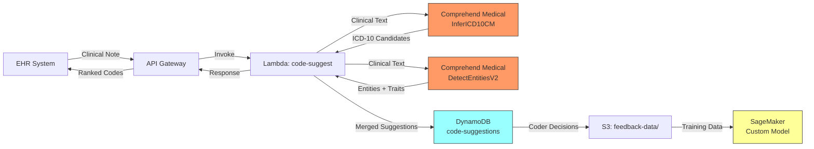

# Recipe 8.3: ICD-10 Code Suggestion

**Complexity:** Simple-Medium · **Phase:** Phase 1-2 · **Estimated Cost:** ~$0.01-0.03 per note

---

## The Problem

A medical coder sits in front of two monitors. On the left, a physician's clinical note. On the right, a coding application with a search box. The physician wrote: "Patient presents with increasing fatigue, polyuria, and blurred vision. Labs show fasting glucose 210. Diagnosis: uncontrolled Type 2 diabetes with hyperglycemia. Also managing chronic kidney disease stage 3."

The coder's job: translate that paragraph into the correct combination of ICD-10-CM codes. Not just the obvious one (E11.65 for Type 2 diabetes with hyperglycemia), but the full set: E11.22 for Type 2 diabetes with chronic kidney disease, N18.3 for CKD stage 3, and potentially E11.65 as an additional code to capture the hyperglycemia. The difference between E11.9 ("without complications") and E11.65 ("with hyperglycemia") isn't academic. It directly affects reimbursement, quality metrics, and risk adjustment scores.

There are roughly 72,000 valid ICD-10-CM codes. A typical coder works from a mental vocabulary of a few hundred common codes and looks up the rest. The lookup process involves navigating hierarchical indexes, reading inclusion/exclusion notes, checking "code also" and "code first" instructions, and applying official coding guidelines that run to 130+ pages. For a single encounter, this takes 8 to 20 minutes depending on complexity. A hospital with 2,000 discharges per month employs a team of 15 to 25 coders working full-time.

The error rate in manual coding ranges from 10% to 30%, depending on the study and the definition of "error." Some errors are trivial (coding to three characters when four were available). Others are consequential: missing a complication code that would have moved the patient into a higher DRG, failing to capture a condition that affects Hierarchical Condition Category (HCC) risk scores, or assigning a code that triggers an audit flag from the payer.

Code suggestion doesn't replace coders. It accelerates them. Instead of searching from scratch, the coder sees a ranked list of probable codes derived from the clinical text. They confirm, reject, or refine. The cognitive load shifts from recall to recognition, and recognition is dramatically faster.

---

## The Technology

### Clinical Concept Extraction: The First Step

Before you can suggest an ICD-10 code, you need to identify what clinical concepts exist in the text. This is the named entity recognition (NER) problem applied to clinical language. The system needs to find every mention of a diagnosis, symptom, finding, or condition in the note, along with its assertion status (is it present? denied? historical? related to a family member?).

This isn't a keyword search. "The patient's mother has diabetes" and "the patient has diabetes" contain the same word in very different clinical contexts. Only one of them should generate a code for this patient. The NER model needs to extract the entity ("diabetes") and the assertion classifier needs to determine it's a family history mention, not an active diagnosis.

Clinical NER models are trained on annotated clinical corpora. The standard benchmark datasets include i2b2/n2c2 shared task data, MIMIC-III discharge summaries, and institution-specific annotated note sets. The models are typically BiLSTM-CRF architectures or fine-tuned clinical BERT variants (ClinicalBERT, BioBERT, PubMedBERT). They output spans of text tagged with entity types and confidence scores.

The precision/recall tradeoff matters here. For code suggestion (where a human reviews the output), you want high recall: it's better to suggest 12 codes and have the coder dismiss 3 than to miss 2 valid codes. For automated coding (no human review), you want high precision: a wrong code submitted to a payer triggers audits, denials, and potential compliance issues. This recipe focuses on suggestion, so we optimize for recall.

### From Concepts to Codes: The Normalization Problem

Once you've extracted clinical concepts, you need to map them to ICD-10-CM codes. This is concept normalization, and it's harder than it looks.

The challenge is that clinical language and coding language describe the same reality using different vocabularies. A physician writes "heart failure with reduced ejection fraction." The ICD-10-CM code is I50.20 (unspecified systolic heart failure) or I50.22 (chronic systolic heart failure), depending on acuity. The physician didn't write "systolic" but that's what "reduced ejection fraction" means in ICD-10 terminology. The mapping requires understanding clinical equivalences that aren't simple string matches.

There are three general approaches to this normalization step:

**Dictionary-based matching** uses a lookup table of known concept-to-code mappings. You maintain a dictionary where "diabetes type 2" maps to E11.x codes, "hypertension" maps to I10, and so on. Fast and deterministic, but brittle: it only works for exact phrasings you've already seen. Clinical text is creative in its phrasing.

**Embedding-based matching** encodes both the extracted clinical concept and the ICD-10 code descriptions into a shared vector space, then finds the nearest codes by cosine similarity. This handles paraphrasing naturally ("elevated blood pressure" and "hypertension" end up near each other in the embedding space). But it can produce false matches when concepts are semantically similar but clinically distinct (I10 essential hypertension vs. I15 secondary hypertension).

**Classification-based approaches** treat each ICD-10 code (or code family) as a class label and train a multi-label classifier directly from clinical text to codes. This is the approach used by most production auto-coding systems. The model learns the direct mapping from text patterns to codes without an intermediate concept extraction step. The downside: the model is a black box, and when it's wrong, you can't easily explain why.

In practice, production systems combine these approaches. Dictionary matching handles the high-frequency, unambiguous cases. Embedding-based retrieval handles the paraphrasing problem. And a trained classifier produces the final ranked candidate list. The combination outperforms any single approach.

### The ICD-10-CM Code Hierarchy

Understanding the code structure matters for building a good suggestion system. ICD-10-CM codes have a hierarchical structure:

- **Category** (3 characters): E11 = Type 2 diabetes mellitus
- **Subcategory** (4-5 characters): E11.6 = Type 2 diabetes with other specified complications
- **Full code** (up to 7 characters): E11.65 = Type 2 diabetes with hyperglycemia

The hierarchy encodes clinical specificity. A suggestion system should use this: if the model is confident about the category (E11) but uncertain about the subcategory, it should suggest E11 with its children ranked by probability. This gives the coder a starting point and lets them navigate to the correct specificity level.

The hierarchy also creates a natural evaluation metric. Predicting E11.9 when the correct answer is E11.65 is a specificity error, not a category error. It's less wrong than predicting I10 when the answer is E11.65. Evaluation should weight errors by hierarchical distance, not treat all mismatches equally.

### Negation, Context, and Assertion

The single biggest source of false positive code suggestions is ignoring assertion status. Clinical notes are full of negated findings: "no chest pain," "denies shortness of breath," "heart failure ruled out." If your system extracts "chest pain" without detecting the negation, it suggests R07.9, and the coder has to dismiss it.

Assertion classification typically categorizes mentions into: present, absent (negated), possible/uncertain, conditional, historical, and family history. Only "present" and sometimes "historical" mentions should generate code suggestions. A robust assertion detection layer dramatically reduces noise in the suggestion list.

The classic algorithm for negation detection is NegEx (and its successors ConText and NegBio). These use trigger terms ("no," "denies," "without," "ruled out") and scope rules to determine whether a clinical concept is negated. Modern neural approaches train assertion classifiers on the surrounding context window. Both work well; the neural approaches handle edge cases better but require annotated training data.

### Multi-Label Classification at Scale

The ICD-10-CM code space has ~72,000 codes, but the practical distribution is extremely skewed. About 5,000 codes cover 95% of real-world encounters. A multi-label classifier doesn't need to handle the full 72,000 code space uniformly. It needs excellent performance on the top 5,000 and graceful degradation (lower confidence, broader category suggestions) for rare codes.

The architecture for this is typically a text encoder (clinical BERT or similar) followed by a multi-label classification head. Training data comes from coded encounters: pairs of (clinical note text, assigned ICD-10 codes). The model learns to predict which codes apply to a given text.

Training data quality is critical and often underappreciated. Historical coding data reflects historical coding decisions, which include errors, coding convention changes, and institutional biases. A model trained on data from a hospital that routinely undercodes complications will learn to undercode complications. The training data is not ground truth; it's a noisy approximation of ground truth.

---

## General Architecture Pattern

```text
[Clinical Note Text]
        |
        v
[Preprocessing: Sentence Splitting, Section Identification]
        |
        v
[Clinical NER: Extract Diagnoses, Symptoms, Findings]
        |
        v
[Assertion Classification: Present / Absent / Historical / Family]
        |
        v
[Filter: Keep only "present" and relevant assertions]
        |
        v
[Code Candidate Generation]
   |              |              |
   v              v              v
[Dictionary    [Embedding     [Trained
 Lookup]        Retrieval]     Classifier]
        \         |           /
         v        v          v
[Candidate Merging and Ranking]
        |
        v
[Hierarchy-Aware Re-ranking]
        |
        v
[Ranked Code Suggestions with Confidence Scores]
        |
        v
[Coder Review Interface]
```

The key design decisions in this architecture:

1. **Section identification before NER.** Clinical notes have structure: chief complaint, history of present illness, review of systems, assessment and plan. The assessment/plan section is the richest source of codeable diagnoses. Running NER on the full note produces entities, but weighting entities from the A&P section higher produces better code suggestions.

2. **Assertion filtering before code generation.** Removing negated and family-history mentions before generating code candidates is cheaper and cleaner than generating candidates for everything and then post-filtering. It reduces noise early in the pipeline.

3. **Multiple candidate generation strategies.** No single approach handles all cases well. Dictionary matching is fast and precise for common codes. Embedding retrieval handles novel phrasings. The trained classifier captures complex patterns. Merging their outputs produces a more robust candidate list than any single method.

4. **Hierarchy-aware ranking.** When multiple codes from the same hierarchy branch are candidates (E11.9, E11.65, E11.22), the system should present them grouped by category with the most specific supported code ranked highest. This matches how coders think: "It's definitely diabetes, now which diabetes code?"

---

## The AWS Implementation

### Why These Services

**Amazon Comprehend Medical (InferICD10CM)** is the centerpiece. It takes clinical text as input and returns ranked ICD-10-CM code candidates with confidence scores. Under the hood, it performs entity extraction, assertion detection, and code normalization in a single API call. You don't need to build the multi-stage pipeline yourself; the managed service encapsulates it. The tradeoff: you can't fine-tune the model on your institution's coding patterns, and you can't inspect the intermediate steps. For a suggestion system where a human reviews the output, this tradeoff is usually acceptable.

**Amazon Comprehend Medical (DetectEntitiesV2)** provides the detailed entity extraction layer. While InferICD10CM returns codes directly, DetectEntitiesV2 returns the extracted clinical concepts with their assertion traits (negation, temporality, subject). This is useful for two reasons: (1) it explains why a code was suggested (the evidence text), and (2) it provides the assertion information needed to filter irrelevant suggestions.

**Amazon SageMaker** (optional) hosts a custom multi-label classifier if you need institution-specific code predictions that go beyond what Comprehend Medical provides. A fine-tuned ClinicalBERT model trained on your historical coding data can capture institutional patterns that the general-purpose Comprehend Medical model misses. This adds significant complexity and is a Phase 2 enhancement.

**Amazon DynamoDB** stores the code suggestion results, coder decisions (accepted/rejected/modified), and builds the feedback loop dataset for model improvement. The coder's accept/reject decisions are gold-standard training data for a custom model.

**AWS Lambda** orchestrates the pipeline: receives the clinical note, calls Comprehend Medical APIs, processes the results, and stores the suggestions.

**Amazon S3** stores clinical note text for batch processing scenarios and maintains an archive of processed notes with their code suggestions for audit purposes.

### Architecture Diagram



### Prerequisites

| Requirement | Details |
|-------------|---------|
| **AWS Services** | Amazon Comprehend Medical, AWS Lambda, Amazon API Gateway, Amazon DynamoDB, Amazon S3, AWS KMS, Amazon CloudWatch |
| **IAM Permissions** | `comprehendmedical:InferICD10CM`, `comprehendmedical:DetectEntitiesV2`, `dynamodb:PutItem`, `dynamodb:GetItem`, `s3:PutObject`, `s3:GetObject`, `kms:Decrypt`, `kms:GenerateDataKey` |
| **BAA** | AWS BAA signed. Comprehend Medical is HIPAA-eligible. Clinical note text is PHI. |
| **Encryption** | S3: SSE-KMS with customer-managed key. DynamoDB: encryption at rest (default). All API calls over TLS. Comprehend Medical does not retain input text. |
| **VPC** | Production: Lambda in VPC with VPC endpoints for Comprehend Medical, DynamoDB, S3, KMS, and CloudWatch Logs. |
| **CloudTrail** | Enabled for all Comprehend Medical, DynamoDB, and S3 API calls. Full audit trail required for PHI access. |
| **Sample Data** | MIMIC-III discharge summaries (publicly available via PhysioNet, requires credentialing). Synthetic clinical notes for development. Never use real PHI in dev. |
| **Cost Estimate** | Comprehend Medical: $0.01 per 100 characters. A typical clinical note is 1,000-3,000 characters, so $0.10-$0.30 per note for InferICD10CM. DetectEntitiesV2 adds another $0.10-$0.30. Total: ~$0.20-$0.60 per note when calling both APIs. For suggestion-only (InferICD10CM only): ~$0.10-$0.30 per note. |

### Ingredients

| AWS Service | Role |
|------------|------|
| **Amazon Comprehend Medical (InferICD10CM)** | Takes clinical text, returns ranked ICD-10-CM codes with confidence scores and evidence text spans |
| **Amazon Comprehend Medical (DetectEntitiesV2)** | Extracts clinical entities with assertion traits (negation, temporality) for evidence and filtering |
| **AWS Lambda** | Orchestrates API calls, merges results, applies business rules (confidence thresholds, specialty filters) |
| **Amazon API Gateway** | REST endpoint for synchronous code suggestion requests from EHR integration |
| **Amazon DynamoDB** | Stores suggestions, coder feedback, and encounter metadata. Enable Point-in-Time Recovery for PHI tables. |
| **Amazon S3** | Archives clinical note text and batch processing results. Configure Object Lock for retention compliance. |
| **AWS KMS** | Customer-managed keys for all encryption at rest |
| **Amazon CloudWatch** | Metrics on suggestion accuracy (via feedback loop), latency, and error rates |

### Code

> **Reference implementations:** The following AWS sample repos demonstrate patterns used in this recipe:
>
> - [`amazon-comprehend-medical-ICD10-CMmapping`](https://github.com/aws-samples/amazon-comprehend-medical-ICD10-CMmapping): Demonstrates mapping clinical text to ICD-10-CM codes using Comprehend Medical, including confidence-based filtering
> - [`amazon-textract-and-amazon-comprehend-medical-claims-example`](https://github.com/aws-samples/amazon-textract-and-amazon-comprehend-medical-claims-example): Healthcare pipeline combining document extraction with clinical NLP for claims processing

#### Walkthrough

**Step 1: Receive and preprocess the clinical note.**

The clinical note arrives from the EHR system via API call. Before sending it to Comprehend Medical, we do lightweight preprocessing: identify the note sections (if structured), validate character length, and prepare the text segments.

```pseudocode
// Clinical notes have implicit structure: HPI, ROS, A&P, etc.
// The Assessment & Plan section is the most valuable for coding.
// If we can identify it, we weight those suggestions higher.

SECTION_MARKERS = [
    "assessment and plan", "assessment/plan", "a/p", "a&p",
    "assessment:", "plan:", "impression:", "diagnoses:"
]

FUNCTION preprocess_note(raw_note_text):
    // Comprehend Medical InferICD10CM limit: 10,000 UTF-8 characters per request
    IF length(raw_note_text) > 10000:
        // Prioritize Assessment & Plan section
        ap_section = find_section(raw_note_text, SECTION_MARKERS)
        IF ap_section is not null AND length(ap_section) <= 10000:
            primary_text = ap_section
            supplementary_text = remainder of note (first 10000 chars)
        ELSE:
            primary_text = first 10000 characters of raw_note_text
            supplementary_text = null
    ELSE:
        primary_text = raw_note_text
        supplementary_text = null

    // Identify if A&P section exists for downstream weighting
    has_ap_section = (find_section(raw_note_text, SECTION_MARKERS) is not null)

    RETURN {
        primary_text: primary_text,
        supplementary_text: supplementary_text,
        has_ap_section: has_ap_section,
        character_count: length(primary_text)
    }
```

**Step 2: Call InferICD10CM for code candidates.**

This is the core inference step. Comprehend Medical's InferICD10CM API takes clinical text and returns a list of detected medical conditions, each with one or more candidate ICD-10-CM codes ranked by confidence.

```pseudocode
// InferICD10CM returns entities, each with:
//   - Text: the original text span that triggered the detection
//   - Category: MEDICAL_CONDITION (for ICD-10 relevant entities)
//   - Traits: NEGATION, DIAGNOSIS, SIGN, SYMPTOM, etc.
//   - ICD10CMConcepts: ranked list of {Code, Description, Score}
//
// The "Score" is a confidence between 0 and 1.
// Scores above 0.7 are generally reliable for common diagnoses.
// Scores between 0.4 and 0.7 are worth showing but need coder review.
// Scores below 0.4 are noise for most use cases.

CONFIDENCE_THRESHOLD_HIGH = 0.70    // Auto-suggest to coder
CONFIDENCE_THRESHOLD_LOW  = 0.40    // Show as "possible" with lower prominence
MAX_CODES_PER_ENTITY      = 3       // Top N candidates per detected condition

FUNCTION get_icd10_suggestions(clinical_text):
    response = call ComprehendMedical.InferICD10CM(Text = clinical_text)

    suggestions = empty list

    FOR each entity in response.Entities:
        // Skip entities with negation trait
        // InferICD10CM includes a NEGATION trait on entities that are negated in text
        IF entity has trait "NEGATION":
            CONTINUE

        // Skip entities with low entity-level confidence
        IF entity.Score < CONFIDENCE_THRESHOLD_LOW:
            CONTINUE

        // Extract the top N code candidates
        candidates = empty list
        FOR each concept in entity.ICD10CMConcepts (first MAX_CODES_PER_ENTITY):
            IF concept.Score >= CONFIDENCE_THRESHOLD_LOW:
                candidates.append({
                    code: concept.Code,
                    description: concept.Description,
                    score: concept.Score,
                    tier: "high" if concept.Score >= CONFIDENCE_THRESHOLD_HIGH else "review"
                })

        IF candidates is not empty:
            suggestions.append({
                evidence_text: entity.Text,
                begin_offset: entity.BeginOffset,
                end_offset: entity.EndOffset,
                entity_score: entity.Score,
                traits: entity.Traits,
                candidates: candidates
            })

    RETURN suggestions
```

**Step 3: Call DetectEntitiesV2 for enriched context.**

DetectEntitiesV2 provides a broader entity extraction with detailed assertion traits. We use this to enrich the suggestions with context: what other conditions are mentioned, whether relationships exist between entities, and to catch any diagnoses that InferICD10CM missed.

```pseudocode
// DetectEntitiesV2 returns more entity categories than InferICD10CM:
//   MEDICAL_CONDITION, MEDICATION, TEST_TREATMENT_PROCEDURE,
//   ANATOMY, TIME_EXPRESSION, PROTECTED_HEALTH_INFORMATION
//
// For code suggestion, we primarily use MEDICAL_CONDITION entities
// and their traits to cross-validate InferICD10CM results.

FUNCTION get_entity_context(clinical_text):
    response = call ComprehendMedical.DetectEntitiesV2(Text = clinical_text)

    conditions = empty list
    medications = empty list

    FOR each entity in response.Entities:
        IF entity.Category == "MEDICAL_CONDITION":
            // Capture assertion traits: NEGATION, DIAGNOSIS, SIGN, SYMPTOM
            assertion = "present"  // default
            IF entity has trait "NEGATION":
                assertion = "negated"
            // Note: Comprehend Medical does not have explicit "historical"
            // or "family_history" traits. These require additional logic or
            // section-based heuristics.

            conditions.append({
                text: entity.Text,
                type: primary_type_from_traits(entity.Traits),
                assertion: assertion,
                score: entity.Score
            })

        IF entity.Category == "MEDICATION":
            medications.append({
                text: entity.Text,
                score: entity.Score
            })

    RETURN {
        conditions: conditions,
        medications: medications,
        total_entities: length(response.Entities)
    }
```

**Step 4: Merge, deduplicate, and rank suggestions.**

InferICD10CM may return duplicate codes from different text spans (e.g., diabetes mentioned three times in a note). We merge these, keeping the highest confidence score and tracking all evidence spans.

```pseudocode
// Multiple text spans can suggest the same ICD-10 code.
// "Diabetes" in the HPI and "DM2" in the A&P both yield E11.x codes.
// We deduplicate by code, keeping the highest confidence and all evidence.

FUNCTION merge_and_rank(suggestions, entity_context, has_ap_section):
    // Build a map of code -> merged suggestion
    code_map = empty dictionary

    FOR each suggestion in suggestions:
        FOR each candidate in suggestion.candidates:
            code = candidate.code

            IF code in code_map:
                // Keep higher score
                existing = code_map[code]
                IF candidate.score > existing.score:
                    existing.score = candidate.score
                    existing.tier = candidate.tier
                // Add evidence text span
                existing.evidence_spans.append(suggestion.evidence_text)
            ELSE:
                code_map[code] = {
                    code: code,
                    description: candidate.description,
                    score: candidate.score,
                    tier: candidate.tier,
                    evidence_spans: [suggestion.evidence_text],
                    category: extract_category(code)  // E11 -> "Diabetes mellitus"
                }

    // Convert to sorted list
    ranked_codes = values of code_map, sorted by score descending

    // Group by ICD-10 category for hierarchical presentation
    grouped = group ranked_codes by category field

    RETURN {
        flat_ranked: ranked_codes,
        grouped_by_category: grouped,
        total_suggestions: length(ranked_codes),
        high_confidence_count: count where tier == "high",
        review_count: count where tier == "review"
    }
```

**Step 5: Store results and return to the coder.**

The final step stores the suggestions in DynamoDB for audit and feedback tracking, then returns the ranked list to the EHR integration layer.

```pseudocode
FUNCTION store_and_respond(encounter_id, note_id, merged_results, processing_metadata):
    // Store in DynamoDB for feedback loop and audit
    record = {
        encounter_id: encounter_id,
        note_id: note_id,
        timestamp: current_time(),
        suggestions: merged_results.flat_ranked,
        grouped_suggestions: merged_results.grouped_by_category,
        metadata: {
            character_count: processing_metadata.character_count,
            total_suggestions: merged_results.total_suggestions,
            high_confidence_count: merged_results.high_confidence_count,
            processing_time_ms: processing_metadata.elapsed_ms,
            model_version: "comprehend-medical-v2"
        },
        // Coder feedback fields (populated later via separate API)
        coder_accepted: null,
        coder_rejected: null,
        coder_added: null,       // codes the coder added that we didn't suggest
        feedback_timestamp: null
    }

    put_item(table = "code-suggestions", item = record)

    // Return response to EHR
    RETURN {
        encounter_id: encounter_id,
        suggestions: merged_results.grouped_by_category,
        summary: {
            total_codes_suggested: merged_results.total_suggestions,
            high_confidence: merged_results.high_confidence_count,
            needs_review: merged_results.review_count
        }
    }
```

> **Curious how this looks in Python?** The pseudocode above covers the concepts. If you'd like to see sample Python code that demonstrates these patterns using boto3, check out the [Python Example](chapter08.03-python-example). It walks through each step with inline comments and notes on what you'd need to change for a real deployment.

### Expected Results

**Sample output (JSON):**

```json
{
  "encounter_id": "ENC-2024-00847291",
  "suggestions": {
    "Type 2 diabetes mellitus": [
      {
        "code": "E11.65",
        "description": "Type 2 diabetes mellitus with hyperglycemia",
        "score": 0.91,
        "tier": "high",
        "evidence_spans": ["uncontrolled Type 2 diabetes with hyperglycemia"]
      },
      {
        "code": "E11.22",
        "description": "Type 2 diabetes mellitus with diabetic chronic kidney disease",
        "score": 0.74,
        "tier": "high",
        "evidence_spans": ["Type 2 diabetes", "chronic kidney disease stage 3"]
      },
      {
        "code": "E11.9",
        "description": "Type 2 diabetes mellitus without complications",
        "score": 0.52,
        "tier": "review",
        "evidence_spans": ["Type 2 diabetes"]
      }
    ],
    "Chronic kidney disease": [
      {
        "code": "N18.3",
        "description": "Chronic kidney disease, stage 3 (moderate)",
        "score": 0.88,
        "tier": "high",
        "evidence_spans": ["chronic kidney disease stage 3"]
      }
    ]
  },
  "summary": {
    "total_codes_suggested": 4,
    "high_confidence": 3,
    "needs_review": 1
  }
}
```

**Performance benchmarks:**

| Metric | Typical Value |
|--------|---------------|
| End-to-end latency (synchronous) | 1-3 seconds per note |
| Code suggestion recall (top-5) | 75-85% for common diagnoses |
| Code suggestion precision | 60-75% (intentionally favoring recall) |
| Category-level accuracy | 90-95% (right code family, possibly wrong specificity) |
| Specificity accuracy | 65-80% (correct 4th+ characters within right category) |
| Cost per note (InferICD10CM only) | ~$0.10-$0.30 depending on note length |
| Cost per note (both APIs) | ~$0.20-$0.60 depending on note length |
| Throughput | Synchronous; parallelize across notes, not within a note |

**Where it struggles:**

- **Rare diagnoses.** Codes used fewer than 100 times in the training data get low confidence scores or are missed entirely. The long tail of ICD-10-CM is genuinely long.
- **Specificity gaps.** The model frequently suggests the less-specific parent code (E11.9) when the text supports a more specific child (E11.65). Conservative behavior, but it means coders still need to navigate the hierarchy.
- **Multi-condition relationships.** "Diabetes with CKD" should produce E11.22 (the combination code) rather than separate E11.9 and N18.3. Comprehend Medical handles some of these but not all.
- **Specialty-specific coding conventions.** Orthopedics, oncology, and OB/GYN have coding patterns that differ significantly from general medicine. Performance varies by specialty.
- **Abbreviated text.** Very terse notes ("DM2, HTN, HLD, CKD3") produce lower confidence than narrative text. The model was trained on clinical prose, not abbreviation lists.

---

## The Honest Take

Here's what I've learned about ICD-10 code suggestion systems: the technology is the easy part. The hard part is the workflow integration.

Comprehend Medical's InferICD10CM is genuinely good at the core task. It identifies diagnoses, maps them to codes, and provides reasonable confidence scores. For straightforward notes with clearly stated diagnoses, it hits 80%+ recall on the top 5 suggestions. That's impressive for a managed API with no fine-tuning.

But "good at the core task" and "useful in practice" are separated by a canyon of workflow problems.

Problem one: timing. When in the coding workflow do you show suggestions? If you show them before the coder reads the note, you bias their review (they anchor on the suggestions rather than forming their own assessment). If you show them after, the coder has already done the mental work and the suggestions feel redundant. The sweet spot is showing them alongside the note as a reference panel, clearly labeled as suggestions, not assertions.

Problem two: the specificity gap is constant and mildly infuriating. The model correctly identifies "this is a diabetes code" in 95% of cases. But it returns E11.9 (without complications) when the note clearly supports E11.65 (with hyperglycemia) about 30% of the time. This isn't wrong, exactly. E11.9 is a valid code for diabetes. But it's the lazy code, and coders know it's the lazy code, and if your system consistently produces lazy codes, coders stop trusting it. You need to calibrate expectations: this is a starting point, not a final answer.

Problem three: the feedback loop takes months to close. You deploy the suggestion system, coders start using it, and you capture their accept/reject decisions. Great, you now have training data for a custom model. But you need thousands of coder decisions before you have enough data to train anything useful, and those decisions accumulate slowly. Plan for a 6-12 month "data collection" phase before your custom model is ready.

The thing that surprised me most: coders trust suggestions more when they can see the evidence text. A bare code suggestion ("E11.65, confidence 0.91") generates skepticism. A code suggestion with the source text highlighted ("E11.65 based on: 'uncontrolled Type 2 diabetes with hyperglycemia'") generates trust. Always show your work.

---

## Variations and Extensions

**Batch processing for retrospective coding.** Many organizations have a backlog of encounters coded to non-specific codes that could be refined. Run InferICD10CM against the original clinical notes in batch (using S3 as the note store and Lambda for orchestration), identify encounters where the model suggests more specific codes with high confidence, and route those to coders for review. This is a revenue recovery exercise: more specific codes often map to higher-weighted DRGs or HCC categories.

**HCC risk adjustment scoring.** Hierarchical Condition Category (HCC) codes are a subset of ICD-10-CM codes that affect Medicare Advantage risk adjustment payments. Not all ICD-10 codes are HCC-relevant. Add a post-processing layer that flags which suggested codes are HCC-relevant and what RAF (Risk Adjustment Factor) value they carry. This makes the suggestion list directly actionable for risk adjustment programs. Maintain a mapping table from ICD-10-CM to HCC categories (CMS publishes this annually).

**Specialty-specific model tuning.** If you have SageMaker hosting capability, train a specialty-specific classifier on your institution's historical coding data. Cardiology notes, oncology notes, and orthopedic notes use different vocabulary and coding patterns. A model fine-tuned on cardiology notes outperforms the general Comprehend Medical model on cardiology encounters. Use the coder feedback data (accepted/rejected codes) as training labels. Start with your highest-volume specialty to maximize the training data density.

---

## Related Recipes

- **Recipe 1.3 (Lab Requisition Extraction):** Uses Comprehend Medical InferICD10CM in a document extraction context. Demonstrates the same API but focused on short diagnosis text from forms rather than full clinical notes.
- **Recipe 8.1 (Chief Complaint Classification):** A simpler text classification problem that introduces clinical NLP concepts without the complexity of the full ICD-10 code space.
- **Recipe 8.4 (Medication Extraction and Normalization):** The same NER pipeline applied to medication entities rather than diagnosis entities. Shares the concept normalization challenge (mapping free text to a standard terminology).
- **Recipe 8.8 (Clinical Assertion Classification):** Deep dive on the assertion detection layer that determines whether an entity is present, negated, or historical. Critical for reducing false positives in code suggestion.
- **Recipe 13.3 (ICD/CPT Hierarchy Navigation):** Explores the ICD-10-CM hierarchy as a knowledge graph, useful for the hierarchy-aware ranking step in this recipe.

---

## Additional Resources

**AWS Documentation:**
- [Amazon Comprehend Medical Developer Guide](https://docs.aws.amazon.com/comprehend-medical/latest/dev/comprehendmedical-welcome.html)
- [Amazon Comprehend Medical: InferICD10CM API Reference](https://docs.aws.amazon.com/comprehend-medical/latest/dev/ontology-icd10.html)
- [Amazon Comprehend Medical: DetectEntitiesV2 API Reference](https://docs.aws.amazon.com/comprehend-medical/latest/dev/textanalysis-entitiesv2.html)
- [Amazon Comprehend Medical Pricing](https://aws.amazon.com/comprehend/medical/pricing/)
- [AWS HIPAA Eligible Services Reference](https://aws.amazon.com/compliance/hipaa-eligible-services-reference/)

**AWS Sample Repos:**
- [`amazon-comprehend-medical-ICD10-CMmapping`](https://github.com/aws-samples/amazon-comprehend-medical-ICD10-CMmapping): Maps clinical text to ICD-10-CM codes using Comprehend Medical with confidence-based filtering and result formatting
- [`amazon-textract-and-amazon-comprehend-medical-claims-example`](https://github.com/aws-samples/amazon-textract-and-amazon-comprehend-medical-claims-example): End-to-end healthcare pipeline combining document extraction with clinical NLP, including CloudFormation templates

**AWS Solutions and Blogs:**
- [Extracting Medical Information from Clinical Notes with Amazon Comprehend Medical](https://aws.amazon.com/blogs/machine-learning/extracting-medical-information-from-clinical-notes-with-amazon-comprehend-medical/): Deep dive on entity extraction and ICD-10 inference from clinical free text
- [Build a Medical Coding Recommendation System with Amazon Comprehend Medical](https://aws.amazon.com/blogs/machine-learning/building-a-medical-entity-extraction-and-relationship-extraction-pipeline-using-amazon-comprehend-medical/): Architecture patterns for clinical NLP pipelines in production

**External References:**
- [CMS ICD-10-CM Official Coding Guidelines](https://www.cms.gov/medicare/coding-billing/icd-10-codes)
- [ICD-10-CM Code Lookup (CMS)](https://www.cms.gov/medicare/coding-billing/icd-10-codes/icd-10-cm-code-lookup)
- [HCC Risk Adjustment Model Documentation (CMS)](https://www.cms.gov/medicare/payment/medicare-advantage-rates-statistics/risk-adjustment)
- TODO: Verify current URL for CMS HCC model documentation; CMS reorganizes frequently

---

## Estimated Implementation Time

| Phase | Timeline | What You Get |
|-------|----------|--------------|
| **Basic** | 2-3 weeks | Lambda + Comprehend Medical InferICD10CM. Synchronous API returning ranked codes. Basic confidence filtering. |
| **Production-ready** | 6-8 weeks | Add DynamoDB persistence, coder feedback capture, audit logging, VPC deployment, monitoring dashboards, EHR integration layer. |
| **With variations** | 3-4 months | Batch retrospective coding, HCC flag enrichment, specialty-specific custom models via SageMaker, full feedback loop with model retraining pipeline. |

---

## Tags

`nlp` · `clinical-nlp` · `icd-10` · `medical-coding` · `comprehend-medical` · `code-suggestion` · `named-entity-recognition` · `concept-normalization` · `assertion-detection` · `hcc` · `risk-adjustment` · `lambda` · `dynamodb` · `simple-medium` · `phase-1-2` · `hipaa`

---

*← [Recipe 8.2: Patient Sentiment Analysis](chapter08.02-patient-sentiment-analysis) · [Chapter 8 Index](chapter08-index) · [Recipe 8.4: Medication Extraction and Normalization →](chapter08.04-medication-extraction-normalization)*
