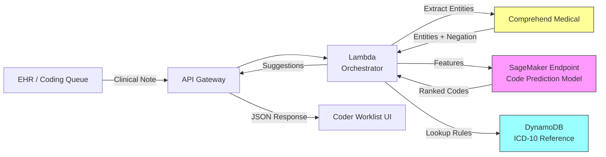

# Recipe 8.3: ICD-10 Code Suggestion

**Complexity:** Simple-Medium · **Phase:** Productivity Tool · **Estimated Cost:** ~$0.02-0.10 per note

---

## The Problem

There are over 72,000 codes in ICD-10-CM. Seventy-two thousand. A professional medical coder is expected to choose the right ones from that haystack for every patient encounter, every day, and the specificity requirements are brutal. "Type 2 diabetes mellitus with diabetic chronic kidney disease" isn't just E11.22. It's E11.22 only if the documentation supports that specific combination. If the note says "unspecified," you're at E11.65. If it says "without complications," you're somewhere else entirely. One digit difference in the code can mean hundreds of dollars difference in reimbursement, or a denied claim, or an audit flag.

The average coder processes 20-25 charts per hour for outpatient encounters. They're reading clinical notes (often written by physicians in a hurry, with abbreviations, shorthand, and incomplete sentences), interpreting the clinical intent, and translating that into the most specific ICD-10 code the documentation supports. Not the most specific code that's clinically true. The most specific code the documentation supports. That distinction matters enormously and is the source of a huge portion of coding errors.

When coders get it wrong, the consequences cascade. Under-coding means lost revenue. Over-coding triggers payer audits and potential fraud allegations. Incorrect codes pollute population health analytics. And the volume is relentless: a mid-sized health system might process 2,000-5,000 encounters per day.

What if you could hand the coder a short list of likely codes before they even start? Not replace them. Just give them a head start. "Based on this note, here are the 5-10 codes most likely to apply, ranked by relevance." The coder still decides. But instead of searching through 72,000 options, they're confirming or adjusting a pre-filtered list.

That's ICD-10 code suggestion. It's one of the most immediately valuable NLP applications in healthcare operations, and it's been a production reality at large health systems since the mid-2010s. Let's talk about how it actually works.

---

## The Technology: Text Classification at Scale

### Why This Is a Text Classification Problem

At its core, ICD-10 code suggestion is multi-label text classification. You have a document (the clinical note), and you need to assign one or more labels (ICD-10 codes) from a very large label space. "Multi-label" because a single encounter typically produces 3-15 diagnosis codes, not just one.

Standard text classification (spam vs. not-spam, positive vs. negative sentiment) deals with a handful of labels. ICD-10 has tens of thousands. That label-space explosion is the first thing that makes this hard. A naive approach that trains a separate binary classifier for each code doesn't scale, and rare codes (which account for the majority of the vocabulary) won't have enough training examples to learn from.

### The Approaches That Work

Over the last decade, three main approaches have emerged:

**Keyword and rule-based matching.** The simplest approach: build a lookup table that maps clinical terms to ICD-10 codes. "Hypertension" maps to I10. "Type 2 diabetes" maps to E11.x. "Acute myocardial infarction" maps to I21.x. You can get surprisingly far with this, especially for common conditions. The problem is specificity. Keyword matching can tell you "this note mentions diabetes," but it can't reliably tell you whether the documentation supports E11.22 (with diabetic chronic kidney disease) vs. E11.21 (with diabetic nephropathy) vs. E11.65 (with hyperglycemia). That level of specificity requires understanding context, negation, and the relationships between mentioned conditions.

**Traditional ML classifiers.** TF-IDF vectors or bag-of-words representations fed into logistic regression, random forests, or gradient-boosted trees. These models learn statistical associations between word patterns and codes. They work well for high-frequency codes (the top 500 codes cover roughly 80% of encounters) but struggle with rare codes and complex specificity choices. They also don't handle negation well: "no evidence of CHF" contains the same keywords as "evidence of CHF," but should produce different codes.

**Deep learning and embeddings.** The current state of the art uses neural models (typically transformer-based or CNN/RNN architectures) that learn dense representations of clinical text. These models can capture negation, context, and relationships between concepts. Models like clinical BERT variants or specialized architectures like CAML (Convolutional Attention for Multi-Label classification) have shown strong performance on benchmark datasets. The key advantage: they learn the semantics of clinical language, not just keyword co-occurrence.

In practice, production systems often combine approaches. A deep learning model handles the primary suggestion, while rule-based post-processing ensures coding guidelines are respected (certain code combinations are invalid, certain codes require additional codes to be assigned together).

### The NLP Pipeline for Code Suggestion

Regardless of the specific model architecture, the pipeline has consistent stages:

1. **Text preprocessing.** Clinical notes are messy. Abbreviations ("HTN" for hypertension, "DM2" for type 2 diabetes), section headers, vitals mixed with narrative, copy-forward artifacts from previous visits. The preprocessing step normalizes abbreviations, segments the note into clinically relevant sections, and removes noise (headers, footers, timestamps that don't carry diagnostic information).

2. **Clinical entity extraction.** Before classifying the whole document, it helps to identify the specific medical concepts mentioned. Named entity recognition (NER) pulls out conditions, symptoms, procedures, medications, and anatomical locations. This step can also identify negation ("denies chest pain") and temporality ("history of" vs. "current").

3. **Feature generation.** The extracted entities and/or the full note text are converted into a numerical representation the model can process. This might be TF-IDF vectors, pre-trained clinical embeddings, or tokenized input for a transformer model.

4. **Code prediction.** The model generates a ranked list of candidate ICD-10 codes with confidence scores. For multi-label classification, this typically means applying a sigmoid activation to each code independently (rather than softmax, which assumes mutual exclusivity).

5. **Post-processing and validation.** Raw model outputs go through business logic: filter out codes that are clinically impossible in combination, enforce coding guidelines (like "code first" requirements), check for age/sex validity, and threshold by confidence score.

### What Makes This Genuinely Hard

**The specificity ladder.** ICD-10 is hierarchical. E11 is type 2 diabetes. E11.2 is type 2 diabetes with kidney complications. E11.22 is type 2 diabetes with diabetic chronic kidney disease. The model needs to suggest the most specific code the documentation supports, not just the category. Getting the chapter right is easy. Getting the fourth, fifth, or sixth character right requires nuanced understanding of what the note actually says.

**Negation.** "Patient denies chest pain." "No evidence of malignancy." "Ruled out PE." Every one of these contains a condition name that should NOT be coded. Negation detection is a solved-ish problem (NegEx, ConText), but it still trips up systems that rely primarily on keyword matching or shallow features.

**Implied vs. stated conditions.** A note that documents metformin in the medication list, an A1c of 8.2, and a mention of "continued glucose management" implies diabetes. But is it explicitly documented enough to code? Coding guidelines require that conditions be explicitly stated or clearly confirmed by the provider. Models that suggest codes for implied-but-not-documented conditions create compliance risk.

**The 80/20 curse.** The top 500 ICD-10 codes cover most encounters, but the long tail of 70,000+ codes is where coding accuracy matters most for revenue and compliance. A model that's great at predicting hypertension and diabetes but can't handle rare codes is only solving the easy part of the problem.

**Training data bias.** Models trained on historical coding data learn the patterns of how coders at your organization have coded in the past. If those coders have systematic biases (under-coding certain conditions, preferring certain specificity levels), the model will perpetuate those biases. Clean, validated training data is harder to obtain than most teams expect.

### Where the Field Is Now

Production ICD-10 suggestion systems at major health systems typically achieve:
- 70-85% recall on the top suggested codes (the correct code appears in the suggestion list)
- Suggestion lists of 5-15 codes per encounter
- Measurable productivity improvements of 15-30% in coder throughput

These aren't replacing coders. They're giving coders a head start. The human still reviews, adjusts, and finalizes. But the cognitive load of searching through 72,000 codes drops dramatically when you start with a relevant shortlist.

---

## General Architecture Pattern

```text
[Clinical Note] → [Preprocess] → [Entity Extraction] → [Code Prediction Model] → [Post-Processing] → [Ranked Code List + Confidence] → [Coder Worklist UI]
```

**Clinical Note Ingestion.** Notes arrive from the EHR, typically triggered by encounter close or a coding queue event. The system needs to handle multiple note types (progress notes, H&P, discharge summaries) because each has different structure and coding implications.

**Preprocessing.** Normalize abbreviations, segment by section (History of Present Illness, Assessment, Plan), remove non-clinical noise. Section segmentation matters because the Assessment/Plan section carries the most coding-relevant information, while the Review of Systems section contains a lot of negated findings.

**Entity Extraction.** Pull out medical concepts with their assertion status (present, absent, uncertain, historical). Link concepts to standard terminologies (SNOMED-CT, UMLS) where possible. This step creates structured features even when the input text is unstructured.

**Code Prediction.** A trained model maps the extracted features (or raw text, depending on architecture) to a ranked list of ICD-10 codes. The model might be a single end-to-end classifier or an ensemble. Output is a list of (code, confidence_score) pairs.

**Post-Processing.** Apply coding logic rules:
- Remove gender-inappropriate codes (pregnancy codes for male patients)
- Remove age-inappropriate codes (neonatal codes for adults)
- Enforce "code first" and "use additional code" requirements
- Group related codes that typically appear together
- Apply confidence thresholds to filter noise

**Coder Interface.** Present the ranked suggestions in the coder's existing workflow tool. The interface should support one-click acceptance, easy modification (wrong specificity but right category), and rejection with reason (to feed the learning loop). Integration with the coding workflow is what separates a useful tool from a science project.

---

## The AWS Implementation

### Why These Services

**Amazon Comprehend Medical for entity extraction.** Comprehend Medical is AWS's managed medical NLP service. It extracts medical entities (conditions, medications, procedures, anatomy) from clinical text and identifies their traits (negation, temporality). For the entity extraction stage of the pipeline, it saves you from training and hosting your own clinical NER model. It handles negation detection out of the box, which is critical for coding accuracy.

**Amazon SageMaker for model training and hosting.** The code prediction model itself is custom: it's trained on your organization's historical coding data, which means it learns your coding patterns and payer-specific requirements. SageMaker provides the infrastructure for training (GPU instances for deep learning models), versioned model artifacts, and real-time inference endpoints with auto-scaling.

**Amazon S3 for data storage.** Clinical notes, training datasets, model artifacts, and prediction logs all live in S3. Encrypted at rest with KMS, versioned for reproducibility, and lifecycle-managed for cost optimization on historical data.

**Amazon DynamoDB for the code reference store.** The full ICD-10 code catalog (descriptions, hierarchy, validity rules, gender/age restrictions, combination exclusions) lives in DynamoDB for fast lookup during post-processing. Key-value access pattern is perfect: you're looking up individual codes by their code string.

**AWS Lambda for orchestration.** The suggestion pipeline (receive note, call Comprehend Medical, call SageMaker endpoint, post-process, return results) is a stateless sequence of API calls. Lambda handles the orchestration with automatic scaling and no idle costs.

**Amazon API Gateway for the coder-facing endpoint.** Exposes the suggestion pipeline as a REST API that the coding workflow tool can call synchronously. Returns suggestions within the latency budget that makes inline coding assistance viable (under 5 seconds).

### Architecture Diagram



### Prerequisites

| Requirement | Details |
|-------------|---------|
| **AWS Services** | Amazon Comprehend Medical, Amazon SageMaker, Amazon S3, Amazon DynamoDB, AWS Lambda, Amazon API Gateway |
| **IAM Permissions** | `comprehend-medical:DetectEntitiesV2`, `comprehend-medical:InferICD10CM`, `sagemaker:InvokeEndpoint`, `s3:GetObject`, `s3:PutObject`, `dynamodb:GetItem`, `dynamodb:Query` |
| **BAA** | AWS BAA signed (required: clinical notes contain PHI) |
| **Encryption** | S3: SSE-KMS; DynamoDB: encryption at rest (default); SageMaker endpoint: inter-container encryption; Lambda CloudWatch logs: KMS encryption; all API calls over TLS |
| **VPC** | Production: Lambda in VPC with VPC endpoints for S3, Comprehend Medical, SageMaker, DynamoDB, and CloudWatch Logs |
| **CloudTrail** | Enabled: log all Comprehend Medical, SageMaker invoke, and S3 access for HIPAA audit |
| **Training Data** | Historical encounter notes paired with finalized ICD-10 codes. Minimum 50,000 encounters recommended. De-identified for model development; BAA-covered processing for production. |
| **Cost Estimate** | Comprehend Medical DetectEntitiesV2: ~$0.01 per 100 characters (a typical note is 2,000-5,000 chars = $0.20-0.50 per note). InferICD10CM: similar pricing. SageMaker real-time endpoint: ml.m5.xlarge ~$0.23/hr. Lambda/DynamoDB negligible at this scale. |

### Ingredients

| AWS Service | Role |
|------------|------|
| **Amazon Comprehend Medical** | Extracts medical entities, detects negation, provides ICD-10 candidate codes via InferICD10CM |
| **Amazon SageMaker** | Hosts custom code prediction model trained on organization-specific coding patterns |
| **Amazon S3** | Stores training data, model artifacts, prediction audit logs |
| **Amazon DynamoDB** | ICD-10 reference catalog: code descriptions, hierarchy, validity rules, exclusions |
| **AWS Lambda** | Orchestrates the multi-step prediction pipeline |
| **Amazon API Gateway** | Exposes synchronous REST endpoint for the coding workflow tool |
| **AWS KMS** | Manages encryption keys for all data stores |
| **Amazon CloudWatch** | Metrics, logging, and alarms for pipeline health |

### Code

> **Reference implementations:** The following AWS resources demonstrate the patterns used in this recipe:
>
> - [`amazon-comprehend-medical-ICD10-mapping`](https://github.com/aws-samples/amazon-comprehend-medical-ICD10-mapping): Maps clinical text to ICD-10 codes using Comprehend Medical's InferICD10CM API
> - [`amazon-comprehend-medical-fhir-integration`](https://github.com/aws-samples/amazon-comprehend-medical-fhir-integration): End-to-end integration of Comprehend Medical entity extraction with FHIR-based health records

#### Walkthrough

**Step 1: Receive and preprocess the clinical note.** When a coder opens an encounter in their worklist, the coding tool sends the clinical note to your API. The first step is cleaning the text for NLP processing. Clinical notes have structure that helps and structure that hurts: section headers help you weight the Assessment/Plan section more heavily; copy-forward boilerplate from prior visits hurts because it introduces stale information. This preprocessing step segments the note, identifies the highest-value sections, and normalizes common abbreviations. Skip this and your model gets confused by noise, especially template text that appears in every note regardless of the patient's conditions.

```pseudocode
FUNCTION preprocess_note(raw_note_text):
    // Clinical notes have predictable section headers (HPI, ROS, Assessment, Plan, etc.)
    // The Assessment and Plan sections carry the most coding-relevant information.
    // Other sections (vitals, review of systems) are useful but noisier.
    
    sections = segment_by_headers(raw_note_text)
    // segment_by_headers splits on known patterns like "ASSESSMENT:", "A/P:", "PLAN:"
    
    // Weight sections by coding relevance:
    // Assessment/Plan = primary signal
    // History of Present Illness = secondary signal
    // Medications/Problem List = supporting evidence
    // Review of Systems = mostly negated findings (still useful for ruling things out)
    
    priority_text = concatenate sections in order:
        sections["assessment_plan"]       // highest coding signal
        sections["hpi"]                   // describes current conditions
        sections["problem_list"]          // explicit condition list
        sections["medications"]           // implies conditions being treated
    
    // Normalize abbreviations that confuse NLP models
    // "HTN" -> "hypertension", "DM2" -> "type 2 diabetes", "CHF" -> "congestive heart failure"
    normalized_text = expand_abbreviations(priority_text, CLINICAL_ABBREV_MAP)
    
    // Remove copy-forward artifacts: text blocks identical to prior encounters.
    // These introduce stale conditions that may no longer apply.
    // In production, compare against the patient's last 3-5 notes to detect copy-forward.
    cleaned_text = remove_duplicate_blocks(normalized_text)
    
    RETURN cleaned_text
```

**Step 2: Extract medical entities with negation detection.** Now we pass the cleaned text through a medical NER system. The goal is to identify every medical concept mentioned, along with whether it's affirmed, negated, or uncertain. This is where you hand the text to Amazon Comprehend Medical's DetectEntitiesV2 API. It returns structured entities with their category (condition, medication, procedure), traits (negation, diagnosis), and position in the text. The negation trait is particularly critical: "no evidence of pneumonia" should not generate a suggestion for pneumonia codes. Skip this step and feed raw text directly to the code prediction model, and you lose the ability to filter negated conditions before prediction.

```pseudocode
FUNCTION extract_entities(cleaned_text):
    // Call the medical NER service to identify clinical concepts in the text.
    // DetectEntitiesV2 returns entities with:
    //   - Text: the surface form ("type 2 diabetes mellitus")
    //   - Category: MEDICAL_CONDITION, MEDICATION, TEST_TREATMENT_PROCEDURE, etc.
    //   - Traits: NEGATION, DIAGNOSIS, SIGN, SYMPTOM
    //   - Score: confidence (0.0-1.0)
    
    response = call ComprehendMedical.DetectEntitiesV2 with:
        Text = cleaned_text
    
    entities = response.Entities
    
    // Separate affirmed conditions from negated ones.
    // Only affirmed conditions should drive code suggestions.
    affirmed_conditions = empty list
    negated_conditions  = empty list
    
    FOR each entity in entities:
        IF entity.Category == "MEDICAL_CONDITION":
            is_negated = any trait in entity.Traits where trait.Name == "NEGATION" and trait.Score > 0.85
            
            IF is_negated:
                append entity to negated_conditions
            ELSE:
                append entity to affirmed_conditions
    
    // Return both lists. Negated conditions are useful context
    // (they tell the model what to NOT suggest) even though they don't generate codes.
    RETURN {
        affirmed: affirmed_conditions,
        negated:  negated_conditions,
        all_entities: entities    // full entity list for feature generation
    }
```

**Step 3: Generate ICD-10 code candidates.** With entities extracted, we now generate candidate codes. There are two paths here, and production systems often use both. Path A: call Comprehend Medical's InferICD10CM API, which directly maps clinical text to ICD-10-CM codes with confidence scores. This gives you a baseline set of candidates using AWS's pre-trained model. Path B: feed the entities and text into your custom SageMaker model trained on your organization's specific coding patterns. The custom model learns the coding conventions and payer-specific requirements that a general model can't know. Combine both outputs into a merged candidate list.

```pseudocode
FUNCTION generate_code_candidates(cleaned_text, extracted_entities):
    // PATH A: Use the managed ICD-10 inference service.
    // InferICD10CM maps clinical text directly to ICD-10-CM codes.
    // It's good at common conditions but may miss organization-specific patterns.
    
    inference_response = call ComprehendMedical.InferICD10CM with:
        Text = cleaned_text
    
    managed_candidates = empty list
    FOR each concept in inference_response.Entities:
        FOR each icd10_code in concept.ICD10CMConcepts:
            append to managed_candidates: {
                code:        icd10_code.Code,            // e.g., "E11.22"
                description: icd10_code.Description,     // e.g., "Type 2 diabetes with diabetic CKD"
                confidence:  icd10_code.Score,           // 0.0-1.0
                source:      "comprehend_medical"
            }
    
    // PATH B: Call custom model trained on organization's historical coding data.
    // This model learns YOUR coding patterns: which specificity levels your coders choose,
    // which code combinations are common for your patient population,
    // and how your documentation style maps to codes.
    
    // Prepare features for the custom model: entity list + text embedding
    model_input = {
        text:               cleaned_text,
        entity_features:    format_entities_for_model(extracted_entities.affirmed),
        negated_entities:   format_entities_for_model(extracted_entities.negated)
    }
    
    custom_response = call SageMaker.InvokeEndpoint with:
        EndpointName = "icd10-suggestion-endpoint"
        Body         = serialize(model_input)
        ContentType  = "application/json"
    
    custom_candidates = parse custom_response into list of {code, confidence, source: "custom_model"}
    
    // MERGE: Combine candidates from both sources.
    // If the same code appears in both lists, take the higher confidence.
    // Codes that appear in both lists get a boost (agreement = higher trust).
    merged = merge_candidates(managed_candidates, custom_candidates)
    
    RETURN merged  // sorted by confidence, descending
```

**Step 4: Post-process and validate codes.** Raw model output can suggest codes that are clinically impossible, hierarchically wrong, or violate coding guidelines. This step applies the business rules that turn a raw prediction list into a valid, guideline-compliant suggestion set. Check age and sex validity (neonatal codes for adults, pregnancy codes for males). Check combination exclusions (certain codes can't appear together). Enforce "code first" and "use additional code" conventions. This step uses the ICD-10 reference catalog stored in DynamoDB.

```pseudocode
FUNCTION validate_and_filter(candidates, patient_context):
    // patient_context includes: age, sex, encounter_type (inpatient/outpatient)
    
    validated = empty list
    
    FOR each candidate in candidates:
        // Look up the code's metadata from the ICD-10 reference catalog
        code_metadata = lookup DynamoDB table "icd10-reference" with key = candidate.code
        
        // CHECK 1: Sex validity
        // Some codes are sex-specific (obstetric codes require female patient)
        IF code_metadata.sex_restriction != null:
            IF patient_context.sex != code_metadata.sex_restriction:
                SKIP this candidate  // invalid for this patient
        
        // CHECK 2: Age validity
        // Neonatal codes (P-codes) only valid for patients under 28 days
        // Pediatric codes may have upper age limits
        IF code_metadata.age_range != null:
            IF patient_context.age NOT IN code_metadata.age_range:
                SKIP this candidate
        
        // CHECK 3: Code-first requirements
        // Some codes require another code to be listed first (etiology/manifestation pairs)
        IF code_metadata.code_first != null:
            // Flag this code as needing a companion code, but don't remove it
            candidate.requires_companion = code_metadata.code_first
        
        // CHECK 4: Excludes1 (codes that can never appear together)
        // Check if any already-validated code conflicts with this one
        FOR each already_valid in validated:
            IF candidate.code IN code_metadata.excludes1:
                SKIP this candidate  // mutually exclusive with an already-accepted code
        
        append candidate to validated
    
    // Apply confidence threshold: only suggest codes above minimum confidence
    CONFIDENCE_THRESHOLD = 0.40  // lower than OCR threshold because coders review all suggestions
    
    final_suggestions = filter validated where confidence >= CONFIDENCE_THRESHOLD
    
    // Limit suggestion list size: too many suggestions slow coders down
    MAX_SUGGESTIONS = 15
    final_suggestions = take top MAX_SUGGESTIONS from final_suggestions by confidence
    
    RETURN final_suggestions
```

**Step 5: Return ranked suggestions to the coder.** Format the validated suggestions for the coding workflow UI. Include the code, its description, confidence score, and the text evidence that triggered the suggestion. That evidence linkage is what makes the tool trustworthy: coders can see exactly why each code was suggested and quickly judge whether the documentation supports it.

```pseudocode
FUNCTION format_response(suggestions, extracted_entities, cleaned_text):
    // Build a response that helps the coder quickly accept, modify, or reject each suggestion.
    
    response = {
        encounter_id:   current_encounter_id,
        timestamp:      current UTC timestamp (ISO 8601),
        suggestion_count: length of suggestions,
        suggestions:    empty list
    }
    
    FOR each suggestion in suggestions:
        // Find the text span(s) that support this code suggestion.
        // This is the evidence the coder needs to validate the suggestion.
        supporting_evidence = find_supporting_text(
            suggestion.code,
            extracted_entities,
            cleaned_text
        )
        
        formatted_suggestion = {
            rank:           index + 1,
            code:           suggestion.code,              // "E11.22"
            description:    suggestion.description,       // "Type 2 DM with diabetic CKD"
            confidence:     round(suggestion.confidence, 3),
            source:         suggestion.source,            // "custom_model" or "comprehend_medical"
            evidence:       supporting_evidence,          // text spans that support this code
            requires_companion: suggestion.requires_companion or null
        }
        
        append formatted_suggestion to response.suggestions
    
    RETURN response
```

> **Curious how this looks in Python?** The pseudocode above covers the concepts. If you'd like to see sample Python code that demonstrates these patterns using boto3, check out the [Python Example](chapter08.03-python-example). It walks through each step with inline comments and notes on what you'd need to change for a real deployment.

### Expected Results

**Sample output for a progress note documenting a diabetic patient with CKD:**

```json
{
  "encounter_id": "ENC-2026-03-15-08842",
  "timestamp": "2026-03-15T10:44:12Z",
  "suggestion_count": 8,
  "suggestions": [
    {
      "rank": 1,
      "code": "E11.22",
      "description": "Type 2 diabetes mellitus with diabetic chronic kidney disease",
      "confidence": 0.924,
      "source": "custom_model",
      "evidence": ["type 2 diabetes with nephropathy, CKD stage 3", "A1c 8.1"],
      "requires_companion": "N18.3"
    },
    {
      "rank": 2,
      "code": "N18.3",
      "description": "Chronic kidney disease, stage 3 (moderate)",
      "confidence": 0.918,
      "source": "custom_model",
      "evidence": ["CKD stage 3", "GFR 45"],
      "requires_companion": null
    },
    {
      "rank": 3,
      "code": "I10",
      "description": "Essential (primary) hypertension",
      "confidence": 0.891,
      "source": "comprehend_medical",
      "evidence": ["hypertension, well controlled on lisinopril"],
      "requires_companion": null
    },
    {
      "rank": 4,
      "code": "E78.5",
      "description": "Hyperlipidemia, unspecified",
      "confidence": 0.847,
      "source": "custom_model",
      "evidence": ["continue atorvastatin for hyperlipidemia"],
      "requires_companion": null
    },
    {
      "rank": 5,
      "code": "Z79.84",
      "description": "Long term (current) use of oral hypoglycemic drugs",
      "confidence": 0.723,
      "source": "custom_model",
      "evidence": ["metformin 1000mg BID"],
      "requires_companion": null
    }
  ]
}
```

**Performance benchmarks:**

| Metric | Typical Value |
|--------|---------------|
| End-to-end latency | 2-5 seconds per note |
| Recall@15 (correct code in top 15 suggestions) | 70-85% |
| Precision@5 (proportion of top 5 that are correct) | 55-70% |
| Coder productivity improvement | 15-30% throughput increase |
| Cost per note | $0.02-0.10 (varies with note length) |
| Throughput | ~20 notes/second (SageMaker endpoint limited) |

**Where it struggles:**
- Rare codes (bottom 50,000 of the vocabulary) with insufficient training examples
- Notes with heavy copy-forward text (stale conditions from prior visits that no longer apply)
- Specificity decisions where documentation is borderline (does "kidney disease" support "diabetic chronic kidney disease"?)
- Multi-coder disagreement scenarios (where expert coders would themselves disagree on the right code)
- Encounter types the model hasn't seen much of (procedural notes, behavioral health, oncology subspecialties)

---

## The Honest Take

Here's what surprises people about ICD-10 code suggestion: the accuracy numbers look modest compared to other ML applications, and that's actually fine. You're not replacing the coder. You're reducing their search space from 72,000 codes to 10-15 candidates. Even a system with 70% recall at the top 15 suggestions is saving the coder from manual searching 70% of the time. The other 30%, they do what they've always done.

The thing that will bite you hardest is training data quality. Your historical coding data reflects how your coders actually coded, which includes systematic errors, inconsistencies between coders, and patterns that change over time as guidelines evolve. If you train a model on 3 years of data and the coding guidelines changed 18 months ago, your model is learning a mix of old and new conventions. Recency-weight your training data.

The Comprehend Medical InferICD10CM API is a solid baseline and requires zero training data. It works out of the box. But it doesn't know your organization's coding patterns, your payer-specific requirements, or your documentation style conventions. Treat it as the starting point, not the destination. The custom model is where the real accuracy gains come from, but it requires clean training data and ongoing retraining.

One more thing: coders will initially distrust the suggestions. This is healthy and correct. Build trust gradually by showing them the evidence for each suggestion. Let them see why the model suggested E11.22 instead of E11.65. Once they can see the reasoning, they'll start trusting (and correcting) efficiently. If you just throw codes at them without evidence, they'll ignore the tool entirely.

---

## Variations and Extensions

**Specialty-specific models.** Train separate models for different specialties (cardiology, orthopedics, oncology). Each specialty has distinct documentation patterns and a concentrated subset of the code space. A cardiology model that's excellent at I-codes and Z-codes is more useful than a general model that's mediocre at everything.

**Real-time suggestion during documentation.** Instead of suggesting codes after the note is complete, provide code suggestions as the physician is writing. This creates a feedback loop: the physician sees that their documentation supports specific codes and can add detail to support higher specificity while the encounter is still fresh.

**Coder feedback loop for continuous learning.** Track which suggestions coders accept, modify, or reject. Use accepted/modified codes as positive training signal and rejected codes as negative signal. Retrain the model periodically (monthly or quarterly) to incorporate this feedback. Over time, the model adapts to your coders' judgment and coding conventions evolve organically.

---

## Related Recipes

- **Recipe 8.1 (Chief Complaint Classification):** Uses similar NLP techniques for shorter text inputs; the preprocessing patterns apply here
- **Recipe 8.4 (Medication Extraction and Normalization):** The entity extraction step here extends naturally to medication normalization for medication-related codes
- **Recipe 8.5 (Problem List Extraction):** Problem list items map directly to diagnosis codes; these recipes share the condition extraction core
- **Recipe 8.8 (Clinical Assertion Classification):** The negation/assertion logic in Step 2 is a simplified version of the full assertion classification pipeline
- **Recipe 13.3 (ICD/CPT Hierarchy Navigation):** Builds the knowledge graph that powers the post-processing validation rules in Step 4

---

## Additional Resources

**AWS Documentation:**
- [Amazon Comprehend Medical InferICD10CM API Reference](https://docs.aws.amazon.com/comprehend-medical/latest/dev/ontology-icd10.html)
- [Amazon Comprehend Medical DetectEntitiesV2 API Reference](https://docs.aws.amazon.com/comprehend-medical/latest/dev/textanalysis-entitiesv2.html)
- [Amazon Comprehend Medical Pricing](https://aws.amazon.com/comprehend/medical/pricing/)
- [Amazon SageMaker Real-Time Inference](https://docs.aws.amazon.com/sagemaker/latest/dg/realtime-endpoints.html)
- [AWS HIPAA Eligible Services](https://aws.amazon.com/compliance/hipaa-eligible-services-reference/)
- [Architecting for HIPAA on AWS (Whitepaper)](https://docs.aws.amazon.com/whitepapers/latest/architecting-hipaa-security-and-compliance-on-aws/welcome.html)

**AWS Sample Repos:**
- [`amazon-comprehend-medical-ICD10-mapping`](https://github.com/aws-samples/amazon-comprehend-medical-ICD10-mapping): Demonstrates mapping clinical text to ICD-10-CM codes using Comprehend Medical
- [`amazon-comprehend-medical-fhir-integration`](https://github.com/aws-samples/amazon-comprehend-medical-fhir-integration): Integrates Comprehend Medical NLP output with FHIR health records

**AWS Solutions and Blogs:**
- [Extracting Medical Information from Clinical Text with Amazon Comprehend Medical](https://aws.amazon.com/blogs/machine-learning/extracting-medical-information-from-clinical-text-with-amazon-comprehend-medical/): Deep dive on entity extraction and ICD-10 mapping patterns
- [Building a Medical Language Processing Pipeline with Amazon Comprehend Medical](https://aws.amazon.com/blogs/machine-learning/building-a-medical-language-processing-pipeline-on-aws/): End-to-end architecture for clinical NLP workflows

---

## Estimated Implementation Time

| Tier | Timeline | What You Get |
|------|----------|--------------|
| **Basic (Comprehend Medical only)** | 2-3 weeks | InferICD10CM API integration, basic post-processing, simple UI showing suggestions |
| **Production-ready** | 2-4 months | Custom SageMaker model trained on your data, full post-processing rules, coder workflow integration, feedback loop, monitoring |
| **With variations** | 4-6 months | Specialty-specific models, real-time documentation suggestions, continuous learning pipeline |

---

## Tags

`nlp` · `icd-10` · `medical-coding` · `text-classification` · `comprehend-medical` · `sagemaker` · `multi-label` · `coding-automation` · `revenue-cycle` · `hipaa` · `simple-medium`

---

*← [Recipe 8.2: Patient Sentiment Analysis](chapter08.02-patient-sentiment-analysis) · [Chapter 8 Index](chapter08-index) · [Next: Recipe 8.4: Medication Extraction and Normalization →](chapter08.04-medication-extraction-normalization)*
