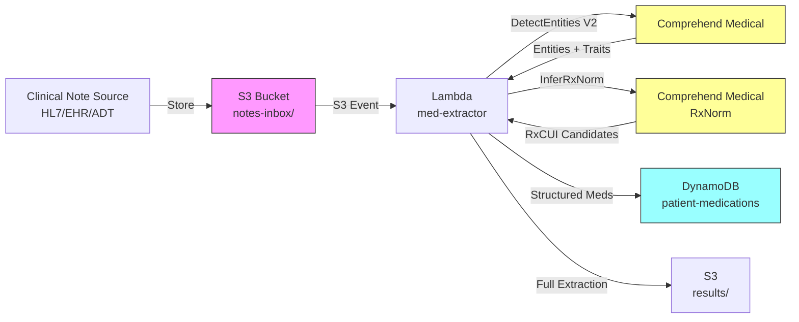

# Recipe 8.4 Architecture and Implementation: Medication Extraction and Normalization

*Companion to [Recipe 8.4: Medication Extraction and Normalization](chapter08.04-medication-extraction-normalization). This page covers the AWS architecture, services, prerequisites, and pseudocode. For the problem framing and the conceptual approach, start with the main recipe.*

---

## The AWS Implementation

### Why These Services

**Amazon Comprehend Medical for NER extraction.** Comprehend Medical is AWS's managed clinical NLP service. Its `DetectEntities` API performs medical NER across multiple entity categories, and it excels at medication extraction specifically. It returns medications with linked attributes (dosage, frequency, route, form, duration, condition/reason) already associated, which means you don't have to build the attribute-linking logic yourself. It also returns traits like "NEGATION" and "PAST_HISTORY" on extracted entities, giving you the context classification for free. The RxNorm normalization step is handled by a separate API (`InferRxNorm`) that takes medication text and returns ranked RxCUI candidates with confidence scores. Two API calls handle what would otherwise be three or four pipeline stages.

**Amazon S3 for note storage.** Clinical notes arrive from various sources (HL7 feeds, EHR exports, ADT messages). S3 provides encrypted staging for incoming notes and archival for processed results. Event-driven triggers (S3 notifications to Lambda) enable automatic processing as notes arrive.

**AWS Lambda for orchestration.** The extraction pipeline is stateless and short-lived: receive text, call Comprehend Medical, normalize results, store output. Lambda handles this naturally with automatic scaling. For batch processing (historical note backfill), Step Functions can orchestrate Lambda invocations with retry logic and progress tracking.

**Amazon DynamoDB for medication list storage.** The normalized medication extractions need fast point-lookups by patient ID (for reconciliation workflows) and time-range queries (for medication history). DynamoDB's key-value model with sort keys supports both access patterns efficiently.

**AWS Step Functions for batch orchestration.** When processing thousands of historical notes, Step Functions provides workflow coordination, retry handling, and progress visibility that raw Lambda invocations lack.

### Architecture Diagram



<!-- TODO (TechWriter): Expert review A2 (MEDIUM). Add SQS dead letter queue to the architecture diagram and "Why These Services" section. Failed Lambda extractions (throttling, malformed notes, 20K char limit exceeded) should route to a DLQ for retry/investigation rather than being silently dropped. -->

### Prerequisites

| Requirement | Details |
|-------------|---------|
| **AWS Services** | Amazon Comprehend Medical, Amazon S3, AWS Lambda, Amazon DynamoDB, AWS Step Functions (for batch) |
| **IAM Permissions** | `comprehendmedical:DetectEntitiesV2`, `comprehendmedical:InferRxNorm`, `s3:GetObject`, `s3:PutObject`, `dynamodb:PutItem`, `dynamodb:BatchWriteItem`, `dynamodb:Query`. Standard Lambda execution role permissions for CloudWatch Logs assumed (use `AWSLambdaBasicExecutionRole` managed policy or grant `logs:CreateLogGroup`, `logs:CreateLogStream`, `logs:PutLogEvents` explicitly). |

| **BAA** | AWS BAA signed (required: clinical notes contain PHI) |
| **Encryption** | S3: SSE-KMS; DynamoDB: encryption at rest (default); Lambda CloudWatch log groups: KMS encryption (logs may contain extracted medication data); all API calls over TLS |
| **VPC** | Production: Lambda in VPC with VPC endpoints for S3, DynamoDB (gateway endpoints), and CloudWatch Logs (interface endpoint). Comprehend Medical does not have a VPC endpoint; use a NAT Gateway for outbound access. Clinical text is encrypted via TLS in transit regardless of network path. |
| **CloudTrail** | Enabled: log all Comprehend Medical and S3 API calls for HIPAA audit trail |
| **Sample Data** | Synthetic clinical notes with medication mentions. MIMIC-III (with DUA) provides realistic note structures. Never use real patient notes in dev without proper IRB/DUA. |
| **Cost Estimate** | Comprehend Medical DetectEntities: ~$0.01 per 100 characters (minimum 3 units per request). InferRxNorm: ~$0.01 per 100 characters. A typical 2000-character note: ~$0.20 for detection + $0.03-0.10 for RxNorm inference (depending on medication count). Total per note: ~$0.23-0.50 depending on note length and number of medications. Batch pricing available for high volume. |

<!-- TODO (TechWriter): Expert review N2 (LOW). Add a note on Comprehend Medical regional availability (us-east-1, us-east-2, us-west-2, eu-west-1, eu-west-2, ap-southeast-2, ca-central-1 as of 2024). Data residency requirements may constrain region selection. -->

### Ingredients

| AWS Service | Role |
|-------------|------|
| **Amazon Comprehend Medical** | NER extraction (DetectEntitiesV2) and RxNorm normalization (InferRxNorm) |
| **Amazon S3** | Stores incoming clinical notes and extraction results; encrypted with KMS |
| **AWS Lambda** | Orchestrates extraction: receives note, calls APIs, assembles structured output |
| **Amazon DynamoDB** | Stores normalized medication lists for patient-level queries |
| **AWS Step Functions** | Coordinates batch processing of historical notes |
| **AWS KMS** | Manages encryption keys for S3 and DynamoDB |
| **Amazon CloudWatch** | Logs, metrics, alarms for extraction failures and API throttling |

### Pseudocode Walkthrough

**Step 1: Preprocess and section-detect.** Clinical notes often arrive as a wall of text with section headers embedded ("MEDICATIONS:", "ASSESSMENT:", "ALLERGIES:"). Before sending text to the NER engine, we identify which sections contain medication-relevant content. This helps with downstream context classification: a medication found under "ALLERGIES" gets tagged differently than one under "CURRENT MEDICATIONS." Section detection can be rule-based for common note formats. Skip this step and you'll correctly extract medication entities but incorrectly classify allergies as active medications.

```pseudocode
FUNCTION detect_sections(note_text):
    // Common clinical note section headers that contain medication information.
    // These patterns cover most structured clinical documentation formats.
    MEDICATION_SECTIONS = ["medications", "current medications", "home medications",
                          "medications on admission", "discharge medications",
                          "medication list", "meds"]
    ALLERGY_SECTIONS    = ["allergies", "drug allergies", "medication allergies"]
    HISTORY_SECTIONS    = ["past medications", "prior medications", "medication history"]

    sections = empty list

    // Split note into sections by looking for header patterns.
    // Headers typically appear as "SECTION NAME:" or "**Section Name**" on their own line.
    FOR each line in note_text:
        IF line matches a section header pattern (ends with ":", is capitalized, etc.):
            current_section = {
                header: normalized lowercase of header text,
                category: classify header into MEDICATION / ALLERGY / HISTORY / OTHER,
                start_position: character offset in original text,
                text: empty string
            }
            append current_section to sections
        ELSE:
            // Append content to the current section being accumulated.
            current_section.text += line

    RETURN sections
```

**Step 2: Extract medication entities.** This is where the NER engine does its work. We send the clinical note text (or relevant sections) to Comprehend Medical's DetectEntitiesV2 API, which returns structured entities with their types, attributes, and traits. The key entity category we care about is MEDICATION, but we also need the associated attributes (DOSAGE, FREQUENCY, ROUTE_OR_MODE, FORM, DURATION, STRENGTH) and traits (NEGATION, PAST_HISTORY). The API handles the hard work of attribute linking: it knows that in "lisinopril 20mg PO QD," the 20mg belongs to lisinopril, not to whatever medication is mentioned next.

```pseudocode
FUNCTION extract_medications(note_text):
    // Call the managed NER service to extract medical entities from the note.
    // DetectEntitiesV2 handles medications, conditions, anatomy, and more.
    // We'll filter to medication-relevant entities afterward.
    response = call ComprehendMedical.DetectEntitiesV2 with:
        Text = note_text    // the raw clinical note text (max 20,000 characters per call)

    medications = empty list

    FOR each entity in response.Entities:
        // Filter to medication entities only.
        // Comprehend Medical also returns MEDICAL_CONDITION, ANATOMY, etc.
        IF entity.Category == "MEDICATION":

            med = {
                text: entity.Text,           // the raw text span ("lisinopril 20mg")
                begin: entity.BeginOffset,    // start character position in source text
                end: entity.EndOffset,      // end character position
                score: entity.Score,          // confidence score 0.0-1.0
                attributes: empty map,             // will hold dose, route, freq, etc.
                traits: empty list             // will hold NEGATION, PAST_HISTORY, etc.
            }

            // Extract linked attributes (dose, route, frequency, etc.)
            FOR each attribute in entity.Attributes:
                med.attributes[attribute.Type] = {
                    text: attribute.Text,      // e.g., "20mg" or "twice daily"
                    score: attribute.Score      // confidence for this specific attribute
                }

            // Extract traits that provide context about assertion status.
            FOR each trait in entity.Traits:
                append trait.Name to med.traits  // e.g., "NEGATION", "PAST_HISTORY"

            append med to medications

    RETURN medications
```

**Step 3: Normalize to RxNorm.** Raw extraction gives us "lisinopril 20mg" as text. Normalization maps that to RxCUI 314077 (lisinopril 20 MG Oral Tablet), enabling interoperability with pharmacy systems, drug interaction databases, and formulary checks. The InferRxNorm API takes medication text and returns ranked candidate concepts with scores. We select the top candidate above a confidence threshold. For combination drugs and ambiguous abbreviations, the API returns multiple candidates that may need human adjudication.

```pseudocode
RXNORM_CONFIDENCE_THRESHOLD = 0.70  // below this, flag for pharmacist review

FUNCTION normalize_to_rxnorm(medication_text):
    // Send the extracted medication text to the RxNorm inference service.
    // It returns ranked candidate RxNorm concepts with confidence scores.
    response = call ComprehendMedical.InferRxNorm with:
        Text = medication_text   // e.g., "lisinopril 20mg oral tablet"

    candidates = empty list

    FOR each concept in response.Entities:
        FOR each rxnorm_concept in concept.RxNormConcepts:
            append to candidates: {
                rxcui: rxnorm_concept.RxCUI,          // the RxNorm concept ID
                description: rxnorm_concept.Description,    // standardized drug description
                score: rxnorm_concept.Score           // confidence 0.0-1.0
            }

    // Sort by confidence and select the best match.
    sort candidates by score descending

    IF candidates is not empty AND candidates[0].score >= RXNORM_CONFIDENCE_THRESHOLD:
        RETURN {
            rxcui: candidates[0].rxcui,
            description: candidates[0].description,
            score: candidates[0].score,
            status: "MATCHED"
        }
    ELSE IF candidates is not empty:
        // Low confidence: return best guess but flag for review.
        RETURN {
            rxcui: candidates[0].rxcui,
            description: candidates[0].description,
            score: candidates[0].score,
            status: "NEEDS_REVIEW"
        }
    ELSE:
        // No candidates at all. Could be misspelling, abbreviation, or non-drug entity.
        RETURN {
            rxcui: null,
            description: null,
            score: 0.0,
            status: "UNMATCHED"
        }
```

**Step 4: Classify context and assertion status.** Not every medication mention belongs on the active medication list. This step uses the traits from Step 2 and the section information from Step 1 to determine what role each extracted medication plays. A medication with the NEGATION trait ("denies taking metformin") is classified differently from one in the ALLERGIES section ("allergic to penicillin"). Getting this wrong means populating a medication list with discontinued drugs, allergies, or medications the patient explicitly said they don't take.

```pseudocode
FUNCTION classify_medication_context(med, section_category):
    // Determine the assertion status of this medication mention.
    // Uses both NER traits (from the model) and section context (from preprocessing).

    // Check for negation trait first: "not taking," "denies," "discontinued."
    IF "NEGATION" in med.traits:
        RETURN "NEGATED"      // patient is NOT taking this medication

    // Check for historical trait: "was on," "previously took," "prior to."
    IF "PAST_HISTORY" in med.traits:
        RETURN "HISTORICAL"   // medication was taken in the past, not currently active

    // Use section context for classification.
    IF section_category == "ALLERGY":
        RETURN "ALLERGY"      // this is an allergy, not an active medication

    IF section_category == "HISTORY":
        RETURN "HISTORICAL"   // found in a historical medications section

    IF section_category == "MEDICATION":
        RETURN "ACTIVE"       // found in current medications section, no negation

    // Default for medications found in unstructured narrative (progress notes, etc.)
    // without explicit negation or historical markers.
    RETURN "ACTIVE"           // conservative default: treat as active unless proven otherwise
```

**Step 5: Assemble and store structured medication records.** The final step combines all upstream outputs into a structured medication record for each extraction: the normalized drug identity (RxCUI), parsed attributes (dose, route, frequency), assertion status, confidence scores, and provenance (which note, which section, which character offsets). This record is what downstream systems consume for medication reconciliation, drug interaction checking, and clinical decision support.

```pseudocode
FUNCTION store_medication_extraction(patient_id, note_id, medications, sections):
    structured_meds = empty list

    FOR each med in medications:
        // Determine which section this medication was found in.
        section = find section containing med.begin offset
        context = classify_medication_context(med, section.category)

        // Normalize to RxNorm.
        rxnorm_result = normalize_to_rxnorm(med.text)

        structured_med = {
            patient_id: patient_id,
            note_id: note_id,
            medication_text: med.text,                              // raw extracted text
            rxcui: rxnorm_result.rxcui,                   // normalized drug identity
            rxnorm_desc: rxnorm_result.description,             // standardized description
            rxnorm_score: rxnorm_result.score,                   // normalization confidence
            rxnorm_status: rxnorm_result.status,                  // MATCHED/NEEDS_REVIEW/UNMATCHED
            dosage: med.attributes.get("DOSAGE", null),    // e.g., "20mg"
            frequency: med.attributes.get("FREQUENCY", null), // e.g., "twice daily"
            route: med.attributes.get("ROUTE_OR_MODE", null),  // e.g., "oral"
            form: med.attributes.get("FORM", null),      // e.g., "tablet"
            duration: med.attributes.get("DURATION", null),  // e.g., "for 10 days"
            strength: med.attributes.get("STRENGTH", null),  // e.g., "20 MG"
            assertion: context,                               // ACTIVE/HISTORICAL/NEGATED/ALLERGY
            confidence: med.score,                             // overall extraction confidence
            source_section: section.header,                        // which note section
            extraction_ts: current UTC timestamp (ISO 8601)
        }

        append structured_med to structured_meds

    // Write all extractions to the database.
    // Partition key: patient_id. Sort key: extraction_ts + note_id.
    // This enables queries like "all medications for patient X" and
    // "medications extracted from note Y."
    batch_write to DynamoDB table "patient-medications":
        items = structured_meds

    // Also write full extraction details to S3 for audit and reprocessing.
    write JSON to S3: results/{patient_id}/{note_id}/medications.json

    RETURN structured_meds
```

<!-- TODO (TechWriter): Expert review A3 (MEDIUM). Add a note about idempotency/deduplication. If the same note is reprocessed (S3 at-least-once delivery, pipeline reruns), the extraction_ts sort key creates duplicates. Recommend conditional writes using note_id + medication_text + begin_offset, or using note_id as sort key to overwrite previous extractions. -->

> **Curious how this looks in Python?** The pseudocode above covers the concepts. If you'd like to see sample Python code that demonstrates these patterns using boto3, check out the [Python Example](chapter08.04-python-example). It walks through each step with inline comments and notes on what you'd need to change for a real deployment.

### Expected Results

**Sample output for a progress note containing medication mentions:**

```json
{
  "patient_id": "PAT-2026-00482",
  "note_id": "NOTE-20260301-1422",
  "extraction_timestamp": "2026-03-01T14:22:08Z",
  "medications": [
    {
      "medication_text": "lisinopril 20mg",
      "rxcui": "314077",
      "rxnorm_description": "lisinopril 20 MG Oral Tablet",
      "rxnorm_score": 0.94,
      "rxnorm_status": "MATCHED",
      "dosage": "20mg",
      "frequency": "daily",
      "route": "oral",
      "form": "tablet",
      "assertion": "ACTIVE",
      "confidence": 0.97,
      "source_section": "current medications"
    },
    {
      "medication_text": "metformin",
      "rxcui": "6809",
      "rxnorm_description": "metformin",
      "rxnorm_score": 0.91,
      "rxnorm_status": "MATCHED",
      "dosage": "500mg",
      "frequency": "BID",
      "route": "oral",
      "form": null,
      "assertion": "ACTIVE",
      "confidence": 0.95,
      "source_section": "current medications"
    },
    {
      "medication_text": "penicillin",
      "rxcui": "7980",
      "rxnorm_description": "penicillin",
      "rxnorm_score": 0.88,
      "rxnorm_status": "MATCHED",
      "dosage": null,
      "frequency": null,
      "route": null,
      "form": null,
      "assertion": "ALLERGY",
      "confidence": 0.92,
      "source_section": "allergies"
    },
    {
      "medication_text": "hydrochlorothiazide",
      "rxcui": "5487",
      "rxnorm_description": "hydrochlorothiazide",
      "rxnorm_score": 0.72,
      "rxnorm_status": "NEEDS_REVIEW",
      "dosage": "25mg",
      "frequency": "daily",
      "route": "oral",
      "form": null,
      "assertion": "HISTORICAL",
      "confidence": 0.89,
      "source_section": "past medications"
    }
  ],
  "summary": {
    "total_extractions": 4,
    "active_medications": 2,
    "allergies": 1,
    "historical": 1,
    "needs_review": 1
  }
}
```

**Performance benchmarks:**

| Metric | Typical Value |
|--------|---------------|
| End-to-end latency (single note) | 1.5-4 seconds |
| Medication entity detection F1 | 0.89-0.95 (depending on note type) |
| RxNorm normalization accuracy | 0.80-0.92 (exact RxCUI match) |
| Attribute extraction accuracy | 0.85-0.93 (dose, route, frequency) |
| Assertion classification accuracy | 0.88-0.94 |
| Cost per note (2000 chars, 3 meds) | ~$0.23-0.50 |
| Throughput | ~30-50 notes/second (Lambda concurrency) |

**Where it struggles:**

- Ambiguous abbreviations ("MS" for morphine sulfate vs. magnesium sulfate)
- Combination drugs with incomplete dose information ("Zestoretic" without specifying component doses)
- Medications mentioned only by drug class ("continue current statin")
- Very short medication references without context ("on lisi")
- Notes with unconventional formatting or heavy use of site-specific abbreviations
- Medications in languages other than English (relevant for multilingual patient populations)

---

<!-- TODO (TechWriter): RECIPE-GUIDE requires a "Why This Isn't Production-Ready" section between Expected Results and Variations. Add 3-5 bullet points covering gaps like pharmacist review workflow, handling of multi-language notes, deduplication across repeated processing, and integration testing against real clinical note diversity. -->

## Variations and Extensions

**Medication reconciliation pipeline.** Extend this recipe by comparing extracted medications across multiple notes for the same patient (admission note vs. discharge summary vs. outpatient visit). Identify discrepancies: added medications, discontinued medications, dose changes. Feed discrepancies into a reconciliation workflow for pharmacist review. This is where the real clinical value lives, because medication discrepancies during transitions of care are a leading source of adverse events.

**Drug interaction checking.** Once you have normalized RxCUIs, pipe them into a drug-drug interaction database (the NLM's RxNorm Related API or a commercial database like First Databank). Flag combinations with known interactions. Severity levels (major, moderate, minor) help prioritize alerts. Be warned: alert fatigue from low-severity interactions is a well-documented problem. Filter aggressively.

**Formulary compliance checking.** Map extracted RxCUIs against a payer's formulary (covered drug list). Identify medications that require prior authorization or have preferred alternatives. This enables proactive outreach before claims are denied. Combine with Recipe 13.4 (Drug-Drug Interaction Knowledge Base) for a comprehensive medication intelligence layer.

---

## Additional Resources

**AWS Documentation:**
- [Amazon Comprehend Medical DetectEntitiesV2 API Reference](https://docs.aws.amazon.com/comprehend-medical/latest/dev/API_medical_DetectEntitiesV2.html)
- [Amazon Comprehend Medical InferRxNorm API Reference](https://docs.aws.amazon.com/comprehend-medical/latest/dev/API_medical_InferRxNorm.html)
- [Amazon Comprehend Medical Pricing](https://aws.amazon.com/comprehend/medical/pricing/)
- [AWS HIPAA Eligible Services](https://aws.amazon.com/compliance/hipaa-eligible-services-reference/)
- [Amazon Comprehend Medical Entity Types (MEDICATION category)](https://docs.aws.amazon.com/comprehend-medical/latest/dev/textanalysis-entitiesv2.html)

**AWS Sample Repos:**
- [`amazon-comprehend-medical-fhir-integration`](https://github.com/aws-samples/amazon-comprehend-medical-fhir-integration): Demonstrates integration of Comprehend Medical entity extraction with FHIR resources, including medication extraction patterns
- [`amazon-comprehend-medical-entity-extraction`](https://github.com/aws-samples/amazon-comprehend-medical-entity-extraction): Basic entity extraction pipeline using Comprehend Medical with Lambda orchestration

**External Resources:**
- [RxNorm Overview (National Library of Medicine)](https://www.nlm.nih.gov/research/umls/rxnorm/overview.html): Documentation for the standard medication terminology used for normalization
- [RxNorm API Documentation](https://lhncbc.nlm.nih.gov/RxNav/APIs/RxNormAPIs.html): REST APIs for RxNorm concept lookup and relationship traversal
- [i2b2 2009 Medication Extraction Challenge](https://www.i2b2.org/NLP/Medication/): The foundational shared task that established benchmarks for clinical medication NER

<!-- TODO (TechWriter): Verify all GitHub repo URLs exist and are current. -->

---

## Estimated Implementation Time

| Tier | Duration | What You Get |
|------|----------|--------------|
| **Basic** | 2-3 weeks | Single-note extraction pipeline with RxNorm normalization, DynamoDB storage, basic confidence thresholds |
| **Production-ready** | 6-8 weeks | Batch processing, section detection, assertion classification, pharmacist review queue, monitoring and alerting, error handling |
| **With variations** | 10-14 weeks | Medication reconciliation across notes, drug interaction checking, formulary compliance, FHIR output formatting |

---


---

*← [Main Recipe 8.4](chapter08.04-medication-extraction-normalization) · [Python Example](chapter08.04-python-example) · [Chapter Preface](chapter08-preface)*
