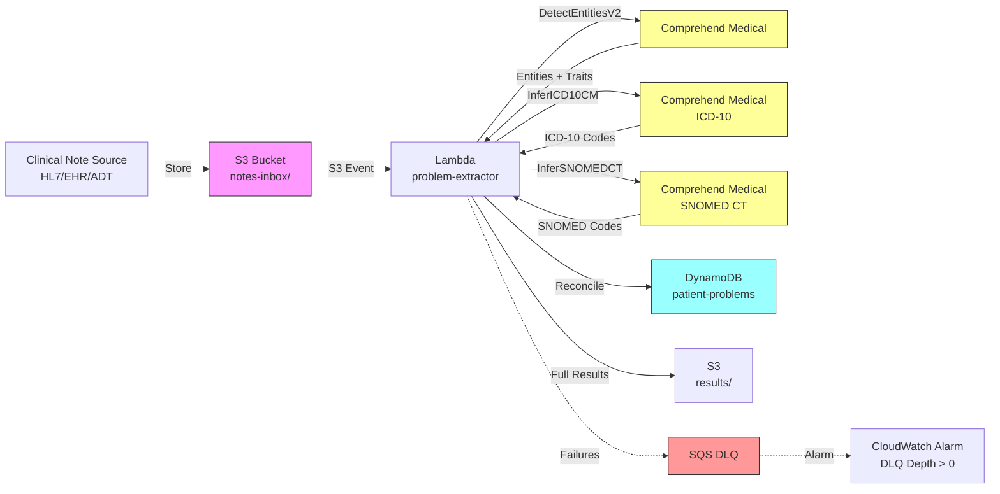

# Recipe 8.5 Architecture and Implementation: Problem List Extraction

*Companion to [Recipe 8.5: Problem List Extraction](chapter08.05-problem-list-extraction). This page covers the AWS architecture, services, prerequisites, and pseudocode. For the problem framing and the conceptual approach, start with the main recipe.*

---

## The AWS Implementation

### Why These Services

**Amazon Comprehend Medical for clinical NER and assertion detection.** Comprehend Medical's `DetectEntitiesV2` API extracts medical conditions (category: MEDICAL_CONDITION) with associated traits including NEGATION, SYMPTOM, SIGN, and DIAGNOSIS differentiation. It also returns assertion traits (NEGATION, HYPOTHETICAL) and attributes like ACUITY (chronic vs. acute). For condition-to-code mapping, the `InferICD10CM` and `InferSNOMEDCT` APIs take clinical text and return ranked terminology codes with confidence scores. Together, these three APIs handle extraction, assertion, and normalization as managed services.

**Amazon S3 for note storage and results.** Clinical notes arrive from HL7 feeds, EHR exports, or ADT messages. S3 provides encrypted staging for incoming notes, archival for extraction results, and a trigger mechanism (S3 event notifications) for automated processing.

**AWS Lambda for extraction orchestration.** Each note goes through a stateless pipeline: receive text, detect sections, call Comprehend Medical APIs, assemble structured output. Lambda's request-based scaling handles both real-time single-note processing and burst loads during batch operations. An SQS dead-letter queue (DLQ) catches invocation failures (throttled events, unhandled exceptions) so no note silently disappears. A CloudWatch alarm on `ApproximateNumberOfMessagesVisible` in the DLQ fires when depth exceeds zero, giving operations early warning of systemic extraction failures.

**Amazon DynamoDB for problem list storage.** Extracted problems need fast lookups by patient ID (for reconciliation views) and by problem code (for population-level queries). DynamoDB supports both with a composite key design: patient ID as partition key, problem code as sort key.

**AWS Step Functions for batch reconciliation.** When running extraction against a historical note corpus to identify problem list gaps across a patient panel, Step Functions coordinates the parallel processing, handles retries on throttling, and tracks completion status.

### Architecture Diagram



### Prerequisites

| Requirement | Details |
|-------------|---------|
| **AWS Services** | Amazon Comprehend Medical, Amazon S3, AWS Lambda, Amazon DynamoDB, Amazon SQS (DLQ), AWS Step Functions (for batch) |
| **IAM Permissions** | `comprehendmedical:DetectEntitiesV2`, `comprehendmedical:InferICD10CM`, `comprehendmedical:InferSNOMEDCT`, `s3:GetObject`, `s3:PutObject`, `dynamodb:PutItem`, `dynamodb:Query`, `dynamodb:UpdateItem` (used by downstream clinician review workflow to accept/reject recommendations) |
| **BAA** | AWS BAA signed (required: clinical notes contain PHI) |
| **Encryption** | S3: SSE-KMS; DynamoDB: encryption at rest (default); Lambda CloudWatch log groups: KMS encryption (logs may contain extracted clinical data); all API calls over TLS |
| **VPC** | Production: Lambda in VPC with VPC endpoints for S3, DynamoDB, and CloudWatch Logs. Comprehend Medical does not have a VPC endpoint; route through NAT Gateway (traffic is TLS-encrypted in transit). Evaluate whether your compliance posture permits NAT Gateway egress for PHI, or run Lambda outside VPC with resource-based policies on S3 and DynamoDB. |
| **CloudTrail** | Enabled: log all Comprehend Medical and S3 API calls for HIPAA audit trail |
| **Sample Data** | Synthetic clinical notes with problem mentions across sections. MIMIC-III (with DUA) provides realistic note structures. n2c2 datasets offer annotated clinical text for validation. Never use real patient notes in dev without proper IRB/DUA. |
| **Cost Estimate** | Comprehend Medical DetectEntitiesV2: ~$0.01 per 100-character unit (1 unit = 100 chars, minimum 3 units). InferICD10CM and InferSNOMEDCT: same per-unit pricing, called on shorter extracted spans. A typical 3000-character note: ~$0.30 for detection + $0.02-0.10 for normalization (depending on number of extracted problems). Total: ~$0.30-0.80 per note depending on length and problem count. |
| **Regional Availability** | Amazon Comprehend Medical is available in select regions (us-east-1, us-east-2, us-west-2, eu-west-1, eu-west-2, ap-southeast-2, ca-central-1 as of 2024). Verify availability in your target region before designing your deployment, especially for data residency requirements. |

### Ingredients

| AWS Service | Role |
|-------------|------|
| **Amazon Comprehend Medical** | NER extraction (DetectEntitiesV2), ICD-10 normalization (InferICD10CM), SNOMED normalization (InferSNOMEDCT) |
| **Amazon S3** | Stores incoming clinical notes and extraction results; encrypted with KMS |
| **AWS Lambda** | Orchestrates extraction pipeline: section detection, API calls, reconciliation logic |
| **Amazon DynamoDB** | Stores patient problem lists with history and provenance |
| **AWS Step Functions** | Coordinates batch processing for historical note backfills |
| **AWS KMS** | Manages encryption keys for S3 and DynamoDB |
| **Amazon CloudWatch** | Logs, metrics, alarms for extraction failures and API throttling |
| **Amazon SQS** | Dead-letter queue for failed Lambda invocations; enables reprocessing and alerting |

### Code

> **Reference implementations:** The following AWS sample repos demonstrate patterns used in this recipe:
>
> - [`amazon-comprehend-medical-fhir-integration`](https://github.com/aws-samples/amazon-comprehend-medical-fhir-integration): End-to-end pipeline extracting clinical entities from notes and mapping to FHIR resources
> - [`amazon-comprehend-medical-ICD10-mapping`](https://github.com/aws-samples/amazon-comprehend-medical-ICD10-mapping): ICD-10 inference from clinical text using Comprehend Medical

#### Walkthrough

**Step 1: Section detection.** Clinical notes have structure, even when they look like walls of text. Section headers ("ASSESSMENT:", "PAST MEDICAL HISTORY:", "FAMILY HISTORY:") provide critical context for assertion classification downstream. A problem mentioned under "Family History" should never end up on the patient's active problem list. This step identifies sections and tags them by category so later steps can use that context. Skip this step and you'll extract problems accurately but misclassify their assertion status, which is arguably worse than not extracting them at all.

```pseudocode
FUNCTION detect_sections(note_text):
    // Section header patterns found in common clinical note formats.
    // These categories determine how extracted problems are interpreted downstream.
    ACTIVE_SECTIONS   = ["assessment", "assessment and plan", "a/p", "active problems",
                         "problem list", "diagnoses", "impression", "current problems"]
    PMH_SECTIONS      = ["past medical history", "pmh", "medical history",
                         "past history", "prior diagnoses"]
    FAMILY_SECTIONS   = ["family history", "fh", "family hx"]
    RESOLVED_SECTIONS = ["resolved problems", "inactive problems", "past problems"]
    ALLERGY_SECTIONS  = ["allergies", "drug allergies", "adverse reactions"]

    sections = empty list
    current_section = { category: "UNKNOWN", text: "", start: 0 }

    FOR each line in note_text:
        // Check if this line is a section header.
        // Common patterns: "SECTION NAME:", "** Section Name **", all-caps lines.
        header = extract_header_if_present(line)

        IF header is not null:
            // Save the previous section and start a new one.
            IF current_section.text is not empty:
                append current_section to sections

            // Classify this header into a category for downstream context.
            category = classify_header(header, ACTIVE_SECTIONS, PMH_SECTIONS,
                                       FAMILY_SECTIONS, RESOLVED_SECTIONS, ALLERGY_SECTIONS)
            current_section = { category: category, text: "", start: current_offset }
        ELSE:
            current_section.text += line + newline

    // Don't forget the last section.
    IF current_section.text is not empty:
        append current_section to sections

    RETURN sections
```

**Step 2: Extract clinical problems.** Send each relevant section to the NER service for entity extraction. We're specifically looking for entities of category MEDICAL_CONDITION, which covers diagnoses, symptoms, signs, and disease mentions. The service returns each entity with its text span, confidence score, and traits (like NEGATION or SIGN vs. DIAGNOSIS). We filter to MEDICAL_CONDITION entities and carry forward the section context from Step 1 so we know where each problem was found. Skip this step and you have no raw material for the rest of the pipeline.

**Important limit:** Comprehend Medical's DetectEntitiesV2 accepts a maximum of 20,000 UTF-8 characters per request. Most note sections fall well under this, but discharge summaries and operative notes can exceed it. When a section is longer than 20,000 characters, chunk it at sentence boundaries and reassemble results with offset correction. Splitting mid-sentence risks breaking negation scope (the "no" in "no evidence of malignancy" might land in a different chunk than "malignancy"), so sentence-boundary chunking is not optional.

```pseudocode
FUNCTION extract_problems(sections):
    // Process each section through the NER service.
    // We only send sections that could contain relevant problem mentions.
    RELEVANT_CATEGORIES = ["ACTIVE", "PMH", "FAMILY", "RESOLVED", "UNKNOWN"]
    all_problems = empty list

    FOR each section in sections:
        IF section.category not in RELEVANT_CATEGORIES:
            CONTINUE  // skip allergy sections, medication sections, etc.

        // Call the managed NER service on this section's text.
        response = call ComprehendMedical.DetectEntitiesV2 with:
            Text = section.text

        // Filter to MEDICAL_CONDITION entities only.
        // Other entity types (MEDICATION, ANATOMY, TEST_TREATMENT_PROCEDURE)
        // are useful for other recipes but not our target here.
        FOR each entity in response.Entities:
            IF entity.Category == "MEDICAL_CONDITION":
                problem = {
                    text: entity.Text,
                    confidence: entity.Score,
                    begin_offset: entity.BeginOffset + section.start,
                    end_offset: entity.EndOffset + section.start,
                    section: section.category,
                    traits: entity.Traits,      // NEGATION, SIGN, DIAGNOSIS, SYMPTOM
                    attributes: entity.Attributes   // ACUITY, DIRECTION, SYSTEM_ORGAN_SITE
                }
                append problem to all_problems

    RETURN all_problems
```

**Step 3: Classify assertion status.** This is the critical gate. Each extracted problem gets classified as active, negated, historical, family history, hypothetical, or resolved. We combine two signals: (a) the traits returned by the NER service (NEGATION trait, for example) and (b) the section context from Step 1 (a problem found in "Family History" section is family history regardless of what the NER traits say). The section context often overrides or supplements the sentence-level traits. Skip this step and your problem list fills up with negated conditions and family history items that don't belong there.

```pseudocode
FUNCTION classify_assertions(problems):
    // Combine NER-level traits with section-level context for final assertion.
    classified_problems = empty list

    FOR each problem in problems:
        // Start with the section-level context as the baseline assertion.
        assertion = determine_base_assertion(problem.section)
        // "ACTIVE" section -> PRESENT
        // "PMH" section -> HISTORICAL
        // "FAMILY" section -> FAMILY_HISTORY
        // "RESOLVED" section -> RESOLVED
        // "UNKNOWN" section -> PRESENT (default, will be refined by traits)

        // Now refine based on entity-level traits from the NER service.
        FOR each trait in problem.traits:
            IF trait.Name == "NEGATION" AND trait.Score >= 0.80:
                assertion = "NEGATED"
                // Negation overrides section context. "No diabetes" in the Assessment
                // section means the patient does NOT have diabetes.

            IF trait.Name == "HYPOTHETICAL" AND trait.Score >= 0.80:
                assertion = "HYPOTHETICAL"
                // "If she develops renal failure" is not an active problem.

        // Additional heuristic: check for temporal markers in surrounding text.
        // Words like "resolved," "s/p" (status post), "previous," "former" suggest
        // the problem is no longer active even if found in an active section.
        IF contains_resolution_markers(problem.text, surrounding_context):
            IF assertion == "PRESENT":
                assertion = "HISTORICAL"

        classified_problem = problem + { assertion: assertion }
        append classified_problem to classified_problems

    RETURN classified_problems
```

**Step 4: Normalize to standard codes.** Active and historical problems need terminology codes for downstream use: SNOMED CT for clinical problem list maintenance, ICD-10-CM for billing and quality reporting. We call the normalization APIs with the extracted problem text and get back ranked code candidates with confidence scores. The top candidate isn't always right (especially for abbreviations or partial mentions), so we return the top 3 and let downstream consumers apply their own threshold. Skip this step and you have free-text problems that can't be reconciled, deduplicated, or used for clinical decision support.

```pseudocode
FUNCTION normalize_problems(classified_problems):
    // Only normalize problems that might go on the problem list.
    // Negated and hypothetical problems don't need codes.
    NORMALIZE_ASSERTIONS = ["PRESENT", "HISTORICAL", "FAMILY_HISTORY"]
    normalized = empty list

    FOR each problem in classified_problems:
        IF problem.assertion not in NORMALIZE_ASSERTIONS:
            // Still include in output for completeness, just without codes.
            append problem + { icd10: null, snomed: null } to normalized
            CONTINUE

        // Call ICD-10 inference.
        icd10_response = call ComprehendMedical.InferICD10CM with:
            Text = problem.text

        // Call SNOMED CT inference.
        snomed_response = call ComprehendMedical.InferSNOMEDCT with:
            Text = problem.text

        // Take top 3 candidates from each, with scores.
        icd10_codes = top 3 concepts from icd10_response.Entities[0].ICD10CMConcepts
        snomed_codes = top 3 concepts from snomed_response.Entities[0].SNOMEDCTConcepts

        normalized_problem = problem + {
            icd10: icd10_codes,   // [{Code, Description, Score}, ...]
            snomed: snomed_codes   // [{Code, Description, Score}, ...]
        }
        append normalized_problem to normalized

    RETURN normalized
```

**Step 5: Reconcile against existing problem list.** This is where extraction becomes actionable. We compare the extracted active problems against the patient's current problem list in the database. The output is a reconciliation report: new problems to consider adding, existing problems that might be resolved, and existing problems that could use specificity updates. This is always a recommendation, never an automatic update, because problem list maintenance is a clinical act that requires physician review. Skip this step and you have a nice extraction pipeline that produces results nobody acts on.

```pseudocode
FUNCTION reconcile_problems(patient_id, extracted_problems, note_id):
    // Fetch the patient's current problem list from the database.
    current_list = query DynamoDB for patient_id where status == "ACTIVE"

    // Separate extracted problems by assertion for different reconciliation logic.
    active_extracted = filter extracted_problems where assertion == "PRESENT"
    resolved_signals = filter extracted_problems where assertion == "HISTORICAL"
                       OR contains_resolution_markers == true

    recommendations = empty list

    // 1. Find problems mentioned as active in notes but missing from the list.
    FOR each extracted in active_extracted:
        // Check all top-3 SNOMED candidates, not just top-1.
        // A condition might map to a code already on the list under a different
        // top-1 candidate. Checking only top-1 produces false ADD_CANDIDATE
        // recommendations for problems already present under a synonym code.
        // Ideally, also use SNOMED hierarchy traversal: if extracted code is a
        // child or parent of an existing code, treat as a match (or a specificity upgrade).
        extracted_codes = [c.Code for c in extracted.snomed]  // all top-3 candidates
        match_found = false

        FOR each code in extracted_codes:
            IF code in current_list codes:
                match_found = true
                BREAK
            // Optional: check SNOMED is-a hierarchy.
            // IF code is_child_of any current_list code OR any current_list code is_child_of code:
            //     match_found = true (handle as specificity upgrade instead)
            //     BREAK

        IF not match_found:
            // Potential gap: documented in note but not on problem list.
            append to recommendations: {
                type: "ADD_CANDIDATE",
                problem: extracted.text,
                snomed: extracted.snomed[0],
                icd10: extracted.icd10[0],
                confidence: extracted.confidence,
                source: note_id,
                rationale: "Mentioned as active in " + extracted.section + " section"
            }

    // 2. Find problems on the list that notes suggest are resolved.
    FOR each existing in current_list:
        IF existing.snomed_code appears in resolved_signals codes:
            append to recommendations: {
                type: "RESOLVE_CANDIDATE",
                problem: existing.problem_text,
                snomed: existing.snomed_code,
                confidence: resolved_signal.confidence,
                source: note_id,
                rationale: "Mentioned with resolution markers in recent note"
            }

    // 3. Find specificity upgrades (e.g., "diabetes" -> "type 2 diabetes with CKD").
    FOR each existing in current_list:
        FOR each extracted in active_extracted:
            IF extracted.snomed[0].Code is_child_of existing.snomed_code:
                // More specific code found in notes than what's on the list.
                append to recommendations: {
                    type: "SPECIFICITY_UPGRADE",
                    current: existing.problem_text,
                    suggested: extracted.text,
                    new_snomed: extracted.snomed[0],
                    new_icd10: extracted.icd10[0],
                    source: note_id
                }

    RETURN recommendations
```

**Step 6: Store results and generate reconciliation report.** Write the full extraction results to S3 for audit and reprocessing. Write reconciliation recommendations to DynamoDB where clinician review workflows can surface them. Every recommendation includes its source note, confidence score, and rationale so reviewers have enough context to accept or reject it without re-reading the entire note.

```pseudocode
FUNCTION store_results(patient_id, extracted_problems, recommendations, note_id):
    // Store full extraction results in S3 for audit trail and reprocessing.
    write to S3 key "results/{patient_id}/{note_id}.json":
        {
            patient_id: patient_id,
            note_id: note_id,
            extraction_timestamp: current UTC timestamp (ISO 8601),
            problems_extracted: extracted_problems,   // all problems with assertions and codes
            recommendations: recommendations       // reconciliation suggestions
        }

    // Store actionable recommendations in DynamoDB for clinician review.
    FOR each rec in recommendations:
        // Deterministic recommendation_id enables idempotent reprocessing.
        // If the same note is processed twice, it produces the same IDs and
        // the conditional write prevents duplicate recommendations.
        recommendation_id = hash(note_id + rec.snomed.Code + rec.type)

        write to DynamoDB table "problem-list-recommendations"
            with condition: attribute_not_exists(recommendation_id)
            // If the item already exists, the conditional write fails silently.
            // This prevents duplicate recommendations on reprocessing.
            patient_id       = patient_id              // partition key
            recommendation_id = recommendation_id      // sort key (deterministic)
            type             = rec.type                // ADD_CANDIDATE, RESOLVE_CANDIDATE, etc.
            problem_text     = rec.problem
            snomed_code      = rec.snomed.Code
            icd10_code       = rec.icd10.Code (if present)
            confidence       = rec.confidence
            source_note      = note_id
            rationale        = rec.rationale
            status           = "PENDING_REVIEW"        // awaiting clinician action
            created_at       = current UTC timestamp
```

> **Curious how this looks in Python?** The pseudocode above covers the concepts. If you'd like to see sample Python code that demonstrates these patterns using boto3, check out the [Python Example](chapter08.05-python-example). It walks through each step with inline comments and notes on what you'd need to change for a real deployment.

### Expected Results

**Sample output for a progress note mentioning several conditions:**

```json
{
  "patient_id": "PAT-2847103",
  "note_id": "NOTE-20260301-0482",
  "extraction_timestamp": "2026-03-01T14:22:08Z",
  "problems_extracted": [
    {
      "text": "type 2 diabetes",
      "assertion": "PRESENT",
      "section": "ACTIVE",
      "confidence": 0.97,
      "snomed": [{"Code": "44054006", "Description": "Type 2 diabetes mellitus", "Score": 0.95}],
      "icd10": [{"Code": "E11.9", "Description": "Type 2 diabetes mellitus without complications", "Score": 0.91}]
    },
    {
      "text": "chronic kidney disease stage 3",
      "assertion": "PRESENT",
      "section": "ACTIVE",
      "confidence": 0.94,
      "snomed": [{"Code": "433144002", "Description": "Chronic kidney disease stage 3", "Score": 0.93}],
      "icd10": [{"Code": "N18.3", "Description": "Chronic kidney disease, stage 3 (moderate)", "Score": 0.90}]
    },
    {
      "text": "pneumonia",
      "assertion": "HISTORICAL",
      "section": "PMH",
      "confidence": 0.89,
      "snomed": [{"Code": "233604007", "Description": "Pneumonia", "Score": 0.88}],
      "icd10": [{"Code": "J18.9", "Description": "Pneumonia, unspecified organism", "Score": 0.85}]
    },
    {
      "text": "chest pain",
      "assertion": "NEGATED",
      "section": "ACTIVE",
      "confidence": 0.92,
      "snomed": null,
      "icd10": null
    }
  ],
  "recommendations": [
    {
      "type": "ADD_CANDIDATE",
      "problem": "chronic kidney disease stage 3",
      "snomed": {"Code": "433144002", "Description": "Chronic kidney disease stage 3"},
      "icd10": {"Code": "N18.3", "Description": "Chronic kidney disease, stage 3 (moderate)"},
      "confidence": 0.94,
      "source": "NOTE-20260301-0482",
      "rationale": "Mentioned as active in ACTIVE section but not on current problem list"
    }
  ]
}
```

**Performance benchmarks:**

| Metric | Typical Value |
|--------|---------------|
| End-to-end latency | 2-5 seconds per note |
| Problem extraction F1 | 85-92% (varies by note type and specialty) |
| Assertion classification accuracy | 88-94% for negation; 80-88% for temporal |
| SNOMED normalization accuracy (top-1) | 75-85% (top-3 reaches 90%+) |
| ICD-10 normalization accuracy (top-1) | 70-82% (top-3 reaches 88%+) |
| Cost per note | ~$0.30-0.80 depending on note length and problem count |
| Throughput | ~30 notes/second (Lambda concurrency limited) |

**Where it struggles:**

- Abbreviations that are ambiguous across specialties ("MS" = multiple sclerosis? morphine sulfate? mitral stenosis?)
- Implicit problems mentioned through symptom clusters rather than named diagnoses
- Distinguishing "chronic stable" conditions from "active and worsening" conditions (both are "present" but have different clinical urgency)
- Very long notes where a problem is mentioned once in passing among thousands of words
- Specialty-specific shorthand (orthopedic notes are particularly terse)
- Combination/compound conditions: "diabetes with nephropathy and retinopathy" is one problem or three?

---

## Why This Isn't Production-Ready

This pipeline extracts problems and produces recommendations. But several gaps sit between "works on a single note" and "deployed in a health system with clinicians relying on it":

**No clinician review UI.** Recommendations land in DynamoDB with status PENDING_REVIEW, but there's no interface for clinicians to accept, reject, or modify them. Without a review workflow integrated into the EHR, recommendations pile up unseen. Building this UI is often harder than building the extraction pipeline itself.

**No feedback loop.** When clinicians reject recommendations (or accept them with modifications), that signal should feed back into the system to improve assertion accuracy and reduce false positives over time. Without feedback, the same bad recommendations keep appearing. This requires both a data collection mechanism and a retraining or threshold-adjustment pipeline.

**No multi-note aggregation.** This pipeline processes one note at a time. A problem mentioned in 5 of the last 8 notes is much stronger evidence than a single mention. Longitudinal aggregation across notes (with recency weighting) dramatically improves precision, especially for distinguishing truly active problems from incidental mentions.

**No handling of conflicting assertions across notes.** One note says "diabetes, well-controlled." Another says "denies diabetes." When assertions conflict across notes, which wins? Production systems need conflict resolution logic (typically: most recent clinical note from the treating provider wins, with confidence weighting).

**No SNOMED hierarchy-aware deduplication.** The reconciliation logic checks code equality, but "Type 2 diabetes mellitus" (44054006) and "Type 2 diabetes mellitus with diabetic chronic kidney disease" (721000119107) are related concepts in the SNOMED hierarchy. Without hierarchy traversal, the system might recommend adding a child concept when the parent is already on the list (or vice versa). A production system needs access to SNOMED relationship tables to detect is-a relationships between codes.

**No DLQ reprocessing workflow.** The SQS DLQ catches failed invocations, but there's no automated mechanism to inspect failures, fix the root cause, and replay messages. In practice, you need a separate Lambda or Step Functions workflow that triages DLQ messages by error type and either retries (for transient failures) or routes to human review (for malformed notes).

---

## Variations and Extensions

**Multi-note longitudinal extraction.** Instead of processing one note at a time, aggregate problem mentions across all recent notes for a patient and use frequency/recency signals to strengthen confidence. A problem mentioned in 5 of the last 8 notes is much more likely to be truly active than one mentioned once. This approach also helps detect resolved conditions: if "pneumonia" was mentioned in notes 6 months ago but absent from all recent documentation, it's likely resolved.

**Specialty-adapted assertion models.** Different specialties have different documentation patterns. An orthopedic note uses abbreviations and shorthand that an internal medicine model hasn't seen. Train or fine-tune separate assertion classifiers per specialty, using the note's authoring provider specialty as a routing signal. This adds complexity but can improve assertion accuracy by 5-10% for high-volume specialty note types.

**FHIR Condition resource integration.** Map extracted problems directly to FHIR Condition resources and push them to a FHIR server for interoperability. This enables problem list synchronization across systems that speak FHIR (which is increasingly most of them under ONC Cures Act requirements). The FHIR Condition resource has fields for clinical status (active, recurrence, relapse, inactive, remission, resolved) that map cleanly to the assertion categories in this pipeline.

---

## Additional Resources

**AWS Documentation:**
- [Amazon Comprehend Medical DetectEntitiesV2 API Reference](https://docs.aws.amazon.com/comprehend-medical/latest/api/API_DetectEntitiesV2.html)
- [Amazon Comprehend Medical InferICD10CM API Reference](https://docs.aws.amazon.com/comprehend-medical/latest/api/API_InferICD10CM.html)
- [Amazon Comprehend Medical InferSNOMEDCT API Reference](https://docs.aws.amazon.com/comprehend-medical/latest/api/API_InferSNOMEDCT.html)
- [Amazon Comprehend Medical Pricing](https://aws.amazon.com/comprehend/medical/pricing/)
- [AWS HIPAA Eligible Services](https://aws.amazon.com/compliance/hipaa-eligible-services-reference/)
- [Architecting for HIPAA on AWS (Whitepaper)](https://docs.aws.amazon.com/whitepapers/latest/architecting-hipaa-security-and-compliance-on-aws/welcome.html)

**AWS Sample Repos:**
- [`amazon-comprehend-medical-fhir-integration`](https://github.com/aws-samples/amazon-comprehend-medical-fhir-integration): Pipeline extracting clinical entities and mapping to FHIR resources including Condition
- [`amazon-comprehend-medical-ICD10-mapping`](https://github.com/aws-samples/amazon-comprehend-medical-ICD10-mapping): ICD-10 code inference from clinical text

**AWS Solutions and Blogs:**
- [Extracting Medical Information from Clinical Text with Amazon Comprehend Medical](https://aws.amazon.com/blogs/machine-learning/extracting-medical-information-from-clinical-text-using-amazon-comprehend-medical/): Overview of entity extraction patterns for clinical documentation
- [Building a Medical Concept Normalization Pipeline with Amazon Comprehend Medical](https://aws.amazon.com/blogs/machine-learning/building-a-medical-language-processing-pipeline-using-amazon-comprehend-medical/): End-to-end architecture for clinical NLP pipelines

---

## Estimated Implementation Time

| Phase | Duration |
|-------|----------|
| **Basic** (single-note extraction, no reconciliation) | 2-3 weeks |
| **Production-ready** (reconciliation, review workflow, monitoring) | 6-10 weeks |
| **With variations** (multi-note longitudinal, specialty-adapted, FHIR integration) | 12-16 weeks |

---

---

*← [Main Recipe 8.5](chapter08.05-problem-list-extraction) · [Python Example](chapter08.05-python-example) · [Chapter Preface](chapter08-preface)*
