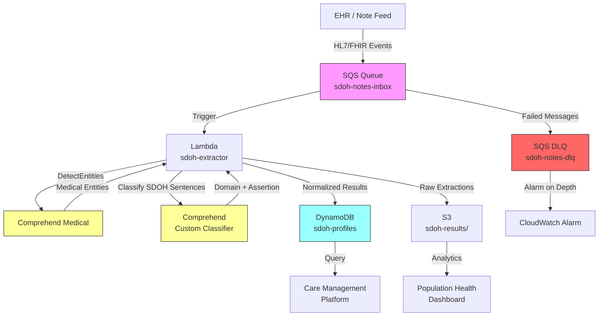

# Recipe 8.6 Architecture and Implementation: Social Determinants of Health (SDOH) Extraction

*Companion to [Recipe 8.6: Social Determinants of Health (SDOH) Extraction](chapter08.06-sdoh-extraction). This page covers the AWS architecture, services, prerequisites, and pseudocode. For the problem framing and the conceptual approach, start with the main recipe.*

---

## The AWS Implementation

### Why These Services

**Amazon Comprehend Medical for entity extraction.** Comprehend Medical is AWS's managed clinical NLP service. While its primary strength is medical entity extraction (medications, conditions, procedures), it also extracts "Protected Health Information" attributes and can identify social-context phrases when combined with custom classification. More importantly, it handles the foundational NLP work (tokenization, sentence detection, negation, section awareness) that you'd otherwise build from scratch. For SDOH specifically, you'll use Comprehend Medical's entity extraction as a first pass, then layer custom classification on top.

**Amazon Comprehend (custom classification) for SDOH categorization.** The non-medical Comprehend service supports custom text classification. Train a multi-label classifier on annotated SDOH sentences to classify extracted mentions into domains (housing, food, transportation, etc.) and assertion statuses (active, resolved, risk). Custom classifiers in Comprehend handle the training infrastructure, hyperparameter tuning, and endpoint management.

**AWS Lambda for orchestration.** Each note triggers a stateless extraction pipeline: retrieve the note text, call Comprehend Medical, post-process entities, call the custom classifier, normalize codes, and store results. Lambda's event-driven model fits the per-note processing pattern.

**Amazon S3 for note storage and training data.** Raw notes, annotated training corpora, and extraction results all live in S3. The training data bucket feeds Comprehend custom classifier training jobs. The results bucket feeds downstream analytics.

**Amazon DynamoDB for patient-level SDOH profiles.** The structured output (patient X has active food insecurity as of date Y, source note Z) goes into DynamoDB for fast point lookups by patient ID. Care management systems query this table to populate patient context cards.

**Amazon SQS for decoupling ingestion from processing.** Notes arrive at unpredictable rates (batch dumps at night, real-time feeds during clinic hours). SQS buffers the incoming note events and feeds Lambda at a controlled rate, preventing throttling on downstream services.

### Architecture Diagram



Configure the main SQS queue (`sdoh-notes-inbox`) with a dead letter queue (`sdoh-notes-dlq`) and a redrive policy (e.g., maxReceiveCount of 3). Attach a CloudWatch alarm on the DLQ's `ApproximateNumberOfMessagesVisible` metric. If the DLQ depth rises above zero, something is failing silently. Notes stuck in the DLQ represent patients whose SDOH needs aren't being captured, so treat DLQ depth as a high-priority operational alert.

### Prerequisites

| Requirement | Details |
|-------------|---------|
| **AWS Services** | Amazon Comprehend Medical, Amazon Comprehend (Custom Classification), AWS Lambda, Amazon S3, Amazon DynamoDB, Amazon SQS |
| **IAM Permissions** | `comprehendmedical:DetectEntitiesV2`, `comprehend:ClassifyDocument`, `s3:GetObject`, `s3:PutObject`, `dynamodb:PutItem`, `dynamodb:UpdateItem`, `dynamodb:GetItem`, `sqs:ReceiveMessage`, `sqs:DeleteMessage` |
| **BAA** | AWS BAA signed (clinical notes contain PHI) |
| **Encryption** | S3: SSE-KMS; DynamoDB: encryption at rest (default); SQS: SSE-KMS; Lambda environment variables: KMS encrypted; all API calls over TLS |
| **VPC** | Production: Lambda in VPC with VPC endpoints for S3, DynamoDB, SQS, and CloudWatch Logs. Comprehend Medical and Comprehend (custom) require NAT Gateway (no VPC endpoints available). Note text is encrypted in transit via TLS 1.2+. Organizations with strict no-internet-egress requirements should evaluate whether Lambda outside VPC (with resource policies) meets their compliance posture. |
| **CloudTrail** | Enabled: log all Comprehend Medical, Comprehend, and S3 API calls for HIPAA audit trail |
| **DynamoDB PITR** | Enable Point-in-Time Recovery for the SDOH profiles table |
| **DynamoDB GSI** | Population-level queries ("all patients with active food insecurity in my panel") require a Global Secondary Index. Use `domain#assertion` as the partition key and `note_date` as the sort key. This enables queries like "all active housing_instability findings in the last 90 days" without scanning the entire table. Without this GSI, population health dashboards must rely on the S3-based analytics path or full table scans. |
| **DynamoDB Access Control** | Restrict `sdoh-profiles` table read access to care management roles only. SDOH data is sensitive even within the organization (not every clinician needs to see a patient's housing or financial situation). Consider storing only metadata (domain, assertion, codes, note_id) in the DynamoDB item and omitting the `source_text` field. Authorized reviewers who need the original sentence can look it up via `note_id` in the source system. This minimizes PHI exposure in the fast-lookup layer while preserving traceability. |
| **Training Data** | Annotated clinical notes with SDOH labels. Minimum 1,000 labeled sentences across categories for custom classifier training. Use de-identified data (MIMIC, i2b2/n2c2 SDOH shared task datasets) for initial model development. Never use real PHI in training without IRB and data governance approval. |
| **Cost Estimate** | Comprehend Medical DetectEntitiesV2: $0.01 per 100 characters (a typical note is 3,000-8,000 characters, so $0.30-$0.80/note). Comprehend Custom Classification: $0.0005 per unit. At scale, batch inference via Comprehend's async jobs reduces cost significantly. Budget $0.02-$0.08 per note all-in depending on note length. |

### Ingredients

| AWS Service | Role |
|------------|------|
| **Amazon Comprehend Medical** | Extracts medical entities, identifies negation/assertion context, provides foundational NLP |
| **Amazon Comprehend (Custom)** | Classifies extracted sentences into SDOH domains and assertion statuses |
| **AWS Lambda** | Orchestrates per-note extraction pipeline |
| **Amazon S3** | Stores raw notes, training data, and batch extraction results |
| **Amazon DynamoDB** | Stores patient-level structured SDOH profiles for real-time queries |
| **Amazon SQS** | Buffers note ingestion events, decouples EHR feed from processing |
| **AWS KMS** | Manages encryption keys for all data stores |
| **Amazon CloudWatch** | Logs, metrics, alarms for extraction failures, latency, and throughput |

### Pseudocode Walkthrough

> **Reference implementations:** The following AWS sample repos demonstrate patterns used in this recipe:
>
> - [`amazon-comprehend-medical-fhir-integration`](https://github.com/aws-samples/amazon-comprehend-medical-fhir-integration): Healthcare NLP pipeline integrating Comprehend Medical with FHIR for structured clinical data extraction (archived July 2024; still useful as a reference pattern)
> - [`amazon-comprehend-examples`](https://github.com/aws-samples/amazon-comprehend-examples): Custom classification and entity recognition examples for Amazon Comprehend

**Step 1: Note ingestion and relevance filtering.** Clinical notes arrive from the EHR feed. Before running full NLP extraction (which costs money per character), apply a quick relevance filter. Most progress notes contain zero SDOH information. A simple keyword scan (housing, homeless, food, hungry, unemployed, transportation, etc.) against the note text identifies notes worth processing in full. This isn't perfect (it'll miss implicit mentions), but it reduces processing volume by 70-80% without significantly impacting recall for explicit mentions. The keyword list should be maintained as a living configuration. Skip this step and you'll run expensive NLP on thousands of notes that contain nothing relevant, burning budget on notes about medication titrations and lab follow-ups.

```pseudocode
// SDOH relevance keywords: terms that suggest the note may contain social determinant information.
// This is a high-recall filter, not a precision tool. False positives are cheap (we just run NLP on a note
// that turns out to have nothing). False negatives are expensive (we miss a real SDOH mention).
SDOH_KEYWORDS = [
    "housing", "homeless", "unhoused", "shelter", "evict",
    "food", "hungry", "meal", "nutrition", "food bank", "SNAP",
    "transportation", "ride", "bus", "car",
    "employ", "job", "unemploy", "income", "afford", "financial",
    "isolat", "alone", "support", "caregiver",
    "utility", "electric", "heat", "water",
    "safe", "violence", "abuse",
    "education", "literacy", "language barrier",
    "incarcerat", "legal", "immigration"
]

FUNCTION should_process_note(note_text):
    // Convert to lowercase for case-insensitive matching.
    lower_text = lowercase(note_text)

    // Check if any keyword appears anywhere in the note.
    // This is intentionally permissive: we'd rather process an irrelevant note
    // than miss one that mentions "patient lost housing last week."
    FOR each keyword in SDOH_KEYWORDS:
        IF keyword appears in lower_text:
            RETURN true  // found a signal, process this note

    RETURN false  // no SDOH-related terms detected, skip full extraction
```

**Step 2: Section detection and sentence segmentation.** Clinical notes have implicit structure. Social history sections, assessment/plan sections, and social work assessments have the highest SDOH density. Identifying sections helps with downstream assertion classification (a mention in "family history" means something different than one in "social history"). Segment the note into sentences because SDOH classification works at the sentence level. Each sentence becomes a candidate for SDOH labeling. Skip this step and you lose the contextual cues that distinguish "patient has housing" (social history, positive assertion) from "patient's mother was homeless" (family history, different patient).

```pseudocode
// Common section headers in clinical notes. These aren't standardized across EHRs,
// so the pattern list needs to be generous. Case-insensitive matching.
SECTION_PATTERNS = {
    "social_history": ["social history", "social hx", "shx", "psychosocial"],
    "assessment_plan": ["assessment", "plan", "a/p", "assessment and plan"],
    "family_history": ["family history", "family hx", "fhx"],
    "discharge_summary": ["discharge", "disposition"],
    "nursing_intake": ["intake", "admission screening", "social screening"]
}

// Priority sections: process these first and weight their results higher.
// SDOH mentions in social history or social work notes are more likely to represent
// actual patient needs than mentions in family history or review of systems.
HIGH_PRIORITY_SECTIONS = ["social_history", "assessment_plan", "nursing_intake", "discharge_summary"]

FUNCTION segment_note(note_text):
    // Split the note into sections based on header patterns.
    sections = detect_sections(note_text, SECTION_PATTERNS)

    // For each section, split into individual sentences.
    // Each sentence will be independently evaluated for SDOH content.
    segmented = empty list
    FOR each section in sections:
        sentences = split_into_sentences(section.text)
        FOR each sentence in sentences:
            append to segmented: {
                text: sentence,
                section_type: section.type,        // which section this came from
                is_priority: section.type in HIGH_PRIORITY_SECTIONS,
                position: character offset in original note  // for traceability
            }

    RETURN segmented
```

**Step 3: Entity extraction with Comprehend Medical.** Pass the note (or priority sections) through Amazon Comprehend Medical's DetectEntitiesV2 API. This provides medical entity extraction with negation detection and attribute linkage. While Comprehend Medical doesn't have a dedicated "SDOH" entity category, it extracts relevant context: mentions of medical conditions (which may co-occur with social factors), negation cues (which help with assertion classification), and protected health information attributes. The real value here is the foundational NLP: sentence boundaries, negation scope, and entity span detection that you'd otherwise build manually. The SDOH-specific classification happens in the next step. Note: DetectEntitiesV2 accepts up to 20,000 characters per request. If a section exceeds this limit (common in lengthy social work assessments), split it at sentence boundaries with overlap to ensure no SDOH mention spans a chunk boundary.

```pseudocode
FUNCTION extract_medical_context(note_text):
    // Call Comprehend Medical to get the foundational NLP layer.
    // This gives us entity spans, negation detection, and attribute linkage.
    response = call ComprehendMedical.DetectEntitiesV2 with:
        Text = note_text   // full note text (Comprehend Medical handles up to 20,000 characters)

    // Pull out entities and their traits (negation, assertion modifiers).
    entities = response.Entities

    // Build a negation map: which character spans are within a negation scope?
    // "Patient denies food insecurity" should not be flagged as active food insecurity.
    negation_spans = empty list
    FOR each entity in entities:
        FOR each trait in entity.Traits:
            IF trait.Name == "NEGATION":
                append to negation_spans: {
                    begin: entity.BeginOffset,
                    end: entity.EndOffset
                }

    RETURN {
        entities: entities,        // all detected medical entities
        negation_spans: negation_spans   // spans that are negated (for assertion step)
    }
```

**Step 4: SDOH sentence classification.** This is the core extraction step. For each sentence identified in Step 2, determine whether it contains SDOH information, and if so, classify it into a domain and assertion status. Use the Amazon Comprehend custom classifier trained on SDOH-annotated sentences. The classifier outputs a domain label (housing, food, transportation, financial, social_isolation, safety, education, utility, none) and an assertion label (active_need, resolved, at_risk, resource_connected). Sentences classified as "none" are discarded. Cross-reference with the negation spans from Step 3: if a sentence's SDOH mention falls within a negation scope, override the assertion to "absent." Skip this step and you have raw text with no structured meaning.

```pseudocode
// SDOH domain categories aligned with the Gravity Project taxonomy.
SDOH_DOMAINS = [
    "housing_instability",
    "food_insecurity",
    "transportation_barrier",
    "financial_strain",
    "social_isolation",
    "interpersonal_safety",
    "education_literacy",
    "utility_insecurity"
]

// Assertion statuses that determine how downstream systems should act.
ASSERTION_STATUSES = ["active_need", "resolved", "at_risk", "resource_connected", "absent"]

// Confidence threshold: only accept classifications above this score.
// SDOH extraction errors are costly (false positives trigger unnecessary outreach,
// false negatives miss real needs). Tune based on your tolerance.
CONFIDENCE_THRESHOLD = 0.75

FUNCTION classify_sdoh_sentences(segmented_sentences, negation_spans):
    sdoh_findings = empty list

    FOR each sentence in segmented_sentences:
        // Call the Comprehend custom classifier endpoint.
        // The classifier was trained on labeled SDOH sentences and returns
        // probability scores for each domain and assertion category.
        classification = call Comprehend.ClassifyDocument with:
            Text         = sentence.text
            EndpointArn  = SDOH_CLASSIFIER_ENDPOINT

        // The response includes classes sorted by confidence score.
        top_domain = classification.Classes[0]  // highest-scoring domain

        // Skip sentences classified as "none" (no SDOH content).
        IF top_domain.Name == "none":
            CONTINUE

        // Check confidence against threshold.
        IF top_domain.Score < CONFIDENCE_THRESHOLD:
            CONTINUE  // not confident enough to surface this

        // Determine assertion status.
        // First check: does this sentence overlap with a negation span from Step 3?
        is_negated = check_negation_overlap(sentence.position, negation_spans)

        IF is_negated:
            assertion = "absent"
        ELSE:
            // Use the classifier's assertion output (trained as a secondary label).
            assertion = determine_assertion(sentence.text, classification)

        append to sdoh_findings: {
            text: sentence.text,
            domain: top_domain.Name,
            domain_score: top_domain.Score,
            assertion: assertion,
            section: sentence.section_type,
            is_priority: sentence.is_priority,
            source_offset: sentence.position
        }

    RETURN sdoh_findings
```

**Step 5: Code normalization.** Map each SDOH finding to standard terminology codes for interoperability. The primary targets are ICD-10-CM Z-codes (for billing and quality reporting) and LOINC panel codes (for structured SDOH screening results). This normalization enables your extraction results to flow into EHR structured fields, quality dashboards, and population health platforms without custom integration per consumer. The mapping table is based on the Gravity Project's value sets, which define the crosswalk between SDOH domains and standard codes. Skip this step and your extractions remain free-text labels that no downstream system can consume without custom parsing.

```json
{
    "housing_instability": {
        "icd10": ["Z59.0", "Z59.1", "Z59.8"],
        "loinc": ["71802-3"],
        "snomed": ["32911000"],
        "display": "Problems related to housing and economic circumstances"
    },
    "food_insecurity": {
        "icd10": ["Z59.4", "Z59.48"],
        "loinc": ["88122-7"],
        "snomed": ["733423003"],
        "display": "Lack of adequate food and safe drinking water"
    },
    "transportation_barrier": {
        "icd10": ["Z59.82"],
        "loinc": ["93031-3"],
        "snomed": ["160695008"],
        "display": "Transportation insecurity"
    },
    "financial_strain": {
        "icd10": ["Z59.5", "Z59.6", "Z59.7", "Z56.0"],
        "loinc": ["76513-1"],
        "snomed": ["454061000124102"],
        "display": "Financial strain and employment problems"
    },
    "social_isolation": {
        "icd10": ["Z60.2", "Z60.4"],
        "loinc": ["76506-5"],
        "snomed": ["422587007"],
        "display": "Social isolation and inadequate social support"
    },
    "interpersonal_safety": {
        "icd10": ["Z63.0", "T74", "T76"],
        "loinc": ["76501-6"],
        "snomed": ["706893006"],
        "display": "Interpersonal violence and safety concerns"
    },
    "education_literacy": {
        "icd10": ["Z55.0", "Z55.9"],
        "loinc": ["82589-3"],
        "snomed": ["105421008"],
        "display": "Problems related to education and literacy"
    },
    "utility_insecurity": {
        "icd10": ["Z59.81"],
        "loinc": ["93033-9"],
        "snomed": ["None"],
        "display": "Utility insecurity"
    }
}
```

```pseudocode
FUNCTION normalize_to_codes(sdoh_findings, code_map):
    normalized = empty list

    FOR each finding in sdoh_findings:
        domain = finding.domain

        // Look up the standard codes for this domain.
        IF domain in code_map:
            codes = code_map[domain]
            append to normalized: {
                text: finding.text,
                domain: finding.domain,
                assertion: finding.assertion,
                confidence: finding.domain_score,
                section: finding.section,
                icd10_codes: codes.icd10,    // for billing and quality reporting
                loinc_codes: codes.loinc,    // for structured screening results
                snomed_codes: codes.snomed,  // for clinical interoperability
                display: codes.display   // human-readable label
            }

    RETURN normalized
```

**Step 6: Store patient-level SDOH profile.** Write the normalized findings to the patient's SDOH profile in DynamoDB. The profile is a living document: new extractions add to it, resolved needs get updated, and the history is preserved for longitudinal analysis. Each finding includes provenance (which note, which sentence, which date) so care managers can trace back to the source. The profile supports queries like "show me all patients with active food insecurity in my panel" and "what SDOH needs were identified for this patient in the last 6 months?" Skip this step and extractions are ephemeral, useful for one-time reporting but not for ongoing care coordination.

```pseudocode
FUNCTION store_sdoh_profile(patient_id, note_id, note_date, findings):
    FOR each finding in findings:
        // Write each finding as an item in the SDOH profile table.
        // Partition key: patient_id. Sort key: domain + note_date (for history).
        write to DynamoDB table "sdoh-profiles":
            patient_id    = patient_id
            sort_key      = finding.domain + "#" + note_date   // enables range queries by domain
            domain        = finding.domain
            assertion     = finding.assertion
            confidence    = finding.confidence
            source_text   = finding.text          // the original sentence (for reviewer context)
            source_note   = note_id               // link back to the full note
            note_date     = note_date             // when the note was written
            extraction_ts = current UTC timestamp  // when extraction happened
            icd10_codes   = finding.icd10_codes
            loinc_codes   = finding.loinc_codes
            display       = finding.display
            reviewed      = false                  // flag for human validation workflow

    // Also update a "current status" summary record for the patient.
    // This is the record that care management platforms query for the patient's
    // active SDOH needs at a glance.
    update_current_status(patient_id, findings)
```

> **Curious how this looks in Python?** The pseudocode above covers the concepts. If you'd like to see sample Python code that demonstrates these patterns using boto3, check out the [Python Example](chapter08.06-python-example). It walks through each step with inline comments and notes on what you'd need to change for a real deployment.

### Expected Results

**Sample output for a social work assessment note:**

```json
{
    "patient_id": "PAT-2026-00847",
    "note_id": "NOTE-SW-20260215-003",
    "note_date": "2026-02-15",
    "extraction_timestamp": "2026-02-15T18:44:22Z",
    "findings": [
        {
            "domain": "food_insecurity",
            "assertion": "active_need",
            "confidence": 0.92,
            "source_text": "Patient reports skipping meals 3-4 times per week due to cost",
            "icd10_codes": ["Z59.4"],
            "loinc_codes": ["88122-7"],
            "display": "Lack of adequate food and safe drinking water"
        },
        {
            "domain": "housing_instability",
            "assertion": "at_risk",
            "confidence": 0.84,
            "source_text": "Lease expires next month and patient has not been able to find affordable options",
            "icd10_codes": ["Z59.8"],
            "loinc_codes": ["71802-3"],
            "display": "Problems related to housing and economic circumstances"
        },
        {
            "domain": "social_isolation",
            "assertion": "active_need",
            "confidence": 0.78,
            "source_text": "Lives alone, no family in the area, reports feeling isolated since spouse passed",
            "icd10_codes": ["Z60.2"],
            "loinc_codes": ["76506-5"],
            "display": "Social isolation and inadequate social support"
        }
    ],
    "notes_processed": 1,
    "sentences_evaluated": 47,
    "sdoh_sentences_found": 5,
    "below_threshold": 2
}
```

**Performance benchmarks:**

| Metric | Typical Value |
|--------|---------------|
| End-to-end latency per note | 3-8 seconds (depending on note length) |
| Precision (explicit mentions) | 82-90% |
| Recall (explicit mentions) | 75-85% |
| Precision (implicit mentions) | 55-70% |
| Recall (implicit mentions) | 40-55% |
| F1 score (overall, explicit + implicit) | 70-82% |
| Cost per note | $0.02-$0.08 (varies with note length) |
| Throughput | ~20 notes/second (Lambda concurrency limited) |
| Notes with SDOH findings | 8-15% (varies by care setting) |

**Where it struggles:**

- Implicit mentions ("missed three appointments" without explicitly naming transportation as the reason)
- Notes from specialties that rarely document social context (radiology, pathology)
- Distinguishing patient needs from caregiver/family member needs
- Temporal reasoning on long notes with both historical and current social information
- Documentation in languages other than English (requires multilingual models or translation preprocessing)
- Very short notes with minimal context (one-liner social history: "Social: lives alone")

---

### Why This Isn't Production-Ready

The pseudocode above gets you extraction results. These gaps will bite you in production.

**Custom classifier training is the project.** The pseudocode assumes a trained Comprehend custom classifier endpoint exists. Training that classifier requires annotated data: at minimum 1,000 labeled sentences across SDOH domains, ideally 3,000+. Public datasets (MIMIC, i2b2/n2c2 SDOH shared task corpora) get you started, but your local documentation patterns differ from academic medical center notes. Plan a local annotation round with clinical social workers and care managers. Expect two to three annotation iterations before precision crosses 80%.

**Assertion classification needs real depth.** The rule-based `determine_assertion` heuristic (keyword matching for "resolved," "at risk," etc.) is fragile. Production systems need a second classifier or a sequence-labeling model trained specifically on assertion status. Temporal reasoning is the hard part: "was homeless last year but now in stable housing" has both an active resolved assertion and a historical active one. The keyword approach catches neither reliably.

**Dead letter queue and poison-message handling.** The architecture diagram shows the DLQ, but the pseudocode doesn't handle DLQ replay or alerting. Production needs: a redrive policy (3 attempts before DLQ), a CloudWatch alarm on DLQ depth, and a replay runbook for reprocessing failed notes after a fix is deployed. Notes that repeatedly fail (malformed encoding, extreme length, unsupported languages) need a quarantine path separate from transient failures.

**Note chunking for long documents.** Comprehend Medical's DetectEntitiesV2 accepts up to 20,000 UTF-8 characters per request. Social work assessments, psychiatric evaluations, and discharge summaries routinely exceed this. Production code splits long notes at sentence boundaries with overlap, processes chunks independently, and merges results with proper offset tracking so negation spans align correctly across chunk boundaries.

**Source text storage and PHI minimization.** The pseudocode stores `source_text` (the original sentence) directly in DynamoDB. In production, evaluate whether the fast-lookup layer needs the raw sentence at all. Storing only structured metadata (domain, assertion, codes) with a `note_id` reference lets authorized reviewers retrieve the original sentence from the source system when needed, while reducing the PHI footprint of the SDOH profiles table.

**Feedback loop for classifier improvement.** When care managers act on or dismiss SDOH findings, that signal is training data. "False positive: this wasn't actually food insecurity" and "missed: patient mentioned utility shut-off but it wasn't flagged" both improve the classifier. Without this loop, the system never improves beyond its initial training. Build the feedback capture from day one, even if you don't retrain immediately.

**Multi-language support.** The pipeline assumes English-language notes. Patient populations with significant non-English documentation (Spanish, Mandarin, Vietnamese, Arabic) need either multilingual models, a translation preprocessing step, or language-specific classifiers. Amazon Translate can preprocess, but translation errors compound with classification errors. Evaluate whether the combined error rate is acceptable for your population.

**Idempotency on note reprocessing.** Clinical notes get amended, addended, and corrected. The same note_id may arrive multiple times with different content. Without idempotency logic, you'll create duplicate SDOH findings or (worse) retain findings from a note version that was later corrected. Use a conditional write on `patient_id + domain + note_id` to upsert rather than insert, and track the note version that produced each finding.

**Confidence calibration.** The 0.75 threshold in the pseudocode is arbitrary. In production, calibrate the threshold against your labeled validation set by plotting precision-recall curves per domain. Housing and food insecurity may calibrate differently than social isolation or education barriers. A single global threshold leaves performance on the table for well-performing domains and accepts too many errors for poorly-performing ones.

**Human review workflow.** Findings below the confidence threshold are dropped in the pseudocode. Production routes low-confidence findings (between 0.5 and 0.75, say) to a review queue where clinical staff confirm or reject them. This provides both quality assurance and a continuous annotation pipeline for model improvement.

---

### Variations and Extensions

**Screening questionnaire integration.** Combine NLP-extracted SDOH data with structured screening results (PRAPARE, AHC-HRSN, or proprietary tools). Structured screenings have higher precision but lower coverage (only administered during specific encounters). NLP extraction has broader coverage but lower precision. Merging both gives you the best of each: use structured results as ground truth when available, NLP as gap-filling when no screening was administered.

**Community resource matching.** Connect identified needs to available resources automatically. When food insecurity is detected, query a community resource database (like 211 or Aunt Bertha/findhelp.org integrations) for food banks, SNAP enrollment assistance, or meal delivery programs in the patient's zip code. Output a suggested referral for care manager review rather than auto-generating referrals (the human-in-the-loop prevents inappropriate referrals for resolved needs).

**Population health analytics and Z-code improvement.** Use the extraction results to identify the gap between documented SDOH and coded SDOH. Report to coding teams: "These 3,000 encounters have SDOH documented in notes but no Z-code on the claim." This improves revenue (Z-codes support risk adjustment and quality reporting), surfaces population needs to payers, and demonstrates the organization's SDOH burden for grant applications and community benefit reporting.

---

### Additional Resources

**AWS Documentation:**
- [Amazon Comprehend Medical DetectEntitiesV2 API Reference](https://docs.aws.amazon.com/comprehend-medical/latest/api/API_DetectEntitiesV2.html)
- [Amazon Comprehend Custom Classification](https://docs.aws.amazon.com/comprehend/latest/dg/how-document-classification.html)
- [Amazon Comprehend Medical Pricing](https://aws.amazon.com/comprehend/medical/pricing/)
- [AWS HIPAA Eligible Services](https://aws.amazon.com/compliance/hipaa-eligible-services-reference/)
- [Architecting for HIPAA on AWS (Whitepaper)](https://docs.aws.amazon.com/whitepapers/latest/architecting-hipaa-security-and-compliance-on-aws/welcome.html)

**AWS Sample Repos:**
- [`amazon-comprehend-medical-fhir-integration`](https://github.com/aws-samples/amazon-comprehend-medical-fhir-integration): End-to-end pipeline integrating Comprehend Medical entity extraction with FHIR resource generation (archived July 2024; still useful as a reference pattern)
- [`amazon-comprehend-examples`](https://github.com/aws-samples/amazon-comprehend-examples): Custom classifier training and deployment examples for Amazon Comprehend

**Industry Standards and References:**
- [Gravity Project SDOH Clinical Care Standards](https://thegravityproject.net/): Defines SDOH domain value sets, code mappings, and FHIR implementation guides
- [CMS ICD-10-CM Z-Code Documentation](https://www.cms.gov/medicare/coding-billing/icd-10-codes): Official Z55-Z65 code definitions for social determinant documentation
- [HL7 FHIR US Core SDOH Profiles](https://www.hl7.org/fhir/us/core/): FHIR resource profiles for representing SDOH observations and conditions

---

### Estimated Implementation Time

| Phase | Duration | Notes |
|-------|----------|-------|
| **Basic** (keyword filter + Comprehend Medical + rule-based domains) | 3-4 weeks | Gets you explicit extraction with reasonable precision |
| **Production-ready** (custom classifier, assertion logic, DynamoDB profiles, monitoring) | 8-12 weeks | Requires annotated training data and classifier iteration |
| **With variations** (screening integration, resource matching, population analytics) | 14-20 weeks | Community resource integration and analytics layer add significant scope |

---

### Tags

`comprehend-medical` · `comprehend-custom` · `lambda` · `dynamodb` · `sqs` · `kms` · `cloudwatch` · `sdoh` · `nlp` · `text-classification` · `entity-extraction` · `hipaa`

---

*← [Main Recipe 8.6](chapter08.06-sdoh-extraction) · [Python Example](chapter08.06-python-example) · [Chapter Preface](chapter08-preface)*
