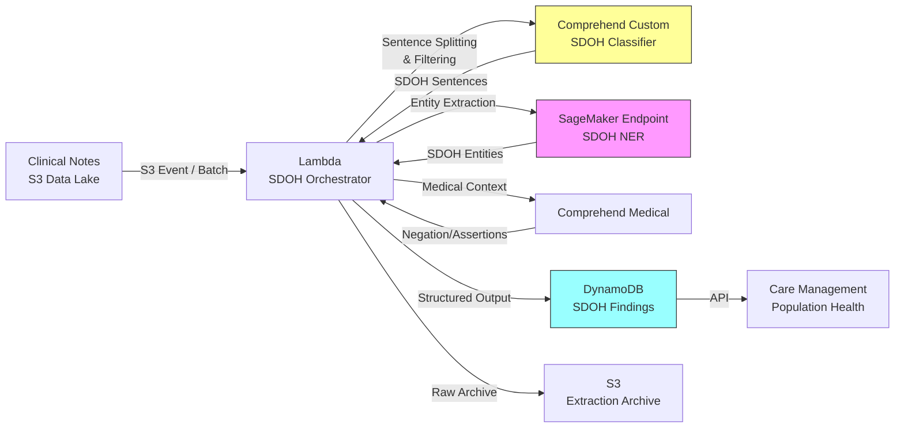

# Recipe 8.6: Social Determinants of Health (SDOH) Extraction

**Complexity:** Medium-Complex · **Phase:** Production · **Estimated Cost:** ~$0.02-0.08 per note

---

## The Problem

Here's a statistic that should bother anyone who works in healthcare: somewhere between 30% and 55% of health outcomes are driven by social and economic factors, not by clinical care. Housing instability, food insecurity, unemployment, social isolation, transportation barriers. These are the things that determine whether your patient can actually follow the care plan you just wrote. And yet, in most health systems, this information is trapped in unstructured text, invisible to the systems that coordinate care.

A social worker writes "Pt reports living in car for 3 weeks after eviction." A primary care physician notes "patient unable to afford medications, skipping doses." A nurse documents "no reliable transportation to dialysis appointments." A behavioral health intake form reads "client recently lost job, experiencing food insecurity."

This information exists. People are writing it down. But it's buried in progress notes, social work assessments, discharge summaries, and care coordination records. It's not coded. It's not structured. It doesn't feed into risk models. It doesn't trigger referrals. It doesn't show up in population health dashboards. And when a care manager opens that patient's chart six months later, they have to read through dozens of notes to find the sentence that says "this patient doesn't have a stable place to live."

The clinical consequences are real. A patient with uncontrolled diabetes who is food insecure needs a fundamentally different care plan than one who has stable housing and reliable meals. A heart failure patient without transportation to cardiology appointments will end up in the ED. A new mother experiencing domestic violence needs resources that have nothing to do with postpartum checkups. If your systems can't surface these factors, you're treating diseases in isolation from the lives your patients are actually living.

Payers care about this too. CMS has been pushing SDOH documentation through Z-codes (ICD-10-CM codes Z55-Z65), and value-based contracts increasingly include social risk adjustment. But Z-code capture rates are abysmal. Most clinicians don't code social factors even when they document them. The information is in the notes. It's just not in the structured data.

Extracting SDOH from clinical text is one of those problems where the concept sounds straightforward ("just find the sentences about housing") and the reality is genuinely hard. Let me explain why.

---

## The Technology: Extracting Social Context from Clinical Language

### What Are Social Determinants of Health?

SDOH is typically organized into five domains (following the Healthy People 2030 framework):

1. **Economic Stability:** Employment, income, debt, food affordability, housing costs
2. **Education Access and Quality:** Literacy, language barriers, educational attainment
3. **Healthcare Access and Quality:** Insurance status, transportation to care, provider availability
4. **Neighborhood and Built Environment:** Housing quality, safety, environmental exposures, food deserts
5. **Social and Community Context:** Social isolation, incarceration history, domestic violence, discrimination

Each domain contains dozens of specific factors. Housing alone includes: homelessness, housing instability, inadequate housing (lead paint, mold, overcrowding), housing cost burden, and temporary housing. And each of those can appear in text in hundreds of different ways.

### Why This Is Hard

SDOH extraction is harder than most clinical NLP tasks for a few specific reasons:

**Sparse mentions.** In a typical clinical note, SDOH information might appear in one sentence out of fifty. The signal-to-noise ratio is terrible. A discharge summary that's 2,000 words might contain exactly one relevant sentence: "Patient reports difficulty affording medications." Compare this to medication extraction, where drug names appear on nearly every line of a medication reconciliation note.

**Inconsistent language.** There's no standard vocabulary for documenting social factors. A physician writes "homeless." A social worker writes "experiencing homelessness." A nurse writes "lives in shelter." An intake form says "housing status: unstable." A progress note says "pt reports sleeping at different friends' houses." These all mean the same thing, but they look nothing alike to a pattern matcher.

**Contextual interpretation required.** "Patient was referred to food pantry" is different from "patient reports food insecurity." The first implies a positive resource connection (problem being addressed). The second is an active unmet need. Your extraction system needs to distinguish between current risk, past risk that's been resolved, and risk that's being actively addressed. This is assertion classification territory (Recipe 8.8), and it matters because the downstream action is completely different for each.

**Documenter variation.** Social workers write detailed social assessments with structured headings. Physicians mention SDOH as one-liners buried in a review of systems or assessment plan. Nurses document barriers to care in discharge instructions. Each discipline uses different conventions, different vocabularies, and embeds the information in different parts of the document. A single NLP model needs to handle all of them.

**Sensitivity and bias.** SDOH data touches on poverty, race, substance use, domestic violence, and immigration status. Extracting this information and attaching it to patient records creates real ethical obligations. You need to think about who sees it, how it's used, and whether it could be weaponized (denied insurance, child protective services involvement, immigration enforcement). These aren't hypothetical concerns.

### The NLP Techniques

SDOH extraction typically combines several NLP approaches:

**Named Entity Recognition (NER):** Identify spans of text that mention SDOH-related concepts. "Living in car" is a housing-related entity. "Lost job last month" is an employment-related entity. Custom NER models trained on SDOH-annotated clinical text outperform general biomedical NER models because the entity types are social, not clinical.

**Text Classification:** At the sentence or section level, classify text into SDOH domains. "Is this sentence about housing, food security, transportation, or something else?" Multi-label classification, because a single sentence can touch multiple domains ("patient lost job and was evicted" hits both economic stability and housing).

**Negation and Assertion Detection:** Distinguish between present problems, absent problems, and resolved problems. "Patient denies food insecurity" is a negation. "Housing stable after shelter placement" is resolved. "Reports difficulty affording rent" is active. Getting this wrong means either missing real needs or creating false alerts.

**Relation Extraction:** Connect the extracted SDOH mention to other entities. Who is experiencing the social need (the patient? a family member?)? What time frame (current? past?)? How severe (temporary setback vs. chronic condition)?

**Rule-based Post-processing:** Pattern matching and lookup tables for common SDOH phrases that the ML model might miss. "S/H: homeless" in a social history section. "Undomiciled" as a single-word mention. "SDoH screen positive" in a screening tool note. Rules catch the formulaic patterns; ML catches the creative natural language.

### The General Architecture Pattern

The extraction pipeline looks like this at a conceptual level:

```text
[Clinical Notes] → [Section Detection] → [Sentence Scoring] → [Entity/Concept Extraction]
                                                                        ↓
[Assertion Classification] → [SDOH Domain Mapping] → [Structured Output] → [Integration]
```

**Section Detection:** Identify which part of the note you're reading. Social history sections and social work notes are high-yield. The assessment/plan section often contains one-liner SDOH mentions. Discharge instructions reference barriers. Section awareness helps you tune sensitivity: in a social history section, you can be more aggressive about extraction because the prior probability of SDOH content is higher.

**Sentence Scoring:** Before running expensive entity extraction on every sentence in the note, run a fast binary classifier: "does this sentence contain SDOH-relevant content?" This filtering step keeps your pipeline efficient. Most sentences in a clinical note are clinically focused ("blood pressure 140/90, increased lisinopril to 20mg") and contain zero social information.

**Entity/Concept Extraction:** For sentences that pass the filter, extract the specific SDOH concepts. This might be a span-based NER model ("experiencing [homelessness]_HOUSING") or a classification model that assigns SDOH categories to the entire sentence.

**Assertion Classification:** Determine the status of each extracted concept. Present? Absent (denied/screened negative)? Historical? Being addressed? This step prevents false positives from negated mentions and distinguishes active needs from resolved ones.

**SDOH Domain Mapping:** Map the extracted concepts to a standardized SDOH taxonomy. Different organizations use different frameworks (Healthy People 2030, Gravity Project SDOH ontology, ICD-10 Z-codes, LOINC SDOH assessment codes). Your output should map to at least one standard to enable interoperability.

**Integration:** Push structured SDOH data into downstream systems: problem lists, care management platforms, risk stratification models, referral engines, population health dashboards.

---

## The AWS Implementation

### Why These Services

**Amazon Comprehend Medical for entity extraction.** Comprehend Medical is AWS's healthcare-specific NLP service. It extracts medical entities from clinical text, including some social determinants. Its `MEDICAL_CONDITION` and `TIME_EXPRESSION` entity types capture clinically relevant mentions, and you can use the detected entities as features. However, Comprehend Medical doesn't have a dedicated SDOH entity type, so we combine it with a custom classification layer for SDOH-specific extraction.

**Amazon Comprehend (Custom Classification) for SDOH domain classification.** Train a custom multi-label text classifier on sentences labeled with SDOH domains. Comprehend's custom classification allows you to build models without managing infrastructure. You label training data, Comprehend trains and hosts the model, and you get an API endpoint.

**Amazon SageMaker for custom NER.** For SDOH-specific entity extraction beyond what Comprehend Medical provides, train a custom NER model on SageMaker. This handles the nuanced spans ("living in car," "skipping doses due to cost") that generic medical NER misses. SageMaker gives you full control over model architecture and training data.

**AWS Lambda for orchestration.** The extraction pipeline is a sequence of API calls (split text into sentences, classify, extract entities, apply assertions, map to taxonomy) that fits the stateless, event-driven Lambda model. Processing a single note takes 2-8 seconds depending on length.

**Amazon DynamoDB for extraction results.** Store structured SDOH findings per patient with efficient lookups by patient ID, encounter, or SDOH domain. Supports the downstream query patterns that care management platforms need.

**Amazon S3 for note storage and model artifacts.** Clinical notes arrive in S3 (from EHR data feeds), and extraction results archive there for compliance and reprocessing.

### Architecture Diagram



### Prerequisites

| Requirement | Details |
|-------------|---------|
| **AWS Services** | Amazon Comprehend (custom classifier), Amazon Comprehend Medical, Amazon SageMaker (inference endpoint), AWS Lambda, Amazon DynamoDB, Amazon S3 |
| **IAM Permissions** | `comprehend:ClassifyDocument`, `comprehend:DetectEntities` (custom endpoint), `comprehendmedical:DetectEntitiesV2`, `sagemaker:InvokeEndpoint`, `s3:GetObject`, `s3:PutObject`, `dynamodb:PutItem`, `dynamodb:Query` |
| **BAA** | AWS BAA signed (required: clinical notes contain PHI; SDOH data itself is highly sensitive) |
| **Encryption** | S3: SSE-KMS; DynamoDB: encryption at rest (default); SageMaker endpoint: KMS encrypted; all API calls over TLS; Lambda CloudWatch Logs: KMS encryption configured |
| **VPC** | Production: Lambda in VPC with VPC endpoints for S3, DynamoDB, SageMaker Runtime, Comprehend, Comprehend Medical, and CloudWatch Logs |
| **CloudTrail** | Enabled: log all Comprehend, SageMaker, and S3 API calls for HIPAA audit |
| **Training Data** | SDOH-annotated clinical notes. The MIMIC-III/IV dataset has been used in research. The Social Work Assessment corpus or de-identified notes from your own system are ideal. Gravity Project reference materials for taxonomy alignment. Never use real PHI in model development without IRB approval and proper de-identification. |
| **Cost Estimate** | Comprehend Custom Classification: ~$0.0005/unit (100 chars). Comprehend Medical: ~$0.01 per unit (100 chars). SageMaker real-time endpoint: ~$0.05-0.10/hour (ml.m5.large). Lambda + DynamoDB negligible. Per-note cost varies by length: ~$0.02-0.08 for a typical 500-2000 word note. |

### Ingredients

| AWS Service | Role |
|------------|------|
| **Amazon Comprehend (Custom)** | Multi-label sentence classifier for SDOH domain detection |
| **Amazon Comprehend Medical** | Medical entity extraction and negation/assertion detection |
| **Amazon SageMaker** | Custom NER model endpoint for SDOH-specific entity spans |
| **AWS Lambda** | Pipeline orchestration: split, classify, extract, assemble |
| **Amazon DynamoDB** | Structured SDOH findings store with patient-level queries |
| **Amazon S3** | Note ingestion, model artifacts, extraction archive |
| **AWS KMS** | Encryption key management for all data at rest |
| **Amazon CloudWatch** | Metrics, logs, alarms for extraction quality monitoring |

### Code

#### Walkthrough

**Step 1: Note ingestion and section detection.** Clinical notes arrive in S3 from EHR data feeds (HL7 FHIR DocumentReference, CDA documents, or flat text exports). The first processing step identifies the note type and splits it into logical sections. Social history sections, social work assessments, and care coordination notes are high-priority for SDOH content. The assessment/plan and discharge instructions sections are secondary targets. Purely clinical sections (lab results, vital signs) can be skipped entirely to save processing cost. Skip this step and you waste compute on sections that will never contain SDOH information, and you lose the contextual signal that section headers provide.

```pseudocode
FUNCTION ingest_and_section(bucket, key):
    // Retrieve the clinical note from storage
    note_text = read object from S3 at bucket/key

    // Parse metadata: patient ID, encounter ID, note type, author role
    metadata = extract_metadata(note_text)

    // Split into sections using header patterns
    // Clinical notes use predictable section headers:
    // "SOCIAL HISTORY:", "HPI:", "ASSESSMENT/PLAN:", etc.
    sections = split_by_section_headers(note_text)

    // Tag each section with SDOH relevance priority
    // High: Social History, Social Work Assessment, Barriers to Care
    // Medium: Assessment/Plan, Discharge Instructions, Care Coordination
    // Low/Skip: Lab Results, Vital Signs, Medications, Imaging
    FOR each section in sections:
        section.priority = assign_sdoh_priority(section.header)

    // Return sections ordered by priority (high first)
    // This lets us stop early if processing budget is constrained
    RETURN metadata, sections sorted by priority descending
```

**Step 2: Sentence-level SDOH classification.** For each high-priority section, split into sentences and run each through the custom SDOH classifier. This is the filtering step that identifies which sentences contain SDOH-relevant content. The classifier is a multi-label model trained on sentences annotated with SDOH domains (housing, food, employment, transportation, social support, safety, education, financial). Most sentences will score below threshold and get discarded. A typical social history section of 10 sentences might yield 3-5 SDOH-relevant ones. A progress note might yield 0-1. This step is critical for precision: without it, downstream extraction runs on every sentence and produces a flood of false positives from clinically focused text that mentions social concepts tangentially.

```pseudocode
SDOH_DOMAINS = [
    "housing_instability",
    "food_insecurity",
    "transportation_barriers",
    "financial_strain",
    "employment_issues",
    "social_isolation",
    "interpersonal_violence",
    "education_barriers",
    "legal_issues",
    "utility_difficulties"
]

CLASSIFICATION_THRESHOLD = 0.60  // minimum confidence to consider a sentence SDOH-relevant

FUNCTION classify_sentences(sections):
    sdoh_candidates = empty list

    FOR each section in sections WHERE section.priority >= MEDIUM:
        sentences = split_into_sentences(section.text)

        FOR each sentence in sentences:
            // Call the custom Comprehend classifier endpoint
            // Returns a list of SDOH domain labels with confidence scores
            result = call Comprehend.ClassifyDocument with:
                text     = sentence
                endpoint = SDOH_CLASSIFIER_ENDPOINT_ARN

            // Keep sentences where at least one SDOH domain scores above threshold
            relevant_labels = filter result.Labels WHERE score >= CLASSIFICATION_THRESHOLD

            IF relevant_labels is not empty:
                append to sdoh_candidates: {
                    sentence: sentence,
                    section_header: section.header,
                    domains: relevant_labels,   // which SDOH domains were detected
                    top_score: max score from relevant_labels
                }

    RETURN sdoh_candidates
```

**Step 3: SDOH entity extraction.** For sentences that passed the classifier filter, extract specific SDOH entity spans using the custom NER model hosted on SageMaker. The NER model identifies the exact text spans that describe social needs: "living in car," "unable to afford medications," "no transportation to appointments." Entity types include SDOH_FACTOR (the social determinant itself), SEVERITY (acute, chronic, mild), TIMEFRAME (current, past, 3 weeks), and RESOURCE (food pantry, shelter, Medicaid). This granularity matters because "patient was homeless 5 years ago" and "patient is currently homeless" require completely different care management responses.

```pseudocode
FUNCTION extract_sdoh_entities(sdoh_candidates):
    findings = empty list

    FOR each candidate in sdoh_candidates:
        // Call the custom SageMaker NER endpoint
        // Input: sentence text
        // Output: list of entity spans with types, offsets, and confidence
        ner_result = call SageMaker.InvokeEndpoint with:
            endpoint = SDOH_NER_ENDPOINT_NAME
            body     = { "text": candidate.sentence }

        // Parse the NER response into structured entities
        entities = parse_ner_response(ner_result)

        FOR each entity in entities:
            append to findings: {
                text: entity.text,           // "living in car"
                entity_type: entity.type,           // SDOH_FACTOR, SEVERITY, TIMEFRAME, RESOURCE
                sdoh_domains: candidate.domains,     // from classifier: ["housing_instability"]
                confidence: entity.confidence,
                source_sentence: candidate.sentence,
                section: candidate.section_header,
                offsets: entity.start, entity.end
            }

    RETURN findings
```

**Step 4: Assertion and negation detection.** Not every SDOH mention represents an active need. "Patient denies food insecurity" is a negative finding. "Housing stable after shelter placement" indicates a resolved issue. "If patient loses job, may need assistance" is hypothetical. This step uses Amazon Comprehend Medical's assertion detection to classify each finding as POSITIVE (active need), NEGATIVE (denied/screened negative), CONDITIONAL (hypothetical), or RESOLVED (previously present, now addressed). Comprehend Medical's `Trait` field includes `NEGATION` detection, and we supplement with rule-based patterns for SDOH-specific assertion language. Skip this step and you'll flood care managers with false alerts from negated screenings and resolved historical needs.

```pseudocode
ASSERTION_PATTERNS = {
    "NEGATIVE": ["denies", "no evidence of", "screened negative", "not experiencing",
                 "does not report", "stable", "adequate", "sufficient"],
    "RESOLVED": ["resolved", "connected to", "receiving services", "placed in",
                 "obtained housing", "enrolled in", "no longer"],
    "CONDITIONAL": ["if", "may need", "at risk for", "should consider", "potential"]
}

FUNCTION classify_assertions(findings, original_sentences):
    FOR each finding in findings:
        // First pass: use Comprehend Medical for negation detection
        cm_result = call ComprehendMedical.DetectEntitiesV2 with:
            text = finding.source_sentence

        // Check if Comprehend Medical detected negation traits
        // on entities overlapping with our SDOH finding
        has_negation = check_negation_traits(cm_result, finding.offsets)

        IF has_negation:
            finding.assertion = "NEGATIVE"
        ELSE:
            // Second pass: rule-based assertion patterns for SDOH context
            finding.assertion = match_assertion_patterns(
                finding.source_sentence,
                finding.text,
                ASSERTION_PATTERNS
            )
            // Default to POSITIVE if no negation/resolution pattern matched
            IF finding.assertion is NULL:
                finding.assertion = "POSITIVE"

    RETURN findings
```

**Step 5: Taxonomy mapping and Z-code suggestion.** Map each positive finding to standardized terminologies. The Gravity Project SDOH Clinical Care ontology provides a structured vocabulary. ICD-10-CM Z-codes (Z55-Z65) provide billable diagnosis codes. LOINC provides assessment instrument codes. This mapping enables interoperability: downstream systems that understand SNOMED, ICD-10, or Gravity Project codes can consume the findings without parsing free text. It also supports the growing regulatory push for SDOH Z-code capture. The mapping table is a curated crosswalk between your internal SDOH domain labels and the relevant standard codes.

```json
{
    "housing_instability": {
        "icd10": ["Z59.0", "Z59.1", "Z59.8"],
        "gravity_project": ["homelessness", "housing-instability", "inadequate-housing"],
        "display": ["Homelessness", "Inadequate housing", "Housing instability"],
        "z_code_descriptions": {
            "Z59.0": "Homelessness",
            "Z59.1": "Inadequate housing",
            "Z59.8": "Other problems related to housing and economic circumstances"
        }
    },
    "food_insecurity": {
        "icd10": ["Z59.41", "Z59.48"],
        "gravity_project": ["food-insecurity"],
        "display": ["Food insecurity", "Lack of adequate food"],
        "z_code_descriptions": {
            "Z59.41": "Food insecurity",
            "Z59.48": "Other specified lack of adequate food"
        }
    },
    "transportation_barriers": {
        "icd10": ["Z59.82"],
        "gravity_project": ["transportation-insecurity"],
        "display": ["Transportation insecurity"],
        "z_code_descriptions": {
            "Z59.82": "Transportation insecurity"
        }
    },
    "financial_strain": {
        "icd10": ["Z59.86", "Z59.7"],
        "gravity_project": ["financial-insecurity"],
        "display": ["Financial insecurity", "Insufficient social insurance"],
        "z_code_descriptions": {
            "Z59.86": "Financial insecurity",
            "Z59.7": "Insufficient social insurance and welfare support"
        }
    },
    "social_isolation": {
        "icd10": ["Z60.2", "Z60.4"],
        "gravity_project": ["social-isolation"],
        "display": ["Social isolation", "Social exclusion"],
        "z_code_descriptions": {
            "Z60.2": "Problems related to living alone",
            "Z60.4": "Social exclusion and rejection"
        }
    },
    "interpersonal_violence": {
        "icd10": ["Z63.0", "Z65.4"],
        "gravity_project": ["intimate-partner-violence"],
        "display": ["Intimate partner violence", "Victim of crime"],
        "z_code_descriptions": {
            "Z63.0": "Problems in relationship with spouse or partner",
            "Z65.4": "Victim of crime and terrorism"
        }
    }
}
```

```pseudocode
FUNCTION map_to_taxonomy(findings):
    structured_findings = empty list

    FOR each finding in findings WHERE finding.assertion == "POSITIVE":
        // Look up the primary SDOH domain for this finding
        primary_domain = finding.sdoh_domains[0].label

        // Get the standardized codes from the crosswalk
        codes = SDOH_TAXONOMY_MAP[primary_domain]

        IF codes is not NULL:
            append to structured_findings: {
                patient_id: metadata.patient_id,
                encounter_id: metadata.encounter_id,
                sdoh_domain: primary_domain,
                extracted_text: finding.text,
                source_sentence: finding.source_sentence,
                source_section: finding.section,
                assertion: finding.assertion,
                confidence: finding.confidence,
                suggested_icd10: codes.icd10,
                gravity_codes: codes.gravity_project,
                display_terms: codes.display,
                extraction_time: current UTC timestamp
            }

    RETURN structured_findings
```

**Step 6: Store and surface findings.** Write structured SDOH findings to DynamoDB with keys that support the queries care management platforms need: "all SDOH findings for patient X," "all patients with active housing instability," "all findings from encounter Y." Include the full provenance chain (which note, which section, which sentence) so reviewers can verify accuracy. Set a TTL strategy if your organization requires SDOH data to age out, though most will want longitudinal tracking.

```pseudocode
FUNCTION store_findings(structured_findings):
    FOR each finding in structured_findings:
        // Write to DynamoDB with composite keys for flexible querying
        // Partition key: patient_id (enables all-findings-for-patient queries)
        // Sort key: domain#timestamp (enables filtering by domain and time ordering)
        write record to DynamoDB table "sdoh-findings":
            pk                = finding.patient_id
            sk                = finding.sdoh_domain + "#" + finding.extraction_time
            encounter_id      = finding.encounter_id
            domain            = finding.sdoh_domain
            extracted_text    = finding.extracted_text
            source_sentence   = finding.source_sentence
            source_section    = finding.source_section
            assertion         = finding.assertion
            confidence        = finding.confidence
            suggested_icd10   = finding.suggested_icd10
            gravity_codes     = finding.gravity_codes
            needs_review      = (finding.confidence < 0.80)
            reviewed          = false
            review_outcome    = NULL

    // Also write a summary record for population health queries
    // "How many patients have active food insecurity?"
    update_population_health_counters(structured_findings)

    RETURN count of findings written
```

> **Curious how this looks in Python?** The pseudocode above covers the concepts. If you'd like to see sample Python code that demonstrates these patterns using boto3, check out the [Python Example](chapter08.06-python-example). It walks through each step with inline comments and notes on what you'd need to change for a real deployment.

### Expected Results

**Sample output for a social work progress note:**

```json
{
  "patient_id": "PAT-2847193",
  "encounter_id": "ENC-20260115-0042",
  "findings": [
    {
      "sdoh_domain": "housing_instability",
      "extracted_text": "living in car for 3 weeks after eviction",
      "source_sentence": "Pt reports living in car for 3 weeks after eviction from apartment.",
      "source_section": "Social History",
      "assertion": "POSITIVE",
      "confidence": 0.94,
      "suggested_icd10": ["Z59.0", "Z59.1"],
      "gravity_codes": ["homelessness", "housing-instability"],
      "needs_review": false
    },
    {
      "sdoh_domain": "food_insecurity",
      "extracted_text": "difficulty affording meals",
      "source_sentence": "Reports difficulty affording meals, eating once daily.",
      "source_section": "Social History",
      "assertion": "POSITIVE",
      "confidence": 0.91,
      "suggested_icd10": ["Z59.41"],
      "gravity_codes": ["food-insecurity"],
      "needs_review": false
    },
    {
      "sdoh_domain": "transportation_barriers",
      "extracted_text": "no reliable transportation",
      "source_sentence": "No reliable transportation to clinic appointments since losing vehicle.",
      "source_section": "Barriers to Care",
      "assertion": "POSITIVE",
      "confidence": 0.88,
      "suggested_icd10": ["Z59.82"],
      "gravity_codes": ["transportation-insecurity"],
      "needs_review": false
    }
  ],
  "extraction_timestamp": "2026-01-15T10:42:18Z",
  "note_type": "Social Work Progress Note",
  "total_sentences_processed": 34,
  "sdoh_sentences_identified": 7,
  "positive_findings": 3,
  "negative_findings": 2,
  "resolved_findings": 1
}
```

**Performance benchmarks:**

| Metric | Typical Value |
|--------|---------------|
| End-to-end latency | 3-8 seconds per note (varies by length) |
| Sentence classification accuracy | 85-92% F1 (SDOH relevance binary) |
| Domain classification accuracy | 78-88% F1 (multi-label, varies by domain) |
| Entity extraction accuracy | 75-85% F1 (span-level) |
| Assertion classification accuracy | 88-94% (positive vs. negative) |
| False positive rate | 8-15% (findings that aren't real needs) |
| Cost per note (500 words) | ~$0.02 |
| Cost per note (2000 words) | ~$0.08 |
| Throughput | ~20-40 notes/minute (single Lambda) |

**Where it struggles:**

- Implicit SDOH mentions: "Patient lives with sister's family" (possible overcrowding, or healthy support system?)
- Ambiguous severity: "Sometimes skips meals" (occasional budgeting or genuine food insecurity?)
- Cultural context: "Large extended family in household" (overcrowding concern vs. cultural norm)
- Documenter shorthand: "Hx of DV" without elaboration
- Notes that describe social strengths rather than needs (employed, housed, supported) getting misclassified as SDOH findings
- Temporal reasoning: distinguishing "was homeless 5 years ago" from "is currently homeless" when the language is ambiguous

---

## The Honest Take

SDOH extraction is one of those areas where the technology works well enough to be useful and poorly enough to require human oversight on every output. The gap between "we detected something" and "this patient needs a housing referral" is larger than it looks.

The hardest thing I've seen teams struggle with is the definition problem. What counts as "food insecurity"? Is a patient who says "money is tight" experiencing financial strain for SDOH purposes? Where's the threshold between "mentioned social context" and "actionable social need"? You need your clinical operations and social work teams to define these boundaries before you train a model. If you let engineers make these decisions, you'll build something technically correct and clinically useless.

The classifier accuracy numbers look decent in aggregate (85%+ F1) but the domain-level performance varies enormously. Housing and food insecurity are relatively easy to detect because the language is more explicit. Social isolation and interpersonal violence are much harder because they're often documented obliquely or not at all. Don't quote aggregate numbers to your stakeholders. Show them per-domain performance.

The sensitivity question haunts this work. You're extracting information about poverty, domestic violence, homelessness, and substance use. Attaching this data to patient records has real consequences. Some patients don't want this documented. Some documentation was written without the patient's explicit knowledge that it would be surfaced programmatically. Build consent workflows. Build access controls. Think hard about who can see SDOH findings and in what context.

The thing that surprised me most: the highest-yield source documents aren't physician notes. They're social work assessments, behavioral health intakes, and care coordination notes. If your EHR data feed only includes physician documentation, you're missing the majority of SDOH documentation in your system.

---

## Variations and Extensions

**Screening tool integration.** Many health systems use standardized SDOH screening instruments (PRAPARE, AHC HRSN, WellRx). These produce structured data but only capture point-in-time snapshots. Combine NLP-extracted findings with screening tool results for a longitudinal view. Use extracted findings to identify patients who should be re-screened.

**Automated referral generation.** When a positive SDOH finding is detected with high confidence, automatically generate a referral to the appropriate community resource. Connect to a closed-loop referral platform (like Unite Us or Aunt Bertha/findhelp). The extraction output maps directly to resource categories. This closes the gap between identification and action.

**Population health SDOH dashboards.** Aggregate extracted SDOH findings at the panel, clinic, or health system level. Show prevalence rates by domain, geographic clustering of social needs, trends over time. Enables population-level interventions (food pantry partnerships, transportation program expansion) based on data rather than anecdote.

---

## Related Recipes

- **Recipe 8.5 (Problem List Extraction):** Uses similar NER and assertion classification techniques but for clinical problems rather than social factors
- **Recipe 8.8 (Clinical Assertion Classification):** Deep dive on the assertion detection step that SDOH extraction relies on
- **Recipe 6.9 (Social Determinant Phenotyping):** Uses SDOH-extracted data for cohort-level clustering and population segmentation
- **Recipe 7.6 (Rising Risk Identification):** SDOH findings are powerful features for risk stratification models
- **Recipe 13.6 (Care Gap Reasoning Engine):** Knowledge graphs that incorporate SDOH for holistic care gap identification

---

## Additional Resources

**AWS Documentation:**
- [Amazon Comprehend Medical Documentation](https://docs.aws.amazon.com/comprehend-medical/latest/dev/what-is.html)
- [Amazon Comprehend Custom Classification](https://docs.aws.amazon.com/comprehend/latest/dg/how-document-classification.html)
- [Amazon SageMaker Inference Endpoints](https://docs.aws.amazon.com/sagemaker/latest/dg/realtime-endpoints.html)
- [Amazon Comprehend Medical DetectEntitiesV2 API](https://docs.aws.amazon.com/comprehend-medical/latest/dev/API_medical_DetectEntitiesV2.html)
- [AWS HIPAA Eligible Services](https://aws.amazon.com/compliance/hipaa-eligible-services-reference/)
- [Architecting for HIPAA on AWS (Whitepaper)](https://docs.aws.amazon.com/whitepapers/latest/architecting-hipaa-security-and-compliance-on-aws/welcome.html)

**Standards and Ontologies:**
- [Gravity Project (HL7 SDOH Clinical Care)](https://thegravityproject.net/): The primary interoperability standard for SDOH data exchange
- [ICD-10-CM Z-codes for SDOH (Z55-Z65)](https://www.cms.gov/medicare/coding-billing/icd-10-codes): CMS guidance on social determinant coding
- [LOINC SDOH Assessment Panels](https://loinc.org/sdoh/): Standardized codes for SDOH screening instruments
- [Healthy People 2030 SDOH Framework](https://health.gov/healthypeople/priority-areas/social-determinants-health): Federal framework organizing SDOH into five domains

**Research and Background:**
- TODO: Verify current URL for "Social Determinants of Health Extraction from Clinical Notes" (JAMIA or similar)
- TODO: Verify current URL for Gravity Project implementation guides with FHIR mappings

---

## Estimated Implementation Time

| Tier | Timeline | What You Get |
|------|----------|--------------|
| **Basic** | 4-6 weeks | Rule-based extraction for top 3 SDOH domains, keyword matching, no assertion detection |
| **Production-ready** | 10-14 weeks | Custom classifier + NER model, assertion detection, Z-code mapping, human review queue |
| **With variations** | 16-20 weeks | Add referral automation, population health dashboards, screening tool integration, feedback loop |

---

## Tags

`nlp` · `sdoh` · `social-determinants` · `comprehend-medical` · `comprehend-custom` · `sagemaker` · `ner` · `classification` · `z-codes` · `gravity-project` · `care-management` · `population-health` · `medium-complex` · `hipaa`

---

*← [Recipe 8.5: Problem List Extraction](chapter08.05-problem-list-extraction) · [Chapter 8 Index](chapter08-index) · [Next: Recipe 8.7: Adverse Event Detection in Clinical Text →](chapter08.07-adverse-event-detection-clinical-text)*
