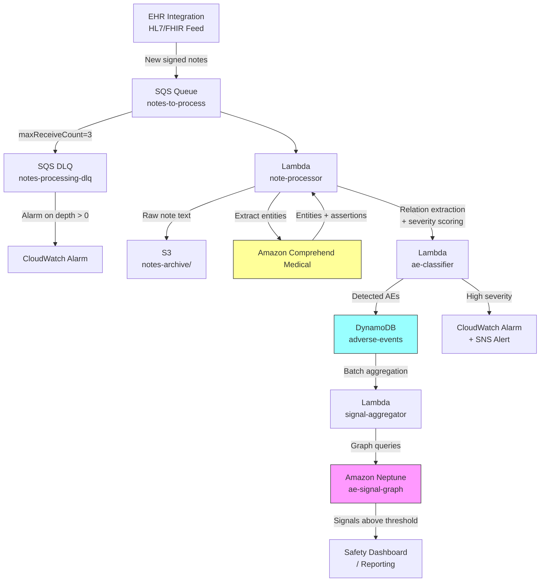

# Recipe 8.7 Architecture and Implementation: Adverse Event Detection in Clinical Text

*Companion to [Recipe 8.7: Adverse Event Detection in Clinical Text](chapter08.07-adverse-event-detection-clinical-text). This page covers the AWS architecture, services, prerequisites, and pseudocode. For the problem framing and the conceptual approach, start with the main recipe.*

---

## The AWS Implementation

### Why These Services

**Amazon Comprehend Medical for entity extraction.** Comprehend Medical is AWS's healthcare-specific NLP service. It extracts medications (with dosage, frequency, route), medical conditions, and temporal expressions from clinical text. For the entity extraction stage of adverse event detection, it handles the heavy lifting of identifying drugs and clinical findings with their attributes. It also provides negation and assertion detection (whether a condition is negated, hypothetical, or conditional), which maps directly to our assertion filtering stage.

**AWS Lambda for orchestration.** Each note flows through a multi-stage pipeline: extract entities, classify assertions, detect relations, score severity. Lambda handles this orchestration with step-by-step processing. For batch workloads (processing a day's worth of notes), Lambda integrates with SQS for reliable, scalable note-by-note processing.

**Amazon SQS for reliable note queuing.** Clinical notes arrive continuously as they're signed in the EHR. SQS provides a durable queue that decouples note ingestion from processing, handles retries on transient failures, and lets you scale processing independently of arrival rate. Configure a dead letter queue (`notes-processing-dlq`) with `maxReceiveCount=3` so that poison messages (malformed notes, persistent failures) move to the DLQ after three attempts instead of cycling indefinitely. Set a CloudWatch alarm on DLQ depth > 0. The DLQ must have the same SSE-KMS encryption as the primary queue since messages reference PHI.

**Amazon DynamoDB for adverse event storage.** Detected adverse events need fast lookup by patient, by medication, and by time window. DynamoDB's flexible key structure supports these access patterns, and its TTL feature can manage retention policies for different severity levels.

**Amazon S3 for note storage and audit trail.** Raw notes and intermediate processing artifacts need durable, encrypted storage. S3 provides the audit trail: which notes were processed, what was extracted, and what decisions the system made.

**Amazon Neptune for aggregation and signal detection.** When you move from individual adverse events to population-level signals, you need to query relationships: which patients had which events on which drugs during which time periods. Neptune's graph database structure supports the disproportionality analysis and pattern detection that pharmacovigilance requires.

**Amazon CloudWatch for monitoring and alerting.** Pipeline health metrics, extraction confidence distributions, and high-severity event alerts all flow through CloudWatch. When the system detects a Grade 3+ event, you want a real-time alert, not a batch report.

### Architecture Diagram



### Prerequisites

| Requirement | Details |
|-------------|---------|
| **AWS Services** | Amazon Comprehend Medical, AWS Lambda, Amazon SQS, Amazon DynamoDB, Amazon S3, Amazon Neptune, Amazon CloudWatch, Amazon SNS |
| **IAM Permissions** | `comprehend-medical:DetectEntitiesV2`, `comprehend-medical:InferRxNorm`, `sqs:ReceiveMessage`, `sqs:DeleteMessage`, `s3:PutObject`, `s3:GetObject`, `dynamodb:PutItem`, `dynamodb:Query`, `neptune-db:ReadDataViaQuery` (dashboard/read-only consumers), `neptune-db:ReadDataViaQuery` + `neptune-db:WriteDataViaQuery` (signal-aggregator Lambda), `sns:Publish` |
| **BAA** | AWS BAA signed (clinical notes are PHI) |
| **Encryption** | S3: SSE-KMS; DynamoDB: encryption at rest; SQS: SSE-KMS; Neptune: encryption at rest; all transit over TLS |
| **VPC** | Production: Lambda in VPC with VPC endpoints for S3 (gateway), DynamoDB (gateway), SQS (interface), Comprehend Medical (interface), CloudWatch Logs (interface), SNS (interface), and KMS (interface). Neptune requires VPC deployment with IAM database authentication enabled and security group inbound TCP 8182 restricted to signal-aggregator Lambda SG and safety dashboard service SG only. Enable Neptune audit logs to CloudWatch Logs for PHI access tracking. |
| **CloudTrail** | Enabled for all API calls; audit trail for PHI access |
| **Sample Data** | Synthetic clinical notes with planted adverse event mentions. MIMIC-III discharge summaries (de-identified) for development. Never use real patient notes in non-production environments. |
| **Cost Estimate** | Comprehend Medical: ~$0.01 per 100 characters. A typical note (3000 chars) costs ~$0.30 for DetectEntitiesV2 plus ~$0.30 for InferRxNorm = ~$0.60 per note through both APIs. InferRxNorm only runs on notes with detected medications, so blended average is $0.40-1.00 per note depending on note length and medication density. At 10,000 notes/day: $4,000-$10,000/day in Comprehend Medical costs alone. Batch pricing significantly lower. Lambda, SQS, DynamoDB negligible at moderate volumes. Neptune: instance-based pricing starting ~$0.35/hr for smallest instance. |

### Ingredients

| AWS Service | Role |
|------------|------|
| **Amazon Comprehend Medical** | Extracts medication entities, medical conditions, and assertion attributes from clinical text |
| **AWS Lambda** | Orchestrates multi-stage NLP pipeline; runs relation extraction and severity classification logic |
| **Amazon SQS** | Queues incoming notes for reliable, scalable processing |
| **Amazon DynamoDB** | Stores individual adverse event detections with patient, drug, and time indexes |
| **Amazon S3** | Archives raw notes and processing artifacts for audit. Enable versioning for tamper-proof audit trail. Consider Object Lock in compliance mode for regulated environments. |
| **Amazon Neptune** | Stores and queries drug-event-patient graph for signal aggregation. Access restricted via IAM DB auth and security groups. Enable audit logs for PHI access tracking. |
| **Amazon CloudWatch** | Monitors pipeline health; triggers alerts for high-severity events |
| **Amazon SNS** | Delivers real-time notifications for critical adverse events |
| **AWS KMS** | Manages encryption keys across all data stores |

### Pseudocode Walkthrough

**Step 1: Receive and archive the clinical note.** When a clinician signs a note in the EHR, it arrives in the processing queue via an integration feed (HL7 ADT message, FHIR subscription, or direct EHR integration). The first thing we do is archive the raw note in durable storage. This serves two purposes: audit compliance (every piece of PHI we process must be traceable) and reprocessing capability (when models improve, we can run historical notes through the updated pipeline). Skip this step and you lose the ability to explain or reproduce any detection the system makes.

```pseudocode
FUNCTION receive_note(queue_message):
    // Parse the incoming message to extract note metadata and text content.
    // The message format depends on your EHR integration: HL7, FHIR, or custom.
    note_id      = queue_message.note_identifier      // unique ID from the EHR

    // Idempotency check: query the archive for this note_id.
    // If the note already exists with identical content, skip reprocessing entirely.
    // If it exists but content has changed (amended note), delete prior AE records
    // for this note_id before reprocessing. Amended notes are common in clinical
    // workflows (addenda, corrections, late-signed attestations).
    existing = QUERY S3 for "notes-archive/*/note_id.json"
    IF existing AND existing.note_text == queue_message.document_text:
        LOG "Note {note_id} already processed with identical content. Skipping."
        RETURN null  // acknowledge the SQS message, no further processing
    ELSE IF existing AND existing.note_text != queue_message.document_text:
        // Amended note: delete prior adverse event records for this note,
        // then reprocess from scratch. This prevents stale detections from
        // an earlier version of the note persisting alongside new detections.
        DELETE from DynamoDB "adverse-events" WHERE note_id == note_id
        LOG "Note {note_id} amended. Cleared prior detections, reprocessing."
    patient_id   = queue_message.patient_identifier   // who the note belongs to
    note_text    = queue_message.document_text        // the full clinical note content
    note_date    = queue_message.service_date         // when the clinical encounter occurred
    note_type    = queue_message.document_type        // progress note, discharge summary, etc.

    // Archive the raw note before any processing.
    // This creates an immutable record: "we received this exact text at this exact time."
    archive_path = "notes-archive/{year}/{month}/{note_id}.json"
    STORE to S3 at archive_path:
        note_id, patient_id, note_text, note_date, note_type,
        received_timestamp = current UTC time

    RETURN note_id, patient_id, note_text, note_date, note_type
```

**Step 2: Extract medical entities using Comprehend Medical.** This is where the NLP engine does the heavy lifting. We send the clinical note text to Amazon Comprehend Medical's `DetectEntitiesV2` API, which returns structured entities for medications, medical conditions, anatomy, test results, and temporal expressions. Each entity comes with a confidence score, character offset positions, and crucially, trait attributes that tell us whether the mention is negated, hypothetical, or a diagnosis. We also call `InferRxNorm` to normalize medication mentions to standard RxNorm codes (this enables cross-note aggregation later, because "amlodipine" and "Norvasc" need to resolve to the same thing). Skip this step and you're writing regex patterns against clinical text, which is a path to madness.

```pseudocode
FUNCTION extract_entities(note_text):
    // Call Comprehend Medical to detect all medical entities in the note.
    // DetectEntitiesV2 returns entities categorized by type with confidence scores.
    entity_response = call ComprehendMedical.DetectEntitiesV2 with:
        Text = note_text

    // Separate entities by category for downstream processing.
    medications = []    // drugs, dosages, routes, frequencies
    conditions  = []    // symptoms, diagnoses, signs
    temporals   = []    // dates, durations, relative time expressions

    FOR each entity in entity_response.Entities:
        IF entity.Category == "MEDICATION":
            // Capture the medication with all its attributes (dose, route, frequency)
            // and its traits (negation status).
            append to medications: {
                text: entity.Text,                    // "amlodipine 10mg"
                type: entity.Type,                    // GENERIC_NAME, BRAND_NAME, etc.
                attributes: entity.Attributes,             // dose, route, frequency details
                traits: entity.Traits,                 // NEGATION, PAST_HISTORY, etc.
                confidence: entity.Score,                  // 0.0 to 1.0
                offset: (entity.BeginOffset, entity.EndOffset)
            }
        ELSE IF entity.Category == "MEDICAL_CONDITION":
            append to conditions: {
                text: entity.Text,                    // "orthostatic dizziness"
                type: entity.Type,                    // DIAGNOSIS, SIGN_SYMPTOM, etc.
                traits: entity.Traits,                 // NEGATION, HYPOTHETICAL, etc.
                confidence: entity.Score,
                offset: (entity.BeginOffset, entity.EndOffset)
            }
        ELSE IF entity.Category == "TIME_EXPRESSION":
            append to temporals: {
                text: entity.Text,                    // "since starting medication"
                type: entity.Type,                    // TIME_TO_MEDICATION_NAME, etc.
                confidence: entity.Score,
                offset: (entity.BeginOffset, entity.EndOffset)
            }

    // Normalize medication names to RxNorm codes for consistent aggregation.
    FOR each med in medications:
        rxnorm_response = call ComprehendMedical.InferRxNorm with:
            Text = med.text
        IF rxnorm_response has concepts with score > 0.7:
            med.rxnorm_code = top concept's RxNorm CUI
            med.rxnorm_name = top concept's preferred description

    RETURN medications, conditions, temporals
```

**Step 3: Filter by assertion status.** Not every medical condition mention represents something actually happening to the patient. "Denies chest pain" mentions chest pain but explicitly negates it. "Family history of stroke" attributes the event to someone else. "If the patient develops a rash, stop the medication" is a hypothetical instruction. This step filters the extracted conditions to keep only those that are asserted as present and active in the patient. Comprehend Medical provides trait flags for negation and other contextual attributes, which we use as the primary filter. This single step typically removes 30-50% of extracted conditions from consideration, dramatically reducing false positives downstream.

```pseudocode
FUNCTION filter_active_conditions(conditions):
    // Keep only conditions that represent real, current patient findings.
    // Comprehend Medical attaches "Traits" to each entity indicating context.
    active_conditions = []

    FOR each condition in conditions:
        is_negated      = any trait in condition.traits has Name == "NEGATION"
        is_hypothetical = any trait in condition.traits has Name == "HYPOTHETICAL"
        // Comprehend Medical does not expose a dedicated FAMILY_HISTORY trait
        // on MEDICAL_CONDITION entities. Use section detection or a rule-based
        // check: if the condition appears within a "Family History" section header
        // (detected by offset ranges in a prior section-parsing step), treat it
        // as family history. For the pseudocode, we use a placeholder function.
        is_family_hx    = condition_in_family_history_section(condition.offset, note_sections)

        IF NOT is_negated AND NOT is_hypothetical AND NOT is_family_hx:
            // This condition is asserted as present in the patient. Keep it.
            append to active_conditions: condition
        // Otherwise discard: negated, hypothetical, or family history mentions
        // are not adverse events happening to this patient.

    RETURN active_conditions
```

**Step 4: Detect adverse event relationships.** This is the core logic: for each active condition, determine whether it might be causally linked to a medication the patient is taking. We use a layered approach combining explicit causal language detection, temporal plausibility, and knowledge-base lookup. Each layer contributes evidence; the combined score determines whether we classify the pair as a detected adverse event. This is where most false positives and false negatives originate. The causal language patterns have high precision but miss implicit mentions. The temporal co-occurrence check has high recall but low precision. The knowledge base filters out implausible combinations but can't detect novel reactions. The layers compensate for each other's weaknesses.

```pseudocode
// Known causal language patterns in clinical documentation.
// High precision: if these phrases connect a drug to a symptom, it's almost always intentional.
CAUSAL_PATTERNS = [
    "due to", "caused by", "secondary to", "related to",
    "attributed to", "as a result of", "likely from",
    "suspect reaction to", "discontinue .* because",
    "hold .* due to", "adverse effect of", "side effect"
]

FUNCTION detect_adverse_events(medications, active_conditions, temporals, note_text):
    detected_events = []

    FOR each condition in active_conditions:
        FOR each medication in medications:
            evidence_score = 0.0
            evidence_reasons = []

            // Layer 1: Explicit causal language.
            // Search the text between (or near) the medication and condition mentions
            // for phrases that explicitly link them.
            text_between = extract text from note between medication.offset and condition.offset
            FOR each pattern in CAUSAL_PATTERNS:
                IF pattern matches in text_between (case-insensitive):
                    evidence_score += 0.6   // strong signal
                    append to evidence_reasons: "explicit_causal_language: " + pattern
                    BREAK  // one match is sufficient

            // Layer 2: Temporal plausibility.
            // Check if any temporal expression links the condition to the medication timing.
            FOR each temporal in temporals:
                IF temporal suggests condition followed medication:
                    // Phrases like "since starting," "after beginning," "two days after"
                    evidence_score += 0.3
                    append to evidence_reasons: "temporal_association: " + temporal.text
                    BREAK

            // Layer 3: Proximity in text.
            // If both entities appear in the same sentence or within a short span,
            // there's a higher chance the clinician was connecting them mentally.
            character_distance = absolute(condition.offset.start - medication.offset.end)
            IF character_distance < 200: // roughly same sentence or adjacent sentences
                evidence_score += 0.1
                append to evidence_reasons: "text_proximity"

            // Layer 4: Knowledge-base plausibility check.
            // Is this a known adverse effect of this drug? Boosts confidence.
            // Uses a preloaded lookup table derived from FDA drug labels or SIDER database.
            IF medication.rxnorm_code EXISTS in KNOWN_ADR_DATABASE:
                known_events = KNOWN_ADR_DATABASE[medication.rxnorm_code]
                IF condition.text (normalized) matches any entry in known_events:
                    evidence_score += 0.2
                    append to evidence_reasons: "known_adr_match"

            // Threshold: only flag pairs with sufficient combined evidence.
            IF evidence_score >= 0.4:
                append to detected_events: {
                    medication: medication.text,
                    rxnorm_code: medication.rxnorm_code,
                    event: condition.text,
                    evidence_score: evidence_score,
                    evidence_reasons: evidence_reasons,
                    medication_offset: medication.offset,
                    condition_offset: condition.offset
                }

    RETURN detected_events
```

**Step 5: Classify severity.** Each detected adverse event needs a severity grade. Clinical text rarely uses standardized severity terminology, so we infer severity from contextual clues: whether the event led to hospitalization, required intervention, resolved on its own, or caused lasting harm. This classification drives prioritization in the safety dashboard and determines whether a real-time alert is warranted. A Grade 1 event (mild headache, self-resolved) goes into the database for aggregation. A Grade 3+ event (hospitalization, life-threatening) triggers an immediate notification to the safety team.

```pseudocode
// Severity indicators extracted from surrounding clinical context.
SEVERITY_INDICATORS = {
    "grade_4_life_threatening": [
        "ICU", "intubated", "code blue", "life-threatening",
        "anaphylaxis", "cardiac arrest", "emergency"
    ],
    "grade_3_severe": [
        "admitted", "hospitalized", "transfusion required",
        "surgical intervention", "disability", "prolonged"
    ],
    "grade_2_moderate": [
        "medication change required", "dose reduction",
        "additional treatment", "limits activities"
    ],
    "grade_1_mild": [
        "mild", "self-limited", "resolved", "no intervention",
        "tolerable", "asymptomatic"
    ]
}

FUNCTION classify_severity(detected_event, note_text):
    // Look at the text surrounding the adverse event mention for severity clues.
    // Check within a window of ~500 characters around the condition mention.
    context_window = extract 500 characters around detected_event.condition_offset from note_text

    // Check severity indicators from most severe to least (first match wins).
    FOR each grade in [grade_4, grade_3, grade_2, grade_1]:
        FOR each indicator in SEVERITY_INDICATORS[grade]:
            IF indicator found in context_window (case-insensitive):
                RETURN grade, indicator   // return both the grade and what matched

    // Default: if no severity indicators found, assume Grade 1 (mild).
    // Rationale: absence of severity language suggests a routine mention.
    // Events with actual clinical impact will have documentation context
    // ("dose reduced," "admitted," "discontinued") that indicator matching catches.
    RETURN "grade_1_mild", "default_no_indicators"
```

**Step 6: Store and alert.** Write the detected adverse event to the database with all metadata (patient, medication, event, severity, evidence, source note). For high-severity events (Grade 3+), fire a real-time alert to the safety team via SNS. For all events, the record becomes available for batch aggregation and signal detection. The storage schema supports multiple access patterns: lookup by patient (for clinical review), by medication (for drug-level surveillance), and by time window (for trend detection).

```pseudocode
FUNCTION store_and_alert(note_id, patient_id, note_date, detected_event, severity, severity_indicator):
    // Build the adverse event record with full traceability.
    ae_record = {
        ae_id: generate unique ID,
        patient_id: patient_id,
        note_id: note_id,
        note_date: note_date,
        medication: detected_event.medication,
        rxnorm_code: detected_event.rxnorm_code,
        event_description: detected_event.event,
        severity: severity,
        severity_indicator: severity_indicator,
        evidence_score: detected_event.evidence_score,
        evidence_reasons: detected_event.evidence_reasons,
        detection_timestamp: current UTC time,
        status: "pending_review"   // all detections start as pending
    }

    // Write to DynamoDB. Partition key: patient_id. Sort key: detection_timestamp.
    // GSI on rxnorm_code + note_date for medication-level queries.
    // TTL configuration: set a `ttl_expiry` attribute on each record.
    //   Grade 1-2 events: TTL = detection_timestamp + 2 years (730 days)
    //   Grade 3-4 events: TTL = detection_timestamp + 7 years (2555 days)
    // These durations align with typical institutional compliance requirements,
    // but your retention policy should be validated with compliance and legal.
    // Some institutions require indefinite retention for serious AEs.
    ttl_days = 730 IF severity in ["grade_1_mild", "grade_2_moderate"] ELSE 2555
    ae_record.ttl_expiry = current_epoch_seconds + (ttl_days * 86400)
    WRITE ae_record to DynamoDB table "adverse-events"

    // High-severity alert: Grade 3 or above triggers immediate notification.
    // IMPORTANT: Never include patient_id or note_id in SNS messages.
    // Subscriber endpoints may not all be within your HIPAA-covered boundary.
    IF severity in ["grade_3_severe", "grade_4_life_threatening"]:
        PUBLISH to SNS topic "ae-critical-alerts":
            subject: "High-severity adverse event detected"
            message: {
                ae_id: ae_record.ae_id,
                severity: severity,
                medication: detected_event.medication,
                event_description: detected_event.event,
                dashboard_link: "https://{safety-dashboard}/ae/" + ae_record.ae_id
            }

    // Log metrics for monitoring pipeline health.
    EMIT CloudWatch metric: "AE_Detected" with dimensions [severity, medication_class]

    RETURN ae_record
```

**Step 7: Aggregate for signal detection (batch process).** Individual adverse event detections are useful for patient-level safety review, but the real pharmacovigilance value comes from aggregation. This step runs on a schedule (daily or weekly), queries all detected events in a time window, normalizes them, and applies disproportionality analysis to identify drug-event combinations that occur more frequently than expected. A single report of rash with a new antibiotic is noise. Fifteen reports in one month across twelve patients, when the expected rate is two, is a signal that warrants investigation. This batch process feeds the safety dashboard and can trigger escalation to regulatory reporting workflows.

```pseudocode
FUNCTION aggregate_signals(time_window_days):
    // Query all detected adverse events from the specified time window.
    recent_events = QUERY DynamoDB "adverse-events" WHERE
        detection_timestamp > (now - time_window_days)

    // Group by normalized drug-event pair.
    // This is where RxNorm normalization pays off: brand and generic names collapse together.
    pair_counts = empty map   // key: (rxnorm_code, normalized_event) -> count of unique patients

    FOR each event in recent_events:
        pair_key = (event.rxnorm_code, normalize_event_term(event.event_description))
        IF pair_key not in pair_counts:
            pair_counts[pair_key] = { patients: empty set, total_mentions: 0 }
        pair_counts[pair_key].patients.add(event.patient_id)
        pair_counts[pair_key].total_mentions += 1

    // Apply disproportionality analysis.
    // Compare observed count to expected count (from baseline rates).
    signals = []
    FOR each pair_key, counts in pair_counts:
        unique_patients = size of counts.patients
        // Expected rate: how many unique patients would we expect to report this
        // drug-event pair in this time window, absent any real signal?
        // Data sources for expected rates (choose one or combine):
        //   1. FAERS public quarterly data: nationwide reporting rates by drug-event pair
        //   2. Institutional 6-month rolling baseline: your own historical detection rate
        //   3. Drug label incidence rates: manufacturer-reported frequencies
        // Store in a DynamoDB lookup table keyed on (rxnorm_code, normalized_event_term).
        // Update monthly via a scheduled Lambda that pulls FAERS data or recalculates
        // institutional baselines. When no expected rate is available for a pair,
        // fall back to a generic "rare event" baseline (e.g., 1 per 10,000 patients exposed).
        expected_rate = lookup_expected_rate(pair_key.rxnorm_code, pair_key.event)

        IF unique_patients >= 3 AND (unique_patients / expected_rate) > 2.0:
            // Signal: this drug-event pair is occurring at >2x the expected rate
            // with at least 3 distinct patients. Warrants investigation.
            append to signals: {
                rxnorm_code: pair_key.rxnorm_code,
                event_term: pair_key.event,
                unique_patients: unique_patients,
                total_mentions: counts.total_mentions,
                expected_rate: expected_rate,
                ratio: unique_patients / expected_rate,
                time_window: time_window_days
            }

    // Write signals to Neptune graph for pattern exploration.
    FOR each signal in signals:
        UPSERT to Neptune: drug node -> "SIGNAL" edge -> event node
            with properties: signal metadata

    RETURN signals
```

> **Curious how this looks in Python?** The pseudocode above covers the concepts. If you'd like to see sample Python code that demonstrates these patterns using boto3, check out the [Python Example](chapter08.07-python-example). It walks through each step with inline comments and notes on what you'd need to change for a real deployment.

### Expected Results

**Sample output for a detected adverse event:**

```json
{
  "ae_id": "ae-2026-0304-00847",
  "patient_id": "PAT-882710",
  "note_id": "NOTE-20260304-11422",
  "note_date": "2026-03-04",
  "medication": "amlodipine 10mg",
  "rxnorm_code": "329526",
  "event_description": "orthostatic dizziness",
  "severity": "grade_2_moderate",
  "severity_indicator": "medication change required",
  "evidence_score": 0.9,
  "evidence_reasons": [
    "explicit_causal_language: likely related to",
    "temporal_association: since starting medication",
    "known_adr_match"
  ],
  "detection_timestamp": "2026-03-04T18:33:12Z",
  "status": "pending_review"
}
```

**Sample aggregation signal:**

```json
{
  "rxnorm_code": "329526",
  "drug_name": "amlodipine 10mg oral tablet",
  "event_term": "orthostatic hypotension",
  "unique_patients": 14,
  "total_mentions": 22,
  "expected_rate": 4.2,
  "observed_to_expected_ratio": 3.33,
  "time_window_days": 30,
  "signal_status": "investigation_required"
}
```

**Performance benchmarks:**

| Metric | Typical Value |
|--------|---------------|
| End-to-end latency (per note) | 3-8 seconds |
| Entity extraction precision | 88-94% (medications), 82-90% (conditions) |
| Adverse event relation detection precision | 70-85% |
| Adverse event relation detection recall | 55-70% |
| False positive rate (after all filtering) | 15-30% of flagged events are not true AEs |
| Cost per note (Comprehend Medical) | $0.20-0.50 (depends on note length) |
| Throughput | ~100-200 notes/minute (Lambda concurrency dependent) |

**Where it struggles:**
- Implicit adverse events with no causal language ("started having headaches" with medication mentioned paragraphs earlier)
- Expected side effects generating noise (nausea in chemo patients, constipation in opioid patients)
- Novel adverse reactions not in the knowledge base (these are the most valuable signals and the hardest to detect)
- Very short notes with insufficient context for temporal reasoning
- Copy-pasted note sections that repeat mentions across visits without new clinical information

---

## Why This Isn't Production-Ready

The pseudocode above gets you to a working demo. Here's what stands between that and something you can run in production.

**Expected-effects filtering is the whole tuning project.** Every drug has known side effects. Statins cause myalgia. Opioids cause constipation. ACE inhibitors cause cough. Without a tuned expected-effects filter, the system flags every patient on metformin who reports GI discomfort, every patient on an antibiotic who gets mild diarrhea. The knowledge base lookup in Step 4 helps, but production requires a configurable "expected at this frequency" threshold per drug-event pair, with the ability for clinical pharmacists to tune those thresholds based on institutional experience. Expect 2-4 weeks of threshold tuning with your pharmacovigilance team before the false positive rate becomes acceptable.

**Cross-note reasoning is not implemented.** The pseudocode processes each note in isolation. Real adverse events often span multiple notes: a medication is mentioned in one note, the symptom appears in a note three days later by a different clinician who doesn't mention the drug. The per-note pipeline misses these entirely. Production systems need a per-patient medication timeline (maintained from pharmacy feeds and prior notes) that the current-note processor can query to catch implicit adverse events without an explicit drug mention in the current note. See the cross-note variation below for the architectural pattern.

**The knowledge base needs continuous maintenance.** The known-ADR lookup table (SIDER, FDA drug labels, FAERS) is not static. New drugs get approved. New adverse reactions get identified. Label updates add warnings. Production requires a scheduled process that refreshes the knowledge base from authoritative sources, validates updates against a test corpus, and versions the knowledge base so you can trace which version was active when a detection decision was made.

**Human review workflow is not defined.** Every detection enters the database with `status: "pending_review"` but the pseudocode doesn't specify who reviews, how they review, or what happens after review. Production needs: a review queue interface (filtered by severity, sorted by recency), a disposition workflow (confirm, dismiss, escalate), a feedback mechanism that flows reviewer decisions back into tuning, and SLA tracking to ensure high-severity events get reviewed within defined timeframes.

**Regulatory reporting integration is not included.** Confirmed adverse events may need to be reported to FDA MedWatch (for serious/unexpected reactions), to institutional safety committees (for internal patterns), or to the manufacturer (for post-market surveillance obligations). The bridge from "confirmed detection in DynamoDB" to "structured report submitted to the appropriate authority" is a separate integration project with its own data mapping, timeline requirements, and compliance checkpoints. The CTCAE severity classification in the pseudocode aligns with MedWatch seriousness criteria, but the submission workflow itself is out of scope.

**Duplicate detection across notes is missing.** The same adverse event gets documented in multiple notes: the initial progress note, the follow-up visit, the discharge summary, the specialist referral letter. Without deduplication, the aggregation step counts one real event as four or five detections, inflating signal ratios. Production needs entity resolution at the adverse-event level: matching detections by patient + drug + event + time window and collapsing them into a single canonical event record with provenance links to all source notes.

**The severity classifier is fragile.** Keyword matching for severity indicators works for explicit documentation ("patient was admitted," "ICU transfer") but misses contextual severity: a lab value that indicates organ damage, a vital sign trend that suggests clinical deterioration, or an intervention that implies severity without using severity language. Production systems augment keyword matching with structured data from the EHR (lab results, vital signs, orders) to inform severity classification.

**Model monitoring and drift detection are absent.** Comprehend Medical's extraction performance is not constant across note types, specialties, or documentation styles. A new EHR template, a new department, or a new dictation style can shift extraction quality without any explicit signal. Production needs ongoing monitoring: extraction confidence distributions over time, flagging rate trends, reviewer-confirmed-vs-dismissed ratios. When these metrics drift, the pipeline needs attention.

---

## Variations and Extensions

**Cross-note temporal reasoning.** Instead of processing each note in isolation, maintain a per-patient medication timeline in DynamoDB, updated from pharmacy feeds and prior note processing. The table stores active medications with start dates, stop dates, and RxNorm codes, keyed on patient_id with a sort key of medication_start_date. When processing a new note, query medications started in the last 30 days for that patient. If the note contains a new symptom but no medication mention, cross-reference against the active medication timeline to catch implicit adverse events. This catches the scenario where a patient starts amlodipine on Monday (documented in the prescribing note), then reports dizziness on Thursday in a nurse triage note that never mentions amlodipine. The per-note pipeline misses this; the cross-note pipeline catches it because amlodipine appears in the 30-day medication window. Implementation adds one DynamoDB query per note (fast, cheap) and requires a separate Lambda that keeps the medication timeline current from pharmacy system feeds.

**Integration with medication reconciliation.** Cross-reference detected adverse events with the patient's current medication list from the pharmacy system. This adds a validation layer: if the system detects a relationship between a drug and a symptom, but the pharmacy system shows the patient hasn't actually filled that prescription in six months, that's likely a false positive from a historical mention. The medication list becomes a plausibility check.

**Vaccine adverse event detection.** The same architecture applies to vaccine safety surveillance (VAERS-equivalent at the institutional level). Vaccines have different temporal patterns than chronic medications (most reactions occur within 7-14 days of administration), and the knowledge base of expected vs. unexpected reactions is well-defined by the CDC. Narrower scope makes this a good pilot use case for the broader adverse event detection system.

**Integration with patient-reported outcomes.** Extend the input beyond clinician-authored notes to include patient-reported data: patient portal messages, symptom questionnaires, and nurse triage call notes. Patient-reported symptoms often appear earlier and with more detail than what makes it into the formal clinical note. This catches the signal closer to onset.

---

## Additional Resources

**AWS Documentation:**
- [Amazon Comprehend Medical DetectEntitiesV2 API Reference](https://docs.aws.amazon.com/comprehend-medical/latest/api/API_DetectEntitiesV2.html)
- [Amazon Comprehend Medical InferRxNorm API Reference](https://docs.aws.amazon.com/comprehend-medical/latest/api/API_InferRxNorm.html)
- [Amazon Comprehend Medical Pricing](https://aws.amazon.com/comprehend/medical/pricing/)
- [Amazon Neptune Developer Guide](https://docs.aws.amazon.com/neptune/latest/userguide/intro.html)
- [AWS HIPAA Eligible Services](https://aws.amazon.com/compliance/hipaa-eligible-services-reference/)
- [Architecting for HIPAA on AWS](https://docs.aws.amazon.com/whitepapers/latest/architecting-hipaa-security-and-compliance-on-aws/welcome.html)

**AWS Sample Repos:**
- [`amazon-comprehend-medical-fhir-integration`](https://github.com/aws-samples/amazon-comprehend-medical-fhir-integration): Demonstrates Comprehend Medical integration with FHIR-based healthcare data pipelines
- [`amazon-neptune-samples`](https://github.com/aws-samples/amazon-neptune-samples): Neptune graph database patterns applicable to drug-event relationship modeling

**External References:**
- [MedDRA (Medical Dictionary for Regulatory Activities)](https://www.meddra.org/): The standard terminology for adverse event coding in pharmacovigilance
- [FDA Adverse Event Reporting System (FAERS)](https://www.fda.gov/drugs/questions-and-answers-fdas-adverse-event-reporting-system-faers/fda-adverse-event-reporting-system-faers-public-dashboard): Public data on reported adverse drug events, useful for building the expected-rate baseline
- [Common Terminology Criteria for Adverse Events (CTCAE)](https://ctep.cancer.gov/protocoldevelopment/electronic_applications/ctc.htm): NCI's standard grading framework for adverse event severity

---

## Estimated Implementation Time

| Tier | Timeline | What You Get |
|------|----------|--------------|
| **Basic** | 4-6 weeks | Entity extraction + rule-based relation detection + DynamoDB storage. Single-note processing, no aggregation. Manual review of all detections. |
| **Production-ready** | 10-14 weeks | Full pipeline with assertion filtering, severity classification, expected-effects filtering, real-time alerting for high-severity events, and basic batch aggregation. Tuned false positive rate to <25%. |
| **With variations** | 16-22 weeks | Cross-note temporal reasoning, Neptune-based signal detection with disproportionality analysis, integration with medication reconciliation, patient-reported data ingestion, and safety dashboard. |

---

**Tags:** `nlp`, `adverse-events`, `pharmacovigilance`, `patient-safety`, `comprehend-medical`, `relation-extraction`, `clinical-text`, `surveillance`, `drug-safety`

---

| [← 8.6: SDOH Extraction](chapter08.06-sdoh-extraction) | [Chapter 8 Index](chapter08-preface) | [8.8: Clinical Assertion Classification →](chapter08.08-clinical-assertion-classification) |

---

*← [Main Recipe 8.7](chapter08.07-adverse-event-detection-clinical-text) · [Python Example](chapter08.07-python-example) · [Chapter Preface](chapter08-preface)*
