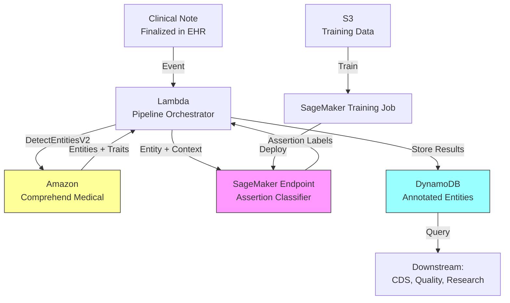

# Recipe 8.8 Architecture and Implementation: Clinical Assertion Classification

*Companion to [Recipe 8.8: Clinical Assertion Classification](chapter08.08-clinical-assertion-classification). This page covers the AWS architecture, services, prerequisites, and pseudocode. For the problem framing and the conceptual approach, start with the main recipe.*

---

## The AWS Implementation

### Why These Services

<!-- TODO (TechWriter): Expert review A1 (HIGH). Add SQS queue between EHR event and Lambda for retry/DLQ resilience. Failed notes are silently lost without this. At 2% transient failure rate and 200 notes/hour, ~2900 notes/month dropped. Add CloudWatch alarm on DLQ depth > 0. -->

**Amazon Comprehend Medical for entity extraction.** Comprehend Medical's `DetectEntitiesV2` API extracts clinical entities (medical conditions, medications, tests, procedures) from unstructured text and returns entity spans with category labels. It also provides basic assertion detection (negation and trait detection). For many use cases, Comprehend Medical's built-in assertion is sufficient. For the full multi-class assertion taxonomy (historical, conditional, hypothetical, family), you need to build a custom classification layer on top.

**Amazon SageMaker for custom assertion model.** When Comprehend Medical's built-in assertion categories are too coarse, deploy a custom fine-tuned transformer model on SageMaker. This gives you control over the assertion taxonomy, the training data, and the classification logic. SageMaker real-time endpoints provide low-latency inference for clinical decision support use cases. Batch transform handles high-volume research workloads. To minimize cold starts, configure a minimum instance count of 1 (keeps one instance warm 24/7, roughly $170/month for ml.m5.xlarge). For cost-sensitive deployments, consider SageMaker Serverless Inference (sub-second cold starts but lower throughput ceiling).

**Amazon S3 for note storage and training data.** Clinical notes land in S3 (encrypted, access-logged) before processing. Annotated training datasets for the assertion model also live in S3. The lifecycle: raw notes arrive, entities are extracted, assertion labels are applied, and annotated outputs are written back.

**AWS Lambda for pipeline orchestration.** For real-time assertion classification (triggered when a note is finalized), Lambda coordinates the pipeline: fetch the note, call Comprehend Medical for entity extraction, invoke the SageMaker endpoint for assertion classification, write results to the output store.

**Amazon DynamoDB for annotated entity storage.** Assertion-classified entities need to be queryable by patient, by entity type, by assertion status, and by date. DynamoDB's flexible schema handles the varying number of entities per note, and its point-lookup speed supports real-time clinical decision support queries.

### Architecture Diagram



### Prerequisites

| Requirement | Details |
|-------------|---------|
| **AWS Services** | Amazon Comprehend Medical, Amazon SageMaker, Amazon S3, AWS Lambda, Amazon DynamoDB |
| **IAM Permissions** | `comprehend:DetectEntitiesV2`, `sagemaker:InvokeEndpoint` (scoped to `arn:aws:sagemaker:{region}:{account}:endpoint/assertion-classifier-*`), `s3:GetObject`, `s3:PutObject`, `dynamodb:PutItem`, `dynamodb:Query` |
| **BAA** | AWS BAA signed (clinical notes are PHI) |
| **Encryption** | S3: SSE-KMS; DynamoDB: encryption at rest; SageMaker endpoint: turn on inter-container encryption (prevents data leaking between inference containers on shared hardware); all API calls over TLS |
| **VPC** | Production: Lambda and SageMaker in VPC with VPC endpoints for S3, Comprehend Medical, DynamoDB, and CloudWatch Logs. SageMaker endpoint: deploy with VPC configuration (PrivateLink) so inference traffic stays within the private network. Deploy across at least 2 AZs for production resilience. |
| **CloudTrail** | Enabled: log all Comprehend Medical and SageMaker API calls for audit |
| **Data Lifecycle** | DynamoDB TTL configured per institutional records retention policy (typically 7-10 years for adult records, longer for minors). S3 lifecycle policy for archived notes. |
| **Sample Data** | i2b2 2010 assertion corpus (requires a Data Use Agreement, which takes 2-4 weeks to get approved), MIMIC-III notes (requires PhysioNet credentials), or internally annotated clinical notes. Never use real PHI in dev without appropriate safeguards. |
| **Cost Estimate** | Comprehend Medical: ~$0.01 per 100 characters. SageMaker real-time endpoint (ml.m5.xlarge): ~$0.23/hour. At 50 notes/hour, roughly $0.005/note for inference. Total: ~$0.02/note. |

### Ingredients

| AWS Service | Role |
|------------|------|
| **Amazon Comprehend Medical** | Entity extraction with basic trait detection (negation) |
| **Amazon SageMaker** | Hosts custom assertion classification model (fine-tuned transformer) |
| **Amazon S3** | Stores clinical notes, training data, and model artifacts |
| **AWS Lambda** | Orchestrates the extraction-classification pipeline |
| **Amazon DynamoDB** | Stores assertion-annotated entities for downstream query |
| **AWS KMS** | Manages encryption keys for all data stores |
| **Amazon CloudWatch** | Logs, metrics, and alarms for pipeline health |

### Code

> **Reference implementations:** The following AWS sample repos demonstrate patterns relevant to this recipe:
>
> - [`amazon-comprehend-medical-fhir-integration`](https://github.com/aws-samples/amazon-comprehend-medical-fhir-integration): Demonstrates Comprehend Medical entity extraction and integration with clinical data standards
> - [`amazon-sagemaker-examples`](https://github.com/aws/amazon-sagemaker-examples): General SageMaker examples including NLP model training and deployment patterns

#### Walkthrough

**Step 1: Extract entities from clinical text.** The first stage identifies all clinical entities (conditions, medications, procedures, tests) in the note and returns their character positions and basic traits. Comprehend Medical's DetectEntitiesV2 handles this. It returns entities with category labels (MEDICAL_CONDITION, MEDICATION, TEST_TREATMENT_PROCEDURE) and basic traits including negation. For simple present/absent classification, this built-in negation trait may be sufficient. For the full assertion taxonomy, we use the extracted entities as input to the custom classifier in Step 3. Skip this step and you have no entities to classify. Get it wrong and assertion classification inherits the errors.

```pseudocode
FUNCTION extract_entities(note_text):
    // Call the medical NLP service to find clinical entities in the text.
    // The service returns each entity with:
    //   - text: the actual words ("chest pain", "diabetes")
    //   - category: what type of entity (condition, medication, etc.)
    //   - begin_offset / end_offset: character positions in the original text
    //   - traits: basic attributes including whether negation was detected
    //   - score: confidence in the entity detection (0.0 to 1.0)

    response = call MedicalNLP.DetectEntities with:
        text = note_text

    entities = empty list

    FOR each entity in response.Entities:
        // Only keep entities with high confidence to reduce noise
        IF entity.Score >= 0.80:
            append to entities: {
                text: entity.Text,
                category: entity.Category,
                begin_offset: entity.BeginOffset,
                end_offset: entity.EndOffset,
                traits: entity.Traits,
                score: entity.Score
            }

    RETURN entities
```

**Step 2: Extract context windows for each entity.** For each extracted entity, we pull a window of surrounding text that contains the assertion-relevant cues. The context window must include enough text for the classifier to identify negation cues, hedging language, section headers, and scope boundaries, without including irrelevant text that adds noise. In practice, 2-3 sentences around the entity works well. We also prepend the section header if we can detect it, because "diabetes" in a "Family History" section means something fundamentally different than "diabetes" in "Assessment."

```pseudocode
CONTEXT_WINDOW_CHARS = 300  // characters before and after the entity
                            // roughly 2-3 sentences of surrounding context

FUNCTION extract_context_windows(note_text, entities):
    // Build a context window around each entity for the assertion classifier.
    // The goal: give the classifier enough text to identify negation cues,
    // hedging language, and section-level context without overwhelming it.

    entity_contexts = empty list

    FOR each entity in entities:
        // Calculate window boundaries, clamping to document edges
        window_start = max(0, entity.begin_offset - CONTEXT_WINDOW_CHARS)
        window_end   = min(length(note_text), entity.end_offset + CONTEXT_WINDOW_CHARS)

        // Extract the context text
        context_text = note_text[window_start : window_end]

        // Calculate where the entity sits within this context window
        // The classifier needs to know which span is "the entity" vs. "the context"
        entity_start_in_context = entity.begin_offset - window_start
        entity_end_in_context   = entity.end_offset - window_start

        // Attempt to detect the section header for this region of the note.
        // Section headers like "Family History:" or "Assessment:" carry strong
        // assertion signals. If we can't detect one, that's fine; the classifier
        // can still work from the text context alone.
        section_header = detect_section_header(note_text, entity.begin_offset)

        append to entity_contexts: {
            entity: entity,
            context_text: context_text,
            entity_start_in_context: entity_start_in_context,
            entity_end_in_context: entity_end_in_context,
            section_header: section_header   // may be null if undetectable
        }

    RETURN entity_contexts
```

**Step 3: Classify assertion status.** This is the core step. For each entity in its context window, the assertion classifier predicts the factual status: present, absent, possible, conditional, historical, family, or hypothetical. In our hybrid approach, we first check if simple rules can resolve the assertion (clear negation patterns catch about 60% of absent cases quickly and cheaply). Everything the rules can't confidently classify goes to the ML model. The model input is the context text with the entity span marked using special tokens so the model knows exactly which concept to classify.

<!-- TODO (TechWriter): Expert review A2 (HIGH). Add two-tier threshold guidance: 0.70 (exclude from downstream until reviewed) and 0.85 (include with low_confidence flag, queue for review). Estimate reviewer time at 20-30s per entity. At 200 entities/day that's ~1.5 hours of reviewer time. Address whether low-confidence entities are included in downstream with caveats or excluded until reviewed. -->

```pseudocode
// Assertion classes the system can assign
ASSERTION_CLASSES = ["present", "absent", "possible", "conditional",
                     "historical", "family", "hypothetical"]

// Confidence threshold: below this, flag for human review
CONFIDENCE_THRESHOLD = 0.85

FUNCTION classify_assertions(entity_contexts):
    // Two-pass approach: rules first (fast, cheap), then ML model for the rest.

    results = empty list

    FOR each ctx in entity_contexts:

        // === Pass 1: Rule-based negation/section detection ===
        // Fast, deterministic, handles the obvious cases.
        rule_result = apply_assertion_rules(ctx)

        IF rule_result is not null AND rule_result.confidence >= CONFIDENCE_THRESHOLD:
            // Rules handled it confidently. No need to invoke the model.
            append to results: {
                entity: ctx.entity,
                assertion: rule_result.assertion,
                confidence: rule_result.confidence,
                method: "rule_based"
            }
            CONTINUE  // next entity

        // === Pass 2: ML model for ambiguous cases ===
        // Format input: insert [ENTITY] markers around the target span so
        // the model knows which concept to classify.
        // Example: "Patient denies [ENTITY]chest pain[/ENTITY] but reports..."
        model_input = format_model_input(ctx.context_text,
                                         ctx.entity_start_in_context,
                                         ctx.entity_end_in_context,
                                         ctx.section_header)

        // Call the trained assertion classifier
        prediction = call AssertionModel.predict(model_input)

        append to results: {
            entity: ctx.entity,
            assertion: prediction.assertion_class,
            confidence: prediction.confidence,
            method: "ml_model"
        }

    RETURN results


FUNCTION apply_assertion_rules(ctx):
    // Simple rule-based assertion detection for high-confidence cases.
    // Catches obvious negations, family history sections, and clear temporal cues.

    text_before_entity = lowercase(ctx.context_text[0 : ctx.entity_start_in_context])

    // Check section header first (strongest signal)
    IF ctx.section_header is not null:
        IF ctx.section_header matches ["family history", "fhx", "family hx"]:
            RETURN { assertion: "family", confidence: 0.95 }
        IF ctx.section_header matches ["past medical history", "pmh", "past surgical history"]:
            RETURN { assertion: "historical", confidence: 0.90 }

    // Check for clear negation cues within scope
    negation_cues = ["no ", "no evidence of", "denies", "denied", "negative for",
                     "without", "rules out", "ruled out", "absence of"]

    FOR each cue in negation_cues:
        IF cue is found in text_before_entity within 60 characters of entity:
            // Check for pseudo-negation patterns that look like negation but aren't
            // Example: "not only" or "no longer" (which implies it WAS present)
            IF NOT contains_pseudo_negation(text_before_entity, cue):
                RETURN { assertion: "absent", confidence: 0.92 }

    // Check for historical cues
    historical_cues = ["history of", "h/o", "s/p", "status post", "previously",
                       "prior", "in the past", "resolved"]
    FOR each cue in historical_cues:
        IF cue is found in text_before_entity within 40 characters of entity:
            RETURN { assertion: "historical", confidence: 0.88 }

    // Rules couldn't confidently classify this one
    RETURN null
```

**Step 4: Post-process and resolve conflicts.** When the same clinical concept appears multiple times in a note with different assertion statuses, we need to determine the "current truth." This step consolidates multiple mentions into a single assertion per unique concept. The precedence logic uses a default heuristic: the most recent, most specific mention in the note wins. A concept that is "historical" in Past Medical History but "present" in today's Assessment is currently present. A concept that is "possible" in the initial impression but "absent" in the final assessment (after workup) is absent.

<!-- TODO (TechWriter): Expert review A3 (HIGH). Conflict resolution oversimplifies clinical reality. The section-priority heuristic fails on copy-forward notes, multi-day notes, and cases where both assertions are valid for different clinical questions. Recommend: (1) retain all mentions with individual assertions rather than resolving to a single winner; (2) let downstream consumers specify resolution strategy via a conflict_resolution_strategy parameter; (3) acknowledge the heuristic is a default, not ground truth. Update pseudocode comment from "Pick the highest-priority one" to note this is a default heuristic. -->

```pseudocode
FUNCTION resolve_assertion_conflicts(classified_entities):
    // Group mentions of the same clinical concept and resolve to a single assertion.
    // This handles the common case where "diabetes" appears in PMH (historical)
    // AND in Assessment (present). The most clinically relevant assertion wins.
    //
    // NOTE: This section-priority approach is a default heuristic, not ground truth.
    // It handles the common case (Assessment reflects current clinical state) but
    // fails on copy-forward notes, multi-day notes, and situations where both
    // assertions are valid for different clinical questions. Production systems
    // should retain all mentions and let downstream consumers choose their
    // resolution strategy.

    // Precedence order (later in note + more specific = higher priority):
    // Assessment/Plan > HPI > Review of Systems > Past Medical History > Family History
    SECTION_PRIORITY = {
        "assessment": 5, "plan": 5, "a/p": 5,
        "hpi": 4, "history of present illness": 4,
        "ros": 3, "review of systems": 3,
        "pmh": 2, "past medical history": 2,
        "fhx": 1, "family history": 1
    }

    // Group entities by normalized text (same concept, different mentions)
    concept_groups = group classified_entities by normalized entity text

    resolved = empty list

    FOR each concept, mentions in concept_groups:
        IF length(mentions) == 1:
            // Only one mention. No conflict to resolve.
            append to resolved: mentions[0]
        ELSE:
            // Multiple mentions. Use section priority as a default heuristic.
            // (Break ties by position in note: later = higher priority.)
            best = select mention with highest section priority
            // Keep all mentions for audit, but mark the resolved assertion
            append to resolved: {
                entity: best.entity,
                assertion: best.assertion,
                confidence: best.confidence,
                method: best.method,
                all_mentions: mentions,   // full audit trail
                conflict_resolved: true
            }

    RETURN resolved
```

**Step 5: Store annotated entities.** Write the final assertion-classified entities to the database. Each record connects back to the source note, includes the full entity context for audit, and is indexed by patient, date, entity type, and assertion status. Downstream systems query this store to answer questions like "what conditions are currently present for this patient?" or "which patients have a family history of breast cancer?"

<!-- TODO (TechWriter): Expert review S1 (HIGH). Add DynamoDB TTL on a ttl_epoch attribute aligned with institutional records retention policy (typically 7-10 years). Document that context_snippet should live in a separate restricted-access audit table (finding S2, MEDIUM), and that the needs_review queue requires role-based access control and audit logging of reviewer actions (finding S3, MEDIUM). -->

```pseudocode
FUNCTION store_annotated_entities(patient_id, note_id, note_date, resolved_entities):
    // Write each assertion-annotated entity to the database.
    // Index by patient + assertion status for fast downstream queries.

    FOR each result in resolved_entities:
        write record to database table "assertion-annotated-entities":
            patient_id       = patient_id
            note_id          = note_id
            note_date        = note_date
            entity_text      = result.entity.text
            entity_category  = result.entity.category
            assertion_status = result.assertion           // present, absent, possible, etc.
            confidence       = result.confidence
            method           = result.method             // rule_based or ml_model
            needs_review     = (result.confidence < CONFIDENCE_THRESHOLD)
            context_snippet  = result.entity.context_text[relevant portion]
            processed_at     = current UTC timestamp (ISO 8601)

    // Also write a summary record for the note showing assertion distribution
    write summary to database table "note-assertion-summary":
        note_id     = note_id
        patient_id  = patient_id
        note_date   = note_date
        total_entities   = count of resolved_entities
        present_count    = count where assertion == "present"
        absent_count     = count where assertion == "absent"
        possible_count   = count where assertion == "possible"
        historical_count = count where assertion == "historical"
        family_count     = count where assertion == "family"
        review_needed    = count where needs_review == true
```

> **Curious how this looks in Python?** The pseudocode above covers the concepts. If you want working boto3 code that implements these steps, check out the [Python Example](chapter08.08-python-example). It walks through each step with inline comments and notes on what you'd need to change for a real deployment.

### Expected Results

**Sample output for a progress note excerpt:**

Input text: "Patient is a 62-year-old male with history of MI (2019). Currently denies chest pain. Mother had breast cancer. Possible early-stage CKD based on labs. If GFR drops below 30, will initiate nephrology referral."

```json
{
  "note_id": "note-2026-03-15-00847",
  "patient_id": "pat-00291",
  "annotated_entities": [
    {
      "entity_text": "MI",
      "category": "MEDICAL_CONDITION",
      "assertion": "historical",
      "confidence": 0.96,
      "method": "rule_based",
      "context": "history of MI (2019)"
    },
    {
      "entity_text": "chest pain",
      "category": "MEDICAL_CONDITION",
      "assertion": "absent",
      "confidence": 0.98,
      "method": "rule_based",
      "context": "denies chest pain"
    },
    {
      "entity_text": "breast cancer",
      "category": "MEDICAL_CONDITION",
      "assertion": "family",
      "confidence": 0.95,
      "method": "rule_based",
      "context": "Mother had breast cancer"
    },
    {
      "entity_text": "CKD",
      "category": "MEDICAL_CONDITION",
      "assertion": "possible",
      "confidence": 0.91,
      "method": "ml_model",
      "context": "Possible early-stage CKD based on labs"
    },
    {
      "entity_text": "nephrology referral",
      "category": "TEST_TREATMENT_PROCEDURE",
      "assertion": "conditional",
      "confidence": 0.88,
      "method": "ml_model",
      "context": "If GFR drops below 30, will initiate nephrology referral"
    }
  ]
}
```

**Performance benchmarks:**

| Metric | Typical Value |
|--------|---------------|
| End-to-end latency (per note) | 1.5-4 seconds (varies by note length) |
| Entity extraction accuracy | 85-92% F1 (Comprehend Medical) |
| Assertion classification (present/absent) | 93-97% F1 |
| Assertion classification (full 7-class) | 88-93% F1 |
| Rule-based coverage | ~60% of entities resolved by rules |
| Cost per note | ~$0.02 (Comprehend Medical + SageMaker) |
| Throughput (batch) | ~200 notes/minute per SageMaker instance |

**Where it struggles:**

- Double negations ("not without concern for") confuse both rules and models
- Implicit assertions where the cue is far from the entity (scope > 3 sentences)
- Notes with poor sentence boundaries (run-on documentation, copy-forward artifacts)
- Specialty-specific conventions (surgical notes use different temporal language than internal medicine)
- Assertions that depend on document-level context ("same as prior" requires reading the previous note)

---

## Why This Isn't Production-Ready

**Training data quality.** The pseudocode assumes you have a labeled assertion dataset. Getting that dataset is the hard part. You need clinical annotators (not crowdsourced workers) who understand the difference between "possible" and "conditional" in medical context. Inter-annotator agreement on the full 7-class taxonomy is typically 0.75-0.85 kappa. Budget for disagreement resolution.

**Model drift.** Clinical documentation patterns change. New EHR templates introduce new section naming. New clinicians bring different documentation styles. A model trained on 2024 notes may underperform on 2026 notes. You need ongoing monitoring and periodic retraining. Monitor: (1) confidence score distribution over time (a shift toward lower scores indicates drift); (2) rule-vs-model ratio (if rules handle less than 50% of entities, something changed in documentation patterns); (3) human reviewer agreement rate on `needs_review` items. Alert when weekly average confidence drops below 0.80 or rule coverage drops below 50%.

**Error propagation from entity extraction.** If the entity extraction step misidentifies entity boundaries (splits "chest pain" into "chest" and "pain," or merges "no chest pain, no shortness of breath" into a single entity), assertion classification inherits those errors. Joint extraction-assertion models mitigate this but are harder to build and debug.

**Real-time vs. batch trade-off.** The SageMaker endpoint adds latency and cost. For batch research workloads, SageMaker batch transform is cheaper. For real-time CDS, you need the endpoint running 24/7 (which means paying for it 24/7, even at 3 AM when volume is low). Auto-scaling helps but introduces cold-start latency of 5-15 seconds after scale-up.

---

## Variations and Extensions

**Active problem list maintenance.** Pipe assertion-classified entities directly into EHR problem list management. Entities classified as "present" become candidate additions. Entities classified as "historical" or "absent" (for things currently on the problem list) become candidate removals. Always surface these as suggestions for clinician review, never auto-modify the problem list.

**Quality measure calculation.** Many quality measures (HEDIS, CMS stars) require determining whether a patient has a specific condition. Assertion classification turns this from a manual chart review task into an automated one. Filter to entities with assertion = "present" and confidence >= 0.90 for measure-eligible conditions. Route lower-confidence cases to manual abstraction.

**Multi-language assertion.** Clinical documentation in the US is primarily English, but patient-generated text (portal messages, intake forms) and documentation at multilingual institutions may include Spanish or other languages. Assertion cues vary by language ("niega" = "denies" in Spanish). A multilingual assertion model or language-specific rule sets extend coverage to these populations.

**Batch processing for research.** For research workloads processing 100K+ historical notes: replace Lambda orchestration with Step Functions. Use SageMaker Batch Transform instead of real-time endpoints. Process notes in parallel batches of 100-500. Expected throughput: ~200 notes/minute per SageMaker instance with batch transform. A 100K note research corpus processes in roughly 8 hours on a single instance, or about 1 hour with 8-way parallelism.

---

## Additional Resources

**AWS Documentation:**
- [Amazon Comprehend Medical DetectEntitiesV2 API](https://docs.aws.amazon.com/comprehend-medical/latest/dev/textanalysis-entitiesv2.html)
- [Amazon Comprehend Medical Traits and Attributes](https://docs.aws.amazon.com/comprehend-medical/latest/dev/textanalysis-medical-conditions.html)
- [Amazon SageMaker Real-Time Inference](https://docs.aws.amazon.com/sagemaker/latest/dg/realtime-endpoints.html)
- [Amazon SageMaker Batch Transform](https://docs.aws.amazon.com/sagemaker/latest/dg/batch-transform.html)
- [AWS HIPAA Eligible Services](https://aws.amazon.com/compliance/hipaa-eligible-services-reference/)

**AWS Sample Repos:**
- [`amazon-comprehend-medical-fhir-integration`](https://github.com/aws-samples/amazon-comprehend-medical-fhir-integration): Comprehend Medical output integrated with FHIR clinical data standards
- [`amazon-sagemaker-examples`](https://github.com/aws/amazon-sagemaker-examples): SageMaker training and deployment patterns for NLP models

**AWS Solutions and Blogs:**
- [Health AI and Machine Learning on AWS](https://aws.amazon.com/health/machine-learning/): Overview of AWS health AI capabilities including Comprehend Medical
- [Building NLP Pipelines with Amazon Comprehend Medical](https://aws.amazon.com/blogs/machine-learning/building-a-medical-language-processing-pipeline-using-amazon-comprehend-medical/): End-to-end clinical NLP pipeline architecture

**Academic References (for assertion methodology):**
<!-- TODO (TechWriter): Verify current URL for i2b2 2010 Assertion shared task description -->
<!-- TODO (TechWriter): Verify current URL for NegEx/ConText algorithm paper (Chapman et al.) -->

---

## Estimated Implementation Time

| Tier | Timeline | What You Get |
|------|----------|--------------|
| **Basic** | 2-3 weeks | Comprehend Medical entities + built-in negation traits. Present/absent only. |
| **Production-ready** | 8-12 weeks | Custom assertion model (7-class), rule-based pre-filter, conflict resolution, monitoring, human review queue. Requires annotated training data. |
| **With variations** | 14-18 weeks | Add active problem list integration, quality measure automation, multi-specialty model variants. |

---


---

*← [Main Recipe 8.8](chapter08.08-clinical-assertion-classification) · [Python Example](chapter08.08-python-example) · [Chapter Preface](chapter08-preface)*
