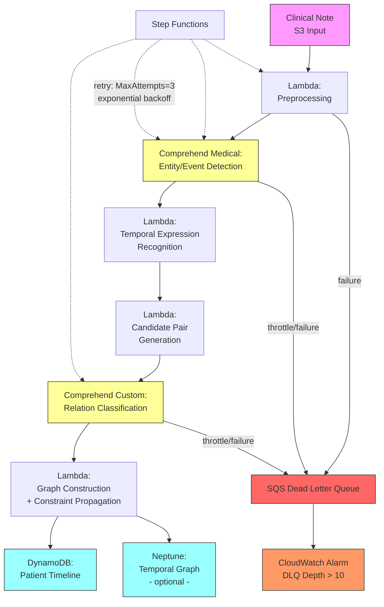

# Recipe 8.9 Architecture and Implementation: Temporal Relationship Extraction

*Companion to [Recipe 8.9: Temporal Relationship Extraction](chapter08.09-temporal-relationship-extraction). This page covers the AWS architecture, services, prerequisites, and pseudocode. For the problem framing and the conceptual approach, start with the main recipe.*

---

## The AWS Implementation

### Why These Services

**Amazon Comprehend Medical for entity and event detection.** Comprehend Medical's clinical NER identifies medical conditions, medications, procedures, and test results with their associated attributes (including negation and temporality markers). It provides a strong foundation for event identification. While it doesn't perform full temporal relation classification, its entity output with temporal attributes (PAST_HISTORY, OCCURRENCE) gives you a head start on event temporal anchoring.

**Amazon Comprehend (custom classification) for relation classification.** Train a custom classifier on temporal relation labeled data. Comprehend's custom classification accepts text inputs (context windows around entity pairs) and predicts relation labels. For the relation classification step, you format each candidate pair with its surrounding context as a classification input. (Note: the Python companion uses a SageMaker endpoint for this step because temporal relation classification requires sequence pair input with entity markers, which maps more naturally to a custom-hosted model. Both approaches are valid; choose based on your model architecture needs.)

**AWS Lambda for orchestration.** The pipeline is a stateless sequence: receive text, extract entities, generate pairs, classify relations, build graph. Lambda handles this cleanly, with Step Functions for longer documents that need coordination across multiple classification calls.

**Amazon S3 for document and model storage.** Clinical text inputs, training data, and model artifacts all live in encrypted S3. The temporal annotation training corpus is a critical asset that needs versioning and access control.

**Amazon DynamoDB for timeline storage.** Patient timelines are write-heavy during construction and read-heavy during clinical use. DynamoDB's key-value model works well for timeline segments indexed by patient ID and time range.

**Amazon Neptune (optional) for temporal graph storage.** If your use case requires querying the temporal graph structure directly (traversing relationships, finding all events between two dates, identifying temporal patterns across patients), Neptune's graph database is a natural fit. For simpler use cases where you just need the flattened timeline, DynamoDB suffices.

### Architecture Diagram



**Error handling architecture.** The pipeline uses Step Functions for orchestration with built-in retry logic. Configure retries with `MaxAttempts=3` and exponential backoff (specifically for Comprehend Medical throttling, which happens under burst load). Any Lambda that fails after retries sends the event to an SQS dead letter queue. Set a CloudWatch alarm on DLQ depth greater than 10 messages. A growing DLQ means notes are failing silently, which means gaps in patient timelines that nobody knows about until a clinician notices missing events.

### Prerequisites

| Requirement | Details |
|-------------|---------|
| **AWS Services** | Amazon Comprehend Medical, Amazon Comprehend (Custom Classification), AWS Lambda, Amazon S3, Amazon DynamoDB, AWS Step Functions, (optional) Amazon Neptune |
| **IAM Permissions** | `comprehendmedical:DetectEntitiesV2`, `comprehend:ClassifyDocument`, `s3:GetObject`, `s3:PutObject`, `dynamodb:PutItem`, `dynamodb:Query`, `states:StartExecution` |
| **BAA** | AWS BAA signed (required: clinical notes contain PHI) |
| **Encryption** | S3: SSE-KMS; DynamoDB: encryption at rest; Neptune: encryption at rest; all API calls over TLS |
| **VPC** | Production: Lambda in VPC with VPC endpoints for S3, Comprehend Medical, Comprehend, DynamoDB, Step Functions, CloudWatch Logs |
| **CloudTrail** | Enabled: log all Comprehend Medical API calls for HIPAA audit |
| **Training Data** | Temporal relation annotated clinical corpus (minimum 500-1000 annotated documents). See THYME corpus licensing for research use. Production systems need institution-specific annotations. |
| **Training Corpus Access Control** | Separate S3 bucket for training data, isolated from inference pipeline. Bucket policy restricts access to ML training roles only. S3 access logging enabled for audit. Versioning enabled for annotation provenance (so you can trace which annotations produced which model version). |
| **Data Retention / Lifecycle** | DynamoDB: TTL configured per institutional records retention policy (typically 7-10 years for adult records, longer for minors per state law). Neptune: scheduled deletion jobs for graph data past retention window. S3: lifecycle policy transitions processed clinical notes to Glacier after 90 days, expires after retention period. Coordinate with records management on per-data-type schedules rather than a single global policy. |
| **Cost Estimate** | Comprehend Medical: ~$0.01 per 100 characters. Custom Classification: ~$0.0005 per request. At ~50 candidate pairs per note: ~$0.03 per note total. |

### Ingredients

| AWS Service | Role |
|------------|------|
| **Amazon Comprehend Medical** | Entity and event detection with temporal attributes |
| **Amazon Comprehend Custom** | Temporal relation classification (trained on annotated corpus) |
| **AWS Lambda** | Preprocessing, temporal expression recognition, pair generation, graph construction |
| **Amazon S3** | Document storage, training corpus, model artifacts |
| **Amazon DynamoDB** | Patient timeline storage and retrieval |
| **AWS Step Functions** | Pipeline orchestration for multi-step processing |
| **AWS KMS** | Encryption key management for PHI data |
| **Amazon Neptune** | (Optional) Graph storage for temporal relationship querying |

### Pseudocode Walkthrough

**Step 1: Preprocess and segment the clinical note.** Before any temporal analysis, the system needs to understand the document's structure. Section headers carry temporal information: "History of Present Illness" implies past-to-present narrative, "Past Medical History" implies historical events, "Assessment and Plan" implies current and future. The system identifies sections, splits sentences, and extracts the document creation timestamp (the temporal anchor for all relative expressions). Skip this step and relative expressions like "yesterday" or "three days ago" have no anchor point.

```pseudocode
FUNCTION preprocess_note(note_text, document_metadata):
    // Extract document creation time: the anchor for all relative temporal expressions.
    // Clinical notes are frequently authored hours after the encounter.
    // Use the note's authoring timestamp, not the encounter date.
    doc_time = document_metadata.authored_datetime

    // Identify sections by header patterns.
    // Each section carries implicit temporal context.
    sections = segment_into_sections(note_text)
    // Result: list of {header, content, temporal_context}
    // where temporal_context is one of: HISTORICAL, CURRENT, FUTURE, NARRATIVE

    // Split into sentences. Clinical text has non-standard boundaries:
    // abbreviations with periods ("pt. reported"), numbered lists, lab values with decimals.
    sentences = clinical_sentence_split(note_text)

    RETURN {
        doc_time: doc_time,
        sections: sections,
        sentences: sentences,
        full_text: note_text
    }
```

**Step 2: Detect clinical events and temporal expressions.** This step identifies two categories of temporal entities: clinical events (diagnoses, procedures, medication actions, symptoms) and temporal expressions (dates, durations, relative time references). Clinical events come from medical NER. Temporal expressions require a dedicated parser that handles both standard date formats and clinical-specific patterns (POD#2, HD5, "postoperatively"). Each temporal expression gets normalized to a standard representation anchored to the document timestamp.

```pseudocode
FUNCTION detect_temporal_entities(preprocessed_note):
    // Run medical NER to find clinical events.
    // Events include: conditions, procedures, medications, tests, symptoms.
    // Each event gets attributes: type, polarity (positive/negated), modality.
    medical_entities = call_medical_NER(preprocessed_note.full_text)

    // Filter to entities that represent temporal events (not just static attributes).
    // A diagnosis IS an event (it was diagnosed at some point).
    // A lab value IS an event (the test was performed at some point).
    // A body part is NOT an event (it has no temporal component).
    events = filter_to_events(medical_entities)

    // Run temporal expression recognition.
    // Handles: absolute dates, relative expressions, durations, clinical patterns.
    temporal_expressions = recognize_temporal_expressions(
        preprocessed_note.full_text,
        preprocessed_note.doc_time  // anchor for resolving "yesterday," "last week," etc.
    )

    // Normalize each temporal expression to an ISO 8601 value (or range).
    FOR each texpr in temporal_expressions:
        texpr.normalized = normalize_to_iso8601(texpr.raw_text, preprocessed_note.doc_time)
        // Examples:
        //   "March 3, 2024" -> "2024-03-03"
        //   "two days ago" (doc_time = 2024-03-07) -> "2024-03-05"
        //   "POD#2" (surgery_date = 2024-03-06) -> "2024-03-08"
        //   "for 3 months" -> duration: "P3M"

    RETURN {
        events: events,
        temporal_expressions: temporal_expressions
    }
```

**Step 3: Generate candidate pairs for classification.** With N events and M temporal expressions in a note, the full pairwise space is enormous. This step applies filtering heuristics to select only pairs that are likely to have a meaningful temporal relationship. The primary heuristics: same-sentence pairs (highest probability of explicit temporal relationship), adjacent-sentence pairs (narrative flow typically implies temporal ordering), pairs connected by a temporal signal word ("before," "after," "then," "while"), and event-to-nearest-temporal-expression pairs. This reduces the classification workload dramatically while preserving most recall.

```pseudocode
FUNCTION generate_candidate_pairs(events, temporal_expressions, sentences):
    candidates = empty list
    all_entities = events + temporal_expressions

    FOR each entity_a in all_entities:
        FOR each entity_b in all_entities:
            IF entity_a == entity_b:
                CONTINUE

            // Heuristic 1: Same sentence (highest signal).
            IF same_sentence(entity_a, entity_b, sentences):
                append to candidates: (entity_a, entity_b, "same_sentence")
                CONTINUE

            // Heuristic 2: Adjacent sentences (narrative flow).
            IF adjacent_sentences(entity_a, entity_b, sentences):
                append to candidates: (entity_a, entity_b, "adjacent")
                CONTINUE

            // Heuristic 3: Connected by temporal signal word.
            IF temporal_signal_between(entity_a, entity_b):
                // Signal words: "before," "after," "then," "while," "during,"
                // "subsequently," "prior to," "following"
                append to candidates: (entity_a, entity_b, "signal_connected")
                CONTINUE

            // Heuristic 4: Event paired with nearest temporal expression.
            IF entity_a is EVENT and entity_b is TEMPORAL_EXPRESSION:
                IF is_nearest_temporal(entity_a, entity_b):
                    append to candidates: (entity_a, entity_b, "nearest_anchor")

            // Heuristic 5: Section-anchored pairs (cross-section relationships).
            // Events in different sections that share a temporal expression or are
            // both anchored to the same clinical episode (same admission, same procedure).
            // This captures cross-section relationships like HPI events linked to
            // Hospital Course events in discharge summaries.
            IF different_sections(entity_a, entity_b):
                IF shared_temporal_anchor(entity_a, entity_b) OR
                   same_clinical_episode(entity_a, entity_b):
                    append to candidates: (entity_a, entity_b, "section_anchored")

    // Deduplicate: (A,B) and (B,A) are the same pair.
    candidates = deduplicate_pairs(candidates)

    RETURN candidates
```

**Step 4: Classify temporal relationships.** For each candidate pair, extract a context window and classify the temporal relationship. The context window includes: the text of both entities, the sentence(s) containing them, the section header, and any temporal signal words between them. The classifier predicts one of: BEFORE, AFTER, OVERLAP, CONTAINS, or NONE. Confidence scores determine which relations are included in the final graph (low-confidence relations are excluded or marked as uncertain).

```pseudocode
TEMPORAL_RELATION_LABELS = ["BEFORE", "AFTER", "OVERLAP", "CONTAINS", "NONE"]
CONFIDENCE_THRESHOLD = 0.70  // relations below this confidence are excluded

FUNCTION classify_relations(candidate_pairs, full_text, sections):
    classified_relations = empty list

    FOR each (entity_a, entity_b, pair_type) in candidate_pairs:
        // Build the classification input: a formatted text string containing
        // both entities marked with special tokens, their surrounding context,
        // and section information.
        context_window = build_context_window(
            entity_a, entity_b, full_text, sections,
            window_size = 3  // sentences of context on each side
        )

        // Format for classifier:
        // "[E1] cholecystectomy [/E1] was performed after [E2] antibiotics [/E2] were started"
        formatted_input = format_for_classification(context_window, entity_a, entity_b)

        // Call the trained relation classifier.
        prediction = classify_temporal_relation(formatted_input)
        // Returns: {label: "BEFORE", confidence: 0.87}

        IF prediction.confidence >= CONFIDENCE_THRESHOLD:
            append to classified_relations: {
                entity_a: entity_a,
                entity_b: entity_b,
                relation: prediction.label,   // e.g., "BEFORE" means entity_a before entity_b
                confidence: prediction.confidence,
                evidence: context_window       // stored in separate audit table, restricted access
                // Note: downstream timeline APIs return only structured fields (event_text,
                // event_type, timestamp, confidence), never raw clinical narrative.
            }

    RETURN classified_relations
```

**Step 5: Build the temporal graph and propagate constraints.** Assemble all classified relations into a directed graph. Then apply temporal constraint propagation to infer additional relations: if A BEFORE B and B BEFORE C, then A BEFORE C. This step also detects inconsistencies (cycles in the BEFORE/AFTER graph indicate classification errors). Inconsistencies are resolved by removing the lowest-confidence edge in the cycle. The final graph is a consistent temporal ordering of all events in the document.

```pseudocode
FUNCTION build_temporal_graph(classified_relations, events, temporal_expressions):
    // Initialize graph. Nodes are events and temporal expressions.
    // Edges are temporal relations with confidence scores.
    graph = new DirectedGraph()

    FOR each entity in (events + temporal_expressions):
        graph.add_node(entity.id, attributes = entity)

    FOR each relation in classified_relations:
        graph.add_edge(
            from = relation.entity_a.id,
            to = relation.entity_b.id,
            label = relation.relation,
            confidence = relation.confidence
        )

    // Constraint propagation: infer transitive relations.
    // If A BEFORE B and B BEFORE C, add edge A BEFORE C.
    inferred = apply_transitivity(graph)
    FOR each inferred_relation in inferred:
        graph.add_edge(inferred_relation, inferred = true)

    // Consistency check: detect cycles in BEFORE/AFTER subgraph.
    // A cycle means contradictory temporal claims.
    cycles = detect_cycles(graph, relation_types = ["BEFORE", "AFTER"])
    FOR each cycle in cycles:
        // Remove the lowest-confidence edge to break the cycle.
        weakest_edge = find_min_confidence_edge(cycle)
        graph.remove_edge(weakest_edge)
        log_inconsistency(cycle, removed_edge = weakest_edge)

    RETURN graph
```

**Step 6: Generate the patient timeline.** Flatten the temporal graph into a linear timeline. Events anchored to absolute dates get placed precisely. Events with only relative relationships get placed in order relative to their anchors. The output is a chronological sequence of clinical events with timestamps (exact or approximate), durations where known, and confidence scores.

```pseudocode
FUNCTION generate_timeline(temporal_graph, doc_time):
    timeline = empty list

    // First pass: anchor events with absolute timestamps.
    // Any event directly linked to a normalized temporal expression gets a timestamp.
    FOR each event_node in temporal_graph.event_nodes():
        anchored_time = find_absolute_anchor(event_node, temporal_graph)
        IF anchored_time is not NULL:
            event_node.timestamp = anchored_time
            event_node.timestamp_type = "ABSOLUTE"

    // Second pass: propagate timestamps through the graph.
    // Events with BEFORE/AFTER relations to anchored events get approximate times.
    FOR each unanchored_event in temporal_graph.unanchored_events():
        inferred_time = propagate_timestamp(unanchored_event, temporal_graph)
        IF inferred_time is not NULL:
            unanchored_event.timestamp = inferred_time
            unanchored_event.timestamp_type = "INFERRED"
        ELSE:
            // Cannot determine absolute time. Assign relative ordering only.
            unanchored_event.timestamp = NULL
            unanchored_event.timestamp_type = "RELATIVE_ONLY"
            unanchored_event.relative_position = compute_relative_order(
                unanchored_event, temporal_graph
            )

    // Build sorted timeline.
    FOR each event_node in temporal_graph.event_nodes():
        append to timeline: {
            event_id: event_node.id,
            event_text: event_node.text,
            event_type: event_node.type,
            timestamp: event_node.timestamp,
            timestamp_type: event_node.timestamp_type,
            confidence: event_node.confidence,
            section: event_node.section
        }

    // Sort: absolute timestamps first (chronological),
    // then relative-only events in their inferred order.
    sort timeline by timestamp (absolute first, then relative order)

    RETURN {
        patient_id: document_metadata.patient_id,
        document_id: document_metadata.document_id,
        doc_time: doc_time,
        timeline: timeline,
        event_count: length(timeline),
        anchored_count: count where timestamp_type == "ABSOLUTE",
        inferred_count: count where timestamp_type == "INFERRED"
    }
```

> **Curious how this looks in Python?** The pseudocode above covers the concepts. If you'd like to see sample Python code that demonstrates these patterns using boto3, check out the [Python Example](chapter08.09-python-example). It walks through each step with inline comments and notes on what you'd need to change for a real deployment.

### Expected Results

**Sample output for a discharge summary:**

```json
{
  "patient_id": "PAT-2024-88431",
  "document_id": "NOTE-2024-03-07-001",
  "doc_time": "2024-03-07T14:30:00Z",
  "timeline": [
    {
      "event_id": "EVT-001",
      "event_text": "acute cholecystitis",
      "event_type": "DIAGNOSIS",
      "timestamp": "2024-03-03T00:00:00Z",
      "timestamp_type": "ABSOLUTE",
      "confidence": 0.95,
      "section": "HPI"
    },
    {
      "event_id": "EVT-002",
      "event_text": "IV antibiotics started",
      "event_type": "TREATMENT",
      "timestamp": "2024-03-03T00:00:00Z",
      "timestamp_type": "INFERRED",
      "confidence": 0.82,
      "section": "HPI"
    },
    {
      "event_id": "EVT-003",
      "event_text": "pain improved",
      "event_type": "SYMPTOM_CHANGE",
      "timestamp": "2024-03-05T00:00:00Z",
      "timestamp_type": "INFERRED",
      "confidence": 0.88,
      "section": "HPI"
    },
    {
      "event_id": "EVT-004",
      "event_text": "laparoscopic cholecystectomy",
      "event_type": "PROCEDURE",
      "timestamp": "2024-03-06T00:00:00Z",
      "timestamp_type": "ABSOLUTE",
      "confidence": 0.97,
      "section": "HPI"
    },
    {
      "event_id": "EVT-005",
      "event_text": "discharged home",
      "event_type": "DISPOSITION",
      "timestamp": "2024-03-07T00:00:00Z",
      "timestamp_type": "INFERRED",
      "confidence": 0.91,
      "section": "DISCHARGE"
    }
  ],
  "event_count": 5,
  "anchored_count": 2,
  "inferred_count": 3,
  "temporal_relations": [
    {"from": "EVT-001", "to": "EVT-002", "relation": "BEFORE", "confidence": 0.82},
    {"from": "EVT-002", "to": "EVT-003", "relation": "BEFORE", "confidence": 0.88},
    {"from": "EVT-003", "to": "EVT-004", "relation": "BEFORE", "confidence": 0.92},
    {"from": "EVT-004", "to": "EVT-005", "relation": "BEFORE", "confidence": 0.91}
  ]
}
```

**Performance benchmarks:**

| Metric | Typical Value |
|--------|---------------|
| Temporal expression recognition F1 | 0.85-0.92 |
| Event detection F1 | 0.80-0.88 |
| Relation classification F1 | 0.70-0.80 |
| End-to-end timeline accuracy | 0.65-0.75 |
| Processing latency per note | 5-15 seconds |
| Cost per note | ~$0.03 |
| Throughput | ~10-20 notes/second (with Lambda concurrency) |

**Where it struggles:**

- Events with no explicit temporal cue (ordering inferred only from clinical logic)
- Long documents with many events (pair explosion, even with heuristic filtering)
- Cross-sentence temporal reasoning where the signal word is far from both entities
- Domain-specific temporal patterns not seen in training data (institution-specific abbreviations)
- Vague temporal expressions ("recently," "in the past") that resist normalization
- Discharge summaries that summarize weeks of events in condensed narrative form

---

## Why This Isn't Production-Ready

The pseudocode and architecture above demonstrate the pattern. Deploying this against a live clinical data warehouse requires closing several gaps that are intentionally outside the scope of a cookbook recipe:

**Model retraining cadence.** Clinical documentation patterns drift. New EHR templates, new providers, new temporal conventions (oncology cycle notation, clinical trial protocol days) all introduce patterns the model hasn't seen. Plan for quarterly retraining cycles with fresh annotations. Monitor mean classification confidence over time; a downward shift signals distribution drift before accuracy metrics catch up.

**Annotation pipeline.** The relation classifier needs labeled training data, and that data needs to come from your institution's note population (not just a research corpus). Budget for a sustained annotation program: clinical annotators reviewing temporal pairs, adjudicating disagreements, and feeding corrections back into the training set. This is an ongoing cost, not a one-time investment.

**Cross-document timeline linking.** This pipeline processes one note at a time. A patient's full timeline spans hundreds of notes across years. Merging single-document timelines into a longitudinal patient record requires cross-document event coreference resolution (is "the knee pain" in two notes the same episode?), conflict resolution logic, and incremental graph updates. That is a separate system built on top of this extraction layer.

**Human-in-the-loop review workflows.** Low-confidence relations, detected inconsistencies (broken cycles), and notes with abnormally low extraction counts all need clinical review. Build a review queue with a lightweight annotation UI so clinicians can confirm, correct, or reject timeline entries. The correction data feeds back into model retraining.

**Institution-specific temporal pattern tuning.** Every health system has its own abbreviations, section headers, and temporal conventions. The candidate pair heuristics (sentence distance thresholds, section-anchoring logic) and temporal expression patterns need tuning per document type and per specialty. Your neurologists write differently than your surgeons, and both write differently than the training corpus defaults.

---

## Variations and Extensions

**Cross-document longitudinal timeline.** Extend the single-document pipeline to construct a patient's full longitudinal timeline from all available notes. This requires: (1) cross-document coreference resolution to link the same clinical event across notes, (2) timeline merging logic to combine single-document timelines into a master timeline, and (3) conflict resolution when two documents imply contradictory temporal orderings. Start with a simple approach: anchor each document's timeline to its creation date and merge chronologically. Add cross-document event linking as a second phase.

**Real-time timeline construction during documentation.** Integrate with ambient documentation or EHR note entry to build the timeline as the clinician writes. Each sentence is processed incrementally, and the timeline updates in real time. This gives the clinician immediate feedback: "You mentioned surgery on March 6 but the admission note says March 3 admission. Is the surgery date correct?" Catches documentation errors at the point of authoring.

**Temporal pattern mining across patient populations.** Once you have structured timelines for many patients, you can mine temporal patterns: "What is the typical time between diagnosis and surgery for cholecystitis?" "Patients who develop complication X typically show symptom Y 2-3 days before." This extends from individual patient timelines into population-level temporal analytics. Useful for quality measurement, care pathway optimization, and clinical research.

---

## Additional Resources

**AWS Documentation:**
- [Amazon Comprehend Medical DetectEntitiesV2 API Reference](https://docs.aws.amazon.com/comprehend-medical/latest/dev/API_medical_DetectEntitiesV2.html)
- [Amazon Comprehend Custom Classification](https://docs.aws.amazon.com/comprehend/latest/dg/how-document-classification.html)
- [Amazon Comprehend Medical Pricing](https://aws.amazon.com/comprehend/medical/pricing/)
- [AWS HIPAA Eligible Services](https://aws.amazon.com/compliance/hipaa-eligible-services-reference/)
- [Amazon Neptune Developer Guide](https://docs.aws.amazon.com/neptune/latest/userguide/intro.html)
- [Architecting for HIPAA on AWS (Whitepaper)](https://docs.aws.amazon.com/whitepapers/latest/architecting-hipaa-security-and-compliance-on-aws/welcome.html)

**Research and Standards:**
- THYME (Temporal Histories of Your Medical Events) corpus: available through the Mayo Clinic / University of Colorado collaboration. Contact the THYME project team for access licensing.
- i2b2 2012 Temporal Relations shared task dataset: access through n2c2 (successor to i2b2 challenges) at the Harvard DBMI n2c2 data portal.
- TimeML specification: defines the temporal annotation standard that clinical temporal systems extend

**Clinical NLP Resources:**
- HeidelTime: open-source temporal expression recognition tool, available on GitHub under the HeidelTime project. Supports clinical domain extensions.
- Apache cTAKES: temporal module documentation available at the Apache cTAKES project site. Includes temporal relation extraction components built on the THYME annotations.

---

## Estimated Implementation Time

| Phase | Duration |
|-------|----------|
| Basic (rule-based temporal expression recognition + heuristic ordering) | 3-4 weeks |
| Production-ready (trained relation classifier + graph construction + API) | 10-14 weeks |
| With variations (cross-document, real-time, population mining) | 16-22 weeks |

---

---

*← [Main Recipe 8.9](chapter08.09-temporal-relationship-extraction) · [Python Example](chapter08.09-python-example) · [Chapter Preface](chapter08-preface)*
