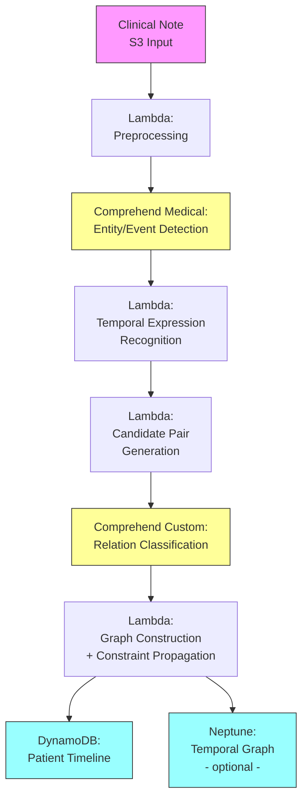

# Recipe 8.9: Temporal Relationship Extraction

**Complexity:** Complex · **Phase:** Advanced NLP Pipeline · **Estimated Cost:** ~$0.03 per note

---

## The Problem

A discharge summary reads: "Patient admitted on March 3 with acute cholecystitis. Started on IV antibiotics. Pain improved after 48 hours. Laparoscopic cholecystectomy performed on March 6. Discharged home on postoperative day 1 in stable condition."

A human reads this and immediately constructs a timeline: admission, then antibiotics, pain improvement two days later, surgery on day four, discharge the next day. Five events, an unambiguous temporal ordering, and a clear story of clinical progression.

Now try to get a computer to build that timeline.

The text gives you one explicit date (March 3), one derived date (March 6), one relative time expression ("after 48 hours"), one domain-specific temporal anchor ("postoperative day 1"), and one completely implicit ordering (antibiotics started sometime between admission and pain improvement, probably within hours, but that's your clinical inference talking, not anything stated in the text). Oh, and the discharge date? Nowhere explicitly. You have to calculate it: March 6 surgery + 1 day = March 7. A computer that just extracts dates misses most of the temporal structure.

This is the default state of clinical documentation. Clinicians write narratives, not timelines. They assume the reader has enough medical context to infer temporal ordering from clinical logic. "Started antibiotics. Cultures grew E. coli at 72 hours." No reader wonders which came first. But a machine parsing that text sees two events with no explicit temporal connective between them.

The impact of getting temporal relationships wrong propagates everywhere:

A medication reconciliation system needs to know whether "metoprolol 50mg" was the dose before or after the dose change documented in the same note. A clinical trial screening system needs to know if the patient's cancer diagnosis preceded or followed their kidney transplant (different eligibility criteria). A pharmacovigilance system needs to know if the adverse event happened before or after the suspect medication was administered (the entire causality assessment depends on this temporal ordering). A care timeline displayed to a covering physician at 2 AM needs events in the right order, or clinical decisions get made on scrambled information.

Without temporal relationship extraction, you have a bag of clinical events floating in time with no anchoring, no ordering, and no duration. You have facts without a story. And in medicine, the story is the diagnosis.

---

## The Technology: Teaching Machines to Understand Clinical Time

### What Is Temporal Relationship Extraction?

Temporal relationship extraction (sometimes called temporal relation classification or temporal ordering) is the task of identifying how events and time expressions relate to each other in time. Given two items (events, dates, durations, or temporal markers), the system determines whether one is before, after, overlapping, contained within, or simultaneous with the other.

The standard temporal relationships (formalized by TimeML and adopted by the clinical NLP community through the i2b2 2012 shared task and THYME corpus) are:

- **BEFORE:** Event A happened before Event B. ("Diagnosed with diabetes. Later developed neuropathy.")
- **AFTER:** Event A happened after Event B. (Inverse of BEFORE.)
- **OVERLAP:** Events A and B were happening at the same time, at least partially. ("While on chemotherapy, patient developed neutropenia.")
- **BEGINS-ON:** Event A starts at the same time as Event B. ("Surgery commenced at the same time as anesthesia induction.")
- **ENDS-ON:** Event A ends at the same time as Event B.
- **CONTAINS:** Event A's duration entirely includes Event B. ("During the hospitalization, patient developed C. diff.")
- **SIMULTANEOUS:** Events A and B happened at the same point in time.
- **BEFORE-OVERLAP:** Event A begins before Event B but overlaps with it.

In practice, most clinical systems collapse these into a smaller set: BEFORE, AFTER, OVERLAP, and CONTAINS. The fine-grained distinctions (BEGINS-ON, ENDS-ON) are rarely annotated consistently enough to train on.

The task has three sub-components:

1. **Temporal expression recognition:** Find time expressions in text ("March 3," "48 hours later," "postoperatively," "two weeks ago").
2. **Event identification:** Find clinical events (typically already done by entity extraction from prior recipes, but temporal systems need to recognize event-like concepts beyond standard medical entities).
3. **Relation classification:** For each pair of temporal entities (event-event, event-time, time-time), classify the temporal relationship.

### Why This Is Genuinely Hard

Temporal relationship extraction is considered one of the hardest tasks in clinical NLP. Here's why, and I'm not exaggerating the difficulty.

**Clinical text rarely uses explicit dates.** A study of discharge summaries found that fewer than 20% of temporal relationships are anchored to absolute dates. The rest use relative expressions ("two days later," "prior to admission"), domain-specific conventions ("POD#1," "HD3"), section-based implicit ordering (events listed in a section appear in the order they happened, usually), or no temporal cue at all (the reader is expected to infer ordering from clinical logic).

**Temporal reasoning is multi-hop.** "Started metformin on Monday. Blood glucose normalized after one week. Dose reduced the following visit." To place "dose reduced" on a timeline, you need: Monday + 1 week = the following Monday for glucose normalization, then "following visit" which is contextually the next scheduled appointment, which could be days or weeks later. Each step depends on resolving the previous one. Errors compound.

**Vague and underspecified expressions are the norm.** "Recently," "a few days ago," "in the past," "chronic," "acute onset." These are clinically meaningful (they convey urgency, chronicity, and relevance) but temporally imprecise. The system must represent this imprecision rather than forcing a specific date.

**Section structure creates implicit temporal context.** "History of Present Illness" describes events leading up to now. "Past Medical History" is everything before the current episode. "Assessment and Plan" is present and future. The same event mentioned in different sections carries different temporal anchoring. A system that ignores section boundaries will conflate historical and current events.

**Negated and hypothetical events still have temporal properties.** "If fever recurs after discharge, start antibiotics." This hypothetical event (fever recurrence) has a temporal anchor (after discharge) and a temporal relationship with another hypothetical event (starting antibiotics). Whether to include hypothetical temporal relationships in your timeline depends on your downstream use case, but the system needs to at least recognize them.

**Document creation time vs. event time.** The note was written today, but describes events from the past week. "Yesterday the patient reported..." means a different date depending on when the note was authored. Clinical notes are frequently authored hours or days after the events they describe (batch charting is endemic). Your system needs a reliable document timestamp as an anchor, and needs to know that temporal expressions are relative to that anchor, not to processing time.

**Cross-document temporal reasoning.** A patient's timeline spans hundreds of documents across years. An event in today's note ("recurrence of left knee pain, last seen in 2019") creates a temporal link back to a note from seven years ago. Building a longitudinal timeline requires cross-document coreference resolution (recognizing that "the knee pain" in multiple notes refers to the same episode) combined with temporal anchoring. This is arguably a separate (even harder) problem, but it's where the real clinical value lives.

### How Temporal Relationship Extraction Works

The technical approaches, from simplest to most sophisticated:

**Rule-based temporal parsing.** Libraries like HeidelTime and SUTime use hand-crafted rules and regular expressions to identify temporal expressions and normalize them to calendar dates. They handle the standard patterns well ("March 3, 2024," "two weeks ago," "last Tuesday") and produce ISO 8601 normalized values. For clinical text, domain-specific extensions add patterns like "POD#2" (postoperative day 2), "HD5" (hospital day 5), "T+3" (transplant day 3). Rule-based parsers are fast, deterministic, and easy to debug, but they only handle the explicit temporal expressions. They don't classify relationships between events.

**Feature-engineered classifiers.** The classic ML approach: extract features from two candidate entities and their surrounding context (distance between them in the text, section headers, tense markers, temporal signal words like "before," "after," "during," "then"), and train a multi-class classifier (SVM, random forest, or CRF). The 2012 i2b2 shared task established benchmarks for this approach, with top systems achieving F1 around 0.69 for temporal relation classification. The relatively low F1 reflects the genuine difficulty of the task, not poor engineering.

**Neural approaches and transformers.** Fine-tune a pre-trained language model on temporal relation classification. The two entities are marked in the input sequence (using special tokens), and the model predicts the temporal relation class. Clinical transformer models (ClinicalBERT, BioBERT) provide better initialization than general-purpose models because they've seen the temporal conventions of medical text. State-of-the-art systems on the THYME corpus achieve F1 around 0.75-0.80 for temporal relation classification. Still far from solved.

**Graph-based and constraint-based approaches.** Temporal relations form a graph: if A is BEFORE B, and B is BEFORE C, then A must be BEFORE C (transitivity). Constraint-based systems exploit this structure to infer relations not directly stated in text. If the classifier is confident that A BEFORE B and B BEFORE C, it can infer A BEFORE C even if the text never explicitly states the relationship between A and C. Allen's interval algebra provides the formal framework. This approach dramatically increases coverage (the number of entity pairs with assigned relations) but can propagate errors if the initial classifications are wrong.

**Hybrid pipelines** (the production reality): rule-based temporal expression recognition (HeidelTime or custom rules for clinical patterns) combined with ML-based event detection and neural relation classification, post-processed with temporal constraint propagation. Each component handles what it's best at.

### Clinical Temporal Vocabulary

Clinical text uses temporal language that doesn't appear in general-domain training data. Your system needs to handle:

| Pattern | Meaning | Example |
|---------|---------|---------|
| POD#N | Postoperative Day N | "POD#2: drains removed" |
| HD#N | Hospital Day N | "HD3: patient afebrile" |
| T+N | Days after transplant | "T+14: engraftment confirmed" |
| DOL#N | Day of Life (neonates) | "DOL3: bilirubin rising" |
| PMA | Postmenstrual Age (NICU) | "PMA 34 weeks" |
| s/p | Status post (after) | "s/p CABG x3 (2019)" |
| p/w | Presents with (current) | "p/w acute chest pain" |
| Pre-op / Post-op | Before/after surgery | "Pre-op labs normal" |
| Cycle N Day D | Chemotherapy timing | "Cycle 3 Day 1: started" |
| Gestational age | Pregnancy timing | "GA 28+3 weeks" |

These patterns are nearly universal in clinical text and completely absent from general NLP training corpora. If your temporal parser can't handle them, it's missing a significant fraction of the temporal structure.

### Where the Field Is Today

Temporal relationship extraction remains one of the hardest benchmarks in clinical NLP. A few honest observations:

**The 2012 i2b2 task remains the primary benchmark.** Top-performing systems on the THYME (Temporal Histories of Your Medical Events) corpus, which extended the i2b2 work, achieve F1 around 0.75-0.80 on temporal relation classification. For context, the simpler task of temporal expression recognition is largely solved (F1 > 0.90). It's the relation classification, especially between events with no explicit temporal cue, that remains hard.

**Transfer learning helps but doesn't solve the problem.** Pre-trained clinical language models improve performance by 5-10 F1 points over non-clinical models, but the task remains far from saturated. The fundamental challenge is that temporal reasoning often requires world knowledge (antibiotics come before cultures result, discharge happens after the treating condition resolves) that even clinical language models don't reliably capture.

**Annotation is expensive.** Temporal relation annotation requires clinical expertise and takes 5-10x longer than entity annotation. Inter-annotator agreement on temporal relations is lower than on entity extraction (Cohen's kappa around 0.7-0.8 vs. 0.85+ for entities). This limits the size of available training corpora.

**Clinical utility is high but deployment is rare.** Despite a decade of research, production temporal relationship extraction systems are uncommon outside major academic medical centers. The complexity of the problem, the annotation cost, and the difficulty of integration with existing clinical workflows have slowed adoption.

---

## General Architecture Pattern

The temporal relationship extraction pipeline at a conceptual level:

```text
[Clinical Text] → [Preprocessing] → [Temporal Expression Recognition] → [Event Detection] → [Candidate Pair Generation] → [Relation Classification] → [Temporal Graph Construction] → [Timeline Output]
```

**Preprocessing.** Section segmentation (identifying HPI, PMH, Assessment sections), sentence splitting (clinical text has non-standard sentence boundaries), and document metadata extraction (author, date created, encounter type). The document creation timestamp is critical because relative temporal expressions anchor to it.

**Temporal Expression Recognition.** Identify and normalize time expressions: absolute dates ("March 3, 2024"), relative expressions ("two days ago," "last week"), durations ("for 3 months"), frequencies ("twice daily"), and domain-specific patterns ("POD#2," "HD5"). Normalize each to a standard representation (ISO 8601 where possible, or a relative offset from the document timestamp).

**Event Detection.** Identify clinical events that have temporal properties. This extends beyond standard medical entity recognition: events include procedures, symptoms onset, medication starts/stops, hospitalizations, test orders, and result availability. Each event gets annotated with attributes: type (clinical event, test, treatment), polarity (positive, negated), modality (actual, hypothetical, conditional).

**Candidate Pair Generation.** Not every pair of entities needs a temporal relationship. With N entities in a note, there are N*(N-1)/2 possible pairs. At 50 entities per note, that's 1,225 pairs. Most are irrelevant. Candidate pair generation uses heuristics to filter: same-sentence pairs, adjacent-sentence pairs, pairs sharing a temporal signal word, and pairs within the same section. This reduces the classification workload by 80-90% without meaningful recall loss.

**Relation Classification.** For each candidate pair, classify the temporal relationship: BEFORE, AFTER, OVERLAP, CONTAINS, or NONE (no temporal relationship). This is the hardest step. The classifier uses features from both entities, their surrounding context, section membership, temporal signal words between them, and any temporal expressions anchoring either entity.

**Temporal Graph Construction.** Assemble all classified relations into a directed graph. Nodes are events and time expressions. Edges are temporal relations. Apply temporal constraint propagation: if A BEFORE B and B BEFORE C, infer A BEFORE C. Detect and resolve inconsistencies (if the classifier says both A BEFORE B and B BEFORE A, something is wrong). The graph is the complete temporal structure of the document.

**Timeline Output.** Flatten the temporal graph into a linear timeline for consumption by downstream systems. Assign absolute timestamps where possible (using normalized temporal expressions as anchors and propagating through the graph). Where absolute times are unavailable, maintain relative ordering. The output is a sequence of events with timestamps (exact or approximate) and confidence scores.

---

## The AWS Implementation

### Why These Services

**Amazon Comprehend Medical for entity and event detection.** Comprehend Medical's clinical NER identifies medical conditions, medications, procedures, and test results with their associated attributes (including negation and temporality markers). It provides a strong foundation for event identification. While it doesn't perform full temporal relation classification, its entity output with temporal attributes (PAST_HISTORY, OCCURRENCE) gives you a head start on event temporal anchoring.

**Amazon Comprehend (custom classification) for relation classification.** Train a custom classifier on temporal relation labeled data. Comprehend's custom classification accepts text inputs (context windows around entity pairs) and predicts relation labels. For the relation classification step, you format each candidate pair with its surrounding context as a classification input.

**AWS Lambda for orchestration.** The pipeline is a stateless sequence: receive text, extract entities, generate pairs, classify relations, build graph. Lambda handles this cleanly, with Step Functions for longer documents that need coordination across multiple classification calls.

**Amazon S3 for document and model storage.** Clinical text inputs, training data, and model artifacts all live in encrypted S3. The temporal annotation training corpus is a critical asset that needs versioning and access control.

**Amazon DynamoDB for timeline storage.** Patient timelines are write-heavy during construction and read-heavy during clinical use. DynamoDB's key-value model works well for timeline segments indexed by patient ID and time range.

**Amazon Neptune (optional) for temporal graph storage.** If your use case requires querying the temporal graph structure directly (traversing relationships, finding all events between two dates, identifying temporal patterns across patients), Neptune's graph database is a natural fit. For simpler use cases where you just need the flattened timeline, DynamoDB suffices.

### Architecture Diagram



### Prerequisites

| Requirement | Details |
|-------------|---------|
| **AWS Services** | Amazon Comprehend Medical, Amazon Comprehend (Custom Classification), AWS Lambda, Amazon S3, Amazon DynamoDB, AWS Step Functions, (optional) Amazon Neptune |
| **IAM Permissions** | `comprehendmedical:DetectEntitiesV2`, `comprehend:ClassifyDocument`, `s3:GetObject`, `s3:PutObject`, `dynamodb:PutItem`, `dynamodb:Query`, `states:StartExecution` |
| **BAA** | AWS BAA signed (required: clinical notes contain PHI) |
| **Encryption** | S3: SSE-KMS; DynamoDB: encryption at rest; Neptune: encryption at rest; all API calls over TLS |
| **VPC** | Production: Lambda in VPC with VPC endpoints for S3, Comprehend Medical, DynamoDB, CloudWatch Logs |
| **CloudTrail** | Enabled: log all Comprehend Medical API calls for HIPAA audit |
| **Training Data** | Temporal relation annotated clinical corpus (minimum 500-1000 annotated documents). See THYME corpus licensing for research use. Production systems need institution-specific annotations. |
| **Cost Estimate** | Comprehend Medical: ~$0.01 per 100 characters. Custom Classification: ~$0.0005 per request. At ~50 candidate pairs per note: ~$0.03 per note total. |

### Ingredients

| AWS Service | Role |
|------------|------|
| **Amazon Comprehend Medical** | Entity and event detection with temporal attributes |
| **Amazon Comprehend Custom** | Temporal relation classification (trained on annotated corpus) |
| **AWS Lambda** | Preprocessing, temporal expression recognition, pair generation, graph construction |
| **Amazon S3** | Document storage, training corpus, model artifacts |
| **Amazon DynamoDB** | Patient timeline storage and retrieval |
| **AWS Step Functions** | Pipeline orchestration for multi-step processing |
| **AWS KMS** | Encryption key management for PHI data |
| **Amazon Neptune** | (Optional) Graph storage for temporal relationship querying |

### Code

#### Walkthrough

**Step 1: Preprocess and segment the clinical note.** Before any temporal analysis, the system needs to understand the document's structure. Section headers carry temporal information: "History of Present Illness" implies past-to-present narrative, "Past Medical History" implies historical events, "Assessment and Plan" implies current and future. The system identifies sections, splits sentences, and extracts the document creation timestamp (the temporal anchor for all relative expressions). Skip this step and relative expressions like "yesterday" or "three days ago" have no anchor point.

```pseudocode
FUNCTION preprocess_note(note_text, document_metadata):
    // Extract document creation time: the anchor for all relative temporal expressions.
    // Clinical notes are frequently authored hours after the encounter.
    // Use the note's authoring timestamp, not the encounter date.
    doc_time = document_metadata.authored_datetime

    // Identify sections by header patterns.
    // Each section carries implicit temporal context.
    sections = segment_into_sections(note_text)
    // Result: list of {header, content, temporal_context}
    // where temporal_context is one of: HISTORICAL, CURRENT, FUTURE, NARRATIVE

    // Split into sentences. Clinical text has non-standard boundaries:
    // abbreviations with periods ("pt. reported"), numbered lists, lab values with decimals.
    sentences = clinical_sentence_split(note_text)

    RETURN {
        doc_time: doc_time,
        sections: sections,
        sentences: sentences,
        full_text: note_text
    }
```

**Step 2: Detect clinical events and temporal expressions.** This step identifies two categories of temporal entities: clinical events (diagnoses, procedures, medication actions, symptoms) and temporal expressions (dates, durations, relative time references). Clinical events come from medical NER. Temporal expressions require a dedicated parser that handles both standard date formats and clinical-specific patterns (POD#2, HD5, "postoperatively"). Each temporal expression gets normalized to a standard representation anchored to the document timestamp.

```pseudocode
FUNCTION detect_temporal_entities(preprocessed_note):
    // Run medical NER to find clinical events.
    // Events include: conditions, procedures, medications, tests, symptoms.
    // Each event gets attributes: type, polarity (positive/negated), modality.
    medical_entities = call_medical_NER(preprocessed_note.full_text)

    // Filter to entities that represent temporal events (not just static attributes).
    // A diagnosis IS an event (it was diagnosed at some point).
    // A lab value IS an event (the test was performed at some point).
    // A body part is NOT an event (it has no temporal component).
    events = filter_to_events(medical_entities)

    // Run temporal expression recognition.
    // Handles: absolute dates, relative expressions, durations, clinical patterns.
    temporal_expressions = recognize_temporal_expressions(
        preprocessed_note.full_text,
        preprocessed_note.doc_time  // anchor for resolving "yesterday," "last week," etc.
    )

    // Normalize each temporal expression to an ISO 8601 value (or range).
    FOR each texpr in temporal_expressions:
        texpr.normalized = normalize_to_iso8601(texpr.raw_text, preprocessed_note.doc_time)
        // Examples:
        //   "March 3, 2024" -> "2024-03-03"
        //   "two days ago" (doc_time = 2024-03-07) -> "2024-03-05"
        //   "POD#2" (surgery_date = 2024-03-06) -> "2024-03-08"
        //   "for 3 months" -> duration: "P3M"

    RETURN {
        events: events,
        temporal_expressions: temporal_expressions
    }
```

**Step 3: Generate candidate pairs for classification.** With N events and M temporal expressions in a note, the full pairwise space is enormous. This step applies filtering heuristics to select only pairs that are likely to have a meaningful temporal relationship. The primary heuristics: same-sentence pairs (highest probability of explicit temporal relationship), adjacent-sentence pairs (narrative flow typically implies temporal ordering), pairs connected by a temporal signal word ("before," "after," "then," "while"), and event-to-nearest-temporal-expression pairs. This reduces the classification workload dramatically while preserving most recall.

```pseudocode
FUNCTION generate_candidate_pairs(events, temporal_expressions, sentences):
    candidates = empty list
    all_entities = events + temporal_expressions

    FOR each entity_a in all_entities:
        FOR each entity_b in all_entities:
            IF entity_a == entity_b:
                CONTINUE

            // Heuristic 1: Same sentence (highest signal).
            IF same_sentence(entity_a, entity_b, sentences):
                append to candidates: (entity_a, entity_b, "same_sentence")
                CONTINUE

            // Heuristic 2: Adjacent sentences (narrative flow).
            IF adjacent_sentences(entity_a, entity_b, sentences):
                append to candidates: (entity_a, entity_b, "adjacent")
                CONTINUE

            // Heuristic 3: Connected by temporal signal word.
            IF temporal_signal_between(entity_a, entity_b):
                // Signal words: "before," "after," "then," "while," "during,"
                // "subsequently," "prior to," "following"
                append to candidates: (entity_a, entity_b, "signal_connected")
                CONTINUE

            // Heuristic 4: Event paired with nearest temporal expression.
            IF entity_a is EVENT and entity_b is TEMPORAL_EXPRESSION:
                IF is_nearest_temporal(entity_a, entity_b):
                    append to candidates: (entity_a, entity_b, "nearest_anchor")

    // Deduplicate: (A,B) and (B,A) are the same pair.
    candidates = deduplicate_pairs(candidates)

    RETURN candidates
```

**Step 4: Classify temporal relationships.** For each candidate pair, extract a context window and classify the temporal relationship. The context window includes: the text of both entities, the sentence(s) containing them, the section header, and any temporal signal words between them. The classifier predicts one of: BEFORE, AFTER, OVERLAP, CONTAINS, or NONE. Confidence scores determine which relations are included in the final graph (low-confidence relations are excluded or marked as uncertain).

```pseudocode
TEMPORAL_RELATION_LABELS = ["BEFORE", "AFTER", "OVERLAP", "CONTAINS", "NONE"]
CONFIDENCE_THRESHOLD = 0.70  // relations below this confidence are excluded

FUNCTION classify_relations(candidate_pairs, full_text, sections):
    classified_relations = empty list

    FOR each (entity_a, entity_b, pair_type) in candidate_pairs:
        // Build the classification input: a formatted text string containing
        // both entities marked with special tokens, their surrounding context,
        // and section information.
        context_window = build_context_window(
            entity_a, entity_b, full_text, sections,
            window_size = 3  // sentences of context on each side
        )

        // Format for classifier:
        // "[E1] cholecystectomy [/E1] was performed after [E2] antibiotics [/E2] were started"
        formatted_input = format_for_classification(context_window, entity_a, entity_b)

        // Call the trained relation classifier.
        prediction = classify_temporal_relation(formatted_input)
        // Returns: {label: "BEFORE", confidence: 0.87}

        IF prediction.confidence >= CONFIDENCE_THRESHOLD:
            append to classified_relations: {
                entity_a: entity_a,
                entity_b: entity_b,
                relation: prediction.label,   // e.g., "BEFORE" means entity_a before entity_b
                confidence: prediction.confidence,
                evidence: context_window       // for audit trail
            }

    RETURN classified_relations
```

**Step 5: Build the temporal graph and propagate constraints.** Assemble all classified relations into a directed graph. Then apply temporal constraint propagation to infer additional relations: if A BEFORE B and B BEFORE C, then A BEFORE C. This step also detects inconsistencies (cycles in the BEFORE/AFTER graph indicate classification errors). Inconsistencies are resolved by removing the lowest-confidence edge in the cycle. The final graph is a consistent temporal ordering of all events in the document.

```pseudocode
FUNCTION build_temporal_graph(classified_relations, events, temporal_expressions):
    // Initialize graph. Nodes are events and temporal expressions.
    // Edges are temporal relations with confidence scores.
    graph = new DirectedGraph()

    FOR each entity in (events + temporal_expressions):
        graph.add_node(entity.id, attributes = entity)

    FOR each relation in classified_relations:
        graph.add_edge(
            from = relation.entity_a.id,
            to = relation.entity_b.id,
            label = relation.relation,
            confidence = relation.confidence
        )

    // Constraint propagation: infer transitive relations.
    // If A BEFORE B and B BEFORE C, add edge A BEFORE C.
    inferred = apply_transitivity(graph)
    FOR each inferred_relation in inferred:
        graph.add_edge(inferred_relation, inferred = true)

    // Consistency check: detect cycles in BEFORE/AFTER subgraph.
    // A cycle means contradictory temporal claims.
    cycles = detect_cycles(graph, relation_types = ["BEFORE", "AFTER"])
    FOR each cycle in cycles:
        // Remove the lowest-confidence edge to break the cycle.
        weakest_edge = find_min_confidence_edge(cycle)
        graph.remove_edge(weakest_edge)
        log_inconsistency(cycle, removed_edge = weakest_edge)

    RETURN graph
```

**Step 6: Generate the patient timeline.** Flatten the temporal graph into a linear timeline. Events anchored to absolute dates get placed precisely. Events with only relative relationships get placed in order relative to their anchors. The output is a chronological sequence of clinical events with timestamps (exact or approximate), durations where known, and confidence scores.

```pseudocode
FUNCTION generate_timeline(temporal_graph, doc_time):
    timeline = empty list

    // First pass: anchor events with absolute timestamps.
    // Any event directly linked to a normalized temporal expression gets a timestamp.
    FOR each event_node in temporal_graph.event_nodes():
        anchored_time = find_absolute_anchor(event_node, temporal_graph)
        IF anchored_time is not NULL:
            event_node.timestamp = anchored_time
            event_node.timestamp_type = "ABSOLUTE"

    // Second pass: propagate timestamps through the graph.
    // Events with BEFORE/AFTER relations to anchored events get approximate times.
    FOR each unanchored_event in temporal_graph.unanchored_events():
        inferred_time = propagate_timestamp(unanchored_event, temporal_graph)
        IF inferred_time is not NULL:
            unanchored_event.timestamp = inferred_time
            unanchored_event.timestamp_type = "INFERRED"
        ELSE:
            // Cannot determine absolute time. Assign relative ordering only.
            unanchored_event.timestamp = NULL
            unanchored_event.timestamp_type = "RELATIVE_ONLY"
            unanchored_event.relative_position = compute_relative_order(
                unanchored_event, temporal_graph
            )

    // Build sorted timeline.
    FOR each event_node in temporal_graph.event_nodes():
        append to timeline: {
            event_id: event_node.id,
            event_text: event_node.text,
            event_type: event_node.type,
            timestamp: event_node.timestamp,
            timestamp_type: event_node.timestamp_type,
            confidence: event_node.confidence,
            section: event_node.section
        }

    // Sort: absolute timestamps first (chronological),
    // then relative-only events in their inferred order.
    sort timeline by timestamp (absolute first, then relative order)

    RETURN {
        patient_id: document_metadata.patient_id,
        document_id: document_metadata.document_id,
        doc_time: doc_time,
        timeline: timeline,
        event_count: length(timeline),
        anchored_count: count where timestamp_type == "ABSOLUTE",
        inferred_count: count where timestamp_type == "INFERRED"
    }
```

> **Curious how this looks in Python?** The pseudocode above covers the concepts. If you'd like to see sample Python code that demonstrates these patterns using boto3, check out the [Python Example](chapter08.09-python-example). It walks through each step with inline comments and notes on what you'd need to change for a real deployment.

### Expected Results

**Sample output for a discharge summary:**

```json
{
  "patient_id": "PAT-2024-88431",
  "document_id": "NOTE-2024-03-07-001",
  "doc_time": "2024-03-07T14:30:00Z",
  "timeline": [
    {
      "event_id": "EVT-001",
      "event_text": "acute cholecystitis",
      "event_type": "DIAGNOSIS",
      "timestamp": "2024-03-03T00:00:00Z",
      "timestamp_type": "ABSOLUTE",
      "confidence": 0.95,
      "section": "HPI"
    },
    {
      "event_id": "EVT-002",
      "event_text": "IV antibiotics started",
      "event_type": "TREATMENT",
      "timestamp": "2024-03-03T00:00:00Z",
      "timestamp_type": "INFERRED",
      "confidence": 0.82,
      "section": "HPI"
    },
    {
      "event_id": "EVT-003",
      "event_text": "pain improved",
      "event_type": "SYMPTOM_CHANGE",
      "timestamp": "2024-03-05T00:00:00Z",
      "timestamp_type": "INFERRED",
      "confidence": 0.88,
      "section": "HPI"
    },
    {
      "event_id": "EVT-004",
      "event_text": "laparoscopic cholecystectomy",
      "event_type": "PROCEDURE",
      "timestamp": "2024-03-06T00:00:00Z",
      "timestamp_type": "ABSOLUTE",
      "confidence": 0.97,
      "section": "HPI"
    },
    {
      "event_id": "EVT-005",
      "event_text": "discharged home",
      "event_type": "DISPOSITION",
      "timestamp": "2024-03-07T00:00:00Z",
      "timestamp_type": "INFERRED",
      "confidence": 0.91,
      "section": "DISCHARGE"
    }
  ],
  "event_count": 5,
  "anchored_count": 2,
  "inferred_count": 3,
  "temporal_relations": [
    {"from": "EVT-001", "to": "EVT-002", "relation": "BEFORE", "confidence": 0.82},
    {"from": "EVT-002", "to": "EVT-003", "relation": "BEFORE", "confidence": 0.88},
    {"from": "EVT-003", "to": "EVT-004", "relation": "BEFORE", "confidence": 0.92},
    {"from": "EVT-004", "to": "EVT-005", "relation": "BEFORE", "confidence": 0.91}
  ]
}
```

**Performance benchmarks:**

| Metric | Typical Value |
|--------|---------------|
| Temporal expression recognition F1 | 0.85-0.92 |
| Event detection F1 | 0.80-0.88 |
| Relation classification F1 | 0.70-0.80 |
| End-to-end timeline accuracy | 0.65-0.75 |
| Processing latency per note | 5-15 seconds |
| Cost per note | ~$0.03 |
| Throughput | ~10-20 notes/second (with Lambda concurrency) |

**Where it struggles:**

- Events with no explicit temporal cue (ordering inferred only from clinical logic)
- Long documents with many events (pair explosion, even with heuristic filtering)
- Cross-sentence temporal reasoning where the signal word is far from both entities
- Domain-specific temporal patterns not seen in training data (institution-specific abbreviations)
- Vague temporal expressions ("recently," "in the past") that resist normalization
- Discharge summaries that summarize weeks of events in condensed narrative form

---

## The Honest Take

Temporal relationship extraction is one of those problems where the research papers report 0.75 F1 and you think "that's not great but it's something." Then you deploy it and realize that 0.75 F1 on curated benchmark data translates to maybe 0.60 on your institution's actual clinical notes, because your neurologists write differently than the training corpus, your EHR templates create weird formatting artifacts, and half your notes have batch-charted timestamps that don't match the event times.

The thing that surprised me most: the temporal expression recognition part is basically solved. HeidelTime and similar tools handle 90%+ of temporal expressions correctly. The hard part, the thing that makes this a "complex" recipe, is the relationship classification between events. Specifically, the implicit temporal relationships where there's no explicit signal word and the ordering relies on clinical reasoning ("antibiotics started, then cultures resulted" implies BEFORE because that's how clinical practice works, not because the text says "before").

If I were starting over, I'd spend less time on the relation classifier and more time on the candidate pair generation. The truth is that most temporal relationships in a clinical note follow one of a few patterns: events listed in narrative order are chronological, events in the same sentence with a temporal connective have that relationship, and events anchored to the same temporal expression overlap. A rule-based system covering just those patterns gets you 70% of the way there. The ML classifier handles the remaining 30% of ambiguous cases, and honestly gets a meaningful fraction of those wrong.

The other thing: cross-document temporal reasoning (stitching together timelines from multiple notes over months or years) is the real clinical value. But it's 10x harder than single-document extraction because you need coreference resolution (is "the knee pain" in today's note the same episode as "left knee arthralgia" from six months ago?) and you need to handle contradictions between documents. Most production systems punt on cross-document and just do single-document timelines. Reasonable, but it means the longitudinal patient story remains fragmented.

My honest recommendation: if your use case is building a visual timeline for clinician review (where a human verifies and corrects), temporal extraction at 0.70-0.75 accuracy is genuinely useful. It gets the ordering roughly right and the clinician fixes the errors in seconds. If your use case is feeding temporal relationships into an automated system (pharmacovigilance causality assessment, clinical trial eligibility screening), you need higher accuracy than the current state of the art provides, and you should plan for a human-in-the-loop.

---

## Variations and Extensions

**Cross-document longitudinal timeline.** Extend the single-document pipeline to construct a patient's full longitudinal timeline from all available notes. This requires: (1) cross-document coreference resolution to link the same clinical event across notes, (2) timeline merging logic to combine single-document timelines into a master timeline, and (3) conflict resolution when two documents imply contradictory temporal orderings. Start with a simple approach: anchor each document's timeline to its creation date and merge chronologically. Add cross-document event linking as a second phase.

**Real-time timeline construction during documentation.** Integrate with ambient documentation or EHR note entry to build the timeline as the clinician writes. Each sentence is processed incrementally, and the timeline updates in real time. This gives the clinician immediate feedback: "You mentioned surgery on March 6 but the admission note says March 3 admission. Is the surgery date correct?" Catches documentation errors at the point of authoring.

**Temporal pattern mining across patient populations.** Once you have structured timelines for many patients, you can mine temporal patterns: "What is the typical time between diagnosis and surgery for cholecystitis?" "Patients who develop complication X typically show symptom Y 2-3 days before." This extends from individual patient timelines into population-level temporal analytics. Useful for quality measurement, care pathway optimization, and clinical research.

---

## Related Recipes

- **Recipe 8.4 (Medication Extraction and Normalization):** Provides the medication events that temporal extraction places on a timeline
- **Recipe 8.5 (Problem List Extraction):** Provides diagnosis events; temporal extraction determines whether they're current, historical, or resolved
- **Recipe 8.7 (Adverse Event Detection):** Temporal extraction determines whether an adverse event occurred before or after a suspect medication, enabling causality assessment
- **Recipe 8.8 (Clinical Assertion Classification):** Assertion status (present, historical, hypothetical) and temporal relationships are closely related; assertion classification feeds temporal anchoring
- **Recipe 12.8 (Disease Progression Trajectory Modeling):** Consumes structured patient timelines as input features for trajectory prediction
- **Recipe 13.9 (Literature-Derived Knowledge Graph):** Temporal extraction applied to published literature to build evidence timelines

---

## Additional Resources

**AWS Documentation:**
- [Amazon Comprehend Medical DetectEntitiesV2 API Reference](https://docs.aws.amazon.com/comprehend-medical/latest/dev/API_medical_DetectEntitiesV2.html)
- [Amazon Comprehend Custom Classification](https://docs.aws.amazon.com/comprehend/latest/dg/how-document-classification.html)
- [Amazon Comprehend Medical Pricing](https://aws.amazon.com/comprehend/medical/pricing/)
- [AWS HIPAA Eligible Services](https://aws.amazon.com/compliance/hipaa-eligible-services-reference/)
- [Amazon Neptune Developer Guide](https://docs.aws.amazon.com/neptune/latest/userguide/intro.html)
- [Architecting for HIPAA on AWS (Whitepaper)](https://docs.aws.amazon.com/whitepapers/latest/architecting-hipaa-security-and-compliance-on-aws/welcome.html)

**Research and Standards:**
- TODO: Verify current URL for THYME corpus access (Mayo Clinic / University of Colorado collaboration)
- TODO: Verify current URL for i2b2 2012 Temporal Relations shared task dataset access
- TimeML specification: defines the temporal annotation standard that clinical temporal systems extend

**Clinical NLP Resources:**
- TODO: Verify current URL for HeidelTime temporal expression recognition tool
- TODO: Verify current URL for Apache cTAKES temporal module documentation

---

## Estimated Implementation Time

| Phase | Duration |
|-------|----------|
| Basic (rule-based temporal expression recognition + heuristic ordering) | 3-4 weeks |
| Production-ready (trained relation classifier + graph construction + API) | 10-14 weeks |
| With variations (cross-document, real-time, population mining) | 16-22 weeks |

---

## Tags

`nlp` · `temporal-reasoning` · `timeline` · `clinical-events` · `relation-extraction` · `comprehend-medical` · `comprehend-custom` · `neptune` · `complex` · `hipaa` · `research`

---

*← [Recipe 8.8: Clinical Assertion Classification](chapter08.08-clinical-assertion-classification) · [Chapter 8 Index](chapter08-index) · [Next: Recipe 8.10: Phenotype Extraction for Research →](chapter08.10-phenotype-extraction-research)*
