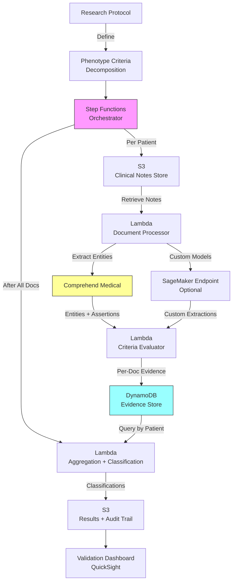

# Recipe 8.10 Architecture and Implementation: Phenotype Extraction for Research

*Companion to [Recipe 8.10: Phenotype Extraction for Research](chapter08.10-phenotype-extraction-research). This page covers the AWS architecture, services, prerequisites, and pseudocode. For the problem framing and the conceptual approach, start with the main recipe.*

---

## The AWS Implementation

### Why These Services

**Amazon Comprehend Medical for clinical NER and entity extraction.** Comprehend Medical provides out-of-the-box extraction of medical conditions, medications (with dose, frequency, route, duration), lab tests and values, procedures, and temporal expressions from clinical text. It handles negation detection and attribute linkage natively. For phenotyping, it provides the foundational entity extraction layer without requiring model training or clinical NLP infrastructure from scratch.

**Amazon S3 for clinical document storage.** De-identified or appropriately consented clinical notes land in S3, organized by patient and encounter. S3 provides the data lake for the phenotyping pipeline, with encryption, access logging, and lifecycle policies for research data governance.

**AWS Step Functions for pipeline orchestration.** Phenotype extraction is a multi-step, per-patient pipeline with branching logic (different criteria may require different extraction approaches), error handling (a single note's processing failure shouldn't invalidate an entire patient), and checkpointing (you want to resume from where you left off, not start over). Step Functions provides visual workflow orchestration with built-in retry, error handling, and state management.

**AWS Lambda for per-document processing.** Each clinical note gets processed independently: extract entities, classify assertions, pull attributes. Lambda's pay-per-invocation model fits perfectly with the embarrassingly parallel nature of document-level NLP. Process 100,000 notes across 5,000 patients by fanning out to concurrent Lambda invocations.

**Amazon DynamoDB for evidence accumulation.** As per-document extraction results come in, they accumulate in DynamoDB keyed by patient ID and criterion. DynamoDB's fast writes and flexible schema handle the heterogeneous evidence payloads (medication attributes vs. lab values vs. diagnosis assertions all look different). The aggregation step queries by patient to pull all evidence for classification.

<!-- TODO (TechWriter): Expert review SEC-2 (MEDIUM). Add data retention/TTL policy guidance for DynamoDB evidence store. Research data governance requires defined retention schedules; intermediate NLP artifacts should have shorter retention than final classifications. -->

**Amazon SageMaker for custom model hosting (optional).** If your phenotype requires extraction capabilities beyond what Comprehend Medical provides natively (e.g., a custom classifier for "treatment resistance" assertions, or a domain-specific entity type not in Comprehend Medical's ontology), SageMaker hosts the custom model behind an endpoint that Lambda calls as part of the pipeline.

### Architecture Diagram



### Prerequisites

| Requirement | Details |
|-------------|---------|
| **AWS Services** | Amazon Comprehend Medical, Amazon S3, AWS Step Functions, AWS Lambda, Amazon DynamoDB, Amazon SageMaker (optional), Amazon QuickSight (optional) |
| **IAM Permissions** | `comprehend:DetectEntitiesV2`, `comprehend:InferICD10CM`, `comprehend:InferRxNorm`, `s3:GetObject`, `s3:PutObject`, `dynamodb:PutItem`, `dynamodb:Query`, `states:StartExecution`, `sagemaker:InvokeEndpoint` (optional, only if custom models are used; scope to specific endpoint ARNs) |
| **BAA** | AWS BAA signed. Even for de-identified data, BAA is required if any re-identification risk exists. |
| **Encryption** | S3: SSE-KMS with research-specific key; DynamoDB: encryption at rest; all API calls over TLS; Lambda environment variables encrypted |
| **VPC** | Lambda in VPC with VPC endpoints for S3, DynamoDB, Comprehend Medical, and SageMaker. Private subnets only. No internet egress for PHI processing. Note: S3 and DynamoDB use Gateway endpoints (free). Comprehend Medical and SageMaker require Interface endpoints (~$7.50/month per AZ each). |
| **CloudTrail** | Full API logging. Research reproducibility requires knowing exactly what was processed, when, and with what configuration. For full audit trails, enable CloudTrail data events on the S3 bucket and DynamoDB table (additional cost: ~$0.10 per 100,000 events). Alternatively, use application-level audit logging in CloudWatch Logs at lower cost. |
| **IRB Approval** | Institutional Review Board approval or waiver for use of clinical data in research. This is not an AWS requirement, it's an institutional and federal requirement. |
| **Data Governance** | De-identification or consent framework per institutional policy. Limited data sets under data use agreements if sharing across institutions. |
| **Sample Data** | Synthetic clinical notes from tools like Synthea. MIMIC-III/MIMIC-IV discharge summaries (requires PhysioNet credentialed access and institutional DUA; store only in accounts where DUA terms can be enforced). Never use real patient data in development. |
| **Cost Estimate** | Comprehend Medical: ~$0.01 per 100 characters per API. A typical 3,000-character note through DetectEntitiesV2 + InferRxNorm + InferICD10CM = ~$0.90. Per patient with 40 notes = ~$12-15 at full processing. With selective processing (pre-filter via structured data, run RxNorm/ICD10 only on relevant notes): ~$4-8 per patient. Pre-filtering is not optional at scale. |

### Ingredients

| AWS Service | Role |
|------------|------|
| **Amazon Comprehend Medical** | Extracts medical entities, assertions, attributes, and normalized codes from clinical notes |
| **Amazon S3** | Stores clinical note corpus, intermediate results, and final classifications with full versioning |
| **AWS Step Functions** | Orchestrates the multi-step per-patient pipeline with error handling and checkpointing |
| **AWS Lambda** | Per-document entity extraction, criteria evaluation, and patient-level aggregation |
| **Amazon DynamoDB** | Accumulates per-criterion evidence across documents for each patient |
| **AWS KMS** | Manages encryption keys for all data stores and processing |
| **Amazon CloudWatch** | Logging, metrics, and alerts for pipeline health and throughput |
| **Amazon SageMaker** | Hosts custom NLP models for phenotype-specific extraction (optional) |

### Code

#### Walkthrough

**Step 1: Decompose the phenotype into computable criteria.** Before any NLP happens, you need to translate the clinical phenotype definition into a set of criteria that can each be independently evaluated. This is the most intellectually demanding step and requires close collaboration between the research team and the engineering team. Each criterion must specify: what entity types to look for, what assertion states are acceptable (present only? or present + possible?), what attributes are required (dose thresholds, temporal constraints), and how much evidence constitutes a positive finding. This decomposition is configuration, not code, but it drives everything downstream. Skip this step or do it carelessly, and your entire pipeline produces meaningless results.

```json
{
  "phenotype_id": "treatment_resistant_depression_v2",
  "phenotype_name": "Treatment-Resistant Depression with Inflammatory Markers",
  "version": "2.1",
  "criteria": [
    {
      "criterion_id": "C1_MDD_DIAGNOSIS",
      "description": "Major Depressive Disorder diagnosis",
      "type": "structured_or_text",
      "min_confidence": 0.85,
      "structured_query": {
        "icd10_codes": ["F32.0", "F32.1", "F32.2", "F32.9", "F33.0", "F33.1", "F33.2", "F33.9"],
        "min_occurrences": 2,
        "context": "outpatient_or_inpatient"
      },
      "text_criteria": {
        "target_entities": ["MEDICAL_CONDITION"],
        "terms": ["major depressive disorder", "major depression", "MDD", "recurrent depression"],
        "required_assertion": "POSITIVE",
        "exclude_sections": ["FAMILY_HISTORY", "SOCIAL_HISTORY"]
      },
      "evidence_threshold": "structured_sufficient_alone_OR_text_2_plus_mentions"
    },
    {
      "criterion_id": "C2_TREATMENT_FAILURE",
      "description": "Failed at least 2 adequate antidepressant trials",
      "type": "text_required",
      "min_confidence": 0.75,
      "text_criteria": {
        "target_entities": ["MEDICATION"],
        "medication_categories": ["SSRI", "SNRI", "TCA", "MAOI", "atypical_antidepressant"],
        "required_attributes": {
          "treatment_outcome": ["failed", "non-response", "inadequate response", "did not respond", "ineffective", "not helpful"],
          "adequacy_indicators": ["adequate trial", "therapeutic dose", "full dose", "maximum dose"]
        },
        "min_distinct_medications": 2,
        "temporal_constraint": "sequential_not_concurrent"
      },
      "evidence_threshold": "2_distinct_medications_with_failure_assertion"
    },
    {
      "criterion_id": "C3_INFLAMMATORY_MARKERS",
      "description": "Elevated inflammatory biomarkers",
      "type": "structured_preferred",
      "min_confidence": 0.80,
      "structured_query": {
        "lab_tests": ["CRP", "hs-CRP", "IL-6", "ESR"],
        "threshold": {"CRP": ">3.0 mg/L", "hs-CRP": ">3.0 mg/L", "IL-6": ">7 pg/mL", "ESR": ">20 mm/hr"},
        "min_occurrences": 1
      },
      "text_criteria": {
        "target_entities": ["TEST_TREATMENT_PROCEDURE", "TEST_VALUE"],
        "terms": ["elevated CRP", "elevated inflammatory markers", "high CRP", "inflammation"],
        "required_assertion": "POSITIVE"
      },
      "evidence_threshold": "structured_lab_value_preferred_text_confirmatory_only"
    }
  ],
  "classification_logic": "ALL_criteria_must_be_met",
  "output_classes": ["DEFINITE", "PROBABLE", "EXCLUDED", "INSUFFICIENT_DATA"]
}
```

**Step 2: Process each clinical note through entity extraction.** For every note in the patient's record, send it through Comprehend Medical to pull out medical entities with their assertions, attributes, and normalized codes. The key insight here is that you're not processing the note generically: you're processing it with your phenotype criteria in mind. Not every entity in the note matters. A phenotype for depression doesn't care about the patient's knee replacement (usually). But you extract everything at the document level because filtering happens in the next step, and you don't want to re-process notes if you add criteria later. Think of this as building an evidence index for the patient's record.

<!-- TODO (TechWriter): Expert review ARC-4 (MEDIUM). Add chunking logic for notes exceeding Comprehend Medical's 20,000-character limit. Split at sentence boundaries before 18,000 chars, process chunks independently, merge and deduplicate results. -->

```pseudocode
FUNCTION process_note(patient_id, note_id, note_text, note_metadata):
    // Send the clinical note to Comprehend Medical for entity extraction.
    // DetectEntitiesV2 returns medical conditions, medications, tests, procedures,
    // anatomy mentions, and temporal expressions, each with:
    //   - Text span (what was found)
    //   - Category (MEDICAL_CONDITION, MEDICATION, TEST_TREATMENT_PROCEDURE, etc.)
    //   - Type (more specific: DX_NAME, GENERIC_NAME, TEST_NAME, etc.)
    //   - Traits (NEGATION, DIAGNOSIS, SIGN, SYMPTOM, etc.)
    //   - Attributes (linked properties like dosage, frequency, test value)
    //   - Score (confidence 0.0 to 1.0)
    
    entities = call ComprehendMedical.DetectEntitiesV2(Text = note_text)
    
    // Also run specialized detections for medications and diagnoses
    // to get normalized codes (RxNorm CUIs, ICD-10 codes)
    rx_entities = call ComprehendMedical.InferRxNorm(Text = note_text)
    icd_entities = call ComprehendMedical.InferICD10CM(Text = note_text)
    
    // Determine assertion status for each entity.
    // Comprehend Medical provides "Traits" including NEGATION.
    // An entity with NEGATION trait = "absent" assertion.
    // No NEGATION trait = "present" (with caveats for hypothetical language).
    
    processed_entities = empty list
    FOR each entity in entities.Entities:
        assertion = "POSITIVE"
        IF entity has trait NEGATION:
            assertion = "NEGATIVE"
        IF entity has trait HYPOTHETICAL: // Not all services provide this natively
            assertion = "HYPOTHETICAL"
        
        // Capture the note section context if available from note_metadata.
        // Section information helps exclude family history mentions, etc.
        section = determine_section(entity.BeginOffset, note_metadata.section_boundaries)
        
        processed_entity = {
            text: entity.Text,
            category: entity.Category,
            type: entity.Type,
            assertion: assertion,
            confidence: entity.Score,
            attributes: entity.Attributes,   // dose, frequency, route, test values
            section: section,              // HPI, PMH, FAMILY_HISTORY, MEDICATIONS, etc.
            note_id: note_id,
            note_date: note_metadata.date,
            offsets: [entity.BeginOffset, entity.EndOffset]
        }
        append processed_entity to processed_entities
    
    // Merge in normalized medication and diagnosis codes
    processed_entities = enrich_with_normalized_codes(processed_entities, rx_entities, icd_entities)
    
    RETURN {
        patient_id: patient_id,
        note_id: note_id,
        note_date: note_metadata.date,
        entities: processed_entities
    }
```

**Step 3: Evaluate each note against phenotype criteria.** Now take the extracted entities and check which phenotype criteria they provide evidence for. This is the matching step: does this entity, with this assertion, in this section, with these attributes, count as evidence for criterion C1, C2, or C3? The matching rules come directly from the phenotype definition in Step 1. A medication entity matching "sertraline" with a "failure" attribute contributes to criterion C2. A medical condition entity matching "major depressive disorder" with a positive assertion in the HPI section contributes to criterion C1.

```pseudocode
FUNCTION evaluate_against_criteria(extraction_result, phenotype_definition):
    // For each criterion in the phenotype definition,
    // check if this note's entities provide evidence.
    
    evidence_items = empty list
    
    FOR each criterion in phenotype_definition.criteria:
        
        IF criterion.type == "text_required" OR criterion.type == "structured_or_text":
            // Filter entities to those relevant to this criterion
            relevant_entities = filter_entities(
                extraction_result.entities,
                target_categories = criterion.text_criteria.target_entities,
                target_terms      = criterion.text_criteria.terms,
                required_assertion = criterion.text_criteria.required_assertion,
                exclude_sections  = criterion.text_criteria.exclude_sections
            )
            
            FOR each matched_entity in relevant_entities:
                // Check if additional attributes are required
                attribute_match = TRUE
                IF criterion.text_criteria has required_attributes:
                    attribute_match = check_attributes(
                        matched_entity,
                        criterion.text_criteria.required_attributes
                    )
                
                IF attribute_match AND matched_entity.confidence >= criterion.min_confidence:
                    // min_confidence is defined per criterion in the phenotype definition.
                    // Start with 0.70 during development to maximize recall, then tighten
                    // based on PPV during validation. Medication names (typically high confidence
                    // from CM) can use 0.85+. Complex multi-word conditions may need 0.70-0.75.
                    evidence_item = {
                        criterion_id: criterion.criterion_id,
                        patient_id: extraction_result.patient_id,
                        note_id: extraction_result.note_id,
                        note_date: extraction_result.note_date,
                        entity_text: matched_entity.text,
                        assertion: matched_entity.assertion,
                        confidence: matched_entity.confidence,
                        section: matched_entity.section,
                        attributes: matched_entity.attributes,
                        evidence_type: "NLP_EXTRACTION"
                    }
                    append evidence_item to evidence_items
    
    RETURN evidence_items


FUNCTION filter_entities(entities, target_categories, target_terms, required_assertion, exclude_sections):
    // Match entities based on category, terminology, assertion, and section
    matched = empty list
    
    FOR each entity in entities:
        // Category must match (e.g., MEDICAL_CONDITION, MEDICATION)
        IF entity.category NOT IN target_categories:
            CONTINUE
        
        // Section must not be excluded (e.g., skip FAMILY_HISTORY for patient conditions)
        IF entity.section IN exclude_sections:
            CONTINUE
        
        // Assertion must match the requirement
        IF required_assertion == "POSITIVE" AND entity.assertion != "POSITIVE":
            CONTINUE
        
        // Term matching: does the entity text match any of the target terms?
        // Use case-insensitive substring or normalized code matching
        IF entity.text (normalized, lowercase) matches any term in target_terms:
            append entity to matched
        ELSE IF entity has normalized_code matching any target code:
            append entity to matched
    
    RETURN matched
```

**Step 4: Aggregate evidence across all notes for each patient.** A single note rarely provides enough evidence to classify a patient. This step pulls together all the evidence accumulated across the patient's entire note corpus and organizes it by criterion. For criterion C2 (treatment failures), it counts distinct medications with failure assertions. For criterion C1 (MDD diagnosis), it counts the number of positive mentions across different encounters. The aggregation logic is criterion-specific because different criteria have different evidence thresholds.

<!-- TODO (TechWriter): Expert review ARC-5 (MEDIUM). Add temporal conflict resolution when positive and negative evidence exist for same criterion. Most recent note takes priority for current-status phenotypes; any-positive suffices for ever-had phenotypes. Document which interpretation the phenotype uses. -->

```pseudocode
FUNCTION aggregate_patient_evidence(patient_id, phenotype_definition):
    // Query DynamoDB for all evidence items for this patient
    all_evidence = query DynamoDB where patient_id = patient_id
    
    // Group evidence by criterion
    evidence_by_criterion = group all_evidence by criterion_id
    
    // Evaluate each criterion's evidence against its threshold
    criterion_results = empty map
    
    FOR each criterion in phenotype_definition.criteria:
        criterion_evidence = evidence_by_criterion[criterion.criterion_id] or empty list
        
        // Apply criterion-specific aggregation logic
        IF criterion.criterion_id == "C2_TREATMENT_FAILURE":
            // Special aggregation: count DISTINCT medications with failure assertions
            distinct_failed_meds = extract unique medication names from criterion_evidence
                                    where evidence indicates treatment failure
            
            criterion_results[criterion.criterion_id] = {
                met: length(distinct_failed_meds) >= criterion.text_criteria.min_distinct_medications,
                confidence: average confidence of supporting evidence,
                evidence_count: length(criterion_evidence),
                distinct_items: distinct_failed_meds,
                supporting_notes: list of note_ids providing evidence
            }
        
        ELSE:
            // Standard aggregation: count positive evidence instances
            positive_evidence = filter criterion_evidence where assertion == "POSITIVE"
            
            // Apply evidence threshold from phenotype definition
            threshold_met = evaluate_threshold(
                criterion.evidence_threshold,
                positive_evidence
            )
            
            criterion_results[criterion.criterion_id] = {
                met: threshold_met,
                confidence: average confidence of positive_evidence,
                evidence_count: length(positive_evidence),
                supporting_notes: list of note_ids from positive_evidence
            }
    
    RETURN criterion_results
```

**Step 5: Classify the patient.** Apply the phenotype algorithm's classification logic to the aggregated criterion results. If all criteria are met with high confidence, the patient is "DEFINITE." If some criteria are met but others have only partial evidence, the patient is "PROBABLE." If any criterion has definitive negative evidence, the patient is "EXCLUDED." If there simply isn't enough documentation to make a determination, the patient is "INSUFFICIENT_DATA." This final classification, along with all supporting evidence, becomes the output of the pipeline.

```pseudocode
FUNCTION classify_patient(patient_id, criterion_results, phenotype_definition):
    // Apply classification logic from phenotype definition
    
    all_met = TRUE
    any_excluded = FALSE
    any_partial_evidence = FALSE
    has_zero_evidence_criterion = FALSE
    
    FOR each criterion_id, result in criterion_results:
        IF result.met == FALSE AND result.evidence_count == 0:
            // No evidence at all for this criterion
            all_met = FALSE
            has_zero_evidence_criterion = TRUE
        ELSE IF result.met == FALSE AND result.evidence_count > 0:
            // Some evidence exists but doesn't meet threshold
            all_met = FALSE
            any_partial_evidence = TRUE
        ELSE IF result.met == TRUE:
            // Criterion satisfied
            CONTINUE
    
    // Check for exclusion evidence (negative assertions on inclusion criteria)
    // For example: "Patient does NOT have depression" directly contradicts C1
    exclusion_evidence = check_exclusion_criteria(patient_id, phenotype_definition)
    IF exclusion_evidence is not empty:
        any_excluded = TRUE
    
    // Determine final classification
    IF any_excluded:
        classification = "EXCLUDED"
    ELSE IF all_met AND minimum_confidence(criterion_results) >= 0.85:
        classification = "DEFINITE"
    ELSE IF all_met AND minimum_confidence(criterion_results) < 0.85:
        classification = "PROBABLE"
    ELSE IF any_partial_evidence:
        classification = "PROBABLE"
    ELSE:
        classification = "INSUFFICIENT_DATA"
    
    // Build the complete output record
    result = {
        patient_id: patient_id,
        phenotype_id: phenotype_definition.phenotype_id,
        phenotype_version: phenotype_definition.version,
        classification: classification,
        criteria_results: criterion_results,
        exclusion_evidence: exclusion_evidence,
        processing_timestamp: current UTC timestamp,
        notes_processed: count of unique note_ids across all evidence,
        pipeline_version: "1.0.3"  // version of the processing code
    }
    
    // Write to final results store
    store result in S3 results bucket as JSON
    
    RETURN result
```

> **Curious how this looks in Python?** The pseudocode above covers the concepts. If you'd like to see sample Python code that demonstrates these patterns using boto3, check out the [Python Example](chapter08.10-python-example). It walks through each step with inline comments and notes on what you'd need to change for a real deployment.

### Expected Results

**Sample output for a patient classified as DEFINITE:**

```json
{
  "patient_id": "SYNTH-0042871",
  "phenotype_id": "treatment_resistant_depression_v2",
  "phenotype_version": "2.1",
  "classification": "DEFINITE",
  "criteria_results": {
    "C1_MDD_DIAGNOSIS": {
      "met": true,
      "confidence": 0.94,
      "evidence_count": 7,
      "distinct_items": ["major depressive disorder", "MDD", "recurrent major depression"],
      "supporting_notes": ["note-2024-03-15", "note-2024-06-22", "note-2024-09-10", "note-2025-01-05"]
    },
    "C2_TREATMENT_FAILURE": {
      "met": true,
      "confidence": 0.89,
      "evidence_count": 4,
      "distinct_items": ["sertraline", "venlafaxine", "bupropion"],
      "supporting_notes": ["note-2024-06-22", "note-2024-09-10", "note-2025-01-05"]
    },
    "C3_INFLAMMATORY_MARKERS": {
      "met": true,
      "confidence": 0.97,
      "evidence_count": 2,
      "distinct_items": ["CRP: 4.8 mg/L", "hs-CRP: 5.1 mg/L"],
      "supporting_notes": ["note-2024-11-20", "note-2025-02-14"]
    }
  },
  "exclusion_evidence": [],
  "processing_timestamp": "2026-03-15T09:41:22Z",
  "notes_processed": 43,
  "pipeline_version": "1.0.3"
}
```

**Performance benchmarks:**

| Metric | Typical Value |
|--------|---------------|
| Per-note processing latency | 2-4 seconds |
| Per-patient total time (40 notes) | 80-160 seconds (parallelized: 10-20 seconds) |
| Positive predictive value (PPV) | 85-95% (phenotype-dependent) |
| Sensitivity (recall) | 70-85% (trade-off with PPV) |
| Throughput | 1,000-3,000 patients/hour at default Comprehend Medical quotas (100 TPS); 5,000-10,000 with quota increases. Bottleneck is CM API throughput, not Step Functions. |
| Cost per patient (40 notes) | $4-10 depending on note length and model usage |
| Inter-run reproducibility | 99.9%+ (deterministic pipeline with versioned models) |

**Where it struggles:**

- Rare phenotypes with prevalence below 1% (PPV drops due to base rate)
- Criteria that require multi-sentence reasoning ("adequate trial" determination)
- Notes with heavy abbreviation and shorthand (varies by institution)
- Conflicting evidence across providers (one says "depression," another says "adjustment disorder")
- Historical note scans with OCR artifacts that degrade NLP accuracy
- Phenotypes that require negation of a negation ("patient no longer denies suicidal ideation")

---

## Variations and Extensions

**Multi-site federated phenotyping.** Instead of centralizing data from multiple institutions, deploy the phenotype extraction pipeline at each site and aggregate only the classifications (not the underlying notes). This respects data governance boundaries while enabling multi-site research. AWS HealthLake or a shared phenotype definition in S3 can coordinate the algorithm version across sites while each site processes its own data.

**Iterative phenotype refinement with active learning.** Instead of validating on a random sample after the full run, use active learning to prioritize which patients a reviewer should look at. Focus review on cases near the classification boundary (PROBABLE class) or where the system has low confidence. Each reviewed case becomes training signal for refining extraction rules or re-calibrating thresholds. This gets you to research-grade faster with less reviewer time.

**LLM-augmented phenotype extraction.** Use a large language model (via Amazon Bedrock) as a secondary classifier for complex criteria that rule-based or standard NLP can't handle well. Present the LLM with relevant note excerpts and ask it to evaluate specific criteria ("Does this text indicate the patient failed an adequate trial of sertraline? What was the dose and duration?"). Use the LLM output as additional evidence, not as the sole determinant, to maintain reproducibility. Version the prompt alongside the pipeline code.

---

## Additional Resources

**AWS Documentation:**
- [Amazon Comprehend Medical DetectEntitiesV2 API](https://docs.aws.amazon.com/comprehend-medical/latest/dev/textanalysis-entitiesv2.html)
- [Amazon Comprehend Medical InferICD10CM API](https://docs.aws.amazon.com/comprehend-medical/latest/dev/ontology-icd10.html)
- [Amazon Comprehend Medical InferRxNorm API](https://docs.aws.amazon.com/comprehend-medical/latest/dev/ontology-rxnorm.html)
- [AWS Step Functions Developer Guide](https://docs.aws.amazon.com/step-functions/latest/dg/welcome.html)
- [AWS HIPAA Eligible Services](https://aws.amazon.com/compliance/hipaa-eligible-services-reference/)
- [Architecting for HIPAA on AWS](https://docs.aws.amazon.com/whitepapers/latest/architecting-hipaa-security-and-compliance-on-aws/welcome.html)

**AWS Sample Repos:**
- [`amazon-comprehend-medical-fhir-integration`](https://github.com/aws-samples/amazon-comprehend-medical-fhir-integration): Demonstrates extracting medical entities and mapping them to FHIR resources
- [`amazon-comprehend-examples`](https://github.com/aws-samples/amazon-comprehend-examples): General Comprehend examples including medical entity detection patterns

**External Resources:**
- [PheKB: Phenotype KnowledgeBase](https://phekb.org/): Published, validated phenotype algorithms from the eMERGE Network
- [OHDSI ATLAS](https://atlas.ohdsi.org/): Phenotype definition tool from the Observational Health Data Sciences and Informatics consortium
- [eMERGE Network](https://emerge-network.org/): Multi-site genomics consortium with extensive phenotyping validation work
- [MIMIC-IV-Note](https://physionet.org/content/mimic-iv-note/): Discharge summaries and radiology reports suitable for phenotyping benchmarks (requires PhysioNet credentialed access and institutional DUA)

---

## Estimated Implementation Time

| Tier | Timeline | What You Get |
|------|----------|--------------|
| **Basic** | 4-6 weeks | Single phenotype, single institution, basic NER + rule-based criteria matching, manual validation |
| **Production-ready** | 3-5 months | Multiple phenotypes, configurable criteria definitions, automated validation pipeline, audit trail, versioning |
| **With variations** | 6-9 months | Multi-site federation, active learning refinement loop, LLM augmentation, phenotype library with version management |

---


---

*← [Main Recipe 8.10](chapter08.10-phenotype-extraction-research) · [Python Example](chapter08.10-python-example) · [Chapter Preface](chapter08-preface)*
