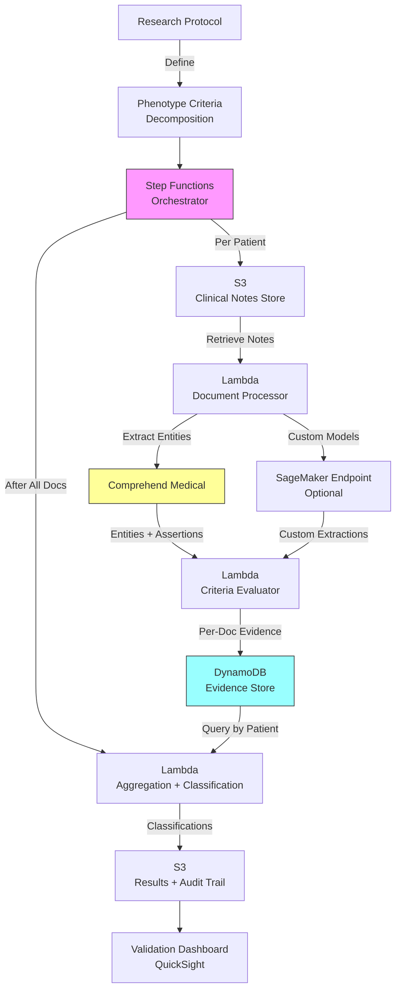

# Recipe 8.10: Phenotype Extraction for Research

**Complexity:** Complex · **Phase:** Research Infrastructure · **Estimated Cost:** ~$0.08 per patient record set

---

## The Problem

A researcher at an academic medical center has a hypothesis: patients with treatment-resistant depression who also have chronic inflammation markers (elevated CRP, IL-6) respond better to a specific adjunctive therapy. To test this hypothesis, they need a cohort of patients who meet three criteria: (1) diagnosed with major depressive disorder, (2) failed at least two adequate antidepressant trials, and (3) have documented inflammatory biomarkers above a specific threshold.

The EHR has structured diagnosis codes and lab values. Easy, right? Not even close.

The diagnosis code (F33.2, "Major depressive disorder, recurrent, severe without psychotic features") gets you a starting pool, but it misses patients coded differently (F32.2 for single episode, or even "adjustment disorder" in early documentation that was later reclassified). The "failed two adequate trials" criterion? That lives exclusively in free text. Progress notes, psychiatry consults, medication reconciliation narratives. A note might say "patient has not responded to adequate trials of sertraline 200mg and venlafaxine 225mg." Or it might say "tried two SSRIs without benefit." Or "Prozac didn't work. Effexor didn't work. Trying Wellbutrin now." Or it might be distributed across three separate visit notes spanning six months, each one mentioning a single failed medication.

This scenario is the norm in clinical research. The information you need to identify a study cohort is scattered across unstructured documentation, encoded in clinical shorthand, distributed across time, and expressed in a hundred different ways by a hundred different clinicians.

The cost of doing this manually is staggering. Chart review (a human reading through every potentially qualifying patient's records) runs about 15-30 minutes per patient. For a study requiring 500 subjects from a pool of 50,000 candidates, that's potentially months of research coordinator time just to identify who qualifies. And the result is still inconsistent: different reviewers apply criteria differently, inter-rater reliability is often below 0.8 kappa, and the process is completely non-reproducible.

Phenotype extraction is the NLP-powered answer to this problem. It's the automated identification of patients who meet a complex clinical definition (a "phenotype") by analyzing both structured data and unstructured text in the EHR. When it works, it takes a process that took months of chart review and compresses it to hours of compute time, with complete reproducibility and explicit documentation of how every patient was classified.

When it doesn't work (and this is the honest part), it fails silently. A missed negation means a patient who was ruled out for a condition gets classified as having it. An ambiguous temporal reference means a patient with a resolved historical condition gets flagged as currently meeting criteria. The research built on a contaminated cohort proceeds to publication, and nobody discovers the problem until a replication attempt fails.

The stakes are real. The difficulty is real. And the need is enormous: observational research, pragmatic trials, quality improvement, precision medicine cohort building, and biobank linkage all depend on reliable phenotype extraction from clinical text.

---

## The Technology: Computational Phenotyping from Unstructured Text

### What Is Phenotype Extraction?

A clinical phenotype, in the research computing sense, is a computable definition of a patient characteristic. It's not just "does this patient have diabetes?" but a precise specification: "Type 2 diabetes, defined as two or more outpatient encounters with ICD-10 codes E11.x, OR one inpatient encounter with E11.x, OR HbA1c >= 6.5% on two measurements at least 90 days apart, OR documented treatment with metformin for glucose management (not PCOS), EXCLUDING patients with cystic fibrosis-related diabetes or steroid-induced hyperglycemia."

That definition mixes structured data (codes, labs) with unstructured text requirements (confirming the metformin indication, excluding specific etiologies). The structured part is a database query. The unstructured part is an NLP problem.

Phenotype extraction is the NLP layer that resolves the unstructured text components of a phenotype definition. It transforms free-text clinical documentation into computable assertions: "this patient has documentation of failing two antidepressant trials," or "this patient's chest pain is described as non-cardiac in origin," or "this patient has family history of early-onset colorectal cancer."

The output feeds into a phenotype algorithm that combines structured and unstructured evidence to produce a final patient classification: phenotype-positive, phenotype-negative, or indeterminate.

### The Components of a Phenotype Extraction Pipeline

Building a phenotype extraction system requires stacking several NLP capabilities together. None of them is individually new (most appear in earlier recipes in this chapter), but the combination and the precision requirements are what make phenotyping complex.

**Named entity recognition (NER).** Identify clinical concepts in text: conditions, medications, procedures, lab values, symptoms. This is the foundation. If you can't find the relevant mentions, nothing downstream works. For phenotyping, you often need entities that go beyond standard medical NER: "adequate trial" (a qualitative assessment), "failed" or "non-response" (treatment outcome assertions), "family history of" (a framing modifier that changes who the entity applies to).

**Assertion classification.** Every extracted entity needs an assertion status. Is this condition present, absent, possible, historical, or attributed to someone else (family history)? Recipe 8.8 covers this in depth. For phenotyping, assertion accuracy is critical: a negated condition ("no evidence of diabetes") getting classified as present creates a false positive in your cohort. At research-grade precision requirements (often 95%+ positive predictive value), even small assertion error rates become unacceptable.

**Attribute extraction.** Beyond recognizing that a medication is mentioned, you need its dose, duration, frequency, and route. Beyond recognizing a lab value, you need the numeric result and the reference range. Beyond recognizing a diagnosis, you need its severity, chronicity, and etiology. These attributes are what distinguish "tried sertraline" from "adequate trial of sertraline 200mg for 8 weeks."

**Temporal anchoring.** When did this happen? Is the documented condition current or historical? Did the two antidepressant failures occur sequentially (required by the phenotype definition) or concurrently? Recipe 8.9 covers temporal extraction. For phenotyping, you need temporal reasoning sufficient to determine whether events meet the time-based criteria of the phenotype definition (e.g., "lab values at least 90 days apart").

**Negation and context detection.** This overlaps with assertion classification but deserves its own mention because it's the single biggest source of phenotyping errors. "Patient denies chest pain." "No history of MI." "Father had colon cancer" (family, not patient). "Ruled out for pulmonary embolism." "Concern for possible lupus" (hedged, not confirmed). Each of these must be handled correctly, or the phenotype classification is wrong.

**Section awareness.** The same phrase means different things in different note sections. "Diabetes" in the Problem List means the patient has it. "Diabetes" in the Family History section means a relative has it. "Diabetes" in the Assessment section might be "we are evaluating for diabetes" (not confirmed). Section-aware processing is non-negotiable for phenotyping accuracy.

**Cross-document aggregation.** A phenotype is rarely determinable from a single note. You might need evidence from across the patient's longitudinal record: a diagnosis confirmed in one note, a medication trial documented in another, a lab value from a third encounter. The aggregation logic (how to combine evidence across documents) is where the phenotype algorithm lives, and it's where most of the domain expertise is encoded.

### Why Phenotyping Is Hard (Beyond the NLP)

The NLP components above are table stakes. The real difficulty lives in the layers surrounding them:

**Phenotype definitions are ambiguous.** Research protocols define inclusion criteria in clinical language, not computational language. "Adequate trial" of an antidepressant could mean different things: the APA says 4-6 weeks at therapeutic dose, but some researchers use 8 weeks, and "therapeutic dose" varies by medication. Your system needs these definitions operationalized into explicit rules, and different research teams might operationalize them differently.

**Gold standard annotation is expensive and contentious.** To train or validate a phenotype extraction system, you need gold-standard labels: patients who definitely meet the phenotype definition, and patients who definitely don't. Creating these labels requires clinician chart review, and clinicians disagree. Inter-annotator agreement for complex phenotypes is often kappa 0.7-0.85. When your annotators disagree on 15-30% of cases, what is "correct" becomes philosophically murky. Your system is being evaluated against an imperfect standard.

**Phenotype portability.** A phenotype algorithm developed at one institution may not work at another. Different EHR systems, different documentation styles, different provider populations, different patient demographics, different abbreviation conventions. "T2DM" is universal, but "NIDDM" (non-insulin-dependent diabetes mellitus, an older term) might appear in notes from a health system that still has clinicians trained in the 1980s. The eMERGE Network (a multi-site genomics consortium) has documented extensively how phenotype algorithms require site-specific tuning.

**Prevalence and class imbalance.** For rare phenotypes (a specific genetic condition, a particular drug reaction), the vast majority of patients in your candidate pool won't qualify. If 0.5% of your candidates have the phenotype, even a 99% specific system will have a poor positive predictive value. The math is unforgiving for rare phenotypes, and the solution (higher precision at the cost of recall) means you miss real cases.

**Reproducibility requirements.** Research demands reproducibility: another team should be able to take your phenotype algorithm, run it on their data, and get consistent results. This means every decision in the pipeline needs to be documented, deterministic, and versioned. Which NLP models were used? What thresholds were applied? How were conflicts resolved? What was the training data? Phenotyping is as much a data provenance problem as it is an NLP problem.

### Where the Field Is in 2026

The landscape for computational phenotyping has matured significantly:

**Standardized phenotype libraries.** The PheKB (Phenotype Knowledge Base) from eMERGE provides validated, published phenotype algorithms for hundreds of conditions. These are the reference implementations. They mix structured data queries with manual chart review criteria that are candidates for NLP automation.

**Clinical NLP toolkits.** Apache cTAKES, MedSpaCy, and commercial clinical NLP services (including cloud-based offerings) provide the foundational entity extraction, negation detection, and assertion classification needed for phenotyping. None of them solve phenotyping end-to-end, but they provide the building blocks.

**Large language models.** LLMs can now perform zero-shot and few-shot phenotype classification with impressive accuracy on well-defined criteria. For simple phenotypes, you can often describe the criteria in a prompt and get reasonable patient-level classifications from clinical notes. The challenge is that "reasonable" (85-90% accuracy) isn't always "research-grade" (95%+ PPV), and the non-deterministic nature of LLM outputs creates reproducibility concerns.

**Hybrid approaches dominate.** The current best practice is a hybrid: rule-based extraction for structured and well-patterned data, ML-based NLP for unstructured text, and a deterministic combination algorithm that merges evidence using explicit, documented logic. This gives you the reproducibility of rules with the flexibility of ML.

### The General Architecture Pattern

At a conceptual level, phenotype extraction follows this pipeline:

```text
[Phenotype Definition] → [Criteria Decomposition] → [Per-Criterion Extraction] → [Evidence Aggregation] → [Classification] → [Validation]
```

**Phenotype Definition:** The clinical specification of what you're looking for. Usually comes from a research protocol, published algorithm, or clinical expert.

**Criteria Decomposition:** Break the definition into individual, independently evaluable criteria. Each criterion becomes a separate extraction target. Some resolve against structured data (ICD codes, lab values). Others require NLP against unstructured text.

**Per-Criterion Extraction:** For each text-based criterion, run the appropriate NLP pipeline: entity extraction, assertion classification, attribute extraction, temporal reasoning. The output is per-document evidence for or against each criterion.

**Evidence Aggregation:** Combine per-document evidence across the patient's longitudinal record. Apply aggregation rules: how many positive mentions are required? Does a single negation override multiple positives? How do you handle conflicting evidence across notes?

**Classification:** Apply the phenotype algorithm logic to produce a final patient-level classification. Typically three classes: definite (meets all criteria with high confidence), probable (partial evidence), and excluded (evidence against).

**Validation:** Compare automated classifications against manual chart review on a sample. Calculate positive predictive value, sensitivity, specificity. Iterate on extraction rules and thresholds until validation metrics meet research requirements.

---

## The AWS Implementation

### Why These Services

**Amazon Comprehend Medical for clinical NER and entity extraction.** Comprehend Medical provides out-of-the-box extraction of medical conditions, medications (with dose, frequency, route, duration), lab tests and values, procedures, and temporal expressions from clinical text. It handles negation detection and attribute linkage natively. For phenotyping, it provides the foundational entity extraction layer without requiring model training or clinical NLP infrastructure from scratch.

**Amazon S3 for clinical document storage.** De-identified or appropriately consented clinical notes land in S3, organized by patient and encounter. S3 provides the data lake for the phenotyping pipeline, with encryption, access logging, and lifecycle policies for research data governance.

**AWS Step Functions for pipeline orchestration.** Phenotype extraction is a multi-step, per-patient pipeline with branching logic (different criteria may require different extraction approaches), error handling (a single note's processing failure shouldn't invalidate an entire patient), and checkpointing (you want to resume from where you left off, not start over). Step Functions provides visual workflow orchestration with built-in retry, error handling, and state management.

**AWS Lambda for per-document processing.** Each clinical note gets processed independently: extract entities, classify assertions, pull attributes. Lambda's pay-per-invocation model fits perfectly with the embarrassingly parallel nature of document-level NLP. Process 100,000 notes across 5,000 patients by fanning out to concurrent Lambda invocations.

**Amazon DynamoDB for evidence accumulation.** As per-document extraction results come in, they accumulate in DynamoDB keyed by patient ID and criterion. DynamoDB's fast writes and flexible schema handle the heterogeneous evidence payloads (medication attributes vs. lab values vs. diagnosis assertions all look different). The aggregation step queries by patient to pull all evidence for classification.

**Amazon SageMaker for custom model hosting (optional).** If your phenotype requires extraction capabilities beyond what Comprehend Medical provides natively (e.g., a custom classifier for "treatment resistance" assertions, or a domain-specific entity type not in Comprehend Medical's ontology), SageMaker hosts the custom model behind an endpoint that Lambda calls as part of the pipeline.

### Architecture Diagram



### Prerequisites

| Requirement | Details |
|-------------|---------|
| **AWS Services** | Amazon Comprehend Medical, Amazon S3, AWS Step Functions, AWS Lambda, Amazon DynamoDB, Amazon SageMaker (optional), Amazon QuickSight (optional) |
| **IAM Permissions** | `comprehend:DetectEntitiesV2`, `comprehend:InferICD10CM`, `comprehend:InferRxNorm`, `s3:GetObject`, `s3:PutObject`, `dynamodb:PutItem`, `dynamodb:Query`, `states:StartExecution`, `sagemaker:InvokeEndpoint` |
| **BAA** | AWS BAA signed. Even for de-identified data, BAA is required if any re-identification risk exists. |
| **Encryption** | S3: SSE-KMS with research-specific key; DynamoDB: encryption at rest; all API calls over TLS; Lambda environment variables encrypted |
| **VPC** | Lambda in VPC with VPC endpoints for S3, DynamoDB, Comprehend Medical, and SageMaker. Private subnets only. No internet egress for PHI processing. |
| **CloudTrail** | Full API logging. Research reproducibility requires knowing exactly what was processed, when, and with what configuration. |
| **IRB Approval** | Institutional Review Board approval or waiver for use of clinical data in research. This is not an AWS requirement, it's an institutional and federal requirement. |
| **Data Governance** | De-identification or consent framework per institutional policy. Limited data sets under data use agreements if sharing across institutions. |
| **Sample Data** | Synthetic clinical notes from tools like Synthea. MIMIC-III/MIMIC-IV discharge summaries (requires PhysioNet credentialed access). Never use real patient data in development. |
| **Cost Estimate** | Comprehend Medical: ~$0.01 per 100 characters (entity detection). A typical 2000-character note = $0.20. Per patient with 40 notes = ~$8.00. At scale discounts and selective processing bring this down significantly. |

### Ingredients

| AWS Service | Role |
|------------|------|
| **Amazon Comprehend Medical** | Extracts medical entities, assertions, attributes, and normalized codes from clinical notes |
| **Amazon S3** | Stores clinical note corpus, intermediate results, and final classifications with full versioning |
| **AWS Step Functions** | Orchestrates the multi-step per-patient pipeline with error handling and checkpointing |
| **AWS Lambda** | Per-document entity extraction, criteria evaluation, and patient-level aggregation |
| **Amazon DynamoDB** | Accumulates per-criterion evidence across documents for each patient |
| **AWS KMS** | Manages encryption keys for all data stores and processing |
| **Amazon CloudWatch** | Logging, metrics, and alerts for pipeline health and throughput |
| **Amazon SageMaker** | Hosts custom NLP models for phenotype-specific extraction (optional) |

### Code

#### Walkthrough

**Step 1: Decompose the phenotype into computable criteria.** Before any NLP happens, you need to translate the clinical phenotype definition into a set of criteria that can each be independently evaluated. This is the most intellectually demanding step and requires close collaboration between the research team and the engineering team. Each criterion must specify: what entity types to look for, what assertion states are acceptable (present only? or present + possible?), what attributes are required (dose thresholds, temporal constraints), and how much evidence constitutes a positive finding. This decomposition is configuration, not code, but it drives everything downstream. Skip this step or do it carelessly, and your entire pipeline produces meaningless results.

```json
{
  "phenotype_id": "treatment_resistant_depression_v2",
  "phenotype_name": "Treatment-Resistant Depression with Inflammatory Markers",
  "version": "2.1",
  "criteria": [
    {
      "criterion_id": "C1_MDD_DIAGNOSIS",
      "description": "Major Depressive Disorder diagnosis",
      "type": "structured_or_text",
      "structured_query": {
        "icd10_codes": ["F32.0", "F32.1", "F32.2", "F32.9", "F33.0", "F33.1", "F33.2", "F33.9"],
        "min_occurrences": 2,
        "context": "outpatient_or_inpatient"
      },
      "text_criteria": {
        "target_entities": ["MEDICAL_CONDITION"],
        "terms": ["major depressive disorder", "major depression", "MDD", "recurrent depression"],
        "required_assertion": "POSITIVE",
        "exclude_sections": ["FAMILY_HISTORY", "SOCIAL_HISTORY"]
      },
      "evidence_threshold": "structured_sufficient_alone_OR_text_2_plus_mentions"
    },
    {
      "criterion_id": "C2_TREATMENT_FAILURE",
      "description": "Failed at least 2 adequate antidepressant trials",
      "type": "text_required",
      "text_criteria": {
        "target_entities": ["MEDICATION"],
        "medication_categories": ["SSRI", "SNRI", "TCA", "MAOI", "atypical_antidepressant"],
        "required_attributes": {
          "treatment_outcome": ["failed", "non-response", "inadequate response", "did not respond", "ineffective", "not helpful"],
          "adequacy_indicators": ["adequate trial", "therapeutic dose", "full dose", "maximum dose"]
        },
        "min_distinct_medications": 2,
        "temporal_constraint": "sequential_not_concurrent"
      },
      "evidence_threshold": "2_distinct_medications_with_failure_assertion"
    },
    {
      "criterion_id": "C3_INFLAMMATORY_MARKERS",
      "description": "Elevated inflammatory biomarkers",
      "type": "structured_preferred",
      "structured_query": {
        "lab_tests": ["CRP", "hs-CRP", "IL-6", "ESR"],
        "threshold": {"CRP": ">3.0 mg/L", "hs-CRP": ">3.0 mg/L", "IL-6": ">7 pg/mL", "ESR": ">20 mm/hr"},
        "min_occurrences": 1
      },
      "text_criteria": {
        "target_entities": ["TEST_TREATMENT_PROCEDURE", "TEST_VALUE"],
        "terms": ["elevated CRP", "elevated inflammatory markers", "high CRP", "inflammation"],
        "required_assertion": "POSITIVE"
      },
      "evidence_threshold": "structured_lab_value_preferred_text_confirmatory_only"
    }
  ],
  "classification_logic": "ALL_criteria_must_be_met",
  "output_classes": ["DEFINITE", "PROBABLE", "EXCLUDED", "INSUFFICIENT_DATA"]
}
```

**Step 2: Process each clinical note through entity extraction.** For every note in the patient's record, send it through Comprehend Medical to pull out medical entities with their assertions, attributes, and normalized codes. The key insight here is that you're not processing the note generically: you're processing it with your phenotype criteria in mind. Not every entity in the note matters. A phenotype for depression doesn't care about the patient's knee replacement (usually). But you extract everything at the document level because filtering happens in the next step, and you don't want to re-process notes if you add criteria later. Think of this as building an evidence index for the patient's record.

```pseudocode
FUNCTION process_note(patient_id, note_id, note_text, note_metadata):
    // Send the clinical note to Comprehend Medical for entity extraction.
    // DetectEntitiesV2 returns medical conditions, medications, tests, procedures,
    // anatomy mentions, and temporal expressions, each with:
    //   - Text span (what was found)
    //   - Category (MEDICAL_CONDITION, MEDICATION, TEST_TREATMENT_PROCEDURE, etc.)
    //   - Type (more specific: DX_NAME, GENERIC_NAME, TEST_NAME, etc.)
    //   - Traits (NEGATION, DIAGNOSIS, SIGN, SYMPTOM, etc.)
    //   - Attributes (linked properties like dosage, frequency, test value)
    //   - Score (confidence 0.0 to 1.0)
    
    entities = call ComprehendMedical.DetectEntitiesV2(Text = note_text)
    
    // Also run specialized detections for medications and diagnoses
    // to get normalized codes (RxNorm CUIs, ICD-10 codes)
    rx_entities = call ComprehendMedical.InferRxNorm(Text = note_text)
    icd_entities = call ComprehendMedical.InferICD10CM(Text = note_text)
    
    // Determine assertion status for each entity.
    // Comprehend Medical provides "Traits" including NEGATION.
    // An entity with NEGATION trait = "absent" assertion.
    // No NEGATION trait = "present" (with caveats for hypothetical language).
    
    processed_entities = empty list
    FOR each entity in entities.Entities:
        assertion = "POSITIVE"
        IF entity has trait NEGATION:
            assertion = "NEGATIVE"
        IF entity has trait HYPOTHETICAL: // Not all services provide this natively
            assertion = "HYPOTHETICAL"
        
        // Capture the note section context if available from note_metadata.
        // Section information helps exclude family history mentions, etc.
        section = determine_section(entity.BeginOffset, note_metadata.section_boundaries)
        
        processed_entity = {
            text: entity.Text,
            category: entity.Category,
            type: entity.Type,
            assertion: assertion,
            confidence: entity.Score,
            attributes: entity.Attributes,   // dose, frequency, route, test values
            section: section,              // HPI, PMH, FAMILY_HISTORY, MEDICATIONS, etc.
            note_id: note_id,
            note_date: note_metadata.date,
            offsets: [entity.BeginOffset, entity.EndOffset]
        }
        append processed_entity to processed_entities
    
    // Merge in normalized medication and diagnosis codes
    processed_entities = enrich_with_normalized_codes(processed_entities, rx_entities, icd_entities)
    
    RETURN {
        patient_id: patient_id,
        note_id: note_id,
        note_date: note_metadata.date,
        entities: processed_entities
    }
```

**Step 3: Evaluate each note against phenotype criteria.** Now take the extracted entities and check which phenotype criteria they provide evidence for. This is the matching step: does this entity, with this assertion, in this section, with these attributes, count as evidence for criterion C1, C2, or C3? The matching rules come directly from the phenotype definition in Step 1. A medication entity matching "sertraline" with a "failure" attribute contributes to criterion C2. A medical condition entity matching "major depressive disorder" with a positive assertion in the HPI section contributes to criterion C1.

```pseudocode
FUNCTION evaluate_against_criteria(extraction_result, phenotype_definition):
    // For each criterion in the phenotype definition,
    // check if this note's entities provide evidence.
    
    evidence_items = empty list
    
    FOR each criterion in phenotype_definition.criteria:
        
        IF criterion.type == "text_required" OR criterion.type == "structured_or_text":
            // Filter entities to those relevant to this criterion
            relevant_entities = filter_entities(
                extraction_result.entities,
                target_categories = criterion.text_criteria.target_entities,
                target_terms      = criterion.text_criteria.terms,
                required_assertion = criterion.text_criteria.required_assertion,
                exclude_sections  = criterion.text_criteria.exclude_sections
            )
            
            FOR each matched_entity in relevant_entities:
                // Check if additional attributes are required
                attribute_match = TRUE
                IF criterion.text_criteria has required_attributes:
                    attribute_match = check_attributes(
                        matched_entity,
                        criterion.text_criteria.required_attributes
                    )
                
                IF attribute_match AND matched_entity.confidence >= 0.80:
                    evidence_item = {
                        criterion_id: criterion.criterion_id,
                        patient_id: extraction_result.patient_id,
                        note_id: extraction_result.note_id,
                        note_date: extraction_result.note_date,
                        entity_text: matched_entity.text,
                        assertion: matched_entity.assertion,
                        confidence: matched_entity.confidence,
                        section: matched_entity.section,
                        attributes: matched_entity.attributes,
                        evidence_type: "NLP_EXTRACTION"
                    }
                    append evidence_item to evidence_items
    
    RETURN evidence_items


FUNCTION filter_entities(entities, target_categories, target_terms, required_assertion, exclude_sections):
    // Match entities based on category, terminology, assertion, and section
    matched = empty list
    
    FOR each entity in entities:
        // Category must match (e.g., MEDICAL_CONDITION, MEDICATION)
        IF entity.category NOT IN target_categories:
            CONTINUE
        
        // Section must not be excluded (e.g., skip FAMILY_HISTORY for patient conditions)
        IF entity.section IN exclude_sections:
            CONTINUE
        
        // Assertion must match the requirement
        IF required_assertion == "POSITIVE" AND entity.assertion != "POSITIVE":
            CONTINUE
        
        // Term matching: does the entity text match any of the target terms?
        // Use case-insensitive substring or normalized code matching
        IF entity.text (normalized, lowercase) matches any term in target_terms:
            append entity to matched
        ELSE IF entity has normalized_code matching any target code:
            append entity to matched
    
    RETURN matched
```

**Step 4: Aggregate evidence across all notes for each patient.** A single note rarely provides enough evidence to classify a patient. This step pulls together all the evidence accumulated across the patient's entire note corpus and organizes it by criterion. For criterion C2 (treatment failures), it counts distinct medications with failure assertions. For criterion C1 (MDD diagnosis), it counts the number of positive mentions across different encounters. The aggregation logic is criterion-specific because different criteria have different evidence thresholds.

```pseudocode
FUNCTION aggregate_patient_evidence(patient_id, phenotype_definition):
    // Query DynamoDB for all evidence items for this patient
    all_evidence = query DynamoDB where patient_id = patient_id
    
    // Group evidence by criterion
    evidence_by_criterion = group all_evidence by criterion_id
    
    // Evaluate each criterion's evidence against its threshold
    criterion_results = empty map
    
    FOR each criterion in phenotype_definition.criteria:
        criterion_evidence = evidence_by_criterion[criterion.criterion_id] or empty list
        
        // Apply criterion-specific aggregation logic
        IF criterion.criterion_id == "C2_TREATMENT_FAILURE":
            // Special aggregation: count DISTINCT medications with failure assertions
            distinct_failed_meds = extract unique medication names from criterion_evidence
                                    where evidence indicates treatment failure
            
            criterion_results[criterion.criterion_id] = {
                met: length(distinct_failed_meds) >= criterion.text_criteria.min_distinct_medications,
                confidence: average confidence of supporting evidence,
                evidence_count: length(criterion_evidence),
                distinct_items: distinct_failed_meds,
                supporting_notes: list of note_ids providing evidence
            }
        
        ELSE:
            // Standard aggregation: count positive evidence instances
            positive_evidence = filter criterion_evidence where assertion == "POSITIVE"
            
            // Apply evidence threshold from phenotype definition
            threshold_met = evaluate_threshold(
                criterion.evidence_threshold,
                positive_evidence
            )
            
            criterion_results[criterion.criterion_id] = {
                met: threshold_met,
                confidence: average confidence of positive_evidence,
                evidence_count: length(positive_evidence),
                supporting_notes: list of note_ids from positive_evidence
            }
    
    RETURN criterion_results
```

**Step 5: Classify the patient.** Apply the phenotype algorithm's classification logic to the aggregated criterion results. If all criteria are met with high confidence, the patient is "DEFINITE." If some criteria are met but others have only partial evidence, the patient is "PROBABLE." If any criterion has definitive negative evidence, the patient is "EXCLUDED." If there simply isn't enough documentation to make a determination, the patient is "INSUFFICIENT_DATA." This final classification, along with all supporting evidence, becomes the output of the pipeline.

```pseudocode
FUNCTION classify_patient(patient_id, criterion_results, phenotype_definition):
    // Apply classification logic from phenotype definition
    
    all_met = TRUE
    any_excluded = FALSE
    partial_evidence = FALSE
    
    FOR each criterion_id, result in criterion_results:
        IF result.met == FALSE AND result.evidence_count == 0:
            // No evidence at all for this criterion
            all_met = FALSE
            partial_evidence = FALSE  // Can't even call it partial
        ELSE IF result.met == FALSE AND result.evidence_count > 0:
            // Some evidence exists but doesn't meet threshold
            all_met = FALSE
            partial_evidence = TRUE
        ELSE IF result.met == TRUE:
            // Criterion satisfied
            CONTINUE
    
    // Check for exclusion evidence (negative assertions on inclusion criteria)
    // For example: "Patient does NOT have depression" directly contradicts C1
    exclusion_evidence = check_exclusion_criteria(patient_id, phenotype_definition)
    IF exclusion_evidence is not empty:
        any_excluded = TRUE
    
    // Determine final classification
    IF any_excluded:
        classification = "EXCLUDED"
    ELSE IF all_met AND minimum_confidence(criterion_results) >= 0.85:
        classification = "DEFINITE"
    ELSE IF all_met AND minimum_confidence(criterion_results) < 0.85:
        classification = "PROBABLE"
    ELSE IF partial_evidence:
        classification = "PROBABLE"
    ELSE:
        classification = "INSUFFICIENT_DATA"
    
    // Build the complete output record
    result = {
        patient_id: patient_id,
        phenotype_id: phenotype_definition.phenotype_id,
        phenotype_version: phenotype_definition.version,
        classification: classification,
        criteria_results: criterion_results,
        exclusion_evidence: exclusion_evidence,
        processing_timestamp: current UTC timestamp,
        notes_processed: count of unique note_ids across all evidence,
        pipeline_version: "1.0.3"  // version of the processing code
    }
    
    // Write to final results store
    store result in S3 results bucket as JSON
    
    RETURN result
```

> **Curious how this looks in Python?** The pseudocode above covers the concepts. If you'd like to see sample Python code that demonstrates these patterns using boto3, check out the [Python Example](chapter08.10-python-example). It walks through each step with inline comments and notes on what you'd need to change for a real deployment.

### Expected Results

**Sample output for a patient classified as DEFINITE:**

```json
{
  "patient_id": "SYNTH-0042871",
  "phenotype_id": "treatment_resistant_depression_v2",
  "phenotype_version": "2.1",
  "classification": "DEFINITE",
  "criteria_results": {
    "C1_MDD_DIAGNOSIS": {
      "met": true,
      "confidence": 0.94,
      "evidence_count": 7,
      "distinct_items": ["major depressive disorder", "MDD", "recurrent major depression"],
      "supporting_notes": ["note-2024-03-15", "note-2024-06-22", "note-2024-09-10", "note-2025-01-05"]
    },
    "C2_TREATMENT_FAILURE": {
      "met": true,
      "confidence": 0.89,
      "evidence_count": 4,
      "distinct_items": ["sertraline", "venlafaxine", "bupropion"],
      "supporting_notes": ["note-2024-06-22", "note-2024-09-10", "note-2025-01-05"]
    },
    "C3_INFLAMMATORY_MARKERS": {
      "met": true,
      "confidence": 0.97,
      "evidence_count": 2,
      "distinct_items": ["CRP: 4.8 mg/L", "hs-CRP: 5.1 mg/L"],
      "supporting_notes": ["note-2024-11-20", "note-2025-02-14"]
    }
  },
  "exclusion_evidence": [],
  "processing_timestamp": "2026-03-15T09:41:22Z",
  "notes_processed": 43,
  "pipeline_version": "1.0.3"
}
```

**Performance benchmarks:**

| Metric | Typical Value |
|--------|---------------|
| Per-note processing latency | 2-4 seconds |
| Per-patient total time (40 notes) | 80-160 seconds (parallelized: 10-20 seconds) |
| Positive predictive value (PPV) | 85-95% (phenotype-dependent) |
| Sensitivity (recall) | 70-85% (trade-off with PPV) |
| Throughput | ~200 patients/hour (conservative Step Functions throttling) |
| Cost per patient (40 notes) | $4-10 depending on note length and model usage |
| Inter-run reproducibility | 99.9%+ (deterministic pipeline with versioned models) |

**Where it struggles:**

- Rare phenotypes with prevalence below 1% (PPV drops due to base rate)
- Criteria that require multi-sentence reasoning ("adequate trial" determination)
- Notes with heavy abbreviation and shorthand (varies by institution)
- Conflicting evidence across providers (one says "depression," another says "adjustment disorder")
- Historical note scans with OCR artifacts that degrade NLP accuracy
- Phenotypes that require negation of a negation ("patient no longer denies suicidal ideation")

---

## The Honest Take

Phenotype extraction is one of those problems that seems like it should be solved by now. The individual NLP components are mature. Entity extraction works. Negation detection works. Assertion classification works. But the moment you string them together into a phenotype algorithm and demand research-grade precision, the error rates compound in ways that are genuinely humbling.

Here's what surprised me: the NLP isn't actually the bottleneck most of the time. The bottleneck is the phenotype definition itself. Researchers often can't precisely articulate what they mean by their inclusion criteria until they see edge cases. "Adequate antidepressant trial" turns out to have five different operational definitions depending on which clinical guideline you follow. Your system can be technically perfect and still produce cohorts that the research team disputes, because the definition was ambiguous from the start.

The validation step is where reality hits. You'll build the pipeline, run it on 1,000 patients, and then a research coordinator manually reviews 100 of them. You'll find that 8 of your "DEFINITE" classifications are actually wrong. Not because the NLP failed, but because the clinical note said "tried sertraline briefly" and your system counted that as an adequate trial because it matched the medication name and a treatment outcome phrase. "Briefly" should have disqualified it. Now you're adding rules for adequacy modifiers, and you realize you need a dozen more.

The thing I'd do differently: invest heavily in the phenotype definition and validation loop before building any infrastructure. Paper-prototype your criteria. Have two clinicians independently classify 50 patients manually. Measure their agreement. If they disagree on 20% of cases, no automated system will do better, because you don't have a clear definition of "correct." Fix the definition first, then automate it.

The cost model also catches people off guard. Comprehend Medical charges per character, and clinical notes are verbose. A single patient with 40 notes averaging 3,000 characters each is 120,000 characters through Comprehend Medical. At $0.01 per 100 characters, that's $12 per patient just for entity extraction. For a 50,000-patient candidate pool, you're looking at $600,000 in Comprehend Medical costs alone before you've even classified anyone. In practice, you pre-filter heavily using structured data (ICD codes, medication lists) to narrow the candidate pool before running the expensive NLP. That pre-filter step isn't optional at scale.

---

## Variations and Extensions

**Multi-site federated phenotyping.** Instead of centralizing data from multiple institutions, deploy the phenotype extraction pipeline at each site and aggregate only the classifications (not the underlying notes). This respects data governance boundaries while enabling multi-site research. AWS HealthLake or a shared phenotype definition in S3 can coordinate the algorithm version across sites while each site processes its own data.

**Iterative phenotype refinement with active learning.** Instead of validating on a random sample after the full run, use active learning to prioritize which patients a reviewer should look at. Focus review on cases near the classification boundary (PROBABLE class) or where the system has low confidence. Each reviewed case becomes training signal for refining extraction rules or re-calibrating thresholds. This gets you to research-grade faster with less reviewer time.

**LLM-augmented phenotype extraction.** Use a large language model (via Amazon Bedrock) as a secondary classifier for complex criteria that rule-based or standard NLP can't handle well. Present the LLM with relevant note excerpts and ask it to evaluate specific criteria ("Does this text indicate the patient failed an adequate trial of sertraline? What was the dose and duration?"). Use the LLM output as additional evidence, not as the sole determinant, to maintain reproducibility. Version the prompt alongside the pipeline code.

---

## Related Recipes

- **Recipe 8.5 (Problem List Extraction):** Provides the entity extraction foundation for identifying diagnoses in notes
- **Recipe 8.8 (Clinical Assertion Classification):** Handles the present/absent/possible/family determination critical for phenotype accuracy
- **Recipe 8.9 (Temporal Relationship Extraction):** Enables time-based criteria like "sequential medication trials" or "lab values 90 days apart"
- **Recipe 8.4 (Medication Extraction and Normalization):** Extracts medication mentions with dose and duration attributes needed for treatment adequacy
- **Recipe 6.7 (Clinical Trial Patient Matching):** Downstream consumer of phenotype classifications for trial recruitment

---

## Additional Resources

**AWS Documentation:**
- [Amazon Comprehend Medical DetectEntitiesV2 API](https://docs.aws.amazon.com/comprehend-medical/latest/dev/textanalysis-entitiesv2.html)
- [Amazon Comprehend Medical InferICD10CM API](https://docs.aws.amazon.com/comprehend-medical/latest/dev/ontology-icd10.html)
- [Amazon Comprehend Medical InferRxNorm API](https://docs.aws.amazon.com/comprehend-medical/latest/dev/ontology-rxnorm.html)
- [AWS Step Functions Developer Guide](https://docs.aws.amazon.com/step-functions/latest/dg/welcome.html)
- [AWS HIPAA Eligible Services](https://aws.amazon.com/compliance/hipaa-eligible-services-reference/)
- [Architecting for HIPAA on AWS](https://docs.aws.amazon.com/whitepapers/latest/architecting-hipaa-security-and-compliance-on-aws/welcome.html)

**AWS Sample Repos:**
- [`amazon-comprehend-medical-fhir-integration`](https://github.com/aws-samples/amazon-comprehend-medical-fhir-integration): Demonstrates extracting medical entities and mapping them to FHIR resources
- [`amazon-comprehend-examples`](https://github.com/aws-samples/amazon-comprehend-examples): General Comprehend examples including medical entity detection patterns

**External Resources:**
- [PheKB: Phenotype KnowledgeBase](https://phekb.org/): Published, validated phenotype algorithms from the eMERGE Network
- [OHDSI ATLAS](https://atlas.ohdsi.org/): Phenotype definition tool from the Observational Health Data Sciences and Informatics consortium
- [eMERGE Network](https://emerge-network.org/): Multi-site genomics consortium with extensive phenotyping validation work
- TODO: Verify availability of MIMIC-IV clinical notes for phenotyping benchmarks at PhysioNet

---

## Estimated Implementation Time

| Tier | Timeline | What You Get |
|------|----------|--------------|
| **Basic** | 4-6 weeks | Single phenotype, single institution, basic NER + rule-based criteria matching, manual validation |
| **Production-ready** | 3-5 months | Multiple phenotypes, configurable criteria definitions, automated validation pipeline, audit trail, versioning |
| **With variations** | 6-9 months | Multi-site federation, active learning refinement loop, LLM augmentation, phenotype library with version management |

---

## Tags

`nlp` · `phenotyping` · `research` · `cohort-identification` · `comprehend-medical` · `step-functions` · `complex` · `entity-extraction` · `assertion-classification` · `clinical-research` · `hipaa` · `reproducibility`

---

*← [Recipe 8.9: Temporal Relationship Extraction](chapter08.09-temporal-relationship-extraction) · [Chapter 8 Index](chapter08-index) · [Next: Chapter 9 - Computer Vision →](chapter09-index)*
