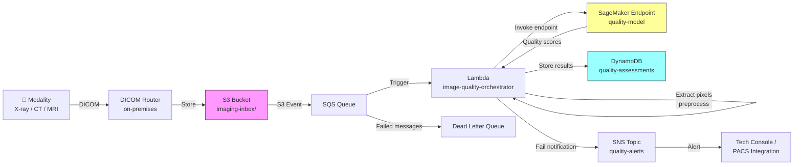

# Recipe 9.1 Architecture and Implementation: Image Quality Assessment

*Companion to [Recipe 9.1: Image Quality Assessment](chapter09.01-image-quality-assessment). This page covers the AWS architecture, services, prerequisites, and pseudocode. For the problem framing and the conceptual approach, start with the main recipe.*

---

## The AWS Implementation

Now let's build this on AWS. The architecture handles both near-real-time assessment (images flowing from modalities) and batch assessment (retrospective quality audits on historical studies).

### Why These Services

**Amazon SageMaker for model hosting.** Your quality model needs to respond fast and handle whatever imaging volume the department throws at it. SageMaker real-time endpoints give you managed model hosting with auto-scaling. For the sub-second latency requirement, a SageMaker endpoint with a GPU instance (or an optimized CPU instance for simpler models) is the right choice. You train the model on SageMaker as well, using your historical PACS rejection data as labels. For production deployments handling PHI, enable network isolation on the SageMaker endpoint (`EnableNetworkIsolation=True`) to prevent the model container from making outbound calls.

**Amazon S3 for image storage.** DICOM images land in S3 as the durable store. S3 event notifications trigger the assessment pipeline. For HIPAA compliance, S3 with SSE-KMS encryption is standard. The images are typically routed here from an on-premises DICOM router via AWS HealthImaging or a custom DICOM receiver.

**AWS Lambda for orchestration.** The glue between S3 (image arrives), preprocessing (DICOM parsing, pixel extraction), and SageMaker (inference). Lambda is triggered by the S3 event notification (a small JSON payload), then downloads the DICOM file from S3 into memory or `/tmp` storage. Single-frame radiographs (10-50 MB) fit comfortably within Lambda's 10 GB memory limit. Configure ephemeral storage to at least 1 GB. For multi-frame DICOM objects (ultrasound cine, digital breast tomosynthesis) or full CT studies processed as a single unit, consider ECS/Fargate tasks or SageMaker Processing jobs instead of Lambda.

**Amazon DynamoDB for results.** Quality assessment results need fast writes and fast lookups by study ID or accession number. DynamoDB's key-value model fits. Each record stores the quality scores, pass/fail decision, and metadata for audit.

**Amazon SNS for alerting.** When an image fails quality assessment, an SNS notification routes to the appropriate channel: a message to the technologist's console application, an email to the lead tech, or an integration with the department's communication system.

**AWS HealthImaging (optional).** If you're building a cloud-native imaging pipeline, AWS HealthImaging provides DICOM-native storage with sub-second retrieval of pixel data. It eliminates the need to parse DICOM files yourself and provides direct access to pixel arrays for inference.

### Architecture Diagram



For production, place an SQS queue between the S3 event notification and Lambda (S3 -> SQS -> Lambda), with a dead letter queue on the SQS queue for messages that fail after the configured retry count. A missed quality check should trigger an operational alert, not silent data loss.

### Prerequisites

| Requirement | Details |
|-------------|---------|
| **AWS Services** | Amazon SageMaker, Amazon S3, AWS Lambda, Amazon DynamoDB, Amazon SNS |
| **IAM Permissions** | `sagemaker:InvokeEndpoint` on `arn:aws:sagemaker:*:*:endpoint/image-quality-model`, `s3:GetObject` on `arn:aws:s3:::imaging-inbox/*`, `s3:PutObject` on `arn:aws:s3:::imaging-inbox/*`, `dynamodb:PutItem` on the specific table ARN, `sns:Publish` on the specific topic ARN |
| **BAA** | AWS BAA signed (required: medical images are PHI) |
| **Encryption** | S3: SSE-KMS; DynamoDB: encryption at rest (default); SageMaker endpoint: KMS encryption for model artifacts and instance storage; all API calls over TLS |
| **VPC** | Production: Lambda in VPC with VPC endpoints: `com.amazonaws.{region}.s3` (gateway), `com.amazonaws.{region}.sagemaker.runtime` (interface, for InvokeEndpoint), `com.amazonaws.{region}.dynamodb` (gateway), `com.amazonaws.{region}.sns` (interface), `com.amazonaws.{region}.logs` (interface). Interface endpoints require security groups allowing inbound HTTPS (port 443) from the Lambda function's security group. |
| **CloudTrail** | Enabled: log all S3 and SageMaker API calls for HIPAA audit trail |
| **Training Data** | Historical PACS rejection logs paired with the rejected images. Most radiology departments track rejection reasons. Minimum viable dataset: 1,000 accepted and 1,000 rejected images per modality. Never use real patient images in dev without proper IRB approval and de-identification. Ensure the DICOM router uses opaque identifiers (study UIDs or UUIDs) in S3 key paths rather than patient MRNs or names. Lambda CloudWatch Logs will contain these keys; if your S3 key structure includes PHI, configure the CloudWatch Logs log group with KMS encryption using a customer-managed key. |
| **Cost Estimate** | SageMaker endpoint (ml.m5.large): ~$0.115/hour (~$83/month always-on). S3 storage: negligible for assessment pipeline. Lambda + DynamoDB: negligible at typical imaging volumes. Per-image cost: ~$0.01 including all services. |

### Ingredients

| AWS Service | Role |
|------------|------|
| **Amazon SageMaker** | Hosts the quality assessment model; provides training infrastructure |
| **Amazon S3** | Stores incoming DICOM images; encrypted at rest with KMS |
| **AWS Lambda** | Orchestrates the pipeline: triggers on S3 event, preprocesses image, invokes model, routes results |
| **Amazon DynamoDB** | Stores structured quality assessment results for lookup and audit |
| **Amazon SNS** | Delivers quality failure alerts to technologists and supervisors |
| **AWS KMS** | Manages encryption keys for S3, DynamoDB, and SageMaker |
| **Amazon CloudWatch** | Logs, metrics, alarms for assessment latency and failure rates |

### Code

#### Walkthrough

**Step 1: Receive and parse the DICOM image.** When a DICOM file lands in the S3 bucket, the orchestrator function fires. The first job is extracting the pixel data and relevant metadata from the DICOM wrapper. DICOM is a complex format (it's both a file format and a network protocol), but for quality assessment we need three things: the pixel array, the modality type (to select the right quality criteria), and the study/series identifiers (to route results back to the right place). Skip this step and you're trying to feed a binary DICOM blob directly to a model that expects a pixel array.

```pseudocode
FUNCTION receive_image(bucket, key):
    // Download the DICOM file from S3
    dicom_bytes = download from S3 at bucket/key

    // Parse the DICOM structure to extract pixel data and metadata.
    // DICOM files contain both image pixels and extensive metadata
    // (patient info, acquisition parameters, modality type, etc.)
    dicom_object = parse DICOM from dicom_bytes

    // Extract what we need for quality assessment
    pixel_array = dicom_object.pixel_array          // the actual image data as a 2D numeric array
    modality    = dicom_object.Modality             // "CR", "CT", "MR", "DX", etc.
    study_uid   = dicom_object.StudyInstanceUID     // unique identifier for this imaging study
    series_uid  = dicom_object.SeriesInstanceUID    // unique identifier for this series within the study
    body_part   = dicom_object.BodyPartExamined     // "CHEST", "KNEE", "HEAD", etc.

    RETURN {
        pixels:     pixel_array,
        modality:   modality,
        study_uid:  study_uid,
        series_uid: series_uid,
        body_part:  body_part,
        source_key: key
    }
```

**Step 2: Compute rule-based quality metrics.** Before invoking the ML model, compute the fast, deterministic metrics that catch obvious failures. These are cheap to compute (milliseconds), require no model inference, and catch the most egregious problems: completely black images (detector malfunction), completely white images (overexposure), and severe blur (patient moved significantly). Think of this as the "fast reject" gate. If an image fails here, there's no point spending compute on the ML model. These metrics also feed into the ML model as additional input features, giving it both the raw pixels and the computed statistics.

```pseudocode
FUNCTION compute_basic_metrics(pixel_array):
    metrics = empty map

    // --- Blur Detection ---
    // The Laplacian operator computes the second derivative of the image.
    // Sharp images have high-frequency content (edges), which produces high variance
    // in the Laplacian output. Blurry images are smooth, producing low variance.
    laplacian        = apply Laplacian filter to pixel_array
    metrics["blur_score"] = variance(laplacian)
    // Higher score = sharper image. Typical threshold: 100-500 depending on modality.

    // --- Exposure Analysis ---
    // Compute the histogram of pixel intensities (how many pixels at each brightness level).
    // A well-exposed image uses a broad range of the available dynamic range.
    histogram        = compute intensity histogram of pixel_array
    metrics["mean_intensity"]   = mean(pixel_array)
    metrics["std_intensity"]    = standard_deviation(pixel_array)
    metrics["percentile_5"]     = 5th percentile of pixel_array    // darkest region
    metrics["percentile_95"]    = 95th percentile of pixel_array   // brightest region
    metrics["dynamic_range"]    = metrics["percentile_95"] - metrics["percentile_5"]

    // --- Noise Estimation ---
    // Estimate noise by looking at the standard deviation in a smooth region.
    // We use the median absolute deviation of the wavelet coefficients (robust estimator).
    noise_estimate   = estimate_noise(pixel_array)  // e.g., using wavelet-based method
    metrics["noise_level"] = noise_estimate

    // --- Basic Sanity Checks ---
    // These catch hardware failures and gross acquisition errors.
    metrics["is_blank"]    = (metrics["dynamic_range"] < 10)       // nearly uniform image
    metrics["is_saturated"] = (metrics["percentile_95"] >= 0.99 * max_possible_value)

    RETURN metrics
```

**Step 3: Invoke the ML quality model.** The rule-based metrics catch the obvious cases. The ML model handles the nuanced ones: subtle motion blur that the Laplacian variance doesn't flag, positioning errors that require understanding anatomy, and the complex interaction between multiple quality factors. The model takes the preprocessed pixel array (resized to a standard input dimension) and optionally the computed metrics as auxiliary features. It returns a quality score (0 to 1, where 1 is perfect quality) and optionally per-category scores (blur, exposure, positioning, artifacts). The model was trained on your institution's historical rejection data, so it learns your radiologists' quality standards.

```pseudocode
FUNCTION assess_quality_ml(pixel_array, basic_metrics, modality):
    // Preprocess the image for model input.
    // Resize to the model's expected input dimensions (e.g., 512x512).
    // Normalize pixel values to 0-1 range.
    preprocessed = resize(pixel_array, target_size=(512, 512))
    preprocessed = normalize(preprocessed, min=0, max=1)

    // Combine pixel data with computed metrics as model input.
    // The model architecture accepts both the image and tabular features.
    model_input = {
        "image":    preprocessed,
        "metrics":  basic_metrics,
        "modality": modality          // modality as a categorical feature
    }

    // Call the SageMaker endpoint for inference.
    // The endpoint hosts the trained quality assessment model.
    response = invoke SageMaker endpoint "image-quality-model" with model_input

    // Parse the model's output: overall score plus per-category breakdown.
    quality_score = response["overall_quality"]    // 0.0 to 1.0
    category_scores = {
        "sharpness":    response["sharpness_score"],
        "exposure":     response["exposure_score"],
        "positioning":  response["positioning_score"],
        "artifacts":    response["artifact_score"]
    }

    RETURN {
        overall_score:    quality_score,
        category_scores:  category_scores
    }
```

**Step 4: Apply decision thresholds.** The model gives you a continuous score. The clinical workflow needs a discrete decision: accept, flag for review, or reject. This step applies configurable thresholds that translate scores into actions. The thresholds are stored externally (not baked into the model) so they can be tuned per site, per modality, and per body part without retraining. A three-tier system works well in practice: clear pass, borderline (flag for tech review), and clear fail (immediate retake alert). Skip this step and you're dumping raw probability scores on technologists who need a yes/no answer.

```pseudocode
// Thresholds are configurable per modality and body part.
// These are loaded from a configuration store, not hardcoded.
THRESHOLDS = {
    "CR_CHEST": { "accept": 0.85, "review": 0.65 },
    "CT_HEAD":  { "accept": 0.90, "review": 0.70 },
    "MR_KNEE":  { "accept": 0.80, "review": 0.60 },
    "DEFAULT":  { "accept": 0.85, "review": 0.65 }
}

FUNCTION apply_decision(quality_result, modality, body_part):
    // Look up the appropriate thresholds for this modality/body part combination.
    threshold_key = modality + "_" + body_part
    thresholds = THRESHOLDS[threshold_key] OR THRESHOLDS["DEFAULT"]

    overall = quality_result.overall_score

    IF overall >= thresholds["accept"]:
        decision = "ACCEPT"
        action   = "Route to PACS normally"

    ELSE IF overall >= thresholds["review"]:
        decision = "REVIEW"
        action   = "Flag for technologist review before patient leaves"

    ELSE:
        decision = "REJECT"
        action   = "Alert technologist: retake recommended"
        // Include the worst-scoring category to give actionable feedback.
        worst_category = find category with lowest score in quality_result.category_scores
        action = action + " (primary issue: " + worst_category + ")"

    RETURN {
        decision:        decision,
        action:          action,
        overall_score:   overall,
        category_scores: quality_result.category_scores,
        thresholds_used: thresholds
    }
```

**Step 5: Store results and alert.** Write the quality assessment to the database for audit and analytics, and fire an alert if the image was rejected or flagged. The stored record links back to the original image (by study UID and source key) so you can always trace a quality decision back to its source. The alert goes through SNS to whatever channel the technologist monitors: a dashboard, a pager, or an integration with the modality console software.

```pseudocode
FUNCTION store_and_alert(image_info, decision_result):
    // Write the complete assessment record to DynamoDB.
    // This is the audit trail: what was assessed, when, and what was decided.
    write record to database table "quality-assessments":
        study_uid        = image_info.study_uid
        series_uid       = image_info.series_uid
        source_key       = image_info.source_key
        modality         = image_info.modality
        body_part        = image_info.body_part
        assessment_time  = current UTC timestamp (ISO 8601)
        decision         = decision_result.decision          // "ACCEPT", "REVIEW", or "REJECT"
        overall_score    = decision_result.overall_score
        category_scores  = decision_result.category_scores
        thresholds_used  = decision_result.thresholds_used
        action           = decision_result.action

    // If the image was rejected or flagged, alert the technologist.
    IF decision_result.decision IN ["REJECT", "REVIEW"]:
        publish to SNS topic "quality-alerts":
            message = {
                study_uid:  image_info.study_uid,
                modality:   image_info.modality,
                body_part:  image_info.body_part,
                decision:   decision_result.decision,
                action:     decision_result.action,
                score:      decision_result.overall_score
            }

    RETURN decision_result.decision
```

> **Curious how this looks in Python?** The pseudocode above covers the concepts. If you'd like to see sample Python code that demonstrates these patterns using boto3, check out the [Python Example](chapter09.01-python-example). It walks through each step with inline comments and notes on what you'd need to change for a real deployment.

### Expected Results

**Sample output for a chest X-ray with motion blur:**

```json
{
  "study_uid": "1.2.840.113619.2.55.3.604688.2026.03.15.09.42.31",
  "series_uid": "1.2.840.113619.2.55.3.604688.2026.03.15.09.42.31.1",
  "source_key": "imaging-inbox/2026/03/15/study-00891.dcm",
  "modality": "CR",
  "body_part": "CHEST",
  "assessment_time": "2026-03-15T09:42:35Z",
  "decision": "REJECT",
  "overall_score": 0.42,
  "category_scores": {
    "sharpness": 0.31,
    "exposure": 0.88,
    "positioning": 0.76,
    "artifacts": 0.92
  },
  "action": "Alert technologist: retake recommended (primary issue: sharpness)"
}
```

**Performance benchmarks:**

| Metric | Typical Value |
|--------|---------------|
| Lambda processing time (single image) | 1.5-3 seconds |
| Rule-based metrics computation | 50-200 ms |
| ML model inference | 200-500 ms |
| End-to-end latency (acquisition to alert, steady state) | 5-15 seconds |
| Quality classification accuracy | 88-94% agreement with radiologist judgment |
| False positive rate (good images flagged as bad) | 3-7% |
| False negative rate (bad images missed) | 1-3% |
| Cost per image | ~$0.01 (SageMaker + Lambda + DynamoDB) |
| Throughput | ~20-50 images/second (endpoint-limited) |

The 1.5-3 second figure represents Lambda processing time (DICOM parse, metrics computation, inference, result storage). Total end-to-end latency from image acquisition to technologist alert depends on the DICOM transfer path, S3 event notification propagation, and Lambda cold start behavior. Expect 5-15 seconds in steady state with provisioned concurrency, longer with cold starts. For sub-second feedback at the modality console, see the Edge Deployment variation below.

**Where it struggles:** Borderline cases where radiologists themselves disagree. Modalities or body parts not well-represented in training data. Images from new equipment models with different noise characteristics. Pediatric images (different anatomy, different quality standards, more motion). And the fundamental tension: the model learns your institution's historical standards, which may not be optimal.

---

## Variations and Extensions

**Edge deployment for real-time feedback.** Instead of routing images to the cloud for assessment, deploy a lightweight model (quantized, optimized for inference) directly on hardware at the modality or DICOM router. This gets latency under 500ms and enables immediate feedback on the modality console. AWS IoT Greengrass or a SageMaker Edge deployment can manage model updates to edge devices. The tradeoff: you lose the scalability of cloud inference and need to manage edge hardware.

**Multi-image study-level assessment.** Instead of assessing each image independently, evaluate the entire study as a unit. A CT scan might have 200 slices; a few with motion artifact might be acceptable if the key anatomy is well-visualized on adjacent slices. This requires a study-level aggregation model that understands which slices are diagnostically critical for the ordered indication.

**Feedback-driven model improvement.** When a technologist overrides the system's decision (accepts an image the system flagged, or rejects one the system passed), capture that as a training signal. Build a continuous learning pipeline where override events are reviewed, validated, and incorporated into the next model version. This closes the loop between deployment and improvement.

---

## Additional Resources

**AWS Documentation:**
- [Amazon SageMaker Real-Time Inference](https://docs.aws.amazon.com/sagemaker/latest/dg/realtime-endpoints.html)
- [Amazon SageMaker Training](https://docs.aws.amazon.com/sagemaker/latest/dg/train-model.html)
- [AWS HealthImaging Developer Guide](https://docs.aws.amazon.com/healthimaging/latest/devguide/what-is.html)
- [AWS HIPAA Eligible Services](https://aws.amazon.com/compliance/hipaa-eligible-services-reference/)
- [Amazon SageMaker Pricing](https://aws.amazon.com/sagemaker/pricing/)
- [Architecting for HIPAA on AWS (Whitepaper)](https://docs.aws.amazon.com/whitepapers/latest/architecting-hipaa-security-and-compliance-on-aws/welcome.html)

**AWS Sample Repos:**
- [`amazon-sagemaker-examples`](https://github.com/aws/amazon-sagemaker-examples): Comprehensive SageMaker examples including image classification, model deployment, and endpoint management
- [`aws-healthcare-lifescience-ai-ml`](https://github.com/aws-samples/aws-healthcare-lifescience-ai-ml): Healthcare and life science AI/ML examples on AWS including medical imaging patterns

**AWS Solutions and Blogs:**
- [Scalable Medical Computer Vision Model Training](https://aws.amazon.com/blogs/machine-learning/scalable-medical-computer-vision-model-training-with-amazon-sagemaker/): Patterns for training medical imaging models at scale on SageMaker
- [AWS for Health: Medical Imaging](https://aws.amazon.com/health/solutions/medical-imaging/): Overview of AWS services for medical imaging workflows

---

## Estimated Implementation Time

| Phase | Duration |
|-------|----------|
| **Basic** (rule-based metrics only, single modality) | 2-3 weeks |
| **Production-ready** (ML model, multi-modality, alerting, monitoring) | 8-12 weeks |
| **With variations** (edge deployment, study-level, continuous learning) | 16-20 weeks |

---


---

*← [Main Recipe 9.1](chapter09.01-image-quality-assessment) · [Python Example](chapter09.01-python-example) · [Chapter Preface](chapter09-preface)*
