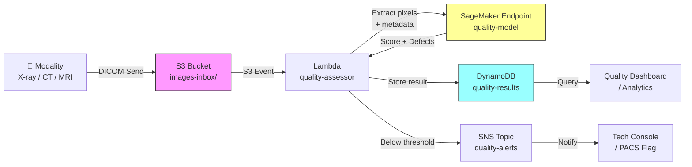

# Recipe 9.1: Image Quality Assessment

**Complexity:** Simple · **Phase:** MVP · **Estimated Cost:** ~$0.01 per image

---

## The Problem

A radiologist opens their worklist at 7 AM. Forty-three studies waiting. They pull up the first chest X-ray and immediately see it: the image is rotated 15 degrees, the patient wasn't positioned correctly, and there's motion blur across the left lung field. Unreadable. They reject it, dictate a note requesting a retake, and move on. The patient has already left the facility. Now someone has to call them back, schedule another appointment, expose them to additional radiation, and delay the clinical decision that was waiting on that image.

This happens constantly. Studies suggest that 5-15% of medical images acquired in routine clinical practice have quality issues significant enough to affect interpretation. In high-volume radiology departments processing hundreds of studies per day, that's dozens of wasted reads, dozens of callbacks, and dozens of delayed diagnoses. Every single day.

The frustrating part? Most of these quality problems are detectable at the moment of acquisition. A blurry image is blurry immediately. A poorly positioned patient is poorly positioned immediately. An underexposed X-ray is underexposed immediately. The technologist at the machine could catch it and retake it right then, while the patient is still on the table. But they're busy, they're processing patients quickly, and subtle quality issues aren't always obvious on the small acquisition console screen.

What if the machine itself could flag the problem in real time? "Hey, this image has motion artifact in the lower left quadrant. Confidence: high. Recommend retake." The tech glances at it, agrees, and retakes it before the patient leaves. Problem solved at the source, not downstream.

That's what automated image quality assessment does. It's a gatekeeper that sits between acquisition and the archive, catching problems early when they're cheap to fix.

---

## The Technology: How Computers Judge Image Quality

### What "Quality" Means in Medical Imaging

Image quality in medical imaging is not the same as image quality in photography. A beautiful, well-composed photograph can be a terrible medical image if the anatomy of interest isn't properly visualized. Quality here means: can a clinician reliably interpret this image for its intended diagnostic purpose?

The quality dimensions vary by modality, but the common ones are:

**Exposure/brightness.** Is the image too dark (underexposed) or too bright (overexposed)? In X-ray, this maps to whether the radiation dose produced adequate contrast between tissue types. An underexposed chest X-ray makes it impossible to distinguish subtle lung nodules from background noise.

**Contrast.** Can you differentiate the structures that matter? A CT scan with poor contrast between soft tissue types is clinically useless even if it's technically sharp.

**Sharpness/motion artifact.** Did the patient move during acquisition? Motion blur in an MRI can turn a crisp brain scan into an unreadable smear. Even small movements during a long acquisition sequence create ghosting artifacts.

**Positioning.** Is the anatomy of interest actually in the field of view? Is the patient rotated when they should be straight? Is the collimation appropriate? A chest X-ray where the costophrenic angles are cut off is incomplete regardless of how sharp it is.

**Artifacts.** Metal implants causing streak artifacts in CT. Zipper artifacts in MRI from RF interference. Grid lines visible in a portable X-ray. Foreign objects in the field of view (jewelry, clothing snaps, hair clips).

**Noise.** Random variation in pixel values that obscures fine detail. More common in low-dose protocols and in larger patients where the signal-to-noise ratio drops.

### The Computer Vision Approach

Automated image quality assessment is fundamentally a classification problem. Given an image, assign it to one of several quality categories: acceptable, borderline, or reject. Some systems go further and identify the specific quality defect (motion, positioning, exposure, artifact).

There are two broad approaches:

**Reference-based metrics.** Compare the image against a known "perfect" reference. Metrics like SSIM (Structural Similarity Index), PSNR (Peak Signal-to-Noise Ratio), and MSE (Mean Squared Error) quantify how much an image deviates from a reference. The problem: in clinical practice, you rarely have a reference image. Each patient is unique. These metrics work well for quality control in phantom testing (where you image a known object repeatedly), but poorly for real patient images.

**No-reference (blind) quality assessment.** Judge the image quality without any reference. This is what you actually need in clinical practice. The model learns what "good" looks like from a training set of images labeled by radiologists or technologists as acceptable or unacceptable. Modern approaches use convolutional neural networks (CNNs) trained on thousands of labeled examples. The network learns to detect blur patterns, noise characteristics, positioning errors, and artifact signatures directly from pixel data.

The no-reference approach is where the field has moved, and it's what we'll build.

### Training Data: The Hard Part Nobody Talks About

Here's the thing that makes this problem deceptively simple-sounding but operationally tricky: you need labeled training data, and labeling image quality is surprisingly subjective.

Ask three radiologists whether a slightly rotated chest X-ray is "acceptable" or "reject," and you'll get three different answers depending on the clinical question, their personal tolerance, and what they had for breakfast. Quality thresholds vary by institution, by modality, by body part, and by clinical indication. A chest X-ray that's adequate for confirming line placement might be inadequate for evaluating a subtle pneumothorax.

The practical approach: use your institution's existing reject/repeat data. Most radiology departments track which images were rejected and why. That's your training set. Images that made it to the archive and were successfully interpreted are your "acceptable" class. Images that were rejected with documented reasons are your "reject" class, with the reason serving as the defect label.

The catch: reject rates vary enormously across institutions (2-20%), so your "reject" class will be much smaller than your "acceptable" class. Class imbalance is a real problem here and needs to be addressed in training (oversampling, class weights, or synthetic augmentation of the minority class).

### Where the Field Is Now

Image quality assessment for medical imaging has matured significantly in the last five years. Several things have converged:

1. **Pre-trained models.** Transfer learning from ImageNet or medical imaging foundation models means you don't need millions of labeled examples. Fine-tuning a pre-trained CNN on a few thousand quality-labeled images gets you surprisingly far.

2. **Multi-task learning.** Models that simultaneously predict overall quality AND identify specific defects (motion, positioning, exposure) outperform single-task binary classifiers. The defect identification task provides a richer learning signal.

3. **Real-time inference.** Modern GPU inference can process a single image in under 100 milliseconds. That's fast enough to provide feedback at the acquisition console before the patient leaves the table.

4. **DICOM metadata integration.** Combining pixel-level analysis with acquisition metadata (kVp, mAs, slice thickness, patient size) improves accuracy. A "dark" image might be appropriately exposed for a large patient but underexposed for a small one. Metadata provides context.

The accuracy numbers are encouraging. Published studies report 85-95% agreement with expert radiologist quality assessments for binary accept/reject classification. That's not perfect, but it's good enough for a screening tool that flags potential issues for technologist review rather than making autonomous reject decisions.

---

## General Architecture Pattern

The pipeline has four logical stages:

```
[Acquire Image] → [Assess Quality] → [Route Decision] → [Act on Result]
```

**Acquire Image.** A medical image is produced by the modality (X-ray machine, CT scanner, MRI, ultrasound). The image exists as a DICOM file containing both pixel data and metadata (patient info, acquisition parameters, study context).

**Assess Quality.** The image is passed to a quality assessment model. The model produces: (1) an overall quality score (0-100 or categorical), (2) specific defect flags if quality is below threshold, and (3) confidence in its assessment. The model may use pixel data alone or combine it with DICOM metadata for context-aware assessment.

**Route Decision.** Based on the quality score and institutional thresholds, the image is routed to one of three paths:
- **Accept:** Quality meets threshold. Image proceeds to PACS archive and radiologist worklist.
- **Review:** Quality is borderline. Image is flagged for technologist review before archiving.
- **Reject:** Quality is clearly inadequate. Technologist is alerted immediately for potential retake while patient is still present.

**Act on Result.** For accepted images, no action needed. For review/reject, the system generates an alert with the specific quality defect identified, enabling the technologist to make an informed decision about retake. Results are logged for quality improvement analytics.

The key architectural decision is where this assessment runs. Two options:

**Edge (at the modality).** The model runs on hardware at or near the acquisition device. Lowest latency, enables real-time feedback before the patient leaves. Requires edge compute infrastructure and model deployment to potentially hundreds of devices.

**Cloud (centralized).** Images are sent to a central service for assessment after acquisition. Simpler deployment and model management, but higher latency. The patient may have left by the time the assessment completes. Better suited for batch quality monitoring and analytics than real-time intervention.

Most production deployments use a hybrid: lightweight checks at the edge (basic exposure, obvious motion) with comprehensive assessment in the cloud (subtle artifacts, positioning analysis, multi-image consistency).

---

## The AWS Implementation

### Why These Services

**Amazon SageMaker for model hosting.** SageMaker provides managed inference endpoints that can serve a trained image quality model with auto-scaling, A/B testing, and model versioning. For a CNN-based quality classifier, a SageMaker real-time endpoint on a GPU instance delivers sub-second inference. SageMaker also handles the training pipeline: bring your labeled DICOM dataset, fine-tune a pre-trained model, and deploy it without managing infrastructure.

**Amazon S3 for image storage.** DICOM files land in S3 as the durable storage layer. S3 event notifications trigger the quality assessment pipeline automatically when new images arrive. Server-side encryption with KMS protects PHI at rest.

**AWS Lambda for orchestration.** Lambda coordinates the workflow: receives the S3 event, extracts relevant DICOM metadata, invokes the SageMaker endpoint, interprets the result, and routes the image accordingly. For the lightweight preprocessing (DICOM header parsing, image resizing for model input), Lambda's compute is sufficient.

**Amazon DynamoDB for results and routing.** Quality assessment results (scores, defect flags, routing decisions) are stored in DynamoDB for fast lookup by study ID. Downstream systems (PACS integration, technologist dashboards, quality analytics) query this table to determine image status.

**Amazon SNS for alerts.** When an image is flagged for review or reject, SNS delivers real-time notifications to the technologist console, quality management dashboard, or integration engine. Low latency alerting is critical for the "retake while patient is present" use case.

**Amazon CloudWatch for monitoring.** Track model inference latency, quality score distributions, reject rates by modality and shift, and alert on anomalies (sudden spike in reject rate might indicate equipment malfunction rather than technologist error).

### Architecture Diagram



### Prerequisites

| Requirement | Details |
|-------------|---------|
| **AWS Services** | Amazon SageMaker, Amazon S3, AWS Lambda, Amazon DynamoDB, Amazon SNS, Amazon CloudWatch |
| **IAM Permissions** | `sagemaker:InvokeEndpoint`, `s3:GetObject`, `s3:PutObject`, `dynamodb:PutItem`, `dynamodb:GetItem`, `sns:Publish` |
| **BAA** | AWS BAA signed (required: DICOM images contain PHI in headers and pixel data) |
| **Encryption** | S3: SSE-KMS; DynamoDB: encryption at rest (default); SageMaker endpoint: in-transit TLS + at-rest KMS; SNS: encrypted topic |
| **VPC** | Production: Lambda in VPC with VPC endpoints for S3, SageMaker, DynamoDB, SNS, and CloudWatch Logs |
| **CloudTrail** | Enabled: log all SageMaker invocations and S3 access for HIPAA audit trail |
| **Sample Data** | Synthetic or de-identified DICOM images with quality labels. Public datasets: MURA (musculoskeletal radiographs), CheXpert (chest X-rays with quality annotations). Never use real patient images in dev without proper de-identification. |
| **Cost Estimate** | SageMaker real-time endpoint (ml.g4dn.xlarge): ~$0.736/hour. At 1000 images/day with sub-second inference, the per-image cost is ~$0.001. S3 + Lambda + DynamoDB negligible at this scale. |

### Ingredients

| AWS Service | Role |
|------------|------|
| **Amazon SageMaker** | Hosts trained quality assessment CNN model; provides real-time inference endpoint |
| **Amazon S3** | Stores incoming DICOM images; triggers processing pipeline |
| **AWS Lambda** | Orchestrates workflow: DICOM parsing, model invocation, result routing |
| **Amazon DynamoDB** | Stores quality scores, defect flags, and routing decisions per image |
| **Amazon SNS** | Delivers real-time alerts for below-threshold images |
| **AWS KMS** | Manages encryption keys for all data stores |
| **Amazon CloudWatch** | Metrics, logs, and alarms for pipeline health and quality trends |

### Code

#### Walkthrough

**Step 1: Receive and parse DICOM image.** When a new DICOM file lands in the S3 bucket (sent from the modality via a DICOM router or gateway), the pipeline triggers automatically. The first step extracts two things from the DICOM file: the pixel data (the actual image) and the acquisition metadata (modality type, body part, acquisition parameters). The metadata provides context that improves quality assessment accuracy. A "dark" chest X-ray might be perfectly exposed for a large patient. Without the metadata context, the model might incorrectly flag it. Skip this step and you're flying blind on context.

```
FUNCTION receive_image(bucket, key):
    // Download the DICOM file from storage
    dicom_bytes = download file from bucket/key

    // Parse the DICOM format to extract pixel data and metadata separately.
    // DICOM is a container format: it wraps the image pixels inside a structured
    // header containing patient info, study info, and acquisition parameters.
    dicom_object = parse DICOM from dicom_bytes

    // Extract the pixel array (the actual image data the model will analyze)
    pixel_array = dicom_object.pixel_array

    // Extract acquisition metadata that provides context for quality assessment
    metadata = {
        modality:       dicom_object.Modality,          // "CR", "CT", "MR", etc.
        body_part:      dicom_object.BodyPartExamined,  // "CHEST", "HEAD", "KNEE", etc.
        kvp:            dicom_object.KVP,               // X-ray tube voltage (exposure indicator)
        exposure:       dicom_object.Exposure,          // radiation exposure in mAs
        patient_size:   dicom_object.PatientSize,       // helps contextualize exposure adequacy
        study_uid:      dicom_object.StudyInstanceUID,  // unique study identifier
        series_uid:     dicom_object.SeriesInstanceUID, // unique series identifier
        instance_uid:   dicom_object.SOPInstanceUID     // unique image identifier
    }

    RETURN pixel_array, metadata
```

**Step 2: Preprocess for model input.** The raw DICOM pixel array isn't ready for the model as-is. Medical images come in wildly different sizes (a chest X-ray might be 3000x3000 pixels, a CT slice 512x512), different bit depths (12-bit or 16-bit, not the 8-bit that most models expect), and different value ranges. This step normalizes everything into a consistent format the model expects. The preprocessing must match exactly what was used during training. If you trained on 224x224 images normalized to 0-1 range, you must resize and normalize identically at inference time. A mismatch here silently destroys accuracy with no error message.

```
FUNCTION preprocess_image(pixel_array, metadata):
    // Resize to the model's expected input dimensions.
    // Most CNN architectures expect square inputs (224x224, 299x299, etc.)
    // Bilinear interpolation preserves image features better than nearest-neighbor.
    resized = resize pixel_array to (224, 224) using bilinear interpolation

    // Normalize pixel values to 0-1 range.
    // DICOM images can be 12-bit (0-4095) or 16-bit (0-65535).
    // The model was trained on normalized values, so we must match that.
    normalized = resized / maximum_pixel_value(resized)

    // Convert to 3-channel if model expects RGB input.
    // Medical images are typically grayscale (single channel).
    // Pre-trained models from ImageNet expect 3 channels.
    IF normalized is single-channel:
        normalized = stack [normalized, normalized, normalized] along channel axis

    // Package metadata as a separate feature vector for the model.
    // This allows the model to contextualize pixel-level quality with acquisition info.
    metadata_features = encode_metadata(metadata)
    // encode_metadata converts categorical fields (modality, body_part) to numeric
    // and normalizes continuous fields (kvp, exposure) to standard ranges

    RETURN normalized, metadata_features
```

**Step 3: Invoke quality assessment model.** The preprocessed image and metadata features are sent to the trained model for inference. The model returns a quality score (0-100), a categorical verdict (accept/review/reject), and specific defect flags if quality is below threshold. The model architecture is typically a CNN (ResNet, EfficientNet, or similar) with a multi-head output: one head for overall quality score, one for defect classification. Inference takes 50-200 milliseconds on a GPU endpoint. If this step fails (endpoint unavailable, timeout), the image should proceed to the archive without a quality flag rather than blocking the clinical workflow. Quality assessment is an enhancement, not a gate.

```
FUNCTION assess_quality(image_tensor, metadata_features):
    // Package the input for the model endpoint.
    // The model expects both the image tensor and the metadata features.
    payload = {
        image:    image_tensor,        // preprocessed 224x224x3 normalized image
        metadata: metadata_features    // encoded acquisition parameters
    }

    // Call the model inference endpoint.
    // This is a synchronous call; the endpoint returns results in <200ms.
    response = invoke model endpoint with payload

    // Parse the model's output into structured quality assessment.
    result = {
        quality_score:   response.score,          // 0-100 continuous score
        verdict:         response.verdict,        // "accept", "review", or "reject"
        defects:         response.defects,        // list of detected defects, e.g.,
                                                  // ["motion_artifact", "rotation"]
        confidence:      response.confidence,     // model's confidence in its assessment
        defect_regions:  response.regions         // bounding boxes of problem areas (optional)
    }

    RETURN result
```

**Step 4: Apply institutional thresholds and route.** The model's raw output needs to be interpreted through institutional policy. Different departments may have different quality thresholds. A trauma X-ray taken in the ED might have a lower quality bar than an elective screening mammogram. This step applies configurable thresholds and determines the routing action. The thresholds should be tunable without redeploying the model. Store them in configuration, not code. Skip this step and you're stuck with a one-size-fits-all threshold that will either over-reject (annoying techs) or under-reject (missing real problems).

```
// Thresholds are configurable per modality and body part.
// These are starting points; calibrate based on your institution's reject/repeat data.
THRESHOLDS = {
    "CR_CHEST":  { accept: 75, review: 50 },   // chest X-ray
    "CR_KNEE":   { accept: 70, review: 45 },   // knee X-ray
    "CT_HEAD":   { accept: 80, review: 60 },   // head CT (higher bar)
    "MR_BRAIN":  { accept: 80, review: 60 },   // brain MRI (higher bar)
    "DEFAULT":   { accept: 70, review: 50 }    // fallback for unlisted combinations
}

FUNCTION route_image(quality_result, metadata):
    // Look up the threshold for this modality + body part combination.
    threshold_key = metadata.modality + "_" + metadata.body_part
    thresholds = THRESHOLDS[threshold_key] OR THRESHOLDS["DEFAULT"]

    // Determine routing based on score vs. thresholds.
    IF quality_result.quality_score >= thresholds.accept:
        routing = "accept"
        action  = "proceed to archive"

    ELSE IF quality_result.quality_score >= thresholds.review:
        routing = "review"
        action  = "flag for technologist review"

    ELSE:
        routing = "reject"
        action  = "alert technologist for immediate retake consideration"

    RETURN {
        routing:    routing,
        action:     action,
        score:      quality_result.quality_score,
        defects:    quality_result.defects,
        confidence: quality_result.confidence,
        threshold_used: thresholds
    }
```

**Step 5: Store result and notify.** The quality assessment result is persisted for audit, analytics, and downstream system consumption. If the image was flagged for review or reject, a real-time notification is sent to the technologist. The stored record enables quality improvement programs: track reject rates by technologist, by modality, by time of day. Identify equipment that's producing more artifacts than expected. Measure whether the quality program is actually reducing repeat rates over time.

```
FUNCTION store_and_notify(metadata, routing_result):
    // Write the quality assessment record to the database.
    // This is the permanent audit trail of every quality decision.
    write to database table "quality-results":
        image_id         = metadata.instance_uid
        study_id         = metadata.study_uid
        modality         = metadata.modality
        body_part        = metadata.body_part
        quality_score    = routing_result.score
        routing          = routing_result.routing
        defects          = routing_result.defects
        confidence       = routing_result.confidence
        assessed_at      = current UTC timestamp (ISO 8601)
        threshold_used   = routing_result.threshold_used

    // If the image needs attention, alert the technologist immediately.
    IF routing_result.routing IN ["review", "reject"]:
        publish notification:
            topic   = "quality-alerts"
            message = {
                image_id:  metadata.instance_uid,
                study_id:  metadata.study_uid,
                routing:   routing_result.routing,
                score:     routing_result.score,
                defects:   routing_result.defects,
                action:    routing_result.action
            }

    RETURN routing_result.routing
```

> **Curious how this looks in Python?** The pseudocode above covers the concepts. If you'd like to see sample Python code that demonstrates these patterns using boto3, check out the [Python Example](chapter09.01-python-example). It walks through each step with inline comments and notes on what you'd need to change for a real deployment.

### Expected Results

**Sample output for a chest X-ray with motion artifact:**

```json
{
  "image_id": "1.2.840.113619.2.55.3.604688.2026.05.15.10.42.33.001",
  "study_id": "1.2.840.113619.2.55.3.604688.2026.05.15.10.42.33",
  "modality": "CR",
  "body_part": "CHEST",
  "quality_score": 42.7,
  "routing": "reject",
  "defects": ["motion_artifact", "rotation"],
  "confidence": 0.91,
  "assessed_at": "2026-05-15T10:42:38Z",
  "threshold_used": { "accept": 75, "review": 50 }
}
```

**Performance benchmarks:**

| Metric | Typical Value |
|--------|---------------|
| End-to-end latency | 0.5-2 seconds (S3 event to notification) |
| Model inference time | 50-200 ms on ml.g4dn.xlarge |
| Binary accuracy (accept/reject) | 85-93% agreement with radiologist |
| Defect classification accuracy | 78-88% per defect type |
| Cost per image | ~$0.001 (inference) + negligible storage/compute |
| Throughput | ~100 images/second per endpoint instance |

**Where it struggles:**

- Subtle positioning errors that require anatomical knowledge (e.g., slight rotation that clips a costophrenic angle)
- Quality judgments that depend on clinical indication (adequate for line check, inadequate for nodule evaluation)
- Novel artifact types not seen in training data
- Images from new equipment models with different noise characteristics than training data
- Borderline cases where even radiologists disagree

---

## The Honest Take

This is one of those problems that sounds like it should be solved already. And in some ways it is: every modern modality has basic exposure indicators built in. But the gap between "exposure is technically adequate" and "this image is diagnostically useful for the specific clinical question" is where all the interesting (and hard) work lives.

The biggest surprise when building this: the model accuracy isn't the hard part. Getting 85-90% agreement with radiologists on binary accept/reject is achievable with a few thousand labeled examples and a fine-tuned ResNet. The hard part is everything around the model.

First, threshold calibration. Set the reject threshold too aggressively and technologists start ignoring the alerts (alert fatigue is real and deadly in healthcare). Set it too conservatively and you're not catching the images that actually need retakes. You need to calibrate per institution, per modality, and then recalibrate quarterly as equipment ages and staff turns over.

Second, workflow integration. The quality assessment is useless if the alert doesn't reach the technologist while the patient is still on the table. That means sub-5-second end-to-end latency from acquisition to alert. It means integration with the modality console or a nearby display. It means not interrupting the technologist's workflow for every borderline case. The UX matters more than the model accuracy.

Third, the training data problem. Your "reject" class is small (2-10% of images), subjective (radiologists disagree), and institution-specific (what's acceptable at a trauma center might not be at a screening facility). You'll spend more time curating training data than training models.

The part I'd do differently: start with a single modality and body part (chest X-ray is the obvious choice: high volume, well-studied, public datasets available). Get that working end-to-end including the workflow integration. Then expand to other modalities. Trying to build a universal quality model across all modalities from day one is a recipe for a model that's mediocre at everything and excellent at nothing.

---

## Variations and Extensions

**Real-time edge deployment.** Instead of cloud-based assessment after the image reaches S3, deploy a lightweight model (MobileNet or EfficientNet-Lite) directly on edge hardware at the modality. This enables sub-second feedback on the acquisition console itself. The tradeoff: you're managing model deployments across potentially hundreds of devices, and the edge model may be less accurate than a larger cloud model. Consider a two-tier approach: fast edge model for obvious defects, cloud model for comprehensive assessment.

**Quality trend analytics.** Aggregate quality scores over time to build operational dashboards. Track reject rates by technologist (identify training needs), by equipment (identify maintenance needs), by time of day (identify fatigue patterns), and by patient population (identify systematic challenges). This transforms a per-image tool into a quality improvement program.

**Feedback loop for model improvement.** When a technologist overrides the model's recommendation (accepts an image the model flagged, or rejects one the model accepted), capture that disagreement as a training signal. Periodically retrain the model on these corrections. Over time, the model adapts to your institution's specific quality standards. This requires careful tracking of overrides and a retraining pipeline, but it's how you get from 85% to 93% accuracy.

---

## Related Recipes

- **Recipe 9.4 (Dermatology Lesion Triage):** Uses similar CNN classification architecture but for clinical content rather than technical quality
- **Recipe 9.5 (Chest X-Ray Triage):** Downstream consumer of quality-assessed images; quality gating ensures the triage model receives interpretable inputs
- **Recipe 9.7 (Radiology AI Triage, Multi-Modality):** Multi-modality quality assessment is a prerequisite for reliable multi-modality triage
- **Recipe 3.5 (Lab Result Outlier Detection):** Analogous pattern of automated quality gating before downstream consumption

---

## Additional Resources

**AWS Documentation:**
- [Amazon SageMaker Real-Time Inference](https://docs.aws.amazon.com/sagemaker/latest/dg/realtime-endpoints.html)
- [Amazon SageMaker Built-in Image Classification Algorithm](https://docs.aws.amazon.com/sagemaker/latest/dg/image-classification.html)
- [Amazon S3 Event Notifications](https://docs.aws.amazon.com/AmazonS3/latest/userguide/EventNotifications.html)
- [AWS HIPAA Eligible Services](https://aws.amazon.com/compliance/hipaa-eligible-services-reference/)
- [Architecting for HIPAA on AWS (Whitepaper)](https://docs.aws.amazon.com/whitepapers/latest/architecting-hipaa-security-and-compliance-on-aws/welcome.html)
- [Amazon SageMaker Pricing](https://aws.amazon.com/sagemaker/pricing/)

**AWS Sample Repos:**
- [`amazon-sagemaker-examples`](https://github.com/aws/amazon-sagemaker-examples): Comprehensive SageMaker examples including image classification, model deployment, and inference pipelines
- [`aws-healthcare-lifescience-ai-ml`](https://github.com/aws-samples/aws-healthcare-lifescience-ai-ml): Healthcare and life science AI/ML examples on AWS including medical imaging workflows

**AWS Solutions and Blogs:**
- [AWS Solutions Library: AI/ML](https://aws.amazon.com/solutions/ai-ml/): Deployable reference architectures for ML inference pipelines
- [Medical Imaging on AWS](https://aws.amazon.com/health/solutions/medical-imaging/): AWS healthcare imaging solutions overview including DICOM handling and AI integration patterns

---

## Estimated Implementation Time

| Tier | Timeline | What You Get |
|------|----------|--------------|
| **Basic** | 3-4 weeks | Single-modality quality classifier (chest X-ray), cloud-based assessment, DynamoDB results, basic alerting |
| **Production-ready** | 8-12 weeks | Multi-modality support, calibrated thresholds, PACS integration, technologist dashboard, monitoring and alerting |
| **With variations** | 16-20 weeks | Edge deployment, quality trend analytics, feedback loop retraining, multi-site deployment |

---

**Tags:** `computer-vision` · `medical-imaging` · `quality-assessment` · `image-classification` · `cnn` · `sagemaker` · `dicom` · `radiology` · `patient-safety`

---

*[← Chapter 9 Index](chapter09-index) | [Next: Recipe 9.2 — Patient Photo Verification →](chapter09.02-patient-photo-verification)*
