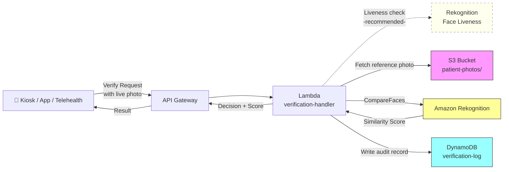

# Recipe 9.2 Architecture and Implementation: Patient Photo Verification

*Companion to [Recipe 9.2: Patient Photo Verification](chapter09.02-patient-photo-verification). This page covers the AWS architecture, services, prerequisites, and pseudocode. For the problem framing and the conceptual approach, start with the main recipe.*

---

## The AWS Implementation

### Why These Services

**Amazon Rekognition for face comparison.** Rekognition's `CompareFaces` API is purpose-built for 1:1 face verification. You give it two images (source and target), and it returns a similarity score with bounding box coordinates for each detected face. It handles the full pipeline: face detection, alignment, feature extraction, and comparison in a single API call. For healthcare, Rekognition is on the AWS HIPAA eligible services list, which means you can process PHI (patient photos) through it under a BAA. The alternative would be hosting your own face comparison model (something like ArcFace or FaceNet), which gives you more control over bias testing but requires significant ML infrastructure.

**Amazon S3 for image storage.** Reference photos need encrypted, durable storage. S3 with SSE-KMS encryption handles this. You could also store only embeddings (not images) if your privacy requirements are strict, but Rekognition's CompareFaces API works with images directly, so you'd need the source image available for comparison.

**Amazon DynamoDB for verification records.** Each verification attempt produces an audit record: who was being verified, when, what the confidence score was, what decision was made. DynamoDB's write-once, fast-lookup pattern fits perfectly. The audit trail is essential for both compliance and dispute resolution.

**AWS Lambda for orchestration.** The verification workflow is a short-lived, stateless sequence: receive a verification request, fetch the reference image from S3, call Rekognition's CompareFaces, evaluate the score against thresholds, write the audit record, return the result. Classic Lambda workload. If the DynamoDB audit write fails, the Lambda should still return the verification result to the caller (never block patient access to care) and publish the failed audit record to an SQS dead letter queue for retry. In production, separate enrollment and verification into distinct Lambda functions with independent IAM roles (principle of least privilege).

**Amazon API Gateway for the endpoint.** Point-of-care systems (kiosks, mobile apps, telehealth platforms) need a synchronous REST endpoint to call for real-time verification.

### Architecture Diagram



### Prerequisites

| Requirement | Details |
|-------------|---------|
| **AWS Services** | Amazon Rekognition, Amazon S3, AWS Lambda, Amazon DynamoDB, Amazon API Gateway |
| **IAM Permissions** | `rekognition:CompareFaces`, `s3:GetObject`, `s3:PutObject`, `dynamodb:PutItem`, `dynamodb:GetItem` (scope all permissions to specific resource ARNs; separate enrollment write permissions from verification read permissions into distinct Lambda execution roles) |
| **BAA** | AWS BAA signed (required: patient photos are PHI) |
| **Encryption** | S3: SSE-KMS; DynamoDB: encryption at rest enabled; Lambda CloudWatch log groups: KMS encryption (logs may contain patient identifiers); all API calls over TLS |
| **DynamoDB PITR** | Enable Point-in-Time Recovery for the verification log table |
| **VPC** | Production: Lambda in VPC with VPC endpoints for S3, Rekognition, DynamoDB, and CloudWatch Logs |
| **CloudTrail** | Enabled: log all Rekognition and S3 API calls for HIPAA audit trail |
| **Consent** | Patient consent for biometric data collection must be obtained and recorded before enrollment. Check state-specific biometric privacy laws (BIPA, CCPA, etc.) |
| **Data Retention** | Configure S3 lifecycle rules aligned with your biometric data retention policy (BIPA requires destruction within 3 years of last interaction). Include a mechanism to delete photos and DynamoDB records on consent withdrawal. |
| **Sample Data** | Synthetic face images only. Never use real patient photos in dev/test. Consider using datasets like LFW (Labeled Faces in the Wild) for threshold tuning. |
| **Cost Estimate** | Rekognition CompareFaces: $0.001 per comparison. At typical clinic volume (200 verifications/day), that's $0.20/day. Lambda and DynamoDB costs negligible. |

### Ingredients

| AWS Service | Role |
|------------|------|
| **Amazon Rekognition** | Compares live photo against stored reference photo; returns similarity score |
| **Amazon S3** | Stores encrypted reference photos; provides source image to Rekognition |
| **AWS Lambda** | Orchestrates verification flow: fetch, compare, decide, log |
| **Amazon DynamoDB** | Stores verification audit records with timestamps and decisions |
| **Amazon API Gateway** | Exposes synchronous REST endpoint for point-of-care systems |
| **AWS KMS** | Manages encryption keys for S3, DynamoDB, and CloudWatch Logs |
| **Amazon CloudWatch** | Metrics and alarms: match rates, latency, failure rates by demographic group |

### Code

#### Walkthrough

**Step 1: Receive and validate the verification request.** A point-of-care system (kiosk, mobile app, telehealth platform) sends a verification request containing two things: the patient's claimed identity (usually their MRN or patient ID) and a live photo captured at the moment of check-in. Before calling any downstream service, validate that the request is well-formed: the patient ID exists in your system, the image is a supported format (JPEG or PNG), and the image is under the 5MB size limit for Rekognition. Reject malformed requests early to avoid unnecessary API calls and to produce clear error messages for the calling system.

```pseudocode
FUNCTION handle_verification_request(request):
    // Extract the two critical pieces: who they claim to be, and what they look like right now.
    patient_id = request.patient_id
    live_photo_bytes = request.photo  // base64-decoded image bytes from the requesting system

    // Basic validation: does this patient exist? Is the photo a real image?
    IF patient_id is not found in patient index:
        RETURN error: "Unknown patient ID"

    IF live_photo_bytes is empty OR size > 5MB:
        RETURN error: "Invalid photo: must be JPEG/PNG under 5MB"

    // Retrieve the path to the stored reference photo for this patient.
    reference_photo_key = lookup reference photo S3 key for patient_id

    IF reference_photo_key is null:
        // Patient exists but has no photo on file. Can't verify.
        // This is not an error; it's a "not enrolled" state. Fall back to manual ID check.
        RETURN { status: "NOT_ENROLLED", message: "No reference photo on file" }

    // Inputs validated. Proceed to comparison.
    RETURN compare_faces(reference_photo_key, live_photo_bytes, patient_id)
```

**Step 2: Call face comparison.** This is the core of the pipeline. Pass the stored reference image and the live photo to the face comparison service. The service detects faces in both images, extracts feature embeddings, and computes a similarity score. The key parameter here is the similarity threshold: you're asking the service to only return matches above a certain confidence level. Set this intentionally low (e.g., 0%) in the API call and apply your own business-logic thresholds afterward. This gives you the raw score to work with rather than a binary yes/no from the service.

```pseudocode
FUNCTION compare_faces(reference_key, live_photo_bytes, patient_id):
    // Call Rekognition's CompareFaces API.
    // Source = the stored reference photo (from S3).
    // Target = the live photo (from the request, passed as raw bytes).
    // SimilarityThreshold = 0: return the score no matter how low,
    //   so our business logic can make the decision, not Rekognition's default cutoff.
    response = call Rekognition.CompareFaces with:
        source_image = S3 object at bucket="patient-photos", key=reference_key
        target_image = raw bytes of live_photo_bytes
        similarity_threshold = 0  // get the raw score; we'll apply our own thresholds

    // Check if any face was detected in the live photo.
    IF response.FaceMatches is empty AND response.UnmatchedFaces is empty:
        // No face detected at all. Image might be blank, blurry, or not a face.
        RETURN { status: "NO_FACE_DETECTED", similarity: 0 }

    // If Rekognition found a match, extract the similarity score.
    IF response.FaceMatches is not empty:
        similarity = response.FaceMatches[0].Similarity  // 0.0 to 100.0
    ELSE:
        // Face was detected but didn't match. Similarity will be very low.
        similarity = 0.0

    // Pass the raw score to the decision engine.
    decision = apply_decision_logic(similarity)

    // Log the verification attempt for audit and analytics.
    log_verification(patient_id, similarity, decision)

    RETURN { status: decision, similarity: similarity }
```

**Step 3: Apply decision logic.** This is where healthcare-specific judgment lives. A single threshold isn't sufficient. Healthcare identity verification needs a tiered approach because the cost of a false rejection (denying someone access to care) is very different from the cost of a false acceptance (billing or safety risk). Three tiers keep the system practical: high-confidence matches proceed without friction, medium-confidence matches trigger lightweight additional verification, and low-confidence matches route to staff. Never deny care. Always provide a fallback path.

```pseudocode
// Three confidence tiers. Tune these based on your population and risk tolerance.
HIGH_CONFIDENCE_THRESHOLD = 95.0   // auto-approve: very strong match
MEDIUM_CONFIDENCE_THRESHOLD = 80.0  // step-up: ask for DOB or last 4 SSN
// Below 80.0: route to staff for manual ID verification

FUNCTION apply_decision_logic(similarity_score):
    IF similarity_score >= HIGH_CONFIDENCE_THRESHOLD:
        // Strong match. Proceed with check-in automatically.
        RETURN "VERIFIED"

    ELSE IF similarity_score >= MEDIUM_CONFIDENCE_THRESHOLD:
        // Moderate match. Could be lighting, aging, glasses.
        // Don't reject. Ask for one additional identity factor.
        RETURN "STEP_UP_REQUIRED"

    ELSE:
        // Weak or no match. Could be wrong person, could be a bad photo.
        // Route to front desk staff for manual verification.
        // Critical: do NOT deny care. Manual verification is always available.
        RETURN "MANUAL_REVIEW"
```

**Step 4: Log the verification attempt.** Every verification produces an audit record, regardless of outcome. This serves three purposes: compliance (HIPAA requires access logs for PHI), dispute resolution (if a patient challenges a rejection, you have the data), and bias monitoring (you can analyze match rates across demographic groups to detect performance disparities). Include enough detail to reconstruct what happened, but don't store the live photo in the log (that's additional PHI you'd need to manage). Store the decision, the score, and a reference back to the request.

```pseudocode
FUNCTION log_verification(patient_id, similarity, decision):
    write record to database table "verification-log":
        verification_id   = generate UUID          // unique ID for this attempt
        patient_id        = patient_id             // who was being verified
        timestamp         = current UTC time (ISO 8601)
        similarity_score  = similarity             // raw score from comparison service
        decision          = decision               // VERIFIED, STEP_UP_REQUIRED, or MANUAL_REVIEW
        source            = "check-in-kiosk"       // which system initiated the request
        // Do NOT store the live photo here. It's PHI. The reference photo in S3 is sufficient.
        // If you need the live photo for dispute resolution, store it separately with auto-expiry.
```

**Step 5: Handle enrollment (new patient or re-enrollment).** Before you can verify anyone, you need a reference photo on file. Enrollment happens at registration or when a patient's existing photo is too old. Capture a clear, frontal photo in good lighting. Store it encrypted in S3. Update the patient index with the photo's storage location. Consider a maximum photo age policy (re-enroll every 2-3 years) to account for natural appearance changes.

```pseudocode
FUNCTION enroll_patient_photo(patient_id, photo_bytes):
    // Validate: is there actually a detectable face in this photo?
    // Reject photos with no face, multiple faces, or poor quality.
    detection = call Rekognition.DetectFaces with:
        image = raw bytes of photo_bytes
        attributes = ["DEFAULT"]

    IF detection.FaceDetails is empty:
        RETURN error: "No face detected in enrollment photo"

    IF length of detection.FaceDetails > 1:
        RETURN error: "Multiple faces detected. Please capture one face only."

    // Check basic quality metrics.
    face = detection.FaceDetails[0]
    IF face.Quality.Brightness < 40 OR face.Quality.Sharpness < 40:
        RETURN error: "Photo quality too low. Please retake in better lighting."

    // Store the enrollment photo, encrypted at rest.
    s3_key = "patient-photos/{patient_id}/reference.jpg"
    upload photo_bytes to S3 bucket "patient-photos" at key s3_key
        with server-side encryption (KMS)

    // Update the patient index to point to this photo.
    update patient record: reference_photo_key = s3_key, enrolled_date = now

    RETURN { status: "ENROLLED", photo_key: s3_key }
```

> **Curious how this looks in Python?** The pseudocode above covers the concepts. If you'd like to see sample Python code that demonstrates these patterns using boto3, check out the [Python Example](chapter09.02-python-example). It walks through each step with inline comments and notes on what you'd need to change for a real deployment.

### Expected Results

**Sample output for a successful verification:**

```json
{
  "verification_id": "a7f3b2c1-4e89-4d5a-b6c8-92f1d3e0a7b5",
  "patient_id": "MRN-00482916",
  "status": "VERIFIED",
  "similarity_score": 97.8,
  "timestamp": "2026-03-15T08:42:11Z",
  "source": "check-in-kiosk"
}
```

**Sample output for a step-up case (patient wearing new glasses):**

```json
{
  "verification_id": "c4d9e8f2-1a3b-4c5d-8e7f-6a0b2c3d4e5f",
  "patient_id": "MRN-00391074",
  "status": "STEP_UP_REQUIRED",
  "similarity_score": 86.3,
  "timestamp": "2026-03-15T09:15:44Z",
  "source": "telehealth-session"
}
```

**Performance benchmarks:**

| Metric | Typical Value |
|--------|---------------|
| End-to-end latency | 0.8-2 seconds (warm Lambda; first invocation after idle adds 1-3 seconds; use provisioned concurrency for patient-facing workflows) |
| True match rate (same person, good conditions) | 97-99% |
| False match rate (different person accepted) | 0.1-1% (threshold-dependent) |
| Cost per verification | ~$0.001 (Rekognition) + negligible Lambda/DynamoDB |
| Throughput | ~100 verifications/second (Lambda concurrency) |

**Where it struggles:**

- Photos more than 3 years old (aging, weight changes)
- Significant appearance changes since enrollment (facial hair, surgery, major weight loss)
- Patients wearing masks or heavy face coverings (periocular matching helps but accuracy drops 10-15%)
- Poor lighting in the verification environment (backlit telehealth calls are common)
- Very young patients whose facial features are still developing rapidly
- Documented accuracy disparities across skin tones and demographic groups (monitor and test)

---

## Why This Isn't Production-Ready

**Bias evaluation.** Before deploying any face comparison system in healthcare, you must evaluate its performance across the demographic groups in your patient population. NIST FRVT data provides a starting point, but your specific population mix, camera hardware, and lighting conditions will produce different results. Run a controlled pilot with known face pairs across demographic segments. If you find meaningful accuracy disparities, you have a choice: adjust thresholds per group (ethically complex), improve your capture environment (lighting, camera quality), or limit the system's role to advisory only until performance is equitable.

**Consent management.** You need infrastructure to capture, store, and honor biometric consent preferences. Patients must be able to opt out at any time, and opting out must trigger immediate deletion of their stored photos and embeddings. This is a legal requirement in many states, not a nice-to-have.

**Liveness detection.** This is the single most important security upgrade for production. The simple CompareFaces API doesn't verify that the live photo is actually live. Someone could hold up a printed photo or display a photo on their phone screen. Production systems need liveness detection (blink check, head turn, depth analysis) to prevent presentation attacks. Rekognition offers a separate Face Liveness API for this. Without liveness, the system provides no meaningful defense against even trivial spoofing.

**Rate limiting and abuse prevention.** Without rate limits, someone could attempt repeated verifications against random patient IDs to find exploitable matches. Implement per-source, per-patient rate limits and alert on anomalous verification patterns. API Gateway supports per-client throttling, and you can implement per-patient rate limits using DynamoDB atomic counters.

---

## Variations and Extensions

**Telehealth session verification.** Instead of a single photo comparison, use the video stream from the telehealth platform to capture multiple frames and select the highest-quality one for comparison. This compensates for variable webcam quality and lets you add continuous identity assurance (periodic re-checks during the session for sensitive consultations like controlled substance prescriptions).

**Multi-factor identity scoring.** Combine the face similarity score with other identity signals: device fingerprint (is this the patient's usual device?), geolocation (are they near their home address?), behavioral biometrics (typing patterns on intake forms). Weight each signal and produce a composite identity confidence score. This reduces reliance on any single biometric and improves resilience against spoofing.

**Photo aging and re-enrollment automation.** Track the age of each patient's reference photo. When it exceeds a threshold (e.g., 24 months), automatically trigger re-enrollment at the next in-person visit. Alternatively, use each successful high-confidence verification photo to update the reference, creating a rolling enrollment that adapts to gradual appearance changes. (Careful: this can also drift away from the original identity if an impostor achieves one high-confidence match.)

---

## Additional Resources

**AWS Documentation:**
- [Amazon Rekognition CompareFaces API Reference](https://docs.aws.amazon.com/rekognition/latest/dg/API_CompareFaces.html)
- [Amazon Rekognition Face Liveness](https://docs.aws.amazon.com/rekognition/latest/dg/face-liveness.html)
- [Amazon Rekognition DetectFaces API Reference](https://docs.aws.amazon.com/rekognition/latest/dg/API_DetectFaces.html)
- [Amazon Rekognition Pricing](https://aws.amazon.com/rekognition/pricing/)
- [AWS HIPAA Eligible Services](https://aws.amazon.com/compliance/hipaa-eligible-services-reference/)
- [Architecting for HIPAA on AWS (Whitepaper)](https://docs.aws.amazon.com/whitepapers/latest/architecting-hipaa-security-and-compliance-on-aws/welcome.html)

**AWS Sample Repos:**
- [`amazon-rekognition-code-samples`](https://github.com/aws-samples/amazon-rekognition-code-samples): General Rekognition examples including face comparison and detection
- [`amazon-rekognition-identity-verification`](https://github.com/aws-samples/amazon-rekognition-identity-verification): Reference architecture for identity verification workflows using Rekognition

**External References:**
- [NIST Face Recognition Vendor Test (FRVT)](https://www.nist.gov/programs-projects/face-recognition-vendor-test-frvt): Independent evaluation of face recognition algorithm accuracy, including demographic analysis
- [NIST FRVT Demographic Effects Report](https://nvlpubs.nist.gov/nistpubs/ir/2019/NIST.IR.8280.pdf): Detailed analysis of performance differences across demographic groups

---

## Estimated Implementation Time

| Tier | Timeframe | What You Get |
|------|-----------|--------------|
| **Basic** | 1-2 weeks | CompareFaces integration, single-threshold decision, basic audit logging |
| **Production-ready** | 6-8 weeks | Tiered decision logic, liveness detection, consent management, bias evaluation, monitoring dashboards |
| **With variations** | 10-14 weeks | Telehealth continuous verification, multi-factor scoring, automated re-enrollment |

---


---

*← [Main Recipe 9.2](chapter09.02-patient-photo-verification) · [Python Example](chapter09.02-python-example) · [Chapter Preface](chapter09-preface)*
