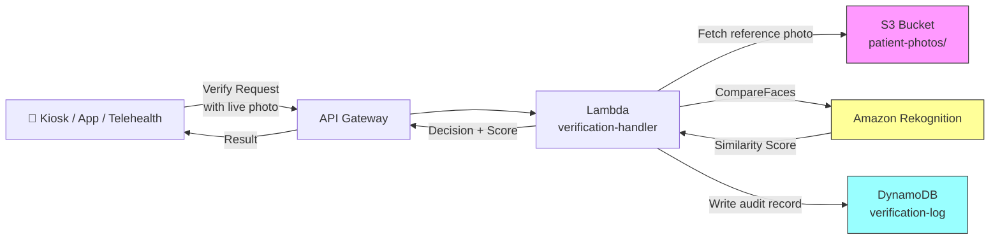

# Recipe 9.2: Patient Photo Verification

**Complexity:** Simple · **Phase:** MVP · **Estimated Cost:** ~$0.001 per verification

---

## The Problem

A patient walks into an urgent care clinic. They hand over an insurance card. The front desk confirms the name. They get routed to a room, seen by a provider, billed under that member ID. Except it's not their card. It belongs to a family member, a friend, someone they bought it from. The visit is documented under the wrong patient. The claim goes out with the wrong demographics. Medical history accumulates on the wrong person's chart.

Medical identity fraud costs the U.S. healthcare system an estimated $80 billion annually. But the numbers don't capture the real risk: a patient gets treated based on someone else's allergy list. A blood type mismatch goes unnoticed. A medication interaction isn't flagged because the EHR shows someone else's active prescriptions. Identity errors in healthcare aren't just billing problems. They're patient safety problems.

The traditional solution is manual verification: front desk staff glances at the person, glances at the name on the screen, maybe asks for a photo ID. This works when things are calm. It falls apart at 8:00 AM on a Monday when six people are waiting and the phone is ringing. It doesn't scale to telehealth, where the person on the video call could be anyone. It doesn't scale to kiosks, where there's no staff to look at anyone.

What if you could match a person's face to a photo already on file? Not as the only verification (that would be reckless), but as one signal in a broader identity confidence score. The technology exists and it's mature. The tricky part is deploying it in healthcare with all the ethical, regulatory, and bias considerations that entails.

---

## The Technology: How Face Comparison Works

### Face Detection vs. Face Comparison

Let's get the terminology straight, because this is where people get confused.

**Face detection** answers the question: "Is there a face in this image, and where is it?" The output is a bounding box. Detected face at coordinates (120, 85) to (340, 380). This is relatively straightforward. Modern face detection models use convolutional neural networks and are extremely reliable on frontal or near-frontal faces in decent lighting. They struggle with extreme angles, heavy occlusion (masks, for example), and very low resolution.

**Face comparison** (sometimes called face verification or face matching) answers a different question: "Are these two faces the same person?" You give it two images. It tells you whether the faces in those images belong to the same individual, along with a confidence score. This is a 1:1 comparison. You're not searching a database of millions of faces for a match (that's face search, or 1:N identification). You're comparing exactly two faces.

The distinction matters for healthcare identity verification. We're doing 1:1 comparison: does the person at check-in match the photo stored in their patient record? We're not building a surveillance system that identifies people in a crowd.

### How the Comparison Actually Works (Under the Hood)

Modern face comparison systems work in three stages:

**Stage 1: Face detection and alignment.** Find the face in each image. Normalize it: rotate to frontal pose, crop to face bounds, resize to a standard resolution. This alignment step is critical because it removes variation that has nothing to do with identity (head tilt, distance from camera, image dimensions).

**Stage 2: Feature extraction.** Pass the aligned face through a deep neural network (typically a variant of ResNet or a similar architecture trained specifically on facial recognition tasks). The network outputs a high-dimensional vector, usually 128 or 512 floating-point numbers. This vector is called a face embedding. It's a mathematical representation of the face's unique geometry: distance between eyes, nose bridge width, jawline shape, forehead proportions. The network has learned, through training on millions of face pairs, which geometric features are stable across lighting conditions, expressions, and minor aging, and which features are just noise.

**Stage 3: Similarity scoring.** Compare the two embedding vectors. The most common approach is cosine similarity: how much do these two vectors point in the same direction in high-dimensional space? If the cosine similarity is high (close to 1.0), the faces likely belong to the same person. If it's low (close to 0.0 or negative), they likely don't. The system returns this as a confidence percentage or similarity score.

The beauty of this approach is that the heavy computation happens once per image (stages 1 and 2). The actual comparison (stage 3) is just a dot product, which is nearly instant. Store the embedding from the enrollment photo, and subsequent verifications only need to compute the embedding of the new photo and compare.

### What Makes This Hard

Face comparison in a lab, with controlled lighting and cooperative subjects, achieves accuracy rates above 99.5%. Face comparison in a real healthcare setting introduces several complications:

**Aging.** A patient's photo on file might be 3 years old. Faces change. Weight gain or loss, aging, facial hair changes, new glasses. Most systems handle 2-3 years of aging reasonably well. Beyond that, accuracy degrades and re-enrollment becomes necessary.

**Lighting and camera quality.** The enrollment photo was taken with a decent camera in a well-lit registration area. The verification photo comes from a tablet's front-facing camera in a dimly lit waiting room. Or from a telehealth session where the patient is backlit by a window. These asymmetric conditions reduce matching accuracy.

**Accessories and occlusion.** Glasses (especially new ones since enrollment), hats, surgical masks, heavy makeup. Masks in particular became a real problem during and after 2020. Some systems can match on the upper face only (periocular matching), but accuracy drops meaningfully.

**Demographic bias.** This is the big one, and it deserves its own paragraph. Face comparison systems have documented performance disparities across demographic groups, particularly by race, gender, and age. The NIST Face Recognition Vendor Test (FRVT) has consistently shown that many commercial systems have higher false match rates and higher false non-match rates for certain demographic groups. In healthcare, where the population you serve is diverse and where a false rejection means someone can't access care, this isn't an academic concern. It's a deployment blocker if not addressed. You need to evaluate your specific system on a demographic distribution that matches your patient population, and you need to monitor performance across groups after deployment.

**Consent and ethics.** Collecting and storing biometric data (face embeddings are biometric data) triggers specific legal requirements in many jurisdictions. BIPA in Illinois, CCPA in California, various state biometric privacy laws. Patients must consent to having their facial data stored and used for verification. The consent must be informed, specific, and revocable.

### The General Architecture Pattern

The pipeline is simpler than you might expect:

```text
[Enrollment] → [Store Reference Image/Embedding] → [Verification Request] → [Compare] → [Confidence Score] → [Decision Logic]
```

**Enrollment.** At registration or first visit, capture a reference photo. This could be from a photo taken at the front desk, extracted from a driver's license scan, or captured during a video visit. Store the image (encrypted) or, better, store only the face embedding. Embeddings are not reversible to a recognizable image, which reduces your PHI exposure.

**Verification.** At subsequent check-ins (in-person kiosk, telehealth start, mobile app login), capture a new photo. Extract the face, compute the embedding, compare against the stored reference embedding for the claimed identity.

**Decision logic.** This is where healthcare nuance matters. You don't reject a patient based solely on a face mismatch. You use the score as one input into a multi-factor identity confidence system. High match (>95%): proceed automatically. Medium match (80-95%): additional verification (ask for date of birth, last four of SSN). Low match (<80%): route to staff for manual verification. No match or no face detected: fall back to traditional identification.

The key design principle: face comparison is an identity signal, not a gate. Never deny care based on a failed face match.

---

## The AWS Implementation

### Why These Services

**Amazon Rekognition for face comparison.** Rekognition's `CompareFaces` API is purpose-built for 1:1 face verification. You give it two images (source and target), and it returns a similarity score with bounding box coordinates for each detected face. It handles the full pipeline: face detection, alignment, feature extraction, and comparison in a single API call. For healthcare, Rekognition is on the AWS HIPAA eligible services list, which means you can process PHI (patient photos) through it under a BAA. The alternative would be hosting your own face comparison model (something like ArcFace or FaceNet), which gives you more control over bias testing but requires significant ML infrastructure.

**Amazon S3 for image storage.** Reference photos need encrypted, durable storage. S3 with SSE-KMS encryption handles this. You could also store only embeddings (not images) if your privacy requirements are strict, but Rekognition's CompareFaces API works with images directly, so you'd need the source image available for comparison.

**Amazon DynamoDB for verification records.** Each verification attempt produces an audit record: who was being verified, when, what the confidence score was, what decision was made. DynamoDB's write-once, fast-lookup pattern fits perfectly. The audit trail is essential for both compliance and dispute resolution.

**AWS Lambda for orchestration.** The verification workflow is a short-lived, stateless sequence: receive a verification request, fetch the reference image from S3, call Rekognition's CompareFaces, evaluate the score against thresholds, write the audit record, return the result. Classic Lambda workload.

**Amazon API Gateway for the endpoint.** Point-of-care systems (kiosks, mobile apps, telehealth platforms) need a synchronous REST endpoint to call for real-time verification.

### Architecture Diagram



### Prerequisites

| Requirement | Details |
|-------------|---------|
| **AWS Services** | Amazon Rekognition, Amazon S3, AWS Lambda, Amazon DynamoDB, Amazon API Gateway |
| **IAM Permissions** | `rekognition:CompareFaces`, `s3:GetObject`, `s3:PutObject`, `dynamodb:PutItem`, `dynamodb:GetItem` |
| **BAA** | AWS BAA signed (required: patient photos are PHI) |
| **Encryption** | S3: SSE-KMS; DynamoDB: encryption at rest enabled; Lambda CloudWatch log groups: KMS encryption (logs may contain patient identifiers); all API calls over TLS |
| **DynamoDB PITR** | Enable Point-in-Time Recovery for the verification log table |
| **VPC** | Production: Lambda in VPC with VPC endpoints for S3, Rekognition, DynamoDB, and CloudWatch Logs |
| **CloudTrail** | Enabled: log all Rekognition and S3 API calls for HIPAA audit trail |
| **Consent** | Patient consent for biometric data collection must be obtained and recorded before enrollment. Check state-specific biometric privacy laws (BIPA, CCPA, etc.) |
| **Sample Data** | Synthetic face images only. Never use real patient photos in dev/test. Consider using datasets like LFW (Labeled Faces in the Wild) for threshold tuning. |
| **Cost Estimate** | Rekognition CompareFaces: $0.001 per comparison. At typical clinic volume (200 verifications/day), that's $0.20/day. Lambda and DynamoDB costs negligible. |

### Ingredients

| AWS Service | Role |
|------------|------|
| **Amazon Rekognition** | Compares live photo against stored reference photo; returns similarity score |
| **Amazon S3** | Stores encrypted reference photos; provides source image to Rekognition |
| **AWS Lambda** | Orchestrates verification flow: fetch, compare, decide, log |
| **Amazon DynamoDB** | Stores verification audit records with timestamps and decisions |
| **Amazon API Gateway** | Exposes synchronous REST endpoint for point-of-care systems |
| **AWS KMS** | Manages encryption keys for S3, DynamoDB, and CloudWatch Logs |
| **Amazon CloudWatch** | Metrics and alarms: match rates, latency, failure rates by demographic group |

### Code

#### Walkthrough

**Step 1: Receive and validate the verification request.** A point-of-care system (kiosk, mobile app, telehealth platform) sends a verification request containing two things: the patient's claimed identity (usually their MRN or patient ID) and a live photo captured at the moment of check-in. Before calling any downstream service, validate that the request is well-formed: the patient ID exists in your system, the image is a supported format (JPEG or PNG), and the image is under the 5MB size limit for Rekognition. Reject malformed requests early to avoid unnecessary API calls and to produce clear error messages for the calling system.

```pseudocode
FUNCTION handle_verification_request(request):
    // Extract the two critical pieces: who they claim to be, and what they look like right now.
    patient_id = request.patient_id
    live_photo_bytes = request.photo  // base64-decoded image bytes from the requesting system

    // Basic validation: does this patient exist? Is the photo a real image?
    IF patient_id is not found in patient index:
        RETURN error: "Unknown patient ID"

    IF live_photo_bytes is empty OR size > 5MB:
        RETURN error: "Invalid photo: must be JPEG/PNG under 5MB"

    // Retrieve the path to the stored reference photo for this patient.
    reference_photo_key = lookup reference photo S3 key for patient_id

    IF reference_photo_key is null:
        // Patient exists but has no photo on file. Can't verify.
        // This is not an error; it's a "not enrolled" state. Fall back to manual ID check.
        RETURN { status: "NOT_ENROLLED", message: "No reference photo on file" }

    // Inputs validated. Proceed to comparison.
    RETURN compare_faces(reference_photo_key, live_photo_bytes, patient_id)
```

**Step 2: Call face comparison.** This is the core of the pipeline. Pass the stored reference image and the live photo to the face comparison service. The service detects faces in both images, extracts feature embeddings, and computes a similarity score. The key parameter here is the similarity threshold: you're asking the service to only return matches above a certain confidence level. Set this intentionally low (e.g., 0%) in the API call and apply your own business-logic thresholds afterward. This gives you the raw score to work with rather than a binary yes/no from the service.

```pseudocode
FUNCTION compare_faces(reference_key, live_photo_bytes, patient_id):
    // Call Rekognition's CompareFaces API.
    // Source = the stored reference photo (from S3).
    // Target = the live photo (from the request, passed as raw bytes).
    // SimilarityThreshold = 0: return the score no matter how low,
    //   so our business logic can make the decision, not Rekognition's default cutoff.
    response = call Rekognition.CompareFaces with:
        source_image = S3 object at bucket="patient-photos", key=reference_key
        target_image = raw bytes of live_photo_bytes
        similarity_threshold = 0  // get the raw score; we'll apply our own thresholds

    // Check if any face was detected in the live photo.
    IF response.FaceMatches is empty AND response.UnmatchedFaces is empty:
        // No face detected at all. Image might be blank, blurry, or not a face.
        RETURN { status: "NO_FACE_DETECTED", similarity: 0 }

    // If Rekognition found a match, extract the similarity score.
    IF response.FaceMatches is not empty:
        similarity = response.FaceMatches[0].Similarity  // 0.0 to 100.0
    ELSE:
        // Face was detected but didn't match. Similarity will be very low.
        similarity = 0.0

    // Pass the raw score to the decision engine.
    decision = apply_decision_logic(similarity)

    // Log the verification attempt for audit and analytics.
    log_verification(patient_id, similarity, decision)

    RETURN { status: decision, similarity: similarity }
```

**Step 3: Apply decision logic.** This is where healthcare-specific judgment lives. A single threshold isn't sufficient. Healthcare identity verification needs a tiered approach because the cost of a false rejection (denying someone access to care) is very different from the cost of a false acceptance (billing or safety risk). Three tiers keep the system practical: high-confidence matches proceed without friction, medium-confidence matches trigger lightweight additional verification, and low-confidence matches route to staff. Never deny care. Always provide a fallback path.

```pseudocode
// Three confidence tiers. Tune these based on your population and risk tolerance.
HIGH_CONFIDENCE_THRESHOLD = 95.0   // auto-approve: very strong match
MEDIUM_CONFIDENCE_THRESHOLD = 80.0  // step-up: ask for DOB or last 4 SSN
// Below 80.0: route to staff for manual ID verification

FUNCTION apply_decision_logic(similarity_score):
    IF similarity_score >= HIGH_CONFIDENCE_THRESHOLD:
        // Strong match. Proceed with check-in automatically.
        RETURN "VERIFIED"

    ELSE IF similarity_score >= MEDIUM_CONFIDENCE_THRESHOLD:
        // Moderate match. Could be lighting, aging, glasses.
        // Don't reject. Ask for one additional identity factor.
        RETURN "STEP_UP_REQUIRED"

    ELSE:
        // Weak or no match. Could be wrong person, could be a bad photo.
        // Route to front desk staff for manual verification.
        // Critical: do NOT deny care. Manual verification is always available.
        RETURN "MANUAL_REVIEW"
```

**Step 4: Log the verification attempt.** Every verification produces an audit record, regardless of outcome. This serves three purposes: compliance (HIPAA requires access logs for PHI), dispute resolution (if a patient challenges a rejection, you have the data), and bias monitoring (you can analyze match rates across demographic groups to detect performance disparities). Include enough detail to reconstruct what happened, but don't store the live photo in the log (that's additional PHI you'd need to manage). Store the decision, the score, and a reference back to the request.

```pseudocode
FUNCTION log_verification(patient_id, similarity, decision):
    write record to database table "verification-log":
        verification_id   = generate UUID          // unique ID for this attempt
        patient_id        = patient_id             // who was being verified
        timestamp         = current UTC time (ISO 8601)
        similarity_score  = similarity             // raw score from comparison service
        decision          = decision               // VERIFIED, STEP_UP_REQUIRED, or MANUAL_REVIEW
        source            = "check-in-kiosk"       // which system initiated the request
        // Do NOT store the live photo here. It's PHI. The reference photo in S3 is sufficient.
        // If you need the live photo for dispute resolution, store it separately with auto-expiry.
```

**Step 5: Handle enrollment (new patient or re-enrollment).** Before you can verify anyone, you need a reference photo on file. Enrollment happens at registration or when a patient's existing photo is too old. Capture a clear, frontal photo in good lighting. Store it encrypted in S3. Update the patient index with the photo's storage location. Consider a maximum photo age policy (re-enroll every 2-3 years) to account for natural appearance changes.

```pseudocode
FUNCTION enroll_patient_photo(patient_id, photo_bytes):
    // Validate: is there actually a detectable face in this photo?
    // Reject photos with no face, multiple faces, or poor quality.
    detection = call Rekognition.DetectFaces with:
        image = raw bytes of photo_bytes
        attributes = ["DEFAULT"]

    IF detection.FaceDetails is empty:
        RETURN error: "No face detected in enrollment photo"

    IF length of detection.FaceDetails > 1:
        RETURN error: "Multiple faces detected. Please capture one face only."

    // Check basic quality metrics.
    face = detection.FaceDetails[0]
    IF face.Quality.Brightness < 40 OR face.Quality.Sharpness < 40:
        RETURN error: "Photo quality too low. Please retake in better lighting."

    // Store the enrollment photo, encrypted at rest.
    s3_key = "patient-photos/{patient_id}/reference.jpg"
    upload photo_bytes to S3 bucket "patient-photos" at key s3_key
        with server-side encryption (KMS)

    // Update the patient index to point to this photo.
    update patient record: reference_photo_key = s3_key, enrolled_date = now

    RETURN { status: "ENROLLED", photo_key: s3_key }
```

> **Curious how this looks in Python?** The pseudocode above covers the concepts. If you'd like to see sample Python code that demonstrates these patterns using boto3, check out the [Python Example](chapter09.02-python-example). It walks through each step with inline comments and notes on what you'd need to change for a real deployment.

### Expected Results

**Sample output for a successful verification:**

```json
{
  "verification_id": "a7f3b2c1-4e89-4d5a-b6c8-92f1d3e0a7b5",
  "patient_id": "MRN-00482916",
  "status": "VERIFIED",
  "similarity_score": 97.8,
  "timestamp": "2026-03-15T08:42:11Z",
  "source": "check-in-kiosk"
}
```

**Sample output for a step-up case (patient wearing new glasses):**

```json
{
  "verification_id": "c4d9e8f2-1a3b-4c5d-8e7f-6a0b2c3d4e5f",
  "patient_id": "MRN-00391074",
  "status": "STEP_UP_REQUIRED",
  "similarity_score": 86.3,
  "timestamp": "2026-03-15T09:15:44Z",
  "source": "telehealth-session"
}
```

**Performance benchmarks:**

| Metric | Typical Value |
|--------|---------------|
| End-to-end latency | 0.8-2 seconds |
| True match rate (same person, good conditions) | 97-99% |
| False match rate (different person accepted) | 0.1-1% (threshold-dependent) |
| Cost per verification | ~$0.001 (Rekognition) + negligible Lambda/DynamoDB |
| Throughput | ~100 verifications/second (Lambda concurrency) |

**Where it struggles:**

- Photos more than 3 years old (aging, weight changes)
- Significant appearance changes since enrollment (facial hair, surgery, major weight loss)
- Patients wearing masks or heavy face coverings (periocular matching helps but accuracy drops 10-15%)
- Poor lighting in the verification environment (backlit telehealth calls are common)
- Very young patients whose facial features are still developing rapidly
- Documented accuracy disparities across skin tones and demographic groups (monitor and test)

---

## Why This Isn't Production-Ready

**Bias evaluation.** Before deploying any face comparison system in healthcare, you must evaluate its performance across the demographic groups in your patient population. NIST FRVT data provides a starting point, but your specific population mix, camera hardware, and lighting conditions will produce different results. Run a controlled pilot with known face pairs across demographic segments. If you find meaningful accuracy disparities, you have a choice: adjust thresholds per group (ethically complex), improve your capture environment (lighting, camera quality), or limit the system's role to advisory only until performance is equitable.

**Consent management.** You need infrastructure to capture, store, and honor biometric consent preferences. Patients must be able to opt out at any time, and opting out must trigger immediate deletion of their stored photos and embeddings. This is a legal requirement in many states, not a nice-to-have.

**Liveness detection.** The simple CompareFaces API doesn't verify that the live photo is actually live. Someone could hold up a printed photo or display a photo on their phone screen. Production systems need liveness detection (blink check, head turn, depth analysis) to prevent presentation attacks. Rekognition offers a separate Face Liveness API for this.

**Rate limiting and abuse prevention.** Without rate limits, someone could attempt repeated verifications against random patient IDs to find exploitable matches. Implement per-source, per-patient rate limits and alert on anomalous verification patterns.

---

## The Honest Take

Face comparison is genuinely one of the easier computer vision problems to get working. The technology is mature, the APIs are straightforward, and accuracy under good conditions is excellent. If this were a consumer app, you'd ship it in a week.

Healthcare makes it harder, but not for the reasons you'd expect. The technical accuracy is fine. What slows you down is everything around the technology: consent workflows, bias evaluation, fallback paths, regulatory compliance across multiple state laws, and organizational politics around biometric data collection.

The thing that surprised me most: the enrollment photo quality matters more than the verification photo quality. If the reference photo was taken with a low-resolution camera in bad lighting three years ago, every subsequent verification will struggle. Invest in good enrollment hardware and process. A well-lit, high-res enrollment photo makes every future verification easier.

My other hard-won lesson: never make face comparison a gate. Make it a signal. The moment your system denies someone care because a face match failed, you've created a patient safety incident, a legal liability, and probably a PR disaster. The design must always degrade gracefully to human verification. The face match should make the process faster and more secure when it works, not create a new failure mode when it doesn't.

The bias question is real and you can't hand-wave it. Test your system. Publish your results internally. Set up monitoring dashboards that track match rates by available demographic data. If you see disparities, fix them before scaling. The healthcare industry has a long history of deploying technology that works differently for different populations. Don't add to that history.

---

## Variations and Extensions

**Telehealth session verification.** Instead of a single photo comparison, use the video stream from the telehealth platform to capture multiple frames and select the highest-quality one for comparison. This compensates for variable webcam quality and lets you add continuous identity assurance (periodic re-checks during the session for sensitive consultations like controlled substance prescriptions).

**Multi-factor identity scoring.** Combine the face similarity score with other identity signals: device fingerprint (is this the patient's usual device?), geolocation (are they near their home address?), behavioral biometrics (typing patterns on intake forms). Weight each signal and produce a composite identity confidence score. This reduces reliance on any single biometric and improves resilience against spoofing.

**Photo aging and re-enrollment automation.** Track the age of each patient's reference photo. When it exceeds a threshold (e.g., 24 months), automatically trigger re-enrollment at the next in-person visit. Alternatively, use each successful high-confidence verification photo to update the reference, creating a rolling enrollment that adapts to gradual appearance changes. (Careful: this can also drift away from the original identity if an impostor achieves one high-confidence match.)

---

## Related Recipes

- **Recipe 9.1 (Image Quality Assessment):** Apply image quality checks to enrollment and verification photos before passing them to comparison
- **Recipe 5.1 (Internal Duplicate Patient Detection):** Face comparison can supplement probabilistic record matching when merging duplicate patient records
- **Recipe 5.5 (Cross-Facility Patient Matching):** Face embeddings as an additional matching feature for Health Information Exchange identity resolution
- **Recipe 11.4 (Pre-Visit Intake Bot):** Trigger face verification as part of the virtual check-in workflow

---

## Additional Resources

**AWS Documentation:**
- [Amazon Rekognition CompareFaces API Reference](https://docs.aws.amazon.com/rekognition/latest/dg/API_CompareFaces.html)
- [Amazon Rekognition Face Liveness](https://docs.aws.amazon.com/rekognition/latest/dg/face-liveness.html)
- [Amazon Rekognition DetectFaces API Reference](https://docs.aws.amazon.com/rekognition/latest/dg/API_DetectFaces.html)
- [Amazon Rekognition Pricing](https://aws.amazon.com/rekognition/pricing/)
- [AWS HIPAA Eligible Services](https://aws.amazon.com/compliance/hipaa-eligible-services-reference/)
- [Architecting for HIPAA on AWS (Whitepaper)](https://docs.aws.amazon.com/whitepapers/latest/architecting-hipaa-security-and-compliance-on-aws/welcome.html)

**AWS Sample Repos:**
- [`amazon-rekognition-code-samples`](https://github.com/aws-samples/amazon-rekognition-code-samples): General Rekognition examples including face comparison and detection
- [`amazon-rekognition-identity-verification`](https://github.com/aws-samples/amazon-rekognition-identity-verification): Reference architecture for identity verification workflows using Rekognition

**External References:**
- [NIST Face Recognition Vendor Test (FRVT)](https://www.nist.gov/programs-projects/face-recognition-vendor-test-frvt): Independent evaluation of face recognition algorithm accuracy, including demographic analysis
- [NIST FRVT Demographic Effects Report](https://nvlpubs.nist.gov/nistpubs/ir/2019/NIST.IR.8280.pdf): Detailed analysis of performance differences across demographic groups

---

## Estimated Implementation Time

| Tier | Timeframe | What You Get |
|------|-----------|--------------|
| **Basic** | 1-2 weeks | CompareFaces integration, single-threshold decision, basic audit logging |
| **Production-ready** | 6-8 weeks | Tiered decision logic, liveness detection, consent management, bias evaluation, monitoring dashboards |
| **With variations** | 10-14 weeks | Telehealth continuous verification, multi-factor scoring, automated re-enrollment |

---

## Tags

`computer-vision` · `face-comparison` · `identity-verification` · `rekognition` · `patient-safety` · `fraud-prevention` · `biometrics` · `simple` · `mvp` · `lambda` · `s3` · `dynamodb` · `hipaa`

---

*← [Recipe 9.1: Image Quality Assessment](chapter09.01-image-quality-assessment) · [Chapter 9 Index](chapter09-index) · [Next: Recipe 9.3: Wound Photography Measurement →](chapter09.03-wound-photography-measurement)*
