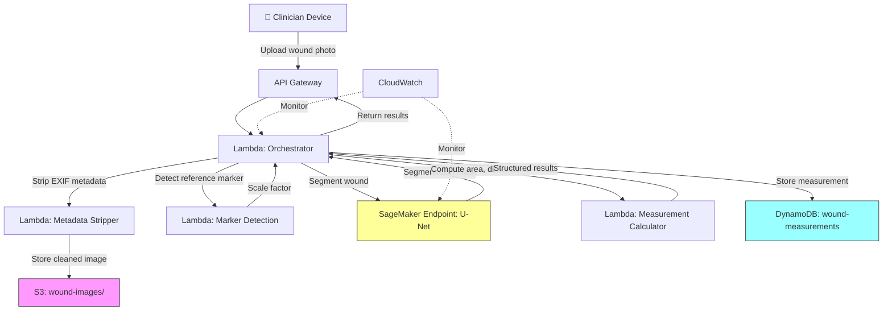

# Recipe 9.3 Architecture and Implementation: Wound Photography Measurement

*Companion to [Recipe 9.3: Wound Photography Measurement](chapter09.03-wound-photography-measurement). This page covers the AWS architecture, services, prerequisites, and pseudocode. For the problem framing and the conceptual approach, start with the main recipe.*

---

## The AWS Implementation

### Why These Services

**Amazon Rekognition Custom Labels for wound segmentation.** Rekognition Custom Labels lets you train a custom image classification or object detection model without managing ML infrastructure. For wound segmentation specifically, you'd train a model to detect and localize wound regions. For pixel-level segmentation (which gives you more precise area measurements), you'd use Amazon SageMaker with a U-Net architecture. The choice depends on your accuracy requirements: bounding-box detection is simpler to train but less precise; pixel segmentation is more accurate but requires more annotated training data.

**Amazon SageMaker for model training and hosting.** If you need pixel-level segmentation (and for clinical wound measurement, you do), SageMaker provides the training infrastructure for U-Net or similar architectures, plus real-time inference endpoints for serving predictions. SageMaker's built-in algorithms include semantic segmentation, and you can bring your own model code for custom architectures. SageMaker also supports model versioning and production variants for A/B testing, which matters when you retrain on new data (see The Honest Take for why this is important).

**Amazon S3 for image storage.** Wound photographs are PHI. They need encrypted, durable, auditable storage. S3 with SSE-KMS, versioning enabled, and lifecycle policies for retention compliance.

**AWS Lambda for orchestration.** The measurement pipeline (receive image, strip metadata, detect marker, call segmentation endpoint, compute measurements, store results) is a stateless workflow that fits Lambda's execution model. For real-time use (clinician takes photo, wants measurement back in seconds), Lambda behind API Gateway provides the synchronous path.

**Amazon DynamoDB for measurement storage.** Wound measurements are time-series data keyed by patient and wound identifier. DynamoDB's partition key (patient_id + wound_id) and sort key (measurement_date) model fits naturally. Point lookups for the latest measurement and range queries for healing trajectory are both efficient.

**Amazon CloudWatch for monitoring.** Track inference latency, segmentation confidence scores, marker detection failure rates, and image quality rejection rates. Alert on degradation.

### Architecture Diagram



### Prerequisites

| Requirement | Details |
|-------------|---------|
| AWS Services | S3, Lambda, API Gateway, SageMaker, DynamoDB, CloudWatch, IAM, KMS |
| IAM Permissions | `s3:PutObject/GetObject` on `arn:aws:s3:::wound-images/*` and `arn:aws:s3:::wound-masks/*`; `sagemaker:InvokeEndpoint` on `arn:aws:sagemaker:*:*:endpoint/wound-segmentation-*`; `dynamodb:PutItem/Query` on the `wound-measurements` table ARN; `logs:CreateLogGroup` on account log group ARNs |
| BAA | Required. Wound photographs are PHI. |
| Encryption | S3 SSE-KMS, DynamoDB encryption at rest, TLS 1.2+ in transit |
| VPC | Lambda and SageMaker endpoint in VPC. Required VPC endpoints: `s3` (gateway), `dynamodb` (gateway), `sagemaker.runtime` (interface), `logs` (interface), `kms` (interface). Without the KMS endpoint, S3 SSE-KMS operations fail in a VPC with no NAT gateway. |
| CloudTrail | Enabled for all API calls. Audit trail for PHI access. |
| Sample Data | Public wound image datasets exist (Medetec, AZH Wound Database). Never use real patient images in development. |
| Cost Estimate | ~$0.02-0.05 per image (SageMaker inference dominates). SageMaker endpoint: ~$0.05/hr for ml.m5.large. At 1000 images/day, ~$50-150/month total. Configure auto-scaling on `InvocationsPerInstance` metric for bursty clinical visit hours. |

### Ingredients

| AWS Service | Role in This Recipe |
|-------------|-------------------|
| Amazon S3 | Encrypted storage for wound images and segmentation masks |
| AWS Lambda | Orchestration, EXIF stripping, marker detection, measurement computation |
| Amazon API Gateway | REST endpoint for clinician-facing applications |
| Amazon SageMaker | Hosts trained U-Net segmentation model for inference |
| Amazon DynamoDB | Stores structured measurements and wound timelines |
| Amazon CloudWatch | Monitoring, alerting on confidence degradation |
| AWS KMS | Encryption key management for PHI at rest |

### Code (Pseudocode Walkthrough)

#### Step 1: Receive and Validate the Wound Image

The clinician's app uploads a wound photograph. Before we do anything expensive (like calling a ML model), we validate that the image is usable.

If you skip this step, you'll waste inference costs on blurry photos, images without reference markers, and accidental screenshots of the clinician's home screen. For production deployments, consider adding an image quality assessment step here (see Recipe 9.1) to reject blurry or poorly-lit images before incurring inference costs.

```text
FUNCTION validate_wound_image(image_bytes, metadata):
    // Check basic image properties
    image = decode_image(image_bytes)

    IF image.width < 640 OR image.height < 640:
        RETURN error("Image resolution too low for reliable measurement")

    IF image.file_size > 20_MB:
        RETURN error("Image too large, compress before upload")

    // Check that required metadata is present
    IF metadata.patient_id IS MISSING:
        RETURN error("Patient ID required")
    IF metadata.wound_location IS MISSING:
        RETURN error("Wound anatomical location required")

    // Strip EXIF metadata before storage
    // Smartphone photos contain GPS (patient home address in home health),
    // device serial numbers, and photographer info. Strip all of it.
    stripped_image = strip_exif_metadata(image_bytes)

    // Store the cleaned image in S3 with application-level metadata
    s3_key = "wound-images/{patient_id}/{wound_id}/{timestamp}.jpg"
    upload_to_s3(bucket="wound-images", key=s3_key, body=stripped_image,
                 metadata=metadata, encryption="aws:kms")

    RETURN success(s3_key)
```

#### Step 2: Detect the Reference Marker and Compute Scale

The reference marker is how we convert pixels to centimeters. Without it, we have a pretty picture but no measurement.

If you skip this step, your "measurements" are just pixel counts with no physical meaning. They can't be compared across sessions taken at different distances.

```text
FUNCTION detect_reference_marker(image):
    // Look for the calibration marker (e.g., a circular sticker of known diameter)
    // This could be a simple color/shape detection or a trained detector

    // Approach: detect circular object of expected color (e.g., blue circle, 2.5cm diameter)
    circles = detect_circles(image, color_range="blue",
                            min_radius_px=20, max_radius_px=200)

    IF no circles found:
        RETURN warning("No reference marker detected. Image flagged for manual review.")

    // Take the best candidate (highest confidence, most circular)
    marker = circles[0]

    // Known marker diameter = 2.5 cm
    // Measured marker diameter in pixels = marker.diameter_px
    pixels_per_cm = marker.diameter_px / 2.5

    // Sanity check: reasonable range is 10-100 pixels per cm for typical photos
    IF pixels_per_cm < 10 OR pixels_per_cm > 100:
        RETURN warning("Scale factor outside expected range. Check marker positioning.")

    RETURN success(pixels_per_cm, marker.location)
```

#### Step 3: Segment the Wound

This is where the ML model does its work. We send the image to our trained segmentation model and get back a pixel-level mask identifying wound tissue.

If you skip this step, you're back to manual tracing, which is what we're trying to replace.

```text
FUNCTION segment_wound(image, sagemaker_endpoint):
    // Preprocess: resize to model's expected input size, normalize pixel values
    preprocessed = resize(image, target_size=(512, 512))
    preprocessed = normalize_pixels(preprocessed, mean=[0.485, 0.456, 0.406],
                                                   std=[0.229, 0.224, 0.225])

    // Call SageMaker endpoint
    response = invoke_sagemaker_endpoint(
        endpoint_name=sagemaker_endpoint,
        content_type="application/x-image",
        body=preprocessed
    )

    // Response is a probability mask (0.0 to 1.0 per pixel)
    probability_mask = parse_response(response)

    // Threshold to binary mask
    binary_mask = probability_mask > 0.5

    // Compute confidence: average probability of wound pixels
    confidence = mean(probability_mask[binary_mask == True])

    IF confidence < 0.7:
        flag_for_review("Low segmentation confidence")

    // Resize mask back to original image dimensions
    final_mask = resize(binary_mask, target_size=image.dimensions)

    RETURN final_mask, confidence
```

#### Step 4: Compute Wound Measurements

With the segmentation mask and the scale factor, we can compute clinically meaningful measurements.

If you skip this step, you have a segmentation mask but no numbers for the clinical record.

```text
FUNCTION compute_measurements(segmentation_mask, pixels_per_cm):
    // Count wound pixels to get area
    wound_pixel_count = count(segmentation_mask == True)
    area_px = wound_pixel_count
    area_cm2 = area_px / (pixels_per_cm * pixels_per_cm)

    // Find wound boundary contour
    contour = find_contour(segmentation_mask)

    // Compute perimeter
    perimeter_px = contour.length
    perimeter_cm = perimeter_px / pixels_per_cm

    // Fit minimum bounding rectangle for length and width
    bounding_rect = minimum_area_rectangle(contour)
    length_cm = bounding_rect.long_side / pixels_per_cm
    width_cm = bounding_rect.short_side / pixels_per_cm

    // Compute circularity (how round is the wound? 1.0 = perfect circle)
    circularity = (4 * PI * area_px) / (perimeter_px * perimeter_px)

    RETURN {
        "area_cm2": round(area_cm2, 2),
        "length_cm": round(length_cm, 2),
        "width_cm": round(width_cm, 2),
        "perimeter_cm": round(perimeter_cm, 2),
        "circularity": round(circularity, 3),
        "pixels_per_cm": pixels_per_cm
    }
```

#### Step 5: Store Measurement and Update Wound Timeline

Each measurement becomes a data point in the wound's healing timeline. We store it with enough context to support trend analysis and audit.

If you skip this step, you lose the longitudinal tracking that makes automated measurement valuable over manual documentation.

The key design here: use `patient_id#wound_id` as the partition key and `timestamp` as the sort key. This makes per-wound timeline queries efficient (get all measurements for a specific wound, sorted by date) without needing to scan across unrelated wounds for the same patient. Application-layer authorization must verify that the requesting clinician has a care relationship with the patient before returning wound data.

```text
FUNCTION store_measurement(patient_id, wound_id, measurements, metadata, image_key, mask_key):
    record = {
        "patient_wound_id": patient_id + "#" + wound_id,  // Partition key
        "measurement_date": now(),                         // Sort key
        "patient_id": patient_id,
        "wound_id": wound_id,
        "area_cm2": measurements.area_cm2,
        "length_cm": measurements.length_cm,
        "width_cm": measurements.width_cm,
        "perimeter_cm": measurements.perimeter_cm,
        "circularity": measurements.circularity,
        "confidence": measurements.confidence,
        "image_s3_key": image_key,
        "mask_s3_key": mask_key,
        "clinician_id": metadata.clinician_id,
        "wound_location": metadata.wound_location,
        "device_info": metadata.device_info,
        "pixels_per_cm": measurements.pixels_per_cm
    }

    dynamodb.put_item(table="wound-measurements", item=record)

    // Get previous measurement for this specific wound
    previous = dynamodb.query(
        table="wound-measurements",
        partition_key=patient_id + "#" + wound_id,
        scan_index_forward=False,  // Most recent first
        limit=2                    // Current + previous
    )

    // Skip the one we just inserted, take the prior measurement
    IF previous has at least 2 records:
        prior = previous[1]
        days_elapsed = (now() - prior.measurement_date).days
        IF days_elapsed > 0:
            area_change_pct = ((measurements.area_cm2 - prior.area_cm2)
                              / prior.area_cm2) * 100
            healing_rate_cm2_per_day = (prior.area_cm2 - measurements.area_cm2)
                                      / days_elapsed

            // Alert if wound is growing
            IF area_change_pct > 10:
                send_alert("Wound {wound_id} for patient {patient_id} "
                          "has increased {area_change_pct}% since last measurement")

    RETURN record
```

> **Curious how this looks in Python?** The pseudocode above covers the concepts. If you'd like to see sample Python code that demonstrates these patterns using boto3, check out the [Python Example](chapter09.03-python-example). It walks through each step with inline comments and notes on what you'd need to change for a real deployment.

### Expected Results

Sample output from a successful wound measurement:

```json
{
  "measurement_id": "meas_20260531_143022_abc123",
  "patient_id": "PAT-98234",
  "wound_id": "WND-003-sacral",
  "measurement_date": "2026-05-31T14:30:22Z",
  "measurements": {
    "area_cm2": 4.73,
    "length_cm": 3.21,
    "width_cm": 1.89,
    "perimeter_cm": 8.94,
    "circularity": 0.744
  },
  "confidence": 0.89,
  "scale_factor_px_per_cm": 42.3,
  "marker_detected": true,
  "healing_trajectory": {
    "previous_area_cm2": 5.12,
    "area_change_pct": -7.6,
    "days_since_last": 7,
    "healing_rate_cm2_per_day": 0.056,
    "projected_closure_days": 84
  },
  "flags": [],
  "image_s3_key": "wound-images/PAT-98234/WND-003-sacral/20260531T143022.jpg",
  "mask_s3_key": "wound-masks/PAT-98234/WND-003-sacral/20260531T143022.png"
}
```

### Performance Benchmarks

| Metric | Target | Notes |
|--------|--------|-------|
| Segmentation accuracy (Dice score) | > 0.85 | Against clinician-traced ground truth |
| Area measurement error | < 10% | Compared to planimetry (gold standard) |
| Marker detection rate | > 95% | When marker is properly placed |
| End-to-end latency | < 5 seconds | From upload to measurement result. VPC-attached Lambdas may need provisioned concurrency during peak clinical hours to eliminate cold starts. |
| Inference cost | ~$0.02-0.05 | Per image, SageMaker ml.m5.large |
| Throughput | 200+ images/hour | Per SageMaker endpoint instance |

### Where It Struggles

- **Deep wounds.** 2D photography cannot measure depth. A tunneling wound or a wound with significant undermining will have its volume underestimated. 3D imaging (structured light) is needed for depth.
- **Wounds in body folds.** Inguinal, interdigital, and gluteal fold wounds are nearly impossible to photograph perpendicular to the surface. Perspective distortion introduces systematic measurement error.
- **Very small wounds.** Wounds under 0.5 cm² approach the resolution limits of smartphone cameras at typical distances. Measurement noise increases as wound size decreases.
- **Heavily exudative wounds.** Exudate pooling on the wound surface can obscure tissue boundaries and confuse segmentation models.
- **Dark skin tones with limited training data.** If your training dataset underrepresents darker skin tones, segmentation accuracy will be worse for those patients. This is a known and serious equity concern.

---

## Variations and Extensions

### Variation 1: Tissue Classification Overlay

Beyond binary wound/not-wound segmentation, train a multi-class model that classifies wound tissue into categories: granulation (red), slough (yellow), necrotic (black), epithelializing (pink). Report tissue composition percentages alongside area measurements. This gives clinicians a richer picture of healing status. Requires more detailed training annotations (pixel-level tissue type labels, not just wound boundary).

### Variation 2: 3D Wound Measurement with Depth Sensing

For wounds where depth matters (Stage 3-4 pressure ulcers, tunneling wounds), integrate with depth-sensing hardware (structured light cameras, LiDAR on newer smartphones). Reconstruct a 3D surface model of the wound. Compute volume in addition to surface area. This requires different ML models (depth estimation or 3D reconstruction networks) and more complex calibration, but provides measurements that 2D photography simply cannot.

### Variation 3: Automated Wound Staging

Combine area measurements with tissue classification to suggest wound stage (for pressure ulcers: Stage 1 through Stage 4, plus Unstageable and Deep Tissue Injury). This moves from measurement into assessment, which has different regulatory implications but significant clinical value. The model would need to be trained on staged wound images with clinician consensus labels.

---

## Additional Resources

### AWS Documentation

- Amazon SageMaker Semantic Segmentation Algorithm: https://docs.aws.amazon.com/sagemaker/latest/dg/semantic-segmentation.html
- Amazon SageMaker Real-Time Inference: https://docs.aws.amazon.com/sagemaker/latest/dg/realtime-endpoints.html
- Amazon S3 Encryption: https://docs.aws.amazon.com/AmazonS3/latest/userguide/UsingEncryption.html
- Amazon DynamoDB Developer Guide: https://docs.aws.amazon.com/amazondynamodb/latest/developerguide/
- AWS Lambda with API Gateway: https://docs.aws.amazon.com/lambda/latest/dg/services-apigateway.html
- Amazon SageMaker Model Registry: https://docs.aws.amazon.com/sagemaker/latest/dg/model-registry.html

### Compliance and Healthcare

- AWS HIPAA Eligible Services: https://aws.amazon.com/compliance/hipaa-eligible-services-reference/
- AWS Well-Architected Framework (Healthcare Lens): https://docs.aws.amazon.com/wellarchitected/latest/healthcare-industry-lens/healthcare-industry-lens.html

### Clinical References

- Wound Measurement Best Practices (general clinical guidance on wound assessment methodology)
- National Pressure Injury Advisory Panel (NPIAP) staging guidelines
- CMS Quality Reporting requirements for pressure ulcer documentation

---

## Estimated Implementation Time

| Phase | Duration | What You Get |
|-------|----------|-------------|
| Basic (marker detection + simple segmentation) | 4-6 weeks | Area measurement from photos with reference marker. Single wound type. Manual review queue for low-confidence results. |
| Production-ready (robust pipeline + EHR integration) | 10-14 weeks | Multi-wound-type support, longitudinal tracking, healing rate alerts, FHIR-based EHR integration, clinician dashboard. |
| With variations (tissue classification + 3D) | 16-22 weeks | Tissue composition analysis, depth measurement, automated staging suggestions, predictive healing models. |

---

---

*← [Main Recipe 9.3](chapter09.03-wound-photography-measurement) · [Python Example](chapter09.03-python-example) · [Chapter Preface](chapter09-preface)*
