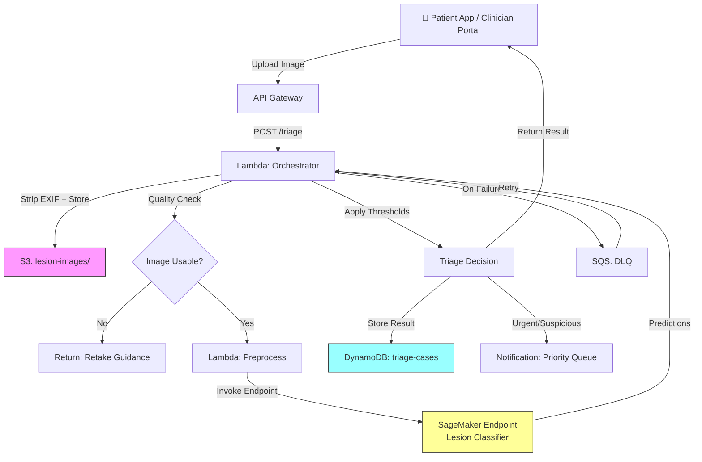

# Recipe 9.4 Architecture and Implementation: Dermatology Lesion Triage

*Companion to [Recipe 9.4: Dermatology Lesion Triage](chapter09.04-dermatology-lesion-triage). This page covers the AWS architecture, services, prerequisites, and pseudocode. For the problem framing and the conceptual approach, start with the main recipe.*

---

## Why These Services

**Amazon SageMaker for model hosting.** SageMaker provides managed inference endpoints that can serve a trained image classification model with auto-scaling, A/B testing, and model monitoring. For a dermatology triage model, you need low-latency inference (patients and clinicians expect results in seconds, not minutes) with the ability to swap model versions without downtime. SageMaker real-time endpoints deliver this. For production, deploy across multiple availability zones using SageMaker's multi-AZ endpoint configuration. SageMaker also handles the training pipeline if you're fine-tuning your own model, with built-in support for distributed training on GPU instances. SageMaker Clarify supports model explainability for image classification, enabling the saliency map generation discussed in the main recipe.

**Amazon S3 for image storage.** Lesion images are PHI (they're identifiable medical photographs). They need encrypted, durable, auditable storage. S3 with SSE-KMS encryption, versioning, and lifecycle policies is the standard choice. Object Lock can enforce retention policies for compliance.

**AWS Lambda for orchestration.** The triage workflow is a sequence of lightweight steps: receive the image, strip EXIF metadata, run quality checks, call the SageMaker endpoint, apply business logic for routing, write results. Lambda handles this without persistent infrastructure. For the quality check step specifically, Lambda can run lightweight image analysis (blur detection, brightness check) without needing a full ML endpoint.

**Amazon DynamoDB for case tracking.** Each triage case needs a record: patient identifier, image reference, model output, triage decision, timestamp, and eventual dermatologist disposition. DynamoDB's key-value model fits this access pattern (lookup by case ID or patient ID) with encryption at rest and HIPAA eligibility.

**Amazon API Gateway for the submission interface.** Clinicians and patient-facing apps need a REST endpoint to submit images and receive triage results. API Gateway provides authentication, throttling, and request validation in front of the Lambda orchestrator. For internal clinical portals, consider a Private API Gateway endpoint accessible only from the VPC. For patient-facing apps, use a Regional endpoint with AWS WAF for rate limiting and IP-based access controls.

**Amazon SQS for failure handling.** Configure a dead letter queue (DLQ) for failed Lambda invocations. If the SageMaker endpoint is unavailable or times out (GPU cold starts can take 2-5 minutes when scaling from zero), the case must not be silently lost. Write the case to DynamoDB with status `PENDING_INFERENCE` and reprocess via a scheduled retry. For a clinical triage system, no submission should be silently dropped. Alert on DLQ depth > 0.

**Amazon CloudWatch for monitoring.** Model performance monitoring is critical for medical AI. Track inference latency, confidence score distributions, and triage category distributions. Monitor weekly triage category distribution and alert if the urgent rate shifts by more than 2 standard deviations from the 30-day rolling average. Track mean confidence scores per category; declining confidence suggests the model is seeing inputs unlike its training data. Compare model predictions against dermatologist dispositions (when available) to compute rolling accuracy metrics.

## Architecture Diagram



## Prerequisites

| Requirement | Details |
|-------------|---------|
| **AWS Services** | Amazon SageMaker, Amazon S3, AWS Lambda, Amazon DynamoDB, Amazon API Gateway, Amazon SQS, Amazon CloudWatch, Amazon SNS |
| **IAM Permissions** | `sagemaker:InvokeEndpoint` on `arn:aws:sagemaker:*:*:endpoint/lesion-classifier-*`; `s3:PutObject/GetObject` on `arn:aws:s3:::lesion-images/*`; `dynamodb:PutItem/GetItem` on the `triage-cases` table ARN; `sns:Publish` on the `urgent-derm-triage` topic ARN; `sqs:SendMessage/ReceiveMessage` on the DLQ ARN |
| **BAA** | Required. Lesion photographs are identifiable medical images (PHI). |
| **Encryption** | S3: SSE-KMS; DynamoDB: encryption at rest; SageMaker endpoint: in-transit TLS + at-rest KMS; CloudWatch Logs: KMS encryption |
| **VPC** | Production: Lambda and SageMaker endpoint in VPC with VPC endpoints for S3 (gateway), DynamoDB (gateway), SageMaker Runtime (interface), CloudWatch Logs (interface), and KMS (interface). The KMS endpoint is required for S3 SSE-KMS operations in a VPC without NAT gateway. |
| **Egress** | For PHI workloads, restrict VPC egress. Use VPC endpoints for all AWS service communication and avoid NAT gateways unless required for specific integrations. This prevents accidental PHI egress through misconfigured Lambda functions or compromised dependencies. |
| **CloudTrail** | Enabled: log all SageMaker, S3, and DynamoDB API calls for audit trail |
| **Model** | Pre-trained image classification model fine-tuned on dermatology dataset (e.g., ISIC archive). Validated across Fitzpatrick skin types I-VI. |
| **Sample Data** | ISIC Archive (public dermoscopy images). HAM10000 dataset. Never use real patient photos in development. |
| **Cost Estimate** | SageMaker real-time endpoint (ml.g4dn.xlarge): ~$0.736/hour. At 100 images/day, ~$0.08-0.15 per image including S3, Lambda, DynamoDB. |
| **Regulatory** | Consult regulatory counsel. Triage framing reduces but does not eliminate FDA considerations. Document intended use clearly. |

## Ingredients

| AWS Service | Role |
|------------|------|
| **Amazon SageMaker** | Hosts the trained lesion classification model; provides real-time inference endpoint with multi-AZ deployment |
| **Amazon S3** | Stores original lesion images (EXIF-stripped) with encryption and retention policies |
| **AWS Lambda** | Orchestrates the triage pipeline: EXIF stripping, quality check, preprocessing, inference call, routing logic |
| **Amazon DynamoDB** | Tracks triage cases: image reference, model output, triage decision, disposition |
| **Amazon API Gateway** | REST endpoint for image submission; handles auth and throttling |
| **Amazon SQS** | Dead letter queue for failed inference attempts; enables retry without losing cases |
| **Amazon SNS** | Sends urgent-case notifications to dermatology review queue (case_id only, no PHI in message body) |
| **AWS KMS** | Manages encryption keys for all PHI-containing services |
| **Amazon CloudWatch** | Monitors model latency, confidence distributions, and triage category drift |

## Pseudocode Walkthrough

> **Reference implementations:** The following AWS sample repos demonstrate patterns relevant to this recipe:
>
> - [`amazon-sagemaker-examples`](https://github.com/aws/amazon-sagemaker-examples): Comprehensive SageMaker examples including image classification model training and deployment
> - [`aws-healthcare-lifescience-ai-ml`](https://github.com/aws-samples/aws-healthcare-lifescience-ai-ml): Healthcare and life science AI/ML examples on AWS

**Step 1: Image upload and metadata stripping.** Patient-submitted smartphone photos contain EXIF metadata including GPS coordinates that reveal home addresses, device serial numbers, and photographer names. Before storing the image or running any analysis, strip all non-essential metadata. Retain only the timestamp and image dimensions. This is a privacy requirement, not an optimization. Skip this step and you're storing patient home addresses alongside their medical photographs.

```pseudocode
FUNCTION strip_and_store(image_bytes, patient_id):
    // Validate file type by checking magic bytes, not just the extension.
    // Enforce maximum file size at the API Gateway level (e.g., 10 MB).
    IF NOT valid_image_magic_bytes(image_bytes):
        RETURN { error: "Invalid file type. Please upload a JPEG or PNG image." }

    // Strip EXIF metadata. Remove GPS, device IDs, photographer info.
    // Keep only timestamp and dimensions for clinical context.
    stripped_image = remove_exif_metadata(image_bytes, keep=["DateTime", "ImageWidth", "ImageHeight"])

    // Store the stripped image in S3 with encryption.
    image_key = "lesion-images/{date}/{patient_id}/{unique_id}.jpg"
    upload to S3 bucket with:
        key                = image_key
        body               = stripped_image
        server_side_encryption = "aws:kms"

    RETURN { image_key: image_key, original_bytes: stripped_image }
```

**Step 2: Image quality validation.** Before spending compute on inference, verify the submitted image is actually usable. A blurry photo, an image that's too dark, or one where no lesion is visible will produce garbage predictions. This step catches those early and returns actionable feedback to the submitter. The quality check is lightweight (basic image statistics, not a full ML model) and runs in milliseconds. Skip this step and you'll waste inference costs on unusable images while returning meaningless confidence scores that erode clinician trust.

```pseudocode
FUNCTION validate_image_quality(image_bytes):
    // Load the image and compute basic quality metrics.
    // These are fast statistical checks, not ML inference.
    image = decode_image(image_bytes)

    // Check 1: Resolution. The model needs enough pixels to see lesion detail.
    // Below 224x224 (typical model input size), there's not enough information.
    width, height = image.dimensions
    IF width < 224 OR height < 224:
        RETURN { valid: false, reason: "Image resolution too low. Please move closer to the lesion." }

    // Check 2: Blur detection using Laplacian variance.
    // A sharp image has high variance in its edge map; a blurry one is flat.
    // Threshold calibrated on sample images; adjust based on your camera population.
    blur_score = compute_laplacian_variance(image)
    IF blur_score < 100:
        RETURN { valid: false, reason: "Image appears blurry. Please hold steady and ensure focus." }

    // Check 3: Brightness. Too dark or too bright means lost detail.
    mean_brightness = compute_mean_pixel_value(image)
    IF mean_brightness < 40:
        RETURN { valid: false, reason: "Image too dark. Please improve lighting." }
    IF mean_brightness > 220:
        RETURN { valid: false, reason: "Image too bright or overexposed. Reduce direct light." }

    RETURN { valid: true }
```

**Step 3: Image preprocessing.** The classification model expects a specific input format: fixed dimensions, normalized pixel values, and ideally a clean view of the lesion without excessive background. This step transforms the raw photograph into what the model needs. Different models have different input requirements, so the preprocessing must match the model's training pipeline exactly. If you resize differently than the training data was resized, or normalize to a different range, accuracy degrades silently.

```pseudocode
FUNCTION preprocess_image(image_bytes, target_size=224):
    // Decode and resize to the model's expected input dimensions.
    // Most classification models expect square inputs (224x224 or 299x299).
    image = decode_image(image_bytes)
    image = resize(image, target_size, target_size)

    // Normalize pixel values to [0, 1] range.
    // Neural networks train on normalized inputs; raw 0-255 values would produce
    // wildly wrong activations.
    image = image / 255.0

    // Apply the same channel-wise normalization used during training.
    // These values (ImageNet means and standard deviations) are standard for
    // models pre-trained on ImageNet and fine-tuned on dermatology data.
    mean = [0.485, 0.456, 0.406]  // RGB channel means from ImageNet
    std  = [0.229, 0.224, 0.225]  // RGB channel standard deviations
    image = (image - mean) / std

    // Serialize to the format the inference endpoint expects.
    // SageMaker endpoints typically accept raw bytes or JSON-encoded tensors.
    payload = serialize_to_model_format(image)

    RETURN payload
```

**Step 4: Model inference.** Send the preprocessed image to the classification model and get back a probability distribution across triage categories. The model outputs raw logits or softmax probabilities for each class. This is the core ML step, and it's also the most expensive computationally. The endpoint should respond in under 2 seconds for a good user experience. If latency is a concern at scale, consider batching or asynchronous inference for non-urgent submissions.

```pseudocode
FUNCTION classify_lesion(preprocessed_payload, endpoint_name):
    // Call the SageMaker real-time inference endpoint.
    // The endpoint hosts the trained model and handles GPU allocation.
    response = call SageMaker.InvokeEndpoint with:
        endpoint_name = endpoint_name
        content_type  = "application/x-image"    // or "application/json" depending on model server
        body          = preprocessed_payload

    // Parse the model's output: probability for each triage category.
    // Example output: { "benign": 0.15, "suspicious": 0.72, "urgent": 0.13 }
    predictions = parse_response(response.Body)

    RETURN predictions
```

**Step 5: Triage decision logic.** Raw model probabilities need to be translated into actionable triage decisions. This is where clinical judgment meets engineering. The thresholds determine the sensitivity/specificity tradeoff: lower the "urgent" threshold and you catch more true positives but flood the queue with false alarms. Raise it and you miss cases. These thresholds should be set in collaboration with dermatologists and validated on a held-out dataset with known outcomes. They're configuration, not code, and they will need adjustment over time as you gather real-world performance data.

```pseudocode
// Triage thresholds. These are clinical decisions, not engineering decisions.
// Set in collaboration with dermatology leadership. Review quarterly.
URGENT_THRESHOLD     = 0.70  // above this: immediate dermatology review
SUSPICIOUS_THRESHOLD = 0.40  // above this: expedited scheduling (within 2 weeks)
// Below suspicious threshold: standard follow-up recommendation

FUNCTION determine_triage(predictions):
    urgent_score     = predictions["urgent"]
    suspicious_score = predictions["suspicious"]
    benign_score     = predictions["benign"]

    // Priority logic: check urgent first, then suspicious, then default to routine.
    // If both urgent and suspicious are high, urgent wins.
    IF urgent_score >= URGENT_THRESHOLD:
        RETURN {
            category: "URGENT",
            action: "Immediate dermatology review recommended",
            confidence: urgent_score,
            all_scores: predictions
        }

    IF suspicious_score >= SUSPICIOUS_THRESHOLD:
        RETURN {
            category: "SUSPICIOUS",
            action: "Expedited dermatology appointment recommended (within 2 weeks)",
            confidence: suspicious_score,
            all_scores: predictions
        }

    RETURN {
        category: "ROUTINE",
        action: "Standard monitoring. Follow up if changes observed.",
        confidence: benign_score,
        all_scores: predictions
    }
```

**Step 6: Store results and notify.** Every triage case gets a permanent record: the image reference, model output, triage decision, and timestamps. This serves three purposes: (1) the dermatologist review queue needs to pull cases by priority, (2) the audit trail must show what the AI recommended and when, and (3) outcome tracking (what did the dermatologist actually find?) enables model performance monitoring over time. For urgent cases, an immediate notification ensures the dermatology team is alerted without waiting for someone to check the queue.

```pseudocode
FUNCTION store_and_notify(case_id, patient_id, image_key, triage_result):
    // Write the complete triage record to the database.
    write to DynamoDB table "triage-cases":
        case_id              = case_id
        patient_id           = patient_id
        image_key            = image_key                          // S3 reference to the original image
        triage_category      = triage_result.category             // URGENT, SUSPICIOUS, or ROUTINE
        triage_action        = triage_result.action               // human-readable recommendation
        model_confidence     = triage_result.confidence           // primary category confidence
        all_scores           = triage_result.all_scores           // full probability distribution
        submitted_at         = current UTC timestamp (ISO 8601)
        reviewed_by          = null                               // populated when dermatologist reviews
        dermatologist_dx     = null                               // populated with actual diagnosis
        status               = "PENDING_REVIEW"

    // For urgent cases, send an immediate notification.
    // Don't rely on someone polling the queue for time-sensitive findings.
    // Note: the notification contains only the case_id, not patient identifiers.
    // The dermatologist accesses patient details through the secure review queue.
    IF triage_result.category == "URGENT":
        publish to SNS topic "urgent-derm-triage":
            message = "Urgent lesion triage: Case {case_id}. "
                    + "Model confidence: {triage_result.confidence}. "
                    + "Immediate dermatology review recommended. "
                    + "Access patient details in the secure review queue."

    RETURN case_id
```

**Error handling: what happens when inference fails.** If the SageMaker endpoint times out or returns an error (GPU cold starts, transient failures, endpoint scaling), the case must not be lost. Write the case to DynamoDB with status `PENDING_INFERENCE` and route the message to the SQS dead letter queue for retry. A scheduled Lambda processes the DLQ and retries inference. If retries are exhausted, route the case to the dermatology queue with a `MANUAL_REVIEW` flag so a human triages it manually.

```pseudocode
FUNCTION handle_inference_failure(case_id, patient_id, image_key, error):
    // Write a record so the case is tracked even though inference failed.
    write to DynamoDB table "triage-cases":
        case_id         = case_id
        patient_id      = patient_id
        image_key       = image_key
        status          = "PENDING_INFERENCE"
        error_message   = error.message
        submitted_at    = current UTC timestamp (ISO 8601)
        retry_count     = 0

    // Send to DLQ for retry processing.
    send to SQS dead letter queue:
        message_body = { case_id: case_id, image_key: image_key }

    // Alert operations team if DLQ depth exceeds threshold.
    // A growing DLQ means the endpoint is unhealthy.
    RETURN case_id
```

> **Curious how this looks in Python?** The pseudocode above covers the concepts. If you'd like to see sample Python code that demonstrates these patterns using boto3, check out the [Python Example](chapter09.04-python-example). It walks through each step with inline comments and notes on what you'd need to change for a real deployment.

## Expected Results

**Sample output for a suspicious lesion:**

```json
{
  "case_id": "TRIAGE-2026-03-15-00847",
  "patient_id": "PT-928471",
  "image_key": "lesion-images/2026/03/15/PT-928471-left-forearm.jpg",
  "triage_category": "SUSPICIOUS",
  "triage_action": "Expedited dermatology appointment recommended (within 2 weeks)",
  "model_confidence": 0.68,
  "all_scores": {
    "benign": 0.22,
    "suspicious": 0.68,
    "urgent": 0.10
  },
  "submitted_at": "2026-03-15T09:14:22Z",
  "reviewed_by": null,
  "dermatologist_dx": null,
  "status": "PENDING_REVIEW"
}
```

**Performance benchmarks:**

| Metric | Typical Value |
|--------|---------------|
| End-to-end latency | 2-4 seconds (including quality check) |
| Sensitivity (urgent detection) | 85-92% on dermoscopic images; 70-82% on clinical photos |
| Specificity (benign correct) | 80-90% |
| False urgent rate | 8-15% (acceptable for triage; over-referral is safer than under-referral) |
| Cost per triage | ~$0.08-0.15 (endpoint amortized + storage + compute) |
| Throughput | ~200 images/hour per endpoint instance |

**Where it struggles:**

- Clinical (phone) photos vs. dermoscopic images: significant accuracy drop
- Darker skin tones (Fitzpatrick IV-VI): reduced sensitivity, especially for amelanotic lesions
- Lesions partially obscured by hair, clothing edges, or bandages
- Very small lesions where the photo doesn't capture enough detail
- Lesions on anatomical locations underrepresented in training data (scalp, genitalia, nail beds)
- Multiple lesions in a single image (model expects one lesion per image)

---

## Why This Isn't Production-Ready

The architecture above demonstrates the pattern. Deploying this in a clinical environment requires closing several gaps that are intentionally outside the scope of a cookbook recipe:

**Model bias validation before go-live.** You cannot deploy without stratified performance evaluation across Fitzpatrick skin types I-VI. The training data skew toward lighter skin is well-documented, and a model that performs 15% worse on darker skin tones is clinically unacceptable for a general deployment. Acquire validation sets that represent your patient population, measure sensitivity and specificity per skin type, and establish minimum performance thresholds per subgroup before any patient-facing use.

**Regulatory classification.** Even for triage (not diagnosis), the FDA's guidance on Clinical Decision Support software applies. If your system's output materially influences clinical routing without independent clinician validation of the AI's reasoning, it likely qualifies as a medical device under the SaMD framework. Document your intended use precisely, establish that a qualified dermatologist reviews every case regardless of AI output, and engage regulatory counsel before deployment.

**Outcome feedback loop.** The architecture stores `dermatologist_dx` and `status` fields but doesn't define how they get populated or how model performance is tracked over time. In production, you need a closed-loop system: the dermatologist's final diagnosis feeds back to the triage record, model accuracy is computed on a rolling basis, and performance degradation triggers automatic alerts. Without this, you have no way to detect model drift or confirm the system is actually helping.

**Threshold governance.** The confidence thresholds that determine triage routing (urgent vs. suspicious vs. benign) have direct clinical impact. These cannot be set once and forgotten. Establish a clinical governance committee that reviews threshold performance quarterly, examines false-negative cases, and adjusts based on evolving patient volume and model behavior. Document every threshold change with clinical justification.

**Failover and graceful degradation.** If the SageMaker endpoint is unavailable (maintenance, capacity issues, region outage), the system must fail safely. Cases should route to a manual triage queue with appropriate alerting, not silently drop. Define SLAs for endpoint availability and implement health checks that route to fallback workflows when the model is unreachable.

**Audit trail for regulatory compliance.** Every prediction, confidence score, saliency map, and routing decision must be immutably logged with timestamps for potential regulatory review. CloudTrail covers API calls, but you also need application-level audit logs that capture the full decision context: input image hash, preprocessing steps applied, model version, threshold values used, and final routing outcome.

---

## Variations and Extensions

**Teledermatology integration.** Instead of just prioritizing a queue, embed the triage system into a store-and-forward teledermatology workflow. The patient submits photos through a portal, the AI triages, and the dermatologist reviews asynchronously with the AI's assessment as context (not as a binding recommendation). This extends access to patients in dermatology deserts without requiring synchronous video visits. For store-and-forward workflows where immediate response isn't required, consider SageMaker Async Inference. It handles burst loads without maintaining always-on GPU instances and costs significantly less for intermittent workloads.

**Longitudinal tracking.** For patients with many moles or known atypical nevi, track lesions over time. Photograph the same lesion at regular intervals and use change detection (not just single-image classification) to identify evolution. A lesion that was "benign" six months ago but has grown asymmetrically is more concerning than its current appearance alone would suggest. This requires patient-specific image registration and temporal modeling.

**Multi-class diagnostic support.** Expand beyond the three-class triage model to a more granular classifier: melanoma, basal cell carcinoma, squamous cell carcinoma, actinic keratosis, seborrheic keratosis, dermatofibroma, nevus, vascular lesion. This moves toward diagnostic support (higher regulatory bar) but provides more actionable information to the reviewing dermatologist. Requires significantly more training data per class and careful validation.

---

## Additional Resources

**AWS Documentation:**
- [Amazon SageMaker Real-Time Inference](https://docs.aws.amazon.com/sagemaker/latest/dg/realtime-endpoints.html)
- [Amazon SageMaker Image Classification Algorithm](https://docs.aws.amazon.com/sagemaker/latest/dg/image-classification.html)
- [Amazon SageMaker Model Monitor](https://docs.aws.amazon.com/sagemaker/latest/dg/model-monitor.html)
- [Amazon SageMaker Clarify](https://docs.aws.amazon.com/sagemaker/latest/dg/clarify-configure-processing-jobs.html)
- [AWS HIPAA Eligible Services](https://aws.amazon.com/compliance/hipaa-eligible-services-reference/)
- [Amazon SageMaker Pricing](https://aws.amazon.com/sagemaker/pricing/)

**AWS Sample Repos:**
- [`amazon-sagemaker-examples`](https://github.com/aws/amazon-sagemaker-examples): Comprehensive examples including image classification training and deployment patterns
- [`aws-healthcare-lifescience-ai-ml`](https://github.com/aws-samples/aws-healthcare-lifescience-ai-ml): Healthcare-specific ML examples on AWS

**Clinical and Research Resources:**
- [ISIC Archive](https://www.isic-archive.com/): International Skin Imaging Collaboration; largest public dermoscopy dataset
- [HAM10000 Dataset](https://dataverse.harvard.edu/dataset.xhtml?persistentId=doi:10.7910/DVN/DBW86T): 10,015 dermoscopic images across 7 diagnostic categories
- [FDA Digital Health Software Precertification Program](https://www.fda.gov/medical-devices/digital-health-center-excellence): Regulatory guidance for AI/ML-based medical software
- [Fitzpatrick 17k Dataset](https://github.com/mattgroh/fitzpatrick17k): Dermatology dataset with Fitzpatrick skin type labels for bias evaluation

---

## Estimated Implementation Time

| Phase | Duration |
|-------|----------|
| **Basic** (model fine-tuning + single endpoint + manual review) | 4-6 weeks |
| **Production-ready** (quality gates, monitoring, outcome tracking, bias validation) | 3-5 months |
| **With variations** (teledermatology integration, longitudinal tracking) | 6-9 months |

---

**Tags:** `computer-vision` `dermatology` `image-classification` `triage` `skin-cancer` `cnn` `sagemaker` `bias-fairness` `fda` `samd`

---

| [← 9.3: Wound Photography Measurement](chapter09.03-wound-photography-measurement) | [Chapter 9 Index](chapter09-preface) | [9.5: Chest X-Ray Triage →](chapter09.05-chest-xray-triage) |
|:---|:---:|---:|

---

*← [Main Recipe 9.4](chapter09.04-dermatology-lesion-triage) · [Python Example](chapter09.04-python-example) · [Chapter Preface](chapter09-preface)*
