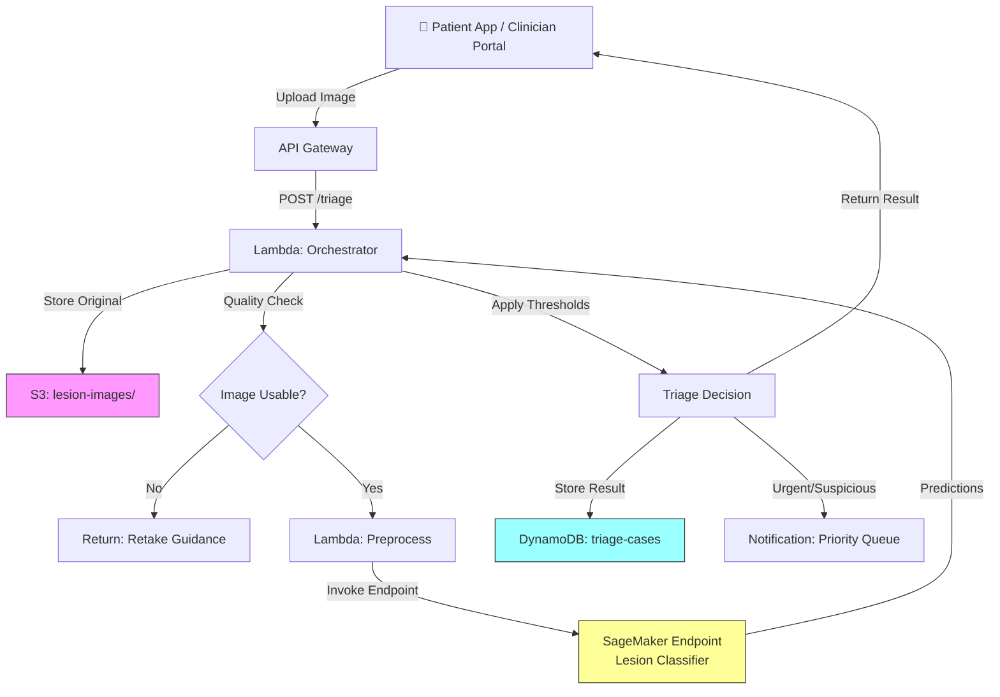

# Recipe 9.4: Dermatology Lesion Triage

**Complexity:** Medium · **Phase:** Pilot · **Estimated Cost:** ~$0.08–$0.15 per image

---

## The Problem

There are roughly 3.5 billion people on Earth with access to a smartphone camera but not to a dermatologist. In the United States alone, the average wait time for a dermatology appointment is over 30 days. In rural areas, it can stretch past 90. For patients with a suspicious mole that changed shape last week, that wait is terrifying. For the ones whose lesion is actually melanoma, it's potentially deadly.

Primary care physicians see skin complaints constantly. They're the front line. But most PCPs have limited dermatology training, and the visual pattern recognition required to distinguish a benign seborrheic keratosis from an early melanoma is genuinely difficult. Studies have shown that PCP accuracy for melanoma detection ranges from 50% to 75%, depending on the study and the lesion type. That's not a criticism of PCPs. It's a recognition that dermatology is a visual specialty that takes years of focused training.

The result is a system that either over-refers (flooding dermatology clinics with benign lesions, extending wait times for everyone) or under-refers (missing early-stage cancers that would have been treatable if caught sooner). Neither outcome is acceptable.

What if you could put a triage layer between the initial photo and the dermatology referral? Not a diagnosis. Not a replacement for a dermatologist. A prioritization system that says: "This one looks suspicious, move it to the front of the queue" or "This one has features consistent with benign patterns, standard scheduling is appropriate." The dermatologist still makes the call. But the urgent cases get seen first.

That's what this recipe builds.

---

## The Technology: How Computers Classify Skin Lesions

### Image Classification for Dermatology

At its core, skin lesion triage is an image classification problem. You have an input image (a photograph of a skin lesion) and you want to assign it to one of several categories: benign, suspicious, or urgent. The underlying technology is a convolutional neural network (CNN) trained on labeled dermoscopic and clinical images.

CNNs work by learning hierarchical visual features. The early layers detect edges and color gradients. Middle layers combine those into textures and shapes. Deep layers recognize complex patterns like asymmetry, border irregularity, color variation, and structural features. These happen to align closely with the ABCDE criteria that dermatologists use for melanoma screening (Asymmetry, Border, Color, Diameter, Evolution), which is part of why deep learning has been surprisingly effective for this task.

The field has progressed rapidly. In 2017, a Stanford study published in Nature showed that a CNN could match board-certified dermatologists in classifying skin cancer from dermoscopic images. Since then, multiple studies have replicated and extended these results. The ISIC (International Skin Imaging Collaboration) has published large public datasets that have accelerated research. Models trained on these datasets can distinguish between dozens of diagnostic categories with performance comparable to specialists.

(A critical caveat: "comparable to specialists" in a controlled study with curated images is very different from "works reliably on a blurry phone photo taken in a bathroom mirror." We'll get to that.)

### Dermoscopic vs. Clinical Images

There's an important distinction between two types of skin lesion images:

**Dermoscopic images** are taken with a dermatoscope, a specialized magnifying device with polarized lighting that eliminates surface reflections and reveals subsurface structures. These images are high-quality, standardized, and show features invisible to the naked eye. Most published research uses dermoscopic images. Most trained models perform best on them.

**Clinical images** are regular photographs taken with a phone camera or digital camera. No special equipment. Variable lighting, variable distance, variable angle. Hair, shadows, skin folds, and background clutter are all present. These are what patients and PCPs actually produce in the real world.

The performance gap between models evaluated on dermoscopic images versus clinical images is significant. A model that achieves 90% sensitivity on dermoscopic images might drop to 70-80% on clinical photos. Any production system must be honest about which image type it was trained on and which it will receive in practice.

### Transfer Learning and Fine-Tuning

You don't train a skin lesion classifier from scratch. You start with a model pre-trained on millions of general images (ImageNet is the classic starting point), then fine-tune it on dermatology-specific datasets. This transfer learning approach works because the low-level visual features (edges, textures, color patterns) are universal. The model already knows how to "see." You're teaching it what to look for in skin lesions specifically.

Common base architectures include EfficientNet, ResNet, and Inception variants. The choice of base architecture matters less than the quality and diversity of your fine-tuning dataset. A well-curated training set with balanced representation across skin tones, lesion types, and image qualities will outperform a larger but biased dataset every time.

### The Skin Tone Problem

This is the elephant in the room, and it's not optional to discuss.

The vast majority of published dermatology training datasets are heavily skewed toward lighter skin tones (Fitzpatrick types I-III). The ISIC archive, which is the largest public dermoscopy dataset, is estimated to be over 80% light-skinned patients. This means models trained on these datasets perform measurably worse on darker skin tones (Fitzpatrick types IV-VI).

This isn't a theoretical concern. Melanoma on dark skin presents differently (often acral, on palms, soles, or nail beds rather than sun-exposed areas). The visual features the model learned from light-skinned training examples may not transfer. Published studies have documented sensitivity drops of 10-20 percentage points for darker skin tones.

Any responsible deployment must: (1) measure performance stratified by skin tone, (2) be transparent about known limitations, (3) actively seek diverse training data, and (4) never deploy a model that hasn't been validated across the patient population it will serve.

### Triage vs. Diagnosis

This distinction is critical and has regulatory implications.

**Triage** means prioritization. The system says "this lesion has features that warrant urgent review" or "this lesion has features consistent with benign patterns." It does not say "this is melanoma" or "this is a basal cell carcinoma." The dermatologist still makes the diagnosis.

**Diagnosis** means the system is making a clinical determination. This triggers FDA regulatory requirements (specifically, the De Novo or 510(k) pathway for Software as a Medical Device, SaMD).

The regulatory landscape is evolving. The FDA has cleared some dermatology AI products for specific diagnostic claims. But for a triage system that explicitly defers diagnosis to a specialist, the regulatory burden is lower (though not zero; consult regulatory counsel). The key is how you frame the output and what clinical decisions are made based on it.

### The General Architecture Pattern

```
[Image Capture] → [Quality Check] → [Preprocessing] → [Classification Model] → [Confidence Scoring] → [Triage Routing] → [Dermatologist Review Queue]
```

**Image Capture:** A patient or clinician photographs the lesion. The capture interface should guide positioning, lighting, and distance. A reference marker (color card or ruler) is ideal but often impractical for patient-submitted photos.

**Quality Check:** Before running inference, verify the image is usable. Is it in focus? Is the lesion visible and centered? Is there adequate lighting? Reject unusable images immediately with guidance on how to retake.

**Preprocessing:** Resize to model input dimensions. Normalize color channels. Optionally apply hair removal algorithms (yes, this is a real preprocessing step in dermatology AI; body hair obscures lesion borders). Crop to the region of interest if the full image contains significant background.

**Classification Model:** Run the preprocessed image through the trained CNN. The output is a probability distribution across categories (e.g., benign: 0.15, suspicious: 0.72, urgent: 0.13).

**Confidence Scoring:** The raw model output needs calibration. A model that says "72% suspicious" needs to actually be correct 72% of the time when it says that. Calibration is often poor out of the box and requires post-hoc adjustment on a held-out validation set.

**Triage Routing:** Based on the calibrated scores and predefined thresholds, route the case: urgent cases go to the front of the dermatology queue, suspicious cases get expedited scheduling, benign-appearing cases get standard follow-up recommendations.

**Dermatologist Review Queue:** Every case eventually reaches a dermatologist. The AI determines priority, not disposition. The queue interface should show the image, the model's assessment, confidence scores, and any relevant patient history.

---

## The AWS Implementation

### Why These Services

**Amazon SageMaker for model hosting.** SageMaker provides managed inference endpoints that can serve a trained image classification model with auto-scaling, A/B testing, and model monitoring. For a dermatology triage model, you need low-latency inference (patients and clinicians expect results in seconds, not minutes) with the ability to swap model versions without downtime. SageMaker real-time endpoints deliver this. SageMaker also handles the training pipeline if you're fine-tuning your own model, with built-in support for distributed training on GPU instances.

**Amazon S3 for image storage.** Lesion images are PHI (they're identifiable medical photographs). They need encrypted, durable, auditable storage. S3 with SSE-KMS encryption, versioning, and lifecycle policies is the standard choice. Object Lock can enforce retention policies for compliance.

**AWS Lambda for orchestration.** The triage workflow is a sequence of lightweight steps: receive the image, run quality checks, call the SageMaker endpoint, apply business logic for routing, write results. Lambda handles this without persistent infrastructure. For the quality check step specifically, Lambda can run lightweight image analysis (blur detection, brightness check) without needing a full ML endpoint.

**Amazon DynamoDB for case tracking.** Each triage case needs a record: patient identifier, image reference, model output, triage decision, timestamp, and eventual dermatologist disposition. DynamoDB's key-value model fits this access pattern (lookup by case ID or patient ID) with encryption at rest and HIPAA eligibility.

**Amazon API Gateway for the submission interface.** Clinicians and patient-facing apps need a REST endpoint to submit images and receive triage results. API Gateway provides authentication, throttling, and request validation in front of the Lambda orchestrator.

**Amazon CloudWatch for monitoring.** Model performance monitoring is critical for medical AI. Track inference latency, confidence score distributions, triage category distributions, and alert on drift (if the model suddenly starts classifying everything as "urgent," something is wrong).

### Architecture Diagram



### Prerequisites

| Requirement | Details |
|-------------|---------|
| **AWS Services** | Amazon SageMaker, Amazon S3, AWS Lambda, Amazon DynamoDB, Amazon API Gateway, Amazon CloudWatch, Amazon SNS |
| **IAM Permissions** | `sagemaker:InvokeEndpoint`, `s3:PutObject`, `s3:GetObject`, `dynamodb:PutItem`, `dynamodb:GetItem`, `sns:Publish` |
| **BAA** | Required. Lesion photographs are identifiable medical images (PHI). |
| **Encryption** | S3: SSE-KMS; DynamoDB: encryption at rest; SageMaker endpoint: in-transit TLS + at-rest KMS; CloudWatch Logs: KMS encryption |
| **VPC** | Production: Lambda and SageMaker endpoint in VPC with VPC endpoints for S3, DynamoDB, SageMaker Runtime, and CloudWatch Logs |
| **CloudTrail** | Enabled: log all SageMaker, S3, and DynamoDB API calls for audit trail |
| **Model** | Pre-trained image classification model fine-tuned on dermatology dataset (e.g., ISIC archive). Validated across Fitzpatrick skin types I-VI. |
| **Sample Data** | ISIC Archive (public dermoscopy images). HAM10000 dataset. Never use real patient photos in development. |
| **Cost Estimate** | SageMaker real-time endpoint (ml.g4dn.xlarge): ~$0.736/hour. At 100 images/day, ~$0.08-0.15 per image including S3, Lambda, DynamoDB. |
| **Regulatory** | Consult regulatory counsel. Triage framing reduces but does not eliminate FDA considerations. Document intended use clearly. |

### Ingredients

| AWS Service | Role |
|------------|------|
| **Amazon SageMaker** | Hosts the trained lesion classification model; provides real-time inference endpoint |
| **Amazon S3** | Stores original lesion images with encryption and retention policies |
| **AWS Lambda** | Orchestrates the triage pipeline: quality check, preprocessing, inference call, routing logic |
| **Amazon DynamoDB** | Tracks triage cases: image reference, model output, triage decision, disposition |
| **Amazon API Gateway** | REST endpoint for image submission; handles auth and throttling |
| **Amazon SNS** | Sends urgent-case notifications to dermatology review queue |
| **AWS KMS** | Manages encryption keys for all PHI-containing services |
| **Amazon CloudWatch** | Monitors model latency, confidence distributions, and triage category drift |

### Code

> **Reference implementations:** The following AWS sample repos demonstrate patterns relevant to this recipe:
>
> - [`amazon-sagemaker-examples`](https://github.com/aws/amazon-sagemaker-examples): Comprehensive SageMaker examples including image classification model training and deployment
> - [`aws-healthcare-lifescience-ai-ml`](https://github.com/aws-samples/aws-healthcare-lifescience-ai-ml): Healthcare and life science AI/ML examples on AWS

#### Walkthrough

**Step 1: Image quality validation.** Before spending compute on inference, verify the submitted image is actually usable. A blurry photo, an image that's too dark, or one where no lesion is visible will produce garbage predictions. This step catches those early and returns actionable feedback to the submitter. The quality check is lightweight (basic image statistics, not a full ML model) and runs in milliseconds. Skip this step and you'll waste inference costs on unusable images while returning meaningless confidence scores that erode clinician trust.

```
FUNCTION validate_image_quality(image_bytes):
    // Load the image and compute basic quality metrics.
    // These are fast statistical checks, not ML inference.
    image = decode_image(image_bytes)

    // Check 1: Resolution. The model needs enough pixels to see lesion detail.
    // Below 224x224 (typical model input size), there's not enough information.
    width, height = image.dimensions
    IF width < 224 OR height < 224:
        RETURN { valid: false, reason: "Image resolution too low. Please move closer to the lesion." }

    // Check 2: Blur detection using Laplacian variance.
    // A sharp image has high variance in its edge map; a blurry one is flat.
    // Threshold calibrated on sample images; adjust based on your camera population.
    blur_score = compute_laplacian_variance(image)
    IF blur_score < 100:
        RETURN { valid: false, reason: "Image appears blurry. Please hold steady and ensure focus." }

    // Check 3: Brightness. Too dark or too bright means lost detail.
    mean_brightness = compute_mean_pixel_value(image)
    IF mean_brightness < 40:
        RETURN { valid: false, reason: "Image too dark. Please improve lighting." }
    IF mean_brightness > 220:
        RETURN { valid: false, reason: "Image too bright or overexposed. Reduce direct light." }

    RETURN { valid: true }
```

**Step 2: Image preprocessing.** The classification model expects a specific input format: fixed dimensions, normalized pixel values, and ideally a clean view of the lesion without excessive background. This step transforms the raw photograph into what the model needs. Different models have different input requirements, so the preprocessing must match the model's training pipeline exactly. If you resize differently than the training data was resized, or normalize to a different range, accuracy degrades silently.

```
FUNCTION preprocess_image(image_bytes, target_size=224):
    // Decode and resize to the model's expected input dimensions.
    // Most classification models expect square inputs (224x224 or 299x299).
    image = decode_image(image_bytes)
    image = resize(image, target_size, target_size)

    // Normalize pixel values to [0, 1] range.
    // Neural networks train on normalized inputs; raw 0-255 values would produce
    // wildly wrong activations.
    image = image / 255.0

    // Apply the same channel-wise normalization used during training.
    // These values (ImageNet means and standard deviations) are standard for
    // models pre-trained on ImageNet and fine-tuned on dermatology data.
    mean = [0.485, 0.456, 0.406]  // RGB channel means from ImageNet
    std  = [0.229, 0.224, 0.225]  // RGB channel standard deviations
    image = (image - mean) / std

    // Serialize to the format the inference endpoint expects.
    // SageMaker endpoints typically accept raw bytes or JSON-encoded tensors.
    payload = serialize_to_model_format(image)

    RETURN payload
```

**Step 3: Model inference.** Send the preprocessed image to the classification model and get back a probability distribution across triage categories. The model outputs raw logits or softmax probabilities for each class. This is the core ML step, and it's also the most expensive computationally. The endpoint should respond in under 2 seconds for a good user experience. If latency is a concern at scale, consider batching or asynchronous inference for non-urgent submissions.

```
FUNCTION classify_lesion(preprocessed_payload, endpoint_name):
    // Call the SageMaker real-time inference endpoint.
    // The endpoint hosts the trained model and handles GPU allocation.
    response = call SageMaker.InvokeEndpoint with:
        endpoint_name = endpoint_name
        content_type  = "application/x-image"    // or "application/json" depending on model server
        body          = preprocessed_payload

    // Parse the model's output: probability for each triage category.
    // Example output: { "benign": 0.15, "suspicious": 0.72, "urgent": 0.13 }
    predictions = parse_response(response.Body)

    RETURN predictions
```

**Step 4: Triage decision logic.** Raw model probabilities need to be translated into actionable triage decisions. This is where clinical judgment meets engineering. The thresholds determine the sensitivity/specificity tradeoff: lower the "urgent" threshold and you catch more true positives but flood the queue with false alarms. Raise it and you miss cases. These thresholds should be set in collaboration with dermatologists and validated on a held-out dataset with known outcomes. They're configuration, not code, and they will need adjustment over time as you gather real-world performance data.

```
// Triage thresholds. These are clinical decisions, not engineering decisions.
// Set in collaboration with dermatology leadership. Review quarterly.
URGENT_THRESHOLD     = 0.70  // above this: immediate dermatology review
SUSPICIOUS_THRESHOLD = 0.40  // above this: expedited scheduling (within 2 weeks)
// Below suspicious threshold: standard follow-up recommendation

FUNCTION determine_triage(predictions):
    urgent_score     = predictions["urgent"]
    suspicious_score = predictions["suspicious"]
    benign_score     = predictions["benign"]

    // Priority logic: check urgent first, then suspicious, then default to routine.
    // If both urgent and suspicious are high, urgent wins.
    IF urgent_score >= URGENT_THRESHOLD:
        RETURN {
            category:    "URGENT",
            action:      "Immediate dermatology review recommended",
            confidence:  urgent_score,
            all_scores:  predictions
        }

    IF suspicious_score >= SUSPICIOUS_THRESHOLD:
        RETURN {
            category:    "SUSPICIOUS",
            action:      "Expedited dermatology appointment recommended (within 2 weeks)",
            confidence:  suspicious_score,
            all_scores:  predictions
        }

    RETURN {
        category:    "ROUTINE",
        action:      "Standard monitoring. Follow up if changes observed.",
        confidence:  benign_score,
        all_scores:  predictions
    }
```

**Step 5: Store results and notify.** Every triage case gets a permanent record: the image reference, model output, triage decision, and timestamps. This serves three purposes: (1) the dermatologist review queue needs to pull cases by priority, (2) the audit trail must show what the AI recommended and when, and (3) outcome tracking (what did the dermatologist actually find?) enables model performance monitoring over time. For urgent cases, an immediate notification ensures the dermatology team is alerted without waiting for someone to check the queue.

```
FUNCTION store_and_notify(case_id, patient_id, image_key, triage_result):
    // Write the complete triage record to the database.
    write to DynamoDB table "triage-cases":
        case_id              = case_id
        patient_id           = patient_id
        image_key            = image_key                          // S3 reference to the original image
        triage_category      = triage_result.category             // URGENT, SUSPICIOUS, or ROUTINE
        triage_action        = triage_result.action               // human-readable recommendation
        model_confidence     = triage_result.confidence           // primary category confidence
        all_scores           = triage_result.all_scores           // full probability distribution
        submitted_at         = current UTC timestamp (ISO 8601)
        reviewed_by          = null                               // populated when dermatologist reviews
        dermatologist_dx     = null                               // populated with actual diagnosis
        status               = "PENDING_REVIEW"

    // For urgent cases, send an immediate notification.
    // Don't rely on someone polling the queue for time-sensitive findings.
    IF triage_result.category == "URGENT":
        publish to SNS topic "urgent-derm-triage":
            message = "Urgent lesion triage: Case {case_id}, Patient {patient_id}. "
                    + "Model confidence: {triage_result.confidence}. "
                    + "Immediate dermatology review recommended."

    RETURN case_id
```

> **Curious how this looks in Python?** The pseudocode above covers the concepts. If you'd like to see sample Python code that demonstrates these patterns using boto3, check out the [Python Example](chapter09.04-python-example). It walks through each step with inline comments and notes on what you'd need to change for a real deployment.

### Expected Results

**Sample output for a suspicious lesion:**

```json
{
  "case_id": "TRIAGE-2026-03-15-00847",
  "patient_id": "PT-928471",
  "image_key": "lesion-images/2026/03/15/PT-928471-left-forearm.jpg",
  "triage_category": "SUSPICIOUS",
  "triage_action": "Expedited dermatology appointment recommended (within 2 weeks)",
  "model_confidence": 0.68,
  "all_scores": {
    "benign": 0.22,
    "suspicious": 0.68,
    "urgent": 0.10
  },
  "submitted_at": "2026-03-15T09:14:22Z",
  "reviewed_by": null,
  "dermatologist_dx": null,
  "status": "PENDING_REVIEW"
}
```

**Performance benchmarks:**

| Metric | Typical Value |
|--------|---------------|
| End-to-end latency | 2-4 seconds (including quality check) |
| Sensitivity (urgent detection) | 85-92% on dermoscopic images; 70-82% on clinical photos |
| Specificity (benign correct) | 80-90% |
| False urgent rate | 8-15% (acceptable for triage; over-referral is safer than under-referral) |
| Cost per triage | ~$0.08-0.15 (endpoint amortized + storage + compute) |
| Throughput | ~200 images/hour per endpoint instance |

**Where it struggles:**

- Clinical (phone) photos vs. dermoscopic images: significant accuracy drop
- Darker skin tones (Fitzpatrick IV-VI): reduced sensitivity, especially for amelanotic lesions
- Lesions partially obscured by hair, clothing edges, or bandages
- Very small lesions where the photo doesn't capture enough detail
- Lesions on anatomical locations underrepresented in training data (scalp, genitalia, nail beds)
- Multiple lesions in a single image (model expects one lesion per image)

---

## The Honest Take

Here's what will surprise you when you actually build this:

**The model is the easy part.** Fine-tuning an EfficientNet on ISIC data to get 90% accuracy on a held-out test set takes a weekend. Getting clinicians to trust it, patients to use it correctly, and the organization to accept liability for it takes months to years.

**Photo quality is your real enemy.** In a research paper, every image is a perfectly lit, centered dermoscopic capture. In production, you'll get bathroom selfies with a phone flash creating a white hotspot directly on the lesion. Your quality gate will reject 15-25% of submissions, and users will be frustrated. Invest heavily in the capture UX: guides, overlays, real-time feedback on positioning and lighting.

**The skin tone bias is not something you can fix with a disclaimer.** If your model performs 15% worse on dark skin, deploying it with a footnote saying "results may vary" is not acceptable. Either acquire diverse training data and validate rigorously, or restrict deployment to populations where you've demonstrated adequate performance. This is an equity issue with real clinical consequences.

**Threshold tuning is a political process, not a technical one.** The dermatology department wants low false-positive rates (they're already overwhelmed). Patient safety advocates want high sensitivity (never miss a melanoma). Administration wants to demonstrate AI value. You'll spend more time in meetings about thresholds than you will training the model.

**Outcome tracking is essential but hard.** To know if your model is actually working, you need to close the loop: what did the dermatologist actually diagnose? Was the triage category correct? This requires integration with the dermatology workflow and a process for recording outcomes back to the triage record. Without it, you're flying blind.

**Regulatory is not optional.** Even for "triage only," the FDA's guidance on Clinical Decision Support software applies. If your system's output is intended to be acted upon without independent clinician review, it's likely a medical device. If a dermatologist always reviews every case regardless of the AI output, you have more flexibility. Document your intended use carefully and get regulatory counsel involved early.

---

## Variations and Extensions

**Teledermatology integration.** Instead of just prioritizing a queue, embed the triage system into a store-and-forward teledermatology workflow. The patient submits photos through a portal, the AI triages, and the dermatologist reviews asynchronously with the AI's assessment as context (not as a binding recommendation). This extends access to patients in dermatology deserts without requiring synchronous video visits.

**Longitudinal tracking.** For patients with many moles or known atypical nevi, track lesions over time. Photograph the same lesion at regular intervals and use change detection (not just single-image classification) to identify evolution. A lesion that was "benign" six months ago but has grown asymmetrically is more concerning than its current appearance alone would suggest. This requires patient-specific image registration and temporal modeling.

**Multi-class diagnostic support.** Expand beyond the three-class triage model to a more granular classifier: melanoma, basal cell carcinoma, squamous cell carcinoma, actinic keratosis, seborrheic keratosis, dermatofibroma, nevus, vascular lesion. This moves toward diagnostic support (higher regulatory bar) but provides more actionable information to the reviewing dermatologist. Requires significantly more training data per class and careful validation.

---

## Related Recipes

- **Recipe 9.1 (Image Quality Assessment):** The quality validation step in this recipe is a simplified version of the full image quality assessment pattern
- **Recipe 9.3 (Wound Photography Measurement):** Shares the clinical photography capture challenges and preprocessing patterns
- **Recipe 9.5 (Chest X-Ray Triage):** Same triage-not-diagnosis framing applied to radiology; similar regulatory considerations
- **Recipe 9.6 (Diabetic Retinopathy Screening):** Another screening use case with FDA regulatory pathway; more mature regulatory precedent

---

## Additional Resources

**AWS Documentation:**
- [Amazon SageMaker Real-Time Inference](https://docs.aws.amazon.com/sagemaker/latest/dg/realtime-endpoints.html)
- [Amazon SageMaker Image Classification Algorithm](https://docs.aws.amazon.com/sagemaker/latest/dg/image-classification.html)
- [Amazon SageMaker Model Monitor](https://docs.aws.amazon.com/sagemaker/latest/dg/model-monitor.html)
- [AWS HIPAA Eligible Services](https://aws.amazon.com/compliance/hipaa-eligible-services-reference/)
- [Amazon SageMaker Pricing](https://aws.amazon.com/sagemaker/pricing/)

**AWS Sample Repos:**
- [`amazon-sagemaker-examples`](https://github.com/aws/amazon-sagemaker-examples): Comprehensive examples including image classification training and deployment patterns
- [`aws-healthcare-lifescience-ai-ml`](https://github.com/aws-samples/aws-healthcare-lifescience-ai-ml): Healthcare-specific ML examples on AWS

**Clinical and Research Resources:**
- [ISIC Archive](https://www.isic-archive.com/): International Skin Imaging Collaboration; largest public dermoscopy dataset
- [HAM10000 Dataset](https://dataverse.harvard.edu/dataset.xhtml?persistentId=doi:10.7910/DVN/DBW86T): 10,015 dermoscopic images across 7 diagnostic categories
- [FDA Digital Health Software Precertification Program](https://www.fda.gov/medical-devices/digital-health-center-excellence): Regulatory guidance for AI/ML-based medical software
- [Fitzpatrick 17k Dataset](https://github.com/mattgroh/fitzpatrick17k): Dermatology dataset with Fitzpatrick skin type labels for bias evaluation

---

## Estimated Implementation Time

| Phase | Duration |
|-------|----------|
| **Basic** (model fine-tuning + single endpoint + manual review) | 4-6 weeks |
| **Production-ready** (quality gates, monitoring, outcome tracking, bias validation) | 3-5 months |
| **With variations** (teledermatology integration, longitudinal tracking) | 6-9 months |

---

**Tags:** `computer-vision` `dermatology` `image-classification` `triage` `skin-cancer` `cnn` `sagemaker` `bias-fairness` `fda` `samd`

---

| [← 9.3: Wound Photography Measurement](chapter09.03-wound-photography-measurement) | [Chapter 9 Index](chapter09-index) | [9.5: Chest X-Ray Triage →](chapter09.05-chest-xray-triage) |
|:---|:---:|---:|
