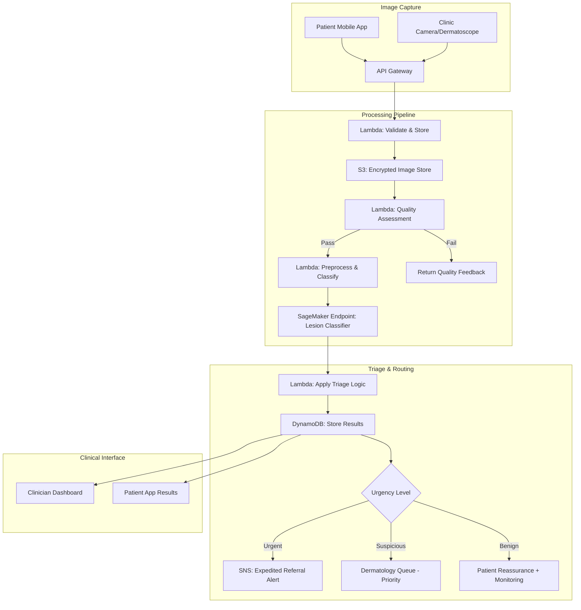

# Recipe 9.4: Dermatology Lesion Triage ⭐⭐

**Complexity:** Medium · **Phase:** Pilot · **Estimated Cost:** ~$0.02–$0.05 per image

---

## The Problem

There are roughly 3.5 billion people on Earth with access to a smartphone camera but not to a dermatologist. In the United States alone, the average wait time for a dermatology appointment is over 30 days. In rural areas, it can stretch to 90 days or more. In many developing countries, there are fewer than one dermatologist per million people.

Meanwhile, skin cancer is the most common cancer worldwide. Melanoma, the deadliest form, has a five-year survival rate above 99% when caught early (stage I) and below 30% when caught late (stage IV). The difference between those outcomes is often a few months of delay. A suspicious mole that gets triaged quickly gets biopsied quickly. One that sits in a referral queue for three months might progress from "watch and wait" to "we need to talk about treatment options."

Here's the workflow today in most primary care settings: a patient shows their PCP a spot they're worried about. The PCP, who received maybe two weeks of dermatology training in medical school, makes a judgment call. Refer or don't refer. If they refer, the patient joins the queue. If they don't, they hope they were right. Studies suggest PCPs have a diagnostic accuracy of roughly 50-60% for pigmented lesions. That's not great when the stakes are "is this cancer."

Now imagine a different workflow: the patient (or their PCP) takes a standardized photo of the lesion. An AI system analyzes it and returns a triage recommendation within seconds: benign (routine follow-up), suspicious (schedule dermatology within 2 weeks), or urgent (expedite referral). The dermatologist still makes the final diagnosis. But the AI ensures that the urgent cases jump the queue, and the clearly benign cases don't clog it.

This is triage, not diagnosis. That distinction matters enormously for regulatory strategy, clinical adoption, and system design. You're not replacing the dermatologist. You're helping the system route patients to the dermatologist faster when it matters.

---

## The Technology: How Computers Classify Skin Lesions

### What the Model Actually Sees

A skin lesion classification model is, at its core, a pattern recognition system trained on dermoscopic and clinical photographs. It learns to distinguish visual features that correlate with different diagnostic categories.

The features that matter for dermatologists (and that models learn to detect) include:

**Asymmetry.** Malignant lesions tend to be asymmetric. If you fold the lesion in half along any axis, the two halves don't match. Benign lesions (like common moles) tend to be roughly symmetric.

**Border irregularity.** Melanomas often have ragged, notched, or blurred borders. Benign lesions tend to have smooth, well-defined edges. The model learns to detect boundary characteristics at multiple scales.

**Color variation.** A benign mole is usually one or two shades of brown. Melanomas can contain multiple colors: brown, black, red, white, blue. The presence of multiple colors within a single lesion is a red flag. Models learn color distribution patterns across the lesion area.

**Dermoscopic structures.** Under dermoscopy (a magnified, polarized-light view of the skin), lesions reveal structures invisible to the naked eye: pigment networks, globules, streaks, blue-white veils, regression structures. Each structure type has diagnostic significance. Models trained on dermoscopic images learn these patterns directly.

**Diameter and evolution.** Larger lesions and those that change over time are more concerning. A single photograph can capture diameter (with a reference marker), but evolution requires longitudinal comparison, which is a harder problem.

### The Classification Taxonomy

Most dermatology AI systems classify lesions into categories aligned with clinical decision-making:

**Benign.** Common nevi (moles), seborrheic keratoses, dermatofibromas, hemangiomas. No action needed beyond routine monitoring.

**Suspicious / Atypical.** Dysplastic nevi, lesions with some but not all concerning features. Warrants dermatology evaluation within a reasonable timeframe (weeks, not days).

**Malignant / Urgent.** Melanoma, basal cell carcinoma, squamous cell carcinoma, or lesions with high-confidence malignant features. Needs expedited referral and likely biopsy.

For a triage system, you don't need to distinguish between specific benign subtypes or specific malignant subtypes. You need to reliably separate "needs urgent attention" from "can wait" from "probably fine." This is a much more tractable problem than full differential diagnosis.

### Convolutional Neural Networks for Image Classification

The workhorse technology here is the convolutional neural network (CNN), specifically architectures designed for image classification. Let me explain what's happening under the hood without getting lost in the math.

A CNN processes an image through a series of layers. Early layers detect simple features: edges, color gradients, texture patterns. Middle layers combine those into more complex features: circular shapes, color transitions, structural patterns. Late layers combine those into high-level concepts: "this looks like a pigment network" or "this border is irregular."

The final layer outputs a probability distribution across your classification categories. For a three-class triage system: P(benign) = 0.85, P(suspicious) = 0.12, P(urgent) = 0.03. You then apply decision thresholds to convert these probabilities into a triage recommendation.

The architectures that work well for this task include:

**EfficientNet.** Good accuracy-to-compute ratio. The B0 through B4 variants offer a tradeoff between speed and accuracy. B3 or B4 are common choices for dermatology.

**ResNet.** The classic residual network. ResNet-50 or ResNet-101 provide strong baselines. Well-understood, well-supported across frameworks.

**Vision Transformers (ViT).** Newer architecture that processes images as sequences of patches. Can capture long-range spatial relationships better than CNNs. Requires more training data but achieves state-of-the-art results on large dermatology datasets.

Transfer learning is essential here. You start with a model pre-trained on millions of general images (ImageNet), then fine-tune it on your dermatology dataset. This dramatically reduces the amount of labeled dermatology data you need (thousands of images rather than millions).

### The Skin Tone Problem (This Is Critical)

Here's where most dermatology AI discussions get uncomfortable, and where you absolutely cannot cut corners.

The vast majority of dermatology training data comes from fair-skinned populations. The ISIC Archive (the largest public dermoscopy dataset), the HAM10000 dataset, and most published dermatology atlases are overwhelmingly composed of images from Fitzpatrick skin types I-III (light skin). Fitzpatrick types IV-VI (darker skin) are dramatically underrepresented.

This creates a real and measurable bias: models trained primarily on light skin perform worse on dark skin. Lesion borders are harder to detect against darker backgrounds. Color features that signal malignancy on light skin may present differently on dark skin. Dermoscopic structures can appear different depending on the surrounding pigmentation.

The consequences are not hypothetical. A triage system that works well for light-skinned patients but poorly for dark-skinned patients will either miss urgent cases in darker-skinned populations (dangerous) or over-refer them (wasteful and erosive of trust).

What you must do:

1. **Audit your training data** for skin tone distribution. If it's skewed (it probably is), you need to actively acquire or synthesize more diverse data.
2. **Stratify your evaluation metrics** by Fitzpatrick skin type. Report sensitivity and specificity separately for each skin type group. If performance drops for types IV-VI, you have a problem to fix before deployment.
3. **Include skin tone as a metadata field** in your pipeline so you can monitor performance disparities in production.
4. **Be transparent** with clinicians about known limitations. If your model hasn't been validated on darker skin tones, say so explicitly.

This isn't just an ethical consideration. It's a clinical safety requirement and, increasingly, a regulatory expectation.

### Image Quality: The Patient-Submitted Photo Problem

Clinical dermatology AI research typically uses high-quality dermoscopic images taken by trained professionals with specialized equipment. Real-world triage systems often need to handle patient-submitted smartphone photos. The gap between these two scenarios is enormous.

Patient-submitted photos suffer from:

**Inconsistent lighting.** Fluorescent bathroom lights, outdoor sunlight, dim bedroom lamps. Each creates different color casts that can confuse a model trained on standardized lighting.

**Variable distance and angle.** Too close (blurry), too far (lesion is tiny in the frame), oblique angles (distorted shape).

**No dermoscopy.** Smartphone cameras capture the surface appearance only. The subsurface structures visible under dermoscopy are invisible. This fundamentally limits what the model can detect.

**Distracting backgrounds.** Hair, clothing, other skin features, tattoos, jewelry.

**Compression artifacts.** Messaging apps compress images aggressively. JPEG artifacts can mimic or obscure lesion features.

Your system needs either: (a) a quality gate that rejects unusable images with specific feedback ("please retake with better lighting"), or (b) a model robust enough to handle variable quality, or (c) both. Option (c) is the right answer.

### Regulatory Landscape

In the United States, a dermatology lesion classification system is a medical device regulated by the FDA. The regulatory pathway depends on what claims you make:

**Triage / prioritization (lower risk).** If you're only reordering a worklist (flagging cases for faster review, not making diagnostic claims), you may qualify for a De Novo or 510(k) pathway. Several products have received clearance for this use case.

**Diagnostic aid (higher risk).** If you're telling patients or clinicians "this is likely melanoma," that's a diagnostic claim requiring more rigorous clinical validation.

**Clinical decision support (potentially exempt).** If the system presents information that a clinician must independently evaluate (and the methodology is transparent), it may qualify as a Clinical Decision Support exemption under 21st Century Cures Act criteria. But the boundaries here are actively being litigated.

For this recipe, we're building a triage system: routing patients to appropriate care levels. This is the most defensible regulatory position and the most clinically useful starting point.

### General Architecture Pattern

```
[Image Capture] → [Quality Check] → [Preprocessing] → [Classification] → [Triage Decision] → [Clinical Routing]
```

**Image Capture.** A standardized photo is taken, either by the patient via a mobile app, by a PCP using a clinic camera, or by a medical assistant using a dermatoscope attachment. Metadata is captured: body location, patient demographics (including skin type), device information.

**Quality Check.** The image is assessed for minimum quality thresholds: resolution, focus, lighting, framing. Images that fail get specific feedback for retake. This prevents garbage-in-garbage-out.

**Preprocessing.** The image is normalized: resized to model input dimensions, color-normalized to reduce lighting variation, cropped to the lesion region (either manually annotated or auto-detected). Hair and artifact removal may be applied.

**Classification.** The preprocessed image is fed through the trained model. Output: probability scores across triage categories, plus a confidence score indicating how certain the model is about its prediction.

**Triage Decision.** Business logic converts model outputs into clinical recommendations. This includes confidence thresholds (if the model isn't confident enough, escalate to human review), override rules (certain body locations or patient histories always get escalated), and documentation of the reasoning.

**Clinical Routing.** The triage recommendation is delivered to the appropriate recipient: the referring PCP, the patient, or the dermatology scheduling system. Urgent cases trigger expedited referral workflows. Benign cases get reassurance plus monitoring recommendations.

---

## The AWS Implementation

### Why These Services

**Amazon SageMaker for model training and hosting.** You need to train a custom image classification model on your dermatology dataset (transfer learning from a pre-trained backbone), then host it for real-time inference. SageMaker provides the full lifecycle: training jobs with GPU instances, model registry for versioning, real-time endpoints with auto-scaling. For a triage system handling patient-submitted photos, you need low-latency inference (under 2 seconds for good UX) and the ability to scale with demand. SageMaker endpoints with auto-scaling policies handle this well.

**Amazon S3 for image storage.** All lesion images are stored in S3 with SSE-KMS encryption. S3 provides the durable, HIPAA-eligible storage layer. Images are organized by patient ID and submission date. Lifecycle policies can move older images to S3 Glacier for cost optimization while maintaining the required retention period.

**AWS Lambda for orchestration and preprocessing.** Lambda handles the event-driven workflow: image arrives in S3, Lambda triggers quality assessment, preprocessing, and inference orchestration. For image preprocessing (resize, normalize, crop), Lambda's compute is sufficient for single images. The 10 GB memory limit accommodates even large clinical photographs.

**Amazon DynamoDB for triage results and metadata.** Each triage assessment produces structured results (scores, recommendations, metadata) that need fast read/write access. DynamoDB provides single-digit millisecond latency for storing and retrieving triage records. The patient-facing app queries DynamoDB for results. Clinician dashboards query it for worklist prioritization.

**Amazon Rekognition Custom Labels (alternative path).** If you want to avoid managing your own model training infrastructure, Rekognition Custom Labels lets you train an image classifier by uploading labeled images through a console interface. The tradeoff: less control over architecture and hyperparameters, but dramatically simpler operations. For a pilot or MVP, this can get you to clinical validation faster. For production at scale with specific performance requirements, SageMaker gives you more control.

**Amazon API Gateway for the mobile/web interface.** The patient-facing app and clinician portal communicate with the backend through API Gateway. It handles authentication, rate limiting, and request routing. Combined with Lambda, it provides a serverless API layer.

**Amazon SNS for clinical notifications.** When a lesion is triaged as urgent, SNS delivers notifications to the appropriate clinical team: the referring provider, the dermatology triage nurse, or the scheduling system. Different notification channels (SMS, email, push notification) for different urgency levels.

### Architecture Diagram



### Prerequisites

| Requirement | Details |
|-------------|---------|
| AWS Services | SageMaker, S3, Lambda, DynamoDB, API Gateway, SNS, CloudWatch, IAM |
| IAM Permissions | `sagemaker:InvokeEndpoint`, `s3:GetObject`, `s3:PutObject`, `dynamodb:PutItem`, `dynamodb:GetItem`, `sns:Publish`, `lambda:InvokeFunction` |
| BAA | Required. All services handling PHI must be covered under AWS BAA. |
| Encryption | S3 SSE-KMS for images, DynamoDB encryption at rest, TLS 1.2+ in transit |
| VPC | SageMaker endpoint in VPC with no internet access. Lambda in VPC with VPC endpoints for S3, DynamoDB, SageMaker Runtime. |
| CloudTrail | Enabled for all API calls. Critical for audit trail on triage decisions. |
| Training Data | Minimum 5,000-10,000 labeled dermoscopy/clinical images across triage categories. Must include diverse skin tones. Consider ISIC Archive as a starting point, supplemented with institution-specific data. |
| Cost Estimate | ~$0.02-$0.05 per inference (SageMaker endpoint). ~$200-500/month baseline for a pilot (endpoint + storage + compute). Training: ~$50-200 per training run on ml.p3.2xlarge. |

### Ingredients

| AWS Service | Role in This Recipe |
|-------------|-------------------|
| Amazon SageMaker | Train lesion classification model (transfer learning). Host real-time inference endpoint. Model registry for version management. |
| Amazon S3 | Store patient-submitted images (encrypted). Store training datasets. Store model artifacts. |
| AWS Lambda | Orchestrate pipeline: quality check, preprocessing, inference invocation, result storage. |
| Amazon DynamoDB | Store triage results, patient metadata, assessment history. Fast lookups for clinician dashboard. |
| Amazon API Gateway | REST API for mobile app and clinician portal. Authentication via Cognito. |
| Amazon SNS | Urgent case notifications to clinical staff. Configurable by urgency level. |
| Amazon CloudWatch | Monitor inference latency, error rates, model confidence distributions. Alert on performance degradation. |
| AWS KMS | Manage encryption keys for PHI at rest and in transit. |

### Code (Pseudocode Walkthrough)

#### Step 1: Receive and Validate the Image Submission

When a patient or clinician submits a lesion photo, the system needs to validate the submission before doing anything else. This means checking that the image is actually an image (not a PDF or a text file), that it meets minimum resolution requirements, and that the required metadata is present.

If you skip this step, you'll end up running expensive inference on garbage inputs and returning meaningless results.

```
FUNCTION receive_submission(image_file, metadata):
    // Validate the image format (JPEG or PNG only for clinical photos)
    IF image_file.format NOT IN ["JPEG", "PNG"]:
        RETURN error("Unsupported image format. Please submit JPEG or PNG.")

    // Check minimum resolution (lesion needs enough pixels for meaningful analysis)
    IF image_file.width < 640 OR image_file.height < 640:
        RETURN error("Image resolution too low. Minimum 640x640 pixels.")

    // Validate required metadata
    required_fields = ["patient_id", "body_location", "submission_source"]
    FOR EACH field IN required_fields:
        IF field NOT IN metadata:
            RETURN error("Missing required field: " + field)

    // Generate unique assessment ID
    assessment_id = generate_uuid()

    // Store image in S3 with encryption
    s3_key = "submissions/{patient_id}/{date}/{assessment_id}.jpg"
    UPLOAD image_file TO s3_bucket AT s3_key WITH encryption="aws:kms"

    // Store initial metadata in DynamoDB
    STORE TO assessments_table:
        assessment_id: assessment_id
        patient_id: metadata.patient_id
        body_location: metadata.body_location
        submission_time: current_timestamp()
        status: "RECEIVED"
        s3_key: s3_key

    RETURN assessment_id
```

#### Step 2: Assess Image Quality

This is the gate that prevents bad images from reaching the model. A blurry, poorly lit, or improperly framed photo will produce unreliable classification results. Better to reject early and ask for a retake than to return a low-confidence triage recommendation.

```
FUNCTION assess_image_quality(s3_key, assessment_id):
    // Download image from S3
    image = DOWNLOAD FROM s3_bucket AT s3_key

    // Check focus/sharpness using Laplacian variance
    // Higher variance = sharper image. Threshold calibrated for smartphone photos.
    sharpness_score = compute_laplacian_variance(image)
    IF sharpness_score < SHARPNESS_THRESHOLD:
        UPDATE assessments_table SET status = "QUALITY_FAILED",
            quality_feedback = "Image is too blurry. Hold camera steady and tap to focus."
        RETURN "FAIL"

    // Check lighting adequacy
    // Analyze histogram: too dark or too bright means poor lighting
    brightness = compute_mean_brightness(image)
    IF brightness < MIN_BRIGHTNESS OR brightness > MAX_BRIGHTNESS:
        UPDATE assessments_table SET status = "QUALITY_FAILED",
            quality_feedback = "Lighting is inadequate. Move to a well-lit area without direct glare."
        RETURN "FAIL"

    // Check that a lesion-like region is detectable
    // Use a simple segmentation or saliency detection to find the ROI
    roi_detected = detect_lesion_region(image)
    IF NOT roi_detected:
        UPDATE assessments_table SET status = "QUALITY_FAILED",
            quality_feedback = "Cannot identify lesion in image. Center the lesion in the frame."
        RETURN "FAIL"

    // Check for excessive compression artifacts
    artifact_score = estimate_jpeg_quality(image)
    IF artifact_score < MIN_QUALITY_SCORE:
        UPDATE assessments_table SET status = "QUALITY_FAILED",
            quality_feedback = "Image quality too low. Use original photo, not a screenshot or forwarded image."
        RETURN "FAIL"

    UPDATE assessments_table SET status = "QUALITY_PASSED",
        quality_scores = {sharpness: sharpness_score, brightness: brightness, artifact: artifact_score}

    RETURN "PASS"
```

#### Step 3: Preprocess the Image for Model Input

The classification model expects a specific input format: fixed dimensions, normalized pixel values, and ideally a cropped view centered on the lesion. This step transforms the raw patient photo into something the model can work with.

```
FUNCTION preprocess_for_classification(s3_key):
    image = DOWNLOAD FROM s3_bucket AT s3_key

    // Detect and crop to lesion region with padding
    // The model performs better on cropped lesion images than full-frame photos
    lesion_bbox = detect_lesion_bounding_box(image)
    padding = 0.2  // 20% padding around the lesion for context
    cropped = crop_with_padding(image, lesion_bbox, padding)

    // Resize to model input dimensions (typically 224x224 or 299x299)
    resized = resize(cropped, target_size=(299, 299))

    // Color normalization to reduce lighting variation
    // Subtract ImageNet mean, divide by ImageNet std (standard for transfer learning)
    normalized = normalize_colors(resized,
        mean=[0.485, 0.456, 0.406],
        std=[0.229, 0.224, 0.225])

    // Optional: hair removal for dermoscopic images
    // (Skip for clinical photos where hair removal can introduce artifacts)
    IF image_metadata.source == "dermoscope":
        normalized = remove_hair_artifacts(normalized)

    RETURN normalized
```

#### Step 4: Run Classification Inference

Send the preprocessed image to the trained model and get back probability scores for each triage category. The model outputs raw probabilities; the triage decision logic comes in the next step.

```
FUNCTION classify_lesion(preprocessed_image, assessment_id):
    // Invoke SageMaker endpoint with the preprocessed image
    // The endpoint hosts our fine-tuned EfficientNet-B3 model
    response = INVOKE sagemaker_endpoint(
        endpoint_name = "dermatology-triage-v2",
        content_type = "application/x-image",
        body = serialize_image(preprocessed_image)
    )

    // Parse model output: probabilities for each class
    predictions = parse_response(response)
    // Expected format:
    // {
    //   "benign": 0.82,
    //   "suspicious": 0.14,
    //   "urgent": 0.04,
    //   "model_version": "v2.3.1",
    //   "inference_time_ms": 145
    // }

    // Store raw predictions (important for audit trail and model monitoring)
    UPDATE assessments_table SET
        raw_predictions = predictions,
        model_version = predictions.model_version,
        inference_time_ms = predictions.inference_time_ms

    RETURN predictions
```

#### Step 5: Apply Triage Decision Logic

This is where clinical judgment meets model output. Raw probabilities are converted into actionable triage recommendations using configurable thresholds. The thresholds are intentionally conservative: when in doubt, escalate.

```
FUNCTION apply_triage_logic(predictions, patient_metadata, assessment_id):
    // Confidence check: if the model isn't confident, escalate to human review
    max_probability = MAX(predictions.benign, predictions.suspicious, predictions.urgent)
    IF max_probability < CONFIDENCE_THRESHOLD:  // e.g., 0.70
        triage_result = "HUMAN_REVIEW"
        reason = "Model confidence below threshold. Requires dermatologist review."
        GOTO store_result

    // Apply classification thresholds
    // Note: thresholds are asymmetric. We're more aggressive about catching urgent cases.
    IF predictions.urgent > URGENT_THRESHOLD:  // e.g., 0.15 (intentionally low)
        triage_result = "URGENT"
        reason = "High probability of malignant features detected."
    ELSE IF predictions.suspicious > SUSPICIOUS_THRESHOLD:  // e.g., 0.30
        triage_result = "SUSPICIOUS"
        reason = "Atypical features detected. Dermatology evaluation recommended."
    ELSE IF predictions.benign > BENIGN_THRESHOLD:  // e.g., 0.80 (intentionally high)
        triage_result = "BENIGN"
        reason = "No concerning features detected. Routine monitoring recommended."
    ELSE:
        triage_result = "HUMAN_REVIEW"
        reason = "Prediction does not meet any threshold with sufficient confidence."

    // Override rules based on clinical context
    // Certain situations always escalate regardless of model output
    IF patient_metadata.history_of_melanoma == TRUE:
        IF triage_result == "BENIGN":
            triage_result = "SUSPICIOUS"
            reason = reason + " Escalated due to personal history of melanoma."

    IF patient_metadata.body_location IN ["scalp", "sole", "nail_bed", "mucous_membrane"]:
        IF triage_result == "BENIGN":
            triage_result = "SUSPICIOUS"
            reason = reason + " Escalated due to high-risk anatomical location."

    // Store the triage result
    store_result:
    UPDATE assessments_table SET
        triage_result = triage_result,
        triage_reason = reason,
        triage_timestamp = current_timestamp(),
        status = "TRIAGED"

    RETURN {result: triage_result, reason: reason}
```

#### Step 6: Route Based on Triage Result

The final step delivers the triage recommendation to the right people through the right channels. Urgent cases need immediate attention. Suspicious cases need timely scheduling. Benign cases need patient communication.

```
FUNCTION route_triage_result(assessment_id, triage_result, patient_metadata):
    IF triage_result == "URGENT":
        // Notify dermatology triage nurse immediately
        PUBLISH TO sns_topic "urgent-dermatology-referral":
            message = format_urgent_alert(assessment_id, patient_metadata)
            attributes = {urgency: "HIGH", channel: "SMS_AND_EMAIL"}

        // Create expedited referral in scheduling system
        CREATE referral:
            priority = "URGENT"
            target_specialty = "Dermatology"
            target_timeframe = "48 hours"
            assessment_id = assessment_id

        // Notify referring provider
        PUBLISH TO sns_topic "provider-notifications":
            message = "Urgent dermatology referral created for patient {patient_id}. Lesion triage: URGENT."

    ELSE IF triage_result == "SUSPICIOUS":
        // Add to dermatology scheduling queue with priority
        CREATE referral:
            priority = "PRIORITY"
            target_specialty = "Dermatology"
            target_timeframe = "14 days"
            assessment_id = assessment_id

        // Notify referring provider
        PUBLISH TO sns_topic "provider-notifications":
            message = "Priority dermatology referral created for patient {patient_id}. Lesion triage: SUSPICIOUS."

    ELSE IF triage_result == "BENIGN":
        // Send patient reassurance with monitoring guidance
        SEND patient_notification:
            message = "Your skin assessment indicates no immediate concerns. " +
                      "Continue monitoring for changes in size, shape, or color. " +
                      "Follow up with your provider if you notice any changes."
            include_monitoring_instructions = TRUE

    ELSE IF triage_result == "HUMAN_REVIEW":
        // Route to dermatology triage nurse for manual review
        ADD TO review_queue:
            assessment_id = assessment_id
            priority = "STANDARD"
            reason = "Automated triage inconclusive. Manual review required."

    // Log the routing action for audit
    UPDATE assessments_table SET
        routing_action = triage_result,
        routing_timestamp = current_timestamp(),
        status = "ROUTED"
```

> **Curious how this looks in Python?** The pseudocode above covers the concepts. If you'd like to see sample Python code that demonstrates these patterns using boto3, check out the [Python Example](chapter09.04-python-example). It walks through each step with inline comments and notes on what you'd need to change for a real deployment.

---

### Expected Results

**Sample Output (JSON)**

```json
{
  "assessment_id": "a1b2c3d4-e5f6-7890-abcd-ef1234567890",
  "patient_id": "P-98765",
  "submission_time": "2026-03-15T14:32:00Z",
  "image_quality": {
    "status": "PASSED",
    "sharpness_score": 142.7,
    "brightness_score": 0.58,
    "artifact_score": 0.91
  },
  "classification": {
    "benign": 0.12,
    "suspicious": 0.71,
    "urgent": 0.17,
    "model_version": "v2.3.1",
    "inference_time_ms": 187
  },
  "triage_result": {
    "recommendation": "SUSPICIOUS",
    "reason": "Atypical features detected. Dermatology evaluation recommended.",
    "confidence": 0.71,
    "override_applied": false
  },
  "routing": {
    "action": "PRIORITY_REFERRAL",
    "target_specialty": "Dermatology",
    "target_timeframe": "14 days",
    "provider_notified": true
  }
}
```

**Performance Benchmarks**

| Metric | Target | Notes |
|--------|--------|-------|
| Sensitivity (urgent) | > 95% | Must catch nearly all malignancies. False negatives here are dangerous. |
| Specificity (urgent) | > 70% | Some over-referral is acceptable for safety. |
| Sensitivity (suspicious) | > 85% | Catch most atypical lesions. |
| Specificity (benign) | > 80% | Don't flood dermatology with clearly benign cases. |
| Inference latency | < 2 seconds | End-to-end from submission to result. |
| Quality gate rejection rate | 15-25% | Expect a significant fraction of patient photos to need retake. |
| Confidence threshold catch rate | 10-15% | Fraction routed to human review due to low confidence. |

**Where It Struggles**

- Amelanotic melanomas (melanomas without pigment). These look benign to both humans and models. The model will miss some of these.
- Lesions on dark skin with limited training data representation. Performance degrades for underrepresented populations.
- Very small lesions (< 5mm) in low-resolution smartphone photos. Not enough pixel information for reliable classification.
- Lesions partially obscured by hair, especially on the scalp.
- Seborrheic keratoses that mimic melanoma (the "ugly duckling" problem). These fool dermatologists too.
- Lesions at anatomical junctions (nail bed, mucous membranes) where appearance differs from typical skin.

---

## The Honest Take

Here's what I'd tell you over coffee about deploying dermatology AI for triage:

**The skin tone bias problem is not solved.** Every team I've seen deploy this underestimates how much work equitable performance requires. You will launch with a model that works better on light skin. The question is whether you acknowledge that limitation transparently and actively work to close the gap, or whether you pretend it doesn't exist. The former is defensible. The latter will eventually become a headline.

**Patient-submitted photos are way worse than you think.** Research papers report accuracy on curated dermoscopic datasets. Your production system will receive blurry bathroom selfies taken at arm's length under yellow incandescent lighting. The gap between research accuracy and real-world accuracy is 15-25 percentage points. Plan for it.

**The quality gate is your most important feature.** Counterintuitively, the image quality assessment (Step 2) matters more than the classification model (Step 4). A great model on a bad image gives a bad result. A mediocre model on a good image gives a useful result. Invest heavily in the quality gate and the user experience around retakes.

**Threshold tuning is a clinical decision, not an engineering decision.** Where you set the urgent threshold determines how many patients get expedited referrals. Too sensitive: you overwhelm dermatology with false alarms. Too specific: you miss cancers. This decision belongs to your clinical advisory board, not your ML team. Give them a tool to adjust thresholds and show them the tradeoff curves.

**Regulatory strategy determines your timeline.** If you position this as "clinical decision support that a provider must independently evaluate," you may avoid the full FDA clearance process. If you position it as "automated triage that directly routes patients," you're in medical device territory. The technology is the same. The regulatory framing changes your timeline by 12-24 months.

**Longitudinal tracking is the killer feature nobody builds first.** A single photo assessment is useful. Comparing today's photo to one from three months ago and detecting change is transformative. But it requires solving image registration (aligning two photos of the same lesion taken at different times, angles, and lighting conditions). This is hard. Build the single-assessment system first, but architect it to support longitudinal comparison later.

---

## Variations and Extensions

### Variation 1: Dermoscopy Attachment Integration

Instead of relying on standard smartphone photos, integrate with clip-on dermoscopy attachments (devices that attach to a smartphone and provide magnified, polarized-light imaging). This dramatically improves image quality and gives the model access to subsurface structures.

The architecture change is minimal: add a metadata field for image source type, and train a separate model (or a multi-input model) that expects dermoscopic features. The clinical value increase is substantial: dermoscopic images enable detection of features invisible in clinical photos, pushing sensitivity for melanoma above 90%.

The tradeoff: you now require patients or clinicians to own a $30-200 attachment. This limits the "anyone with a smartphone" accessibility story but significantly improves clinical utility.

### Variation 2: Longitudinal Change Detection

Build a comparison engine that registers a new lesion photo against a previous photo of the same lesion and quantifies change. Key metrics: area change, color change, border irregularity change, asymmetry change.

This requires: (a) a lesion identity system (matching "this is the same mole I photographed three months ago"), (b) image registration (aligning two photos despite different angles, lighting, and distances), and (c) change quantification that's robust to imaging variation.

The clinical value is enormous. A lesion that's growing or changing color is far more concerning than a static one, regardless of its current appearance. Dermatologists use the "evolution" criterion heavily. Giving the AI access to temporal information makes it much more useful.

### Variation 3: Multi-Lesion Body Mapping

Instead of assessing individual lesions in isolation, build a full-body mapping system. The patient photographs their entire body (guided by the app), and the system catalogs every visible lesion, tracks them over time, and flags any that change.

This is the "total body photography" concept digitized and automated. It's particularly valuable for high-risk patients (personal or family history of melanoma, many atypical moles, immunosuppression). The technical challenges include: consistent body positioning across sessions, lesion detection and segmentation across the full body, and matching lesions across time points despite body position changes.

---

## Related Recipes

- **Recipe 9.1: Image Quality Assessment** — The quality gate in this recipe uses the same techniques. Recipe 9.1 covers the quality assessment approach in depth.
- **Recipe 9.3: Wound Photography Measurement** — Shares the challenge of standardizing patient-submitted clinical photos and extracting measurements from variable-quality images.
- **Recipe 9.5: Chest X-Ray Triage** — Another triage (not diagnosis) use case with similar regulatory positioning and clinical workflow integration patterns.
- **Recipe 9.6: Diabetic Retinopathy Screening** — A more regulated diagnostic screening use case that shows the next level of complexity beyond triage.
- **Recipe 7.3: Disease Progression Risk** — Predictive analytics for identifying patients at risk, which complements triage by identifying who should be screened more frequently.

---

## Additional Resources

### AWS Documentation

- Amazon SageMaker Image Classification: https://docs.aws.amazon.com/sagemaker/latest/dg/image-classification.html
- SageMaker Real-Time Inference: https://docs.aws.amazon.com/sagemaker/latest/dg/realtime-endpoints.html
- Amazon S3 Encryption: https://docs.aws.amazon.com/AmazonS3/latest/userguide/UsingEncryption.html
- AWS Lambda with Container Images: https://docs.aws.amazon.com/lambda/latest/dg/images-create.html
- Amazon DynamoDB Developer Guide: https://docs.aws.amazon.com/amazondynamodb/latest/developerguide/
- AWS HIPAA Eligible Services: https://aws.amazon.com/compliance/hipaa-eligible-services-reference/

### Industry References

- ISIC Archive (International Skin Imaging Collaboration): https://www.isic-archive.com/ — The largest public collection of dermoscopic images with diagnostic labels. Essential for training data.
- Fitzpatrick 17k Dataset: A dataset specifically designed to address skin tone diversity in dermatology AI. <!-- TODO: Verify current URL for this dataset -->
- FDA Digital Health Center of Excellence: https://www.fda.gov/medical-devices/digital-health-center-excellence — Regulatory guidance for AI/ML-based medical devices.

### AWS Solutions and Blogs

- AWS for Health: https://aws.amazon.com/health/ — Overview of AWS healthcare solutions including HIPAA compliance guidance.
- Amazon SageMaker for Healthcare: https://aws.amazon.com/sagemaker/healthcare/ — Healthcare-specific ML patterns on SageMaker.

---

## Estimated Implementation Time

| Phase | Duration | What You Get |
|-------|----------|-------------|
| Basic (MVP) | 8-12 weeks | Single model trained on public data, quality gate, basic triage logic, clinician dashboard. Not production-ready but sufficient for clinical validation study. |
| Production-ready | 16-24 weeks | Custom model trained on institutional data, full quality pipeline, EHR integration, notification routing, monitoring dashboards, regulatory documentation. |
| With variations | 24-36 weeks | Dermoscopy integration, longitudinal tracking, multi-lesion mapping, patient-facing app with guided capture. |

---

## Tags

`computer-vision` `dermatology` `triage` `image-classification` `skin-cancer` `transfer-learning` `cnn` `patient-safety` `health-equity` `fda-regulated` `sagemaker` `mobile-health`

---

| [← 9.3: Wound Photography Measurement](chapter09.03-wound-photography-measurement) | [Chapter 9 Index](chapter09-index) | [9.5: Chest X-Ray Triage →](chapter09.05-chest-xray-triage) |
|:---|:---:|---:|
