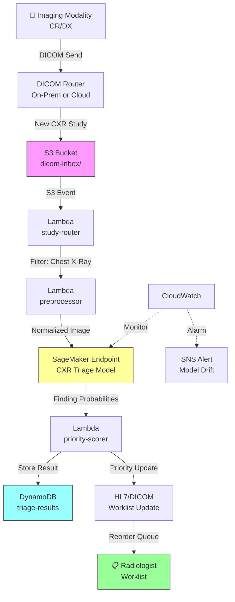

# Recipe 9.5 Architecture and Implementation: Chest X-Ray Triage

*Companion to [Recipe 9.5: Chest X-Ray Triage](chapter09.05-chest-xray-triage). This page covers the AWS architecture, services, prerequisites, and pseudocode. For the problem framing and the conceptual approach, start with the main recipe.*

---

## The AWS Implementation

### Why These Services

**Amazon SageMaker for model hosting and inference.** SageMaker provides managed endpoints for real-time inference with auto-scaling. For a chest X-ray triage model, you need GPU-backed inference (CNNs are computationally intensive on CPU alone), consistent sub-5-second latency, and the ability to scale with imaging volume. SageMaker real-time endpoints with GPU instances (ml.g4dn or ml.g5 family) deliver this. SageMaker also handles model versioning, A/B testing for model updates, and monitoring for data drift. For a regulated medical device, you need all three.

**A note on FDA-regulated model updates:** If your triage system is classified as a medical device, model updates (retraining, architecture changes, threshold adjustments) must go through a predetermined change control plan (PCCP) or require a new regulatory submission. SageMaker Model Registry supports an approval chain (Pending/Approved/Rejected statuses, audit trail of who approved what and when), but it does not replace the regulatory process. Your QMS must define which model changes are covered by the PCCP and which require a new 510(k). SageMaker Model Packages also support SHA-256 integrity verification of model artifacts, which satisfies the artifact traceability requirements in your QMS documentation.

**Amazon S3 for DICOM storage and model artifacts.** Incoming DICOM files need a durable, encrypted landing zone before and after processing. S3 with SSE-KMS encryption provides this. Model artifacts (the trained weights) also live in S3 and are loaded by SageMaker at endpoint startup.

**AWS Lambda for orchestration and lightweight processing.** The workflow coordination (receive notification of new study, validate metadata, trigger preprocessing, call inference endpoint, format results, send worklist update) is a series of short-lived, stateless operations. Lambda handles this without persistent infrastructure. For DICOM metadata parsing and routing decisions, Lambda is the right weight class.

**Amazon DynamoDB for result tracking and audit.** Every inference result needs to be stored: what study was analyzed, what findings were detected, what priority was assigned, and when. DynamoDB provides fast writes, point lookups by study ID, and encryption at rest. The audit trail is critical for both HIPAA compliance and FDA post-market surveillance requirements.

**Amazon CloudWatch for monitoring and alerting.** Model performance monitoring (inference latency, error rates, confidence score distributions) feeds into CloudWatch metrics and alarms. A sudden shift in the distribution of confidence scores can indicate data drift (new equipment, changed protocols) that degrades model accuracy. You want to catch this before clinicians notice.

**AWS HealthImaging (optional) for DICOM management.** AWS HealthImaging is a purpose-built service for storing, accessing, and analyzing medical images at scale. If you're building the full imaging pipeline on AWS (not just the AI triage layer), HealthImaging provides DICOM-native storage with sub-second image retrieval, which simplifies the DICOM handling that would otherwise require custom code.

### Fallback Behavior and Graceful Degradation

The system must never block a study from being read because the AI is down. If the SageMaker endpoint is unavailable (deployment in progress, scaling event, transient failure), the pipeline should degrade gracefully to pre-AI FIFO ordering.

**Inference failure handling:** If the SageMaker InvokeEndpoint call fails after retries (3 attempts with exponential backoff), the study-router Lambda marks the study as "triage-unavailable" in DynamoDB and allows it to proceed through the worklist at normal priority. The study is not lost; it simply skips AI prioritization. An immediate CloudWatch alarm fires so the operations team knows the model is degraded.

**SQS buffer for resilience:** Place an SQS queue between the study-router and the inference-caller Lambda. This decouples ingestion from inference. If the endpoint is temporarily unavailable, messages accumulate in the queue and are retried automatically when the endpoint recovers. Configure a visibility timeout of 60 seconds and a maximum receive count of 3 before sending to the Dead Letter Queue.

**Dead Letter Queue (DLQ):** Configure a DLQ on the study-router Lambda (and the inference-caller, if separate). Any study that fails triage processing after retries lands in the DLQ for investigation and reprocessing. Set a CloudWatch alarm on DLQ message count > 0. Studies that fail triage should be flagged in the worklist as "AI triage unavailable" rather than silently proceeding at normal priority, so radiologists know the AI did not evaluate that study.

**Zero-downtime model updates:** Use SageMaker blue/green deployment (via deployment guardrails) for model updates. Traffic shifts gradually from the old endpoint to the new one, with automatic rollback if error rates spike. This eliminates the "endpoint unavailable during deployment" window entirely.

### Architecture Diagram



**How DICOM data gets from on-premises to S3.** The architecture diagram starts at the S3 bucket, but in practice your imaging equipment is on-premises and the DICOM data needs a secure path to the cloud. Three common approaches:

1. **AWS Direct Connect with MACsec encryption** (preferred for production radiology AI). Provides dedicated, low-latency connectivity with consistent bandwidth. Radiology AI workloads are latency-sensitive (you want studies triaged within seconds of acquisition), and Direct Connect delivers predictable sub-10ms round-trip times that public internet cannot guarantee.
2. **Site-to-Site VPN.** Encrypted tunnel over public internet. Simpler to set up, lower cost, but latency is variable and throughput caps at ~1.25 Gbps per tunnel. Acceptable for pilot deployments or low-volume sites.
3. **DICOM gateway appliance (on-premises).** A local appliance (commercial or open-source like Orthanc) that receives DICOM from modalities, TLS-encrypts, and forwards to an S3 Transfer Acceleration endpoint. This approach works well when you cannot modify network infrastructure but need to get images flowing quickly.

For any approach, ensure that DICOM data is encrypted in transit (TLS 1.2+) and that the network path does not traverse the public internet unencrypted. Direct Connect is preferred for production because consistent latency directly impacts triage value: a study that takes 30 seconds to upload has already lost its triage window.

### Prerequisites

| Requirement | Details |
|-------------|---------|
| **AWS Services** | Amazon SageMaker, Amazon S3, AWS Lambda, Amazon DynamoDB, Amazon CloudWatch, Amazon SNS, (optional) AWS HealthImaging |
| **IAM Permissions** | Per-function least-privilege roles required. **study-router Lambda:** `s3:GetObject`, `s3:HeadObject` (on `dicom-inbox/*` prefix), `sqs:SendMessage` (to inference queue). **preprocessor Lambda:** `s3:GetObject` (on `dicom-inbox/*`), `s3:PutObject` (on `preprocessed/*` prefix). **inference-caller Lambda:** `sagemaker:InvokeEndpoint` (on the specific endpoint ARN), `s3:GetObject` (on `preprocessed/*`). **priority-scorer Lambda:** `dynamodb:PutItem`, `dynamodb:GetItem` (on `cxr-triage-results` table), `sns:Publish` (on the alert topic ARN), `cloudwatch:PutMetricData` (for confidence drift monitoring). All functions additionally need `logs:CreateLogGroup` and `logs:PutLogEvents` for CloudWatch Logs. Production deployments must use per-function IAM roles; never share a single role across all Lambdas. |
| **BAA** | AWS BAA signed (required: DICOM images are PHI) |
| **Encryption** | S3: SSE-KMS; DynamoDB: encryption at rest; SageMaker endpoint: KMS-encrypted storage volumes; all API calls over TLS |
| **VPC** | Production: Lambda and SageMaker endpoint in VPC with no internet access. Required VPC endpoints: `com.amazonaws.{region}.s3` (Gateway), `com.amazonaws.{region}.dynamodb` (Gateway), `com.amazonaws.{region}.sagemaker.runtime` (Interface), `com.amazonaws.{region}.sns` (Interface), `com.amazonaws.{region}.logs` (Interface), `com.amazonaws.{region}.monitoring` (Interface, for PutMetricData). SageMaker endpoints must be deployed with VPC-only access (no public endpoint). Validate by confirming the endpoint's `VpcConfig` is populated and that no route to an internet gateway exists from the endpoint's subnet. |
| **CloudTrail** | Enabled: log all SageMaker, S3, and DynamoDB API calls for HIPAA audit trail |
| **FDA Considerations** | If deploying as a medical device: 510(k) clearance required for triage/prioritization claims. Predicate devices exist. Quality Management System (QMS) required. Post-market surveillance plan required. |
| **Model** | Pre-trained chest X-ray classification model (e.g., DenseNet-121, EfficientNet, or custom architecture trained on CheXpert/MIMIC-CXR). Model must be validated on your institution's patient population before deployment. |
| **PACS Integration** | HL7 interface engine or DICOM worklist management capability for sending priority updates back to the reading worklist |
| **Sample Data** | NIH ChestX-ray14, CheXpert, or MIMIC-CXR for development. Never use real patient images outside of IRB-approved protocols. |
| **Cost Estimate** | SageMaker ml.g4dn.xlarge endpoint: ~$0.74/hour (~$535/month always-on). At 200 studies/day, that's ~$0.11/study for inference. S3 and DynamoDB costs negligible at this volume. |

### Ingredients

| AWS Service | Role |
|------------|------|
| **Amazon SageMaker** | Hosts the trained CNN model; provides GPU-backed real-time inference endpoint |
| **Amazon S3** | Stores incoming DICOM files and model artifacts; encrypted with KMS |
| **AWS Lambda** | Orchestrates the pipeline: routes studies, triggers preprocessing, calls inference, formats results |
| **Amazon DynamoDB** | Stores inference results, priority scores, and audit trail |
| **AWS KMS** | Manages encryption keys for S3, DynamoDB, and SageMaker volumes |
| **Amazon CloudWatch** | Metrics, logs, and alarms for inference latency, error rates, and confidence drift |
| **Amazon SNS** | Alerts operations team when model drift or errors are detected |

### Code

> **Reference implementations:** The following AWS sample repos demonstrate patterns relevant to this recipe:
>
> - [`aws-healthimaging-samples`](https://github.com/aws-samples/aws-healthimaging-samples): Working with AWS HealthImaging for DICOM storage, retrieval, and metadata access
> - [`amazon-sagemaker-examples`](https://github.com/aws/amazon-sagemaker-examples): Comprehensive SageMaker examples including real-time inference endpoint deployment and model monitoring

#### Walkthrough

**Step 1: Receive and filter DICOM studies.** When a new imaging study arrives in the S3 landing zone, the system checks whether it's a chest X-ray. Not every study needs triage. We filter using DICOM metadata: modality (CR or DX for computed/digital radiography), body part examined (CHEST), and view position (PA or AP). Non-chest studies are ignored. This filtering prevents wasted inference costs and keeps the model focused on what it was trained for. Skip this step and you'll be running knee X-rays through a chest model, burning GPU time and generating meaningless results.

```pseudocode
FUNCTION route_study(bucket, key):
    // Read DICOM metadata from the file header (not the pixel data, just the tags).
    // DICOM files contain structured metadata describing the study, patient, and acquisition.
    metadata = read DICOM tags from S3 object at bucket/key

    // Check if this study is a chest X-ray based on standard DICOM tags.
    // Modality "CR" = Computed Radiography, "DX" = Digital Radiography (both are X-ray types).
    // BodyPartExamined tells us what anatomy was imaged.
    IF metadata.Modality in ["CR", "DX"]
       AND metadata.BodyPartExamined == "CHEST":

        // This is a chest X-ray. Send it to the preprocessing pipeline.
        trigger_preprocessing(bucket, key, metadata)

    ELSE:
        // Not a chest X-ray. Log it and move on. No inference needed.
        log("Skipping non-chest study: " + key)
```

**Step 2: Preprocess the DICOM image for model input.** Raw DICOM pixel data is not ready for a neural network. DICOM images can be 12-bit or 16-bit, have varying dimensions, use different photometric interpretations (some are inverted: white = air, black = bone), and may include burned-in annotations or borders. This step extracts the pixel array, normalizes intensity values to the range the model expects, resizes to the model's input dimensions, and handles photometric inversion. The preprocessing must exactly replicate what was done during model training. Even small differences (different resize interpolation, different normalization range) can degrade accuracy significantly. This is one of the most common deployment failures in medical imaging AI.

```pseudocode
FUNCTION preprocess_for_inference(bucket, key):
    // Load the full DICOM file including pixel data.
    dicom_file = load DICOM from S3 at bucket/key

    // Extract the raw pixel array. This is typically a 2D array of integers.
    // Values might range from 0 to 4095 (12-bit) or 0 to 65535 (16-bit).
    pixel_array = dicom_file.pixel_array

    // Handle photometric interpretation.
    // "MONOCHROME1" means high values = dark (inverted from what models expect).
    // Most models are trained with "MONOCHROME2" convention (high values = bright).
    IF dicom_file.PhotometricInterpretation == "MONOCHROME1":
        pixel_array = invert(pixel_array)  // flip so high values = bright

    // Apply windowing if window center/width are specified.
    // Windowing maps the full dynamic range to a clinically relevant subset.
    // This mimics what the radiologist sees on their display.
    IF dicom_file has WindowCenter AND WindowWidth:
        pixel_array = apply_window(pixel_array,
                                   center = dicom_file.WindowCenter,
                                   width  = dicom_file.WindowWidth)

    // Normalize pixel values to [0, 1] range.
    // Neural networks expect inputs in a consistent, small numeric range.
    pixel_array = normalize_to_0_1(pixel_array)

    // Resize to model's expected input dimensions (e.g., 224x224 or 512x512).
    // Use the same interpolation method used during training (typically bilinear).
    pixel_array = resize(pixel_array, target_size = MODEL_INPUT_SIZE,
                         interpolation = "bilinear")

    // Return the preprocessed image ready for inference.
    RETURN pixel_array
```

**Step 3: Run inference on the triage model.** The preprocessed image is sent to the SageMaker endpoint hosting the trained model. The model returns a probability score for each finding category it was trained to detect. For a triage use case, the critical findings are typically: pneumothorax, large pleural effusion, cardiomegaly, pulmonary edema, and mass/nodule. The inference call should complete in under 5 seconds. If it takes longer, the triage value diminishes (the radiologist might have already opened the study). Monitor latency closely.

```pseudocode
FUNCTION run_inference(preprocessed_image, study_id):
    // Serialize the preprocessed image into the format the endpoint expects.
    // Most SageMaker endpoints accept numpy arrays serialized as bytes or JSON.
    payload = serialize_image(preprocessed_image)

    // Call the SageMaker real-time inference endpoint.
    // The endpoint name identifies which model version to use.
    // ContentType tells SageMaker how to deserialize the input.
    response = call SageMaker.InvokeEndpoint with:
        EndpointName = "cxr-triage-model-v2"
        ContentType  = "application/x-npy"    // numpy array format
        Body         = payload

    // Parse the response: a dictionary of finding names to probability scores.
    // Example: {"pneumothorax": 0.92, "pleural_effusion": 0.15, "cardiomegaly": 0.03, ...}
    predictions = deserialize(response.Body)

    // Log the raw predictions for audit and monitoring.
    log_inference_result(study_id, predictions)

    RETURN predictions
```

**Step 4: Calculate priority score and determine triage action.** Raw probability scores need to be converted into a clinical priority decision. This step applies finding-specific thresholds (pneumothorax has a lower threshold than cardiomegaly because it's more time-sensitive) and assigns a composite priority level. The priority levels map to worklist behavior: CRITICAL means interrupt the radiologist now, URGENT means move to top of queue, ROUTINE means normal ordering. The thresholds are the most important tunable parameters in the system. Set them too low and you flood the radiologist with false alarms (alert fatigue kills clinical AI adoption faster than anything). Set them too high and you miss the findings that matter. Calibrate on your institution's data with radiologist input.

```pseudocode
// Thresholds per finding, calibrated on institutional validation data.
// Lower threshold = more sensitive (fewer misses, more false alarms).
// These values are examples; real thresholds require clinical validation.
FINDING_THRESHOLDS = {
    "pneumothorax":      0.60,   // life-threatening; err on the side of alerting
    "tension_pneumo":    0.50,   // immediately life-threatening; very low threshold
    "large_effusion":    0.70,   // clinically significant but less emergent
    "pulmonary_edema":   0.70,   // urgent but not immediately life-threatening
    "mass_or_nodule":    0.75,   // important but not time-critical in minutes
    "cardiomegaly":      0.80    // relevant but rarely emergent
}

// Clinical severity weights for composite scoring.
SEVERITY_WEIGHTS = {
    "tension_pneumo":    10,
    "pneumothorax":       8,
    "large_effusion":     6,
    "pulmonary_edema":    6,
    "mass_or_nodule":     4,
    "cardiomegaly":       2
}

FUNCTION calculate_priority(predictions):
    triggered_findings = empty list
    composite_score    = 0

    FOR each finding, probability in predictions:
        IF finding in FINDING_THRESHOLDS:
            IF probability >= FINDING_THRESHOLDS[finding]:
                // This finding exceeds its threshold. Flag it.
                append to triggered_findings: {
                    finding:     finding,
                    probability: probability,
                    severity:    SEVERITY_WEIGHTS[finding]
                }
                // Add weighted contribution to composite score.
                composite_score += probability * SEVERITY_WEIGHTS[finding]

    // Determine priority level based on composite score and finding types.
    // Note: the severity-based rule takes precedence over composite score.
    // A CRITICAL study may have a lower composite_score than an URGENT study
    // because the severity >= 8 rule fires first. For dashboard sorting,
    // use priority level as primary sort and composite_score as secondary.
    IF any triggered finding has severity >= 8:
        priority = "CRITICAL"       // pneumothorax or tension: interrupt radiologist
    ELSE IF composite_score >= 5:
        priority = "URGENT"         // significant findings: move to top of queue
    ELSE IF length(triggered_findings) > 0:
        priority = "ELEVATED"       // minor findings flagged: slight priority boost
    ELSE:
        priority = "ROUTINE"        // no findings above threshold: normal queue order

    RETURN {
        priority:           priority,
        composite_score:    composite_score,
        triggered_findings: triggered_findings
    }
```

**Step 5: Store results and update the worklist.** The final step persists the triage result for audit purposes and communicates the priority back to the PACS/RIS system to reorder the radiologist's worklist. The worklist update is the integration challenge. Every PACS vendor handles this differently. Common approaches include: sending an HL7 ORM message with updated priority, modifying the DICOM Modality Worklist entry, or using the PACS vendor's proprietary API. The audit record must capture everything: what was analyzed, what the model predicted, what priority was assigned, and when. This supports both HIPAA compliance and FDA post-market surveillance.

```pseudocode
FUNCTION store_and_notify(study_id, accession_number, patient_id, priority_result):
    // Write the complete triage result to the audit database.
    write record to database table "triage-results":
        study_id          = study_id
        accession_number  = accession_number
        patient_id        = patient_id           // Required for FDA post-market surveillance:
                                                 // must correlate AI findings with patient
                                                 // outcomes over time. Because this field
                                                 // contains PHI, the DynamoDB table requires
                                                 // the same access controls as any PHI data
                                                 // store (encryption at rest with CMK, IAM
                                                 // policies restricted to authorized roles,
                                                 // CloudTrail audit logging on all access).
        model_version     = "cxr-triage-v2.1"   // track which model version produced this result
        inference_time    = current UTC timestamp
        priority          = priority_result.priority
        composite_score   = priority_result.composite_score
        findings          = priority_result.triggered_findings
        raw_predictions   = predictions          // full probability vector for audit

    // If priority is CRITICAL or URGENT, update the radiologist worklist.
    IF priority_result.priority in ["CRITICAL", "URGENT"]:

        // Send priority update to PACS/RIS via HL7 or vendor API.
        // The exact mechanism depends on your PACS vendor.
        send_worklist_update(
            accession_number = accession_number,
            new_priority     = priority_result.priority,
            reason           = format_finding_summary(priority_result.triggered_findings)
        )

        // For CRITICAL findings, also send an immediate notification.
        // The alert channel must be a HIPAA-compliant notification pathway.
        // If using SNS, ensure all subscribers are covered under your BAA.
        // Send only accession number and priority level in the alert;
        // finding details should be accessible only through the authenticated
        // PACS/RIS interface to minimize PHI exposure.
        IF priority_result.priority == "CRITICAL":
            send_alert(
                channel  = "radiology-urgent",
                message  = "CRITICAL: Study " + accession_number
                         + " requires immediate read"
            )
```

> **Curious how this looks in Python?** The pseudocode above covers the concepts. If you'd like to see sample Python code that demonstrates these patterns using boto3, check out the [Python Example](chapter09.05-python-example). It walks through each step with inline comments and notes on what you'd need to change for a real deployment.

### Expected Results

**Sample output for a study with pneumothorax:**

```json
{
  "study_id": "1.2.840.113619.2.55.3.604688119.969.1234567890.123",
  "accession_number": "CXR-2026-048291",
  "model_version": "cxr-triage-v2.1",
  "inference_time": "2026-03-15T08:42:03Z",
  "inference_latency_ms": 1847,
  "priority": "CRITICAL",
  "composite_score": 7.84,
  "triggered_findings": [
    {
      "finding": "pneumothorax",
      "probability": 0.92,
      "severity": 8
    }
  ],
  "all_predictions": {
    "pneumothorax": 0.92,
    "tension_pneumo": 0.31,
    "large_effusion": 0.08,
    "pulmonary_edema": 0.04,
    "mass_or_nodule": 0.12,
    "cardiomegaly": 0.06
  }
}
```

**Performance benchmarks:**

| Metric | Typical Value |
|--------|---------------|
| End-to-end latency (S3 event to worklist update) | 3-8 seconds |
| Model inference latency (SageMaker) | 1-3 seconds |
| Sensitivity (pneumothorax) | 85-95% (varies by size/type) |
| Specificity (pneumothorax) | 85-92% |
| Sensitivity (large effusion) | 88-95% |
| False positive rate (all findings) | 5-15% per study |
| Cost per study | ~$0.10-$0.15 (inference + storage) |
| Throughput | ~200 studies/hour per endpoint (full pipeline; limited by slowest stage, not inference alone. Scale horizontally with additional Lambda concurrency and SageMaker endpoint instances for higher volume.) |

**Where it struggles:** Small apical pneumothoraces on supine patients (the hardest finding for both AI and humans). Subcutaneous emphysema mimicking pneumothorax. Skin folds creating false pleural lines. Portable AP studies with suboptimal positioning. Post-surgical patients with expected findings that shouldn't trigger alerts. Pediatric chest X-rays (most models are trained on adults).

---

## Variations and Extensions

**Multi-finding triage with severity weighting.** Instead of binary "critical vs. not," implement a continuous priority score that accounts for multiple simultaneous findings. A study with moderate pneumothorax plus moderate effusion might be more urgent than either finding alone. The composite scoring in Step 4 is a starting point; clinical input refines the weights.

**Longitudinal comparison.** For patients with serial chest X-rays (ICU patients, post-surgical monitoring), compare the current study to the prior. A new finding that wasn't present yesterday is more urgent than a stable chronic finding. This requires image registration and change detection, which adds significant complexity but dramatically improves clinical relevance.

**Radiologist feedback loop.** When the radiologist reads the study, capture whether they agreed with the AI's triage decision. Feed disagreements back into a retraining pipeline. Over time, the model calibrates to your institution's specific patterns and preferences. This is the path from "useful tool" to "indispensable tool."

---

## Additional Resources

**AWS Documentation:**
- [Amazon SageMaker Real-Time Inference](https://docs.aws.amazon.com/sagemaker/latest/dg/realtime-endpoints.html)
- [Amazon SageMaker Model Monitor](https://docs.aws.amazon.com/sagemaker/latest/dg/model-monitor.html)
- [AWS HealthImaging Developer Guide](https://docs.aws.amazon.com/healthimaging/latest/devguide/what-is.html)
- [AWS HIPAA Eligible Services](https://aws.amazon.com/compliance/hipaa-eligible-services-reference/)
- [Architecting for HIPAA on AWS (Whitepaper)](https://docs.aws.amazon.com/whitepapers/latest/architecting-hipaa-security-and-compliance-on-aws/welcome.html)
- [Amazon SageMaker Pricing](https://aws.amazon.com/sagemaker/pricing/)

**AWS Sample Repos:**
- [`aws-healthimaging-samples`](https://github.com/aws-samples/aws-healthimaging-samples): Code samples for AWS HealthImaging including DICOM import, retrieval, and metadata access
- [`amazon-sagemaker-examples`](https://github.com/aws/amazon-sagemaker-examples): Comprehensive SageMaker examples including real-time inference endpoint deployment 

**AWS Solutions and Blogs:**
- [Healthcare and Life Sciences on AWS](https://aws.amazon.com/health/): AWS healthcare industry hub covering medical imaging, genomics, and clinical AI use cases

**Public Datasets (for development only):**
- [NIH ChestX-ray14](https://nihcc.app.box.com/v/ChestXray-NIHCC): 112,120 frontal chest X-rays with 14 disease labels
- [CheXpert](https://stanfordmlgroup.github.io/competitions/chexpert/): 224,316 chest radiographs from Stanford with expert labels
- [MIMIC-CXR](https://physionet.org/content/mimic-cxr/2.0.0/): 377,110 chest X-rays linked to free-text radiology reports

**Regulatory Guidance:**
- [FDA: Artificial Intelligence and Machine Learning in Software as a Medical Device](https://www.fda.gov/medical-devices/software-medical-device-samd/artificial-intelligence-and-machine-learning-software-medical-device)
- [FDA 510(k) Cleared AI/ML Medical Devices](https://www.fda.gov/medical-devices/software-medical-device-samd/artificial-intelligence-and-machine-learning-aiml-enabled-medical-devices)

---

## Estimated Implementation Time

| Tier | Timeline | What You Get |
|------|----------|--------------|
| **Basic (research/pilot)** | 4-6 weeks | Pre-trained model deployed on SageMaker, manual DICOM upload, results in DynamoDB, no PACS integration |
| **Production-ready** | 4-6 months | Automated DICOM routing, PACS worklist integration, model validation on institutional data, monitoring and alerting, FDA regulatory submission (if building in-house) |
| **With variations** | 9-12 months | Multi-finding composite scoring, longitudinal comparison, radiologist feedback loop, multi-site deployment |

---

---

*← [Main Recipe 9.5](chapter09.05-chest-xray-triage) · [Python Example](chapter09.05-python-example) · [Chapter Preface](chapter09-preface)*
