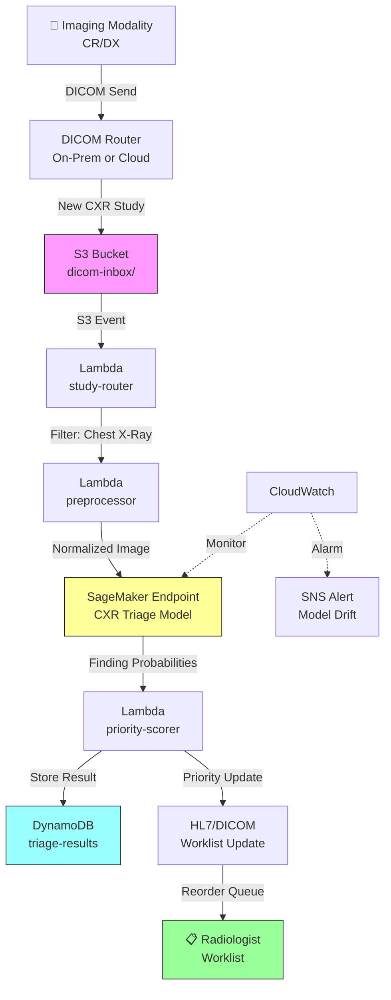

# Recipe 9.5: Chest X-Ray Triage

**Complexity:** Medium · **Phase:** Production (FDA pathway required) · **Estimated Cost:** ~$0.10–$0.50 per study

---

## The Problem

A radiologist at a community hospital starts their morning shift with 80 studies in the worklist. They're ordered by time received: first in, first out. Somewhere in that queue is a chest X-ray showing a tension pneumothorax. The patient is in the ED, deteriorating. The study arrived 45 minutes ago, but there are 30 routine pre-op chest films ahead of it. The radiologist won't see it for another hour unless someone calls and interrupts them.

This is not a hypothetical. It's the daily reality of radiology departments everywhere. Studies are read in the order they arrive, not in the order of clinical urgency. A routine screening mammogram and a stat portable chest X-ray from the ICU sit in the same queue, differentiated only by a "STAT" flag that the ordering physician may or may not have remembered to set. And even when the flag is set, it doesn't tell the radiologist what they're about to see. It just says "read this sooner."

The volume problem is real. The average radiologist reads 50 to 100 studies per day. In academic centers, that number can exceed 150. Chest X-rays are the single most common radiological examination worldwide, accounting for roughly 40% of all imaging studies. They're also the modality where critical findings (pneumothorax, large pleural effusion, widened mediastinum, tension pneumothorax) demand immediate action. Minutes matter.

The idea behind chest X-ray triage AI is simple: run every incoming chest X-ray through a model that detects critical findings, and if something looks urgent, bump it to the top of the radiologist's worklist. The radiologist still reads the study. The radiologist still makes the diagnosis. The AI just changes the order in which studies are presented. It's worklist prioritization, not automated diagnosis.

This distinction matters enormously for regulatory, liability, and clinical acceptance reasons. We'll get into all of that.

---

## The Technology: How Computers Read Chest X-Rays

### Convolutional Neural Networks for Medical Imaging

The core technology here is deep learning applied to medical images, specifically convolutional neural networks (CNNs). A CNN processes an image by sliding small filters across it, detecting increasingly complex patterns at each layer. Early layers detect edges and textures. Middle layers detect shapes and structures. Deep layers detect high-level concepts like "lung field" or "cardiac silhouette" or "pleural line."

For chest X-ray interpretation, the model learns to recognize anatomical structures and pathological findings from thousands (ideally hundreds of thousands) of labeled training images. The labels come from radiologist annotations: "this image contains a pneumothorax," "this image shows cardiomegaly," "this image is normal."

The output is typically a set of probability scores, one per finding category. For example: pneumothorax 0.92, pleural effusion 0.15, cardiomegaly 0.03. A threshold converts these probabilities into binary flags: anything above 0.7 (or whatever threshold you calibrate) triggers the triage alert.

### Why This Problem Is Well-Suited to Deep Learning

Chest X-ray triage is one of the most studied problems in medical AI, and for good reason:

**Large public datasets exist.** NIH released ChestX-ray14 (112,000 images, 14 pathology labels) in 2017. CheXpert from Stanford added 224,000 images with radiologist-validated labels. MIMIC-CXR provides over 370,000 images linked to radiology reports. These datasets enabled rapid research progress and benchmarking. No other medical imaging modality has this volume of publicly available labeled data.

**The task is well-defined.** "Does this chest X-ray contain a pneumothorax?" is a binary classification problem with clear ground truth. Compare this to "Is this patient's cancer responding to treatment?" which requires longitudinal data, clinical context, and subjective judgment. Binary classification on a single image is the simplest formulation of medical image analysis.

**The clinical workflow integration is straightforward.** You're not replacing the radiologist. You're reordering their queue. The output is a priority score, not a diagnosis. This dramatically simplifies the regulatory pathway, the liability model, and the clinical acceptance challenge.

**FDA-cleared products already exist.** Multiple vendors have received FDA 510(k) clearance for chest X-ray triage AI. This means the regulatory pathway is established, the clinical evidence requirements are known, and the precedent exists. You're not blazing a trail; you're following one.

### What Makes This Hard (Despite the Advantages)

**Label noise in training data.** Those large public datasets? The labels were often extracted from radiology reports using NLP, not from direct image annotation. NLP-extracted labels have error rates of 5-15% depending on the finding. Training a model on noisy labels produces a model that inherits those errors. The research community has developed techniques to handle label noise (label smoothing, confident learning, multi-reader consensus), but it remains a fundamental challenge.

**Distribution shift.** A model trained on images from academic medical centers (high-quality digital radiography, standardized positioning) will underperform on images from community hospitals (older equipment, portable bedside studies, suboptimal positioning). Patient populations differ too: the prevalence of findings, the distribution of body habitus, the mix of pathologies. A model needs to work on your population, not just the training population.

**Subtle findings.** A large pneumothorax is obvious even to a medical student. A small apical pneumothorax on a supine patient is subtle enough that radiologists miss it. The model's sensitivity on subtle findings is typically much lower than on obvious ones, which is exactly the opposite of what you want (the obvious ones don't need AI help; the subtle ones do).

**Confounders and artifacts.** Chest X-rays contain all sorts of non-pathological features that can confuse a model: pacemaker leads, surgical clips, skin folds that mimic pneumothorax lines, rotated positioning that simulates cardiomegaly, overlying tubes and lines. A model that hasn't seen enough of these confounders will generate false positives.

**Calibration.** A model that outputs 0.85 for pneumothorax needs that 0.85 to actually mean "85% chance of pneumothorax." If the model is poorly calibrated (overconfident or underconfident), your threshold-based triage logic will either miss critical findings or flood the radiologist with false alarms. Calibration is often neglected in model development and is critical for clinical deployment.

### The General Architecture Pattern

At a conceptual level, the pipeline looks like this:

```
[PACS/Modality] → [DICOM Listener] → [Preprocessing] → [Inference] → [Priority Score] → [Worklist Update]
```

**PACS/Modality:** The chest X-ray is acquired on the imaging equipment and sent to the Picture Archiving and Communication System (PACS) via DICOM protocol. This is the standard radiology workflow; the AI system taps into it without changing it.

**DICOM Listener:** A service that receives or queries for new DICOM studies. It filters for chest X-rays specifically (using DICOM metadata: modality code "CR" or "DX", body part "CHEST", study description). Non-chest studies are ignored.

**Preprocessing:** DICOM images need preparation before inference. This includes: extracting pixel data from the DICOM wrapper, normalizing pixel intensity values, resizing to the model's expected input dimensions, and applying any windowing or contrast adjustments the model was trained with. Preprocessing must exactly match what was used during training, or accuracy degrades.

**Inference:** The preprocessed image is passed through the trained model. The output is a vector of probability scores, one per finding category. Inference should complete in under 5 seconds for triage to be useful (if it takes longer than the radiologist takes to open the study, it adds no value).

**Priority Score:** The probability scores are converted into a single triage priority. The simplest approach: if any critical finding exceeds its threshold, the study is flagged as urgent. More sophisticated approaches weight findings by clinical severity (tension pneumothorax > small effusion) and combine them into a composite urgency score.

**Worklist Update:** The priority score is communicated back to the PACS or radiology information system (RIS) to reorder the worklist. This is the integration challenge. PACS systems vary widely in how (or whether) they support external priority updates. Options include HL7 messages, DICOM worklist modifications, or proprietary APIs.

---

## The AWS Implementation

### Why These Services

**Amazon SageMaker for model hosting and inference.** SageMaker provides managed endpoints for real-time inference with auto-scaling. For a chest X-ray triage model, you need GPU-backed inference (CNNs are computationally intensive on CPU alone), consistent sub-5-second latency, and the ability to scale with imaging volume. SageMaker real-time endpoints with GPU instances (ml.g4dn or ml.g5 family) deliver this. SageMaker also handles model versioning, A/B testing for model updates, and monitoring for data drift, all of which matter for a regulated medical device.

**Amazon S3 for DICOM storage and model artifacts.** Incoming DICOM files need a durable, encrypted landing zone before and after processing. S3 with SSE-KMS encryption provides this. Model artifacts (the trained weights) also live in S3 and are loaded by SageMaker at endpoint startup.

**AWS Lambda for orchestration and lightweight processing.** The workflow coordination (receive notification of new study, validate metadata, trigger preprocessing, call inference endpoint, format results, send worklist update) is a series of short-lived, stateless operations. Lambda handles this without persistent infrastructure. For DICOM metadata parsing and routing decisions, Lambda is the right weight class.

**Amazon DynamoDB for result tracking and audit.** Every inference result needs to be stored: what study was analyzed, what findings were detected, what priority was assigned, and when. DynamoDB provides fast writes, point lookups by study ID, and encryption at rest. The audit trail is critical for both HIPAA compliance and FDA post-market surveillance requirements.

**Amazon CloudWatch for monitoring and alerting.** Model performance monitoring (inference latency, error rates, confidence score distributions) feeds into CloudWatch metrics and alarms. A sudden shift in the distribution of confidence scores can indicate data drift (new equipment, changed protocols) that degrades model accuracy. You want to catch this before clinicians notice.

**AWS HealthImaging (optional) for DICOM management.** AWS HealthImaging is a purpose-built service for storing, accessing, and analyzing medical images at scale. If you're building the full imaging pipeline on AWS (not just the AI triage layer), HealthImaging provides DICOM-native storage with sub-second image retrieval, which simplifies the DICOM handling that would otherwise require custom code.

### Architecture Diagram



### Prerequisites

| Requirement | Details |
|-------------|---------|
| **AWS Services** | Amazon SageMaker, Amazon S3, AWS Lambda, Amazon DynamoDB, Amazon CloudWatch, (optional) AWS HealthImaging |
| **IAM Permissions** | `sagemaker:InvokeEndpoint`, `s3:GetObject`, `s3:PutObject`, `dynamodb:PutItem`, `dynamodb:GetItem`, `logs:CreateLogGroup`, `logs:PutLogEvents` |
| **BAA** | AWS BAA signed (required: DICOM images are PHI) |
| **Encryption** | S3: SSE-KMS; DynamoDB: encryption at rest; SageMaker endpoint: KMS-encrypted storage volumes; all API calls over TLS |
| **VPC** | Production: Lambda and SageMaker endpoint in VPC with VPC endpoints for S3, DynamoDB, SageMaker Runtime, and CloudWatch Logs. SageMaker endpoints should not have public internet access. |
| **CloudTrail** | Enabled: log all SageMaker, S3, and DynamoDB API calls for HIPAA audit trail |
| **FDA Considerations** | If deploying as a medical device: 510(k) clearance required for triage/prioritization claims. Predicate devices exist. Quality Management System (QMS) required. Post-market surveillance plan required. |
| **Model** | Pre-trained chest X-ray classification model (e.g., DenseNet-121, EfficientNet, or custom architecture trained on CheXpert/MIMIC-CXR). Model must be validated on your institution's patient population before deployment. |
| **PACS Integration** | HL7 interface engine or DICOM worklist management capability for sending priority updates back to the reading worklist |
| **Sample Data** | NIH ChestX-ray14, CheXpert, or MIMIC-CXR for development. Never use real patient images outside of IRB-approved protocols. |
| **Cost Estimate** | SageMaker ml.g4dn.xlarge endpoint: ~$0.74/hour (~$535/month always-on). At 200 studies/day, that's ~$0.11/study for inference. S3 and DynamoDB costs negligible at this volume. |

### Ingredients

| AWS Service | Role |
|------------|------|
| **Amazon SageMaker** | Hosts the trained CNN model; provides GPU-backed real-time inference endpoint |
| **Amazon S3** | Stores incoming DICOM files and model artifacts; encrypted with KMS |
| **AWS Lambda** | Orchestrates the pipeline: routes studies, triggers preprocessing, calls inference, formats results |
| **Amazon DynamoDB** | Stores inference results, priority scores, and audit trail |
| **AWS KMS** | Manages encryption keys for S3, DynamoDB, and SageMaker volumes |
| **Amazon CloudWatch** | Metrics, logs, and alarms for inference latency, error rates, and confidence drift |
| **Amazon SNS** | Alerts operations team when model drift or errors are detected |

### Code

> **Reference implementations:** The following AWS sample repos demonstrate patterns relevant to this recipe:
>
> - [`amazon-sagemaker-medical-imaging`](https://github.com/aws-samples/amazon-sagemaker-medical-imaging): SageMaker-based medical imaging inference pipelines including DICOM handling <!-- TODO: verify this repo still exists -->
> - [`aws-healthimaging-samples`](https://github.com/aws-samples/aws-healthimaging-samples): Working with AWS HealthImaging for DICOM storage and retrieval

#### Walkthrough

**Step 1: Receive and filter DICOM studies.** When a new imaging study arrives in the S3 landing zone, the system checks whether it's a chest X-ray. Not every study needs triage. We filter using DICOM metadata: modality (CR or DX for computed/digital radiography), body part examined (CHEST), and view position (PA or AP). Non-chest studies are ignored. This filtering prevents wasted inference costs and keeps the model focused on what it was trained for. Skip this step and you'll be running knee X-rays through a chest model, burning GPU time and generating meaningless results.

```
FUNCTION route_study(bucket, key):
    // Read DICOM metadata from the file header (not the pixel data, just the tags).
    // DICOM files contain structured metadata describing the study, patient, and acquisition.
    metadata = read DICOM tags from S3 object at bucket/key

    // Check if this study is a chest X-ray based on standard DICOM tags.
    // Modality "CR" = Computed Radiography, "DX" = Digital Radiography (both are X-ray types).
    // BodyPartExamined tells us what anatomy was imaged.
    IF metadata.Modality in ["CR", "DX"]
       AND metadata.BodyPartExamined == "CHEST":

        // This is a chest X-ray. Send it to the preprocessing pipeline.
        trigger_preprocessing(bucket, key, metadata)

    ELSE:
        // Not a chest X-ray. Log it and move on. No inference needed.
        log("Skipping non-chest study: " + key)
```

**Step 2: Preprocess the DICOM image for model input.** Raw DICOM pixel data is not ready for a neural network. DICOM images can be 12-bit or 16-bit, have varying dimensions, use different photometric interpretations (some are inverted: white = air, black = bone), and may include burned-in annotations or borders. This step extracts the pixel array, normalizes intensity values to the range the model expects, resizes to the model's input dimensions, and handles photometric inversion. The preprocessing must exactly replicate what was done during model training. Even small differences (different resize interpolation, different normalization range) can degrade accuracy significantly. This is one of the most common deployment failures in medical imaging AI.

```
FUNCTION preprocess_for_inference(bucket, key):
    // Load the full DICOM file including pixel data.
    dicom_file = load DICOM from S3 at bucket/key

    // Extract the raw pixel array. This is typically a 2D array of integers.
    // Values might range from 0 to 4095 (12-bit) or 0 to 65535 (16-bit).
    pixel_array = dicom_file.pixel_array

    // Handle photometric interpretation.
    // "MONOCHROME1" means high values = dark (inverted from what models expect).
    // Most models are trained with "MONOCHROME2" convention (high values = bright).
    IF dicom_file.PhotometricInterpretation == "MONOCHROME1":
        pixel_array = invert(pixel_array)  // flip so high values = bright

    // Apply windowing if window center/width are specified.
    // Windowing maps the full dynamic range to a clinically relevant subset.
    // This mimics what the radiologist sees on their display.
    IF dicom_file has WindowCenter AND WindowWidth:
        pixel_array = apply_window(pixel_array,
                                   center = dicom_file.WindowCenter,
                                   width  = dicom_file.WindowWidth)

    // Normalize pixel values to [0, 1] range.
    // Neural networks expect inputs in a consistent, small numeric range.
    pixel_array = normalize_to_0_1(pixel_array)

    // Resize to model's expected input dimensions (e.g., 224x224 or 512x512).
    // Use the same interpolation method used during training (typically bilinear).
    pixel_array = resize(pixel_array, target_size = MODEL_INPUT_SIZE,
                         interpolation = "bilinear")

    // Return the preprocessed image ready for inference.
    RETURN pixel_array
```

**Step 3: Run inference on the triage model.** The preprocessed image is sent to the SageMaker endpoint hosting the trained model. The model returns a probability score for each finding category it was trained to detect. For a triage use case, the critical findings are typically: pneumothorax, large pleural effusion, cardiomegaly, pulmonary edema, and mass/nodule. The inference call should complete in under 5 seconds. If it takes longer, the triage value diminishes (the radiologist might have already opened the study). Monitor latency closely.

```
FUNCTION run_inference(preprocessed_image, study_id):
    // Serialize the preprocessed image into the format the endpoint expects.
    // Most SageMaker endpoints accept numpy arrays serialized as bytes or JSON.
    payload = serialize_image(preprocessed_image)

    // Call the SageMaker real-time inference endpoint.
    // The endpoint name identifies which model version to use.
    // ContentType tells SageMaker how to deserialize the input.
    response = call SageMaker.InvokeEndpoint with:
        EndpointName = "cxr-triage-model-v2"
        ContentType  = "application/x-npy"    // numpy array format
        Body         = payload

    // Parse the response: a dictionary of finding names to probability scores.
    // Example: {"pneumothorax": 0.92, "pleural_effusion": 0.15, "cardiomegaly": 0.03, ...}
    predictions = deserialize(response.Body)

    // Log the raw predictions for audit and monitoring.
    log_inference_result(study_id, predictions)

    RETURN predictions
```

**Step 4: Calculate priority score and determine triage action.** Raw probability scores need to be converted into a clinical priority decision. This step applies finding-specific thresholds (pneumothorax has a lower threshold than cardiomegaly because it's more time-sensitive) and assigns a composite priority level. The priority levels map to worklist behavior: CRITICAL means interrupt the radiologist now, URGENT means move to top of queue, ROUTINE means normal ordering. The thresholds are the most important tunable parameters in the system. Set them too low and you flood the radiologist with false alarms (alert fatigue kills clinical AI adoption faster than anything). Set them too high and you miss the findings that matter. Calibrate on your institution's data with radiologist input.

```
// Thresholds per finding, calibrated on institutional validation data.
// Lower threshold = more sensitive (fewer misses, more false alarms).
// These values are examples; real thresholds require clinical validation.
FINDING_THRESHOLDS = {
    "pneumothorax":      0.60,   // life-threatening; err on the side of alerting
    "tension_pneumo":    0.50,   // immediately life-threatening; very low threshold
    "large_effusion":    0.70,   // clinically significant but less emergent
    "pulmonary_edema":   0.70,   // urgent but not immediately life-threatening
    "mass_or_nodule":    0.75,   // important but not time-critical in minutes
    "cardiomegaly":      0.80    // relevant but rarely emergent
}

// Clinical severity weights for composite scoring.
SEVERITY_WEIGHTS = {
    "tension_pneumo":    10,
    "pneumothorax":       8,
    "large_effusion":     6,
    "pulmonary_edema":    6,
    "mass_or_nodule":     4,
    "cardiomegaly":       2
}

FUNCTION calculate_priority(predictions):
    triggered_findings = empty list
    composite_score    = 0

    FOR each finding, probability in predictions:
        IF finding in FINDING_THRESHOLDS:
            IF probability >= FINDING_THRESHOLDS[finding]:
                // This finding exceeds its threshold. Flag it.
                append to triggered_findings: {
                    finding:     finding,
                    probability: probability,
                    severity:    SEVERITY_WEIGHTS[finding]
                }
                // Add weighted contribution to composite score.
                composite_score += probability * SEVERITY_WEIGHTS[finding]

    // Determine priority level based on composite score and finding types.
    IF any triggered finding has severity >= 8:
        priority = "CRITICAL"       // pneumothorax or tension: interrupt radiologist
    ELSE IF composite_score >= 5:
        priority = "URGENT"         // significant findings: move to top of queue
    ELSE IF length(triggered_findings) > 0:
        priority = "ELEVATED"       // minor findings flagged: slight priority boost
    ELSE:
        priority = "ROUTINE"        // no findings above threshold: normal queue order

    RETURN {
        priority:           priority,
        composite_score:    composite_score,
        triggered_findings: triggered_findings
    }
```

**Step 5: Store results and update the worklist.** The final step persists the triage result for audit purposes and communicates the priority back to the PACS/RIS system to reorder the radiologist's worklist. The worklist update is the integration challenge. Every PACS vendor handles this differently. Common approaches include: sending an HL7 ORM message with updated priority, modifying the DICOM Modality Worklist entry, or using the PACS vendor's proprietary API. The audit record must capture everything: what was analyzed, what the model predicted, what priority was assigned, and when. This supports both HIPAA compliance and FDA post-market surveillance.

```
FUNCTION store_and_notify(study_id, accession_number, patient_id, priority_result):
    // Write the complete triage result to the audit database.
    write record to database table "triage-results":
        study_id          = study_id
        accession_number  = accession_number
        patient_id        = patient_id           // for linking back to clinical context
        model_version     = "cxr-triage-v2.1"   // track which model version produced this result
        inference_time    = current UTC timestamp
        priority          = priority_result.priority
        composite_score   = priority_result.composite_score
        findings          = priority_result.triggered_findings
        raw_predictions   = predictions          // full probability vector for audit

    // If priority is CRITICAL or URGENT, update the radiologist worklist.
    IF priority_result.priority in ["CRITICAL", "URGENT"]:

        // Send priority update to PACS/RIS via HL7 or vendor API.
        // The exact mechanism depends on your PACS vendor.
        send_worklist_update(
            accession_number = accession_number,
            new_priority     = priority_result.priority,
            reason           = format_finding_summary(priority_result.triggered_findings)
        )

        // For CRITICAL findings, also send an immediate notification.
        IF priority_result.priority == "CRITICAL":
            send_alert(
                channel  = "radiology-urgent",
                message  = "CRITICAL finding detected on study " + accession_number
                         + ": " + format_finding_summary(priority_result.triggered_findings)
            )
```

> **Curious how this looks in Python?** The pseudocode above covers the concepts. If you'd like to see sample Python code that demonstrates these patterns using boto3, check out the [Python Example](chapter09.05-python-example). It walks through each step with inline comments and notes on what you'd need to change for a real deployment.

### Expected Results

**Sample output for a study with pneumothorax:**

```json
{
  "study_id": "1.2.840.113619.2.55.3.604688119.969.1234567890.123",
  "accession_number": "CXR-2026-048291",
  "model_version": "cxr-triage-v2.1",
  "inference_time": "2026-03-15T08:42:03Z",
  "inference_latency_ms": 1847,
  "priority": "CRITICAL",
  "composite_score": 7.84,
  "triggered_findings": [
    {
      "finding": "pneumothorax",
      "probability": 0.92,
      "severity": 8
    }
  ],
  "all_predictions": {
    "pneumothorax": 0.92,
    "tension_pneumo": 0.31,
    "large_effusion": 0.08,
    "pulmonary_edema": 0.04,
    "mass_or_nodule": 0.12,
    "cardiomegaly": 0.06
  }
}
```

**Performance benchmarks:**

| Metric | Typical Value |
|--------|---------------|
| End-to-end latency (S3 event to worklist update) | 3–8 seconds |
| Model inference latency (SageMaker) | 1–3 seconds |
| Sensitivity (pneumothorax) | 85–95% (varies by size/type) |
| Specificity (pneumothorax) | 85–92% |
| Sensitivity (large effusion) | 88–95% |
| False positive rate (all findings) | 5–15% per study |
| Cost per study | ~$0.10–$0.15 (inference + storage) |
| Throughput | ~200 studies/hour per endpoint |

**Where it struggles:** Small apical pneumothoraces on supine patients (the hardest finding for both AI and humans). Subcutaneous emphysema mimicking pneumothorax. Skin folds creating false pleural lines. Portable AP studies with suboptimal positioning. Post-surgical patients with expected findings that shouldn't trigger alerts. Pediatric chest X-rays (most models are trained on adults).

---

## The Honest Take

Chest X-ray triage AI is one of the most mature applications of medical imaging AI. The research is extensive, the datasets are large, the regulatory pathway is established, and multiple commercial products exist. If you're going to deploy medical imaging AI anywhere, this is a reasonable place to start.

That said, here's what will surprise you:

**Alert fatigue is the killer.** A 10% false positive rate sounds acceptable in a research paper. In practice, if a radiologist gets 20 false alarms for every true critical finding, they'll start ignoring the alerts within a week. Specificity matters more than sensitivity for clinical adoption. A missed finding is bad; a system that cries wolf constantly is useless.

**The PACS integration is harder than the AI.** Getting a model to detect pneumothorax is a solved problem. Getting that detection to actually reorder a worklist in your specific PACS installation, with your specific HL7 interface engine, with your specific radiologist workflow preferences, is a 3-month integration project. Every site is different.

**Model validation on your data is non-negotiable.** Published performance numbers from CheXpert or MIMIC-CXR will not match your performance. Your patient population is different. Your equipment is different. Your image quality is different. Budget for a prospective validation study on at least 1,000 studies from your institution before going live.

**The regulatory question is real.** If you're building this in-house (not buying a commercial product), you're building a medical device. That means FDA 510(k) clearance, a Quality Management System, design controls, risk analysis, and post-market surveillance. This is 12-18 months of regulatory work on top of the technical build. Most health systems buy rather than build for this reason.

**Radiologists are not the enemy.** The most successful deployments involve radiologists from day one: choosing thresholds, reviewing false positives, providing feedback on edge cases. The worst deployments are IT-driven projects that surprise radiologists with a new system on Monday morning.

---

## Variations and Extensions

**Multi-finding triage with severity weighting.** Instead of binary "critical vs. not," implement a continuous priority score that accounts for multiple simultaneous findings. A study with moderate pneumothorax plus moderate effusion might be more urgent than either finding alone. The composite scoring in Step 4 is a starting point; clinical input refines the weights.

**Longitudinal comparison.** For patients with serial chest X-rays (ICU patients, post-surgical monitoring), compare the current study to the prior. A new finding that wasn't present yesterday is more urgent than a stable chronic finding. This requires image registration and change detection, which adds significant complexity but dramatically improves clinical relevance.

**Radiologist feedback loop.** When the radiologist reads the study, capture whether they agreed with the AI's triage decision. Feed disagreements back into a retraining pipeline. Over time, the model calibrates to your institution's specific patterns and preferences. This is the path from "useful tool" to "indispensable tool."

---

## Related Recipes

- **Recipe 9.1 (Image Quality Assessment):** Run quality checks before inference; poor-quality images should be flagged for retake rather than triaged with low confidence
- **Recipe 9.4 (Dermatology Lesion Triage):** Similar triage-not-diagnosis pattern applied to a different imaging modality; shares the regulatory and workflow integration challenges
- **Recipe 9.6 (Diabetic Retinopathy Screening):** A step beyond triage into screening/diagnosis territory; illustrates the increased regulatory burden
- **Recipe 9.7 (Radiology AI Triage, Multi-Modality):** Extends this single-modality pattern to CT, MRI, and other modalities with modality-specific models

---

## Additional Resources

**AWS Documentation:**
- [Amazon SageMaker Real-Time Inference](https://docs.aws.amazon.com/sagemaker/latest/dg/realtime-endpoints.html)
- [Amazon SageMaker Model Monitor](https://docs.aws.amazon.com/sagemaker/latest/dg/model-monitor.html)
- [AWS HealthImaging Developer Guide](https://docs.aws.amazon.com/healthimaging/latest/devguide/what-is.html)
- [AWS HIPAA Eligible Services](https://aws.amazon.com/compliance/hipaa-eligible-services-reference/)
- [Architecting for HIPAA on AWS (Whitepaper)](https://docs.aws.amazon.com/whitepapers/latest/architecting-hipaa-security-and-compliance-on-aws/welcome.html)
- [Amazon SageMaker Pricing](https://aws.amazon.com/sagemaker/pricing/)

**AWS Sample Repos:**
- [`aws-healthimaging-samples`](https://github.com/aws-samples/aws-healthimaging-samples): Code samples for AWS HealthImaging including DICOM import, retrieval, and metadata access
- [`amazon-sagemaker-examples`](https://github.com/aws/amazon-sagemaker-examples): Comprehensive SageMaker examples including real-time inference endpoint deployment <!-- TODO: verify medical imaging specific examples exist in this repo -->

**AWS Solutions and Blogs:**
- [Guidance for Medical Imaging on AWS](https://aws.amazon.com/solutions/guidance/medical-imaging-on-aws/): Reference architecture for medical imaging workflows on AWS <!-- TODO: verify this specific solution page exists -->
- [Build a medical image analysis pipeline on AWS](https://aws.amazon.com/blogs/machine-learning/build-a-medical-image-analysis-pipeline-on-aws/): Blog post covering end-to-end medical imaging ML pipelines <!-- TODO: verify this blog post URL -->

**Public Datasets (for development only):**
- [NIH ChestX-ray14](https://nihcc.app.box.com/v/ChestXray-NIHCC): 112,120 frontal chest X-rays with 14 disease labels
- [CheXpert](https://stanfordmlgroup.github.io/competitions/chexpert/): 224,316 chest radiographs from Stanford with expert labels
- [MIMIC-CXR](https://physionet.org/content/mimic-cxr/2.0.0/): 377,110 chest X-rays linked to free-text radiology reports

**Regulatory Guidance:**
- [FDA: Artificial Intelligence and Machine Learning in Software as a Medical Device](https://www.fda.gov/medical-devices/software-medical-device-samd/artificial-intelligence-and-machine-learning-software-medical-device)
- [FDA 510(k) Cleared AI/ML Medical Devices](https://www.fda.gov/medical-devices/software-medical-device-samd/artificial-intelligence-and-machine-learning-aiml-enabled-medical-devices)

---

## Estimated Implementation Time

| Tier | Timeline | What You Get |
|------|----------|--------------|
| **Basic (research/pilot)** | 4–6 weeks | Pre-trained model deployed on SageMaker, manual DICOM upload, results in DynamoDB, no PACS integration |
| **Production-ready** | 4–6 months | Automated DICOM routing, PACS worklist integration, model validation on institutional data, monitoring and alerting, FDA regulatory submission (if building in-house) |
| **With variations** | 9–12 months | Multi-finding composite scoring, longitudinal comparison, radiologist feedback loop, multi-site deployment |

---

## Tags

`computer-vision` · `medical-imaging` · `chest-xray` · `triage` · `cnn` · `sagemaker` · `dicom` · `pacs` · `radiology` · `fda` · `medium` · `gpu`

---

*← [Recipe 9.4: Dermatology Lesion Triage](chapter09.04-dermatology-lesion-triage) · [Chapter 9 Index](chapter09-index) · [Next: Recipe 9.6: Diabetic Retinopathy Screening →](chapter09.06-diabetic-retinopathy-screening)*
