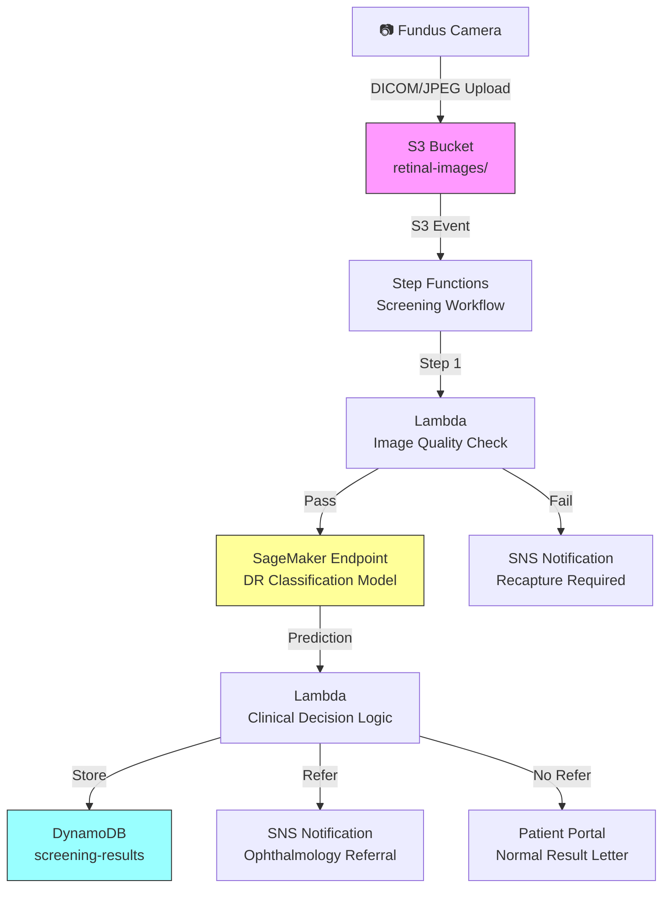

# Recipe 9.6 Architecture and Implementation: Diabetic Retinopathy Screening

*Companion to [Recipe 9.6: Diabetic Retinopathy Screening](chapter09.06-diabetic-retinopathy-screening). This page covers the AWS architecture, services, prerequisites, and pseudocode. For the problem framing and the conceptual approach, start with the main recipe.*

---

## The AWS Implementation

### Why These Services

**Amazon SageMaker for model hosting.** Diabetic retinopathy models are large (typically 50-200MB) and require GPU inference for acceptable latency. SageMaker endpoints provide managed GPU hosting with auto-scaling, model versioning, and A/B testing capabilities. For a screening program processing hundreds of images per day, a real-time endpoint makes sense. For batch processing (end-of-day reads), SageMaker Batch Transform is more cost-effective.

**Amazon S3 for image storage.** Fundus images are large (typically 2-10MB each) and must be retained for regulatory compliance, quality audits, and potential reprocessing when models are updated. S3 with SSE-KMS encryption provides durable, compliant storage with lifecycle policies for long-term retention. Apply a bucket policy enforcing SSE-KMS on all uploads (`aws:SecureTransport` condition) and restricting access to the Lambda execution role and authorized administrative principals.

**AWS Lambda for orchestration.** The screening workflow (receive image, check quality, invoke model, apply decision logic, store results, trigger notifications) is a sequence of short-lived operations. Lambda handles the orchestration without persistent infrastructure. For the quality assessment step, a lightweight model can run on Lambda with up to 10GB ephemeral storage. Configure the quality assessment Lambda with at least 2048MB memory and 30-second timeout; a CNN-based quality model on full-resolution fundus images needs the headroom. Consider provisioned concurrency to avoid cold-start latency on the first screening of the day.

**Amazon DynamoDB for screening results.** Each screening event produces a structured result (patient ID, date, eye, grade, confidence, referral decision, model version). DynamoDB provides fast point lookups by patient ID and supports the audit trail requirements. Time-to-live (TTL) is not appropriate here because results must be retained indefinitely for compliance.

**Amazon SNS for notifications.** When a screening result requires urgent referral (proliferative DR or significant DME), the system needs to notify the ordering provider immediately. SNS provides reliable message delivery to multiple channels (email, SMS, webhook to EHR). Configure a dead-letter queue (SQS) on each SNS topic. For the urgent-referrals topic, add a CloudWatch alarm on the DLQ message count so failed notifications trigger an immediate operational alert.

**AWS Step Functions for complex workflows.** The full screening pipeline has branching logic (quality pass/fail, gradable/ungradable, referral/no-referral) and may need human review for borderline cases. Step Functions provides visual workflow orchestration with built-in retry logic and error handling.

### Architecture Diagram



### Prerequisites

| Requirement | Details |
|-------------|---------|
| **AWS Services** | Amazon SageMaker, Amazon S3, AWS Lambda, Amazon DynamoDB, AWS Step Functions, Amazon SNS |
| **IAM Permissions** | **Lambda execution role:** `sagemaker:InvokeEndpoint`, `s3:GetObject`, `s3:PutObject`, `dynamodb:PutItem`, `dynamodb:GetItem`, `sns:Publish`. **Step Functions execution role:** `lambda:InvokeFunction` (scoped to screening Lambda ARNs). **EventBridge rule role:** `states:StartExecution` (S3 event triggers Step Functions via EventBridge; EventBridge rules execute in the AWS service plane, so the rule's IAM role needs this permission, not Lambda). |
| **BAA** | AWS BAA signed (required: retinal images are PHI) |
| **Encryption** | S3: SSE-KMS with bucket policy enforcing encryption on all uploads (`aws:SecureTransport` condition) and restricting access to authorized principals; DynamoDB: encryption at rest with customer-managed KMS key (CMK) for CloudTrail audit visibility; SageMaker endpoint: KMS encryption for model artifacts and inference data; all API calls over TLS |
| **VPC** | Production: SageMaker endpoint in VPC, Lambda in VPC with VPC endpoints for S3, DynamoDB, SageMaker Runtime, Step Functions (`com.amazonaws.{region}.states`), SNS, and CloudWatch Logs. If EHR integration requires outbound HTTPS to external endpoints, configure a NAT Gateway or place the integration Lambda in a subnet with internet access. |
| **CloudTrail** | Enabled: log all SageMaker inference calls, S3 access, and DynamoDB writes for HIPAA audit trail |
| **Model** | Pre-trained DR classification model (EfficientNet or similar). You bring your own model or license a validated one. AWS does not provide a pre-built DR grading model. |
| **FDA Considerations** | If deploying as autonomous diagnostic: FDA clearance required. If deploying as physician-reviewed triage: regulatory path varies by use. Consult regulatory counsel. |
| **Sample Data** | Public datasets for development: EyePACS (Kaggle), Messidor-2, APTOS 2019. Never use real patient images in dev without IRB approval and proper de-identification. |
| **Cost Estimate** | SageMaker GPU endpoint (ml.g4dn.xlarge): ~$0.74/hour. At 100 images/day with 5-second inference: endpoint cost dominates at ~$530/month. For programs processing fewer than 50 images/day, consider SageMaker Asynchronous Inference or Serverless Inference endpoints (scale to zero when idle, 10-30 second latency). The always-on real-time endpoint becomes cost-effective above ~200 images/day. S3 and DynamoDB negligible at screening scale. |

### Ingredients

| AWS Service | Role |
|------------|------|
| **Amazon SageMaker** | Hosts the DR classification model on GPU endpoint; provides model versioning and A/B testing |
| **Amazon S3** | Stores fundus images with KMS encryption; lifecycle policies for long-term retention |
| **AWS Lambda** | Orchestrates quality check, decision logic, and notification routing |
| **Amazon DynamoDB** | Stores screening results, audit trail, and patient screening history |
| **AWS Step Functions** | Manages the multi-step screening workflow with branching and error handling |
| **Amazon SNS** | Delivers urgent referral notifications to providers |
| **AWS KMS** | Manages encryption keys for all PHI-containing services |
| **Amazon CloudWatch** | Monitors model latency, error rates, and screening volumes |

### Code

#### Walkthrough

**Step 1: Image quality assessment.** Before the classification model ever sees an image, we need to confirm it's actually gradable. A blurry, poorly-centered, or underexposed fundus image will produce unreliable predictions. This step runs a lightweight quality check: field of view coverage, focus sharpness, illumination uniformity, and artifact detection. If the image fails, the system immediately notifies the capture site to retake. This prevents the most common source of false negatives in screening programs: making a "no retinopathy" call on an image where you simply couldn't see the retinopathy because the image was garbage. In practice, 5-15% of images from non-mydriatic cameras in primary care settings fail quality assessment.

```pseudocode
FUNCTION assess_image_quality(bucket, image_key):
    // Download the fundus image from storage for quality analysis.
    image = download from S3 bucket at image_key

    // Check 1: Field of view. The image must capture the macula and optic disc.
    // A partial image (patient blinked, camera misaligned) is ungradable.
    field_of_view_score = calculate_fov_coverage(image)

    // Check 2: Focus/sharpness. Blurry images hide microaneurysms and fine detail.
    // Use Laplacian variance or similar edge-detection metric.
    sharpness_score = calculate_sharpness(image)

    // Check 3: Illumination. Under/overexposed images obscure pathology.
    // Check histogram distribution for adequate dynamic range.
    illumination_score = calculate_illumination_uniformity(image)

    // Check 4: Artifacts. Dust, eyelashes, reflections can mimic or hide lesions.
    artifact_score = detect_artifacts(image)

    // Combine scores. All must pass minimum thresholds.
    overall_quality = minimum(field_of_view_score, sharpness_score,
                             illumination_score, artifact_score)

    IF overall_quality < QUALITY_THRESHOLD:
        RETURN { gradable: false, reason: identify_worst_factor(scores),
                 recommendation: "Recapture required" }
    ELSE:
        RETURN { gradable: true, quality_score: overall_quality }
```

**Step 2: Model inference.** The core classification step. The fundus image is sent to the deep learning model, which outputs a severity grade and confidence scores. Most production systems output probabilities for each ICDR level rather than a single hard classification. This allows downstream logic to apply different thresholds for different clinical contexts (a screening program in a resource-limited setting might accept a lower confidence threshold for "no referral" than a well-resourced urban clinic). The model also outputs a DME probability separately, because macular edema requires referral regardless of retinopathy severity.

```pseudocode
FUNCTION classify_retinal_image(bucket, image_key):
    // Load and preprocess the image to match model training specifications.
    // Typical preprocessing: resize to model input dimensions (e.g., 512x512 or 1024x1024),
    // normalize pixel values, apply any augmentation used during training.
    image_tensor = preprocess_for_model(bucket, image_key)

    // Invoke the SageMaker endpoint hosting the DR classification model.
    // The endpoint runs GPU inference and returns within 2-5 seconds typically.
    response = call SageMaker endpoint "dr-screening-model" with:
        payload = image_tensor
        content_type = "application/x-image"

    // Parse the model output: probability distribution over ICDR severity levels
    // plus a separate DME probability.
    predictions = parse_response(response)

    // predictions structure:
    // {
    //   "no_dr_probability": 0.02,
    //   "mild_npdr_probability": 0.05,
    //   "moderate_npdr_probability": 0.78,
    //   "severe_npdr_probability": 0.12,
    //   "pdr_probability": 0.03,
    //   "dme_probability": 0.15,
    //   "model_version": "v2.3.1",
    //   "inference_time_ms": 3200
    // }

    RETURN predictions
```

**Step 3: Clinical decision logic.** This is where model output becomes a clinical action. The mapping from probabilities to decisions is not trivial. You need to handle: (a) the primary DR severity grade, (b) DME detection, (c) confidence thresholds below which the system should defer to human review rather than making an autonomous call, and (d) the specific referral urgency (routine vs. urgent). The thresholds here are configurable and should be validated against your specific patient population and clinical workflow. A screening program's operating point is a tradeoff between sensitivity (catching all disease) and specificity (not overwhelming ophthalmology with false referrals).

```pseudocode
// Thresholds calibrated during clinical validation. These are examples;
// your validated thresholds will differ based on your population and clinical context.
REFERABLE_THRESHOLD = 0.80      // probability of moderate+ DR to trigger referral
DME_THRESHOLD = 0.70            // probability of DME to trigger referral
CONFIDENCE_THRESHOLD = 0.60     // below this, defer to human review (model is uncertain)
URGENT_THRESHOLD = 0.70         // probability of severe/PDR to trigger urgent referral

FUNCTION apply_clinical_decision(predictions):
    // Calculate the probability of referable DR (moderate NPDR or worse).
    referable_probability = predictions.moderate_npdr_probability
                          + predictions.severe_npdr_probability
                          + predictions.pdr_probability

    // Calculate urgency: severe NPDR or PDR requires expedited referral.
    urgent_probability = predictions.severe_npdr_probability
                       + predictions.pdr_probability

    // Determine the highest-probability severity grade for the record.
    severity_grade = grade_with_highest_probability(predictions)

    // Decision logic with confidence gating.
    IF max_probability(predictions) < CONFIDENCE_THRESHOLD:
        // Model is not confident enough for autonomous decision.
        // Route to human grader (ophthalmologist or trained reader).
        decision = "HUMAN_REVIEW_REQUIRED"
        urgency = "routine"

    ELSE IF urgent_probability >= URGENT_THRESHOLD:
        // High probability of sight-threatening disease. Urgent referral.
        decision = "URGENT_REFERRAL"
        urgency = "urgent"

    ELSE IF referable_probability >= REFERABLE_THRESHOLD:
        // Referable DR detected. Routine ophthalmology referral.
        decision = "ROUTINE_REFERRAL"
        urgency = "routine"

    ELSE IF predictions.dme_probability >= DME_THRESHOLD:
        // DME detected independent of DR severity. Requires referral.
        decision = "ROUTINE_REFERRAL"
        urgency = "routine"
        severity_grade = severity_grade + " with DME"

    ELSE:
        // No referable disease detected. Safe to screen again in 12 months.
        decision = "NO_REFERRAL"
        urgency = "none"

    RETURN {
        decision: decision,
        urgency: urgency,
        severity_grade: severity_grade,
        referable_probability: referable_probability,
        dme_probability: predictions.dme_probability,
        model_version: predictions.model_version
    }
```

**Step 4: Store results and trigger actions.** Every screening event gets a complete audit record: the image reference, model version, raw predictions, clinical decision, and timestamp. This is non-negotiable for regulatory compliance (FDA post-market surveillance requires traceability from image to decision). If the decision is a referral, the system triggers a notification to the ordering provider and (optionally) initiates an ophthalmology scheduling workflow. If the decision requires human review, it enters a reading queue for a qualified grader.

```pseudocode
FUNCTION store_and_act(patient_id, image_key, quality_result, predictions, decision):
    // Build the complete screening record for audit and clinical use.
    screening_record = {
        screening_id: generate_unique_id(),
        patient_id: patient_id,
        image_key: image_key,
        screening_date: current UTC timestamp (ISO 8601),
        quality_score: quality_result.quality_score,
        severity_grade: decision.severity_grade,
        referable_prob: decision.referable_probability,
        dme_probability: decision.dme_probability,
        clinical_decision: decision.decision,
        urgency: decision.urgency,
        model_version: decision.model_version,
        raw_predictions: predictions,    // full probability vector for audit
        status: "COMPLETE"
    }

    // Write to DynamoDB. This is the system of record for screening results.
    write screening_record to DynamoDB table "screening-results"
        with partition key = patient_id
        and sort key = screening_date

    // Trigger appropriate downstream action based on clinical decision.
    IF decision.decision == "URGENT_REFERRAL":
        publish to SNS topic "urgent-referrals":
            patient_id, severity_grade, urgency, screening_id
        // Also flag in EHR integration queue for immediate provider notification.

    ELSE IF decision.decision == "ROUTINE_REFERRAL":
        publish to SNS topic "routine-referrals":
            patient_id, severity_grade, screening_id

    ELSE IF decision.decision == "HUMAN_REVIEW_REQUIRED":
        // Add to reading queue for qualified human grader.
        write to DynamoDB table "reading-queue":
            screening_id, image_key, predictions, priority = "standard"

    ELSE:
        // No referral needed. Generate patient-friendly result notification.
        publish to SNS topic "normal-results":
            patient_id, screening_id, next_screening_date = today + 12 months

    RETURN screening_record
```

> **Curious how this looks in Python?** The pseudocode above covers the concepts. If you'd like to see sample Python code that demonstrates these patterns using boto3, check out the [Python Example](chapter09.06-python-example). It walks through each step with inline comments and notes on what you'd need to change for a real deployment.

### Expected Results

**Sample output for a screening with moderate NPDR detected:**

```json
{
  "screening_id": "scr-2026-0531-00847",
  "patient_id": "pat-00293847",
  "image_key": "retinal-images/2026/05/31/pat-00293847-OS.jpg",
  "screening_date": "2026-05-31T14:22:08Z",
  "quality_score": 0.92,
  "severity_grade": "Moderate NPDR",
  "referable_prob": 0.87,
  "dme_probability": 0.08,
  "clinical_decision": "ROUTINE_REFERRAL",
  "urgency": "routine",
  "model_version": "v2.3.1",
  "status": "COMPLETE"
}
```

**Performance benchmarks:**

| Metric | Typical Value |
|--------|---------------|
| End-to-end latency | 5-10 seconds (including quality check) |
| Sensitivity (referable DR) | 87-97% (depends on model and threshold) |
| Specificity (referable DR) | 85-95% |
| Ungradable rate | 5-15% (population and camera dependent) |
| Cost per screening | $0.50-$2.00 (dominated by SageMaker endpoint) |
| Throughput | ~200 images/hour per endpoint |

**Where it struggles:**

- Images from patients with cataracts or other media opacities (high ungradable rate)
- Distinguishing moderate from severe NPDR (the boundary is subjective even for ophthalmologists)
- Detecting early DME without OCT imaging (fundus photography alone has limited sensitivity for macular edema)
- Patients with both DR and other retinal pathology (e.g., age-related macular degeneration) where findings overlap
- Pediatric patients (different retinal anatomy, different disease presentation)

---

## Variations and Extensions

**Multi-disease retinal screening.** The same fundus image that shows diabetic retinopathy can also reveal glaucoma (optic disc changes), age-related macular degeneration (drusen, geographic atrophy), and hypertensive retinopathy. Multi-task models that screen for multiple conditions simultaneously increase the value of each captured image. The architecture is identical; you add output heads to the classification model and additional decision logic branches.

**Longitudinal progression tracking.** Instead of grading each image independently, compare the current image to the patient's previous screenings. Track lesion count changes, hemorrhage area growth, and microaneurysm turnover rates. This transforms screening from a point-in-time assessment to a progression monitoring system. Requires image registration (aligning images from different visits) and a temporal database of per-patient imaging history.

**Integration with OCT imaging.** Optical coherence tomography (OCT) provides cross-sectional retinal thickness measurements that are far more sensitive for detecting macular edema than fundus photography alone. Some screening programs are adding portable OCT devices alongside fundus cameras. The AI pipeline extends to include OCT segmentation and thickness map analysis, with the two modalities providing complementary information for referral decisions.

---

## Additional Resources

**AWS Documentation:**
- [Amazon SageMaker Real-Time Inference](https://docs.aws.amazon.com/sagemaker/latest/dg/realtime-endpoints.html)
- [Amazon SageMaker Model Hosting](https://docs.aws.amazon.com/sagemaker/latest/dg/how-it-works-deployment.html)
- [Amazon SageMaker Multi-Model Endpoints](https://docs.aws.amazon.com/sagemaker/latest/dg/multi-model-endpoints.html)
- [AWS Step Functions Developer Guide](https://docs.aws.amazon.com/step-functions/latest/dg/welcome.html)
- [AWS HIPAA Eligible Services](https://aws.amazon.com/compliance/hipaa-eligible-services-reference/)
- [Architecting for HIPAA on AWS (Whitepaper)](https://docs.aws.amazon.com/whitepapers/latest/architecting-hipaa-security-and-compliance-on-aws/welcome.html)

**Clinical and Regulatory References:**
<!-- TODO (TechWriter): Expert review V1 (MEDIUM). Verify and fill all six URLs below before publication. Remove entries where URLs cannot be confirmed. -->
- TODO: Verify current FDA guidance document URL for AI/ML-based Software as a Medical Device (SaMD)
- TODO: Verify URL for IDx-DR (Digital Diagnostics) FDA De Novo clearance summary
- TODO: Verify URL for AAO Diabetic Retinopathy Preferred Practice Pattern

**Public Datasets (for development only):**
- TODO: Verify current Kaggle EyePACS dataset URL
- TODO: Verify Messidor-2 dataset access URL
- TODO: Verify APTOS 2019 Blindness Detection challenge URL

---

## Estimated Implementation Time

| Tier | Timeline | What You Get |
|------|----------|--------------|
| **Basic** | 4-6 weeks | Quality gate + single model endpoint + DynamoDB storage + basic referral notification. Physician reviews all results. |
| **Production-ready** | 3-5 months | Validated model with clinical study, Step Functions workflow, EHR integration, provider notifications, patient portal results, monitoring dashboard, regulatory documentation. |
| **With variations** | 6-12 months | Multi-disease screening, longitudinal tracking, OCT integration, multi-site deployment with camera-specific calibration. |

---


---

*← [Main Recipe 9.6](chapter09.06-diabetic-retinopathy-screening) · [Python Example](chapter09.06-python-example) · [Chapter Preface](chapter09-preface)*
