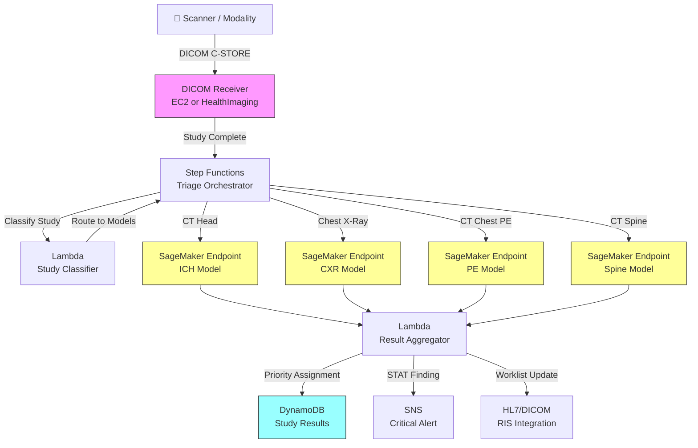

# Recipe 9.7 Architecture and Implementation: Radiology AI Triage (Multi-Modality) 🏥

*Companion to [Recipe 9.7: Radiology AI Triage (Multi-Modality) 🏥](chapter09.07-radiology-ai-triage-multi-modality). This page covers the AWS architecture, services, prerequisites, and pseudocode. For the problem framing and the conceptual approach, start with the main recipe.*

---

## The AWS Implementation

### Why These Services

**Amazon SageMaker for model hosting and inference.** Radiology AI models are large (often 100MB-1GB+) and require GPU inference for volumetric data. SageMaker endpoints provide managed GPU hosting with auto-scaling. You can host multiple models behind a single endpoint using multi-model endpoints, or dedicate endpoints per modality for isolation. For production triage systems with strict latency SLAs, use dedicated endpoints per model. Multi-model endpoints reduce cost but introduce model-loading latency (10-30 seconds for a cold swap) that is unacceptable for safety-critical triage. The cost estimate in this recipe assumes dedicated always-on endpoints. SageMaker also handles model versioning, A/B testing, and monitoring, which matters when you're running FDA-cleared models that need version traceability.

**Amazon S3 for DICOM storage.** Medical imaging generates enormous data volumes. A single CT study can be 200-500MB. S3 provides durable, encrypted storage at scale with lifecycle policies to manage retention. S3 also serves as the staging area between DICOM receipt and inference.

**AWS Lambda and AWS Step Functions for orchestration.** The triage pipeline is a multi-step workflow: receive study, classify, route to models, aggregate results, update worklist. Step Functions provides visual workflow orchestration with built-in retry logic, error handling, and execution history. Lambda handles the lightweight steps (classification, routing, result aggregation). The inference step calls SageMaker endpoints. Configure Step Functions error handling to catch inference failures and write a `TRIAGE_FAILED` status to DynamoDB. A study that fails triage remains at routine priority (safe default), but monitor the failure rate via CloudWatch and alert if it exceeds 1% over a rolling window.

**Amazon DynamoDB for study tracking and results.** Each study needs a tracking record: when it arrived, which models ran, what they found, what priority was assigned, whether the radiologist acknowledged the alert. DynamoDB's key-value model with TTL support handles this cleanly.

**AWS HealthImaging for DICOM management.** AWS HealthImaging (formerly Amazon HealthLake Imaging) is purpose-built for medical imaging. It provides a DICOM-compliant data store with sub-second image retrieval, lossless compression, and native integration with the AWS ecosystem. It handles DICOM parsing, metadata indexing, and pixel data storage without you building a custom DICOM server.

**Amazon SNS for alerting.** Critical findings need to reach the radiologist immediately, not just reprioritize the worklist. SNS provides multi-channel notification (push, SMS, email) for STAT-level findings.

### Architecture Diagram



### Prerequisites

| Requirement | Details |
|-------------|---------|
| **AWS Services** | SageMaker, S3, Step Functions, Lambda, DynamoDB, HealthImaging, SNS, EC2 (DICOM receiver) |
| **IAM Permissions** | `sagemaker:InvokeEndpoint` (scoped to specific endpoint ARNs), `s3:GetObject`, `s3:PutObject`, `dynamodb:PutItem`, `dynamodb:GetItem`, `sns:Publish`, `states:StartExecution`, `medical-imaging:GetImageFrame`, `medical-imaging:GetImageSet`, `medical-imaging:GetImageSetMetadata`, `medical-imaging:SearchImageSets`, `medical-imaging:StartDICOMImportJob` (ingestion path only). Use separate IAM roles for the DICOM receiver (write) and inference pipeline (read-only). |
| **BAA** | Required. Medical images are PHI. |
| **Encryption** | S3: SSE-KMS; DynamoDB: encryption at rest; SageMaker endpoints: KMS encryption; all transit over TLS; HealthImaging: encrypted by default |
| **VPC** | Production: all components in VPC with private subnets. VPC endpoints for S3, DynamoDB, SageMaker Runtime, Step Functions, SNS. DICOM receiver in private subnet with NLB for scanner connectivity. Scanner connectivity requires a network path from the hospital imaging VLAN to the VPC private subnet, typically via AWS Direct Connect or site-to-site VPN. Coordinate with hospital network engineering for firewall rules allowing DICOM traffic (TCP port 104 or 11112) from scanner IPs to the NLB. Budget 2-4 weeks for network provisioning at each site. |
| **CloudTrail** | All API calls logged. Critical for FDA audit trail requirements. |
| **GPU Instances** | SageMaker endpoints: ml.g4dn.xlarge minimum for single-model inference; ml.g5.xlarge for larger volumetric models. Budget for always-on endpoints (triage must be real-time). |
| **Sample Data** | NIH ChestX-ray14 dataset (public, 112K images). RSNA Intracranial Hemorrhage Detection dataset. CQ500 dataset for CT head validation. Never use real patient imaging in dev. |
| **Cost Estimate** | SageMaker GPU endpoints (4 models, ml.g4dn.xlarge): ~$3,000/month always-on. S3 storage: ~$0.023/GB/month. Step Functions: ~$0.025 per 1000 state transitions. Per-study inference cost: ~$0.50-$2.00 depending on modality and number of models invoked. |

### Ingredients

| AWS Service | Role |
|------------|------|
| **Amazon SageMaker** | Hosts trained radiology AI models on GPU endpoints; handles inference at scale |
| **AWS HealthImaging** | DICOM-native storage and retrieval; handles study ingestion and metadata indexing |
| **Amazon S3** | Stores preprocessed image arrays for inference; archives raw DICOM |
| **AWS Step Functions** | Orchestrates the multi-step triage pipeline with retry and error handling |
| **AWS Lambda** | Study classification, model routing, result aggregation, priority assignment |
| **Amazon DynamoDB** | Tracks study status, model results, priority assignments, acknowledgments |
| **Amazon SNS** | Delivers critical finding alerts to radiologists and referring physicians |
| **AWS KMS** | Encryption key management for all data stores and endpoints |
| **Amazon CloudWatch** | Latency monitoring, model performance metrics, alerting on pipeline failures |

### Code

> **Reference implementations:** The following AWS resources demonstrate patterns used in this recipe:
>
> - [`amazon-sagemaker-examples`](https://github.com/aws/amazon-sagemaker-examples): SageMaker model deployment patterns including multi-model endpoints and real-time inference
> - [`aws-healthimaging-samples`](https://github.com/aws-samples/aws-healthimaging-samples): AWS HealthImaging integration patterns for DICOM ingestion and retrieval
> - [AWS HealthImaging Developer Guide](https://docs.aws.amazon.com/healthimaging/latest/devguide/what-is.html): DICOM store setup, import jobs, and pixel data access

#### Walkthrough

**Step 1: Receive and buffer the DICOM study.** Scanners send images as they're reconstructed, one DICOM instance (slice) at a time via DICOM C-STORE. A CT head might arrive as 200+ individual slices over 30-60 seconds. The system needs to buffer these and detect when the study is "complete" (all expected series have arrived). This is trickier than it sounds: there's no explicit "study complete" signal in DICOM. Common approaches include a timeout after the last received instance, or checking the NumberOfSeriesRelatedInstances against received count. Getting this wrong means either processing incomplete studies (missing slices = wrong inference) or waiting too long (defeating the purpose of fast triage). One additional failure mode: if a scanner drops connection mid-transfer, the timeout fires on an incomplete volume. If the received instance count is significantly below the expected count for the study type (e.g., a CT head with fewer than 100 slices when 150-300 is typical), flag the study as potentially incomplete and either skip inference or run with a lowered confidence threshold. Log incomplete studies for manual review.

```pseudocode
FUNCTION receive_dicom_study(dicom_instances):
    // Buffer incoming DICOM instances, grouped by StudyInstanceUID.
    // StudyInstanceUID is the unique identifier for a complete imaging study.
    study_uid = dicom_instances[0].StudyInstanceUID

    // Store each instance as it arrives.
    // In practice, this writes to HealthImaging or S3 with study_uid as the prefix.
    FOR each instance in dicom_instances:
        store instance to imaging_store under study_uid

    // Detect study completion.
    // Strategy: wait for a configurable quiet period (no new instances for N seconds).
    // Alternative: compare received instance count against expected count from DICOM metadata.
    IF no_new_instances_for(study_uid, timeout=60_seconds):
        trigger_triage_pipeline(study_uid)
```

**Step 2: Classify the study and select models.** Once the study is complete, examine its DICOM metadata to determine what kind of study it is and which AI models should analyze it. This routing decision is based on Modality (CT, MR, CR/DX), BodyPartExamined, StudyDescription, and sometimes ProtocolName. The challenge: these fields are inconsistently populated across sites. "CT HEAD W/O CONTRAST" at one hospital might be "CT Brain Non-Con" at another. Build a flexible classifier that handles variations, and log unrecognized study types for manual mapping updates.

```pseudocode
FUNCTION classify_and_route(study_uid):
    // Retrieve DICOM metadata for the study (not pixel data, just headers).
    metadata = get_study_metadata(study_uid)

    modality          = metadata.Modality            // "CT", "MR", "CR", "DX"
    body_part         = metadata.BodyPartExamined    // "HEAD", "CHEST", "SPINE", etc.
    study_description = metadata.StudyDescription    // Free text, varies wildly by site
    protocol          = metadata.ProtocolName        // Sometimes more specific than description

    // Model routing table: maps (modality + body_part + keywords) to model endpoints.
    // This is site-configurable and requires ongoing maintenance.
    applicable_models = []

    IF modality == "CT" AND body_part in ["HEAD", "BRAIN"]:
        applicable_models.append("ich_detection_model")

    IF modality == "CT" AND body_part == "CHEST":
        applicable_models.append("pe_detection_model")
        IF "ANGIO" in study_description OR "PE" in protocol:
            // PE-protocol CT gets higher priority for PE model
            applicable_models.append("pe_detection_model_high_sensitivity")

    IF modality in ["CR", "DX"] AND body_part == "CHEST":
        applicable_models.append("cxr_pneumothorax_model")
        applicable_models.append("cxr_critical_findings_model")

    IF modality == "CT" AND body_part in ["SPINE", "CSPINE"]:
        applicable_models.append("cervical_fracture_model")

    IF length(applicable_models) == 0:
        // No models available for this study type. Log and skip.
        log_unroutable_study(study_uid, metadata)
        RETURN []

    RETURN applicable_models
```

**Step 3: Preprocess and run inference.** Each model has specific input requirements. A chest X-ray model expects a single 2D image resized to 512x512 or 1024x1024 pixels, normalized to [0,1]. A CT head model expects a 3D volume resampled to uniform voxel spacing (typically 1mm isotropic), windowed to brain/subdural windows, and potentially cropped to the region of interest. Preprocessing is model-specific and must handle the variability of real-world scanner output (different pixel spacings, different bit depths, different photometric interpretations). Get preprocessing wrong and model performance degrades silently. You won't get an error; you'll get confident wrong answers.

```pseudocode
FUNCTION run_inference(study_uid, model_name):
    // Load pixel data from the imaging store.
    pixel_data = load_pixel_data(study_uid)

    // Apply model-specific preprocessing.
    // Each model has a registered preprocessing pipeline.
    preprocessed = PREPROCESS_REGISTRY[model_name].transform(pixel_data)
    // Example for CT head ICH model:
    //   1. Resample to 1mm isotropic voxel spacing
    //   2. Apply brain window (W:80, L:40) and subdural window (W:200, L:75)
    //   3. Normalize to [0, 1]
    //   4. Resize to model input dimensions (e.g., 256x256x32 slices)

    // Call the SageMaker endpoint for this model.
    response = invoke_sagemaker_endpoint(
        endpoint_name = MODEL_ENDPOINTS[model_name],
        payload       = serialize(preprocessed),
        content_type  = "application/x-npy"  // numpy array format
    )

    // Parse model output: findings with confidence scores and localizations.
    findings = parse_model_response(response)
    // Example output:
    // [
    //   { finding: "intracranial_hemorrhage", subtype: "subdural", confidence: 0.94,
    //     location: { slice_range: [45, 62], hemisphere: "left" } },
    //   { finding: "midline_shift", confidence: 0.87, shift_mm: 6.2 }
    // ]

    RETURN findings
```

**Step 4: Aggregate findings and assign priority.** Multiple models may run on a single study, each producing its own findings. This step consolidates all findings, deduplicates where models overlap, and maps the combined findings to a clinical priority level. Priority assignment is the critical clinical decision: it determines worklist order. The mapping from findings to priority must be defined by radiologists and site medical directors, not by engineers. Common priority levels: STAT (read within 15 minutes), Urgent (read within 1 hour), Routine (standard queue order).

```pseudocode
// Priority mapping: clinically defined, site-configurable.
PRIORITY_RULES = {
    "STAT": [
        // Findings that require immediate radiologist attention
        { finding: "intracranial_hemorrhage", min_confidence: 0.85 },
        { finding: "tension_pneumothorax", min_confidence: 0.80 },
        { finding: "aortic_dissection", min_confidence: 0.85 },
        { finding: "midline_shift", min_confidence: 0.80, min_shift_mm: 5 },
        { finding: "pulmonary_embolism", subtype: "saddle", min_confidence: 0.85 }
    ],
    "URGENT": [
        // Findings that should be read within 1 hour
        { finding: "pneumothorax", min_confidence: 0.80 },
        { finding: "pulmonary_embolism", min_confidence: 0.80 },
        { finding: "cervical_fracture", min_confidence: 0.80 },
        { finding: "large_pleural_effusion", min_confidence: 0.85 }
    ]
    // Everything else remains "ROUTINE"
}

FUNCTION assign_priority(study_uid, all_findings):
    // all_findings is the combined output from all models that ran on this study.
    assigned_priority = "ROUTINE"
    triggering_findings = []

    // Check STAT rules first (highest priority wins).
    FOR each rule in PRIORITY_RULES["STAT"]:
        FOR each finding in all_findings:
            IF finding.finding == rule.finding
               AND finding.confidence >= rule.min_confidence
               AND (rule has no additional criteria OR additional criteria met):
                assigned_priority = "STAT"
                triggering_findings.append(finding)

    // If not STAT, check URGENT rules.
    IF assigned_priority != "STAT":
        FOR each rule in PRIORITY_RULES["URGENT"]:
            FOR each finding in all_findings:
                IF finding.finding == rule.finding
                   AND finding.confidence >= rule.min_confidence:
                    assigned_priority = "URGENT"
                    triggering_findings.append(finding)

    RETURN {
        study_uid:           study_uid,
        priority:            assigned_priority,
        triggering_findings: triggering_findings,
        all_findings:        all_findings,
        timestamp:           current_utc_time()
    }
```

**Step 5: Update worklist and notify.** The final step communicates the priority back to the radiologist's workflow. For STAT findings, this means both reprioritizing the study in the worklist AND sending an immediate alert. The worklist update mechanism depends entirely on your PACS/RIS vendor. Common integration patterns: HL7 ORM messages to the RIS, DICOM Modality Worklist updates, or vendor-specific APIs. Some modern PACS systems support FHIR-based integrations. This is the step where vendor-specific integration work dominates. Plan for it.

```pseudocode
FUNCTION update_worklist_and_notify(triage_result):
    // Store the triage result for audit trail and dashboard.
    write_to_database("study_triage_results", triage_result)

    IF triage_result.priority == "STAT":
        // Immediate alert: radiologist needs to read this NOW.
        send_alert(
            channel    = "critical_findings",
            message    = format_stat_alert(triage_result),
            recipients = get_on_call_radiologists()
        )

    IF triage_result.priority in ["STAT", "URGENT"]:
        // Reprioritize in the worklist.
        // This is PACS/RIS-vendor-specific. Examples:
        //   - Send HL7 ORM^O01 message with updated priority field
        //   - Call PACS vendor API to modify study priority
        //   - Update DICOM worklist entry via DIMSE
        update_ris_priority(
            accession_number = triage_result.accession_number,
            new_priority     = triage_result.priority,
            reason           = triage_result.triggering_findings[0].finding,
            ai_confidence    = triage_result.triggering_findings[0].confidence
        )

    // Log the complete triage decision for regulatory audit.
    log_audit_event(
        event_type = "AI_TRIAGE_DECISION",
        study_uid  = triage_result.study_uid,
        priority   = triage_result.priority,
        findings   = triage_result.all_findings,
        model_versions = get_active_model_versions(),
        preprocessing_versions = get_active_preprocessing_versions()
    )
```

> **Curious how this looks in Python?** The pseudocode above covers the concepts. If you'd like to see sample Python code that demonstrates these patterns using boto3, check out the [Python Example](chapter09.07-python-example). It walks through each step with inline comments and notes on what you'd need to change for a real deployment.

### Expected Results

**Sample output for a CT Head with intracranial hemorrhage:**

```json
{
  "study_uid": "1.2.840.113619.2.416.3.2831.2024031412345",
  "accession_number": "RAD-2026-048271",
  "modality": "CT",
  "body_part": "HEAD",
  "models_invoked": ["ich_detection_model"],
  "inference_time_seconds": 4.2,
  "findings": [
    {
      "finding": "intracranial_hemorrhage",
      "subtype": "subdural",
      "confidence": 0.94,
      "location": {
        "hemisphere": "left",
        "max_thickness_mm": 12,
        "slice_range": [45, 62]
      }
    },
    {
      "finding": "midline_shift",
      "confidence": 0.87,
      "shift_mm": 6.2,
      "direction": "right_to_left"
    }
  ],
  "assigned_priority": "STAT",
  "triggering_findings": ["intracranial_hemorrhage", "midline_shift"],
  "timestamp": "2026-03-15T14:22:08.341Z",
  "model_versions": {
    "ich_detection_model": "v2.3.1-fda-cleared"
  },
  "preprocessing_versions": {
    "ich_preprocessing": "v1.2.0"
  }
}
```

**Performance benchmarks:**

| Metric | Typical Value |
|--------|---------------|
| End-to-end latency (X-ray) | 15-30 seconds from study complete to worklist update |
| End-to-end latency (CT volume) | 60-180 seconds depending on slice count |
| ICH detection sensitivity | 90-95% at 5% false positive rate |
| Pneumothorax detection sensitivity | 85-92% at 5% false positive rate |
| PE detection sensitivity | 80-90% at 10% false positive rate |
| System availability target | 99.9% (triage is safety-critical) |
| Cost per CT study | ~$1.00-$2.00 (GPU inference dominant) |
| Cost per X-ray study | ~$0.10-$0.30 |

**Where it struggles:**

- Subtle findings at the threshold of human detection (small subdural hematomas, subsegmental PE)
- Studies with significant motion artifact or poor contrast timing
- Unusual anatomy (post-surgical, congenital variants) that the model hasn't seen in training
- Multi-finding studies where one critical finding masks another
- Edge cases in modality routing (combined studies, non-standard protocols)

---

## Why This Isn't Production-Ready

The pseudocode and architecture above demonstrate the pattern. Deploying multi-modality radiology AI triage into a clinical environment requires closing several gaps that are intentionally outside the scope of a cookbook recipe. These are the ones that will bite you:

**Model validation and FDA clearance.** Every model running inference on patient data in a clinical workflow needs FDA 510(k) clearance (or De Novo if novel). Each clinical indication (ICH detection, PE detection, pneumothorax detection) is typically a separate submission. The architecture above assumes you have cleared models. If you're training your own, add 12-18 months and $500K-$2M per indication for the regulatory pathway. Most health systems buy FDA-cleared models from vendors (Aidoc, Viz.ai, RapidAI) rather than building and clearing their own.

**Graceful degradation and failover.** The pipeline above has no explicit handling for partial failures. What happens when the ICH model endpoint is unavailable but the PE model works fine? A production system needs per-model circuit breakers, fallback behavior (study remains at routine priority with a "triage incomplete" flag), and monitoring that distinguishes "no findings" from "triage failed." The Step Functions error handling mentioned in "Why These Services" is a start, but you also need alerting when failure rates exceed thresholds and a manual review queue for studies that failed triage.

**Model drift monitoring.** Radiology AI models degrade over time as scanner hardware changes, protocols evolve, and patient populations shift. A production deployment needs ongoing performance monitoring: track sensitivity and false positive rates weekly against a ground-truth sample (radiologist final reads). Alert when performance drops below the FDA-cleared operating point. This requires a feedback loop from final radiology reports back to the AI system, which is a substantial integration effort with the RIS/PACS.

**Audit trail completeness.** The `log_audit_event` call in the pseudocode captures the triage decision, but FDA and accreditation requirements go deeper. You need full traceability: which exact model version (including weights checksum) processed which study, what preprocessing version was applied, what the raw model output was before thresholding, and who acknowledged the alert. If a patient has an adverse outcome and the AI was involved in prioritization, you need to reconstruct exactly what happened months or years later.

**Multi-site configuration management.** Each hospital site has different scanners, different DICOM metadata conventions, different PACS vendors, and different clinical priorities. The routing logic, confidence thresholds, and PACS integration all need per-site configuration. Managing these configurations across 10-50 sites without introducing errors requires a proper configuration management system with version control, validation, and rollback capability.

**Worklist integration testing.** The HL7/DICOM worklist update is the riskiest integration point. If the priority update message is malformed, it can corrupt the worklist for the entire department. Production deployments need a staging environment with a test PACS that mirrors the production system, end-to-end integration tests that run before every deployment, and a kill switch that can disable AI priority updates instantly if something goes wrong. Budget 2-4 weeks of integration testing per PACS vendor, per site.

---

## Variations and Extensions

**Quantitative reporting.** Beyond binary detection, add measurement capabilities: hemorrhage volume estimation, PE clot burden scoring, pneumothorax percentage. These quantitative outputs help radiologists prioritize within the "urgent" category and provide structured data for downstream clinical decision-making.

**Longitudinal comparison.** For follow-up studies, automatically retrieve the prior study and run comparison inference. "New hemorrhage since prior" or "interval increase in effusion size" is more clinically actionable than a standalone detection. This requires patient matching and prior study retrieval from the archive, adding complexity but significant clinical value.

**Referring physician notification.** Extend the alerting beyond radiology. When a STAT finding is detected, automatically notify the referring/ordering physician (typically the ED attending for trauma cases). This closes the communication loop that the ACR critical results guidelines require, reducing the time from finding detection to clinical action.

---

## Additional Resources

**AWS Documentation:**
- [Amazon SageMaker Real-Time Inference](https://docs.aws.amazon.com/sagemaker/latest/dg/realtime-endpoints.html)
- [Amazon SageMaker Multi-Model Endpoints](https://docs.aws.amazon.com/sagemaker/latest/dg/multi-model-endpoints.html)
- [AWS HealthImaging Developer Guide](https://docs.aws.amazon.com/healthimaging/latest/devguide/what-is.html)
- [AWS HealthImaging Pricing](https://aws.amazon.com/healthimaging/pricing/)
- [Amazon SageMaker Pricing](https://aws.amazon.com/sagemaker/pricing/)
- [AWS HIPAA Eligible Services](https://aws.amazon.com/compliance/hipaa-eligible-services-reference/)
- [Architecting for HIPAA on AWS](https://docs.aws.amazon.com/whitepapers/latest/architecting-hipaa-security-and-compliance-on-aws/welcome.html)

**AWS Sample Repos:**
- [`aws-healthimaging-samples`](https://github.com/aws-samples/aws-healthimaging-samples): HealthImaging integration patterns including DICOM import and pixel data retrieval
- [`amazon-sagemaker-examples`](https://github.com/aws/amazon-sagemaker-examples): Model deployment patterns including real-time endpoints and multi-model hosting

**Industry Resources:**
- [ACR Practice Parameter for Communication of Diagnostic Imaging Findings](https://www.acr.org/Clinical-Resources/Reporting-and-Communication): Critical results communication guidelines that triage systems support
- [FDA AI/ML-Based Software as Medical Device (SaMD) Action Plan](https://www.fda.gov/medical-devices/software-medical-device-samd/artificial-intelligence-and-machine-learning-aiml-enabled-medical-devices): Regulatory framework for AI medical devices
- [DICOM Standard](https://www.dicomstandard.org/): The imaging interoperability standard that governs all medical image communication

---

## Estimated Implementation Time

| Scope | Timeline |
|-------|----------|
| **Basic** (single modality, single finding, no PACS integration) | 3-4 months |
| **Production** (multi-modality, PACS integrated, FDA-cleared models) | 12-18 months |
| **With variations** (quantitative reporting, longitudinal comparison, multi-site) | 18-24 months |

---

**Tags:** `computer-vision`, `radiology`, `triage`, `multi-modality`, `dicom`, `sagemaker`, `healthimaging`, `fda`, `critical-findings`, `worklist`

---

| [← 9.6: Diabetic Retinopathy Screening](chapter09.06-diabetic-retinopathy-screening) | [Chapter 9 Index](chapter09-preface) | [9.8: Pathology Slide Analysis →](chapter09.08-pathology-slide-analysis) |
|:---|:---:|---:|

---

*← [Main Recipe 9.7](chapter09.07-radiology-ai-triage-multi-modality) · [Python Example](chapter09.07-python-example) · [Chapter Preface](chapter09-preface)*
