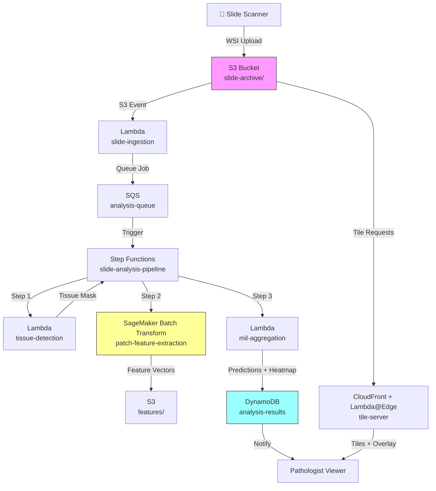

# Recipe 9.8 Architecture and Implementation: Pathology Slide Analysis

*Companion to [Recipe 9.8: Pathology Slide Analysis](chapter09.08-pathology-slide-analysis). This page covers the AWS architecture, services, prerequisites, and pseudocode. For the problem framing and the conceptual approach, start with the main recipe.*

---

## The AWS Implementation

### Why These Services

**Amazon S3 for slide storage.** Whole slide images are large (2-5 GB each), write-once, and read-many. S3 provides durable, encrypted storage with lifecycle policies to tier older slides to cheaper storage classes. The S3 access patterns (random byte-range reads for tile serving) are well-supported. For on-premises scanners, use AWS DataSync or Storage Gateway to handle the transfer reliably; budget 100+ Mbps dedicated bandwidth for a lab processing 200+ slides per day.

**AWS Lambda for lightweight orchestration.** Triggering the analysis pipeline when a new slide arrives, coordinating steps, and handling notifications. Lambda is the glue, not the compute engine here.

**AWS Step Functions for pipeline orchestration.** The multi-step analysis pipeline (tissue detection, patch extraction, feature extraction, aggregation) has dependencies, error handling needs, and variable execution times. Step Functions provides the state machine to manage this reliably.

**Amazon SageMaker for model inference.** Feature extraction on 10,000-50,000 patches per slide requires GPU compute. SageMaker endpoints (or SageMaker batch transform for non-real-time workloads) provide managed GPU inference with auto-scaling. For pathology workloads, batch transform is often more cost-effective: you don't need sub-second latency, and slides can be processed asynchronously.

**Amazon DynamoDB for metadata and results.** Case metadata, processing status, and structured results (predictions, confidence scores, attention weights) are stored for fast lookup by case ID or slide ID.

**Amazon CloudFront + S3 for tile serving.** The pathologist's viewer needs fast access to image tiles. CloudFront caches frequently accessed tiles (the regions the AI flagged) close to the viewer for low-latency display. Because slide tiles and heatmap overlays are PHI, the distribution must use Origin Access Control (OAC) with signed URLs or signed cookies to restrict access to authenticated pathologist sessions. Public CloudFront distributions are not acceptable here. Configure TTLs to expire cached tiles after the viewing session ends.

**Amazon SQS for work queue management.** Slides arrive throughout the day. A queue decouples slide arrival from processing capacity, enabling smooth scaling without dropped work. Configure a dead letter queue (DLQ) with a `maxReceiveCount` of 3 so slides that repeatedly fail processing move aside for manual investigation rather than cycling indefinitely. Monitor DLQ depth via CloudWatch alarm: a growing DLQ indicates a systemic issue (new scanner format, model degradation, infrastructure problem).

### Architecture Diagram



### Prerequisites

| Requirement | Details |
|-------------|---------|
| **AWS Services** | Amazon S3, AWS Lambda, AWS Step Functions, Amazon SageMaker, Amazon DynamoDB, Amazon SQS, Amazon CloudFront |
| **IAM Permissions** | `s3:GetObject`, `s3:PutObject`, `sagemaker:InvokeEndpoint`, `sagemaker:CreateTransformJob`, `dynamodb:PutItem`, `dynamodb:GetItem`, `sqs:SendMessage`, `sqs:ReceiveMessage`, `states:StartExecution`. Distribute across separate roles per component: ingestion Lambda (S3 read, DynamoDB write, SQS send), Step Functions execution role (SageMaker, S3 read/write, DynamoDB write), tile-serving Lambda@Edge (S3 read only). |
| **BAA** | AWS BAA signed (pathology slides are PHI) |
| **Encryption** | S3: SSE-KMS; DynamoDB: encryption at rest; SageMaker: KMS for model artifacts and data, inter-container traffic encryption enabled (`EnableInterContainerTrafficEncryption=True`); all transit over TLS |
| **VPC** | Production: SageMaker in VPC with VPC endpoints for S3 (gateway), DynamoDB (gateway), SQS (interface), SageMaker Runtime (interface), SageMaker API (interface), ECR (interface, for container image pulls), CloudWatch Logs (interface). Lambda functions in VPC with appropriate endpoints. Missing ECR endpoints are the most common cause of batch transform job failures in VPC-isolated deployments. |
| **CloudTrail** | Enabled: log all S3, SageMaker, and DynamoDB API calls for HIPAA audit |
| **GPU Instances** | SageMaker: ml.g4dn.xlarge (single slide) or ml.g5.2xlarge (batch). Feature extraction is GPU-bound. |
| **Sample Data** | TCGA (The Cancer Genome Atlas) provides public whole slide images for development. Camelyon16/17 challenge datasets for breast cancer metastasis detection. Never use patient slides in dev without IRB approval and de-identification. |
| **Cost Estimate** | ~$2.50-$8.00 per slide depending on tissue area and GPU instance type. Dominated by SageMaker inference time (5-20 min per slide on ml.g4dn.xlarge). Storage: ~$0.10/slide/month on S3 Standard, less on Glacier. |

### Ingredients

| AWS Service | Role |
|------------|------|
| **Amazon S3** | Stores whole slide images, extracted features, and heatmap overlays |
| **AWS Lambda** | Orchestrates ingestion, tissue detection, and lightweight aggregation |
| **AWS Step Functions** | Manages the multi-step analysis pipeline with error handling and retries |
| **Amazon SageMaker** | Runs GPU-accelerated feature extraction on patch batches |
| **Amazon DynamoDB** | Stores case metadata, processing status, and structured predictions |
| **Amazon SQS** | Queues slides for processing, decoupling arrival from compute capacity |
| **Amazon CloudFront** | Caches and serves image tiles to the pathologist viewer with low latency |
| **AWS KMS** | Manages encryption keys for all data at rest |
| **Amazon CloudWatch** | Monitors pipeline latency, GPU utilization, and error rates |

### Code

#### Walkthrough

**Step 1: Slide ingestion and metadata extraction.** When a whole slide image arrives in the storage bucket, the system registers it, extracts basic metadata (scanner type, magnification, dimensions, stain type), and queues it for analysis. This step validates that the file is a supported format and that the image dimensions are within expected bounds. A corrupted or truncated upload gets flagged immediately rather than failing halfway through a 20-minute GPU job. Skip this step and you'll waste expensive GPU time on files that were never going to process successfully.

```pseudocode
FUNCTION ingest_slide(bucket, key):
    // Read the slide file header to extract metadata without loading the full image.
    // WSI formats store metadata (dimensions, magnification, scanner info) in the header.
    metadata = read_wsi_header(bucket, key)

    // Validate the slide is processable
    IF metadata.format NOT IN ["svs", "ndpi", "tiff", "dicom"]:
        RAISE UnsupportedFormatError(metadata.format)

    IF metadata.width < 10000 OR metadata.height < 10000:
        RAISE SuspiciouslySmallSlide(metadata.dimensions)
        // A real WSI at 20x+ should be at least 10K pixels per side.
        // Smaller likely means a thumbnail or corrupted file.

    // Register the slide in the metadata store
    slide_id = generate_unique_id()
    write to database "slide-metadata":
        slide_id     = slide_id
        s3_path      = bucket + "/" + key
        scanner      = metadata.scanner_model
        magnification = metadata.objective_power    // e.g., 20 or 40
        width        = metadata.width
        height       = metadata.height
        stain        = metadata.stain_type          // H&E, IHC, special stain
        status       = "QUEUED"
        ingested_at  = current UTC timestamp

    // Queue for analysis
    send message to analysis queue:
        slide_id = slide_id
        s3_path  = bucket + "/" + key
        priority = determine_priority(metadata)     // STAT cases get higher priority

    RETURN slide_id
```

**Step 2: Tissue detection.** Most of a glass slide is empty: clear glass with no tissue. Processing empty regions wastes compute and introduces noise. This step generates a binary tissue mask at low resolution (typically the lowest pyramid level, around 1000x1000 pixels) to identify where tissue actually exists. The approach is straightforward: convert to a color space where tissue is distinguishable from background (HSV or LAB), apply Otsu thresholding, and clean up with morphological operations. The output is a mask that tells the patch extraction step which coordinates to process. Skip this and you'll extract 3-5x more patches than necessary, most of which are blank glass.

```pseudocode
FUNCTION detect_tissue(slide_id, s3_path):
    // Read the lowest resolution level of the pyramidal image.
    // This is typically 16x-64x downsampled from the full resolution.
    // At this scale, the entire slide fits in memory as a small image.
    thumbnail = read_pyramid_level(s3_path, level="lowest")
    // Result: roughly 1000x1000 pixel image of the entire slide

    // Convert to HSV color space.
    // In HSV, tissue (pink/purple from H&E stain) has distinct saturation values
    // compared to background glass (white/near-white, low saturation).
    hsv_image = convert_to_hsv(thumbnail)

    // Apply Otsu thresholding on the saturation channel.
    // Otsu automatically finds the optimal threshold to separate two populations
    // (tissue vs. background) without manual tuning.
    saturation_channel = hsv_image.saturation
    threshold = otsu_threshold(saturation_channel)
    tissue_mask = saturation_channel > threshold

    // Morphological cleanup: remove small noise regions, fill small holes.
    // A speck of dust is not tissue. A small hole in tissue is still tissue.
    tissue_mask = morphological_close(tissue_mask, kernel_size=5)
    tissue_mask = remove_small_objects(tissue_mask, min_size=100)

    // Calculate tissue percentage for quality metrics
    tissue_fraction = count_nonzero(tissue_mask) / total_pixels(tissue_mask)

    IF tissue_fraction < 0.05:
        // Less than 5% tissue is suspicious. Might be a blank slide or failed scan.
        flag_for_review(slide_id, reason="very_low_tissue_fraction")

    // Store the tissue mask for the next step
    save_mask(slide_id, tissue_mask)

    RETURN tissue_mask, tissue_fraction
```

**Step 3: Patch extraction coordinates.** Given the tissue mask, this step determines which patches to extract from the full-resolution image. It maps the low-resolution mask back to full-resolution coordinates and generates a list of (x, y) positions for each patch that overlaps with tissue. The patch size and magnification level are configurable: 256x256 at 20x is standard for many tasks, but some applications benefit from larger patches or higher magnification. The output is a manifest of patch coordinates that the feature extraction step will process.

```pseudocode
PATCH_SIZE = 256          // pixels per patch side
TARGET_MAGNIFICATION = 20  // 20x objective magnification
OVERLAP = 0               // no overlap between patches (common for efficiency)

FUNCTION generate_patch_coordinates(slide_id, tissue_mask, slide_metadata):
    // Calculate the scaling factor between the tissue mask and full resolution.
    // If the mask is 1000x1000 and the slide is 100,000x100,000, scale = 100.
    scale_x = slide_metadata.width / tissue_mask.width
    scale_y = slide_metadata.height / tissue_mask.height

    // Determine the read level for the target magnification.
    // If the slide was scanned at 40x and we want 20x, we read at level 1 (2x downsample).
    downsample = slide_metadata.magnification / TARGET_MAGNIFICATION
    read_level = find_closest_pyramid_level(downsample)

    patch_coordinates = empty list

    // Walk a grid across the tissue mask
    FOR y FROM 0 TO tissue_mask.height STEP (PATCH_SIZE / scale_y):
        FOR x FROM 0 TO tissue_mask.width STEP (PATCH_SIZE / scale_x):

            // Check if this grid cell overlaps with tissue
            mask_region = tissue_mask[y : y + patch_height, x : x + patch_width]
            tissue_overlap = count_nonzero(mask_region) / size(mask_region)

            IF tissue_overlap > 0.5:
                // At least 50% of this patch is tissue. Include it.
                // Convert mask coordinates back to full-resolution coordinates.
                full_res_x = x * scale_x
                full_res_y = y * scale_y

                append to patch_coordinates:
                    { x: full_res_x, y: full_res_y,
                      width: PATCH_SIZE, height: PATCH_SIZE,
                      level: read_level }

    // Store the manifest
    save_patch_manifest(slide_id, patch_coordinates)

    RETURN patch_coordinates
    // Typical output: 10,000 - 50,000 patch coordinates per slide
```

**Step 4: Feature extraction (GPU-intensive).** This is the computational core. Each patch is read from the WSI, preprocessed (normalized, resized if needed), and passed through a pre-trained feature extractor (typically a vision transformer or ResNet variant trained on pathology data). The output is a feature vector per patch (512-2048 dimensions). For a slide with 30,000 patches, this produces a feature matrix of shape [30000, feature_dim]. This step runs on GPU and dominates the total processing time. Batch processing (feeding multiple patches through the model simultaneously) is critical for throughput.

```pseudocode
BATCH_SIZE = 64           // patches per GPU batch
FEATURE_DIM = 1024        // output dimension of the feature extractor

FUNCTION extract_features(slide_id, s3_path, patch_coordinates):
    // Load the pre-trained pathology feature extractor.
    // This is a model trained on millions of pathology patches via self-supervised learning.
    // It produces general-purpose tissue morphology features.
    model = load_pretrained_model("pathology-foundation-model")
    model.set_mode("inference")    // no gradient computation needed

    all_features = empty matrix [len(patch_coordinates), FEATURE_DIM]

    // Process patches in batches for GPU efficiency
    FOR batch_start FROM 0 TO len(patch_coordinates) STEP BATCH_SIZE:
        batch_coords = patch_coordinates[batch_start : batch_start + BATCH_SIZE]

        // Read patch pixels from the WSI file
        // This uses byte-range reads to extract specific regions without loading the full file
        patch_images = read_patches_from_wsi(s3_path, batch_coords)

        // Stain normalization: adjust colors to a reference standard.
        // Different labs/scanners produce different color profiles.
        // Without this, a model trained on Lab A's slides may fail on Lab B's slides.
        normalized_patches = stain_normalize(patch_images, method="macenko")
        // NOTE: In production, consider separating stain normalization (CPU-bound)
        // from feature extraction (GPU-bound) to improve GPU utilization.

        // Standard preprocessing: resize to model input size, normalize pixel values
        preprocessed = preprocess(normalized_patches,
                                  target_size=model.input_size,
                                  normalize="imagenet")

        // Run inference: extract feature vectors
        features = model.forward(preprocessed)
        // Shape: [batch_size, FEATURE_DIM]

        all_features[batch_start : batch_start + BATCH_SIZE] = features

    // Save features to storage for the aggregation step
    save_features(slide_id, all_features, patch_coordinates)

    RETURN all_features
```

**Step 5: MIL aggregation and classification.** The aggregation step takes the bag of patch features and produces slide-level predictions. An attention-based MIL model assigns importance weights to each patch and computes a weighted combination for classification. The attention weights are the key to interpretability: patches with high attention are the regions the model considers most diagnostic. The output includes both the prediction (e.g., "malignant, Gleason grade 4") and the attention heatmap for pathologist review. For slides with more than 30,000 patches, the feature matrix alone exceeds 120 MB; consider running aggregation on a lightweight SageMaker endpoint or Fargate task rather than Lambda for these outliers.

```pseudocode
FUNCTION aggregate_and_classify(slide_id, features, patch_coordinates):
    // Load the task-specific MIL classifier.
    // This is a lightweight model trained on slide-level labels (e.g., cancer vs. benign).
    // It takes the bag of patch features and produces a slide-level prediction.
    mil_model = load_model("breast-cancer-mil-classifier")

    // Run MIL inference
    // Input: feature matrix [num_patches, feature_dim]
    // Output: prediction logits + attention weights per patch
    prediction, attention_weights = mil_model.forward(features)

    // Convert logits to probabilities
    probabilities = softmax(prediction)
    // Example output: { "benign": 0.08, "malignant": 0.92 }

    predicted_class = argmax(probabilities)
    confidence = max(probabilities)

    // Generate the attention heatmap
    // Map attention weights back to slide coordinates for visualization
    heatmap = empty list
    FOR i FROM 0 TO len(patch_coordinates):
        append to heatmap:
            { x: patch_coordinates[i].x,
              y: patch_coordinates[i].y,
              attention: attention_weights[i],
              // Top-K patches become "regions of interest" for the pathologist
              is_roi: attention_weights[i] > percentile(attention_weights, 95) }

    // Store results
    write to database "analysis-results":
        slide_id         = slide_id
        prediction       = predicted_class
        confidence       = confidence
        class_probs      = probabilities
        num_patches      = len(patch_coordinates)
        top_regions      = filter(heatmap, where is_roi == true)
        heatmap_path     = save_heatmap_overlay(slide_id, heatmap)
        completed_at     = current UTC timestamp

    // Update slide status
    update database "slide-metadata" where slide_id = slide_id:
        status = "COMPLETED"

    RETURN predicted_class, confidence, heatmap
```

> **Curious how this looks in Python?** The pseudocode above covers the concepts. If you'd like to see sample Python code that demonstrates these patterns using boto3, check out the [Python Example](chapter09.08-python-example). It walks through each step with inline comments and notes on what you'd need to change for a real deployment.

### Expected Results

**Sample output for a breast biopsy slide:**

```json
{
  "slide_id": "WSI-2026-03-15-00847",
  "prediction": "malignant",
  "confidence": 0.94,
  "class_probabilities": {
    "benign": 0.06,
    "malignant": 0.94
  },
  "num_patches_analyzed": 28473,
  "tissue_fraction": 0.42,
  "processing_time_seconds": 847,
  "top_regions": [
    { "x": 45200, "y": 32100, "attention": 0.98, "patch_size": 256 },
    { "x": 45456, "y": 32100, "attention": 0.97, "patch_size": 256 },
    { "x": 44944, "y": 32356, "attention": 0.96, "patch_size": 256 }
  ],
  "heatmap_path": "s3://slide-results/heatmaps/WSI-2026-03-15-00847.png",
  "model_version": "breast-mil-v2.3",
  "completed_at": "2026-03-15T14:38:22Z"
}
```

**Performance benchmarks:**

| Metric | Typical Value |
|--------|---------------|
| End-to-end latency | 8-25 minutes per slide (GPU-dependent) |
| Feature extraction throughput | ~200 patches/second on ml.g4dn.xlarge |
| Classification accuracy (cancer detection) | 90-97% AUC depending on cancer type and dataset |
| Sensitivity (cancer present) | 92-98% at 90% specificity (task-dependent) |
| Cost per slide | $2.50-$8.00 (dominated by GPU time) |
| Storage per slide | 2-5 GB raw + ~50 MB features |

**Where it struggles:**

- Rare cancer subtypes with limited training data
- Slides with heavy artifacts (tissue folds, air bubbles, pen marks)
- Cases requiring immunohistochemistry (IHC) interpretation alongside H&E
- Grading tasks where inter-pathologist agreement is already low (e.g., certain breast cancer grades)
- Slides from scanners not represented in training data (stain/color shift)

<!-- TODO (TechWriter): RECIPE-GUIDE compliance. Missing "Why This Isn't Production-Ready" section between Expected Results and Variations. Add section covering production gaps (stain normalization across labs, model monitoring/drift, regulatory submission requirements, LIS integration). -->

---

## Variations and Extensions

**Tumor grading and subtyping.** Beyond binary cancer detection, train classifiers for specific grading systems (Gleason for prostate, Nottingham for breast, WHO grades for brain tumors). This requires grade-annotated training data and careful calibration against pathologist consensus.

**Biomarker prediction from H&E.** Recent research shows that certain molecular biomarkers (MSI status, HER2 expression, BRCA mutation status) can be predicted directly from H&E morphology without requiring expensive molecular testing. This is still research-stage for most biomarkers, but the clinical utility is enormous: predicting which patients need molecular testing vs. which can skip it.

**Multi-stain integration.** Many diagnostic workflows require multiple stains on serial sections (H&E plus 3-5 IHC stains). Building systems that integrate findings across stains, registering serial sections to align tissue regions, and combining predictions from multiple stain-specific models.

**Model versioning and safe deployment.** Use a model registry to track versions. Deploy new models in shadow mode (run inference but don't surface results to pathologists) for 2-4 weeks to compare performance against the production model on your specific scanner and stain profiles. For FDA-cleared indications, model updates may require a new 510(k) submission depending on the magnitude of the change.

---

## Additional Resources

**AWS Documentation:**
- [Amazon SageMaker Batch Transform](https://docs.aws.amazon.com/sagemaker/latest/dg/batch-transform.html)
- [Amazon SageMaker Inference Endpoints](https://docs.aws.amazon.com/sagemaker/latest/dg/deploy-model.html)
- [Amazon S3 Byte-Range Fetches](https://docs.aws.amazon.com/AmazonS3/latest/userguide/optimizing-performance.html)
- [AWS Step Functions Developer Guide](https://docs.aws.amazon.com/step-functions/latest/dg/welcome.html)
- [AWS HIPAA Eligible Services](https://aws.amazon.com/compliance/hipaa-eligible-services-reference/)
- [Amazon SageMaker Pricing](https://aws.amazon.com/sagemaker/pricing/)

**Public Datasets for Development:**
- [The Cancer Genome Atlas (TCGA)](https://www.cancer.gov/ccg/research/genome-sequencing/tcga): Thousands of whole slide images across cancer types, publicly available for research
- [Camelyon16 Challenge](https://camelyon16.grand-challenge.org/): Breast cancer metastasis detection in lymph node slides, standard benchmark dataset
- [PANDA Challenge (Prostate Cancer)](https://www.kaggle.com/c/prostate-cancer-grade-assessment): Prostate cancer Gleason grading dataset from Kaggle

**AWS Solutions and Blogs:**
- [Digital Pathology on AWS (Whitepaper)](https://aws.amazon.com/health/solutions/digital-pathology/): Reference architecture for whole slide image management and analysis on AWS
- [Machine Learning for Healthcare on AWS](https://aws.amazon.com/health/machine-learning/): Overview of AWS ML services applicable to healthcare imaging workloads

---

## Estimated Implementation Time

| Phase | Timeline |
|-------|----------|
| **Basic** (single cancer type, single scanner, research prototype) | 3-4 months |
| **Production-ready** (multi-scanner normalization, LIS integration, monitoring) | 8-12 months |
| **With variations** (multi-cancer, grading, biomarker prediction, FDA submission) | 18-24+ months |

---


---

*← [Main Recipe 9.8](chapter09.08-pathology-slide-analysis) · [Python Example](chapter09.08-python-example) · [Chapter Preface](chapter09-preface)*
