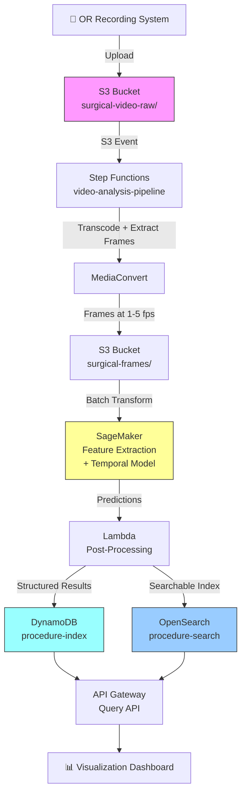

# Recipe 9.9 Architecture and Implementation: Surgical Video Analysis

*Companion to [Recipe 9.9: Surgical Video Analysis](chapter09.09-surgical-video-analysis). This page covers the AWS architecture, services, prerequisites, and pseudocode. For the problem framing and the conceptual approach, start with the main recipe.*

---

## The AWS Implementation

### Why These Services

**Amazon S3 for video storage.** Surgical video files are large (50-100 GB per procedure at full resolution) and write-once. S3 provides durable, encrypted storage with lifecycle policies to manage cost. Use S3 Intelligent-Tiering or transition to S3 Glacier for videos older than 90 days that aren't actively being analyzed. S3's multipart upload handles the large file sizes gracefully.

**AWS Elemental MediaConvert for video preprocessing.** Before ML analysis, you need to transcode surgical video into a consistent format, extract frames at your target sample rate, and optionally generate lower-resolution proxy copies for faster processing. MediaConvert handles format normalization and frame extraction as a managed service, avoiding the need to run FFmpeg on EC2 instances. MediaConvert accesses S3 via AWS-internal endpoints over TLS; data does not traverse the public internet. For organizations requiring all PHI processing within a VPC boundary, an alternative is running FFmpeg on a VPC-hosted EC2 instance or ECS task, at the cost of managing the compute infrastructure yourself.

**PHI de-identification during preprocessing.** Surgical video is dense with PHI that has nothing to do with the surgical analysis itself. Your preprocessing step must address four vectors before frames reach the ML pipeline:

1. **Audio track stripping.** OR conversations contain patient names, medical history, and team discussions. Since the visual analysis pipeline doesn't use audio at all, strip audio tracks entirely during the MediaConvert transcode step. This eliminates the densest single source of incidental PHI.

2. **Pre-incision footage.** Video recording often starts before draping, capturing the patient's face during positioning and intubation. Detect and either discard or redact frames preceding the first instrument appearance. A simple heuristic (color distribution shift from skin tones to blue drapes and pink tissue) works for coarse trimming; a trained face detection model handles edge cases.

3. **OR monitor overlay detection.** Many OR setups display patient demographics, vitals, or EMR data on monitors visible to the laparoscopic camera. Run OCR-based text detection on a frame sample during preprocessing. If text regions are detected, either crop them out (if they're in a consistent screen region) or blur them (if they're overlaid on the surgical field). Flag procedures where overlay content is detected for manual verification.

4. **Video file metadata sanitization.** Recording systems embed patient identifiers, MRN numbers, and procedure scheduling data in video file headers (DICOM metadata, MP4 user data atoms, MXF descriptive metadata). Strip all non-essential metadata during ingestion, preserving only technical fields needed for transcoding (codec, resolution, frame rate, duration).

**Amazon SageMaker for model training and batch inference.** Surgical video models require GPU compute for both training and inference. SageMaker provides managed training jobs with spot instance support (critical for the multi-day training runs these models require) and batch transform for processing video backlogs. For the feature extraction backbone, SageMaker's built-in support for PyTorch and distributed training across multiple GPUs is essential.

Be aware of cold start overhead with Batch Transform: provisioning a GPU instance and loading model artifacts takes 5-15 minutes per job. For medium volume (5-20 procedures per day), batch procedures together and run a single transform job every few hours to amortize that startup cost across multiple videos. For high volume (more than 20 procedures per day), deploy a persistent real-time SageMaker endpoint instead. The endpoint stays warm and processes new videos in seconds rather than waiting for instance provisioning. The tradeoff is paying for idle GPU time during off-hours, but at 20+ procedures daily the utilization justifies it. Factor the cold start overhead into your cost estimate: at low volume, the per-procedure cost is higher than the raw GPU inference time suggests because you're paying for 5-15 minutes of provisioning per job.

**AWS Step Functions for pipeline orchestration.** The video analysis pipeline has multiple stages with dependencies, error handling requirements, and variable execution times. A single procedure might take 15-60 minutes to process depending on length. Step Functions manages the state machine: trigger on video upload, run preprocessing, launch inference, handle failures with retries, and write results.

**Amazon DynamoDB for the structured index.** Phase timelines, instrument logs, and event flags are time-series data with procedure-level access patterns. DynamoDB's flexible schema handles the varying output structures across procedure types, and its query performance supports the interactive visualization use case.

**Amazon OpenSearch Service for full-text and temporal search.** When a quality committee wants to find "all cholecystectomies where the critical view of safety was not clearly achieved" or "cases with bleeding events during Calot's triangle dissection," you need a search engine that can handle structured queries across the procedure index. OpenSearch supports both keyword search on annotations and range queries on timestamps.

**Amazon CloudWatch for monitoring.** Processing pipelines for surgical video are long-running and resource-intensive. CloudWatch metrics track processing latency, GPU utilization, inference failures, and queue depth. Alarms catch stuck pipelines before the backlog grows.

### Architecture Diagram



### Prerequisites

| Requirement | Details |
|-------------|---------|
| **AWS Services** | Amazon S3, AWS Elemental MediaConvert, Amazon SageMaker, AWS Step Functions, Amazon DynamoDB, Amazon OpenSearch Service, AWS Lambda, Amazon API Gateway, Amazon CloudWatch |
| **IAM Permissions** | Three execution roles with scoped resource ARNs (see below) |
| **BAA** | AWS BAA signed (surgical video is PHI; even de-identified video may contain identifiable features) |
| **Encryption** | S3: SSE-KMS for all buckets; DynamoDB: encryption at rest; OpenSearch: encryption at rest and node-to-node encryption; all transit over TLS; SageMaker: volume encryption on training and inference instances |
| **VPC** | Production: SageMaker, OpenSearch, and Lambda in VPC with VPC endpoints for S3, DynamoDB, CloudWatch Logs, and Step Functions. OpenSearch domain must be VPC-only (no public endpoint for PHI data). Post-processing Lambda must be in the same VPC as the OpenSearch domain with security groups allowing HTTPS (443) to the OpenSearch domain's security group. |
| **CloudTrail** | Enabled: log all S3, SageMaker, and DynamoDB API calls for HIPAA audit trail |
| **GPU Instances** | SageMaker training: ml.p3.2xlarge or ml.g5.2xlarge minimum. Batch inference: ml.g5.xlarge. Budget for multi-day training runs. |
| **Sample Data** | Public surgical video datasets: Cholec80 (80 cholecystectomy videos with phase annotations), m2cai16 (tool and phase annotations), CholecSeg8k (semantic segmentation). These are research datasets. Real patient video requires IRB approval and proper de-identification. |
| **Cost Estimate** | Processing: ~$2.50-$8.00 per procedure (MediaConvert + SageMaker inference; add ~$0.50-$1.50 amortized cold start for low-volume Batch Transform). Training: ~$500-$2,000 per model training run (multi-day GPU). Storage: ~$1-2/month per procedure (S3 Intelligent-Tiering). OpenSearch: ~$200-500/month for a small domain. |

**IAM Role Breakdown:**

| Role | Permissions | Resource Scope |
|------|------------|----------------|
| **Step Functions Execution Role** | `states:StartExecution`, `lambda:InvokeFunction`, `sagemaker:CreateTransformJob`, `sagemaker:DescribeTransformJob`, `mediaconvert:CreateJob`, `mediaconvert:GetJob`, `events:PutTargets`, `logs:CreateLogGroup`, `logs:PutLogEvents` | Scoped to specific Lambda ARNs, SageMaker transform job prefix `feat-proc-*`, MediaConvert queue ARN |
| **Lambda Execution Role** (post-processing) | `s3:GetObject` (frames/features buckets), `s3:PutObject` (frames bucket, manifests only), `dynamodb:PutItem`, `dynamodb:UpdateItem`, `dynamodb:Query` (procedure-index and procedure-registry tables), `es:ESHttpPost`, `es:ESHttpGet` (OpenSearch domain ARN), `kms:Decrypt`, `kms:GenerateDataKey` (specific KMS key ARNs), `logs:CreateLogGroup`, `logs:PutLogEvents`, `sqs:SendMessage` (DLQ ARN) | Resource ARNs for each specific table, bucket prefix, OpenSearch domain, and KMS key. No wildcard resources. |
| **SageMaker Execution Role** | `s3:GetObject` (frames bucket, model artifacts bucket), `s3:PutObject` (features bucket), `s3:ListBucket` (frames bucket), `kms:Decrypt`, `kms:GenerateDataKey` (volume encryption key), `logs:CreateLogGroup`, `logs:PutLogEvents` | Scoped to specific S3 bucket ARNs and prefixes. No DynamoDB, no OpenSearch, no Lambda invoke. |

### Ingredients

| AWS Service | Role |
|------------|------|
| **Amazon S3** | Stores raw surgical video and extracted frames; lifecycle policies manage cost |
| **AWS Elemental MediaConvert** | Transcodes video to consistent format; extracts frames at target sample rate |
| **Amazon SageMaker** | Trains video analysis models (GPU); runs batch inference on new procedures |
| **AWS Step Functions** | Orchestrates the multi-stage pipeline with error handling and retries |
| **Amazon DynamoDB** | Stores structured procedure index (phases, instruments, events) |
| **Amazon OpenSearch Service** | Enables search across procedure annotations and temporal queries |
| **AWS Lambda** | Post-processing logic, API handlers, pipeline glue |
| **Amazon API Gateway** | REST API for querying procedure index and search |
| **Amazon CloudWatch** | Monitoring, metrics, and alarms for pipeline health |
| **AWS KMS** | Encryption key management for all data stores |

### Code

#### Walkthrough

**Step 1: Video ingestion and metadata registration.** When a surgical video arrives from the OR recording system, the pipeline registers it with metadata (procedure type, date, surgeon identifier, duration) and triggers processing. The video lands in an encrypted S3 bucket, and an S3 event notification kicks off the Step Functions state machine. This separation between storage and processing is important: if the analysis pipeline is down or backed up, videos still land safely and get processed when capacity is available. Skip this step (process inline during upload) and you risk losing video data if the processing pipeline fails.

```pseudocode
FUNCTION ingest_video(video_file, metadata):
    // Generate a unique identifier for this procedure.
    // This ID links the raw video, extracted frames, and analysis results.
    procedure_id = generate unique ID (e.g., UUID)

    // Upload the video to encrypted storage.
    // Surgical video files are large (50-100 GB), so use multipart upload.
    upload video_file to S3 bucket "surgical-video-raw/"
        with key: "{procedure_id}/raw_video.mp4"
        with encryption: SSE-KMS
        with metadata: procedure_type, surgeon_id, procedure_date

    // Register the procedure in the tracking database.
    // Status starts as "ingested" and progresses through the pipeline.
    write to DynamoDB table "procedure-registry":
        procedure_id    = procedure_id
        status          = "ingested"
        procedure_type  = metadata.procedure_type
        surgeon_id      = metadata.surgeon_id
        procedure_date  = metadata.procedure_date
        video_duration  = metadata.duration_seconds
        ingested_at     = current UTC timestamp

    // Trigger the analysis pipeline.
    start Step Functions execution with input:
        procedure_id = procedure_id
        video_key    = "{procedure_id}/raw_video.mp4"
        procedure_type = metadata.procedure_type

    RETURN procedure_id
```

**Step 2: Frame extraction and preprocessing.** Raw surgical video at 30 fps contains far more temporal redundancy than the analysis models need. Phase transitions happen over seconds, not frames. This step extracts frames at a configurable sample rate (typically 1 fps for phase recognition, up to 5 fps for instrument detection), resizes them to the model's expected input resolution, and filters out non-informative frames (black frames from camera disconnection, completely obscured frames from lens fogging). The output is a sequence of clean, consistently-sized frames ready for feature extraction. Skip this step and you'll burn 30x more GPU compute on redundant frames with no accuracy improvement.

```pseudocode
FUNCTION extract_frames(procedure_id, video_key, sample_rate_fps):
    // Use a managed transcoding service to extract frames.
    // This avoids running FFmpeg on EC2 and handles format inconsistencies
    // across different OR recording systems.
    create MediaConvert job:
        input: S3 object at video_key
        output: S3 bucket "surgical-frames/{procedure_id}/"
        settings:
            frame_rate: sample_rate_fps        // typically 1-5 fps
            output_format: JPEG                // individual frame images
            resolution: 224x224 or 384x384     // match model input size
            // Some OR systems record in unusual formats or codecs.
            // MediaConvert normalizes these automatically.

    // Wait for the transcoding job to complete.
    // A 45-minute video at 1 fps produces ~2,700 frames.
    wait for job completion (poll or use EventBridge)

    // Filter out non-informative frames.
    // Black frames occur when the camera is disconnected or the light source is off.
    // Completely white/washed-out frames occur from lens fogging or direct light.
    frame_list = list all frames in "surgical-frames/{procedure_id}/"
    valid_frames = empty list

    FOR each frame in frame_list:
        pixel_stats = compute mean and standard deviation of pixel values
        IF pixel_stats.mean < 10:
            SKIP  // black frame (camera off or disconnected)
        IF pixel_stats.std < 5:
            SKIP  // uniform frame (lens cap, complete fog, or saturation)
        append frame to valid_frames

    // Write the valid frame manifest for downstream processing.
    write valid_frames list to S3: "surgical-frames/{procedure_id}/manifest.json"

    RETURN count of valid_frames
```

**Step 3: Feature extraction.** Each valid frame passes through a convolutional neural network (the "backbone") that compresses the visual information into a compact feature vector. Think of this as translating each frame from "millions of pixel values" into "a few thousand numbers that capture what's visually important." The backbone is typically a ResNet-50 or similar architecture pretrained on ImageNet (general image recognition) and then fine-tuned on surgical video data. Fine-tuning is critical: a model trained only on natural images doesn't understand that "pink tissue with a metal instrument" is the normal state of affairs in surgery. This step is the most GPU-intensive per-frame operation, but it only needs to run once per frame. The extracted features are cached for use by multiple downstream models.

```pseudocode
FUNCTION extract_features(procedure_id, frame_manifest):
    // Load the fine-tuned feature extraction model.
    // This is a CNN backbone (e.g., ResNet-50) trained on surgical video.
    // The final classification layer is removed; we want the feature vector,
    // not a class prediction.
    model = load pretrained surgical feature extractor

    features = empty list (will hold one feature vector per frame)

    // Process frames in batches for GPU efficiency.
    // Batch size depends on GPU memory; 32-64 frames per batch is typical.
    FOR each batch of frames from frame_manifest:
        // Load frame images and normalize pixel values.
        // Normalization uses the same mean/std as the training data.
        images = load and normalize batch of frame images from S3

        // Forward pass through the CNN backbone.
        // Output shape: [batch_size, feature_dim] where feature_dim is typically 2048.
        batch_features = model.forward(images)  // GPU operation

        append batch_features to features

    // Save the feature sequence to S3 for temporal modeling.
    // This is much smaller than the raw frames: ~8 KB per frame vs. ~150 KB per frame.
    save features array to S3: "surgical-features/{procedure_id}/features.npy"

    RETURN feature array shape (num_frames, feature_dim)
```

**Step 4: Temporal modeling and multi-task prediction.** This is where the system reasons across time. The sequence of frame features (from Step 3) passes through a temporal model that considers the full context of the procedure to make predictions at each time point. A transformer-based architecture attends to all frames simultaneously, learning patterns like "this visual pattern following that visual pattern usually means we're transitioning from dissection to clipping." The model outputs predictions for multiple tasks: surgical phase, instrument presence, and (if trained for it) anatomy visibility. Joint prediction helps because the tasks constrain each other. You wouldn't expect to see a clip applier during the initial port placement phase. Skip this step and use only frame-level predictions, and you'll get noisy, temporally inconsistent results that flicker between phases every few frames.

```pseudocode
FUNCTION temporal_prediction(procedure_id, features):
    // Load the temporal model (transformer or TCN).
    // This model was trained on annotated surgical video sequences.
    // It takes a sequence of frame features and outputs per-frame predictions.
    temporal_model = load trained temporal model for procedure_type

    // Run inference on the full feature sequence.
    // Input shape: [1, num_frames, feature_dim]
    // Output: per-frame predictions for each task
    predictions = temporal_model.forward(features)

    // predictions contains:
    //   phase_logits: [num_frames, num_phases]       - probability of each phase per frame
    //   instrument_logits: [num_frames, num_instruments]  - probability of each instrument per frame
    //   event_logits: [num_frames, num_event_types]  - probability of each event type per frame

    // Convert logits to probabilities and class predictions.
    phase_predictions = argmax(softmax(predictions.phase_logits), axis=1)
    phase_confidences = max(softmax(predictions.phase_logits), axis=1)

    instrument_predictions = sigmoid(predictions.instrument_logits) > 0.5  // multi-label
    instrument_confidences = sigmoid(predictions.instrument_logits)

    event_predictions = sigmoid(predictions.event_logits) > 0.3  // lower threshold for events
    event_confidences = sigmoid(predictions.event_logits)

    RETURN {
        phases: phase_predictions with confidences,
        instruments: instrument_predictions with confidences,
        events: event_predictions with confidences,
        frame_timestamps: computed from frame indices and sample_rate
    }
```

**Step 5: Temporal post-processing.** Raw per-frame predictions from the temporal model are still noisy at phase boundaries. A phase might flicker for a few frames, or a brief instrument occlusion might cause a false "instrument absent" prediction. Post-processing applies domain knowledge to clean up the predictions: minimum phase duration constraints (a surgical phase can't last 2 seconds), transition smoothing (median filtering over a window), and impossible transition elimination (you can't go from "extraction" back to "initial dissection"). This step dramatically improves the usability of the output. Without it, the phase timeline would have dozens of spurious micro-transitions that make no surgical sense.

```pseudocode
FUNCTION post_process(raw_predictions, sample_rate_fps):
    // --- Phase smoothing ---
    // Apply median filter to remove single-frame phase flickers.
    // Window size of 15 frames at 1 fps = 15 seconds of smoothing.
    smoothed_phases = median_filter(raw_predictions.phases, window=15)

    // Enforce minimum phase duration.
    // No surgical phase lasts less than 30 seconds in practice.
    MIN_PHASE_DURATION = 30 * sample_rate_fps  // 30 seconds worth of frames

    segments = identify contiguous segments of same phase in smoothed_phases
    FOR each segment in segments:
        IF segment.duration < MIN_PHASE_DURATION:
            // Merge this short segment into the surrounding phase.
            // Use the phase of the longer neighbor.
            merge segment into longer adjacent segment

    // --- Instrument smoothing ---
    // Brief instrument disappearances (< 3 seconds) are likely occlusion, not removal.
    FOR each instrument_type:
        fill gaps shorter than 3 * sample_rate_fps frames

    // --- Build phase timeline ---
    phase_timeline = empty list
    FOR each contiguous phase segment:
        append to phase_timeline: {
            phase_name: segment.phase_label,
            start_time: segment.start_frame / sample_rate_fps,  // seconds
            end_time: segment.end_frame / sample_rate_fps,
            duration: (segment.end_frame - segment.start_frame) / sample_rate_fps,
            confidence: mean confidence of frames in segment
        }

    // --- Build event list ---
    events = empty list
    FOR each detected event:
        append to events: {
            event_type: event.label,
            timestamp: event.frame / sample_rate_fps,
            confidence: event.confidence,
            context: surrounding phase at that timestamp
        }

    RETURN {
        phase_timeline: phase_timeline,
        instrument_log: instrument presence intervals,
        events: events,
        total_duration: total frames / sample_rate_fps
    }
```

**Step 6: Store structured index and enable search.** The post-processed results become a structured, queryable record of the procedure. This step writes the phase timeline, instrument usage, and events to both a fast-lookup store (DynamoDB for procedure-level queries) and a search index (OpenSearch for cross-procedure queries). The dual-write pattern serves different access patterns: "show me the timeline for procedure X" hits DynamoDB; "find all procedures where bleeding occurred during Calot's triangle dissection" hits OpenSearch. Skip the search index and you lose the ability to do population-level quality analysis, which is half the value of automated video analysis.

```pseudocode
FUNCTION store_results(procedure_id, analysis_results):
    // Write the full procedure analysis to DynamoDB.
    // This supports fast lookup by procedure_id.
    write to DynamoDB table "procedure-index":
        procedure_id    = procedure_id
        status          = "analyzed"
        analyzed_at     = current UTC timestamp
        phase_timeline  = analysis_results.phase_timeline
        instrument_log  = analysis_results.instrument_log
        events          = analysis_results.events
        total_duration  = analysis_results.total_duration
        model_version   = current model version identifier

    // Index in OpenSearch for cross-procedure search.
    // IMPORTANT: Store only the pseudonymized surgeon identifier in the
    // general search index. The real surgeon_id lives in a separate
    // restricted lookup table with its own access controls.
    pseudonym = lookup_or_create_pseudonym(metadata.surgeon_id)

    // Flatten the timeline into searchable documents.
    FOR each phase in analysis_results.phase_timeline:
        index in OpenSearch "procedure-phases":
            procedure_id  = procedure_id
            phase_name    = phase.phase_name
            start_time    = phase.start_time
            end_time      = phase.end_time
            duration      = phase.duration
            confidence    = phase.confidence
            procedure_type = metadata.procedure_type
            surgeon_pseudonym = pseudonym
            procedure_date = metadata.procedure_date

    FOR each event in analysis_results.events:
        index in OpenSearch "procedure-events":
            procedure_id  = procedure_id
            event_type    = event.event_type
            timestamp     = event.timestamp
            confidence    = event.confidence
            phase_context = event.context
            procedure_type = metadata.procedure_type
            surgeon_pseudonym = pseudonym

    // Update the procedure registry status.
    update DynamoDB "procedure-registry" where procedure_id:
        status = "complete"
        completed_at = current UTC timestamp

    RETURN success
```

**Access control model for surgeon-identifiable performance data.** Surgical video analysis produces data that, when aggregated, becomes individual performance measurement. This is legally and ethically sensitive. Many states have peer review protection statutes that shield quality improvement data from legal discovery, but only if the data is handled through proper peer review channels. Your access control model must account for this:

1. **Pseudonymize surgeon identity in the search index.** The OpenSearch indices above store a `surgeon_pseudonym` (a random, stable identifier) rather than the actual surgeon_id. This allows population-level queries ("average dissection time across all surgeons") without exposing individual identity to everyone with search access.

2. **Separate restricted lookup table.** A DynamoDB table (or a dedicated IAM-protected API) maps `surgeon_pseudonym` to the actual `surgeon_id`. Access to this table requires an additional IAM role that only designated roles hold (department chair, quality committee members, credentialing staff).

3. **Role-based access tiers:**
   - *General analytics access:* Can search procedures by type, phase, event, and date. Sees pseudonymized surgeon identifiers only. Sufficient for quality improvement dashboards and aggregate reporting.
   - *Peer review access:* Can resolve surgeon pseudonyms to real identifiers. Limited to credentialed peer reviewers operating under the institution's peer review committee charter. Access grants are time-bounded and tied to specific review activities.
   - *Administrative access:* Full access for system administrators who manage the pipeline. Does not imply clinical peer review authority.

4. **Audit logging for identity resolution.** Every query that resolves a surgeon pseudonym to a real identity must be logged via CloudTrail. The audit log captures who resolved the identity, when, and under what authorization context (which peer review committee meeting, which credentialing action). This audit trail is essential for maintaining peer review protection.

5. **Legal counsel review required.** Peer review protection statutes vary significantly by state. Some states protect only data generated through formal peer review processes; others extend protection to quality improvement data more broadly. Your institution's legal counsel must review the access control model and confirm that the data handling qualifies for protection under applicable state law before the system goes live. This is not optional, and it is not something your engineering team should interpret independently.

**OpenSearch index mappings.** For the two indices referenced above, here are the field mappings that support the temporal query patterns this pipeline needs:

```json
{
  "procedure-phases": {
    "mappings": {
      "properties": {
        "procedure_id":       { "type": "keyword" },
        "phase_name":         { "type": "keyword" },
        "procedure_type":     { "type": "keyword" },
        "surgeon_pseudonym":  { "type": "keyword" },
        "procedure_date":     { "type": "date", "format": "yyyy-MM-dd" },
        "start_time":         { "type": "float" },
        "end_time":           { "type": "float" },
        "duration":           { "type": "float" },
        "confidence":         { "type": "float" }
      }
    }
  }
}
```

```json
{
  "procedure-events": {
    "mappings": {
      "properties": {
        "procedure_id":       { "type": "keyword" },
        "event_type":         { "type": "keyword" },
        "procedure_type":     { "type": "keyword" },
        "surgeon_pseudonym":  { "type": "keyword" },
        "procedure_date":     { "type": "date", "format": "yyyy-MM-dd" },
        "timestamp":          { "type": "float" },
        "confidence":         { "type": "float" },
        "phase_context":      { "type": "keyword" }
      }
    }
  }
}
```

The temporal query pattern ("find events that occurred within a specific phase's time range") works because each event carries its `phase_context` as a keyword field. You can query directly on `phase_context` rather than doing a range join between the two indices. For more complex temporal queries (events within a custom time window that doesn't align with phase boundaries), use `timestamp` range filters on the `procedure-events` index.

**Failure handling and recovery.** Long-running pipelines fail. MediaConvert jobs time out, SageMaker instances get preempted, Lambda functions hit memory limits on unusually long procedures. Your Step Functions state machine needs a catch-all error state that handles any unrecoverable failure:

```pseudocode
// Step Functions Catch-All Error Handler (applied to the state machine)
ON ANY unhandled error in any state:
    // Write the failure details to a Dead Letter Queue.
    // This captures the procedure_id, the failed step, and the error message
    // so an operator (or automated retry) can investigate.
    send to SQS DLQ "surgical-pipeline-dlq":
        procedure_id  = execution_input.procedure_id
        failed_step   = current_state_name
        error_type    = error.type
        error_message = error.message
        failed_at     = current UTC timestamp
        execution_arn = current execution ARN

    // Update the procedure registry so the status reflects the failure.
    update DynamoDB "procedure-registry" where procedure_id:
        status = "failed"
        failure_step = current_state_name
        failure_message = error.message
        failed_at = current UTC timestamp

// CloudWatch Alarm on DLQ depth.
// If messages accumulate in the DLQ, the pipeline has a systemic issue.
ALARM: "surgical-pipeline-failures"
    metric: ApproximateNumberOfMessagesVisible on DLQ
    threshold: >= 3 over 15 minutes
    action: notify on-call via SNS

// Scheduled Lambda: scan for stuck procedures.
// Runs every 30 minutes. Catches cases where Step Functions itself hangs
// (rare but possible with service disruptions).
FUNCTION scan_stuck_procedures():
    stuck = query DynamoDB "procedure-registry" WHERE:
        status IN ("ingested", "extracting_frames", "analyzing")
        AND last_updated < (now - 2 hours)

    FOR each stuck procedure:
        IF retry_count < 3:
            // Re-trigger the pipeline from the stuck step.
            restart Step Functions execution for procedure_id
            increment retry_count in registry
        ELSE:
            // Exhausted retries. Send to DLQ for manual investigation.
            send to SQS DLQ with reason = "exceeded_max_retries"
```

> **Curious how this looks in Python?** The pseudocode above covers the concepts. If you'd like to see sample Python code that demonstrates these patterns using boto3, check out the [Python Example](chapter09.09-python-example). It walks through each step with inline comments and notes on what you'd need to change for a real deployment.

### Expected Results

**Sample output for a laparoscopic cholecystectomy:**

```json
{
  "procedure_id": "proc-2026-05-15-a8f3c",
  "procedure_type": "laparoscopic_cholecystectomy",
  "total_duration_seconds": 2847,
  "phase_timeline": [
    {
      "phase_name": "port_placement",
      "start_time": 0,
      "end_time": 185,
      "duration": 185,
      "confidence": 0.94
    },
    {
      "phase_name": "initial_dissection",
      "start_time": 185,
      "end_time": 612,
      "duration": 427,
      "confidence": 0.91
    },
    {
      "phase_name": "calot_triangle_dissection",
      "start_time": 612,
      "end_time": 1340,
      "duration": 728,
      "confidence": 0.87
    },
    {
      "phase_name": "clipping_and_cutting",
      "start_time": 1340,
      "end_time": 1523,
      "duration": 183,
      "confidence": 0.93
    },
    {
      "phase_name": "gallbladder_separation",
      "start_time": 1523,
      "end_time": 2410,
      "duration": 887,
      "confidence": 0.89
    },
    {
      "phase_name": "extraction_and_inspection",
      "start_time": 2410,
      "end_time": 2847,
      "duration": 437,
      "confidence": 0.92
    }
  ],
  "events": [
    {
      "event_type": "bleeding_minor",
      "timestamp": 892,
      "confidence": 0.72,
      "context": "calot_triangle_dissection"
    },
    {
      "event_type": "clip_placement",
      "timestamp": 1355,
      "confidence": 0.96,
      "context": "clipping_and_cutting"
    },
    {
      "event_type": "clip_placement",
      "timestamp": 1378,
      "confidence": 0.94,
      "context": "clipping_and_cutting"
    }
  ],
  "model_version": "cholec-phase-v2.3"
}
```

**Performance benchmarks:**

| Metric | Typical Value |
|--------|---------------|
| Phase recognition accuracy | 85-92% (on Cholec80 benchmark) |
| Instrument detection mAP | 70-85% (depends on instrument type) |
| End-to-end processing time | 15-45 minutes per procedure |
| Frame feature extraction | ~50 ms per frame (GPU) |
| Temporal model inference | ~2 seconds for full sequence |
| Storage per procedure (index) | ~50 KB (DynamoDB) + ~200 KB (OpenSearch) |
| Storage per procedure (video) | 50-100 GB raw; 500 MB-2 GB compressed |
| Cost per procedure (inference) | ~$2.50-$8.00 (GPU time + MediaConvert) |

**Where it struggles:**

- Phase boundaries are inherently ambiguous (when exactly does "dissection" become "clipping"?). Expect 5-15 second uncertainty at transitions.
- Unusual cases (complications, conversions to open surgery, atypical anatomy) are underrepresented in training data and have lower accuracy.
- Smoke and blood obscuration cause temporary accuracy drops. The model may output low-confidence predictions during these periods.
- Instrument detection fails when instruments are partially occluded or when multiple instruments overlap visually.
- Generalization across surgeons is imperfect. A model trained primarily on right-handed surgeons may perform worse on left-handed technique.

---

## Why This Isn't Production-Ready

This architecture shows the complete shape of a surgical video analysis pipeline, but several gaps remain between this design and a deployment processing real patient video:

**No trained models ship with this recipe.** The feature extraction backbone and temporal model require hundreds of annotated surgical videos and weeks of GPU training time. The Cholec80 research dataset is a starting point for cholecystectomy, but your institution needs local fine-tuning for its specific cameras, lighting conditions, and patient population. Budget 2-4 months just for initial model training and validation.

**De-identification is described but not implemented.** The preprocessing section outlines the four PHI vectors in surgical video (audio, pre-incision footage, monitor overlays, file metadata), but detecting and redacting these requires additional ML models (face detection, OCR for overlay text) that add complexity and potential failure modes. Each must be validated before you process real patient video.

**Surgeon identity access controls need institutional buy-in.** The pseudonymization scheme and role-based access model described above require policy decisions, legal review, and governance committee approval that can't be solved with code alone. These often take longer than the engineering work.

**No annotation tooling for model improvement.** Over time, you'll find cases where the model fails (unusual anatomy, new instruments, different camera angles). Correcting these requires a feedback loop: surgical domain experts review predictions, flag errors, and correct annotations. That annotation interface and the retraining pipeline around it are a full sub-project.

**Single procedure type.** The pseudocode targets laparoscopic cholecystectomy. Each additional procedure type requires its own phase definitions, event taxonomy, training data, and validation. The infrastructure generalizes, but the model layer does not.

**No integration with clinical systems.** The pipeline stores results in DynamoDB and OpenSearch, but connecting those to the institution's quality dashboards, credentialing systems, or EMR requires interface work and likely HL7/FHIR integration that is outside the scope of this recipe.

---

## Variations and Extensions

**Real-time phase display.** For a lighter-weight version, deploy only the phase recognition model on an edge device in the OR. Display the current phase on a monitor. This doesn't require the full post-hoc pipeline and provides immediate value for OR scheduling (knowing when a case is approaching completion helps with room turnover planning). Latency requirement: under 500 ms. Use a smaller model (MobileNet backbone instead of ResNet-50) and process at 1 fps.

**Surgical skill assessment.** Extend the pipeline to compute metrics correlated with surgical skill: economy of motion (total instrument path length), time in critical phases relative to benchmarks, smoothness of instrument movements, and frequency of corrective actions. These metrics can feed into structured feedback for surgical trainees. This requires instrument tracking at higher frame rates (5-10 fps) and additional motion analysis on top of the base pipeline.

**Complication prediction.** Train a model to predict complications (bleeding, organ injury) before they fully manifest. The hypothesis: subtle visual cues (tissue tension patterns, instrument positioning relative to anatomy, pace of dissection) precede adverse events by seconds to minutes. This is active research with promising early results but is not yet validated for clinical use. If deployed, it would require real-time inference and a carefully designed alerting mechanism that doesn't cause alarm fatigue.

---

## Additional Resources

**AWS Documentation:**
- [Amazon SageMaker Training Jobs](https://docs.aws.amazon.com/sagemaker/latest/dg/how-it-works-training.html)
- [Amazon SageMaker Batch Transform](https://docs.aws.amazon.com/sagemaker/latest/dg/batch-transform.html)
- [AWS Elemental MediaConvert User Guide](https://docs.aws.amazon.com/mediaconvert/latest/ug/what-is.html)
- [Amazon OpenSearch Service Developer Guide](https://docs.aws.amazon.com/opensearch-service/latest/developerguide/what-is.html)
- [AWS Step Functions Developer Guide](https://docs.aws.amazon.com/step-functions/latest/dg/welcome.html)
- [AWS HIPAA Eligible Services](https://aws.amazon.com/compliance/hipaa-eligible-services-reference/)
- [SageMaker Pricing (GPU instances)](https://aws.amazon.com/sagemaker/pricing/)

**Research Datasets and Benchmarks:**
- [Cholec80 Dataset](http://camma.u-strasbg.fr/datasets): 80 cholecystectomy videos with phase annotations (University of Strasbourg CAMMA group)
- [CholecT45 Dataset](https://cholect45.grand-challenge.org/): Cholecystectomy videos with triplet annotations (instrument, verb, target)
- [HeiChole Benchmark](https://endovis.grand-challenge.org/): Surgical workflow analysis challenge datasets

**AWS Solutions and Blogs:**
- [Video Understanding with Amazon SageMaker](https://aws.amazon.com/blogs/machine-learning/): Search for video analysis and temporal modeling patterns on SageMaker
- [Processing Video at Scale with AWS](https://aws.amazon.com/media-services/): Overview of AWS media processing services applicable to surgical video pipelines

---

## Estimated Implementation Time

| Tier | Timeline | What You Get |
|------|----------|--------------|
| **Basic** | 3-4 months | Phase recognition for one procedure type using transfer learning from Cholec80. Post-hoc batch processing. Basic timeline visualization. |
| **Production-ready** | 8-12 months | Multi-task model (phase + instruments). Automated pipeline with monitoring. Search across procedure index. Surgeon-facing dashboard. Annotation tooling for local fine-tuning. |
| **With variations** | 12-18 months | Multiple procedure types. Skill assessment metrics. Near-real-time processing. Integration with surgical scheduling systems. Complication flagging (research mode). |

---

---

*← [Main Recipe 9.9](chapter09.09-surgical-video-analysis) · [Python Example](chapter09.09-python-example) · [Chapter Preface](chapter09-preface)*
