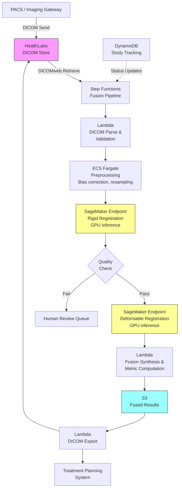

# Recipe 9.10: Multi-Modal Imaging Fusion and Analysis

**Complexity:** Complex · **Phase:** Specialized Clinical · **Estimated Cost:** ~$2.50–$8.00 per fusion study

---

## The Problem

A radiation oncologist is planning treatment for a patient with a brain tumor. She has an MRI showing the tumor's soft tissue boundaries with exquisite detail. She has a CT scan showing the bony anatomy and providing the electron density data needed for dose calculations. She has a PET scan showing metabolic activity, highlighting which parts of the tumor are most aggressive. Each image tells part of the story. None tells the whole story.

Right now, she's mentally fusing these images in her head. She pulls up the MRI on one monitor, the CT on another, scrolls through both simultaneously, and tries to hold the spatial relationships in working memory while drawing treatment contours. Sometimes she uses the planning system's rigid registration tool, which aligns the images based on bony landmarks, but it struggles when the patient's head was positioned slightly differently between scans. The soft tissue deformation between the MRI and CT means the tumor boundary on one doesn't perfectly overlay the tumor boundary on the other.

This isn't just a radiation oncology problem. Neurosurgeons fuse MRI with functional imaging (fMRI, DTI) to plan approaches that avoid eloquent cortex. Cardiologists overlay PET perfusion maps on CT angiography to correlate anatomy with function. Orthopedic surgeons combine MRI (soft tissue) with CT (bone) for complex joint reconstructions. Interventional radiologists fuse pre-procedure CT with real-time ultrasound for needle guidance.

The common thread: each imaging modality captures different physical properties of tissue, and clinical decisions require integrating information across modalities. Manual fusion is slow, subjective, and limited by human spatial reasoning. Automated fusion is a registration problem, a segmentation problem, and an information synthesis problem all wrapped together.

The stakes are high. In radiation oncology, a 3mm registration error can mean the difference between irradiating tumor and irradiating healthy brain tissue. In surgical planning, misalignment between functional and structural imaging can lead to resection of tissue that controls speech or motor function. These aren't theoretical risks. They're the reason clinicians spend hours manually verifying automated registrations.

---

## The Technology: How Multi-Modal Fusion Works

### What "Fusion" Actually Means

Image fusion is the process of spatially aligning two or more images acquired from different modalities (or the same modality at different times) so that corresponding anatomical structures overlap. Once aligned, the images can be viewed together, analyzed jointly, or used to create composite representations that combine information from each source.

The fundamental challenge: different modalities image different physical properties. CT measures X-ray attenuation (electron density). MRI measures hydrogen proton relaxation times (which vary by tissue type and sequence parameters). PET measures radiotracer uptake (metabolic activity). Ultrasound measures acoustic impedance differences. These produce images with completely different contrast patterns, resolutions, and geometric properties.

A structure that appears bright on T1-weighted MRI might appear dark on T2-weighted MRI and be invisible on CT. The same tumor might have sharp boundaries on contrast-enhanced MRI but fuzzy, heterogeneous uptake on PET. Aligning these images requires finding spatial correspondences despite having no direct intensity relationship between modalities.

### Registration: The Core Problem

Image registration is the mathematical process of finding the spatial transformation that maps points in one image (the "moving" image) to corresponding points in another (the "fixed" or "reference" image). This transformation can be:

**Rigid registration:** Six degrees of freedom (three translations, three rotations). Assumes the anatomy doesn't deform between scans. Works well for the brain (enclosed in a rigid skull) and poorly for the abdomen (which deforms with breathing, bowel motion, and patient positioning).

**Affine registration:** Twelve degrees of freedom (adds scaling and shearing to rigid). Handles some global shape differences but still assumes the transformation is uniform across the image.

**Deformable (non-rigid) registration:** Potentially millions of degrees of freedom. Models local tissue deformation with a displacement field that can vary at every voxel. Required for abdominal organs, the breast, and any anatomy that changes shape between acquisitions. Much harder to compute, much harder to validate, and much easier to produce physically implausible results (like folding tissue through itself).

The optimization problem: find the transformation parameters that maximize some similarity metric between the transformed moving image and the fixed image. For same-modality registration (CT to CT), you can use simple metrics like sum of squared differences or normalized cross-correlation. For cross-modality registration (MRI to CT), you need metrics that don't assume a linear intensity relationship. Mutual information is the classic choice: it measures statistical dependence between image intensities without assuming any particular functional relationship.

### Deep Learning Approaches

Classical registration algorithms (iterative optimization of a similarity metric) are slow. A single deformable registration can take minutes to hours depending on image size and deformation complexity. Deep learning has changed this dramatically.

**Learning-based registration** trains a neural network to predict the transformation directly from the input image pair. The network sees thousands of image pairs during training and learns to predict displacement fields in a single forward pass (under a second on a GPU). The dominant architecture is a U-Net variant that takes the concatenated fixed and moving images as input and outputs a dense displacement field.

The tradeoff: learned registration is fast but less flexible than classical optimization. It works well within the distribution of anatomy it was trained on and can fail unpredictably on unusual cases. Most production systems use a hybrid approach: a learned method for initial alignment followed by classical refinement for precision.

**Segmentation-guided registration** uses organ or structure segmentations to constrain the registration. If you know where the liver is in both images, you can ensure the registration maps liver to liver. This prevents the common failure mode where the optimizer finds a mathematically optimal but anatomically nonsensical alignment.

### Fusion Strategies Beyond Alignment

Once images are registered, you need to decide how to combine the information:

**Overlay/blending:** Display one modality as a color overlay on another. PET-CT is the classic example: the CT provides anatomical context in grayscale, and the PET metabolic activity is overlaid as a color map. Simple, interpretable, and the standard clinical workflow.

**Feature-level fusion:** Extract features (edges, textures, regions) from each modality and combine them into a composite representation. Useful for automated analysis where you want a single input that captures information from all modalities.

**Decision-level fusion:** Run separate analysis pipelines on each modality and combine the results. For example, segment the tumor on MRI and measure its metabolic activity on PET independently, then combine the spatial extent from MRI with the activity gradient from PET.

**Attention-based fusion:** Use neural attention mechanisms to learn which modality is most informative at each spatial location. The network learns that MRI is more reliable for soft tissue boundaries while CT is more reliable for bony landmarks, and weights accordingly.

### What Makes This Genuinely Hard

**Temporal mismatch.** Images are rarely acquired simultaneously. A PET-CT is acquired on the same scanner in the same session (the patient doesn't move between scans), but an MRI might be acquired days or weeks earlier. The tumor may have grown. The patient may have lost weight. Edema may have changed. You're registering anatomy that has genuinely changed, not just been imaged differently.

**Resolution mismatch.** MRI might have 1mm isotropic resolution. PET might have 4-5mm resolution. CT might have 0.5mm in-plane but 3mm slice thickness. Fusing these requires resampling to a common grid, and every resampling operation introduces interpolation artifacts. You can't create information that wasn't in the original acquisition.

**Field of view mismatch.** The MRI might cover only the brain. The CT might cover head to mid-thigh. The PET might cover skull base to thighs. Fusion only works in the overlapping region, and determining that overlap automatically is non-trivial.

**Validation is expensive.** How do you know your registration is correct? Ground truth requires expert annotation of corresponding landmarks across modalities, which is time-consuming and subjective. A 2mm registration error might be clinically acceptable for treatment planning but unacceptable for stereotactic surgery. The acceptable error depends on the clinical use case, and there's no universal standard.

**Deformable registration can hallucinate.** A sufficiently flexible deformation field can map any image to any other image. Without regularization constraints (smoothness, invertibility, volume preservation), the optimizer will happily fold tissue through itself or create physically impossible deformations to maximize the similarity metric. Detecting these failures requires biomechanical plausibility checks that add complexity.

---

## General Architecture Pattern

```
[Image Ingestion] → [Preprocessing] → [Registration] → [Fusion/Synthesis] → [Clinical Delivery]
```

**Image Ingestion:** Receive images from multiple modalities, typically via DICOM from PACS. Parse metadata (modality, acquisition parameters, patient positioning, slice geometry). Validate that images belong to the same patient and are suitable for fusion (sufficient overlap, acceptable time gap).

**Preprocessing:** Convert to a common coordinate system using DICOM header geometry. Apply modality-specific preprocessing: bias field correction for MRI, scatter correction for PET, Hounsfield unit calibration for CT. Resample to a common voxel grid if needed. Skull-strip brain images to remove non-brain tissue that confuses registration.

**Registration:** Align images spatially. Typically a cascade: rigid alignment first (fast, robust), then affine refinement, then deformable registration if needed. Compute quality metrics (target registration error on landmarks, Dice overlap of segmented structures) to validate the result. Flag cases where registration quality is below threshold for human review.

**Fusion/Synthesis:** Combine registered images according to the clinical use case. This might be simple overlay for visualization, feature extraction for automated analysis, or composite volume generation for treatment planning. Generate derived measurements (e.g., metabolic tumor volume from PET within MRI-defined boundaries).

**Clinical Delivery:** Push fused results back to clinical systems. For treatment planning, export registered volumes in the planning system's expected format. For diagnostic review, generate DICOM-compatible fused series that display in standard PACS viewers. For surgical navigation, export to the navigation system's coordinate framework.

---

## The AWS Implementation

### Why These Services

**Amazon SageMaker for registration model hosting.** Registration models (especially deep learning-based ones) require GPU inference. SageMaker provides managed endpoints with GPU instances, automatic scaling, and model versioning. For batch processing (overnight registration of the day's studies), SageMaker Processing Jobs or Batch Transform handle the workload without maintaining persistent GPU instances. The model artifacts (trained registration networks, atlas templates) live in S3 and deploy to endpoints on demand.

**Amazon S3 for DICOM storage and intermediate results.** Medical images are large (a single CT volume can be 500MB; a PET-CT study with both modalities is 1-2GB). S3 provides durable, encrypted storage with lifecycle policies to manage the cost of retaining intermediate processing results. The DICOM files arrive here from the clinical PACS, and fused results stage here before delivery back to clinical systems.

**AWS Step Functions for pipeline orchestration.** The fusion pipeline has multiple sequential stages with conditional logic (skip deformable registration if rigid alignment is sufficient; route to human review if quality metrics fail). Step Functions provides visual workflow orchestration with built-in error handling, retries, and timeout management. Each step can invoke a different compute resource (Lambda for lightweight tasks, SageMaker for GPU inference, ECS for memory-intensive preprocessing).

**AWS Lambda for lightweight processing steps.** DICOM parsing, metadata validation, quality metric computation, and result formatting are all short-lived, CPU-bound tasks that fit Lambda's execution model. Lambda handles the orchestration glue between heavier compute steps.

**Amazon ECS (Fargate) for preprocessing.** Bias field correction, resampling, and skull stripping require medical imaging libraries (SimpleITK, ANTs, FreeSurfer) with significant memory requirements (8-16GB for large volumes). Fargate tasks with appropriate memory allocation handle these without managing EC2 instances.

**Amazon DynamoDB for study tracking and metadata.** Track the state of each fusion request: which images have arrived, registration status, quality metrics, review status. DynamoDB's key-value model fits the access pattern (lookup by study ID, scan by status).

**Amazon HealthLake (DICOM store) for standards-compliant image management.** HealthLake provides a managed DICOMweb interface for storing and retrieving medical images with HIPAA compliance built in. It handles the DICOM-specific concerns (metadata indexing, study/series/instance hierarchy) that would otherwise require a custom PACS integration layer.

### Architecture Diagram



### Prerequisites

| Requirement | Details |
|-------------|---------|
| **AWS Services** | Amazon SageMaker, Amazon S3, AWS Step Functions, AWS Lambda, Amazon ECS (Fargate), Amazon DynamoDB, Amazon HealthLake |
| **IAM Permissions** | `sagemaker:InvokeEndpoint`, `s3:GetObject`, `s3:PutObject`, `ecs:RunTask`, `states:StartExecution`, `dynamodb:PutItem`, `dynamodb:GetItem`, `healthlake:*` (scoped to DICOM datastore) |
| **BAA** | AWS BAA signed (required: medical images are PHI) |
| **Encryption** | S3: SSE-KMS; DynamoDB: encryption at rest; HealthLake: AWS-managed encryption; all transit over TLS; SageMaker endpoints in VPC |
| **VPC** | Production: all compute in VPC with VPC endpoints for S3, DynamoDB, SageMaker, ECR, CloudWatch Logs. SageMaker endpoints in private subnets. No public internet access for PHI-processing components. |
| **CloudTrail** | Enabled: log all API calls for HIPAA audit trail |
| **GPU Instances** | SageMaker endpoints: ml.g4dn.xlarge minimum for inference; ml.p3.2xlarge for training. Request quota increase in advance. |
| **Sample Data** | Public datasets: TCIA (The Cancer Imaging Archive) provides multi-modality studies. BraTS challenge data for brain tumor MRI. Never use real patient images in dev without IRB approval and proper de-identification. |
| **Cost Estimate** | SageMaker GPU endpoint: ~$0.736/hr (g4dn.xlarge); per-study processing: ~$2.50-$8.00 depending on modality count and deformation complexity. S3 storage: ~$0.023/GB/month. Step Functions: negligible at clinical volumes. |

### Ingredients

| AWS Service | Role |
|------------|------|
| **Amazon SageMaker** | Hosts registration models (rigid + deformable) on GPU endpoints; runs training jobs for site-specific model fine-tuning |
| **Amazon S3** | Stores raw DICOM, preprocessed volumes, intermediate registration results, and final fused outputs |
| **AWS Step Functions** | Orchestrates the multi-stage fusion pipeline with conditional branching and error handling |
| **AWS Lambda** | Handles DICOM parsing, metadata validation, quality metric computation, result formatting |
| **Amazon ECS (Fargate)** | Runs memory-intensive preprocessing (bias correction, resampling, skull stripping) with medical imaging libraries |
| **Amazon DynamoDB** | Tracks study state, registration quality metrics, and review status |
| **Amazon HealthLake** | Provides DICOMweb-compliant storage and retrieval for source and fused images |
| **AWS KMS** | Manages encryption keys for all data stores |
| **Amazon CloudWatch** | Monitors pipeline latency, registration quality metrics, failure rates |

### Code

#### Walkthrough

**Step 1: Study ingestion and validation.** When images arrive from the clinical PACS, the system identifies which studies belong together for fusion. A radiation oncology treatment planning workflow might require a CT (for dose calculation), a T1-weighted MRI with contrast (for tumor delineation), and a PET (for metabolic targeting). The system validates that all required modalities are present, that they belong to the same patient, and that the acquisition dates are within an acceptable window. Skip this step and you risk fusing images from different patients (a never-event) or fusing images acquired so far apart that anatomy has changed significantly.

```
FUNCTION ingest_and_validate(study_request):
    // A fusion request specifies which modalities are needed and acceptable parameters.
    // Example: { patient_id: "P12345", required_modalities: ["CT", "MR", "PT"],
    //            max_temporal_gap_days: 30, clinical_context: "radiation_planning" }
    
    required_modalities = study_request.required_modalities
    patient_id          = study_request.patient_id
    max_gap_days        = study_request.max_temporal_gap_days
    
    // Query the DICOM store for available studies matching this patient
    available_studies = query DICOM store for patient_id
                        filtered by modality in required_modalities
                        ordered by acquisition_date descending
    
    // Select the most recent study for each required modality
    selected_studies = empty map
    FOR each modality in required_modalities:
        candidates = filter available_studies where modality matches
        IF candidates is empty:
            RETURN error: "Missing required modality: {modality}"
        selected_studies[modality] = candidates[0]  // most recent
    
    // Validate temporal coherence: all studies within acceptable window
    dates = [study.acquisition_date for study in selected_studies.values()]
    IF (max(dates) - min(dates)) > max_gap_days:
        RETURN error: "Temporal gap exceeds {max_gap_days} days. 
                       Clinical review required before fusion."
    
    // Validate patient identity across all studies (defense against mismatch)
    patient_ids = unique set of patient identifiers across selected_studies
    IF length(patient_ids) > 1:
        RETURN error: "Patient ID mismatch across modalities. Aborting."
    
    // Create tracking record
    fusion_id = generate unique identifier
    write to tracking database:
        fusion_id       = fusion_id
        patient_id      = patient_id
        studies         = selected_studies
        status          = "VALIDATED"
        created_at      = current UTC timestamp
    
    RETURN fusion_id, selected_studies
```

**Step 2: Modality-specific preprocessing.** Each imaging modality has artifacts that must be corrected before registration can succeed. MRI suffers from bias field inhomogeneity (smooth intensity variations caused by RF coil sensitivity patterns) that makes the same tissue type appear different intensities in different parts of the image. PET images need attenuation correction and may need partial volume correction. CT needs Hounsfield unit verification. All modalities need resampling to a common voxel grid. This step also performs skull stripping for brain studies (removing non-brain tissue that would confuse the registration algorithm). Skip preprocessing and your registration will converge to a suboptimal solution because the similarity metric is corrupted by artifacts.

```
FUNCTION preprocess_for_fusion(study_map, target_resolution, body_region):
    // target_resolution: desired isotropic voxel size in mm (e.g., 1.0)
    // body_region: "brain", "thorax", "abdomen", "pelvis" (determines preprocessing steps)
    
    preprocessed = empty map
    
    FOR each modality, study in study_map:
        // Load DICOM series into a 3D volume with proper spatial orientation
        volume = load_dicom_series(study.series_path)
        
        // Reorient to standard anatomical orientation (RAS: Right-Anterior-Superior)
        // Different scanners store images in different orientations.
        // Registration requires consistent orientation as a starting point.
        volume = reorient_to_standard(volume, target_orientation="RAS")
        
        IF modality == "MR":
            // Bias field correction: remove smooth intensity inhomogeneity
            // N4ITK algorithm estimates and removes the multiplicative bias field.
            // Without this, the same white matter appears bright near the coil
            // and dark far from it, confusing intensity-based registration.
            volume = apply_n4_bias_correction(volume, 
                         shrink_factor=4,       // process at lower resolution for speed
                         convergence_threshold=0.001,
                         max_iterations=[50, 50, 30, 20])  // multi-resolution cascade
            
            // Intensity normalization: scale to standard range [0, 1]
            // Different MRI scanners produce different intensity scales.
            // Normalization ensures the registration metric behaves consistently.
            volume = normalize_intensity(volume, method="z_score_with_clipping",
                         clip_percentiles=[1, 99])  // clip extreme outliers
        
        IF modality == "PT":  // PET
            // Convert to SUV (Standardized Uptake Value) if not already
            // SUV normalizes for injected dose and patient weight,
            // making values comparable across patients and time points.
            volume = convert_to_suv(volume, 
                         injected_dose=study.metadata.injected_dose_bq,
                         patient_weight_kg=study.metadata.patient_weight,
                         scan_time=study.metadata.acquisition_time,
                         injection_time=study.metadata.injection_time)
        
        IF modality == "CT":
            // Verify Hounsfield unit calibration
            // Air should be approximately -1000 HU, water approximately 0 HU.
            // Miscalibrated CT breaks dose calculation in radiation planning.
            air_hu = measure_air_region(volume)
            IF abs(air_hu - (-1000)) > 50:
                log warning: "CT HU calibration suspect. Air region measures {air_hu} HU."
        
        // Resample to target isotropic resolution
        // Different modalities have different native resolutions.
        // Registration requires a common voxel grid.
        volume = resample_to_isotropic(volume, 
                     target_spacing_mm=target_resolution,
                     interpolation="bspline" if modality != "PT" else "linear")
                     // BSpline for high-res modalities; linear for PET to avoid
                     // ringing artifacts in low-resolution, noisy images
        
        IF body_region == "brain":
            // Skull stripping: remove non-brain tissue
            // Bone, skin, and air confuse brain registration algorithms
            // because they have high contrast but aren't clinically relevant.
            brain_mask = compute_brain_mask(volume, modality=modality)
            volume = apply_mask(volume, brain_mask)
        
        preprocessed[modality] = volume
    
    RETURN preprocessed
```

**Step 3: Cascaded registration.** Registration proceeds in stages from coarse to fine. Rigid registration handles gross misalignment (different head positions between scans). Affine registration corrects for scaling differences (slightly different fields of view or magnification). Deformable registration handles local tissue deformation (brain shift, organ motion, tumor growth between scans). Each stage initializes from the previous stage's result, progressively refining the alignment. The cascade approach is more robust than jumping directly to deformable registration, which can get trapped in local optima if the initial alignment is poor.

```
FUNCTION register_to_reference(fixed_image, moving_image, body_region, clinical_context):
    // fixed_image: the reference (typically CT for radiation planning)
    // moving_image: the image to be aligned (e.g., MRI, PET)
    // Returns: registered_image, transformation, quality_metrics
    
    // Stage 1: Rigid registration
    // Find the 6-parameter rigid transform (3 translations + 3 rotations)
    // that best aligns the moving image to the fixed image.
    // Uses mutual information as similarity metric (works across modalities).
    rigid_transform = compute_rigid_registration(
        fixed       = fixed_image,
        moving      = moving_image,
        metric      = "mutual_information",
        optimizer   = "gradient_descent",
        multi_resolution_levels = 3,    // coarse-to-fine for robustness
        sampling_percentage     = 0.25  // sample 25% of voxels for speed
    )
    
    // Apply rigid transform to get initial alignment
    aligned_rigid = apply_transform(moving_image, rigid_transform)
    
    // Compute rigid registration quality
    rigid_quality = compute_registration_quality(
        fixed_image, aligned_rigid,
        metrics=["mutual_information", "landmark_error_if_available"]
    )
    
    // Stage 2: Affine refinement (if rigid quality is acceptable)
    IF rigid_quality.mutual_information > RIGID_QUALITY_THRESHOLD:
        affine_transform = compute_affine_registration(
            fixed       = fixed_image,
            moving      = aligned_rigid,
            metric      = "mutual_information",
            optimizer   = "gradient_descent",
            multi_resolution_levels = 2,
            initial_transform = identity  // already rigidly aligned
        )
        aligned_affine = apply_transform(aligned_rigid, affine_transform)
    ELSE:
        // Rigid registration failed. Don't proceed; flag for review.
        RETURN null, null, { status: "FAILED_RIGID", quality: rigid_quality }
    
    // Stage 3: Deformable registration (conditional on clinical need)
    // Brain-in-skull: rigid is often sufficient (skull constrains deformation)
    // Abdomen, breast, head-and-neck with weight change: deformable required
    IF requires_deformable(body_region, clinical_context):
        
        // Use deep learning model for fast initial deformation estimate
        displacement_field = predict_deformation_with_model(
            fixed  = fixed_image,
            moving = aligned_affine,
            model  = load_registration_model(body_region)
        )
        
        // Validate deformation plausibility
        jacobian = compute_jacobian_determinant(displacement_field)
        
        // Jacobian < 0 means tissue folding (physically impossible)
        // Jacobian very far from 1.0 means extreme compression/expansion
        IF min(jacobian) < 0:
            log warning: "Negative Jacobian detected. Deformation is physically implausible."
            // Fall back to classical optimization with stronger regularization
            displacement_field = compute_deformable_classical(
                fixed  = fixed_image,
                moving = aligned_affine,
                regularization_weight = 1.5,  // stronger smoothness constraint
                max_iterations = 200
            )
        
        aligned_final = apply_displacement_field(aligned_affine, displacement_field)
        
        final_quality = compute_registration_quality(
            fixed_image, aligned_final,
            metrics=["mutual_information", "dice_overlap_structures", 
                     "jacobian_statistics", "landmark_error_if_available"]
        )
        
        combined_transform = compose_transforms(
            rigid_transform, affine_transform, displacement_field)
        
        RETURN aligned_final, combined_transform, final_quality
    
    ELSE:
        // Rigid/affine sufficient for this case
        combined_transform = compose_transforms(rigid_transform, affine_transform)
        affine_quality = compute_registration_quality(
            fixed_image, aligned_affine,
            metrics=["mutual_information", "dice_overlap_structures"]
        )
        RETURN aligned_affine, combined_transform, affine_quality
```

**Step 4: Quality assessment and gating.** Registration quality must be validated before clinical use. A bad registration that looks plausible can lead to treatment of the wrong tissue. This step computes quantitative metrics and applies clinical-context-specific thresholds. Cases that fail quality checks are routed to a physicist or imaging specialist for manual verification. The thresholds are intentionally conservative: it's better to send a good registration for unnecessary review than to pass a bad registration to treatment planning.

```
FUNCTION assess_registration_quality(fixed, registered, transform, clinical_context):
    // Compute multiple complementary quality metrics
    metrics = {}
    
    // Mutual information: statistical measure of alignment quality
    // Higher is better. Normalized to [0, 1] range.
    metrics["nmi"] = compute_normalized_mutual_information(fixed, registered)
    
    // Structural similarity in overlapping regions
    metrics["ssim"] = compute_structural_similarity(fixed, registered,
                          mask=compute_overlap_mask(fixed, registered))
    
    // If segmentations are available, compute Dice overlap
    // This is the most clinically meaningful metric: do the structures align?
    IF segmentations_available(fixed, registered):
        fixed_segs     = segment_structures(fixed)
        registered_segs = segment_structures(registered)
        metrics["dice_per_structure"] = {}
        FOR each structure in fixed_segs:
            metrics["dice_per_structure"][structure] = 
                compute_dice(fixed_segs[structure], registered_segs[structure])
        metrics["mean_dice"] = mean(metrics["dice_per_structure"].values())
    
    // Deformation field statistics (if deformable registration was used)
    IF transform contains displacement_field:
        jacobian = compute_jacobian_determinant(transform.displacement_field)
        metrics["jacobian_min"]  = min(jacobian)
        metrics["jacobian_max"]  = max(jacobian)
        metrics["jacobian_std"]  = std(jacobian)
        metrics["folding_voxels"] = count(jacobian < 0)
    
    // Apply clinical-context-specific thresholds
    thresholds = get_quality_thresholds(clinical_context)
    // Example thresholds for radiation_planning:
    //   nmi > 0.7, mean_dice > 0.85, jacobian_min > 0.1, folding_voxels == 0
    
    passed = TRUE
    failure_reasons = []
    
    IF metrics["nmi"] < thresholds["nmi_min"]:
        passed = FALSE
        append to failure_reasons: "NMI below threshold ({metrics['nmi']} < {thresholds['nmi_min']})"
    
    IF "mean_dice" in metrics AND metrics["mean_dice"] < thresholds["dice_min"]:
        passed = FALSE
        append to failure_reasons: "Mean Dice below threshold"
    
    IF "folding_voxels" in metrics AND metrics["folding_voxels"] > 0:
        passed = FALSE
        append to failure_reasons: "Physically implausible deformation detected"
    
    RETURN {
        passed:          passed,
        metrics:         metrics,
        failure_reasons: failure_reasons,
        recommendation:  "APPROVE" if passed else "MANUAL_REVIEW_REQUIRED"
    }
```

**Step 5: Fusion synthesis and clinical output.** Once registration is validated, the system generates the fused output appropriate for the clinical use case. For radiation oncology, this means exporting the registered MRI and PET in the CT coordinate frame so the planning system can display all modalities simultaneously during contouring. For diagnostic review, it means generating a DICOM-compatible fused series. For quantitative analysis, it means computing derived metrics (metabolic tumor volume, heterogeneity indices) from the registered multi-modal data.

```
FUNCTION synthesize_fusion_output(registered_images, transforms, clinical_context, fusion_id):
    // registered_images: map of modality -> aligned volume (all in reference frame)
    // clinical_context determines what outputs to generate
    
    outputs = {}
    
    IF clinical_context == "radiation_planning":
        // Export each registered modality as a DICOM series in the CT coordinate frame
        // The treatment planning system needs standard DICOM RT objects
        reference_ct = registered_images["CT"]
        
        FOR each modality, volume in registered_images:
            IF modality == "CT":
                CONTINUE  // CT is already the reference; no export needed
            
            // Create DICOM series with geometry matching the reference CT
            // This ensures the planning system can overlay without re-registration
            dicom_series = create_dicom_series(
                volume          = volume,
                reference_geometry = reference_ct.geometry,
                modality_tag    = modality,
                series_description = "Registered {modality} for planning",
                patient_metadata = reference_ct.patient_metadata
            )
            outputs["{modality}_registered_dicom"] = dicom_series
        
        // Generate composite overlay for quick visual verification
        outputs["pet_ct_overlay"] = generate_color_overlay(
            background = registered_images["CT"],
            overlay    = registered_images["PT"],
            colormap   = "hot",           // standard PET colormap
            alpha      = 0.4,             // semi-transparent overlay
            threshold  = 2.5              // only show SUV > 2.5 (background suppression)
        )
    
    IF clinical_context in ["radiation_planning", "tumor_assessment"]:
        // Compute quantitative metrics from fused data
        // Metabolic tumor volume: PET activity within MRI-defined boundaries
        IF "MR" in registered_images AND "PT" in registered_images:
            tumor_mask = segment_tumor(registered_images["MR"], modality="MR")
            
            pet_within_tumor = apply_mask(registered_images["PT"], tumor_mask)
            
            outputs["quantitative_metrics"] = {
                "metabolic_tumor_volume_ml": compute_volume(tumor_mask),
                "suv_max":    max(pet_within_tumor),
                "suv_mean":   mean(pet_within_tumor where value > 0),
                "suv_peak":   compute_suv_peak(pet_within_tumor),  // 1cm sphere max mean
                "heterogeneity_index": std(pet_within_tumor) / mean(pet_within_tumor),
                "tumor_dimensions_mm": compute_3d_dimensions(tumor_mask)
            }
    
    // Store all outputs
    FOR each output_name, output_data in outputs:
        store to S3: "fusions/{fusion_id}/{output_name}"
    
    // Update tracking record
    update tracking database for fusion_id:
        status          = "COMPLETE"
        outputs         = list of output paths
        completed_at    = current UTC timestamp
    
    // Push DICOM outputs to clinical systems
    IF "registered_dicom" in any output_name:
        push_to_dicom_store(outputs, destination="clinical_pacs")
    
    RETURN outputs
```

> **Curious how this looks in Python?** The pseudocode above covers the concepts. If you'd like to see sample Python code that demonstrates these patterns using boto3, check out the [Python Example](chapter09.10-python-example). It walks through each step with inline comments and notes on what you'd need to change for a real deployment.

### Expected Results

**Sample output for a brain tumor PET-CT-MRI fusion:**

```json
{
  "fusion_id": "fusion-2026-05-15-brain-00847",
  "patient_id": "P00847",
  "clinical_context": "radiation_planning",
  "modalities_fused": ["CT", "MR_T1_contrast", "PET_FDG"],
  "reference_modality": "CT",
  "registration_quality": {
    "MR_to_CT": {
      "method": "rigid_plus_affine",
      "nmi": 0.82,
      "mean_dice": 0.91,
      "max_landmark_error_mm": 1.4
    },
    "PET_to_CT": {
      "method": "rigid_only",
      "nmi": 0.76,
      "notes": "PET-CT acquired on same scanner; rigid sufficient"
    }
  },
  "quantitative_metrics": {
    "metabolic_tumor_volume_ml": 34.2,
    "suv_max": 12.8,
    "suv_mean": 6.4,
    "suv_peak": 10.1,
    "heterogeneity_index": 0.52,
    "tumor_dimensions_mm": [42, 38, 35]
  },
  "outputs": [
    "fusions/fusion-2026-05-15-brain-00847/MR_registered_dicom/",
    "fusions/fusion-2026-05-15-brain-00847/PET_registered_dicom/",
    "fusions/fusion-2026-05-15-brain-00847/pet_ct_overlay/"
  ],
  "processing_time_seconds": 127,
  "status": "COMPLETE"
}
```

**Performance benchmarks:**

| Metric | Typical Value |
|--------|---------------|
| End-to-end latency (brain, rigid) | 60-90 seconds |
| End-to-end latency (abdomen, deformable) | 3-8 minutes |
| Rigid registration accuracy (brain) | 1-2mm target registration error |
| Deformable registration accuracy (abdomen) | 3-5mm target registration error |
| Deep learning registration inference | 0.5-2 seconds per pair (GPU) |
| Classical deformable registration | 5-30 minutes per pair (CPU) |
| Cost per fusion study | $2.50-$8.00 (GPU time + storage + compute) |
| Throughput | 50-100 studies/day per GPU endpoint |

**Where it struggles:** Significant weight loss between scans (the anatomy has genuinely changed shape). Large tumors that distort surrounding anatomy differently across time points. Abdominal studies with different respiratory phases (the liver can move 2-3cm between inspiration and expiration). Metal implants that create artifacts on CT but not MRI. And any case where the field of view overlap is minimal.

---

## Why This Isn't Production-Ready

The pseudocode demonstrates the pattern. Deploying this in a clinical radiation oncology department requires addressing:

**FDA regulatory pathway.** If the fusion output directly influences treatment decisions (which it does in radiation planning), the software may require FDA 510(k) clearance or De Novo classification. The regulatory pathway depends on the intended use claim and whether the system is making autonomous decisions or providing information to a clinician.

**Integration with treatment planning systems.** Clinical TPS (Varian Eclipse, Elekta Monaco, RayStation) have specific import requirements for registered image sets. The DICOM RT objects must conform to the TPS's expected structure, including proper frame-of-reference UIDs and registration object encoding.

**Physicist QA workflow.** Every registered image set used for treatment planning must be reviewed by a medical physicist before clinical use. The system needs to support this workflow: present the registration for review, capture the physicist's approval or rejection, and maintain an audit trail.

**Model validation per body site.** A registration model trained on brain data will not work for abdominal registration. Each body site requires its own trained model, its own validation dataset, and its own quality thresholds. This is a significant ongoing investment.

---

## The Honest Take

Multi-modal fusion is one of those problems where the 80% case is genuinely solved and the remaining 20% will keep you busy for years. Brain fusion with rigid registration works beautifully because the skull constrains everything. The moment you move below the neck, everything gets harder.

The part that surprised me most: temporal mismatch matters more than algorithmic sophistication. A perfect deformable registration algorithm applied to images acquired three weeks apart (during which the tumor grew 5mm) will produce a beautifully smooth, completely wrong result. The algorithm has no way to know that the anatomy has changed; it just finds the best spatial mapping between two snapshots. Building clinical workflows that flag temporal gaps and require explicit clinician acknowledgment is more important than improving registration accuracy by 0.5mm.

The quality assessment step is where most teams underinvest. It's tempting to compute a single metric (mutual information, Dice coefficient) and threshold it. In practice, you need multiple complementary metrics because each one has blind spots. A registration can have high mutual information while having a 5mm error in the region that matters clinically. Structure-specific Dice overlap is more meaningful but requires segmentation, which adds its own error. There's no single number that tells you "this registration is safe to use for treatment."

The deep learning registration models are genuinely impressive for speed (sub-second vs. minutes for classical methods) but they fail silently on out-of-distribution cases. A classical optimizer will at least converge slowly or not converge at all, giving you a signal that something is wrong. A learned model will confidently produce a displacement field that looks reasonable but is subtly incorrect. Always validate with independent metrics, never trust the model's own loss function as a quality indicator.

---

## Variations and Extensions

**Real-time intraoperative fusion.** Combine pre-operative MRI with intraoperative ultrasound for surgical navigation. The challenge shifts from batch processing to real-time performance (registration must complete in under 2 seconds to be useful during surgery). Requires specialized hardware (GPU in the OR) and simplified registration models that sacrifice some accuracy for speed. Brain shift during surgery means the pre-operative MRI becomes progressively less accurate as the procedure continues.

**Longitudinal fusion for treatment response.** Register the same patient's images across multiple time points (baseline, mid-treatment, post-treatment) to quantify tumor response. This requires consistent registration to a common reference frame across all time points, and the ability to measure volume and metabolic changes with sub-centimeter precision. Particularly valuable for immunotherapy response assessment where RECIST criteria (based on single-dimension measurements) miss complex response patterns.

**AI-assisted contouring from fused data.** Once images are registered, use the multi-modal information to drive automated tumor segmentation. A model that sees both the MRI (soft tissue contrast) and PET (metabolic activity) simultaneously can produce more accurate contours than one operating on either modality alone. This is an active research area with promising results in head-and-neck and lung cancer.

---

## Related Recipes

- **Recipe 9.5 (Chest X-Ray Triage):** Simpler single-modality analysis; contrast with the multi-modality complexity here
- **Recipe 9.7 (Radiology AI Triage, Multi-Modality):** Handles multiple modalities for triage but without spatial registration
- **Recipe 9.8 (Pathology Slide Analysis):** Shares the challenge of very large images requiring specialized processing pipelines
- **Recipe 12.8 (Disease Progression Trajectory Modeling):** Longitudinal fusion feeds into progression modeling for treatment response assessment
- **Recipe 14.3 (Radiation Therapy Treatment Planning Optimization):** Consumes the fused outputs from this recipe for dose optimization

---

## Additional Resources

**AWS Documentation:**
- [Amazon SageMaker Inference Endpoints](https://docs.aws.amazon.com/sagemaker/latest/dg/deploy-model.html)
- [Amazon HealthLake Imaging](https://docs.aws.amazon.com/healthlake/latest/devguide/what-is-amazon-healthlake.html)
- [AWS Step Functions Developer Guide](https://docs.aws.amazon.com/step-functions/latest/dg/welcome.html)
- [AWS HIPAA Eligible Services](https://aws.amazon.com/compliance/hipaa-eligible-services-reference/)
- [Amazon SageMaker Pricing](https://aws.amazon.com/sagemaker/pricing/)

**Public Datasets and Research Resources:**
- [The Cancer Imaging Archive (TCIA)](https://www.cancerimagingarchive.net/): Multi-modality cancer imaging datasets for development and validation
- [BraTS Challenge](https://www.med.upenn.edu/cbica/brats/): Brain tumor segmentation challenge with multi-sequence MRI data
- [AAPM Grand Challenges](https://www.aapm.org/GrandChallenge/): Medical physics challenges including registration tasks

**AWS Solutions and Blogs:**
- [AWS for Health: Medical Imaging](https://aws.amazon.com/health/solutions/medical-imaging/): Overview of AWS medical imaging capabilities
- [Architecting for HIPAA on AWS](https://docs.aws.amazon.com/whitepapers/latest/architecting-hipaa-security-and-compliance-on-aws/welcome.html): Compliance architecture patterns for healthcare workloads

<!-- TODO: Verify if aws-samples has any medical image registration or DICOM processing repos worth linking -->

---

## Estimated Implementation Time

| Tier | Timeline | What You Get |
|------|----------|--------------|
| **Basic** | 8-12 weeks | Rigid registration pipeline for brain PET-CT fusion with manual quality review |
| **Production-ready** | 6-9 months | Multi-body-site support, deformable registration, automated QA, TPS integration, physicist review workflow |
| **With variations** | 12-18 months | Real-time intraoperative fusion, longitudinal tracking, AI-assisted contouring from fused data |

---

## Tags

`computer-vision` · `medical-imaging` · `image-registration` · `multi-modal` · `fusion` · `radiation-oncology` · `treatment-planning` · `sagemaker` · `step-functions` · `healthlake` · `complex` · `gpu` · `hipaa` · `fda-considerations`

---

*← [Recipe 9.9: Surgical Video Analysis](chapter09.09-surgical-video-analysis) · [Chapter 9 Index](chapter09-index) · [Next: Chapter 10 →](chapter10-preface)*
