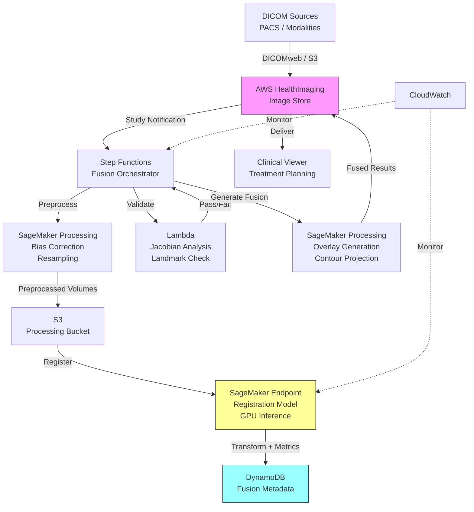

# Recipe 9.10: Multi-Modal Imaging Fusion and Analysis

**Complexity:** Complex · **Phase:** Research/Production Hybrid · **Estimated Cost:** ~$2.50-8.00 per fusion study

---

## The Problem

A radiation oncologist is planning treatment for a brain tumor. She's looking at an MRI that shows the tumor's soft tissue boundaries with exquisite detail. She's looking at a PET scan that shows metabolic activity, revealing which parts of the tumor are most aggressively growing. She's looking at a CT scan that gives her the electron density map she needs for radiation dose calculations. Three modalities. Three separate images. Three different coordinate systems. Three different resolutions. And she needs to mentally fuse them into a single coherent picture to draw the treatment volume.

This is not a hypothetical. This is Tuesday in radiation oncology.

The human brain is remarkably good at mental fusion when the images are presented side-by-side. But "remarkably good" is not "precise enough for millimeter-accurate radiation targeting." When you're delivering 60 Gray of radiation to a volume that sits 3mm from the optic nerve, "I eyeballed the alignment" is not an acceptable answer. The difference between a well-aligned fusion and a poorly-aligned one can be the difference between preserving someone's vision and destroying it.

Multi-modal imaging fusion isn't limited to radiation oncology, though that's where the stakes are most obvious. Neurosurgeons combine functional MRI (showing active brain regions) with structural MRI (showing anatomy) to plan surgical approaches that avoid eloquent cortex. Cardiologists combine echocardiography with CT angiography. Orthopedic surgeons overlay weight-bearing X-rays with MRI to understand both bone alignment and soft tissue damage. Interventional radiologists fuse pre-procedure CT with real-time fluoroscopy for needle guidance.

In every case, the core problem is the same: different imaging modalities capture different physical properties of the body. No single modality tells the whole story. The clinical question demands combining them. And combining them accurately is a genuine computer science challenge that most clinicians assume "just works" until it doesn't.

Let's talk about why it's hard, and what you can build.

---

## The Technology: Image Registration and Fusion

### What Multi-Modal Imaging Actually Means

Different medical imaging modalities measure fundamentally different physical properties:

- **CT (Computed Tomography):** Measures X-ray attenuation. Excellent for bone, calcification, and providing electron density for dose calculations. Fast acquisition. Well-defined geometry.
- **MRI (Magnetic Resonance Imaging):** Measures hydrogen proton relaxation properties. Extraordinary soft tissue contrast. Multiple sequence types (T1, T2, FLAIR, diffusion-weighted, functional) each highlighting different tissue properties. Slower acquisition, geometric distortion possible.
- **PET (Positron Emission Tomography):** Measures metabolic activity via radiotracer uptake. Shows where cells are most active. Low spatial resolution (4-6mm typically) but high functional specificity. Usually acquired simultaneously with CT (PET-CT) or MRI (PET-MRI).
- **SPECT (Single Photon Emission CT):** Similar to PET but different physics. Shows perfusion, receptor binding. Even lower resolution.
- **Ultrasound:** Real-time, no radiation, highly operator-dependent. Measures acoustic impedance differences. Good for soft tissue and flow (Doppler).
- **Fluoroscopy/X-ray:** Real-time projection imaging. Used during procedures for guidance.

Each of these lives in its own coordinate space, has its own resolution, its own field of view, and its own geometric characteristics. A PET voxel might be 4mm cubed while the corresponding MRI voxel is 1mm cubed. The patient was in a different position for each scan. They were breathing differently. They may have been scanned days apart, and the anatomy actually changed (tumor growth, weight loss, surgical intervention between scans).

### The Registration Problem

Image registration is the process of finding the spatial transformation that aligns one image to another. It's the mathematical foundation of fusion.

Think of it this way: you have two photographs of the same building taken from different angles. To overlay them, you need to figure out the geometric transformation (rotation, translation, maybe warping) that maps points in one image to corresponding points in the other. Medical image registration is the 3D version of this problem, with some nasty additional complications.

**Rigid registration** assumes the anatomy didn't deform between scans. Six parameters: three translations (x, y, z shifts) and three rotations (roll, pitch, yaw). This works well for the brain (the skull is rigid) and reasonably well for any bony anatomy. It fails badly for the abdomen, where the liver can shift centimeters between scans depending on breathing phase.

**Affine registration** adds scaling and shearing. Nine to twelve parameters. Useful when the imaging geometry itself introduces distortions (some MRI sequences have geometric distortion that's well-modeled by an affine transform).

**Deformable (non-rigid) registration** allows arbitrary local warping. Each voxel can move independently (within smoothness constraints). This is what you need for soft tissues that change shape between scans. It's also where things get computationally expensive and where registration errors become harder to detect. A deformable registration can "succeed" mathematically (the images look well-aligned) while being physically wrong (it warped anatomy in an anatomically impossible way).

### Similarity Metrics: How Do You Know When Images Are Aligned?

Here's the subtle problem. When you're registering two CT scans, you can use straightforward metrics like sum of squared differences or cross-correlation, because the same anatomy produces similar pixel values in both images. But when you're registering a CT to an MRI, bone appears bright in CT and dark in most MRI sequences. The same anatomy looks completely different. You can't just compare pixel values.

**Mutual Information (MI)** is the standard solution. It measures the statistical dependence between two images without assuming any particular relationship between their intensities. The insight is beautiful: when the images are correctly aligned, knowing the value of one voxel in image A tells you something about the value of the corresponding voxel in image B. When they're misaligned, that statistical relationship weakens. You maximize MI to find the best alignment.

MI works across modalities because it doesn't care whether the relationship is "bright in A means bright in B" or "bright in A means dark in B." It just needs a consistent relationship. This made multi-modal registration practical when it was introduced in the 1990s, and it remains the gold standard.

**Deep learning-based registration** is the newer approach. Rather than optimizing a similarity metric iteratively for each image pair, you train a neural network that directly predicts the transformation given two input images. This can be dramatically faster (a single forward pass instead of hundreds of optimization iterations), but it requires training data and may generalize poorly to unusual anatomy. The field is actively evolving.

### Fusion Visualization

Once registered, you need to actually display the combined information. Common approaches:

- **Overlay/blend:** One image as base, second overlaid with transparency. Simple but lossy; you can't see both well simultaneously.
- **Checkerboard:** Alternating tiles from each modality. Good for verifying registration quality at boundaries.
- **Color fusion:** Map different modalities to different color channels (e.g., PET to red/yellow heat map overlaid on grayscale CT). The standard PET-CT display.
- **Contour overlay:** Extract contours or segmentations from one modality and project them onto another. Radiation therapy planning lives here.
- **Synchronized linked views:** Side-by-side display with cursor synchronization. Moving through one image automatically shows the corresponding slice in the other.

### What Makes Multi-Modal Fusion Genuinely Hard

**Temporal mismatch.** The patient was scanned on different days. The tumor grew. They lost weight. They had surgery between scans. Deformable registration can accommodate some of this, but there's a fundamental question: are you trying to align anatomy that has actually changed? At some point registration becomes biologically meaningless.

**Resolution mismatch.** PET has 4-6mm resolution. MRI might be 0.5mm. Upsampling the PET to match doesn't create information that wasn't there. Downsampling the MRI throws away information you paid for. The clinical display needs to honestly represent what each modality actually resolves.

**Geometric distortion.** MRI near metal implants, at field boundaries, or with certain sequences can have spatial distortions of several millimeters. If you register a distorted MRI to an accurate CT, the "aligned" result may look right globally but be locally inaccurate.

**Validation.** How do you know the registration worked? For rigid brain registration, you can verify against skull landmarks. For deformable abdominal registration, there's no ground truth. The clinician just has to look at it and decide whether it's reasonable. That's uncomfortable when treatment decisions depend on it.

**Computational cost.** Deformable registration of high-resolution 3D volumes is computationally intensive. Full 3D deformable registration can take minutes to hours on CPU. GPU acceleration helps enormously but requires appropriate infrastructure.

### The General Architecture Pattern

```text
[Multi-Modal Image Acquisition]
    ↓
[DICOM Ingestion and Routing]
    ↓
[Preprocessing per Modality]
    ↓ (resampling, orientation normalization, bias correction)
[Registration Engine]
    ↓ (rigid → affine → deformable)
[Transformation Validation]
    ↓ (landmark checks, Jacobian analysis, clinical review)
[Fusion Generation]
    ↓ (overlay, color mapping, contour projection)
[Clinical Delivery]
    ↓ (viewer, treatment planning system, PACS)
[Storage and Audit]
```

The pipeline is inherently sequential: you can't fuse images that aren't registered, and you can't register images that haven't been preprocessed into compatible formats. But within each stage, there's opportunity for parallelism (preprocessing multiple modalities simultaneously, for instance).

---

## The AWS Implementation

### Why These Services

**Amazon S3 for DICOM storage.** Medical images are large (a single MRI study can be hundreds of megabytes; a PET-CT study can exceed a gigabyte). S3 provides durable, encrypted storage with lifecycle policies for managing retention. The hierarchical object structure maps naturally to DICOM's Patient > Study > Series > Instance hierarchy.

**Amazon SageMaker for registration model hosting.** Deformable registration using deep learning models requires GPU inference. SageMaker endpoints provide auto-scaling GPU instances with health monitoring. For traditional optimization-based registration, SageMaker Processing jobs give you ephemeral GPU compute without maintaining persistent infrastructure.

**AWS Step Functions for pipeline orchestration.** The multi-stage pipeline (ingest, preprocess, register, validate, fuse, deliver) has branching logic (different preprocessing per modality), retry requirements, and needs to handle both synchronous clinical workflows and batch research pipelines. Step Functions provides visual workflow management and built-in error handling.

**Amazon DynamoDB for registration metadata.** Each fusion job generates metadata: which studies were fused, what transformation parameters were computed, validation metrics, clinical approval status. DynamoDB provides fast key-value lookups for real-time status queries and handles the write patterns of a high-throughput imaging pipeline.

**AWS HealthImaging for medical image management.** AWS HealthImaging (formerly Amazon HealthLake Imaging) provides a purpose-built medical imaging store with DICOM support, sub-second image retrieval, and native integration with the AWS ecosystem. It handles the DICOM protocol complexity and provides APIs for pixel-level access.

**Amazon CloudWatch for monitoring and alerting.** Registration failures, quality threshold violations, and processing latency need real-time visibility. CloudWatch metrics and alarms catch problems before clinicians are affected.

### Architecture Diagram



### Prerequisites

| Requirement | Details |
|-------------|---------|
| AWS Services | S3, SageMaker, Step Functions, Lambda, DynamoDB, HealthImaging, CloudWatch, IAM, KMS |
| IAM Permissions | sagemaker:InvokeEndpoint, sagemaker:CreateProcessingJob, s3:GetObject, s3:PutObject, dynamodb:PutItem, dynamodb:GetItem, states:StartExecution, medical-imaging:* |
| BAA | Required. All services processing PHI must be covered under your AWS BAA. |
| Encryption | S3 SSE-KMS for images. DynamoDB encryption at rest. TLS 1.2+ in transit. SageMaker endpoint encryption. |
| VPC | Production deployment in VPC with private subnets. VPC endpoints for S3, DynamoDB, SageMaker. No public internet access for PHI-handling components. |
| CloudTrail | Enabled for all API calls. Log access to patient imaging data for HIPAA audit requirements. |
| Sample Data | Public datasets: BraTS (brain tumor MRI), TCIA (various modalities). Never use real patient data in development. |
| Cost Estimate | ~$2.50-8.00 per fusion study depending on volume size and registration complexity. GPU inference dominates cost. |
| GPU Requirements | ml.g4dn.xlarge minimum for inference; ml.p3.2xlarge for training registration models |

### Ingredients

| AWS Service | Role in This Recipe |
|-------------|-------------------|
| AWS HealthImaging | DICOM storage, retrieval, and lifecycle management |
| Amazon S3 | Intermediate processing storage, model artifacts |
| Amazon SageMaker | Registration model training, GPU inference endpoints, processing jobs |
| AWS Step Functions | Multi-stage pipeline orchestration with error handling |
| AWS Lambda | Lightweight validation, metadata updates, notifications |
| Amazon DynamoDB | Fusion job metadata, transformation parameters, audit trail |
| Amazon CloudWatch | Pipeline monitoring, latency tracking, quality alerts |
| AWS KMS | Encryption key management for PHI at rest |

### Code (Pseudocode Walkthrough)

#### Step 1: Ingest and Identify Study Pairs

When imaging studies arrive, we need to identify which studies should be fused together. This is typically driven by clinical orders (a radiation therapy plan ordered "PET-CT fusion with MRI") or by automated rules (same patient, complementary modalities, acquired within a clinically relevant time window).

If you skip this: Studies would be processed in isolation, defeating the entire purpose of fusion. Clinicians would manually have to specify which studies to combine, adding friction.

```pseudocode
// Triggered when new study arrives in HealthImaging
FUNCTION identify_fusion_candidates(new_study):
    patient_id = new_study.patient_id
    modality = new_study.modality  // CT, MR, PT, etc.
    acquisition_date = new_study.acquisition_date
    
    // Look for complementary studies within clinical time window
    candidate_studies = QUERY imaging_store WHERE
        patient_id = patient_id AND
        modality IN complementary_modalities(modality) AND
        acquisition_date WITHIN 30_days OF acquisition_date AND
        fusion_status != "completed"
    
    // Check for active fusion orders in treatment planning system
    active_orders = QUERY treatment_planning_system WHERE
        patient_id = patient_id AND
        order_type = "image_fusion" AND
        status = "pending"
    
    FOR EACH candidate IN candidate_studies:
        IF matches_clinical_order(new_study, candidate, active_orders):
            CREATE fusion_job(
                primary_study: determine_primary(new_study, candidate),
                secondary_study: determine_secondary(new_study, candidate),
                fusion_type: determine_fusion_type(new_study, candidate),
                priority: get_clinical_priority(active_orders)
            )
    
    RETURN fusion_jobs_created
```

#### Step 2: Preprocess Each Modality

Each imaging modality requires different preprocessing before registration can succeed. MRI needs bias field correction (the RF coil creates non-uniform signal intensity). CT needs Hounsfield unit windowing. PET needs SUV normalization. All modalities need orientation standardization and potentially resampling to compatible voxel sizes.

If you skip this: Registration will fail or produce poor results. Bias field artifacts in MRI can confuse similarity metrics. Orientation mismatches will produce obviously wrong alignments. Resolution mismatches will force one modality to dictate the output resolution.

```pseudocode
FUNCTION preprocess_for_fusion(study, target_orientation, target_spacing):
    // Load DICOM series as 3D volume
    volume = load_dicom_series(study.series_uid)
    
    // Standardize orientation to common reference frame
    // (typically RAS: Right-Anterior-Superior)
    volume = reorient_to_standard(volume, target_orientation="RAS")
    
    // Modality-specific preprocessing
    IF study.modality == "MR":
        // N4 bias field correction removes RF inhomogeneity
        volume = n4_bias_correction(volume, iterations=50)
        // Normalize intensity to [0, 1] range
        volume = intensity_normalize(volume, method="z_score")
        
    ELSE IF study.modality == "CT":
        // Clip to clinically relevant HU range
        volume = clip_hounsfield(volume, min=-1024, max=3071)
        // Convert to normalized float
        volume = hounsfield_to_normalized(volume)
        
    ELSE IF study.modality == "PT":  // PET
        // Convert raw counts to SUV (Standardized Uptake Value)
        volume = calculate_suv(volume, 
            patient_weight=study.patient_weight,
            injected_dose=study.injected_dose,
            acquisition_time=study.acquisition_time)
    
    // Resample to isotropic voxels if needed
    // (registration works better with isotropic data)
    IF NOT is_isotropic(volume):
        volume = resample_isotropic(volume, 
            target_spacing=target_spacing,
            interpolation="bspline")  // Smooth interpolation for continuous data
    
    // Store preprocessed volume
    output_path = SAVE volume TO processing_bucket
    
    RETURN {
        "path": output_path,
        "dimensions": volume.shape,
        "spacing": volume.spacing,
        "origin": volume.origin,
        "direction": volume.direction_cosines
    }
```

#### Step 3: Execute Multi-Stage Registration

Registration proceeds from coarse to fine. Start with rigid registration (fast, robust) to get approximate alignment. Then refine with affine if needed. Finally, apply deformable registration for local precision. Each stage initializes from the previous stage's result.

If you skip this: Without coarse-to-fine, the optimization can get trapped in local minima (finding a wrong alignment that appears locally optimal). The multi-stage approach dramatically improves robustness at modest computational cost.

```pseudocode
FUNCTION register_multi_stage(fixed_volume, moving_volume, config):
    // Stage 1: Rigid registration
    // Fast. Finds global position/orientation match.
    // Uses mutual information for multi-modal compatibility.
    rigid_transform = rigid_registration(
        fixed=fixed_volume,
        moving=moving_volume,
        metric="mutual_information",
        optimizer="gradient_descent",
        sampling_percentage=0.1,  // Sample 10% of voxels for speed
        multi_resolution_levels=3,  // Coarse-to-fine within this stage
        max_iterations=200
    )
    
    // Apply rigid transform to get approximate alignment
    aligned_moving = apply_transform(moving_volume, rigid_transform)
    rigid_metric_value = compute_mutual_information(fixed_volume, aligned_moving)
    
    // Stage 2: Affine registration (if geometric distortion expected)
    IF config.include_affine:
        affine_transform = affine_registration(
            fixed=fixed_volume,
            moving=aligned_moving,
            metric="mutual_information",
            initial_transform=identity(),  // Already applied rigid
            max_iterations=100
        )
        aligned_moving = apply_transform(aligned_moving, affine_transform)
    
    // Stage 3: Deformable registration (if soft tissue precision needed)
    IF config.include_deformable:
        deformation_field = deformable_registration(
            fixed=fixed_volume,
            moving=aligned_moving,
            method=config.deformable_method,  // "bspline" or "demons" or "deep_learning"
            regularization_weight=config.regularization,  // Prevents folding
            grid_spacing=config.bspline_grid_spacing,  // e.g., 10mm control points
            max_iterations=300
        )
        aligned_moving = apply_deformation(aligned_moving, deformation_field)
    
    // Compose all transforms into single mapping
    composite_transform = compose_transforms(
        rigid_transform,
        affine_transform IF config.include_affine ELSE identity(),
        deformation_field IF config.include_deformable ELSE identity()
    )
    
    RETURN {
        "composite_transform": composite_transform,
        "rigid_metric": rigid_metric_value,
        "final_metric": compute_mutual_information(fixed_volume, aligned_moving),
        "aligned_volume": aligned_moving,
        "deformation_field": deformation_field IF config.include_deformable ELSE None
    }
```

#### Step 4: Validate Registration Quality

Registration can fail silently. The optimization converges, the metric looks reasonable, but the alignment is wrong. Validation catches these cases before the result reaches a clinician.

If you skip this: Clinicians may make treatment decisions based on incorrectly fused images. In radiation therapy, this could mean irradiating the wrong volume. The consequences are unacceptable.

```pseudocode
FUNCTION validate_registration(fixed, aligned_moving, transform, deformation_field):
    validation_results = {}
    
    // Check 1: Final similarity metric above threshold
    mi_value = compute_mutual_information(fixed, aligned_moving)
    validation_results["mutual_information"] = mi_value
    validation_results["mi_pass"] = mi_value > config.MI_THRESHOLD
    
    // Check 2: Jacobian determinant of deformation field
    // Negative Jacobian = topology violation (folding)
    // Very small Jacobian = extreme compression (suspicious)
    IF deformation_field IS NOT None:
        jacobian_map = compute_jacobian_determinant(deformation_field)
        min_jacobian = MIN(jacobian_map)
        negative_fraction = COUNT(jacobian_map < 0) / SIZE(jacobian_map)
        
        validation_results["min_jacobian"] = min_jacobian
        validation_results["negative_jacobian_fraction"] = negative_fraction
        validation_results["jacobian_pass"] = (
            min_jacobian > 0.01 AND  // No extreme compression
            negative_fraction < 0.001  // Less than 0.1% folding
        )
    
    // Check 3: Landmark-based validation (if landmarks available)
    IF anatomical_landmarks_available(fixed, aligned_moving):
        fixed_landmarks = detect_landmarks(fixed)
        moving_landmarks = detect_landmarks(aligned_moving)
        
        target_registration_error = compute_TRE(
            fixed_landmarks, moving_landmarks)
        
        validation_results["mean_TRE_mm"] = MEAN(target_registration_error)
        validation_results["max_TRE_mm"] = MAX(target_registration_error)
        validation_results["TRE_pass"] = MEAN(target_registration_error) < config.TRE_THRESHOLD_MM
    
    // Check 4: Deformation magnitude reasonableness
    IF deformation_field IS NOT None:
        max_displacement = MAX(magnitude(deformation_field))
        mean_displacement = MEAN(magnitude(deformation_field))
        
        validation_results["max_displacement_mm"] = max_displacement
        validation_results["mean_displacement_mm"] = mean_displacement
        validation_results["displacement_pass"] = max_displacement < config.MAX_DISPLACEMENT_MM
    
    // Overall pass/fail
    all_checks = [v for k, v in validation_results IF k.endswith("_pass")]
    validation_results["overall_pass"] = ALL(all_checks)
    validation_results["requires_clinical_review"] = NOT ALL(all_checks)
    
    RETURN validation_results
```

#### Step 5: Generate Fused Visualization

With validated registration, generate the fused output products that clinicians will actually use. This varies by clinical context: radiation oncology wants contour overlays; diagnostic radiology wants color fusion; surgical planning wants 3D renderings.

If you skip this: Clinicians get raw aligned volumes without visual integration. They can still view them side-by-side with cursor synchronization, but they lose the intuitive combined display that makes multi-modal information immediately actionable.

```pseudocode
FUNCTION generate_fusion_outputs(fixed, aligned_moving, clinical_context):
    outputs = []
    
    // Color overlay (standard PET-CT style)
    IF "color_overlay" IN clinical_context.requested_outputs:
        overlay = create_color_overlay(
            base=fixed,  // Typically CT or structural MRI (grayscale)
            overlay=aligned_moving,  // Typically PET or functional (color map)
            colormap="hot",  // Yellow-red for metabolic activity
            alpha=0.4,  // 40% overlay opacity
            threshold=clinical_context.overlay_threshold  // Hide low-activity voxels
        )
        outputs.APPEND({"type": "color_overlay", "data": overlay})
    
    // Contour projection (radiation therapy planning)
    IF "contour_projection" IN clinical_context.requested_outputs:
        // Segment structures on the modality where they're best seen
        tumor_contour = segment_on_modality(
            volume=aligned_moving,  // e.g., tumor best seen on MRI
            structure="GTV",  // Gross Tumor Volume
            method="deep_learning_segmentation"
        )
        
        // Project contours onto planning CT
        projected = project_contours(
            contours=tumor_contour,
            target_volume=fixed,  // Planning CT
            transform=inverse_transform(composite_transform)
        )
        outputs.APPEND({"type": "contour_overlay", "data": projected})
    
    // Generate DICOM RT Structure Set (for treatment planning systems)
    IF "rt_structure" IN clinical_context.requested_outputs:
        rt_struct = create_dicom_rt_structure(
            contours=tumor_contour,
            reference_series=fixed.series_uid,
            structure_name="GTV_PET_MRI_Fusion",
            color=[255, 0, 0]  // Red
        )
        outputs.APPEND({"type": "rt_structure", "data": rt_struct})
    
    // Checkerboard for QA
    checkerboard = create_checkerboard(fixed, aligned_moving, tile_size=20)
    outputs.APPEND({"type": "qa_checkerboard", "data": checkerboard})
    
    RETURN outputs
```

#### Step 6: Deliver and Audit

Push results to clinical systems and maintain a complete audit trail. In radiation therapy, this means sending the fused dataset and structure sets to the treatment planning system. In diagnostic radiology, it means making the fused display available in the PACS viewer.

```pseudocode
FUNCTION deliver_fusion_results(fusion_job, outputs, validation):
    // Store all outputs to HealthImaging / PACS
    FOR EACH output IN outputs:
        IF output.type == "rt_structure":
            SEND output.data TO treatment_planning_system VIA DICOM
        ELSE:
            STORE output.data IN health_imaging_store
            LINK output TO original_studies  // Maintain provenance
    
    // Record complete audit trail
    audit_record = {
        "job_id": fusion_job.id,
        "timestamp": NOW(),
        "patient_id": fusion_job.patient_id,
        "primary_study": fusion_job.primary_study.uid,
        "secondary_study": fusion_job.secondary_study.uid,
        "registration_method": fusion_job.config.method,
        "validation_metrics": validation,
        "transform_parameters": fusion_job.transform,  // Full reproducibility
        "clinical_approval": "pending",
        "output_locations": [o.storage_path FOR o IN outputs]
    }
    
    STORE audit_record IN dynamodb TABLE fusion_audit
    
    // Notify clinical team
    IF validation.overall_pass:
        NOTIFY clinician "Fusion complete and validated. Ready for review."
    ELSE:
        NOTIFY clinician "Fusion complete but validation flags raised. Manual review required."
        NOTIFY physicist "Registration QA needed for job " + fusion_job.id
    
    RETURN audit_record
```

> **Curious how this looks in Python?** The pseudocode above covers the concepts. If you'd like to see sample Python code that demonstrates these patterns using boto3, check out the [Python Example](chapter09.10-python-example). It walks through each step with inline comments and notes on what you'd need to change for a real deployment.

### Expected Results

Sample fusion job output:

```json
{
  "job_id": "fusion-2026-0604-brain-001",
  "patient_id": "P-REDACTED",
  "fusion_type": "PET-CT_to_MRI",
  "primary_modality": "MRI_T1_post_contrast",
  "secondary_modality": "FDG_PET_CT",
  "registration": {
    "method": "rigid_then_bspline",
    "stages_completed": ["rigid", "bspline_deformable"],
    "final_mutual_information": 1.47,
    "mean_TRE_mm": 1.2,
    "max_TRE_mm": 2.8,
    "max_displacement_mm": 4.1,
    "min_jacobian": 0.62,
    "processing_time_seconds": 34.7
  },
  "validation": {
    "overall_pass": true,
    "mi_pass": true,
    "jacobian_pass": true,
    "TRE_pass": true,
    "displacement_pass": true
  },
  "outputs": [
    {"type": "color_overlay", "format": "DICOM", "series_uid": "1.2.826..."},
    {"type": "contour_overlay", "format": "DICOM_RT", "series_uid": "1.2.826..."},
    {"type": "qa_checkerboard", "format": "PNG", "path": "s3://..."}
  ],
  "clinical_approval_status": "pending_review"
}
```

**Performance benchmarks:**

| Metric | Rigid Only | Rigid + Deformable | Deep Learning |
|--------|-----------|-------------------|---------------|
| Processing time | 5-15 seconds | 30-120 seconds | 2-8 seconds |
| Mean TRE (brain) | 2-4 mm | 1-2 mm | 1.5-3 mm |
| Mean TRE (abdomen) | 8-15 mm | 3-6 mm | 4-8 mm |
| GPU memory | N/A (CPU ok) | 4-8 GB | 8-16 GB |
| Cost per study | ~$0.50 | ~$2.50-5.00 | ~$1.00-2.00 |

**Where it struggles:**

- Large anatomical changes between scans (post-surgical, significant weight change)
- Organs with independent motion (bowel, bladder filling differences)
- Very low-resolution source modalities (SPECT) aligned to high-resolution targets
- Regions with no structural correspondence (air-filled cavities that changed shape)
- Patient motion during acquisition creating intra-scan inconsistencies

---

## The Honest Take

Multi-modal image fusion is one of those problems where the 80% case works brilliantly and the 20% edge cases will consume most of your engineering time. Brain registration is nearly a solved problem for clinical purposes (the skull constrains things beautifully). Abdominal registration is still an active research area, and anyone who tells you they've solved it generically is oversimplifying.

The hardest part isn't the registration algorithm. It's building the validation pipeline that catches bad registrations before they reach clinicians. A registration can "converge" mathematically and still be wrong in ways that matter clinically. The Jacobian check catches topology violations, but it won't catch a registration that's smooth and plausible but just... off by 5mm in the wrong direction.

I'd also be honest about the clinical adoption challenge. Many radiologists and radiation oncologists already have fusion tools in their existing PACS or treatment planning systems. What they typically lack is automation, batch processing, and quality monitoring at scale. If your value proposition is "we do fusion," you're competing with well-established tools. If your value proposition is "we do fusion automatically when the studies arrive, validate the results, flag problems, and present everything ready for clinical sign-off," that's different. That's a workflow improvement, not a technology replacement.

The deep learning registration models are exciting but immature for clinical deployment. They're fast, but their failure modes are poorly characterized. When a traditional iterative registration fails, it usually fails obviously (the metric doesn't converge). When a deep learning registration fails, it can fail subtly (it produces a plausible-looking result that's wrong in ways you wouldn't notice without ground truth). For treatment planning applications where millimeters matter, I'd still use traditional methods with deep learning as a fast initialization or screening tool.

One more thing: the regulatory landscape here is evolving. If your fusion results directly influence treatment planning (radiation fields, surgical margins), you may be building a medical device under FDA regulation. If you're just providing a visualization aid, the regulatory burden is lighter. Know which category you're in before you build.

---

## Variations and Extensions

### 1. Real-Time Intraoperative Fusion

Combine pre-operative MRI/CT with intraoperative imaging (ultrasound, fluoroscopy, or intraoperative CT) for surgical navigation. This adds real-time constraints: registration must complete in seconds, and the patient's anatomy is actively deforming due to surgical manipulation (brain shift during craniotomy, for example). Requires surface-based or feature-based fast registration rather than full volumetric approaches.

### 2. Longitudinal Fusion for Treatment Response Assessment

Register the same modality across time points (pre-treatment, mid-treatment, post-treatment) to quantify change. The challenge shifts from multi-modal alignment to handling actual anatomical change (tumor shrinkage, edema resolution) while maintaining spatial correspondence for the surrounding normal tissue. Useful for RECIST measurements, radiation therapy adaptive replanning, and clinical trial response assessment.

### 3. AI-Augmented Fusion with Automatic Segmentation

Layer automatic segmentation on top of fusion: register PET-CT to MRI, then automatically segment the tumor on each modality, then combine the segmentation results into a consensus volume. This approaches the "auto-contouring" problem in radiation therapy, where the fusion-plus-segmentation pipeline could reduce clinical contouring time significantly. Regulatory pathway is more complex (now you're producing clinical contours, not just aligned images).

---

## Related Recipes

- **Recipe 9.5 (Chest X-Ray Triage):** Simpler single-modality analysis. Understanding the single-modality pipeline helps before adding multi-modal complexity.
- **Recipe 9.7 (Radiology AI Triage, Multi-Modality):** Handles multiple modalities at the routing/triage level, while this recipe fuses them at the pixel level.
- **Recipe 9.8 (Pathology Slide Analysis):** Shares the challenge of processing extremely large images (gigapixel pathology vs. high-resolution 3D volumes).
- **Recipe 12.8 (Disease Progression Trajectory Modeling):** Longitudinal fusion connects naturally to trajectory modeling when tracking treatment response over time.

---

## Additional Resources

### AWS Documentation

- AWS HealthImaging Developer Guide: https://docs.aws.amazon.com/healthimaging/
- Amazon SageMaker Processing Jobs: https://docs.aws.amazon.com/sagemaker/latest/dg/processing-job.html
- Amazon SageMaker Real-time Inference: https://docs.aws.amazon.com/sagemaker/latest/dg/realtime-endpoints.html
- AWS Step Functions Developer Guide: https://docs.aws.amazon.com/step-functions/latest/dg/welcome.html
- AWS HIPAA Eligible Services: https://aws.amazon.com/compliance/hipaa-eligible-services-reference/

### Frameworks and Tools

- SimpleITK Registration Documentation: https://simpleitk.readthedocs.io/en/master/registrationOverview.html
- ANTs (Advanced Normalization Tools): http://stnava.github.io/ANTs/
- 3D Slicer Registration Modules: https://www.slicer.org/wiki/Documentation/Nightly/Modules/BRAINSFit
- MONAI (Medical Open Network for AI): https://monai.io/
- TODO: Verify current VoxelMorph repository URL for deep learning registration

### Clinical Context

- AAPM Task Group 132: Image Registration in Radiation Therapy (guidance on clinical registration quality standards)
- ACR Practice Parameter for Image Registration: https://www.acr.org/Clinical-Resources/Practice-Parameters-and-Technical-Standards
- DICOM Supplement 219: Spatial Registration Storage SOP Classes

---

## Estimated Implementation Time

| Phase | Duration | Notes |
|-------|----------|-------|
| Basic (rigid registration, single modality pair) | 4-6 weeks | DICOM pipeline, rigid registration, basic overlay |
| Production-ready (multi-stage, validation, clinical delivery) | 12-16 weeks | Deformable registration, QA pipeline, PACS integration, clinical validation |
| With variations (real-time, longitudinal, auto-segmentation) | 20-30 weeks | GPU infrastructure, deep learning models, FDA regulatory considerations |

---

## Tags

`computer-vision` `medical-imaging` `image-registration` `multi-modal` `fusion` `radiation-therapy` `treatment-planning` `dicom` `sagemaker` `healthimaging` `gpu-compute` `complex`

---

**Navigation:**
← [9.9: Surgical Video Analysis](chapter09.09-surgical-video-analysis) | [Chapter 9 Index](chapter09-index) | [Chapter 10: Speech / Voice AI →](chapter10-preface)
